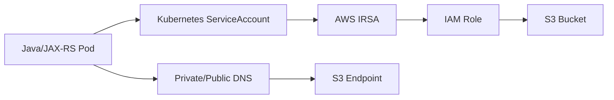
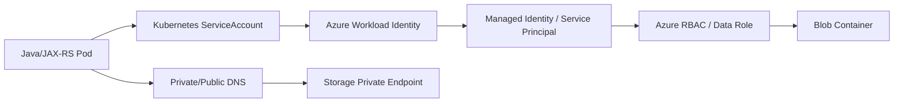

# Part 002 — AWS vs Azure Mental Model

> Fokus part ini adalah translasi konsep. Banyak istilah AWS dan Azure terlihat mirip, tetapi boundary, lifecycle, ownership, dan failure mode-nya tidak selalu sama. Untuk senior backend engineer, kesalahan mapping bisa berubah menjadi salah desain network, salah permission, salah billing boundary, atau salah asumsi production isolation.

Part ini tidak mencoba membuat Anda hafal seluruh layanan. Tujuannya adalah memberi peta mental agar saat membaca architecture diagram, Terraform, Kubernetes manifest, IAM/RBAC policy, atau incident notes, Anda tahu “konsep ini hidup di layer mana dan apa konsekuensinya untuk aplikasi Java/JAX-RS”.

---

## 1. High-level comparison

| Area | AWS | Azure | Cara berpikir praktis |
|---|---|---|---|
| Top-level business/resource boundary | AWS account | Azure subscription | Boundary billing, quota, access, dan resource placement penting |
| Multi-account/subscription governance | AWS Organizations | Azure Management Groups | Untuk struktur enterprise, policy inheritance, dan governance |
| Resource grouping | Account + tags + optional Resource Groups | Resource Group | Azure Resource Group lebih eksplisit sebagai lifecycle grouping |
| Identity system | AWS IAM | Microsoft Entra ID + Azure RBAC | Azure memisahkan directory identity dan resource authorization lebih eksplisit |
| Network boundary | VPC | VNet | Sama-sama private network virtual, detail routing/security berbeda |
| Network filtering | Security Group + NACL | NSG + ASG + Azure Firewall | Jangan mapping SG = NSG secara sempurna; semantics berbeda |
| DNS | Route 53 | Azure DNS / Private DNS Zone | Private endpoint DNS behavior sangat penting |
| Load balancing | ALB / NLB / ELB | Azure Load Balancer / Application Gateway / Front Door | Pilih berdasarkan layer 4/7, private/public, WAF, ingress integration |
| API gateway | AWS API Gateway | Azure API Management | API product/security/governance layer, bukan sekadar ingress |
| Container registry | ECR | ACR | Image auth, private access, scanning, retention, promotion |
| Object storage | S3 | Blob Storage | Bucket/container, object/blob, policy, lifecycle, signing URL berbeda |
| Observability | CloudWatch / X-Ray awareness | Azure Monitor / Log Analytics / Application Insights awareness | Perlu disambungkan dengan app logs/traces/metrics |
| Kubernetes | EKS | AKS | Managed Kubernetes dengan integrasi network/identity/cloud berbeda |
| Secret/config | Secrets Manager, SSM, AppConfig | Key Vault, App Configuration | Secret/config lifecycle dan runtime identity harus jelas |

---

## 2. AWS account vs Azure subscription

### 2.1 AWS account

AWS account adalah container formal untuk resource AWS. Account punya ID unik, billing context, IAM boundary, resource boundary, dan service quota. Dalam enterprise, account sering dipakai untuk memisahkan:

- production
- non-production
- sandbox
- shared services
- networking
- security/logging
- workload tertentu
- customer/tenant tertentu jika isolation membutuhkan boundary kuat

Practical model:

```text
AWS Organization
  ├── Management account
  ├── Security / Logging account
  ├── Network account
  ├── Shared services account
  ├── Dev workload account
  ├── Test workload account
  └── Prod workload account
```

Untuk backend engineer, account boundary menjawab:

- service berjalan di account mana?
- dependency berada di account yang sama atau berbeda?
- apakah perlu cross-account IAM role?
- apakah VPC peering/Transit Gateway/PrivateLink lintas account?
- log/audit dikirim ke account mana?
- quota account cukup?
- siapa yang boleh deploy ke account tersebut?

### 2.2 Azure subscription

Azure subscription adalah boundary untuk billing, quota, resource placement, dan access scope. Resource Azure dibuat di dalam subscription, biasanya dikelompokkan lagi ke resource group.

Practical model:

```text
Azure Tenant / Microsoft Entra ID
  └── Management Groups
      ├── Platform
      │   ├── Connectivity subscription
      │   ├── Identity subscription
      │   └── Management subscription
      ├── Landing Zones
      │   ├── Dev subscription
      │   ├── Test subscription
      │   └── Prod subscription
      └── Sandbox subscriptions
```

Untuk backend engineer, subscription boundary menjawab:

- resource aplikasi berada di subscription mana?
- VNet, AKS, database, Key Vault, dan Log Analytics berada di subscription yang sama atau berbeda?
- role assignment diberikan di scope apa: management group, subscription, resource group, atau resource?
- quota subscription cukup?
- cost allocated ke siapa?
- policy apa yang inherited dari management group?

### 2.3 Mapping caveat

AWS account dan Azure subscription sering dibandingkan, tetapi tidak identik.

| Concern | AWS account | Azure subscription |
|---|---|---|
| Resource container | Ya | Ya |
| Billing boundary | Ya | Ya |
| Quota boundary | Ya, service-specific | Ya, service-specific |
| Identity system | IAM di account, bisa federation | Entra tenant terpisah dari subscription |
| Governance hierarchy | AWS Organizations/OUs/SCP | Management Groups/Azure Policy/RBAC |
| Resource grouping inside boundary | Tags, naming, optional resource groups | Resource Groups sangat sentral |

Kesalahan umum:

```text
“Migrasi dari AWS account ke Azure subscription tinggal mapping satu lawan satu.”
```

Yang lebih benar:

```text
Mapping harus mempertimbangkan identity tenant, management group policy, resource group lifecycle, VNet topology, private DNS, quota, cost, dan operational ownership.
```

---

## 3. AWS Organizations vs Azure Management Groups

### 3.1 AWS Organizations

AWS Organizations dipakai untuk mengelola banyak AWS account secara terpusat. Ia membantu:

- membuat/memberi struktur account
- grouping account dalam Organizational Unit
- consolidated billing
- service control policies
- governance lintas account

Mental model:

```text
Organization = enterprise control boundary
OU           = grouping policy boundary
Account      = workload/resource boundary
SCP          = guardrail policy boundary
```

Backend impact:

- meskipun IAM role di account mengizinkan action, SCP bisa tetap memblokir action
- deployment pipeline bisa gagal karena guardrail organisasi
- service tertentu bisa tidak boleh dipakai di account workload
- cross-account integration perlu trust dan governance approval

### 3.2 Azure Management Groups

Azure Management Groups memberi hierarchy di atas subscription untuk policy dan access management. Ini berguna ketika enterprise punya banyak subscription dan ingin menerapkan governance secara konsisten.

Mental model:

```text
Management Group = governance hierarchy
Subscription     = resource/billing/quota boundary
Resource Group   = lifecycle grouping
Resource         = actual service instance
```

Backend impact:

- policy di management group bisa mencegah resource dibuat
- region tertentu bisa diblokir
- public IP bisa dilarang
- tag wajib bisa dipaksa
- SKU tertentu bisa tidak diizinkan
- role assignment bisa inherited dari parent scope

### 3.3 Review questions

Saat PR/IaC menyentuh account/subscription:

- Apakah resource dibuat di boundary yang benar?
- Apakah policy parent mengizinkan resource ini?
- Apakah environment separation cukup?
- Apakah logging/security account/subscription menerima audit?
- Apakah cost allocation jelas?
- Apakah ada shared services dependency?

---

## 4. AWS IAM vs Microsoft Entra ID vs Azure RBAC

Ini area yang sering membingungkan.

### 4.1 AWS IAM

AWS IAM mengelola authentication dan authorization untuk AWS resources. Entitas penting:

- IAM user
- IAM group
- IAM role
- IAM policy
- trust policy
- resource-based policy
- STS temporary credentials
- conditions

Practical mental model:

```text
Who can assume this role?
  → trust policy

What can this role do?
  → permission policy

On which resources?
  → resource ARN + condition
```

Contoh untuk EKS workload:

```text
Kubernetes ServiceAccount
  → projected OIDC token
  → STS AssumeRoleWithWebIdentity
  → IAM Role
  → permission to read S3/Secrets/etc.
```

### 4.2 Microsoft Entra ID

Microsoft Entra ID adalah identity provider/directory untuk users, groups, applications, service principals, managed identities, dan federation.

Entitas penting:

- user
- group
- app registration
- service principal
- managed identity
- federated credential
- conditional access awareness

### 4.3 Azure RBAC

Azure RBAC adalah authorization system untuk Azure resources melalui Azure Resource Manager. Role assignment menjawab:

```text
Who has what role at what scope?
```

Scope bisa:

```text
Management Group
  → Subscription
    → Resource Group
      → Resource
```

Principal bisa:

- user
- group
- service principal
- managed identity

### 4.4 Mapping caveat

| Concept | AWS | Azure |
|---|---|---|
| Human/user identity | IAM user atau federated identity | Entra user |
| Workload identity | IAM role, IRSA, instance profile | Managed identity, workload identity, service principal |
| Permission document | IAM policy JSON | Azure role definition / role assignment |
| Trust relationship | Trust policy | Federated credential / identity assignment / app trust model |
| Temporary credential | STS | OAuth token / managed identity token |
| Resource-level permission | ARN + condition | Scope + action/dataAction |

Kesalahan umum:

```text
“IAM Role sama dengan Azure Role.”
```

Lebih akurat:

```text
AWS IAM Role adalah assumable identity dengan trust policy dan permission policy.
Azure Role adalah permission definition/assignment pada scope tertentu. Workload identity-nya biasanya service principal atau managed identity.
```

---

## 5. AWS Region/AZ vs Azure Region/Availability Zone

### 5.1 AWS

AWS Region adalah area geografis terpisah. Availability Zone adalah lokasi terisolasi di dalam region. Subnet AWS selalu berada di satu Availability Zone.

Backend impact:

- subnet design harus mempertimbangkan AZ
- EKS node/pod IP capacity terkait subnet per AZ
- ALB/NLB target health lintas AZ penting
- RDS Multi-AZ memengaruhi failover
- cross-AZ traffic bisa berdampak pada cost/latency

### 5.2 Azure

Azure Region adalah area geografis tempat resource Azure dijalankan. Availability Zone adalah datacenter group terpisah dalam region yang mendukungnya. Tidak semua service/region memiliki dukungan zone yang sama.

Backend impact:

- AKS node pool bisa memanfaatkan zone jika region/SKU mendukung
- Azure Database/Cache/Load Balancer memiliki mode zonal atau zone-redundant tergantung service
- desain HA perlu mengecek support per service, bukan asumsi global

### 5.3 Mapping caveat

| Concern | AWS | Azure |
|---|---|---|
| Region | Separate geographic area | Geographic region |
| AZ | Isolated location in region | Independent datacenter group in region |
| Subnet-AZ relation | Subnet resides in one AZ | Subnet tidak dimodelkan identik seperti AWS subnet-per-AZ |
| Service zone support | Service-specific | Service-specific dan region-specific |

Pertanyaan review:

- Region mana yang dipakai dan kenapa?
- Apakah workload single-AZ, multi-AZ, zonal, atau zone-redundant?
- Apakah semua dependency mendukung availability target yang sama?
- Apakah failover sudah diuji?

---

## 6. AWS VPC vs Azure VNet

### 6.1 AWS VPC

Amazon VPC adalah virtual network terisolasi secara logis di AWS account. Di dalam VPC, Anda mengatur CIDR, subnet, route table, gateways, security group, NACL, endpoint, dan connectivity.

Mental model:

```text
VPC
  ├── public subnet in AZ A
  ├── private subnet in AZ A
  ├── public subnet in AZ B
  ├── private subnet in AZ B
  ├── route tables
  ├── internet gateway
  ├── NAT gateway
  ├── security groups
  ├── NACLs
  └── VPC endpoints / PrivateLink
```

### 6.2 Azure VNet

Azure VNet adalah private network di Azure yang memungkinkan resource Azure berkomunikasi satu sama lain, internet, dan on-premises network. Di dalam VNet, Anda mengatur address space, subnet, route table/UDR, NSG, private endpoint, peering, NAT Gateway, dan firewall path.

Mental model:

```text
VNet
  ├── subnet for AKS nodes/pods
  ├── subnet for private endpoints
  ├── subnet for application gateway
  ├── route tables / UDR
  ├── NSG
  ├── NAT Gateway
  ├── Azure Firewall path
  ├── VNet peering
  └── Private DNS Zone links
```

### 6.3 Mapping caveat

| Concern | AWS VPC | Azure VNet |
|---|---|---|
| Private network | VPC | VNet |
| Subnet | Subnet in one AZ | Subnet within VNet, zone semantics berbeda |
| Route table | Explicit association | System routes + UDR |
| Internet egress | IGW + NAT Gateway | System route + NAT Gateway/Azure Firewall depending design |
| Security filtering | Security Group + NACL | NSG + ASG + Azure Firewall |
| Private service access | VPC Endpoint/PrivateLink | Private Endpoint/Private Link |
| DNS private zone | Route 53 private hosted zone | Private DNS Zone |

Backend impact:

- Pod-to-database failure sering bukan bug Java, melainkan DNS/routing/security issue.
- Private endpoint membutuhkan DNS yang benar agar SDK tidak keluar ke public endpoint.
- Egress ke internet bisa lewat NAT/proxy/firewall dan memengaruhi cost serta latency.
- Subnet IP exhaustion bisa mencegah pod/node scale.

---

## 7. AWS resource tags vs Azure resource tags/resource groups

### 7.1 AWS tags

AWS tags adalah key-value metadata untuk resource. Tags umum dipakai untuk:

- cost allocation
- ownership
- environment
- automation
- security/compliance classification
- lifecycle management
- ABAC pattern

Contoh tag:

```yaml
Environment: prod
Application: quote-order
Owner: backend-platform
CostCenter: csg-xxx
DataClassification: confidential
ManagedBy: terraform
```

### 7.2 Azure tags

Azure tags juga key-value metadata untuk resource dan resource group. Tags dipakai untuk cost management, governance, automation, dan organization.

Azure juga punya resource group sebagai container lifecycle. Ini lebih kuat daripada sekadar tag.

### 7.3 Resource group mental model

Resource group adalah container untuk resource yang biasanya berbagi lifecycle.

Contoh:

```text
rg-quote-order-prod-aks
  ├── AKS cluster related resources
  ├── managed identities
  ├── private endpoints
  ├── diagnostic settings
  └── related app resources
```

Caveat:

- Jangan menaruh semua resource satu environment ke satu resource group besar tanpa lifecycle reasoning.
- Jangan memisah terlalu granular sampai ownership dan operation sulit.
- Beberapa managed resource AKS bisa dibuat di node resource group terpisah.

### 7.4 Tagging failure mode

- Cost tidak bisa dialokasikan.
- Resource owner tidak jelas saat incident.
- Automation salah target.
- Compliance evidence sulit dikumpulkan.
- Resource orphan tidak terdeteksi.
- Tag berisi data sensitif.

Rule:

```text
Tags are metadata, not secret storage.
```

---

## 8. AWS service endpoint vs Azure resource provider

### 8.1 AWS service endpoint

AWS service biasanya diakses melalui regional service endpoint. SDK perlu tahu region, credential, endpoint, dan signing behavior.

Contoh mental model:

```text
AWS SDK Client
  → region
  → credential provider chain
  → service endpoint
  → SigV4 request signing
  → AWS service API
```

Private endpoint awareness:

- Jika memakai VPC Endpoint/PrivateLink, DNS harus mengarah ke private IP.
- Endpoint override kadang diperlukan untuk local testing atau custom endpoint, tetapi harus hati-hati di production.

### 8.2 Azure resource provider

Azure Resource Manager mengelola resource melalui resource provider seperti:

- Microsoft.Compute
- Microsoft.Network
- Microsoft.ContainerService
- Microsoft.Storage
- Microsoft.KeyVault

Control plane operation melewati ARM/resource provider. Data plane operation bisa melewati endpoint service masing-masing, misalnya Blob endpoint atau Key Vault endpoint.

Mental model:

```text
Azure control plane:
  Client/CLI/Terraform → Azure Resource Manager → Resource Provider

Azure data plane:
  Application SDK → service endpoint/private endpoint → data operation
```

### 8.3 Backend impact

Untuk aplikasi Java:

- AWS SDK dan Azure SDK punya credential chain berbeda.
- Endpoint data plane bisa private walau control plane tetap melalui Azure/AWS management APIs.
- Access denied bisa berasal dari IAM/RBAC/resource policy/data-plane permission.
- Region/endpoint mismatch bisa muncul sebagai timeout, 403, 404, atau signature/auth error.

---

## 9. Naming convention

Naming bukan kosmetik. Naming membantu debugging, ownership, automation, cost, dan audit.

### 9.1 Naming dimensions

Nama resource sebaiknya memuat sebagian dari:

- organization/unit
- product/workload
- environment
- region
- resource type
- sequence/role
- criticality jika relevan

Contoh pattern generik:

```text
<org>-<product>-<env>-<region>-<resource>-<purpose>
```

Contoh non-internal:

```text
csg-quoteorder-prod-sea-aks-main
csg-quoteorder-prod-sea-kv-app
csg-quoteorder-prod-sea-vnet-spoke
csg-quoteorder-prod-sea-rg-runtime
```

Gunakan sebagai contoh konseptual, bukan klaim naming internal.

### 9.2 Bad naming symptoms

- Sulit tahu resource milik siapa.
- Sulit tahu environment.
- Banyak resource orphan.
- Incident response lambat.
- Automation pakai string matching rapuh.
- Cost allocation kacau.

### 9.3 Review questions

- Apakah nama resource konsisten?
- Apakah environment jelas?
- Apakah region jelas jika diperlukan?
- Apakah resource bisa dicari dari incident context?
- Apakah ada conflict dengan naming restriction provider?
- Apakah tags melengkapi naming?

---

## 10. Environment separation

Environment separation adalah desain boundary antar dev/test/staging/prod/sandbox.

### 10.1 Separation options

| Model | Kelebihan | Risiko |
|---|---|---|
| Same cluster, different namespace | Murah, mudah | Isolation lemah, blast radius besar |
| Different cluster, same account/subscription | Runtime lebih terpisah | IAM/network/cost masih campur |
| Different account/subscription | Boundary lebih kuat | Operasional lebih kompleks |
| Different region | DR/latency/compliance | Cost dan complexity lebih tinggi |
| Dedicated tenant/customer boundary | Strong isolation | Cost dan governance lebih berat |

### 10.2 Backend impact

Environment separation memengaruhi:

- database endpoint
- broker cluster
- Redis instance
- object storage bucket/container
- secret/config namespace
- IAM/RBAC role
- DNS name
- ingress host
- deployment approval
- observability workspace
- cost allocation

### 10.3 Anti-pattern

```text
Non-prod service punya permission ke prod secret/database karena role terlalu luas.
```

```text
Dev dan prod memakai bucket/container yang sama dengan prefix berbeda tetapi policy tidak cukup ketat.
```

```text
Prod dan staging berada di cluster yang sama tanpa NetworkPolicy/resource quota memadai.
```

---

## 11. AWS/Azure comparison checklist untuk backend engineer

Gunakan saat pertama kali membaca sistem.

### 11.1 Boundary

- AWS account apa atau Azure subscription apa?
- Environment dipisahkan di boundary apa?
- Apakah ada management group/OUs?
- Apakah ada shared services account/subscription?
- Apakah ada network account/subscription?

### 11.2 Network

- VPC/VNet mana?
- CIDR dan subnet mana?
- Public/private subnet separation bagaimana?
- Route table/UDR apa?
- Firewall/SG/NSG apa?
- Private endpoint/PrivateLink dipakai?
- DNS private zone apa?

### 11.3 Identity

- Workload identity apa?
- AWS IAM role atau Azure managed identity/service principal?
- Permission scope apa?
- Apakah temporary credential?
- Apakah ada static secret?
- Di mana audit log?

### 11.4 Runtime

- EKS atau AKS?
- Namespace apa?
- ServiceAccount apa?
- Ingress apa?
- Load balancer apa?
- Registry apa?
- Config/secret dari mana?

### 11.5 Dependency

- PostgreSQL managed atau self-managed?
- Kafka/RabbitMQ managed atau self-managed?
- Redis managed atau self-managed?
- Camunda deployment model apa?
- Object storage S3/Blob?
- API gateway/APIM?

### 11.6 Observability

- Logs di CloudWatch atau Azure Monitor/Log Analytics?
- Trace menggunakan OpenTelemetry/X-Ray/App Insights?
- Alert utama apa?
- Dashboard apa yang digunakan saat incident?
- Correlation ID standar?

### 11.7 Cost and governance

- Tags wajib apa?
- Cost center apa?
- Quota apa yang kritikal?
- NAT/logging/cross-AZ/cross-region cost dipantau?
- Policy-as-code apa?
- IaC source of truth di mana?

---

## 12. Example mapping: Java service reads object storage

### 12.1 AWS version



Key questions:

- Role apa yang di-assume pod?
- Bucket policy mengizinkan role tersebut?
- Region S3 client benar?
- Apakah akses lewat Gateway Endpoint/Interface Endpoint atau internet/NAT?
- Timeout/retry/pagination benar?
- Object encryption/key policy benar?

### 12.2 Azure version



Key questions:

- Workload identity/federated credential benar?
- Managed identity/service principal punya data-plane role?
- Storage account firewall/private endpoint benar?
- Private DNS zone ter-link ke VNet?
- SAS token dipakai atau identity-based access?
- Timeout/retry/pagination benar?

---

## 13. Example mapping: Java service reads secret

### 13.1 AWS

```text
Pod → ServiceAccount → IRSA → IAM Role → Secrets Manager/SSM SecureString
```

Failure modes:

- ServiceAccount annotation salah
- trust policy tidak cocok
- IAM policy tidak mengizinkan secret ARN
- secret version salah
- endpoint/DNS tidak reachable
- SDK credential chain salah

### 13.2 Azure

```text
Pod → ServiceAccount → Azure Workload Identity → Managed Identity/Service Principal → Key Vault
```

Failure modes:

- federated credential salah
- client ID salah
- role assignment/access policy tidak ada
- Key Vault firewall/private endpoint blocking
- private DNS salah
- token audience mismatch

Mapping lesson:

```text
Keduanya terlihat seperti “pod read secret”, tetapi identity path, policy model, endpoint model, dan audit trail berbeda.
```

---

## 14. Common wrong assumptions

### 14.1 “AWS IAM dan Azure RBAC sama”

Tidak. AWS IAM role adalah identity yang bisa di-assume. Azure RBAC adalah authorization assignment pada scope untuk principal seperti user, group, service principal, atau managed identity.

### 14.2 “VPC dan VNet sama persis”

Tidak. Keduanya private network virtual, tetapi subnet, routing, firewall, private endpoint, DNS, Kubernetes integration, dan service endpoint behavior berbeda.

### 14.3 “Resource group sama seperti AWS account”

Tidak. Resource group adalah lifecycle container di dalam subscription. AWS account lebih dekat ke Azure subscription sebagai boundary utama, tetapi mapping tetap tidak sempurna.

### 14.4 “Private endpoint cukup dibuat, DNS otomatis benar”

Belum tentu. Private endpoint tanpa DNS yang benar sering membuat aplikasi tetap mengarah ke public endpoint atau IP yang salah.

### 14.5 “Region sama berarti latency aman”

Belum tentu. Traffic path bisa melewati firewall, NAT, private endpoint, peering, cross-zone, proxy, atau external integration yang menambah latency.

### 14.6 “Cloud provider menangani semua DR”

Tidak. Provider menyediakan primitives, tetapi workload owner tetap harus mendesain backup, restore, failover, DNS cutover, consistency, dan runbook.

---

## 15. Failure model comparison

| Symptom | AWS kemungkinan | Azure kemungkinan | Debug direction |
|---|---|---|---|
| AccessDenied | IAM policy/trust/SCP/resource policy | RBAC scope/data role/conditional access/resource firewall | Audit log + identity chain |
| Pod cannot access storage | VPC endpoint/DNS/SG/IAM | Private Endpoint/DNS/NSG/RBAC | DNS + network + identity |
| Cannot scale pods/nodes | subnet IP/ENI/quota/node group | subnet IP/quota/node pool/VMSS | cluster events + quota |
| 502/503 ingress | ALB target group/health check/SG | App Gateway/backend pool/probe/NSG | LB logs + pod readiness |
| Registry pull failure | ECR auth/VPC endpoint/IAM | ACR auth/private endpoint/managed identity | kubelet events + registry logs |
| Logs missing | CloudWatch agent/permissions/log group | Azure Monitor agent/DCR/Log Analytics | agent + IAM/RBAC + ingestion |
| Deployment blocked | SCP/IAM/quota | Azure Policy/RBAC/quota | IaC plan + policy evaluation |

---

## 16. Impact to PostgreSQL, Kafka, RabbitMQ, Redis, Camunda, NGINX

### 16.1 PostgreSQL

AWS/Azure mapping matters for:

- private endpoint/private access
- security group/NSG
- DNS endpoint
- IAM/RBAC or password/secret model
- backup/PITR
- HA/failover
- maintenance window
- monitoring and logs

Backend concern:

- connection pool must tolerate failover
- DNS TTL matters
- TLS and certificate trust matter
- max connection and pool size must match

### 16.2 Kafka/RabbitMQ

Mapping matters for:

- managed vs self-managed broker
- private connectivity
- auth mechanism
- TLS
- broker endpoint DNS
- monitoring
- scaling
- retention
- upgrade model

Backend concern:

- producer retry/idempotency
- consumer lag
- duplicate message
- ordering assumptions
- backpressure

### 16.3 Redis

Mapping matters for:

- cluster mode
- private networking
- failover behavior
- AUTH/ACL
- TLS
- eviction policy
- scaling limit

Backend concern:

- cache miss storm
- connection pool exhaustion
- failover reconnect
- stale cache correctness

### 16.4 Camunda

Mapping matters for:

- database dependency
- job executor behavior
- external task worker connectivity
- message/event integration
- persistence/backup/restore
- deployment topology

Backend concern:

- workflow state consistency
- retry semantics
- incident visibility
- database latency

### 16.5 NGINX

Mapping matters for:

- ingress controller integration
- upstream service discovery
- TLS termination
- timeout chain
- client body size
- header propagation
- source IP preservation
- load balancer health check

Backend concern:

- 502/503/504 root cause
- request size limit
- long-running request timeout
- correlation ID propagation

---

## 17. Internal verification checklist

### 17.1 Account/subscription structure

- AWS account list yang relevan untuk workload.
- Azure subscription list yang relevan untuk workload.
- AWS Organization/OUs jika digunakan.
- Azure Management Group hierarchy jika digunakan.
- Environment-to-account/subscription mapping.
- Shared services account/subscription.
- Network account/subscription.
- Security/logging account/subscription.

### 17.2 Identity model

- AWS IAM role naming convention.
- Azure managed identity/service principal convention.
- Federation model.
- EKS IRSA usage.
- AKS Workload Identity usage.
- Human access via SSO/PIM/break-glass.
- Audit log source.
- Least privilege review process.

### 17.3 Network model

- VPC/VNet diagram.
- Subnet naming and purpose.
- Route table/UDR.
- Security Group/NSG.
- Firewall path.
- Private endpoint/PrivateLink usage.
- Private DNS zones.
- Hybrid/on-prem connectivity.
- Egress path.

### 17.4 Resource organization

- Naming convention.
- Tagging standard.
- Azure resource group strategy.
- Resource owner tags.
- Cost center tags.
- Environment tags.
- Data classification tags.
- ManagedBy/source-of-truth tags.

### 17.5 Kubernetes mapping

- EKS or AKS cluster list.
- Namespace strategy.
- ServiceAccount strategy.
- Ingress/load balancer integration.
- Registry integration.
- Secret/config integration.
- Observability integration.
- Node group/node pool model.

---

## 18. PR review checklist

### 18.1 Boundary review

- Apakah resource dibuat di account/subscription yang benar?
- Apakah environment isolation benar?
- Apakah resource group/tagging benar?
- Apakah policy parent bisa memblokir deployment?
- Apakah blast radius dipahami?

### 18.2 Identity review

- Apakah principal benar?
- Apakah permission least privilege?
- Apakah trust/federation benar?
- Apakah static credential dihindari?
- Apakah scope terlalu luas?
- Apakah audit log cukup?

### 18.3 Network review

- Apakah VPC/VNet/subnet benar?
- Apakah private endpoint perlu?
- Apakah DNS private benar?
- Apakah SG/NSG/firewall berubah?
- Apakah egress path dan cost jelas?

### 18.4 Runtime review

- Apakah Java service tahu region/endpoint yang benar?
- Apakah SDK credential chain cocok di runtime Kubernetes?
- Apakah timeout/retry sudah explicit?
- Apakah config/secret source benar?
- Apakah observability menutupi dependency baru?

### 18.5 Governance review

- Apakah tags lengkap?
- Apakah IaC menjadi source of truth?
- Apakah policy compliance terpenuhi?
- Apakah cost allocation jelas?
- Apakah rollback path tersedia?

---

## 19. Study strategy

Untuk menguasai AWS/Azure sebagai backend engineer, jangan mulai dari menghafal semua service. Mulai dari peta mental berikut:

```text
1. Boundary: account/subscription/resource group
2. Network: VPC/VNet/subnet/route/DNS/private endpoint
3. Identity: IAM/RBAC/workload identity
4. Runtime: EKS/AKS/pod/service/ingress
5. Dependency: PostgreSQL/Kafka/RabbitMQ/Redis/storage/secret/config
6. Observability: logs/metrics/traces/audit
7. Operations: deployment/rollback/quota/cost/DR/incident
```

Setiap kali melihat satu resource cloud, tanyakan:

```text
Resource ini milik siapa?
Ia berada di boundary mana?
Siapa yang bisa mengakses?
Dari network mana ia reachable?
Bagaimana aplikasi menemukan endpoint-nya?
Bagaimana failure-nya terlihat?
Bagaimana rollback-nya?
Berapa biayanya?
```

---

## 20. Ringkasan

AWS dan Azure memiliki konsep yang dapat dipetakan, tetapi tidak boleh dianggap identik. Untuk senior backend engineer, mapping yang benar membantu menghindari salah desain pada area kritikal: account/subscription boundary, identity, VPC/VNet, DNS, private endpoint, Kubernetes integration, observability, security, cost, dan governance.

Mental model final:

```text
AWS/Azure mapping bukan translasi nama layanan.
AWS/Azure mapping adalah translasi boundary, responsibility, lifecycle, access model, network path, and failure mode.
```

Jika Anda bisa menjawab boundary, identity path, network path, data path, ownership, dan failure mode untuk satu service, Anda sudah berpikir seperti engineer yang siap ikut cloud architecture review.

---

## 21. Referensi resmi untuk verifikasi

- AWS Organizations overview: https://docs.aws.amazon.com/organizations/latest/userguide/orgs_introduction.html
- AWS account reference: https://docs.aws.amazon.com/accounts/latest/reference/accounts-welcome.html
- AWS IAM introduction: https://docs.aws.amazon.com/IAM/latest/UserGuide/introduction.html
- AWS IAM roles: https://docs.aws.amazon.com/IAM/latest/UserGuide/id_roles.html
- AWS IAM policies and permissions: https://docs.aws.amazon.com/IAM/latest/UserGuide/access_policies.html
- Amazon VPC documentation: https://docs.aws.amazon.com/vpc/
- What is Amazon VPC: https://docs.aws.amazon.com/vpc/latest/userguide/what-is-amazon-vpc.html
- AWS tagging best practices: https://docs.aws.amazon.com/whitepapers/latest/tagging-best-practices/what-are-tags.html
- Azure Management Groups overview: https://learn.microsoft.com/en-us/azure/governance/management-groups/overview
- Azure Resource Manager overview: https://learn.microsoft.com/en-us/azure/azure-resource-manager/management/overview
- Azure Resource Groups: https://learn.microsoft.com/en-us/azure/azure-resource-manager/management/manage-resource-groups-portal
- Azure RBAC overview: https://learn.microsoft.com/en-us/azure/role-based-access-control/overview
- Microsoft Entra ID documentation: https://learn.microsoft.com/en-us/entra/identity/
- Azure Virtual Network overview: https://learn.microsoft.com/en-us/azure/virtual-network/virtual-networks-overview
- Azure resource tags: https://learn.microsoft.com/en-us/azure/azure-resource-manager/management/tag-resources
