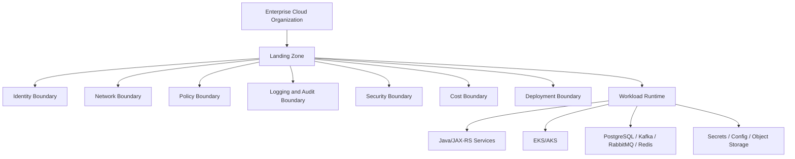
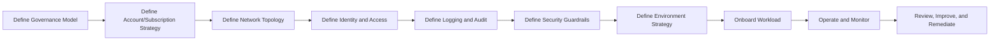
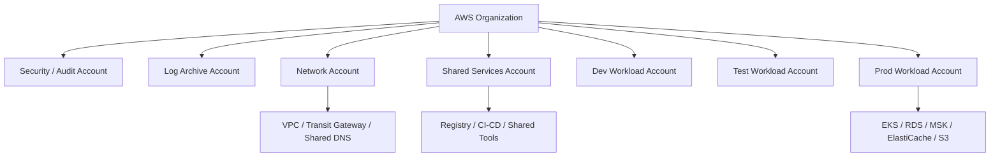
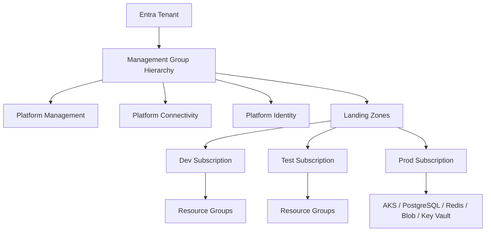

# Landing Zone and Environment Strategy

> Landing zone adalah fondasi operasional tempat workload cloud ditempatkan. Ia bukan sekadar VPC, bukan sekadar subscription, bukan sekadar Kubernetes cluster, dan bukan sekadar Terraform repo. Landing zone adalah kombinasi **boundary, network, identity, policy, logging, security, cost, dan ownership** yang membuat workload bisa berjalan dengan aman dan dapat dioperasikan.

Untuk senior Java/JAX-RS backend engineer, landing zone penting karena setiap service production berjalan di atas keputusan platform yang biasanya tidak terlihat di kode:

- account/subscription mana yang dipakai,
- network mana yang menjadi boundary,
- siapa principal runtime-nya,
- private endpoint dan DNS ada di mana,
- log dikirim ke mana,
- policy apa yang inherited,
- siapa yang boleh deploy,
- siapa yang bisa approve perubahan,
- siapa yang membayar cost,
- bagaimana production dipisahkan dari non-production.

Part ini membahas cara berpikir tentang landing zone dan environment strategy untuk sistem enterprise yang berjalan di AWS/Azure, EKS/AKS, hybrid/on-prem, dan managed services seperti PostgreSQL, Kafka/RabbitMQ, Redis, object storage, secret/config, registry, dan observability.

---

## 1. Core Mental Model

Landing zone menjawab pertanyaan:

> “Sebelum aplikasi dideploy, platform seperti apa yang sudah harus tersedia agar aplikasi bisa berjalan dengan aman, observable, cost-aware, dan recoverable?”

Landing zone bukan aplikasi. Landing zone adalah tempat aplikasi “mendarat”.

Jika Anda hanya melihat Kubernetes deployment, Anda hanya melihat ujungnya. Banyak keputusan produksi sudah ditentukan sebelum pod dibuat.

---

## 2. Why Landing Zone Exists

Landing zone ada karena enterprise cloud tidak bisa dikelola seperti personal cloud account.

Tanpa landing zone:

- semua team bisa membuat resource sembarangan,
- prod dan dev bercampur,
- network CIDR overlap,
- public IP tidak terkendali,
- secret tersebar,
- IAM/RBAC overprivileged,
- log tidak terpusat,
- audit evidence sulit dicari,
- cost tidak bisa dialokasikan,
- incident escalation lambat,
- DR tidak punya boundary jelas,
- compliance review menjadi manual dan rapuh.

Landing zone memberikan guardrail agar workload team bisa bergerak cepat tanpa membuka risiko produksi yang tidak terlihat.

---

## 3. Landing Zone Is Not One Thing

### Bukan hanya AWS account atau Azure subscription

Account/subscription adalah boundary penting, tetapi landing zone juga mencakup network, identity, logging, policy, dan automation.

### Bukan hanya VPC atau VNet

VPC/VNet adalah network boundary, tetapi landing zone juga harus menjelaskan:

- siapa boleh deploy,
- siapa boleh membaca secret,
- bagaimana log disimpan,
- bagaimana policy diterapkan,
- bagaimana cost dipetakan.

### Bukan hanya EKS atau AKS

Cluster hanyalah runtime platform. Landing zone harus ada sebelum cluster:

- account/subscription,
- network,
- private endpoint,
- registry,
- identity,
- logging,
- policy,
- DNS.

### Bukan hanya Terraform

Terraform dapat membangun landing zone, tetapi landing zone adalah desain operasional. Ia tetap harus memiliki ownership, lifecycle, review process, dan incident model.

---

## 4. Landing Zone Lifecycle

Landing zone biasanya berkembang melalui lifecycle berikut:

### 4.1 Define Governance Model

Tentukan:

- siapa cloud platform owner,
- siapa security owner,
- siapa network owner,
- siapa application owner,
- siapa approver production change,
- siapa incident commander,
- siapa yang menangani cost anomaly.

### 4.2 Define Account/Subscription Strategy

Tentukan:

- account/subscription per environment,
- shared service boundary,
- network boundary,
- logging boundary,
- sandbox boundary,
- customer/tenant isolation boundary jika relevan.

### 4.3 Define Network Topology

Tentukan:

- hub-spoke atau flat network,
- VPC/VNet CIDR,
- subnet allocation,
- private endpoint placement,
- DNS resolution,
- ingress/egress path,
- firewall path,
- hybrid connectivity.

### 4.4 Define Identity and Access

Tentukan:

- human access,
- CI/CD access,
- workload identity,
- break-glass access,
- cross-account/cross-subscription trust,
- least privilege,
- audit trail.

### 4.5 Define Logging and Audit

Tentukan:

- central log destination,
- activity/control plane audit,
- application logs,
- cluster logs,
- load balancer logs,
- flow logs,
- retention,
- access to logs.

### 4.6 Define Environment Strategy

Tentukan:

- dev,
- test,
- staging,
- production,
- sandbox,
- performance test,
- DR environment,
- customer-specific environment jika ada.

### 4.7 Onboard Workload

Saat aplikasi baru masuk, validasi:

- target environment,
- namespace,
- ingress,
- identity,
- secret/config,
- database,
- broker,
- object storage,
- monitoring,
- cost tags,
- runbook.

---

## 5. Environment Strategy

Environment bukan hanya nama. Environment adalah kombinasi boundary, data, risk, change control, dan operational expectation.

| Environment | Purpose | Expected Control |
|---|---|---|
| Sandbox | Eksperimen aman | isolated, low privilege, auto cleanup |
| Dev | Development integration | flexible, non-prod data, relaxed approval |
| Test / QA | Functional testing | stable enough, test data, reproducible |
| Staging / Pre-prod | Production-like validation | close to prod, controlled change |
| Performance | Load/performance testing | isolated capacity, realistic traffic model |
| Production | Customer/business traffic | strict access, audit, monitoring, rollback |
| DR | Disaster recovery | tested, documented, dependency-aware |

### Key principle

> Environment separation yang baik bukan hanya memisahkan namespace. Ia memisahkan blast radius.

Jika dev dan prod berada di cluster yang sama, database yang sama, secret namespace yang sama, atau network boundary yang sama, maka kesalahan dev bisa menjadi production incident.

---

## 6. Separation Dimensions

Environment dapat dipisahkan di banyak layer.

| Layer | Strong Separation | Weak Separation | Risk |
|---|---|---|---|
| Account/subscription | separate account/subscription | same account/subscription | accidental prod access |
| Network | separate VPC/VNet | shared VPC/VNet | route/firewall blast radius |
| Cluster | separate EKS/AKS | shared cluster | noisy neighbor, RBAC mistake |
| Namespace | separate namespace | same namespace | config/secret collision |
| Database | separate instance/db | shared DB | data corruption/leak |
| Secret | separate vault/path | shared secret store | secret leakage |
| CI/CD | separate pipeline approval | shared deploy credential | wrong environment deploy |
| DNS | separate zone/subdomain | shared naming | wrong target resolution |
| Logs | separate workspace/index | mixed logs | debugging/compliance issue |
| Cost | separate tags/billing scope | untagged shared resource | cost ambiguity |

Strong separation costs more but reduces blast radius. Weak separation is cheaper but needs stronger discipline and monitoring.

---

## 7. AWS Implementation Model

AWS enterprise landing zones commonly use multiple accounts under AWS Organizations.

Typical conceptual boundaries:

### AWS Account Strategy

Possible account types:

- management account,
- audit/security account,
- log archive account,
- network account,
- shared services account,
- workload dev account,
- workload test account,
- workload prod account,
- sandbox account.

### AWS Guardrails

AWS guardrails may involve:

- AWS Organizations,
- Organizational Units,
- Service Control Policies,
- IAM Identity Center,
- CloudTrail,
- AWS Config,
- VPC baseline,
- central logging,
- tagging policy,
- Control Tower if used internally.

### AWS Workload Landing Zone Questions

For a Java/JAX-RS workload:

- Which AWS account contains the EKS cluster?
- Which AWS account contains shared networking?
- Is RDS/PostgreSQL in same account or shared data account?
- Is S3 bucket local to workload account or shared?
- Which IAM role is used by the pod?
- Is IRSA enabled?
- Are VPC endpoints available for S3, STS, Secrets Manager, CloudWatch, ECR, or other dependencies?
- Where does CloudTrail go?
- Are logs centralized?
- Are cost allocation tags enforced?

---

## 8. Azure Implementation Model

Azure enterprise landing zones commonly use management groups, subscriptions, resource groups, Azure Policy, and Azure RBAC.

Typical conceptual hierarchy:

### Azure Subscription Strategy

Possible subscription types:

- connectivity subscription,
- management/logging subscription,
- identity subscription,
- shared services subscription,
- workload dev subscription,
- workload test subscription,
- workload prod subscription,
- sandbox subscription.

### Azure Guardrails

Azure guardrails may involve:

- management group hierarchy,
- Azure Policy,
- Azure RBAC,
- activity log export,
- Log Analytics workspace,
- Azure Firewall,
- Private DNS Zones,
- resource locks,
- tagging policy,
- Defender for Cloud if used internally.

### Azure Workload Landing Zone Questions

For a Java/JAX-RS workload:

- Which subscription contains the AKS cluster?
- Which resource group owns workload resources?
- Which VNet/subnet does AKS use?
- Is the cluster private?
- Is Azure Workload Identity enabled?
- Which managed identity or service principal is used?
- Are private endpoints configured for Blob Storage, Key Vault, PostgreSQL, ACR, or Redis?
- Which Private DNS Zones are linked to the VNet?
- Which Log Analytics workspace receives logs?
- Which Azure Policy assignments apply?

---

## 9. Shared Services Boundary

Shared services are platform capabilities reused by many workloads.

Examples:

- container registry,
- artifact repository,
- CI/CD runners,
- GitOps controller,
- central DNS,
- shared monitoring workspace,
- security scanning,
- vulnerability management,
- bastion/jump host,
- private CA,
- secrets integration,
- central proxy,
- network firewall,
- logging pipeline.

Shared services reduce duplication, but create dependency concentration.

### Failure Mode

If shared registry is down:

- deployments fail,
- new pods cannot pull image,
- autoscaling can fail,
- rollback may fail if image is unavailable.

If shared DNS breaks:

- many applications fail at once.

If central logging breaks:

- applications may keep running but incident visibility drops.

### Review Question

For every shared service, ask:

- What workloads depend on it?
- Is it in the same region?
- Does it have HA?
- Who owns it?
- What is the runbook?
- Is there a fallback?
- Is cost allocated?
- Is access least-privileged?

---

## 10. Network Boundary

Landing zone network strategy determines how workloads communicate.

Possible models:

### Flat Network

All workloads share broad network access.

Benefit:

- simpler connectivity,
- faster initial setup.

Risk:

- large blast radius,
- weak segmentation,
- hard compliance story,
- accidental lateral movement.

### Hub-Spoke

Shared connectivity and inspection are centralized in hub; workloads run in spokes.

Benefit:

- centralized control,
- clearer network ownership,
- easier firewall/DNS/hybrid integration.

Risk:

- hub becomes critical dependency,
- routing more complex,
- misconfigured UDR/route table can break many workloads.

### Per-Environment Network

Dev/test/prod have separate VPC/VNet.

Benefit:

- strong isolation,
- safer production boundary.

Risk:

- duplicated setup,
- cost,
- more IaC complexity.

### Hybrid Network

Cloud connects to on-prem via VPN, Direct Connect, ExpressRoute, Transit Gateway, Virtual WAN, or similar.

Benefit:

- enterprise integration.

Risk:

- CIDR overlap,
- DNS forwarding issue,
- firewall dependency,
- latency,
- MTU,
- ownership complexity.

---

## 11. Identity Boundary

Identity boundary defines who can do what and what workload can access.

### Human Identity

Questions:

- How do engineers access cloud?
- Is access federated?
- Is MFA required?
- Is access just-in-time?
- Are admin roles permanent or temporary?
- Is production access audited?

### Workload Identity

Questions:

- How does pod access cloud service?
- Is static credential banned?
- Is IRSA/Azure Workload Identity used?
- Is service account mapped to one role/identity?
- Is permission scoped to resource and operation?
- Is credential rotation automatic?

### CI/CD Identity

Questions:

- Does pipeline use static secret?
- Is OIDC federation used?
- Can dev pipeline deploy prod?
- Is approval required?
- Is deployment identity separate from runtime identity?
- Is Terraform identity overprivileged?

---

## 12. Logging, Audit, and Evidence Boundary

Production systems need evidence.

Minimum evidence types:

| Evidence | Purpose |
|---|---|
| Cloud control plane audit | who changed resource |
| Kubernetes events | what changed in cluster |
| Application logs | what app observed |
| Load balancer logs | what client/gateway observed |
| Flow logs | network accept/deny/path evidence |
| IAM/RBAC logs | access decision and token activity |
| Secret access logs | who/what read secret |
| Deployment logs | what version was deployed |
| Cost records | what resource created spend |
| Incident notes | timeline and RCA |

If evidence is not centralized or retained, compliance and RCA become weak.

For regulatory or mission-critical systems, “we think this happened” is not enough. You need timestamped evidence.

---

## 13. Cost Boundary

Cloud cost is also an architecture concern.

Landing zone should define:

- mandatory tags,
- cost center,
- environment tag,
- application tag,
- owner tag,
- budget alert,
- anomaly detection,
- chargeback/showback,
- sandbox cleanup,
- idle resource cleanup,
- log retention cost,
- NAT/data transfer cost visibility.

Common cost leaks:

- NAT Gateway traffic from pods to public cloud services instead of private endpoint,
- over-retained logs,
- unused load balancers,
- idle databases,
- oversized node pools,
- cross-AZ traffic,
- cross-region replication,
- orphaned disks,
- old snapshots,
- unbounded metrics cardinality.

---

## 14. Tenant and Customer Isolation

For enterprise products, customer/tenant isolation may be required.

Possible isolation levels:

| Isolation Level | Example | Pros | Cons |
|---|---|---|---|
| Shared app/shared DB | tenant_id column | cheapest | highest correctness/security burden |
| Shared app/separate schema | schema per tenant | better logical separation | operational complexity |
| Shared cluster/separate namespace | namespace per tenant | Kubernetes-level separation | cluster blast radius |
| Separate DB instance | DB per tenant | strong data isolation | cost and operations |
| Separate account/subscription | cloud boundary per tenant | strongest isolation | expensive, automation-heavy |

Landing zone must support the chosen isolation model.

For Java/JAX-RS services, tenant isolation affects:

- database query correctness,
- cache key design,
- object storage path/policy,
- secret scoping,
- log redaction,
- audit trail,
- rate limits,
- backup/restore,
- DR,
- incident blast radius.

---

## 15. Java/JAX-RS Backend Implications

Landing zone decisions affect application design.

### Configuration

Application config must be environment-aware:

- endpoint URLs,
- region,
- bucket/container names,
- secret names,
- feature flags,
- broker endpoints,
- database hostnames,
- TLS trust settings,
- proxy settings,
- observability endpoint.

### Runtime Identity

Application should not assume static secrets.

Preferred production patterns:

- EKS pod uses IAM role via IRSA,
- AKS pod uses Azure Workload Identity,
- CI/CD uses OIDC federation,
- cloud SDK uses default credential chain configured for runtime.

### Database and Broker

PostgreSQL/Kafka/RabbitMQ/Redis access depends on landing zone:

- same VPC/VNet or peered?
- private endpoint?
- firewall allowlist?
- DNS private zone?
- security group/NSG?
- cross-account/subscription access?
- TLS certificate trust?

### Observability

Application must emit telemetry compatible with landing zone:

- structured logs,
- correlation ID,
- trace propagation,
- dependency latency,
- cloud SDK request IDs,
- environment tags,
- service version,
- tenant/customer context if allowed.

---

## 16. Failure Modes

### 16.1 Wrong Environment Deployment

A dev build is deployed to prod or prod config is used in test.

Detection:

- deployment audit,
- image tag/digest,
- config version,
- environment label,
- Kubernetes namespace,
- account/subscription ID,
- runtime environment variable.

Prevention:

- separate pipeline credentials,
- promotion gates,
- immutable image digest,
- environment-specific approval,
- policy-as-code.

### 16.2 Cross-Environment Data Access

Non-prod service connects to prod database or object storage.

Detection:

- database connection logs,
- cloud audit logs,
- network flow logs,
- app startup logs,
- secret access logs.

Prevention:

- separate network boundary,
- separate secret path,
- resource policy,
- IAM/RBAC condition,
- DNS separation.

### 16.3 Shared Service Outage

Central registry, DNS, logging, or identity service fails.

Detection:

- multiple workloads failing together,
- image pull errors,
- DNS timeout,
- missing logs,
- token acquisition failure.

Prevention:

- HA design,
- caching where safe,
- fallback runbook,
- regional placement,
- dependency dashboard.

### 16.4 Policy Change Breaks Workload

SCP/Azure Policy/RBAC change denies previously allowed operation.

Detection:

- AccessDenied/AuthorizationFailed spike,
- Activity Log/CloudTrail,
- policy compliance events,
- deployment failure.

Prevention:

- policy rollout stages,
- non-prod validation,
- exception process,
- break-glass path,
- change approval.

### 16.5 Network Boundary Drift

A route, firewall rule, private endpoint, or DNS link changes.

Detection:

- connection timeout,
- DNS wrong IP,
- flow logs,
- Network Watcher,
- VPC Flow Logs,
- ingress health check failure.

Prevention:

- IaC-managed network,
- drift detection,
- change review,
- route/DNS tests,
- automated connectivity tests.

---

## 17. Production Debugging Playbook

When something fails, start with boundary evidence.

### Step 1: Identify Runtime Context

- Which service?
- Which version?
- Which environment?
- Which cluster?
- Which namespace?
- Which account/subscription?
- Which region?
- Which tenant/customer impact?

### Step 2: Identify Dependency

- Which database/broker/cache/object storage/secret/config service?
- Same environment or cross-environment?
- Same account/subscription or cross-boundary?
- Private or public endpoint?
- DNS name used by app?

### Step 3: Check Identity

- Which Kubernetes service account?
- Which IAM role / managed identity?
- Which RBAC/permission assignment?
- Is credential token present?
- Is token audience correct?
- Is the operation allowed?

### Step 4: Check Network

- DNS resolves to what?
- Route goes through where?
- Firewall/security rule allows?
- Private endpoint linked?
- NAT/proxy involved?
- TLS trust valid?

### Step 5: Check Observability

- Application log.
- Cloud SDK error.
- Load balancer log.
- Flow log.
- Audit log.
- Kubernetes event.
- Deployment event.
- Metric/alert.

---

## 18. PR Review Checklist

Use this for changes touching cloud/platform resources.

### Boundary

- [ ] Account/subscription is correct.
- [ ] Environment is explicit.
- [ ] Resource ownership is tagged.
- [ ] Cost center is tagged.
- [ ] Data classification is known.
- [ ] Production change approval exists.

### Network

- [ ] VPC/VNet/subnet is correct.
- [ ] Route path is understood.
- [ ] DNS zone/record is correct.
- [ ] Private endpoint usage is intentional.
- [ ] Public exposure is reviewed.
- [ ] Firewall/SG/NSG changes are minimal.

### Identity

- [ ] Runtime identity is explicit.
- [ ] CI/CD identity is not reused as runtime identity.
- [ ] Least privilege is applied.
- [ ] Cross-account/subscription access is justified.
- [ ] Audit evidence exists.

### Application

- [ ] Java config is environment-specific.
- [ ] SDK credential behavior is understood.
- [ ] Timeout/retry policy is bounded.
- [ ] Logs include useful context.
- [ ] Rollback path exists.
- [ ] Smoke test covers real dependency path.

### Operations

- [ ] Dashboard exists.
- [ ] Alert exists.
- [ ] Runbook exists.
- [ ] DR impact is considered.
- [ ] Cost impact is considered.
- [ ] Compliance evidence is retained.

---

## 19. Internal Verification Checklist

Do not assume these details. Verify with platform/SRE/DevOps/security/backend team.

### Organization and Boundary

- AWS Organization structure.
- Azure management group hierarchy.
- Account/subscription list.
- Environment-to-account/subscription mapping.
- Shared services boundary.
- Network boundary.
- Logging/audit boundary.
- Security boundary.
- Cost boundary.

### Landing Zone

- Landing zone reference architecture.
- Account/subscription vending process.
- Baseline policies.
- Baseline IAM/RBAC.
- Baseline network.
- Baseline DNS.
- Baseline observability.
- Baseline tagging.
- Baseline secret/config strategy.

### Workload Onboarding

- Required tags.
- Required naming convention.
- Required CI/CD process.
- Required GitOps process.
- Required security review.
- Required observability signals.
- Required runbook.
- Required DR classification.

### Existing Production Reality

- Which workloads run on AWS?
- Which workloads run on Azure?
- Which workloads run on-prem?
- Which workloads are hybrid?
- Which clusters are production?
- Which managed services are used?
- Which incidents are worth studying?
- Which dashboards are considered source of truth?

---

## 20. Summary

A good landing zone makes production systems:

- isolated,
- governable,
- observable,
- auditable,
- secure,
- cost-aware,
- recoverable,
- scalable,
- debuggable.

For senior backend engineer, the main skill is not memorizing every cloud service. The skill is understanding how application behavior emerges from boundary, network, identity, policy, and operational design.

If you can identify where a workload lands, who owns it, how traffic flows, how identity is resolved, how logs are collected, and how failure is contained, you are no longer just writing Java code. You are engineering production systems.

---

## 21. Official References

- AWS Well-Architected Framework: https://docs.aws.amazon.com/wellarchitected/latest/framework/welcome.html
- AWS Organizing Your AWS Environment Using Multiple Accounts: https://docs.aws.amazon.com/whitepapers/latest/organizing-your-aws-environment/organizing-your-aws-environment.html
- AWS Organizations User Guide: https://docs.aws.amazon.com/organizations/latest/userguide/orgs_introduction.html
- Microsoft Cloud Adoption Framework: https://learn.microsoft.com/en-us/azure/cloud-adoption-framework/
- Azure landing zones: https://learn.microsoft.com/en-us/azure/cloud-adoption-framework/ready/landing-zone/
- Azure landing zone design areas: https://learn.microsoft.com/en-us/azure/cloud-adoption-framework/ready/landing-zone/design-areas
- Azure resource organization: https://learn.microsoft.com/en-us/azure/cloud-adoption-framework/ready/landing-zone/design-area/resource-org
