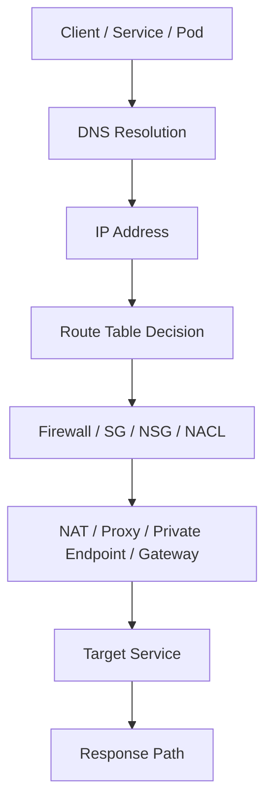
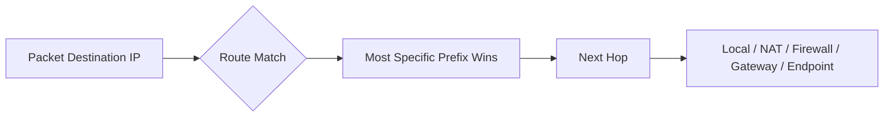
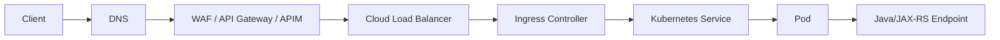
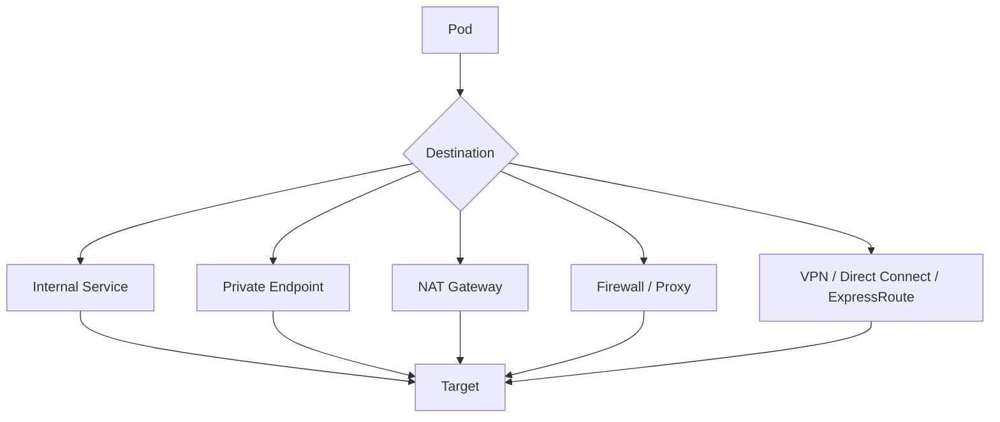
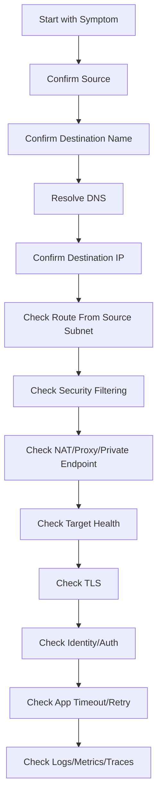

# Cloud Networking Foundation

> Cloud networking adalah programmable network untuk production systems. Bagi backend engineer, ini bukan topik “ops saja”. Setiap timeout, 502, DNS error, AccessDenied via private endpoint, NAT cost spike, atau pod-to-database failure sering berakar dari networking.

Part ini membangun fondasi sebelum masuk ke AWS VPC, Azure VNet, DNS, load balancer, private endpoint, hybrid connectivity, EKS networking, AKS networking, dan egress control.

Fokusnya adalah cara berpikir:

- dari mana traffic masuk,
- ke mana traffic keluar,
- DNS resolve ke apa,
- route memilih path mana,
- firewall/security rule mengizinkan apa,
- NAT/proxy/private endpoint terlibat atau tidak,
- bagaimana failure dideteksi dan di-debug.

---

## 1. Core Mental Model

Cloud network adalah kombinasi dari:

- address space,
- subnet,
- route table,
- gateway,
- firewall/security filtering,
- DNS,
- load balancer,
- private endpoint,
- NAT/proxy,
- observability.



Production debugging rule:

> Jika Anda tidak tahu DNS result, route path, and security boundary, Anda belum tahu network path.

---

## 2. Why Cloud Networking Exists

Cloud networking memberi isolation dan controlled connectivity untuk workloads.

Ia menjawab:

- resource mana yang private,
- resource mana yang public,
- service mana yang bisa saling bicara,
- traffic keluar lewat mana,
- service cloud diakses via public endpoint atau private endpoint,
- on-prem bisa mengakses cloud lewat mana,
- bagaimana traffic diamati,
- bagaimana blast radius dibatasi.

Untuk enterprise Java/JAX-RS backend, network menentukan apakah aplikasi bisa:

- menerima HTTP traffic,
- mengakses PostgreSQL,
- publish ke Kafka/RabbitMQ,
- memakai Redis,
- mengambil secret/config,
- upload/download object storage,
- call external integration,
- mengirim logs/traces,
- resolve internal DNS,
- melakukan deployment dan image pull.

---

## 3. CIDR and IP Addressing

CIDR adalah cara mendefinisikan range IP.

Contoh:

```text
10.10.0.0/16
10.10.1.0/24
10.10.2.0/24
```

Semakin kecil angka prefix, semakin besar range.

| CIDR | Jumlah kira-kira alamat IPv4 |
|---|---:|
| /16 | 65k |
| /20 | 4k |
| /24 | 256 |
| /27 | 32 |

### Why Backend Engineers Should Care

IP exhaustion bisa menjadi production incident.

Contoh:

- EKS dengan VPC CNI memakai IP dari subnet untuk pod.
- AKS dengan Azure CNI juga bisa memakai IP dari VNet/subnet untuk pod.
- Jika subnet terlalu kecil, pod baru tidak bisa dijadwalkan.
- Autoscaling gagal walaupun CPU node masih tampak cukup.
- Load balancer/private endpoint juga membutuhkan IP.

### Review Questions

- CIDR VPC/VNet berapa?
- Subnet untuk node/pod cukup?
- Ada CIDR overlap dengan on-prem?
- Ada CIDR overlap antar region/account/subscription?
- Apakah growth 12–24 bulan dipertimbangkan?
- Apakah private endpoint menghabiskan subnet khusus?

---

## 4. Subnet

Subnet adalah segment IP di dalam VPC/VNet.

Subnet biasa digunakan untuk memisahkan:

- public ingress,
- private app workload,
- database,
- private endpoint,
- firewall,
- NAT,
- Kubernetes nodes,
- internal load balancer,
- management/bastion.

### Public vs Private Subnet

Subnet “public” bukan karena namanya. Ia public jika route table-nya memberi jalur ke internet gateway/public ingress dan resource memiliki public reachability.

Subnet “private” bukan otomatis aman. Ia private jika tidak ada route inbound public dan security controls membatasi akses.

### Kubernetes Impact

Kubernetes cluster di cloud membutuhkan subnet untuk:

- nodes,
- pod IP,
- load balancer,
- private endpoint integration,
- control plane access,
- node-to-service traffic.

Subnet design yang buruk bisa menyebabkan:

- pod pending,
- node scale-out gagal,
- load balancer gagal dibuat,
- private endpoint gagal dibuat,
- traffic asymmetry,
- cross-AZ cost tidak terduga.

---

## 5. Route Table

Route table menentukan next hop untuk traffic berdasarkan destination CIDR.

Contoh conceptual route:

| Destination | Target |
|---|---|
| local VPC/VNet CIDR | local |
| 0.0.0.0/0 | NAT Gateway / Internet Gateway / Firewall |
| on-prem CIDR | VPN / Direct Connect / ExpressRoute |
| service endpoint CIDR | private endpoint / VPC endpoint path |

### Route Table Mental Model



Most specific route wins.

Example:

- `10.0.0.0/8` route to firewall,
- `10.10.4.0/24` route to local/peering,
- `0.0.0.0/0` route to NAT.

Traffic to `10.10.4.5` follows `/24`, not `/8` or `/0`.

### Backend Debugging

If Java service gets connection timeout:

- DNS may be correct,
- target may be healthy,
- but route may send traffic to wrong firewall/gateway.

Always debug in order:

1. DNS result.
2. Source IP/subnet.
3. Route table for source subnet.
4. Security filtering.
5. Target health.

---

## 6. NAT

NAT allows private resources to initiate outbound connections without exposing their private IP directly to the internet.

### AWS

AWS commonly uses NAT Gateway for outbound internet access from private subnets.

### Azure

Azure uses Azure NAT Gateway for outbound connectivity from private resources in a subnet.

### Why It Matters

NAT is useful but dangerous if misunderstood.

Benefits:

- private workload can call external services,
- no inbound public exposure,
- stable egress IP if configured.

Risks:

- NAT cost can be high,
- SNAT port exhaustion,
- traffic to cloud services may go public path instead of private endpoint,
- source IP becomes NAT IP, not pod/node IP,
- firewall allowlist depends on NAT IP,
- outages affect all workloads in subnet using same NAT path.

### Java/JAX-RS Impact

Outbound HTTP clients and cloud SDKs may traverse NAT or proxy.

Watch for:

- connection pool size,
- keep-alive,
- retry storm,
- many short-lived connections,
- high concurrency,
- SNAT exhaustion,
- external allowlist based on egress IP.

---

## 7. Internet Gateway, Public IP, and Inbound Exposure

Internet-facing workloads usually involve:

- DNS,
- public IP,
- internet gateway or public frontend,
- load balancer,
- WAF/API gateway,
- ingress,
- backend service.

### Inbound Exposure Checklist

Before exposing Java API:

- Is this endpoint supposed to be public?
- Is authentication enforced?
- Is WAF/API gateway required?
- Is TLS terminated where?
- Is backend private?
- Are health check paths safe?
- Are admin endpoints blocked?
- Are source IP restrictions required?
- Are access logs enabled?

### Anti-Pattern

Putting service directly on public IP without gateway, WAF, authentication, and observability is almost always wrong for enterprise systems.

---

## 8. Firewall and Security Filtering

Cloud networking usually has multiple security layers.

### AWS

Common layers:

- Security Group,
- Network ACL,
- AWS Network Firewall if used,
- route table,
- endpoint policy,
- load balancer listener/rule,
- Kubernetes NetworkPolicy if implemented,
- application auth.

### Azure

Common layers:

- NSG,
- Azure Firewall,
- UDR,
- Private Endpoint network policy behavior,
- Application Gateway/WAF,
- Kubernetes NetworkPolicy if implemented,
- application auth.

### Important Distinction

Network security says “can packets flow?”

Application security says “is this request allowed?”

Both are required.

Example:

- NSG allows traffic to API,
- but JWT is invalid → application returns 401/403.
- IAM allows S3 call,
- but route to S3 public endpoint blocked → timeout.
- DNS resolves Key Vault private IP,
- but RBAC denies secret read → authorization failure.

---

## 9. DNS

DNS maps names to addresses.

For cloud systems, DNS controls whether your service reaches:

- public endpoint,
- private endpoint,
- internal load balancer,
- wrong environment,
- old deployment,
- on-prem system,
- cloud provider service endpoint.

### DNS Types

| Type | Purpose |
|---|---|
| Public DNS | internet-resolvable names |
| Private DNS | internal cloud names |
| Split-horizon DNS | same name resolves differently depending on source |
| Hybrid DNS | cloud and on-prem name resolution |
| Kubernetes DNS | service discovery inside cluster |
| Private endpoint DNS | maps provider service name to private IP |

### Java Impact

Java errors that often indicate DNS:

- `UnknownHostException`,
- intermittent resolution failure,
- resolving to public IP instead of private IP,
- stale IP due to DNS cache,
- wrong environment endpoint.

### JVM DNS Cache Awareness

Java may cache DNS results depending on JVM/security settings. In dynamic cloud environments, long DNS cache TTL can cause traffic to keep hitting old endpoints.

Internal standard should define:

- DNS TTL expectation,
- JVM DNS cache settings if relevant,
- service discovery behavior,
- failover DNS behavior.

---

## 10. Load Balancer

Load balancer distributes traffic to targets.

Common types:

- L7 HTTP load balancer,
- L4 TCP/UDP load balancer,
- internal load balancer,
- public load balancer,
- gateway/API management layer,
- Kubernetes ingress.

### Load Balancer Responsibilities

- accept client connection,
- terminate or pass through TLS,
- route based on host/path/port,
- perform health checks,
- balance across targets,
- preserve or rewrite headers,
- emit access logs/metrics.

### Backend Impact

Java/JAX-RS service must align with load balancer:

- health endpoint must be cheap and reliable,
- readiness should reflect dependencies carefully,
- timeouts must be compatible,
- max header/body size must be understood,
- client IP headers must be trusted only from known proxy,
- TLS termination chain must be clear,
- 502/503/504 mapping must be understood.

---

## 11. North-South and East-West Traffic

### North-South Traffic

Traffic entering or leaving the platform boundary.

Examples:

- user to public API,
- corporate client to private API,
- service to external SaaS,
- cloud to on-prem.

### East-West Traffic

Traffic between internal services.

Examples:

- service A calls service B,
- pod to PostgreSQL,
- pod to Kafka,
- pod to Redis,
- service to secret manager,
- service to object storage through private endpoint.

### Why It Matters

North-south traffic often needs:

- WAF,
- API gateway,
- public/private load balancer,
- TLS,
- rate limit,
- DDoS protection,
- source allowlist.

East-west traffic often needs:

- service discovery,
- service identity,
- mTLS/JWT if required,
- NetworkPolicy,
- private DNS,
- private endpoint,
- timeout/retry discipline.

---

## 12. Ingress

Ingress is inbound traffic into Kubernetes or application platform.

Typical flow:



Ingress failure examples:

- DNS points to old load balancer,
- certificate expired,
- WAF blocks request,
- listener rule wrong,
- ingress path mismatch,
- service selector wrong,
- endpoint slice empty,
- pod readiness false,
- app timeout,
- health check path wrong.

---

## 13. Egress

Egress is outbound traffic from workload to dependency.

Typical egress targets:

- PostgreSQL,
- Kafka/RabbitMQ,
- Redis,
- S3/Blob Storage,
- Secrets Manager/Key Vault,
- AppConfig/App Configuration,
- external partner API,
- observability collector,
- on-prem system.

Possible egress paths:



Egress failure examples:

- proxy not configured,
- `NO_PROXY` missing private domain,
- NAT IP not allowlisted,
- firewall denies port,
- private DNS not linked,
- route sends traffic to wrong gateway,
- TLS inspection breaks certificate,
- cloud SDK endpoint override wrong.

---

## 14. Private Connectivity

Private connectivity means traffic reaches service without traversing public internet path.

Common patterns:

- AWS VPC Endpoint,
- AWS PrivateLink,
- Azure Private Endpoint,
- Azure Private Link,
- private API gateway,
- internal load balancer,
- VNet/VPC peering,
- Transit Gateway,
- Virtual WAN,
- VPN,
- Direct Connect,
- ExpressRoute.

### Private Does Not Mean Automatically Authorized

Private connectivity handles network reachability.

You still need:

- IAM/RBAC,
- resource policy,
- database auth,
- TLS,
- application auth,
- audit log.

Example:

- Pod can reach Key Vault private IP.
- Azure RBAC still denies `get secret`.
- Result: network works, identity fails.

---

## 15. Hybrid Connectivity

Hybrid means cloud and on-prem systems communicate.

Common components:

- VPN,
- Direct Connect,
- ExpressRoute,
- Transit Gateway,
- Virtual WAN,
- firewall,
- DNS forwarding,
- internal CA,
- proxy,
- BGP routing.

### Common Hybrid Failure Modes

- CIDR overlap,
- asymmetric routing,
- firewall missing rule,
- DNS forwarding loop,
- MTU issue,
- TLS trust mismatch,
- latency higher than app timeout,
- on-prem maintenance breaks cloud dependency,
- source IP not expected.

### Java Impact

Hybrid calls need conservative engineering:

- explicit timeout,
- bounded retry,
- circuit breaker,
- connection pool tuning,
- observability by dependency,
- graceful degradation if possible.

---

## 16. AWS Networking Building Blocks

AWS mapping:

| Concept | AWS |
|---|---|
| Private network | VPC |
| Segment | Subnet |
| Route decision | Route table |
| Public internet entry/exit | Internet Gateway |
| Private outbound internet | NAT Gateway |
| Static public IP | Elastic IP |
| Stateful resource firewall | Security Group |
| Stateless subnet filter | NACL |
| Private service access | VPC Endpoint |
| Private provider/consumer service | PrivateLink |
| DNS | Route 53 |
| Network logs | VPC Flow Logs |
| Load balancing | ALB/NLB/GWLB |

AWS-specific questions:

- Is subnet public or private by route?
- Does private subnet route `0.0.0.0/0` to NAT?
- Are VPC endpoints used for AWS services?
- Are Security Groups scoped minimally?
- Are NACLs customized?
- Is Route 53 private hosted zone associated with VPC?
- Are VPC Flow Logs enabled?
- Is Transit Gateway involved?

---

## 17. Azure Networking Building Blocks

Azure mapping:

| Concept | Azure |
|---|---|
| Private network | Virtual Network |
| Segment | Subnet |
| Route decision | System route + route table / UDR |
| Private outbound internet | Azure NAT Gateway |
| Public IP | Public IP resource |
| Stateful filtering | NSG |
| Central firewall | Azure Firewall |
| Private service access | Private Endpoint |
| Private provider/consumer service | Private Link |
| DNS | Azure DNS / Private DNS Zone |
| Network diagnostics | Network Watcher |
| Load balancing | Azure Load Balancer / Application Gateway |

Azure-specific questions:

- Is subnet associated with NSG?
- Is UDR sending traffic to firewall?
- Is private endpoint in correct subnet?
- Is Private DNS Zone linked to VNet?
- Is Azure Firewall in egress path?
- Is NAT Gateway associated with subnet?
- Are effective routes and effective security rules checked?
- Is Network Watcher enabled?

---

## 18. End-to-End Debugging Order

When a backend service cannot reach dependency, follow this order:



### Useful Kubernetes-side checks

```bash
kubectl get pod -n <namespace> -o wide
kubectl describe pod <pod> -n <namespace>
kubectl exec -n <namespace> <pod> -- nslookup <hostname>
kubectl exec -n <namespace> <pod> -- curl -v https://<hostname>
kubectl exec -n <namespace> <pod> -- nc -vz <hostname> <port>
kubectl get svc,endpoints,endpointslice -n <namespace>
kubectl describe ingress -n <namespace>
```

### Useful application-side evidence

Look for:

- resolved endpoint,
- cloud region,
- dependency host,
- connection timeout,
- read timeout,
- TLS handshake error,
- HTTP status,
- cloud SDK error code,
- request ID,
- retry count,
- latency,
- correlation ID.

---

## 19. Common Failure Modes

### 19.1 DNS Resolves to Public IP Instead of Private IP

Symptoms:

- traffic leaves via NAT,
- firewall deny,
- latency unexpected,
- private endpoint not used,
- compliance concern.

Likely causes:

- private DNS zone not linked,
- wrong resolver,
- missing hosted zone association,
- split-horizon misconfiguration,
- JVM DNS cache stale.

### 19.2 Route Table Sends Traffic to Wrong Next Hop

Symptoms:

- timeout,
- no response,
- firewall log deny,
- path works from one subnet but not another.

Likely causes:

- subnet associated with wrong route table,
- UDR overrides system route,
- missing peering route,
- missing on-prem route,
- private endpoint route misunderstood.

### 19.3 Security Rule Blocks Traffic

Symptoms:

- connection timeout,
- TCP refused or dropped,
- health check failure,
- service works from one source but not another.

Likely causes:

- SG/NSG missing source,
- port mismatch,
- NACL missing ephemeral return range,
- Azure Firewall rule missing,
- Kubernetes NetworkPolicy deny.

### 19.4 NAT or SNAT Exhaustion

Symptoms:

- intermittent outbound failures,
- high concurrency failures,
- external calls timeout,
- errors spike under load.

Likely causes:

- too many short-lived connections,
- no connection reuse,
- high retry,
- insufficient NAT capacity,
- external dependency slow,
- connection pool misconfiguration.

### 19.5 TLS Trust Failure

Symptoms:

- `SSLHandshakeException`,
- certificate unknown,
- hostname mismatch,
- works with curl insecure mode but fails in Java.

Likely causes:

- internal CA not in JVM trust store,
- TLS inspection,
- wrong endpoint hostname,
- expired cert,
- private endpoint using expected public hostname but custom DNS breaks SNI.

### 19.6 Load Balancer 502/503/504

Symptoms:

- gateway error,
- unhealthy target,
- timeout,
- intermittent route failure.

Likely causes:

- pod not ready,
- service selector wrong,
- endpoint empty,
- health check path wrong,
- backend timeout longer/shorter than LB timeout,
- ingress route mismatch,
- TLS mismatch.

---

## 20. Correctness Concerns

Network design can affect application correctness.

Examples:

- service accidentally connects to dev database,
- DNS failover sends write traffic to read-only replica,
- retry after timeout creates duplicate operation,
- split-brain during multi-region failover,
- cache points to wrong Redis environment,
- object storage URL points to wrong bucket/container,
- message producer publishes to wrong broker cluster.

Correctness checklist:

- environment encoded in DNS/config,
- dependency endpoint explicit,
- write paths protected,
- idempotency for retries,
- tenant/customer boundary validated,
- cache key includes correct scope,
- message topic/queue names environment-safe,
- object storage path policy prevents cross-tenant access.

---

## 21. Security Concerns

Network security concerns:

- public exposure,
- broad inbound rule,
- broad outbound rule,
- private endpoint missing,
- unmanaged NAT egress,
- firewall bypass,
- DNS exfiltration,
- weak TLS,
- open health/admin endpoints,
- source IP trust misuse,
- missing audit logs.

Security review questions:

- Is this service intended to be public?
- Is ingress authenticated?
- Is admin endpoint blocked?
- Is private dependency reachable only privately?
- Is outbound traffic controlled?
- Are SG/NSG rules least privilege?
- Is traffic encrypted?
- Are logs enabled for security investigation?

---

## 22. Performance Concerns

Networking performance is not free.

Factors:

- region distance,
- AZ placement,
- cross-zone load balancing,
- NAT bottleneck,
- firewall inspection,
- proxy latency,
- DNS latency,
- TLS handshake cost,
- connection reuse,
- load balancer idle timeout,
- database connection pool,
- broker network latency.

Performance checklist:

- colocate app and dependency where possible,
- avoid unnecessary cross-region calls,
- tune HTTP connection pooling,
- use keep-alive,
- set bounded timeouts,
- monitor latency per dependency,
- understand cross-AZ traffic,
- load test with realistic network path.

---

## 23. Cost Concerns

Networking cost can surprise backend teams.

Common cost drivers:

- NAT Gateway hourly and data processing,
- cross-AZ traffic,
- cross-region traffic,
- load balancer hourly/LCU or rule cost,
- firewall processing cost,
- private endpoint hourly/data cost,
- logs/flow logs ingestion,
- public egress,
- data replication.

Cost review questions:

- Does traffic to cloud managed service go through NAT or private endpoint?
- Are chatty services crossing AZ/region?
- Are logs too verbose?
- Are flow logs enabled at necessary scope only?
- Are unused load balancers cleaned up?
- Are private endpoints justified?
- Are large file downloads routed efficiently?

---

## 24. Observability Concerns

To debug network, you need evidence beyond application logs.

Useful signals:

| Signal | What it tells you |
|---|---|
| Application log | app-level error and dependency operation |
| Cloud SDK metric | retry, latency, throttling |
| Load balancer access log | request reached edge/LB |
| Ingress log | request reached Kubernetes ingress |
| Kubernetes events | service/pod/endpoint readiness |
| Flow logs | network accept/reject/path evidence |
| Firewall logs | rule allow/deny |
| DNS query logs | name resolution path |
| Audit logs | config changes |
| Metrics | latency, error rate, saturation |

If you cannot answer “did the packet reach the target?” you need better network observability.

---

## 25. PR Review Checklist

Use this checklist for any PR touching network, ingress, dependency endpoints, SDK config, Kubernetes service, or IaC.

### Addressing

- [ ] CIDR does not overlap.
- [ ] Subnet has sufficient capacity.
- [ ] Private endpoint subnet is planned.
- [ ] Kubernetes pod/node IP usage is understood.

### Routing

- [ ] Route table/UDR change is explicit.
- [ ] Default route target is intentional.
- [ ] On-prem route is understood.
- [ ] Peering/transit path is understood.
- [ ] Return path is valid.

### Security

- [ ] SG/NSG rules are least privilege.
- [ ] Public exposure is intentional.
- [ ] Admin/health endpoints are protected.
- [ ] Firewall/proxy impact is understood.
- [ ] NetworkPolicy impact is understood.

### DNS

- [ ] DNS name is environment-correct.
- [ ] Private DNS zone/hosted zone is linked.
- [ ] TTL is appropriate.
- [ ] Split-horizon behavior is understood.
- [ ] JVM DNS cache impact is considered.

### Runtime

- [ ] Java timeout is bounded.
- [ ] Retry policy is bounded.
- [ ] Connection pooling is configured.
- [ ] TLS trust is valid.
- [ ] Proxy/NO_PROXY is configured if needed.

### Observability

- [ ] Access logs enabled if needed.
- [ ] Flow/firewall logs available.
- [ ] App logs include dependency host/operation.
- [ ] Metrics exist for dependency latency/error.
- [ ] Alert covers critical path.

### Cost

- [ ] NAT cost considered.
- [ ] Cross-AZ/cross-region traffic considered.
- [ ] Private endpoint cost justified.
- [ ] Log volume considered.
- [ ] Load balancer count justified.

---

## 26. Internal Verification Checklist

Do not assume. Verify internally.

### Network Inventory

- AWS VPC list.
- Azure VNet list.
- CIDR plan.
- Subnet map.
- Public/private subnet definition.
- Route table/UDR.
- NAT Gateway.
- Internet gateway/public frontend.
- Firewall.
- Proxy.
- VPC/VNet peering.
- Transit Gateway/Virtual WAN.
- VPN/Direct Connect/ExpressRoute.

### DNS

- Public DNS zones.
- Private hosted zones.
- Azure Private DNS Zones.
- DNS resolver/forwarder.
- Split-horizon behavior.
- Kubernetes CoreDNS configuration.
- Private endpoint DNS pattern.
- TTL standard.

### Kubernetes

- EKS/AKS networking mode.
- Node subnet.
- Pod subnet/IP source.
- Ingress controller.
- Load balancer controller.
- NetworkPolicy implementation.
- Private cluster endpoint.
- Service mesh if any.

### Dependency Connectivity

- PostgreSQL network path.
- Kafka/RabbitMQ network path.
- Redis network path.
- Object storage network path.
- Secret manager network path.
- Config service network path.
- Container registry network path.
- On-prem integration path.
- External partner API path.

### Observability

- VPC Flow Logs / Azure equivalent.
- Firewall logs.
- Load balancer access logs.
- DNS logs if available.
- Ingress logs.
- Network dashboard.
- Incident examples.

---

## 27. Summary

Cloud networking foundation can be compressed into one discipline:

> Name resolves to IP. Route selects path. Security controls allow or deny. Target accepts or rejects. Application times out, retries, logs, and observes.

For Java/JAX-RS backend systems, networking affects correctness, security, reliability, performance, cost, and operability.

Before blaming code, prove:

- DNS is correct,
- route is correct,
- firewall/security rule allows,
- private endpoint is used when expected,
- NAT/proxy behavior is understood,
- TLS trust is valid,
- target is healthy,
- application timeout/retry is sane,
- logs/metrics/traces confirm the path.

---

## 28. Official References

- Amazon VPC User Guide: https://docs.aws.amazon.com/vpc/latest/userguide/what-is-amazon-vpc.html
- AWS VPC route tables: https://docs.aws.amazon.com/vpc/latest/userguide/VPC_Route_Tables.html
- AWS Security Groups: https://docs.aws.amazon.com/vpc/latest/userguide/vpc-security-groups.html
- AWS Network ACLs: https://docs.aws.amazon.com/vpc/latest/userguide/vpc-network-acls.html
- Azure Virtual Network overview: https://learn.microsoft.com/en-us/azure/virtual-network/virtual-networks-overview
- Azure virtual network traffic routing: https://learn.microsoft.com/en-us/azure/virtual-network/virtual-networks-udr-overview
- Azure NAT Gateway overview: https://learn.microsoft.com/en-us/azure/nat-gateway/nat-overview
- Azure Network Security Groups: https://learn.microsoft.com/en-us/azure/virtual-network/network-security-groups-overview
- Azure Network Watcher: https://learn.microsoft.com/en-us/azure/network-watcher/network-watcher-overview
