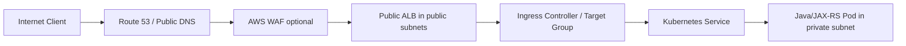
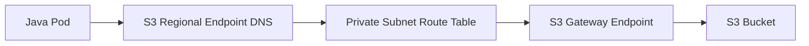
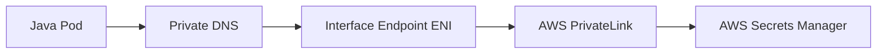
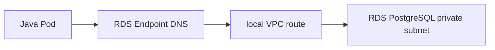

# Part 005 — AWS VPC Deep Dive

> Fokus part ini adalah memahami AWS VPC sebagai private network boundary untuk backend production system. Ini bukan tutorial klik console. Ini adalah cara membaca, menilai, dan men-debug desain VPC untuk aplikasi Java/JAX-RS, EKS, PostgreSQL, Kafka, RabbitMQ, Redis, Camunda, NGINX, private endpoint, dan hybrid connectivity.

AWS VPC adalah salah satu fondasi paling penting dalam sistem enterprise. Banyak incident yang terlihat seperti masalah aplikasi sebenarnya berasal dari VPC: route table salah, subnet kehabisan IP, security group terlalu sempit, NACL stateless memblokir ephemeral port, NAT Gateway bottleneck, DNS private hosted zone tidak terhubung, atau endpoint policy menolak akses.

Senior backend engineer tidak harus menjadi network engineer penuh. Tetapi untuk sistem production, engineer harus mampu menjawab:

- request ini masuk lewat jalur mana?
- pod ini keluar lewat NAT, VPC endpoint, PrivateLink, atau peering?
- database/broker/cache bisa diakses dari subnet mana?
- identity sudah benar tetapi network menolak, atau network benar tetapi IAM menolak?
- apakah traffic private benar-benar private?
- apa blast radius jika satu subnet, AZ, NAT Gateway, endpoint, atau route table bermasalah?

---

## 1. Core mental model

Amazon VPC adalah virtual network di dalam AWS account dan region. Di dalam VPC, Anda mendefinisikan alamat IP privat, subnet, routing, security boundary, gateway, endpoint, dan konektivitas ke jaringan lain.

Model sederhananya:

```text
AWS Account
  └── Region
      └── VPC: 10.20.0.0/16
          ├── Availability Zone A
          │   ├── public subnet
          │   └── private subnet
          ├── Availability Zone B
          │   ├── public subnet
          │   └── private subnet
          ├── route tables
          ├── security groups
          ├── network ACLs
          ├── internet gateway
          ├── NAT gateway
          ├── VPC endpoints
          ├── private hosted zones
          └── flow logs
```

VPC bukan hanya “network untuk EC2”. VPC adalah boundary untuk banyak resource:

- EKS node dan pod networking
- RDS PostgreSQL
- Amazon MSK
- Amazon MQ
- ElastiCache Redis/Valkey
- internal load balancer
- VPC endpoints
- private APIs
- hybrid connectivity
- security inspection path

Dalam konteks Java/JAX-RS service, VPC menentukan apakah service bisa menerima request, bisa memanggil dependency, bisa resolve DNS internal, bisa connect ke database, dan bisa mengirim telemetry.

---

## 2. Kenapa VPC ada?

VPC menyelesaikan kebutuhan enterprise networking berikut:

| Kebutuhan | Peran VPC |
|---|---|
| Private network isolation | Resource ditempatkan di private address space yang dikontrol |
| Environment separation | Dev/test/prod bisa dipisah lewat account/VPC/subnet |
| Controlled ingress | Public access hanya lewat ALB/NLB/API Gateway/edge yang disengaja |
| Controlled egress | Outbound traffic dikendalikan lewat NAT, endpoint, firewall, atau proxy |
| Private managed service access | RDS, MSK, MQ, Redis, S3, Secrets Manager, ECR, dan service lain bisa diakses private |
| Hybrid connectivity | On-prem dapat terhubung via VPN, Direct Connect, Transit Gateway |
| Security segmentation | Security Group, NACL, route table, subnet, endpoint policy, dan firewall membatasi traffic |
| Auditability | Flow logs memberi bukti allow/deny path pada level network interface |

Kesalahan framing yang sering terjadi: menganggap VPC sebagai “satu network datar”. Dalam production, VPC adalah kombinasi beberapa boundary:

```text
CIDR boundary
  + subnet/AZ boundary
  + routing boundary
  + security group boundary
  + endpoint boundary
  + DNS boundary
  + account boundary
  + operational ownership boundary
```

---

## 3. Lifecycle VPC dalam sistem production

VPC biasanya tidak dibuat oleh backend engineer per feature. Dalam enterprise, VPC sering menjadi bagian dari landing zone dan dikelola lewat IaC oleh platform/network team.

Lifecycle normal:

```text
1. Design CIDR
2. Create VPC
3. Create subnets per AZ
4. Attach internet gateway if public ingress/egress needed
5. Create route tables
6. Create NAT Gateway for private subnet outbound if required
7. Create security group baselines
8. Configure NACL if organization requires subnet-level controls
9. Create VPC endpoints / PrivateLink endpoints
10. Associate Route 53 private hosted zones
11. Enable flow logs
12. Integrate with EKS/RDS/MSK/MQ/Redis/load balancer
13. Monitor IP capacity, flow logs, route changes, cost, and connectivity health
14. Evolve with peering, Transit Gateway, Direct Connect, or inspection layer
```

Untuk backend engineer, pertanyaan penting bukan “siapa membuat VPC”, tetapi “apakah desain VPC mendukung runtime contract aplikasi”.

Runtime contract meliputi:

- ingress path stabil
- egress path eksplisit
- dependency path private jika diwajibkan
- DNS resolution benar
- service discovery benar
- identity dan network tidak saling bertentangan
- observability tersedia saat failure
- perubahan network bisa direview sebelum production

---

## 4. VPC dan CIDR

CIDR menentukan address space private untuk VPC. Contoh:

```text
VPC CIDR: 10.40.0.0/16
```

Dari CIDR ini, subnet dibuat untuk public, private application, database, endpoint, atau inspection layer.

Contoh pembagian sederhana:

```text
10.40.0.0/16
  ├── 10.40.0.0/24   public-a
  ├── 10.40.1.0/24   public-b
  ├── 10.40.10.0/22  app-private-a
  ├── 10.40.14.0/22  app-private-b
  ├── 10.40.30.0/24  db-private-a
  ├── 10.40.31.0/24  db-private-b
  └── 10.40.50.0/24  endpoint-private
```

### Why it matters

CIDR adalah keputusan yang sulit diubah. Kesalahan CIDR bisa menyebabkan:

- overlap dengan on-prem
- overlap dengan VPC lain
- tidak cukup IP untuk EKS pod
- sulit melakukan VPC peering
- sulit integrasi Direct Connect/Transit Gateway
- subnet tidak cukup untuk scale node/pod/load balancer

### Backend impact

Untuk Java/JAX-RS service, CIDR terlihat jauh dari code, tetapi efeknya nyata:

- pod tidak dapat dijadwalkan karena subnet IP habis
- deployment gagal scale saat traffic naik
- dependency private tidak bisa diroute karena overlap CIDR
- hybrid client tidak bisa reach service karena route conflict

### Rule of thumb

Jangan desain subnet hanya untuk jumlah node hari ini. Untuk EKS, pikirkan:

```text
required IPs ≈ node ENI capacity + pod IPs + load balancer targets + endpoints + growth buffer
```

Subnet kecil sering menjadi bottleneck tersembunyi pada managed Kubernetes.

---

## 5. Public subnet vs private subnet

Subnet di AWS tidak secara intrinsik “public” atau “private” dari namanya. Subnet menjadi public jika route table-nya punya route ke Internet Gateway untuk `0.0.0.0/0` dan resource memiliki public IP atau load balancer public.

```text
Public subnet route table:
0.0.0.0/0 -> Internet Gateway

Private subnet route table:
0.0.0.0/0 -> NAT Gateway
or
specific AWS service prefix -> VPC Endpoint
or
on-prem CIDR -> Transit Gateway / Virtual Private Gateway
```

### Public subnet biasanya berisi

- public ALB
- public NLB
- NAT Gateway
- bastion host jika masih digunakan
- firewall appliance jika architecture memerlukannya

### Private subnet biasanya berisi

- EKS worker nodes
- application pods
- RDS
- MSK
- Amazon MQ
- ElastiCache
- internal load balancer
- VPC endpoints

### Common mistake

Menyebut subnet “private” tetapi route table mengarah ke Internet Gateway, atau resource diberi public IP. Naming tidak cukup. Yang menentukan adalah route, public IP, gateway, dan security policy.

### Internal verification checklist

- Apakah subnet public/private ditentukan oleh route table, bukan hanya nama?
- Apakah workload application berada di private subnet?
- Apakah database/broker/cache tidak berada di public subnet?
- Apakah public IP assignment dimatikan untuk subnet private?
- Apakah load balancer public hanya berada di subnet yang memang dimaksudkan public?

---

## 6. Route table

Route table menentukan ke mana traffic dari subnet diarahkan. Setiap subnet harus terkait dengan route table. Jika tidak eksplisit, subnet memakai main route table.

Contoh:

```text
Private app subnet route table
Destination       Target
10.40.0.0/16      local
0.0.0.0/0         nat-abc123
10.90.0.0/16      tgw-xyz789
pl-s3             vpce-gateway-s3
```

### Mental model

Routing menjawab pertanyaan:

```text
Untuk destination IP X, next hop-nya siapa?
```

Security group dan NACL menjawab pertanyaan berbeda:

```text
Apakah traffic ini boleh lewat?
```

Jangan campur routing failure dengan authorization failure.

### Common route targets

| Target | Fungsi |
|---|---|
| `local` | Routing antar subnet dalam VPC |
| Internet Gateway | Public internet ingress/egress |
| NAT Gateway | Outbound internet dari private subnet |
| Transit Gateway | Routing ke VPC/on-prem lain |
| VPC peering | Routing antar dua VPC |
| Gateway endpoint | Route private ke S3/DynamoDB |
| Network interface | Appliance/firewall/proxy path |

### Failure mode

- Route ke NAT Gateway hilang: pod tidak bisa outbound ke internet.
- Route ke Transit Gateway salah: on-prem dependency tidak reachable.
- Route lebih spesifik mengarah ke appliance yang down: traffic blackhole.
- Main route table tidak sengaja dipakai subnet baru: subnet punya behavior berbeda dari ekspektasi.
- Route ke S3 gateway endpoint belum diasosiasikan ke private subnet: traffic S3 keluar lewat NAT.

### Debugging questions

- Source subnet memakai route table mana?
- Destination IP setelah DNS resolve berapa?
- Route paling spesifik untuk destination itu apa?
- Target route sehat atau tersedia?
- Ada route propagation dari TGW/VGW/BGP?
- Ada endpoint route/prefix list untuk service AWS?

---

## 7. Internet Gateway

Internet Gateway memungkinkan komunikasi antara VPC dan internet. Untuk resource menerima traffic inbound dari internet, biasanya dibutuhkan:

```text
public subnet route to Internet Gateway
+ public IP or public load balancer
+ security group allow
+ NACL allow
+ DNS record
```

Dalam backend enterprise, workload application sebaiknya tidak langsung memiliki public IP. Public ingress biasanya lewat:

```text
Client
  -> Route 53 / external DNS
  -> WAF / CloudFront / API Gateway if used
  -> public ALB/NLB
  -> ingress / service
  -> pod
```

### Failure mode

- ALB ditempatkan di subnet tanpa route ke IGW.
- DNS mengarah ke load balancer yang salah.
- Security group ALB tidak allow source.
- Target group unhealthy, tetapi internet path terlihat sehat.
- Public IP tidak disengaja pada instance/node.

### Review guidance

Untuk PR/ADR, tanyakan:

- Kenapa resource ini butuh public exposure?
- Apakah exposure bisa lewat gateway/load balancer saja?
- Apakah inbound rule dibatasi?
- Apakah WAF/API Gateway diperlukan?
- Apakah public DNS dan certificate lifecycle jelas?

---

## 8. NAT Gateway

NAT Gateway memungkinkan resource di private subnet melakukan outbound ke internet atau public endpoint tanpa menerima inbound connection langsung dari internet.

Contoh penggunaan:

```text
Pod in private subnet
  -> route table 0.0.0.0/0
  -> NAT Gateway in public subnet
  -> Internet Gateway
  -> external API / public AWS endpoint
```

### Why it matters

NAT sering menjadi hidden dependency. Banyak service terlihat “private”, tetapi sebenarnya memanggil public cloud endpoint via NAT.

Contoh:

- SDK call ke AWS Secrets Manager public endpoint
- image pull dari public registry
- call ke external SaaS
- downloading package saat init container
- telemetry exporter ke public endpoint

### Failure mode

- NAT Gateway di satu AZ menjadi bottleneck atau single-AZ dependency untuk subnet lain.
- Route table private subnet tidak mengarah ke NAT.
- Security appliance setelah NAT menolak traffic.
- Cost membengkak karena traffic S3/CloudWatch/ECR keluar lewat NAT padahal bisa lewat endpoint.
- IP allowlist external hanya mengenali Elastic IP NAT tertentu; saat berubah, integrasi gagal.

### Cost concern

NAT Gateway dapat menjadi sumber biaya besar karena biaya per jam dan data processing. Untuk traffic ke AWS services yang mendukung VPC endpoint, endpoint sering lebih aman dan kadang lebih efisien dibanding keluar lewat NAT.

### Internal verification checklist

- NAT Gateway per AZ atau centralized?
- Private subnet route ke NAT mana?
- NAT Elastic IP dipakai untuk external allowlist?
- Traffic AWS service mana yang masih lewat NAT?
- Apakah VPC endpoint tersedia untuk S3, ECR, CloudWatch, Secrets Manager, STS, dan service lain yang relevan?
- Apakah NAT metrics dan cost dimonitor?

---

## 9. Elastic IP

Elastic IP adalah alamat IPv4 publik statis yang bisa diasosiasikan ke resource tertentu seperti NAT Gateway atau network interface.

Dalam production backend, Elastic IP sering penting untuk:

- outbound allowlist ke partner/external SaaS
- NAT Gateway identity
- fixed public endpoint tertentu

### Failure mode

- Partner allowlist belum update saat NAT EIP berubah.
- EIP tidak sengaja dilepas.
- NAT Gateway recreation menghasilkan EIP berbeda jika tidak dikelola IaC.
- Multiple NAT EIP membuat outbound source IP bervariasi per AZ.

### Review guidance

Jika sistem bergantung pada IP allowlist, dokumentasikan:

- EIP mana yang digunakan.
- Environment mana yang memakai EIP tersebut.
- Partner mana yang meng-allowlist IP itu.
- Apa proses rotasi/perubahan IP.
- Bagaimana mendeteksi call ditolak karena source IP berubah.

---

## 10. Security Group

Security Group adalah virtual firewall stateful yang melekat pada resource seperti ENI, EC2, load balancer, RDS, dan EKS-related resources.

Stateful berarti jika outbound request diizinkan, response traffic umumnya otomatis diizinkan tanpa perlu rule inbound simetris.

Contoh SG rule:

```text
ALB SG
Inbound:
  443 from corporate CIDR / internet / WAF-managed source
Outbound:
  8080 to app SG

App SG
Inbound:
  8080 from ALB SG
Outbound:
  5432 to DB SG
  6379 to Redis SG
  443 to VPC endpoint SG

DB SG
Inbound:
  5432 from App SG
Outbound:
  default or restricted based on policy
```

### SG referencing

Security group bisa mereferensikan security group lain. Ini lebih stabil daripada hardcoding IP pod/node yang bisa berubah.

```text
Allow PostgreSQL 5432 from sg-app
```

Ini cocok untuk managed service seperti RDS yang hanya boleh diakses oleh workload tertentu.

### Common mistakes

- Allow `0.0.0.0/0` ke database atau broker.
- Membuka inbound ke node padahal yang dibutuhkan adalah load balancer to pod/service.
- SG terlalu reusable sehingga blast radius besar.
- Outbound dibuka semua tanpa observability.
- SG rule dibuat manual di console dan drift dari Terraform.

### Debugging SG

Jika Java service mendapat timeout ke dependency:

```text
1. Resolve DNS dependency.
2. Ambil destination IP dan port.
3. Identifikasi source ENI/security group.
4. Identifikasi destination ENI/security group.
5. Cek outbound source SG.
6. Cek inbound destination SG.
7. Cek NACL dan route table jika SG terlihat benar.
```

Access denied dari SDK biasanya bukan SG issue. Timeout atau connection refused lebih sering network/endpoint/listener issue. Tetapi TLS handshake failure bisa berasal dari salah endpoint, proxy, certificate, atau SNI.

---

## 11. Network ACL

Network ACL atau NACL adalah filter stateless di level subnet. Berbeda dengan Security Group yang stateful, NACL membutuhkan rule inbound dan outbound yang simetris untuk request dan response.

### Why NACL is risky

Karena stateless, NACL bisa memblokir ephemeral port response.

Contoh HTTP call:

```text
Client ephemeral port 49152 -> Server port 443
Server port 443 -> Client ephemeral port 49152
```

Jika outbound/inbound ephemeral port tidak diizinkan, traffic bisa gagal walaupun Security Group benar.

### Practical stance

Banyak environment memakai NACL default permissive dan mengandalkan Security Group untuk kontrol utama. Beberapa enterprise menambahkan NACL sebagai guardrail subnet-level. Jika NACL digunakan ketat, dokumentasi ephemeral port dan traffic matrix wajib jelas.

### Failure mode

- Health check load balancer gagal karena ephemeral response diblokir.
- Pod bisa connect ke service A tetapi tidak service B karena subnet berbeda NACL.
- On-prem traffic masuk tetapi response keluar diblokir.
- Debugging membingungkan karena SG terlihat benar.

### Internal verification checklist

- Apakah NACL custom digunakan?
- Subnet mana yang memakai NACL custom?
- Apakah ephemeral port range diizinkan?
- Apakah rule number ordering jelas?
- Apakah deny eksplisit didokumentasikan?
- Apakah ada flow log untuk traffic rejected?

---

## 12. VPC Peering

VPC Peering menghubungkan dua VPC sehingga resource bisa berkomunikasi menggunakan private IP.

### Use cases

- workload VPC ke shared service VPC
- app VPC ke data VPC
- dev/test integration jika diizinkan
- legacy VPC connectivity

### Caveat penting

VPC Peering bukan transit router. Jika VPC A peer ke B dan B peer ke C, A tidak otomatis bisa reach C lewat B.

```text
A <-> B <-> C
A cannot transit through B to C via peering
```

Untuk hub-and-spoke enterprise, Transit Gateway sering lebih cocok.

### Failure mode

- Route table belum ditambahkan di kedua sisi.
- Security Group/NACL menolak traffic.
- CIDR overlap.
- DNS resolution antar VPC tidak diaktifkan sesuai kebutuhan.
- Asumsi transitive routing yang salah.

---

## 13. Transit Gateway

Transit Gateway adalah hub routing untuk menghubungkan banyak VPC dan on-prem network secara lebih scalable daripada banyak peering bilateral.

Model:

```text
            VPC App Prod
                |
VPC Shared -- Transit Gateway -- On-prem via Direct Connect/VPN
                |
            VPC Data Prod
```

### Why it matters

Dalam enterprise, dependency sering tersebar:

- app di satu VPC
- shared service di VPC lain
- database atau integration service di network lain
- on-prem system lewat Direct Connect
- inspection firewall sebagai centralized egress/ingress

Transit Gateway menentukan routing domain dan blast radius.

### Backend impact

Jika Java service timeout ke on-prem API, root cause bisa berada di:

- pod subnet route table
- Transit Gateway attachment
- TGW route table
- firewall
- Direct Connect/VPN
- on-prem route return path
- DNS forwarding

### Internal verification checklist

- Apakah VPC attached ke Transit Gateway?
- TGW route table mana yang dipakai?
- Route propagated atau static?
- Ada firewall/inspection VPC?
- On-prem CIDR apa yang reachable?
- Apakah return route dari on-prem benar?
- Siapa owner TGW?

---

## 14. VPC Endpoint

VPC Endpoint memungkinkan private connectivity dari VPC ke AWS services atau endpoint service tanpa harus keluar lewat public internet.

Ada dua tipe utama:

| Tipe | Contoh | Cara kerja |
|---|---|---|
| Gateway Endpoint | S3, DynamoDB | Route table mengarah ke gateway endpoint menggunakan prefix list |
| Interface Endpoint | Secrets Manager, STS, ECR API, CloudWatch, SSM, KMS, banyak service lain | ENI private IP di subnet, memakai AWS PrivateLink |

### Gateway Endpoint

Gateway endpoint biasanya digunakan untuk S3/DynamoDB.

```text
Private subnet route table
Destination: S3 prefix list
Target: S3 gateway endpoint
```

Manfaat:

- traffic tidak perlu NAT
- bisa dibatasi dengan endpoint policy
- lebih private dan eksplisit

### Interface Endpoint

Interface endpoint membuat ENI dengan private IP di subnet Anda. Aplikasi mengakses service AWS melalui DNS yang resolve ke private IP endpoint.

```text
Pod
  -> DNS secretsmanager.<region>.amazonaws.com
  -> private IP endpoint ENI
  -> AWS PrivateLink
  -> AWS Secrets Manager
```

### Critical DNS behavior

Interface endpoint sering memakai private DNS. Jika private DNS enabled, hostname public AWS service dapat resolve ke private IP endpoint dari dalam VPC.

Jika DNS salah:

- request bisa keluar lewat NAT tanpa disadari
- request gagal karena hostname tidak resolve
- request resolve ke public IP padahal egress public dilarang
- endpoint tersedia tetapi aplikasi masih memanggil endpoint lain/region lain

### Endpoint policy

Endpoint policy dapat membatasi action/resource yang boleh dilewati endpoint. Ini layer tambahan selain IAM.

Access failure bisa berasal dari:

```text
IAM denies
or
resource policy denies
or
endpoint policy denies
or
KMS/key policy denies
or
SCP/permission boundary denies
```

### Internal verification checklist

- Endpoint apa saja yang tersedia?
- Gateway endpoint untuk S3 ada di route table subnet aplikasi?
- Interface endpoint dibuat di AZ/subnet mana?
- Private DNS enabled?
- Security Group endpoint allow dari app subnet/node/pod?
- Endpoint policy membatasi resource/action apa?
- SDK region sesuai endpoint region?
- Flow logs menunjukkan traffic ke endpoint ENI atau NAT?

---

## 15. AWS PrivateLink

PrivateLink adalah mekanisme untuk mengakses service secara private melalui interface endpoint. Service bisa berupa AWS-managed service, marketplace service, atau service milik internal account lain.

Model:

```text
Consumer VPC
  Pod/VM
    -> Interface Endpoint ENI
      -> AWS PrivateLink
        -> Provider NLB / Endpoint Service
          -> Provider service
```

### Use cases

- private API antar account
- exposing internal platform service tanpa VPC peering
- partner/customer private connectivity
- shared service access dengan blast radius lebih kecil

### Why PrivateLink is not just peering

PrivateLink memberi akses ke service, bukan akses penuh ke network. Ini lebih sempit daripada VPC peering atau Transit Gateway.

| Pattern | Exposure |
|---|---|
| Peering | Network-to-network routing |
| Transit Gateway | Hub network routing |
| PrivateLink | Service-specific private access |

Untuk enterprise, PrivateLink sering lebih defensible karena consumer hanya melihat endpoint service, bukan seluruh VPC provider.

### Failure mode

- Endpoint connection belum accepted.
- NLB target unhealthy di provider side.
- Endpoint SG menolak consumer.
- Private DNS tidak dikonfigurasi.
- Consumer memanggil hostname salah.
- Provider mengubah service port/listener.

---

## 16. Route 53 Private Hosted Zone

Route 53 Private Hosted Zone menyediakan DNS private yang hanya resolve di VPC terkait.

Contoh:

```text
internal.example.corp
  api.quote-order.internal.example.corp -> internal ALB
  postgres.quote-order.internal.example.corp -> RDS endpoint alias/CNAME
  redis.quote-order.internal.example.corp -> Redis endpoint
```

### Why it matters

DNS private memberi stable service name di atas infrastructure yang berubah. Untuk Java service, ini berarti config bisa memakai hostname stabil, bukan IP.

### Failure mode

- Private hosted zone tidak associated ke VPC yang menjalankan workload.
- Ada overlapping zone yang membuat resolusi berbeda antar VPC.
- TTL terlalu tinggi saat failover.
- CNAME mengarah ke endpoint lama.
- Split-horizon DNS membuat local laptop dan pod resolve IP berbeda.
- Hybrid DNS forwarding tidak mengarah ke resolver yang benar.

### Debugging DNS dari pod

```bash
nslookup service.internal.example.corp
getent hosts service.internal.example.corp
curl -v https://service.internal.example.corp/health
```

Lalu validasi:

- IP yang didapat private atau public?
- IP berada di CIDR yang expected?
- hostname resolve berbeda dari node, pod, dan on-prem?
- TTL berapa?
- CoreDNS meneruskan query ke resolver yang benar?

---

## 17. VPC Flow Logs

VPC Flow Logs menangkap informasi IP traffic ke/dari network interface di VPC. Flow logs berguna untuk menjawab:

- apakah traffic sampai ke ENI?
- source/destination IP dan port apa?
- accepted atau rejected?
- traffic melewati interface mana?
- ada spike traffic ke NAT/endpoint/database?

Flow logs bukan packet capture penuh. Ia tidak menunjukkan payload, HTTP status, SQL error, atau TLS detail. Tetapi sangat berguna untuk memisahkan network-level reject dari application-level failure.

### Practical incident use

Jika service timeout ke RDS:

```text
1. Ambil source pod/node IP.
2. Ambil RDS endpoint IP.
3. Query flow logs untuk src/dst/port 5432.
4. Jika REJECT: cek SG/NACL/routing.
5. Jika ACCEPT tapi aplikasi timeout: cek DB listener, TLS, connection pool, DNS, overload, atau client timeout.
```

### Observability concern

Flow logs punya biaya dan volume. Jangan aktifkan tanpa retention dan query strategy. Tetapi untuk production VPC, minimal high-value subnet/resource harus bisa diaudit.

---

## 18. End-to-end AWS VPC traffic examples

### 18.1 Public client to Java/JAX-RS service on EKS



Review points:

- DNS points to correct ALB.
- ALB scheme is internet-facing.
- ALB subnets are public.
- ALB SG allows intended sources.
- Target group health check path is correct.
- Pod readiness and liveness are correct.
- Timeout chain is aligned.

### 18.2 Pod to S3 using Gateway Endpoint



Review points:

- S3 gateway endpoint associated with private subnet route table.
- Bucket policy allows endpoint if restricted by `aws:sourceVpce`.
- IAM role allows S3 action.
- SDK region matches bucket/endpoint expectation.
- Traffic does not go through NAT.

### 18.3 Pod to Secrets Manager using Interface Endpoint



Review points:

- Interface endpoint exists for Secrets Manager.
- Private DNS enabled.
- Endpoint SG allows source.
- IAM role allows `secretsmanager:GetSecretValue`.
- Endpoint policy does not deny.
- SDK region correct.

### 18.4 Pod to RDS PostgreSQL



Review points:

- RDS endpoint resolves to private IP.
- App SG outbound allows 5432 to DB SG.
- DB SG inbound allows 5432 from app SG.
- NACL allows ephemeral traffic.
- DB parameter/max connection compatible with pool.
- TLS requirement configured correctly.

---

## 19. Impact to Java/JAX-RS backend

VPC decisions affect Java services through several runtime surfaces.

### 19.1 Startup

Startup can fail if service retrieves config/secret from AWS service but endpoint/DNS/IAM is wrong.

Symptoms:

- application boot timeout
- credential provider timeout
- secret retrieval exception
- readiness probe never healthy

Design guidance:

- set bounded SDK timeouts
- fail fast for mandatory config
- use cached/last-known-good config only if explicitly safe
- expose clear startup diagnostics without leaking secrets

### 19.2 Request handling

Network path affects latency and timeout budget.

```text
HTTP request timeout
  > app thread timeout
    > DB call timeout
    > SDK call timeout
    > retry/backoff budget
```

If VPC endpoint or NAT introduces latency and SDK retry is too aggressive, Java thread pool can saturate.

### 19.3 Connection pooling

Private database/broker/cache connectivity requires stable DNS, route, SG, and failover behavior.

Common risks:

- pool keeps stale connections after failover
- DNS TTL ignored by long-lived client
- connection timeout too high
- retries amplify outage
- route change causes partial connectivity across pods

### 19.4 Logging and observability

If logs are shipped to CloudWatch or external collector, egress path matters. If endpoint/NAT/proxy fails, application may continue serving traffic but telemetry disappears.

---

## 20. Impact to EKS

EKS is deeply coupled with VPC.

Key points:

- worker nodes run in VPC subnets
- VPC CNI assigns pod IPs from VPC CIDR by default
- subnet IP exhaustion can block pod scheduling
- ALB/NLB integration depends on subnet tags and AWS Load Balancer Controller
- IRSA depends on OIDC and STS reachability
- private cluster endpoint changes how kubectl/control-plane access works
- security groups control node, pod, load balancer, and endpoint traffic

### EKS-specific failure modes

| Symptom | Possible VPC root cause |
|---|---|
| Pod pending | subnet IP exhaustion, node capacity, CNI issue |
| ALB not created | subnet tags missing, IAM issue, controller issue |
| Target unhealthy | SG, health check path, pod readiness, target type mismatch |
| Pod cannot call AWS service | missing endpoint/NAT, SG endpoint deny, DNS, IAM |
| Image pull fails | ECR endpoint missing, NAT/proxy issue, IAM auth issue |
| kubectl cannot access cluster | private endpoint, VPN, SG, endpoint access config |

---

## 21. Impact to PostgreSQL, Kafka, RabbitMQ, Redis, Camunda, and NGINX

### PostgreSQL

VPC controls private DB access.

Review:

- RDS subnet group spans multiple AZs.
- DB SG only allows app SG or approved admin access.
- No public accessibility unless explicitly justified.
- Route from EKS subnet to DB subnet is local or through intended firewall.
- Backup/monitoring access is private and audited.

### Kafka / MSK

Kafka is sensitive to DNS, broker advertised listeners, subnet reachability, and security group rules.

Review:

- broker endpoints resolve correctly from pod.
- required ports are open.
- client bootstrap list matches private connectivity.
- cross-AZ traffic and cost are understood.
- security group allows broker-to-broker and client-to-broker paths.

### RabbitMQ / Amazon MQ

Review:

- broker endpoint private/public expectation.
- AMQP/TLS ports open.
- management UI exposure controlled.
- SG allows only intended app/admin sources.
- failover endpoint behavior understood.

### Redis / ElastiCache

Review:

- Redis subnet group private.
- SG allows only app SG.
- TLS/AUTH/ACL requirement.
- cluster mode endpoint behavior.
- failover and DNS behavior.

### Camunda

Camunda often depends on database, REST API, workers, and sometimes external systems.

Review:

- workers can reach broker/API privately.
- Camunda DB path stable.
- callbacks/webhooks are explicitly exposed via gateway/load balancer if needed.
- job workers have bounded retry/timeout.

### NGINX

NGINX may appear as ingress controller, reverse proxy, or edge component.

Review:

- NGINX ingress service type creates intended ALB/NLB path.
- source IP preservation requirement is clear.
- proxy timeout aligns with ALB/NLB and Java service.
- health check path is stable.
- upstream DNS resolution behavior understood.

---

## 22. Failure modes to memorize

### 22.1 Network unreachable

Possible causes:

- route table missing route
- Transit Gateway route missing
- peering route missing
- endpoint subnet unreachable
- firewall/appliance blackhole
- CIDR overlap

### 22.2 Timeout

Possible causes:

- SG outbound/inbound deny
- NACL deny ephemeral port
- route blackhole
- endpoint SG deny
- DNS resolves to wrong IP
- dependency overloaded
- NAT Gateway issue

### 22.3 Connection refused

Possible causes:

- destination listener not running
- wrong port
- load balancer target unhealthy
- service endpoint mismatch
- application not bound to expected interface

### 22.4 TLS failure

Possible causes:

- wrong hostname/SNI
- certificate mismatch
- private CA not trusted
- proxy/TLS inspection
- connecting to wrong endpoint

### 22.5 AccessDenied from AWS SDK

Possible causes:

- IAM role lacks action
- trust policy wrong
- endpoint policy denies
- resource policy denies
- KMS policy denies
- SCP/permission boundary denies

Do not debug AccessDenied primarily via route table. Network can be perfect while IAM denies.

### 22.6 Works in one AZ but not another

Possible causes:

- subnet route tables differ
- NAT Gateway missing per AZ
- endpoint ENI not present/allowed in all subnets
- SG/NACL differs
- load balancer target only healthy in one AZ
- subnet tags inconsistent

---

## 23. Production-safe debugging playbook

### 23.1 Start from symptom classification

Classify symptom first:

```text
DNS failure?
TCP timeout?
Connection refused?
TLS error?
HTTP 4xx?
HTTP 5xx?
AWS SDK AccessDenied?
Throttling?
Application-level error?
```

Different symptom means different layer.

### 23.2 Gather facts

From application/pod:

```bash
hostname
ip addr
cat /etc/resolv.conf
nslookup <dependency-host>
curl -v --connect-timeout 3 https://<dependency-host>/health
```

From Kubernetes:

```bash
kubectl get pod -o wide
kubectl describe pod <pod>
kubectl get svc,endpoints,endpointslice
kubectl logs <pod>
```

From AWS/network:

- source subnet
- source route table
- source security group
- destination security group
- endpoint ID
- load balancer target health
- flow logs
- CloudTrail for config/IAM changes

### 23.3 Use layer-by-layer elimination

```text
1. DNS resolves?
2. Destination IP expected?
3. Route table has next hop?
4. SG allows?
5. NACL allows?
6. Endpoint policy allows?
7. IAM/resource policy allows?
8. Service listener healthy?
9. Application timeout/retry sane?
10. Observability confirms same trace/correlation?
```

### 23.4 Avoid unsafe fixes

Do not “temporarily” open:

- `0.0.0.0/0` to database
- all outbound from production without record
- public access to private resource
- broad IAM just to test
- manual route/SG changes outside IaC without tracking

Prefer targeted diagnostic access with approval and rollback.

---

## 24. Architecture trade-offs

### NAT Gateway vs VPC endpoint

| Option | Strength | Risk |
|---|---|---|
| NAT Gateway | Simple general outbound | Cost, public endpoint dependency, broad egress |
| VPC Endpoint | Private, service-specific, policy control | More endpoint/DNS/policy complexity |

### Peering vs Transit Gateway vs PrivateLink

| Option | Best for | Watch out |
|---|---|---|
| VPC Peering | Simple VPC-to-VPC private routing | Not transitive, route sprawl |
| Transit Gateway | Many networks, hub-and-spoke, on-prem | Central blast radius, route table complexity, cost |
| PrivateLink | Service-specific private exposure | Provider/consumer endpoint complexity, DNS |

### Security Group vs NACL

| Control | Layer | State | Best use |
|---|---|---|---|
| Security Group | ENI/resource | Stateful | Primary workload-level firewall |
| NACL | Subnet | Stateless | Coarse subnet guardrail if required |

---

## 25. Correctness concerns

Cloud networking can break correctness, not only availability.

Examples:

- Java service writes to wrong endpoint because DNS private zone points to non-prod database.
- Cross-account endpoint policy allows wrong bucket.
- Kafka client connects to public broker endpoint with different listener behavior.
- Presigned URL generated for wrong region/endpoint.
- Redis failover changes primary but client cache does not recover.
- Camunda worker retries because callback route blocked, causing duplicate side effects.

Correctness review must include network and DNS, not only code.

---

## 26. Security concerns

Review these aggressively:

- public subnet resource inventory
- public IP usage
- SG allowing `0.0.0.0/0`
- database/broker/cache exposure
- endpoint policy scope
- bucket/resource policy with VPC endpoint condition
- flow logs enabled for sensitive subnets
- cross-account access path
- route to inspection/firewall if mandated
- manual console drift from IaC

Security posture is not just IAM. Network reachability is also authorization surface.

---

## 27. Performance concerns

VPC design affects latency and throughput:

- cross-AZ traffic adds latency and cost
- NAT Gateway can become central egress dependency
- PrivateLink adds network hop but improves private access
- DNS TTL and client caching affect failover speed
- subnet IP exhaustion affects scale-out
- load balancer target type affects hop count and health behavior
- flow logs/logging volume can affect observability cost, not app latency directly

For Java services, align:

- connection timeout
- socket timeout
- pool size
- retry budget
- load balancer idle timeout
- ingress timeout
- SDK timeout

---

## 28. Cost concerns

Common AWS VPC-related cost drivers:

- NAT Gateway hourly and data processing
- cross-AZ traffic
- inter-region traffic
- load balancer hourly/LCU
- VPC endpoint hourly/data processing
- Transit Gateway attachment/data processing
- flow logs ingestion/storage/query
- public IPv4 address charges depending on resource model

Cost review questions:

- Is high-volume S3 traffic using gateway endpoint?
- Is CloudWatch/ECR/Secrets traffic going through NAT unnecessarily?
- Are services chatting cross-AZ too much?
- Are unused endpoints/load balancers left behind?
- Are flow log retention and query strategy controlled?

---

## 29. Observability concerns

Minimum useful signals:

- VPC Flow Logs for critical subnets/interfaces
- NAT Gateway metrics
- load balancer target health
- endpoint metrics where available
- Route 53 query logs if enabled/allowed
- EKS CNI/IP capacity metrics
- application dependency metrics
- CloudTrail for route/SG/NACL/endpoint changes

Correlate application symptom with network evidence:

```text
App timeout spike
  + DNS resolution logs
  + flow log reject/accept
  + target health
  + NAT/endpoint metrics
  + CloudTrail config changes
```

---

## 30. PR review checklist

Use this for PR/ADR touching AWS networking.

### VPC/subnet

- [ ] VPC and subnet selection matches environment and data classification.
- [ ] Subnet has sufficient IP capacity.
- [ ] AZ placement is intentional.
- [ ] Public/private subnet behavior is proven by route table.
- [ ] No accidental public IP exposure.

### Routing

- [ ] Route table is explicit.
- [ ] NAT/endpoint/TGW/peering path is intentional.
- [ ] Return path is understood.
- [ ] No overlapping CIDR issue.
- [ ] No dependency on main route table by accident.

### Security

- [ ] SG rules are least privilege.
- [ ] No broad inbound to database/broker/cache.
- [ ] NACL impact is understood.
- [ ] Endpoint policy is reviewed.
- [ ] Public exposure is justified.

### DNS

- [ ] Private hosted zone association is correct.
- [ ] Hostname resolves to expected private/public IP.
- [ ] TTL supports failover requirements.
- [ ] Split-horizon/hybrid DNS behavior is understood.

### EKS/application

- [ ] Pod subnet has enough IPs.
- [ ] Load balancer controller annotations are correct.
- [ ] Target type is intentional.
- [ ] Java timeouts/retries align with network path.
- [ ] Observability exists for failure.

### Cost/operations

- [ ] NAT data path reviewed.
- [ ] VPC endpoints used where appropriate.
- [ ] Flow logs retention/cost reviewed.
- [ ] Runbook updated.
- [ ] IaC is source of truth.

---

## 31. Internal verification checklist

Use this checklist with platform/SRE/security/backend team. Do not assume these details.

### VPC baseline

- [ ] AWS account ID for each environment.
- [ ] Region and AZs used.
- [ ] VPC ID and CIDR.
- [ ] Subnet list, CIDR, AZ, and purpose.
- [ ] Public/private subnet naming convention.
- [ ] Subnet IP utilization dashboard.

### Routing

- [ ] Route table per subnet.
- [ ] Internet Gateway usage.
- [ ] NAT Gateway placement and Elastic IP.
- [ ] Transit Gateway attachment and route tables.
- [ ] VPC peering if any.
- [ ] On-prem routes.
- [ ] Firewall/inspection path.

### Security controls

- [ ] Security Group baseline.
- [ ] NACL custom rules.
- [ ] Public exposure inventory.
- [ ] Database/broker/cache SG rules.
- [ ] Endpoint SG rules.
- [ ] CloudTrail/audit source.

### Private connectivity

- [ ] Gateway endpoints.
- [ ] Interface endpoints.
- [ ] PrivateLink provider/consumer relationships.
- [ ] Endpoint policies.
- [ ] Private DNS enabled/disabled per endpoint.
- [ ] Route 53 private hosted zones and associations.

### EKS/application integration

- [ ] EKS subnet mapping.
- [ ] VPC CNI config.
- [ ] AWS Load Balancer Controller config.
- [ ] ALB/NLB subnets and SG.
- [ ] IRSA/STs endpoint reachability.
- [ ] ECR endpoint/NAT path.
- [ ] CloudWatch/logging path.

### Operations

- [ ] VPC Flow Logs destination and retention.
- [ ] NAT Gateway metrics and alarms.
- [ ] Load balancer target health dashboard.
- [ ] Runbook for DNS/network/load balancer failures.
- [ ] IaC repo owning VPC.
- [ ] Change approval process.
- [ ] Incident notes involving networking.

---

## 32. Summary

AWS VPC adalah runtime boundary yang menentukan bagaimana aplikasi production berkomunikasi. Untuk senior backend engineer, VPC harus dibaca sebagai kombinasi routing, DNS, security, private connectivity, observability, cost, dan operational ownership.

Mental model yang harus dibawa:

```text
DNS tells you where.
Route table tells you next hop.
Security Group/NACL tells you whether traffic may pass.
Endpoint policy/IAM tells you whether service action is allowed.
Flow logs tell you what happened at network level.
Application telemetry tells you what happened at runtime level.
```

Jika Anda bisa menjelaskan alur dari pod Java/JAX-RS ke RDS, S3, Secrets Manager, Kafka/RabbitMQ, Redis, NGINX ingress, dan on-prem dependency melalui VPC, Anda sudah melewati level “tahu AWS service” menuju level “mampu men-debug production architecture”.

---

## Vendor references

- AWS VPC documentation: https://docs.aws.amazon.com/vpc/latest/userguide/what-is-amazon-vpc.html
- AWS VPC route tables: https://docs.aws.amazon.com/vpc/latest/userguide/subnet-route-tables.html
- AWS security groups: https://docs.aws.amazon.com/vpc/latest/userguide/vpc-security-groups.html
- AWS network ACLs: https://docs.aws.amazon.com/vpc/latest/userguide/vpc-network-acls.html
- AWS NAT Gateway: https://docs.aws.amazon.com/vpc/latest/userguide/vpc-nat-gateway.html
- AWS VPC endpoints and PrivateLink: https://docs.aws.amazon.com/vpc/latest/privatelink/what-is-privatelink.html
- AWS gateway endpoints: https://docs.aws.amazon.com/vpc/latest/privatelink/gateway-endpoints.html
- AWS VPC Flow Logs: https://docs.aws.amazon.com/vpc/latest/userguide/flow-logs.html
