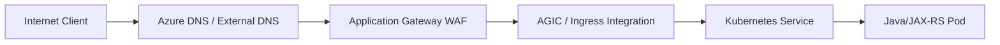
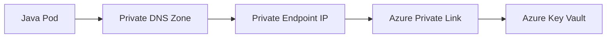
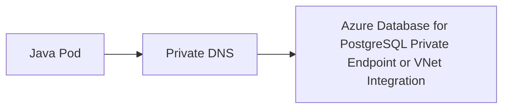
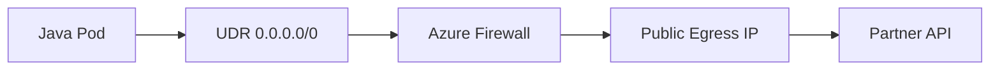

# Part 006 — Azure VNet Deep Dive

> Fokus part ini adalah memahami Azure Virtual Network sebagai private network boundary untuk backend production system. Ini bukan katalog layanan Azure. Ini adalah cara membaca, menilai, dan men-debug desain VNet untuk aplikasi Java/JAX-RS, AKS, PostgreSQL, Kafka/RabbitMQ, Redis, Camunda, NGINX, private endpoint, hybrid connectivity, dan enterprise network governance.

Azure VNet adalah fondasi network untuk banyak resource Azure. Banyak failure yang tampak seperti bug aplikasi sebenarnya berasal dari VNet: UDR salah, NSG menolak flow baru, subnet kehabisan IP untuk AKS, private endpoint DNS salah, Azure Firewall memblokir egress, NAT Gateway tidak terasosiasi, atau route dari on-prem tidak simetris.

Senior backend engineer perlu mampu menjawab:

- pod/service berjalan di subnet mana?
- DNS resolve ke private endpoint atau public endpoint?
- traffic keluar lewat NAT Gateway, Azure Firewall, Private Endpoint, atau public endpoint?
- NSG mana yang berlaku pada subnet atau NIC?
- route table/UDR mana yang mengubah default routing?
- apakah private access ke database/storage/key vault benar-benar private?
- bagaimana men-debug timeout tanpa langsung membuka rule terlalu luas?

---

## 1. Core mental model

Azure Virtual Network adalah private network virtual di dalam Azure region. VNet menyediakan address space, subnet, routing, traffic filtering, dan integrasi private ke Azure services, on-premises networks, serta virtual networks lain.

Model sederhana:

```text
Azure Tenant
  └── Management Group
      └── Subscription
          └── Resource Group
              └── Virtual Network: 10.60.0.0/16
                  ├── subnet: aks-system
                  ├── subnet: aks-user
                  ├── subnet: private-endpoints
                  ├── subnet: app-gateway
                  ├── subnet: database
                  ├── route tables / UDR
                  ├── NSG
                  ├── Azure Firewall / NVA path
                  ├── NAT Gateway
                  ├── Private Endpoint
                  ├── Private DNS Zone links
                  └── Network Watcher diagnostics
```

VNet bukan hanya network untuk VM. Dalam enterprise backend, VNet memengaruhi:

- AKS node dan pod networking
- Azure Database for PostgreSQL
- Azure Cache for Redis
- Azure Service Bus/Event Hubs jika digunakan
- private endpoint untuk Storage, Key Vault, Container Registry, App Configuration, PostgreSQL, dan layanan lain
- Application Gateway / internal load balancer
- Azure Firewall and forced tunneling
- VPN/ExpressRoute/on-prem routing
- DNS resolution
- logging dan diagnostics

---

## 2. Kenapa VNet ada?

VNet ada untuk memberi private networking control di cloud.

| Kebutuhan | Peran VNet |
|---|---|
| Private address space | Resource memakai IP privat dalam CIDR VNet |
| Subnet segmentation | AKS, private endpoint, database, gateway, firewall bisa dipisah |
| Traffic filtering | NSG dan Azure Firewall membatasi inbound/outbound |
| Routing control | System route dan user-defined route mengontrol next hop |
| Private PaaS access | Private Endpoint/Private Link membawa service ke IP privat VNet |
| Hybrid connectivity | VPN Gateway/ExpressRoute menghubungkan on-prem |
| Hub-spoke design | VNet peering, Virtual WAN, firewall hub, shared services |
| Observability | Network Watcher, connection troubleshoot, flow logs, topology |

Kesalahan umum: menganggap VNet sama dengan VPC secara detail. Konsepnya mirip, tetapi semantics Azure berbeda pada resource group, NSG, UDR, Private Endpoint, Private DNS Zone, managed identity, dan hub-spoke governance.

---

## 3. Lifecycle VNet dalam enterprise system

Dalam enterprise, VNet biasanya bukan dibuat per aplikasi sembarangan. Ia bagian dari landing zone dan sering dikelola lewat Terraform/Bicep oleh platform/network team.

Lifecycle umum:

```text
1. Design address space
2. Create VNet
3. Create subnet per purpose
4. Associate NSG to subnet/NIC if needed
5. Associate route table / UDR if needed
6. Attach NAT Gateway if outbound internet via static egress required
7. Integrate Azure Firewall/NVA if forced egress inspection required
8. Configure VNet peering / Virtual WAN / VPN / ExpressRoute
9. Create Private Endpoints for PaaS services
10. Link Private DNS Zones
11. Integrate AKS/App Gateway/Load Balancer
12. Enable Network Watcher diagnostics and flow logging strategy
13. Monitor IP utilization, denied flows, route changes, private endpoint health, and cost
```

Backend engineer harus memahami lifecycle ini agar tidak membuat asumsi yang melanggar platform baseline.

Contoh asumsi berbahaya:

- “Aplikasi boleh outbound ke internet langsung.”
- “Storage endpoint pasti public.”
- “Key Vault bisa diakses asal RBAC benar.”
- “AKS pod IP tidak perlu dihitung.”
- “Private Endpoint otomatis membuat DNS benar.”
- “NSG allow rule langsung memutus koneksi lama.”

---

## 4. VNet address space dan subnet

VNet memiliki address space CIDR, misalnya:

```text
VNet: 10.60.0.0/16
```

Subnet dibuat di dalam VNet:

```text
10.60.0.0/16
  ├── 10.60.0.0/24   AzureBastionSubnet if used
  ├── 10.60.1.0/24   AzureFirewallSubnet if used
  ├── 10.60.10.0/22  aks-system
  ├── 10.60.14.0/21  aks-user
  ├── 10.60.30.0/24  private-endpoints
  ├── 10.60.40.0/24  app-gateway
  └── 10.60.50.0/24  data-services
```

### Subnet purpose matters

Beberapa layanan Azure memiliki requirement subnet khusus. Misalnya Application Gateway membutuhkan subnet sendiri. Azure Firewall memakai subnet bernama khusus. Private Endpoint sebaiknya ditempatkan pada subnet yang jelas dan dikelola dengan hati-hati.

### AKS impact

Dengan Azure CNI, pod IP dapat dialokasikan dari VNet/subnet. Artinya subnet sizing langsung memengaruhi kemampuan scale pod.

Jika subnet terlalu kecil:

- node pool tidak bisa scale
- pod tidak mendapat IP
- deployment gagal saat traffic spike
- upgrade terganggu karena node tambahan tidak bisa dibuat

### Internal verification checklist

- CIDR VNet dan semua subnet.
- Subnet purpose dan owner.
- AKS subnet sizing.
- Private endpoint subnet.
- App Gateway subnet.
- Firewall subnet.
- Overlap dengan on-prem atau cloud lain.
- IP utilization dashboard.

---

## 5. Azure route table dan User Defined Route

Azure memiliki system routes secara default. Route table custom dapat ditambahkan untuk membuat User Defined Routes atau UDR.

Mental model:

```text
Destination IP
  -> effective routes on NIC/subnet
  -> next hop type
  -> target
```

Common next hop types:

| Next hop | Fungsi |
|---|---|
| Virtual network | Routing internal VNet |
| Internet | Outbound internet default |
| Virtual network gateway | VPN/ExpressRoute path |
| Virtual appliance | Firewall/NVA/proxy path |
| None | Drop route |

### Forced tunneling

Enterprise sering menggunakan UDR untuk memaksa egress lewat Azure Firewall atau NVA.

```text
0.0.0.0/0 -> Azure Firewall private IP
```

Ini membuat semua outbound dari subnet terkait melewati firewall. Baik untuk governance, tetapi dapat menyebabkan failure jika firewall rule, DNS, TLS inspection, atau route return path salah.

### Failure mode

- UDR `0.0.0.0/0` mengarah ke firewall, tetapi firewall tidak allow dependency.
- Route ke on-prem CIDR hilang atau tidak propagated.
- Route lebih spesifik mengarah ke NVA yang down.
- AKS subnet memakai route table yang tidak kompatibel dengan outbound type.
- Private endpoint traffic dipengaruhi oleh route inspection yang tidak diharapkan.

### Debugging route

Tanyakan:

- NIC/subnet memakai route table apa?
- Effective route untuk destination IP apa?
- Next hop-nya internet, firewall, virtual network gateway, atau none?
- Apakah route berasal dari system route, UDR, atau BGP?
- Apakah return path simetris?

---

## 6. NAT Gateway

Azure NAT Gateway menyediakan outbound internet connectivity untuk resource dalam subnet sambil tetap private dari unsolicited inbound internet connection.

Model:

```text
AKS node/pod in subnet
  -> subnet associated NAT Gateway
  -> public IP / public IP prefix
  -> internet / external dependency
```

### Why it matters

NAT Gateway sering dipakai untuk stable outbound IP, misalnya partner allowlist atau external SaaS. Tetapi tidak semua outbound harus lewat NAT. Untuk Azure PaaS, Private Endpoint sering lebih tepat jika security baseline mengharuskan private access.

### Failure mode

- NAT Gateway tidak diasosiasikan ke subnet yang benar.
- Public IP NAT belum di-allowlist partner.
- SNAT port exhaustion pada traffic outbound tinggi.
- AKS outbound type tidak sesuai dengan desain NAT/firewall.
- Biaya egress membengkak karena traffic internal/PaaS tidak menggunakan private path.

### Review questions

- Apakah workload membutuhkan outbound internet?
- Apakah outbound IP harus statis?
- Apakah dependency bisa diakses via Private Endpoint?
- Apakah NAT Gateway atau Azure Firewall menjadi egress boundary?
- Apakah egress volume dan cost dimonitor?

---

## 7. Public IP

Azure Public IP digunakan oleh resource seperti Load Balancer, Application Gateway, NAT Gateway, VM, atau firewall.

Dalam backend production, public IP harus dianggap sebagai exposure surface atau egress identity.

### Public IP sebagai ingress

Contoh:

```text
Internet client
  -> Public IP of Application Gateway / Azure Load Balancer / Front Door path
  -> backend service
```

### Public IP sebagai egress

Contoh:

```text
AKS pod
  -> NAT Gateway public IP
  -> partner API allowlist
```

### Failure mode

- Public IP berubah setelah resource recreation jika tidak static/managed dengan benar.
- Partner allowlist tidak sesuai.
- Public frontend dibuat padahal requirement private.
- DNS mengarah ke public IP lama.
- Public IP resource orphaned dan tetap menimbulkan biaya atau exposure confusion.

---

## 8. Network Security Group

Network Security Group atau NSG memfilter traffic inbound dan outbound untuk resource dalam Azure VNet. NSG dapat diasosiasikan ke subnet atau network interface.

NSG berisi rule dengan priority. Rule priority lebih kecil dievaluasi lebih dulu. Setelah match, evaluasi berhenti.

Contoh:

```text
NSG: aks-user-subnet
Inbound:
  Allow 443 from ApplicationGatewaySubnet to app ingress
  Allow health probe from AzureLoadBalancer if needed
  Deny all other inbound by default

Outbound:
  Allow 5432 to PostgreSQL private endpoint/subnet
  Allow 443 to Key Vault private endpoint
  Allow 443 to ACR private endpoint
  Deny internet or route through firewall depending baseline
```

### Stateful behavior

NSG bersifat stateful untuk connection flow. Jika outbound connection diizinkan, response traffic untuk connection tersebut tidak perlu rule inbound terpisah.

### Default rules

Azure membuat default rules seperti allow VNet inbound/outbound, allow Azure Load Balancer inbound, allow internet outbound, dan deny all inbound. Default ini bisa dioverride dengan custom rule priority lebih tinggi.

### Common mistakes

- Mengandalkan default allow internet outbound tanpa menyadari security baseline.
- Rule terlalu luas menggunakan `Any` source/destination.
- NSG subnet dan NIC bertentangan secara mental; engineer hanya mengecek salah satu.
- Deny rule priority lebih tinggi memblokir allow rule.
- Service tag disalahpahami sebagai IP tetap.
- Existing connection tetap berjalan setelah rule dihapus, sehingga test membingungkan.

### Debugging NSG

Jika service timeout:

```text
1. Identify source NIC/subnet.
2. Identify destination IP/port.
3. Check NSG on source subnet/NIC outbound.
4. Check NSG on destination subnet/NIC inbound.
5. Check effective security rules.
6. Check route next hop.
7. Check flow logs / Network Watcher diagnostics.
```

---

## 9. Application Security Group

Application Security Group atau ASG memungkinkan grouping VM/NIC untuk security rules berdasarkan logical application role, bukan hardcoded IP.

Contoh:

```text
Allow 5432 from ASG app-services to ASG postgres-clients
```

Dalam AKS-heavy architecture, ASG mungkin tidak selalu menjadi mekanisme utama untuk pod-level policy. Namun untuk VM-based workloads atau mixed workloads, ASG membantu menjaga security rules lebih maintainable.

### Review questions

- Apakah ASG digunakan di environment ini?
- Apakah rule lebih baik memakai ASG, service tag, subnet CIDR, atau explicit IP?
- Apakah ASG membership dikelola lewat IaC?
- Apakah ASG cocok untuk workload AKS atau hanya VM/NIC tertentu?

---

## 10. Azure Firewall

Azure Firewall adalah managed network security service untuk filtering, logging, dan centralized control. Ia sering digunakan dalam hub-spoke architecture sebagai egress/ingress inspection point.

Model umum:

```text
Spoke VNet / AKS subnet
  -> UDR 0.0.0.0/0
  -> Azure Firewall in hub VNet
  -> internet / on-prem / private service
```

### Why it matters for backend engineer

Jika Azure Firewall ada di path, aplikasi bisa gagal walaupun NSG dan RBAC benar.

Symptoms:

- SDK timeout ke Key Vault/Storage karena FQDN/application rule belum allow.
- External API gagal karena firewall deny.
- TLS inspection mengganggu certificate trust.
- DNS resolution berbeda karena firewall/proxy path.
- Egress IP berubah dari yang diasumsikan.

### Firewall rule types awareness

Azure Firewall dapat menggunakan network rules, application rules, NAT rules, dan policy management. Untuk backend engineer, detail implementasinya mungkin dikelola network team, tetapi Anda harus tahu rule mana yang dibutuhkan:

- destination FQDN
- destination IP/CIDR
- protocol/port
- source subnet
- TLS inspection implication
- logging location

### Internal verification checklist

- Apakah AKS/app subnet forced through Azure Firewall?
- Rule collection untuk service ini ada di mana?
- Apakah egress ke Azure PaaS via firewall atau Private Endpoint?
- Apakah TLS inspection aktif?
- Apakah firewall logs bisa diquery saat incident?
- Siapa owner rule change?

---

## 11. VNet Peering

VNet Peering menghubungkan dua VNet agar resource bisa berkomunikasi memakai private IP.

Use cases:

- spoke VNet ke hub VNet
- app VNet ke shared services VNet
- AKS VNet ke data VNet
- dev/test integration yang dikontrol

### Important caveat

Peering bukan selalu transitive. Hub-spoke design memerlukan routing dan gateway transit setting yang benar jika traffic harus melewati hub.

```text
Spoke A <-> Hub <-> Spoke B
```

Agar Spoke A bisa reach Spoke B, desain routing, firewall, peering flags, dan UDR harus eksplisit.

### Failure mode

- Peering hanya dibuat satu arah atau setting tidak lengkap.
- Allow forwarded traffic tidak sesuai untuk firewall hub.
- Gateway transit/use remote gateway tidak sesuai.
- CIDR overlap.
- NSG/UDR menolak traffic walaupun peering aktif.
- Private DNS Zone tidak linked ke VNet yang membutuhkan.

---

## 12. Virtual WAN

Azure Virtual WAN adalah networking service untuk large-scale branch, VPN, ExpressRoute, dan hub connectivity. Dalam enterprise, Virtual WAN dapat menjadi backbone hub-spoke yang dikelola secara terpusat.

Backend engineer biasanya tidak mengelola Virtual WAN langsung, tetapi harus memahami dampaknya:

- route antar VNet/on-prem dapat dikontrol centrally
- firewall/security policy bisa centralized
- routing perubahan dapat berdampak luas
- on-prem dependency path mungkin melewati Virtual WAN hub

### Review questions

- Apakah environment memakai classic hub-spoke atau Virtual WAN?
- On-prem route berasal dari mana?
- Bagaimana route propagation dikendalikan?
- Apakah ada central firewall/security policy?
- Bagaimana escalation ke network/platform team?

---

## 13. Private Endpoint

Private Endpoint adalah network interface dengan private IP dari VNet yang menghubungkan Anda secara private ke service yang didukung Azure Private Link.

Contoh:

```text
AKS Pod
  -> DNS: myvault.vault.azure.net
  -> private IP in VNet: 10.60.30.12
  -> Private Endpoint
  -> Azure Key Vault
```

### Why it matters

Private Endpoint membawa resource PaaS ke private IP di VNet. Ini sering menjadi baseline security untuk:

- Azure Storage
- Azure Key Vault
- Azure Container Registry
- Azure SQL
- Azure Database for PostgreSQL
- Azure App Configuration
- Event Hubs/Service Bus jika digunakan

### Private endpoint is not just firewall rule

Private Endpoint mengubah data path dan DNS behavior. Jika DNS tidak benar, aplikasi mungkin masih memanggil public endpoint atau gagal resolve.

### Common failure modes

- Private Endpoint dibuat tetapi Private DNS Zone tidak linked ke AKS VNet.
- DNS masih resolve ke public IP.
- Public network access disabled, tetapi workload belum memakai private endpoint.
- NSG/UDR/firewall memblokir akses ke private endpoint IP.
- Private endpoint connection belum approved.
- Service punya subresource berbeda, endpoint dibuat untuk subresource yang salah.
- Multiple private endpoints membuat DNS resolution ambiguity.

### Debugging checklist

```bash
nslookup <service-hostname>
getent hosts <service-hostname>
curl -v https://<service-hostname>
```

Validasi:

- IP hasil DNS berada di VNet CIDR?
- Private DNS Zone linked ke VNet workload?
- Private endpoint connection approved?
- NSG/UDR allow ke private endpoint IP?
- Service public network access policy sesuai?
- SDK endpoint/authority host benar?

---

## 14. Azure Private Link

Azure Private Link adalah teknologi yang memungkinkan akses private ke Azure PaaS services atau service milik customer/partner melalui Private Endpoint.

Mental model:

```text
Consumer VNet
  -> Private Endpoint private IP
  -> Azure Private Link
  -> Provider service
```

Private Link berbeda dari VNet peering:

| Pattern | Exposure |
|---|---|
| VNet Peering | Network-to-network communication |
| Private Link | Service-specific private access |
| VPN/ExpressRoute | Network connectivity to on-prem/cloud |

Untuk enterprise, Private Link sering lebih aman karena hanya service tertentu yang diekspos ke consumer, bukan seluruh network.

### Provider/consumer thinking

Kadang tim Anda menjadi consumer Private Endpoint. Kadang platform/internal service menjadi provider Private Link Service. Tanyakan:

- siapa provider?
- siapa consumer?
- bagaimana approval connection?
- hostname apa yang digunakan?
- DNS zone mana yang authoritative?
- bagaimana logging dan ownership saat failure?

---

## 15. Service Endpoint awareness

Azure Service Endpoint adalah mekanisme lama/alternatif untuk mengamankan Azure service ke VNet/subnet tertentu melalui Azure backbone. Private Endpoint lebih service-instance-oriented dan memberi private IP di VNet.

Jangan campur konsep:

| Concept | Mental model |
|---|---|
| Service Endpoint | Subnet identity diperluas ke Azure service; endpoint service tetap bukan private IP di VNet Anda |
| Private Endpoint | Network interface private IP di VNet Anda untuk specific service instance |

Dalam banyak enterprise modern, Private Endpoint sering lebih disukai untuk private access. Namun beberapa platform masih memakai service endpoints untuk service tertentu.

### Internal verification checklist

- Apakah service memakai Private Endpoint atau Service Endpoint?
- Apakah public network access disabled?
- Apakah subnet service endpoint policy digunakan?
- Apakah route/firewall/DNS behavior dipahami?
- Apakah ada migration plan dari service endpoint ke private endpoint jika diwajibkan?

---

## 16. Private DNS Zone

Private DNS Zone menyediakan DNS private untuk VNet. Untuk Private Endpoint, zone seperti berikut sering digunakan:

```text
privatelink.vaultcore.azure.net
privatelink.blob.core.windows.net
privatelink.postgres.database.azure.com
privatelink.azurecr.io
```

### Why DNS is the center of Private Endpoint

Aplikasi biasanya tetap memanggil hostname service standar, misalnya:

```text
myvault.vault.azure.net
mystorage.blob.core.windows.net
```

Dari dalam VNet, DNS harus mengarahkan hostname tersebut ke private endpoint IP. Jika tidak, private endpoint tidak benar-benar digunakan.

### Private DNS Zone link

Private DNS Zone harus linked ke VNet yang membutuhkan resolusi tersebut. Dalam hub-spoke/hybrid, DNS forwarding dan resolver design menjadi penting.

### Failure mode

- Zone tidak linked ke AKS VNet.
- Record A untuk private endpoint hilang.
- Zone salah untuk subresource.
- Custom DNS server tidak forward ke Azure resolver/resolver private yang benar.
- On-prem resolve public IP karena forwarding salah.
- Multiple zones overlap menyebabkan resolution berbeda.

### Debugging questions

- Resolver apa yang dipakai pod/node?
- Private DNS Zone apa yang linked ke VNet?
- Hostname resolve ke private IP?
- Apakah custom DNS/on-prem DNS involved?
- Apakah DNS cache/TTL menyebabkan hasil lama?

---

## 17. Network Watcher

Network Watcher adalah toolset Azure untuk monitoring dan diagnostics jaringan. Dalam incident, ini penting untuk memeriksa connectivity, effective routes, effective security rules, topology, dan flow logs.

Useful capabilities awareness:

- IP flow verify
- connection troubleshoot
- effective security rules
- effective routes
- topology
- packet capture for VM scenarios
- virtual network flow logs
- traffic analytics

### Backend engineer usage pattern

Saat Java service timeout ke dependency:

```text
1. Ambil source VM/node/pod context.
2. Resolve destination hostname.
3. Check effective route from source subnet/NIC.
4. Check effective NSG rules.
5. Use connection troubleshoot if applicable.
6. Query flow logs/firewall logs.
7. Correlate with app logs/traces.
```

### Important operational point

Tidak semua diagnostics bisa dijalankan oleh backend engineer jika access dibatasi. Pastikan escalation path ke platform/SRE/network team jelas.

---

## 18. End-to-end Azure VNet traffic examples

### 18.1 Internet client to Java/JAX-RS service on AKS via Application Gateway



Review points:

- DNS points to intended public/private frontend.
- WAF policy does not block valid API traffic.
- Application Gateway subnet is correct.
- AKS ingress integration is healthy.
- NSG allows required probe/backend traffic.
- Timeout chain is aligned.

### 18.2 AKS pod to Key Vault through Private Endpoint



Review points:

- Private DNS Zone linked to AKS VNet.
- Key Vault public network access policy matches private access design.
- Private endpoint connection approved.
- NSG/UDR does not block private endpoint IP.
- Managed identity/RBAC allows secret read.

### 18.3 AKS pod to Azure Database for PostgreSQL



Review points:

- Hostname resolves private.
- PostgreSQL firewall/private access configured.
- NSG allows port 5432.
- TLS configuration correct.
- Connection pool handles failover/restart.

### 18.4 AKS pod outbound to external partner via Azure Firewall/NAT



Review points:

- UDR sends traffic to firewall intentionally.
- Firewall application/network rule allows destination.
- Partner allowlists correct egress IP.
- TLS inspection policy understood.
- Retry/timeout bounded.
- Egress cost monitored.

---

## 19. Impact to Java/JAX-RS backend

### 19.1 Startup dependency

Java service may need Key Vault, App Configuration, Storage, database, or registry access during startup. If private DNS or route is wrong, service may never become ready.

Guidance:

- keep startup dependency list explicit
- set bounded SDK timeouts
- separate mandatory vs optional config
- log endpoint/credential mode without leaking secrets
- fail fast for non-recoverable misconfiguration

### 19.2 Runtime calls

Runtime dependency path can involve:

```text
Java thread
  -> Azure SDK / JDBC / HTTP client
  -> DNS
  -> NSG
  -> UDR
  -> firewall/private endpoint/NAT
  -> Azure service or external service
```

If the network layer times out, Java thread pools can saturate. Timeout and retry settings must reflect real network path.

### 19.3 Credential vs network failure

Azure SDK error classification matters:

| Symptom | Likely layer |
|---|---|
| `UnknownHostException` | DNS/private DNS/custom resolver |
| connect timeout | route/NSG/firewall/private endpoint/service unavailable |
| HTTP 403 AuthorizationFailed | RBAC/scope/identity/service policy |
| TLS handshake failure | certificate/SNI/proxy/wrong endpoint |
| throttling | service quota/rate limit/retry strategy |

Do not fix `AuthorizationFailed` by opening NSG. Do not fix connect timeout by granting broader RBAC.

---

## 20. Impact to AKS

AKS networking is tightly coupled with VNet.

Key dimensions:

- Azure CNI vs kubenet awareness
- node subnet and pod IP planning
- NSG/UDR on AKS subnet
- Azure Load Balancer integration
- Application Gateway Ingress Controller if used
- private cluster endpoint
- private endpoint access to ACR/Key Vault/Storage/PostgreSQL
- outbound type: load balancer, managed NAT gateway, user-assigned NAT gateway, user-defined routing
- NetworkPolicy implementation

### AKS-specific failure modes

| Symptom | Possible VNet root cause |
|---|---|
| Node pool cannot scale | subnet IP exhaustion, quota |
| Pod cannot reach Key Vault | Private DNS/Private Endpoint/RBAC/NSG/UDR |
| Image pull fails from ACR | ACR private endpoint/DNS/identity/firewall |
| Ingress returns 502/503 | backend pool/probe/NSG/AGIC/service endpoints |
| Pod cannot reach internet | UDR/firewall/NAT/outbound type |
| kubectl cannot reach private cluster | VPN/ExpressRoute/private endpoint/DNS/access path |

---

## 21. Impact to PostgreSQL, Kafka/RabbitMQ, Redis, Camunda, and NGINX

### PostgreSQL

Azure Database for PostgreSQL connectivity can use private access models. Review:

- private endpoint or delegated subnet/VNet integration model
- private DNS zone
- firewall/public network access
- NSG/UDR path
- TLS requirement
- connection pool behavior after failover/maintenance

### Kafka/RabbitMQ

If using Azure Event Hubs Kafka-compatible endpoint, Service Bus, self-managed Kafka/RabbitMQ, or external broker:

- hostname must resolve correctly
- private endpoint/private link or firewall route must be explicit
- broker ports must be allowed
- advertised listener behavior must match private address
- cross-network latency and MTU matter

### Redis

Azure Cache for Redis private access depends on subnet/private endpoint/DNS/security settings.

Review:

- private endpoint IP and DNS
- TLS port
- AUTH/ACL
- failover behavior
- client timeout/reconnect strategy
- NSG/UDR/firewall path

### Camunda

Camunda-related workloads may have REST APIs, workers, database, and integration callbacks.

Review:

- worker-to-engine path
- engine-to-database path
- callbacks/webhooks through gateway/load balancer
- private endpoint for secret/config
- retry behavior during network partition

### NGINX

For NGINX ingress or reverse proxy:

- service type and Azure Load Balancer behavior
- Application Gateway integration if used
- source IP preservation
- upstream DNS caching
- proxy timeout
- NSG rule for probes and backend traffic

---

## 22. Failure modes to memorize

### 22.1 DNS resolves to public IP when private expected

Likely causes:

- Private DNS Zone not linked
- custom DNS not forwarding correctly
- wrong zone name
- record missing
- pod using unexpected DNS resolver
- cache/TTL stale

### 22.2 Private Endpoint unreachable

Likely causes:

- private endpoint not approved
- NSG denies source/destination
- UDR sends traffic through firewall that denies
- private endpoint subnet misconfigured
- service public access disabled before private path ready
- wrong subresource endpoint

### 22.3 AKS pod outbound failure

Likely causes:

- outbound type mismatch
- UDR to firewall without allow rule
- NAT Gateway missing
- DNS failure
- NetworkPolicy deny
- proxy/NO_PROXY wrong

### 22.4 Works from VM but not AKS pod

Likely causes:

- VM and AKS in different subnets/NSGs/routes
- Private DNS Zone linked to one VNet only
- pod DNS/CoreDNS behavior differs
- NetworkPolicy applies only to pod
- managed identity/workload identity differs

### 22.5 HTTP 403 from Azure service

Likely causes:

- RBAC missing
- wrong managed identity
- token audience wrong
- scope wrong
- resource firewall/private endpoint policy
- public network access disabled and request came from public path

### 22.6 Existing connection still works after NSG change

NSG is stateful. Existing flows may continue until flow timeout. Test new connections when validating rule changes.

---

## 23. Production-safe debugging playbook

### 23.1 Classify symptom

```text
DNS failure?
TCP timeout?
Connection refused?
TLS failure?
HTTP 401/403?
HTTP 5xx?
SDK throttling?
Missing logs?
```

### 23.2 From pod/application

```bash
cat /etc/resolv.conf
nslookup <hostname>
getent hosts <hostname>
curl -v --connect-timeout 3 https://<hostname>
```

For Java logs, capture:

- exception type
- destination hostname
- resolved IP if available
- timeout value
- retry count
- credential type
- correlation ID

Do not log secrets or tokens.

### 23.3 From AKS/Kubernetes

```bash
kubectl get pod -o wide
kubectl describe pod <pod>
kubectl get svc,endpoints,endpointslice
kubectl logs <pod>
kubectl get networkpolicy -A
```

### 23.4 From Azure/network

Check:

- effective routes
- effective security rules
- NSG flow/virtual network flow logs
- Azure Firewall logs
- Private Endpoint connection state
- Private DNS Zone links and records
- Application Gateway backend health
- Azure Load Balancer health probes
- Azure Activity Log for recent changes

### 23.5 Layer-by-layer elimination

```text
1. DNS resolves?
2. IP is private/public as expected?
3. Route next hop correct?
4. NSG allows new flow?
5. Firewall allows destination?
6. Private endpoint approved and healthy?
7. RBAC/managed identity allows action?
8. Service listener healthy?
9. Java timeout/retry bounded?
10. Observability confirms same failure path?
```

### 23.6 Avoid unsafe fixes

Avoid emergency changes like:

- allowing `Any` inbound to database/cache/broker
- enabling public network access without approval
- bypassing firewall permanently
- granting broad Contributor/Owner to workload identity
- disabling TLS validation
- manual portal changes outside IaC without tracking

Use targeted diagnostic changes with explicit rollback.

---

## 24. Architecture trade-offs

### Private Endpoint vs Service Endpoint vs Public Endpoint

| Pattern | Strength | Risk |
|---|---|---|
| Public endpoint with firewall | Simple, common | Public exposure surface, allowlist complexity |
| Service Endpoint | Restrict service to subnet identity | Less explicit private IP model, service support/semantics differ |
| Private Endpoint | Private IP, service-instance specific | DNS complexity, endpoint sprawl, approval/lifecycle overhead |

### NAT Gateway vs Azure Firewall

| Pattern | Best for | Watch out |
|---|---|---|
| NAT Gateway | Simple stable outbound IP per subnet | Less L7 policy/logging than firewall, SNAT/cost considerations |
| Azure Firewall | Central policy, logging, inspection | More route/rule complexity, latency/cost, ownership dependency |

### VNet Peering vs Private Link

| Pattern | Exposure | Use when |
|---|---|---|
| VNet Peering | Network-to-network | You need broad private routing between VNets |
| Private Link | Service-specific | You want narrow access to a service instance |

---

## 25. Correctness concerns

Networking mistakes can corrupt business correctness, not only availability.

Examples:

- non-prod service resolves to prod private endpoint because DNS zone link is wrong
- Java service writes files to wrong Storage account due to config/endpoint mismatch
- PostgreSQL private DNS points to old server after migration
- Redis client connects to wrong cache instance after failover or slot change
- Camunda worker retries duplicate side effects during intermittent private endpoint failure
- Kafka producer sends to public endpoint with different listener/auth behavior

Correctness review must include DNS, endpoint, identity, and environment boundary.

---

## 26. Security concerns

Review these carefully:

- public network access on PaaS services
- private endpoint coverage for Key Vault, Storage, ACR, PostgreSQL, Redis, App Configuration
- NSG default outbound internet
- UDR/firewall bypass
- overly broad service tags
- managed identity scope too broad
- Private DNS Zone linked to unintended VNets
- PII or secrets in diagnostic logs
- manual portal changes outside IaC

Security is not only RBAC. Route, DNS, and network exposure are part of the security model.

---

## 27. Performance concerns

VNet design affects latency and throughput:

- firewall hop adds latency
- cross-region/cross-zone routing adds latency and cost
- private endpoint DNS path can affect connection setup
- NAT SNAT port exhaustion can cause intermittent failures
- AKS subnet IP exhaustion blocks scaling
- Application Gateway/WAF rule processing can add latency
- DNS TTL and client caching affect failover speed

For Java services, align:

- connect timeout
- read timeout
- retry budget
- connection pool size
- load balancer idle timeout
- gateway timeout
- SDK timeout

---

## 28. Cost concerns

Common Azure VNet-related cost drivers:

- NAT Gateway
- Azure Firewall
- public IP resources
- Application Gateway/WAF
- Load Balancer
- Private Endpoint hourly/data processing
- Private DNS Resolver if used
- VPN Gateway/ExpressRoute
- cross-region/cross-zone data transfer
- flow logs/log analytics ingestion

Cost review questions:

- Is high-volume traffic taking a firewall/NAT path unnecessarily?
- Are private endpoints created for services that require them, not blindly for everything?
- Is Log Analytics ingestion controlled?
- Are unused public IPs/load balancers/private endpoints cleaned up?
- Is cross-region traffic intentional?

---

## 29. Observability concerns

Minimum signals:

- Application Gateway access logs and backend health
- Azure Load Balancer health/probe metrics
- Azure Firewall logs
- NSG/virtual network flow logs strategy
- Network Watcher diagnostics
- Private Endpoint connection state
- Private DNS records and resolver path
- AKS networking metrics
- Azure Activity Log for network changes
- application dependency metrics and traces

Correlate:

```text
Java timeout spike
  + DNS result
  + effective route
  + NSG rule
  + firewall log
  + private endpoint health
  + app trace
```

---

## 30. PR review checklist

### VNet/subnet

- [ ] VNet/subnet matches environment and data classification.
- [ ] Subnet sizing supports AKS/node/pod/private endpoint growth.
- [ ] No CIDR overlap with on-prem/AWS/other VNet.
- [ ] Subnet purpose is clear.
- [ ] Special subnet requirements are respected.

### Routing

- [ ] Effective route path is understood.
- [ ] UDR is intentional.
- [ ] Firewall/NVA next hop is healthy and owned.
- [ ] Return path is understood.
- [ ] On-prem/BGP route propagation is considered.

### NSG/security

- [ ] NSG rules are least privilege.
- [ ] Rule priority is correct.
- [ ] Default outbound internet behavior is reviewed.
- [ ] Service tags/ASG use is justified.
- [ ] Public exposure is explicitly approved.

### Private access

- [ ] Private Endpoint required services are covered.
- [ ] Private DNS Zone is linked to workload VNet.
- [ ] Public network access setting is aligned.
- [ ] Private endpoint connection approval is handled.
- [ ] SDK endpoint/region/authority is correct.

### AKS/application

- [ ] AKS networking mode is understood.
- [ ] Outbound type aligns with NAT/firewall design.
- [ ] NetworkPolicy impact is reviewed.
- [ ] Java timeouts/retries are bounded.
- [ ] Observability exists for DNS/network/SDK failures.

### Operations/cost

- [ ] Network diagnostics are enabled where required.
- [ ] Azure Firewall/NAT/Private Endpoint cost is reviewed.
- [ ] IaC is source of truth.
- [ ] Runbook updated.
- [ ] Rollback path exists.

---

## 31. Internal verification checklist

Use this checklist with platform/SRE/security/backend team. Do not assume these details.

### VNet baseline

- [ ] Azure tenant/subscription/resource group map.
- [ ] Region and availability zone strategy.
- [ ] VNet name and CIDR.
- [ ] Subnet list, CIDR, purpose, owner.
- [ ] AKS subnet and pod IP model.
- [ ] Private endpoint subnet.
- [ ] Application Gateway/Firewall special subnets.
- [ ] IP utilization dashboard.

### Routing and egress

- [ ] Route table/UDR per subnet.
- [ ] NAT Gateway association.
- [ ] Azure Firewall/NVA path.
- [ ] VPN/ExpressRoute route propagation.
- [ ] Virtual WAN or hub-spoke model.
- [ ] On-prem CIDR reachability.
- [ ] Proxy/NO_PROXY standard.

### Security controls

- [ ] NSG per subnet/NIC.
- [ ] ASG usage.
- [ ] Azure Firewall policies.
- [ ] Public IP inventory.
- [ ] PaaS public network access settings.
- [ ] RBAC/managed identity ownership.
- [ ] Azure Activity Log source.

### Private connectivity

- [ ] Private Endpoint inventory.
- [ ] Private Link provider/consumer relationships.
- [ ] Private DNS Zones and VNet links.
- [ ] Custom DNS forwarding.
- [ ] Private endpoint approval process.
- [ ] Service Endpoint usage if any.

### AKS/application integration

- [ ] AKS networking mode.
- [ ] AKS outbound type.
- [ ] ACR integration/private access.
- [ ] Key Vault/App Configuration private access.
- [ ] PostgreSQL/Redis private access.
- [ ] Application Gateway/AGIC integration.
- [ ] NetworkPolicy implementation.

### Operations

- [ ] Network Watcher enabled.
- [ ] Effective route/security diagnostic access.
- [ ] Flow log strategy and retention.
- [ ] Azure Firewall logs.
- [ ] Application Gateway backend health dashboard.
- [ ] IaC repo owning VNet.
- [ ] Change approval process.
- [ ] Incident notes involving Azure networking.

---

## 32. Summary

Azure VNet adalah private network foundation untuk Azure production systems. Untuk senior backend engineer, VNet harus dipahami sebagai gabungan address space, subnet, route, NSG, firewall, NAT, private endpoint, private DNS, AKS integration, observability, cost, dan operational ownership.

Mental model yang harus dibawa:

```text
DNS tells you target identity.
Effective route tells you next hop.
NSG/firewall tells you whether flow is allowed.
Private Endpoint tells you whether PaaS access is private.
Azure RBAC/managed identity tells you whether action is authorized.
Network Watcher and logs tell you where the packet or config failed.
Application telemetry tells you how runtime experienced the failure.
```

Jika Anda bisa menjelaskan alur dari AKS pod Java/JAX-RS ke Key Vault, Storage, PostgreSQL, Redis, ACR, Application Gateway, external partner API, dan on-prem dependency melalui VNet, Anda sudah berada pada level yang dibutuhkan untuk production architecture discussion, PR review, dan incident triage.

---

## Vendor references

- Azure Virtual Network overview: https://learn.microsoft.com/en-us/azure/virtual-network/virtual-networks-overview
- Azure virtual network traffic routing: https://learn.microsoft.com/en-us/azure/virtual-network/virtual-networks-udr-overview
- Azure Network Security Groups overview: https://learn.microsoft.com/en-us/azure/virtual-network/network-security-groups-overview
- Azure NAT Gateway overview: https://learn.microsoft.com/en-us/azure/nat-gateway/nat-overview
- Azure Private Endpoint overview: https://learn.microsoft.com/en-us/azure/private-link/private-endpoint-overview
- Azure Private Link overview: https://learn.microsoft.com/en-us/azure/private-link/private-link-overview
- Azure Private Endpoint DNS: https://learn.microsoft.com/en-us/azure/private-link/private-endpoint-dns
- Azure Network Watcher overview: https://learn.microsoft.com/en-us/azure/network-watcher/network-watcher-overview
