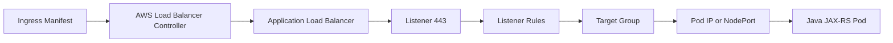
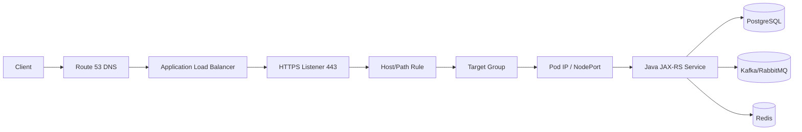

# Part 008 — Load Balancing in AWS

> Fokus part ini adalah memahami AWS load balancing sebagai entry point dan traffic distribution layer untuk Java/JAX-RS production services. Kita tidak membahas ELB sebagai “service yang meneruskan request” saja, tetapi sebagai kombinasi DNS, listener, TLS, routing rule, target group, health check, security group, subnet, availability zone, Kubernetes integration, timeout, observability, dan cost.

Dalam production, banyak error yang terlihat seperti bug aplikasi sebenarnya berasal dari load balancing path:

- target group unhealthy;
- health check path salah;
- pod ready tetapi endpoint belum siap melayani dependency;
- ALB listener rule salah;
- NLB target type salah;
- security group menolak traffic;
- TLS policy/certificate mismatch;
- idle timeout lebih pendek dari request processing;
- cross-zone behavior tidak dipahami;
- ingress annotation salah;
- deregistration delay menyebabkan request masuk ke pod yang sedang terminate.

Senior backend engineer harus mampu membaca path ini:

```text
Client
  -> DNS / Route 53
  -> ALB or NLB
  -> Listener
  -> Rule
  -> Target Group
  -> Target health check
  -> Node or Pod
  -> Kubernetes Service
  -> Java/JAX-RS endpoint
```

---

## 1. Core mental model

AWS Elastic Load Balancing menyediakan beberapa tipe load balancer. Untuk backend Java/JAX-RS di EKS, yang paling sering relevan adalah:

| Type | Layer | Common use |
|---|---:|---|
| Application Load Balancer | L7 HTTP/HTTPS | REST API, path/host routing, ingress, TLS termination |
| Network Load Balancer | L4 TCP/UDP/TLS | High-throughput TCP, static-ish endpoint, source IP preservation, non-HTTP protocols |
| Gateway Load Balancer | L3/L4 appliance insertion | Firewall/inspection appliance pattern; awareness only for backend engineer |

Load balancer bukan hanya satu resource. Ia terdiri dari beberapa object:

```text
Load Balancer
  ├── DNS name
  ├── Scheme: internet-facing or internal
  ├── Subnets / AZs
  ├── Security group for ALB
  ├── Listener: protocol + port + certificate + default action
  ├── Listener rules: host/path/header conditions
  ├── Target groups
  ├── Health checks
  ├── Access logs / metrics
  └── Attributes: idle timeout, cross-zone, deletion protection, etc.
```

Untuk Kubernetes/EKS, load balancer bisa dibuat oleh:

- AWS Console/CLI/IaC secara eksplisit;
- AWS Load Balancer Controller dari Kubernetes Ingress;
- Kubernetes `Service` type `LoadBalancer`;
- Helm chart values;
- GitOps sync.

---

## 2. Kenapa load balancer ada?

Load balancer menyelesaikan beberapa kebutuhan production:

| Kebutuhan | Peran load balancer |
|---|---|
| Stable entry point | Client tidak perlu tahu semua pod/node IP |
| Traffic distribution | Request tersebar ke target sehat |
| High availability | Load balancer berada di beberapa AZ jika dikonfigurasi benar |
| Health-aware routing | Target yang gagal health check tidak menerima traffic baru |
| TLS termination | Certificate dan TLS policy dikelola di edge/load balancer |
| Routing | Host/path/header-based routing untuk ALB |
| Isolation | Internal vs internet-facing exposure |
| Observability | Metrics, access logs, target health, error codes |
| Deployment safety | Deregistration delay membantu draining target |

Namun load balancer juga menambah layer failure. Setiap layer perlu timeout, health, routing, security, dan logging yang benar.

---

## 3. ALB vs NLB decision model

### Application Load Balancer

Gunakan ALB ketika workload adalah HTTP/HTTPS dan butuh fitur L7:

- host-based routing;
- path-based routing;
- header/query condition;
- redirect HTTP to HTTPS;
- TLS termination dengan SNI;
- WAF integration;
- HTTP access logs;
- target group untuk service HTTP;
- Kubernetes Ingress.

Contoh:

```text
api.company.com/orders/* -> orders-service target group
api.company.com/quotes/* -> quote-service target group
```

### Network Load Balancer

Gunakan NLB ketika butuh L4/TCP behavior:

- TCP/UDP/TLS pass-through;
- very high throughput;
- low latency;
- source IP preservation;
- static IP/EIP pattern jika diperlukan;
- non-HTTP protocol;
- internal TCP service exposure.

Contoh:

```text
internal-broker.company.local:5672 -> RabbitMQ targets
internal-api.company.local:443 -> TCP/TLS service pass-through
```

### Anti-pattern decision

| Anti-pattern | Kenapa buruk |
|---|---|
| Memakai NLB untuk HTTP API yang butuh path routing | Routing logic pindah ke backend atau NGINX tanpa alasan jelas |
| Memakai ALB untuk protocol non-HTTP | ALB bukan L4 generic proxy |
| Semua service punya internet-facing LB | Public exposure dan cost membengkak |
| Health check `/` tanpa semantic readiness | Target dianggap sehat padahal dependency critical mati |
| LB timeout tidak selaras dengan app timeout | 504/connection reset sulit ditelusuri |

---

## 4. Load balancer scheme: internet-facing vs internal

AWS load balancer punya scheme:

| Scheme | Meaning |
|---|---|
| `internet-facing` | Dapat menerima traffic dari internet melalui public subnet/public IP path |
| `internal` | Hanya menerima traffic dari private network/VPC-connected network |

Untuk enterprise backend, default mental model seharusnya:

```text
Public exposure must be intentional.
Internal exposure should be private by default.
```

Contoh exposure:

```text
Public client
  -> Route 53 public DNS
  -> Internet-facing ALB
  -> EKS ingress
  -> Java service
```

```text
Internal service
  -> Route 53 private hosted zone
  -> Internal ALB/NLB
  -> EKS service
  -> Java service
```

Review selalu:

- apakah load balancer seharusnya public?
- subnet mana yang dipakai?
- security group allow dari mana?
- DNS public atau private?
- apakah WAF/API gateway seharusnya berada di depan?

---

## 5. ALB components

### 5.1 Listener

Listener mendefinisikan protocol dan port.

Contoh:

```text
HTTPS : 443
  certificate: api.company.com
  default action: fixed 404 or forward to default target group
```

Listener harus direview untuk:

- protocol;
- port;
- certificate;
- TLS policy;
- default action;
- redirect HTTP to HTTPS;
- access log status.

### 5.2 Listener rules

ALB rule dapat menggunakan condition:

- host header;
- path pattern;
- HTTP header;
- HTTP method;
- query string;
- source IP.

Contoh:

```text
Host: api.company.com AND Path: /quote/*
  -> quote-service target group
```

Rule ordering penting. Rule yang terlalu luas bisa menangkap traffic sebelum rule spesifik.

### 5.3 Target group

Target group adalah daftar target yang menerima traffic.

Target type umum:

| Target type | Meaning | EKS relevance |
|---|---|---|
| `instance` | Traffic diarahkan ke EC2/node | Umum untuk NodePort path |
| `ip` | Traffic diarahkan langsung ke pod IP atau IP target | Umum dengan AWS Load Balancer Controller untuk pod target |
| `lambda` | ALB ke Lambda | Awareness only untuk seri ini |

Dalam EKS dengan VPC CNI, pod bisa memiliki IP dari VPC. Ini memungkinkan target type `ip`, tetapi harus didukung oleh konfigurasi controller, subnet, security group, dan readiness.

### 5.4 Health check

Health check menentukan target sehat atau tidak.

Untuk Java/JAX-RS service, health check path harus dibedakan:

| Endpoint | Purpose |
|---|---|
| `/livez` | Process masih hidup |
| `/readyz` | Service siap menerima traffic |
| `/health` | Bisa agregat, tetapi harus jelas semantiknya |

ALB health check sebaiknya memakai readiness, bukan liveness.

Bad readiness:

```text
return 200 if JVM process is running
```

Better readiness:

```text
return 200 if application initialized, route available, critical dependencies acceptable, and pod not draining
```

Tetapi jangan membuat readiness terlalu bergantung pada dependency transien hingga semua pod keluar dari target group saat dependency minor bermasalah. Ini bisa memperbesar outage.

---

## 6. NLB components

NLB bekerja di layer lebih rendah. Komponen penting:

- listener TCP/UDP/TLS;
- target group;
- health check TCP/HTTP/HTTPS;
- target type instance/IP/ALB depending pattern;
- cross-zone load balancing;
- source IP preservation behavior;
- static IP/EIP if configured;
- internal vs internet-facing scheme.

NLB cocok untuk:

- TCP service;
- private service endpoint;
- broker-like protocol;
- pass-through TLS;
- high throughput;
- source IP sensitive workloads.

NLB tidak memahami path HTTP seperti ALB. Jika Anda butuh `/quote/*` vs `/order/*`, gunakan ALB atau layer L7 lain.

---

## 7. TLS termination and SNI

TLS dapat terminate di beberapa tempat:

```text
Client -> ALB terminates TLS -> HTTP to pod
Client -> ALB terminates TLS -> HTTPS to pod
Client -> NLB passes TLS -> pod terminates TLS
Client -> NLB terminates TLS -> TCP to target
```

Setiap pilihan punya trade-off.

| Pattern | Benefit | Risk |
|---|---|---|
| TLS terminate at ALB | Central certificate, WAF/L7 routing | Backend leg mungkin HTTP jika tidak dienkripsi |
| Re-encrypt ALB to pod | End-to-end encryption stronger | Cert management di backend lebih kompleks |
| TLS pass-through via NLB | Backend owns TLS fully | LB tidak melihat HTTP, no path routing |
| mTLS at backend | Strong service identity | Operational complexity |

SNI memungkinkan listener memilih certificate berdasarkan hostname.

Checklist TLS:

- certificate source ACM;
- SAN cocok dengan hostname;
- TLS policy sesuai security baseline;
- HTTP to HTTPS redirect;
- backend protocol HTTP/HTTPS;
- header `X-Forwarded-Proto` dipakai benar;
- application tidak membangun absolute URL dengan scheme salah.

---

## 8. Headers and client identity

ALB menambahkan header seperti:

```text
X-Forwarded-For
X-Forwarded-Proto
X-Forwarded-Port
```

Java/JAX-RS service sering butuh header ini untuk:

- audit client IP;
- building redirect URL;
- generating absolute link;
- security policy;
- correlation;
- rate limiting;
- logging.

Risk:

- aplikasi mempercayai `X-Forwarded-For` dari client langsung;
- reverse proxy chain tidak jelas;
- client IP hilang;
- audit log mencatat IP load balancer saja;
- scheme salah menyebabkan redirect loop.

Rule: trust forwarded headers hanya dari trusted proxy/load balancer chain.

---

## 9. Timeout chain

Timeout harus dilihat sebagai chain, bukan setting tunggal.

```text
Client timeout
  > API Gateway timeout if any
    > ALB idle timeout
      > Ingress/proxy timeout
        > Java HTTP server timeout
          > downstream client timeout
            > database/broker/cache timeout
```

Jika ALB idle timeout lebih pendek dari processing time service, client bisa melihat 504 atau connection closed walaupun backend masih bekerja.

Untuk Java/JAX-RS:

- jangan biarkan request lama tanpa streaming/heartbeat;
- pisahkan synchronous API dari async job;
- set downstream timeout lebih pendek dari upstream timeout;
- pastikan retry tidak membuat duplicate side effect;
- gunakan idempotency key untuk operasi sensitif.

---

## 10. Cross-zone load balancing

Load balancer beroperasi di AZ. Cross-zone behavior memengaruhi:

- traffic distribution;
- availability;
- cost;
- target locality;
- failure mode saat satu AZ bermasalah.

Tanpa memahami cross-zone, Anda bisa melihat:

- traffic tidak merata;
- target sehat di AZ lain tidak dipakai sesuai ekspektasi;
- cross-AZ data transfer cost meningkat;
- outage parsial saat satu AZ target kosong.

Review:

- apakah load balancer aktif di semua AZ yang dipakai node/pod?
- apakah target group punya target sehat per AZ?
- apakah cross-zone setting disengaja?
- apakah cost cross-AZ dipahami?

---

## 11. AWS Load Balancer Controller in EKS

AWS Load Balancer Controller dapat membuat dan mengelola AWS ALB/NLB dari Kubernetes resources.

Common pattern:

```text
Ingress -> ALB
Service type LoadBalancer -> NLB
```

Dalam GitOps/IaC environment, load balancer config sering tersebar di:

- Kubernetes Ingress manifest;
- Service manifest;
- Helm values;
- controller IAM role;
- subnet tags;
- security group rules;
- Route 53 external-dns config;
- ACM certificate;
- Terraform baseline.

### Ingress to ALB mental model



### Important annotations

Annotations can control:

- scheme internal/internet-facing;
- target type instance/ip;
- certificate ARN;
- health check path/port/protocol;
- listen ports;
- SSL redirect;
- load balancer attributes;
- target group attributes;
- security groups;
- subnets.

Because annotations change AWS infrastructure, they must be reviewed like IaC, not treated as harmless Kubernetes metadata.

---

## 12. ALB ingress target type: instance vs IP

### Instance target

Traffic path:

```text
ALB -> NodePort on EKS node -> kube-proxy/service -> pod
```

Pros:

- simpler historically;
- target is node;
- pod churn hidden by Kubernetes service.

Cons:

- extra hop;
- NodePort exposure;
- source/target mapping less direct;
- node health vs pod health needs care.

### IP target

Traffic path:

```text
ALB -> Pod IP directly
```

Pros:

- direct pod targeting;
- clearer target health per pod;
- can reduce hops.

Cons:

- depends on VPC CNI/pod IP routability;
- subnet IP capacity matters;
- security group/pod readiness matters;
- pod churn directly updates target group.

Review target type together with EKS networking design.

---

## 13. NLB with Kubernetes Service

Kubernetes `Service` type `LoadBalancer` can provision an AWS load balancer. In modern EKS patterns, annotations may request NLB behavior.

Example mental model:

```text
Service type LoadBalancer
  -> AWS Load Balancer Controller or cloud provider integration
  -> NLB
  -> target group
  -> node/pod targets
```

Use NLB when:

- service is TCP;
- source IP preservation matters;
- latency/throughput requirement favors L4;
- TLS pass-through is required;
- private internal endpoint is enough.

Be careful with:

- health check protocol;
- target type;
- security groups;
- client IP behavior;
- DNS record;
- cross-zone setting;
- idle timeout/client behavior at L4.

---

## 14. Health check design for Java/JAX-RS services

Health check design is architecture, not boilerplate.

### Liveness

Question:

```text
Should this process be restarted?
```

Good liveness is narrow. It should not fail because PostgreSQL is temporarily slow.

### Readiness

Question:

```text
Should this pod receive traffic now?
```

Readiness may check:

- application boot completed;
- dependency pool initialized;
- migrations not running in unsafe state;
- config loaded;
- service not draining;
- critical local resources available.

### Load balancer health

Question:

```text
Should this target remain in the target group?
```

LB health check should align with readiness but consider failure amplification. If all targets fail readiness because one shared dependency is degraded, the load balancer may remove every target and turn partial degradation into full outage.

Better pattern:

- readiness distinguishes “cannot serve any traffic” vs “dependency degraded”;
- app exposes dependency-specific health separately;
- alerting detects dependency degradation;
- load balancer does not eject all pods unnecessarily.

---

## 15. Common AWS load balancer failure modes

| Failure mode | Symptom | Likely cause | Debug direction |
|---|---|---|---|
| Target unhealthy | 503 | Health path wrong, app not listening, SG issue | Check target health reason |
| ALB 502 | Bad gateway | Target closed connection, protocol mismatch, app crash | Check ALB logs + app logs |
| ALB 503 | No healthy targets | All targets unhealthy or rule points empty TG | Check target group and rules |
| ALB 504 | Gateway timeout | Backend slow or timeout chain wrong | Check ALB idle timeout and app latency |
| TLS error | Client handshake fails | Cert/SNI/TLS policy mismatch | Check listener certificate and hostname |
| Redirect loop | HTTP/HTTPS confusion | App ignores forwarded proto | Check X-Forwarded-Proto handling |
| Works from inside, fails public | Scheme/security/WAF/DNS | Public path differs from internal path | Compare DNS and listener path |
| NLB connection timeout | TCP not reachable | SG/NACL/route/listener/target issue | Test from same source network |
| Source IP wrong | Audit/rate limit broken | Proxy chain not understood | Check forwarded headers/NLB behavior |
| Deployment causes 5xx spike | Pod termination/draining issue | deregistration delay/readiness/preStop | Review graceful shutdown |

---

## 16. Debugging playbook

### Step 1 — Identify entry point

Do not start at the pod. Start at the external symptom.

```text
Hostname -> DNS answer -> load balancer DNS -> listener -> rule -> target group -> target
```

Ask:

- what exact hostname?
- public or private DNS?
- ALB or NLB?
- internet-facing or internal?
- which listener?
- which rule?
- which target group?

### Step 2 — Check DNS

```bash
nslookup api.company.com
```

From inside VPC/EKS:

```bash
kubectl exec -it deploy/quote-service -- nslookup internal-api.prod.internal
```

Confirm the DNS points to expected load balancer.

### Step 3 — Check listener and rules

Look for:

- listener port 443/80;
- certificate;
- default action;
- rule priority;
- host/path condition;
- forwarding target group;
- weighted target group if used.

### Step 4 — Check target health

Target health is often the shortest path to truth.

Review:

- health status;
- reason code;
- health check path;
- expected status code matcher;
- port;
- protocol;
- security group;
- pod readiness.

### Step 5 — Check security path

For ALB:

```text
Client -> ALB security group -> target security group/node/pod
```

For NLB, security behavior depends on pattern and target. Still validate:

- subnet route;
- SG;
- NACL;
- NetworkPolicy;
- listener port;
- target port.

### Step 6 — Check app logs and access logs together

Correlate:

- ALB access log status;
- target status code;
- request processing time;
- app log correlation ID;
- pod restart events;
- readiness probe changes.

### Step 7 — Check timeout chain

If status is 504 or intermittent:

- ALB idle timeout;
- ingress/proxy timeout;
- Java request timeout;
- downstream timeout;
- thread pool saturation;
- database/broker latency;
- SDK retry behavior.

### Step 8 — Check deployment/draining

If issue appears during rollout:

- Kubernetes readiness gate;
- pod preStop;
- terminationGracePeriodSeconds;
- target group deregistration delay;
- connection draining;
- rolling update maxUnavailable/maxSurge;
- PDB;
- app graceful shutdown.

---

## 17. Java/JAX-RS impact

AWS load balancing affects Java service behavior in concrete ways.

### Request metadata

The app may need to read forwarded headers carefully:

- original protocol;
- original host;
- client IP;
- request ID;
- traceparent;
- correlation ID.

### Connection handling

If service supports long requests or streaming:

- ALB idle timeout matters;
- client timeout matters;
- JAX-RS server thread model matters;
- proxy buffering behavior matters;
- cancellation behavior matters.

### Error mapping

Do not hide infrastructure symptoms behind generic 500.

Better operational logging:

```text
requestId=... path=/quotes/123 status=200 durationMs=45 target=quote-service
```

For failed dependency:

```text
dependency=postgres host=orders-db.prod.internal error=connect_timeout durationMs=3000
```

### Graceful shutdown

During deployment, Java service must:

1. fail readiness before shutdown;
2. stop accepting new requests;
3. finish in-flight requests within grace period;
4. close clients/pools safely;
5. allow target deregistration to drain.

---

## 18. Impact to PostgreSQL, Kafka, RabbitMQ, Redis, Camunda, and NGINX

### PostgreSQL

Usually do not put ALB in front of PostgreSQL. Database connection should use database endpoint/proxy. NLB may appear in custom/private TCP patterns, but managed DB endpoints are preferred.

### Kafka

Kafka behind generic load balancer is tricky because broker metadata and advertised listeners matter. Do not assume NLB solves Kafka connectivity. Validate bootstrap and broker advertised hostnames.

### RabbitMQ

NLB can be relevant for AMQP/TCP exposure. Validate health check, TLS, source IP, connection draining, and broker failover behavior.

### Redis

Managed Redis endpoint is usually preferred. Be careful exposing Redis through load balancer unless there is a deliberate architecture reason.

### Camunda

Camunda REST endpoints can sit behind ALB/ingress. Job workers and engine dependencies may be more sensitive to timeout and connection pool behavior than the public REST API.

### NGINX

NGINX can be:

- ingress controller behind ALB/NLB;
- reverse proxy behind ALB;
- internal gateway;
- sidecar-like proxy in special cases.

Avoid unclear chains like:

```text
ALB -> NGINX -> another NGINX -> service
```

unless each layer has a clear purpose.

---

## 19. Observability

For ALB/NLB operations, observe:

### Metrics

- request count;
- target response time;
- HTTP 4xx/5xx;
- target 4xx/5xx;
- healthy/unhealthy host count;
- rejected connection count;
- TLS negotiation errors;
- active/new connections;
- processed bytes.

### Logs

- ALB access logs;
- NLB access/flow logs where applicable;
- application logs;
- ingress controller logs;
- AWS Load Balancer Controller logs;
- Kubernetes events;
- VPC Flow Logs.

### Correlation

Ideal incident view:

```text
Route 53 record
  -> ALB request log
  -> target group health
  -> Kubernetes ingress/service/pod
  -> Java app log
  -> downstream dependency metrics
```

Without this chain, teams waste time arguing whether it is “network issue” or “application issue”.

---

## 20. Security concerns

Review every load balancer for exposure and trust boundary.

| Concern | Review question |
|---|---|
| Public exposure | Is internet-facing intended? |
| TLS | Is TLS policy/cert approved? |
| WAF | Should API be behind WAF/API Gateway? |
| Security group | Who can reach the ALB? Who can ALB reach? |
| Header trust | Does app trust only headers from LB/proxy? |
| Internal service | Is internal LB in private subnet/private DNS? |
| Access logs | Are logs enabled and protected? |
| Sensitive paths | Are admin/debug paths blocked? |
| mTLS | Is service-to-service identity required? |
| Deletion protection | Should prod LB have deletion protection? |

Do not expose Kubernetes services directly just because it is easy to create `Service type LoadBalancer`.

---

## 21. Performance and cost concerns

Load balancer choices affect cost and latency.

Cost drivers include:

- number of load balancers;
- Load Balancer Capacity Units;
- processed bytes;
- new/active connections;
- rule evaluations;
- cross-zone traffic;
- access logs storage;
- WAF if attached;
- idle duplicate LBs per namespace/service.

Performance drivers include:

- TLS termination overhead;
- connection reuse;
- backend keep-alive;
- target response time;
- cross-zone routing;
- pod/node locality;
- health check frequency;
- slow start if enabled;
- app thread pool saturation.

Senior engineer question:

```text
Do we need one load balancer per service, or can ingress/gateway consolidate safely without increasing blast radius too much?
```

---

## 22. PR review checklist

### Exposure

- [ ] Is the load balancer internal or internet-facing?
- [ ] Is public exposure intentional and approved?
- [ ] Is DNS public or private?
- [ ] Should WAF/API Gateway sit in front?

### ALB/NLB choice

- [ ] Is ALB used for HTTP/HTTPS L7 routing?
- [ ] Is NLB used only when L4 behavior is needed?
- [ ] Are protocol and target group settings correct?
- [ ] Is source IP behavior understood?

### Listener/routing

- [ ] Listener port/protocol correct?
- [ ] Certificate and TLS policy correct?
- [ ] Rule priority safe?
- [ ] Host/path conditions specific enough?
- [ ] Default action safe?

### Target group

- [ ] Target type instance/IP intentional?
- [ ] Target port correct?
- [ ] Health check path/protocol/status matcher correct?
- [ ] Deregistration delay configured?
- [ ] Slow start/stickiness intentional if enabled?

### EKS/Kubernetes

- [ ] AWS Load Balancer Controller owns this LB?
- [ ] Ingress/Service annotations reviewed?
- [ ] Subnet tags correct?
- [ ] Security groups correct?
- [ ] Pod readiness aligns with target health?
- [ ] Graceful shutdown configured?

### Application

- [ ] App handles forwarded headers correctly?
- [ ] Timeout chain aligned?
- [ ] Long-running request strategy clear?
- [ ] Correlation ID propagated?
- [ ] Error logs identify route/dependency?

### Operations

- [ ] ALB/NLB metrics dashboard exists?
- [ ] Access logs enabled if required?
- [ ] Alert on unhealthy targets and 5xx?
- [ ] Rollback plan exists?
- [ ] Load test or smoke test evidence exists?
- [ ] Cost impact reviewed?

---

## 23. Internal verification checklist

Cek hal berikut di internal CSG/team. Jangan mengarang detail.

### AWS load balancer inventory

- List ALB/NLB per environment.
- Scheme: internal vs internet-facing.
- Subnets/AZs attached.
- Security groups.
- Listener ports.
- Certificates.
- TLS policies.
- Target groups.
- Health check config.
- Load balancer attributes.

### EKS integration

- AWS Load Balancer Controller version.
- Controller IAM role/IRSA.
- Subnet tags for ALB/NLB discovery.
- IngressClass usage.
- Ingress annotations standard.
- Service annotations standard.
- Target type convention.
- ExternalDNS integration if used.
- GitOps ownership.

### DNS and certificates

- Route 53 records pointing to load balancers.
- Public/private hosted zones.
- ACM certificates.
- Certificate renewal ownership.
- SNI usage.
- Hostname-to-listener mapping.

### Observability

- ALB access logs destination.
- NLB logs/metrics where applicable.
- CloudWatch dashboard.
- Alert thresholds.
- Target group health alarms.
- AWS Load Balancer Controller logs.
- Kubernetes event retention.
- VPC Flow Logs.

### Security and governance

- Public exposure review.
- WAF association.
- Security group review.
- Deletion protection.
- Tagging policy.
- Cost allocation tags.
- Change approval path.
- Production runbook.

---

## 24. Mermaid: ALB to EKS Java service



---

## 25. Mini case study: ALB returns 503 after deployment

Symptom:

```text
After rollout, API returns intermittent 503.
```

Possible bad conclusion:

```text
New Java code is broken.
```

Better investigation:

```text
1. Check ALB target group healthy host count.
2. Check target health reason code.
3. Check Kubernetes readiness events.
4. Check health check path and expected status code.
5. Check deployment maxUnavailable/maxSurge.
6. Check pod startup time vs health check interval.
7. Check app dependency initialization.
8. Check target deregistration delay and pod termination behavior.
9. Check whether old and new pods overlapped safely.
```

Common root cause:

```text
Readiness endpoint returns 200 before the app is truly ready, or returns 500 because a non-critical dependency is slow. ALB target group oscillates and removes targets during rollout.
```

Fix is not always “increase timeout”. Fix may require correct readiness semantics, graceful shutdown, deployment strategy, and target group health settings.

---

## 26. Senior engineer heuristics

1. A load balancer 5xx is not automatically an application 5xx.
2. Always compare ALB status code and target status code.
3. Health check endpoints are production contracts.
4. Listener rule priority can break routing silently.
5. `internet-facing` should require explicit justification.
6. Target type `ip` vs `instance` changes network path and failure mode.
7. Graceful shutdown must align Kubernetes termination with target deregistration.
8. Timeout chain must be designed end-to-end.
9. Forwarded headers are security-sensitive.
10. Load balancer cost grows with duplication, traffic, logging, WAF, and cross-zone behavior.

---

## 27. References to verify during implementation

Use official AWS documentation when implementing or reviewing concrete configuration:

- Elastic Load Balancing overview
- Application Load Balancer listeners, rules, target groups, health checks, access logs, TLS listeners
- Network Load Balancer listeners, target groups, health checks, cross-zone behavior
- AWS Load Balancer Controller documentation
- Amazon EKS networking and VPC CNI documentation
- Route 53 alias records and hosted zones
- AWS WAF documentation if attached to ALB

Do not assume CSG production load balancer, ingress, WAF, certificate, DNS, or EKS controller strategy. Confirm it from internal diagrams, Terraform/IaC, GitOps manifests, CloudWatch dashboards, and platform/SRE/security team.
