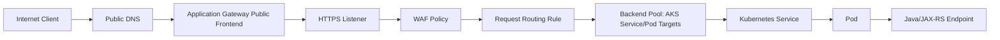
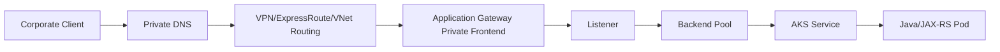
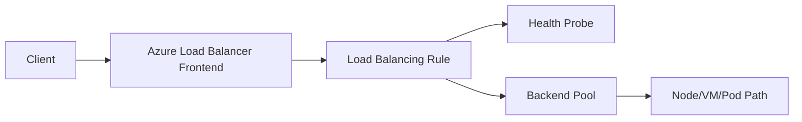

# Part 009 — Load Balancing in Azure

> Fokus part ini adalah memahami load balancing di Azure dari sudut pandang senior backend engineer yang mengoperasikan Java/JAX-RS service di AKS, Kubernetes, VM, atau hybrid network. Targetnya bukan hafal nama service, tetapi mampu membaca jalur request, membedakan L4 vs L7, memahami health probe, listener, backend pool, WAF, TLS termination, private/public frontend, dan tahu di titik mana incident 502/503/504 harus di-debug.

Banyak incident yang terlihat seperti bug aplikasi sebenarnya berasal dari layer load balancing:

- health probe salah path atau salah port;
- backend pool menunjuk target yang tidak siap;
- NSG/UDR/firewall memblokir traffic dari load balancer;
- TLS certificate, SNI, atau hostname mismatch;
- Application Gateway tidak sinkron dengan AKS Ingress;
- probe sukses tetapi endpoint aplikasi sebenarnya belum siap;
- source IP expectation salah;
- public/private frontend salah dipahami;
- timeout di gateway lebih pendek dari processing time service;
- WAF false positive memblokir request yang valid;
- routing rule atau path-based routing salah precedence;
- private DNS menunjuk entry point yang salah.

Di Azure, load balancing bukan satu konsep tunggal. Minimal ada beberapa lapisan yang perlu dibedakan:

```text
Global / Edge Layer
  -> Azure Front Door awareness
  -> Traffic Manager awareness

Regional L7 HTTP Layer
  -> Azure Application Gateway
  -> Web Application Firewall
  -> Application Gateway Ingress Controller for AKS

Regional L4 TCP/UDP Layer
  -> Azure Load Balancer

Kubernetes Layer
  -> Ingress
  -> Service type LoadBalancer
  -> ClusterIP Service
  -> EndpointSlice
  -> Pod
  -> Java/JAX-RS endpoint
```

---

## 1. Core mental model

Azure memiliki beberapa komponen yang sering sama-sama disebut “load balancer”, padahal perannya berbeda.

| Azure component | Layer | Fokus utama | Cocok untuk |
|---|---:|---|---|
| Azure Load Balancer | L4 | TCP/UDP distribution, inbound/outbound | Service type LoadBalancer, VM scale set, TCP workloads |
| Application Gateway | L7 | HTTP/HTTPS routing, TLS, host/path routing | Web/API ingress, JAX-RS REST API, WAF |
| Application Gateway Ingress Controller | L7 integration | Sinkronisasi Kubernetes Ingress ke Application Gateway | AKS ingress dengan Application Gateway |
| Azure Front Door | Global L7 edge | Global routing, CDN-like edge, WAF at edge | Public global web/API entry point |
| Traffic Manager | DNS-based | DNS traffic distribution | Global DNS-level routing/failover awareness |

Untuk Java/JAX-RS service, layer yang paling sering perlu Anda pahami secara detail adalah Application Gateway, Azure Load Balancer, dan AGIC jika workload berjalan di AKS.

```text
Client
  -> DNS
  -> optional Azure Front Door
  -> optional WAF
  -> Application Gateway or Azure Load Balancer
  -> AKS Ingress / Service
  -> Kubernetes Service
  -> Pod
  -> Java/JAX-RS endpoint
```

Rule utama:

- **Azure Load Balancer** tidak memahami HTTP path, host, header, JWT, cookie, atau REST semantics.
- **Application Gateway** memahami HTTP/HTTPS dan dapat melakukan host/path-based routing.
- **WAF** dapat memblokir request sebelum mencapai backend.
- **AGIC** menerjemahkan sebagian state Kubernetes Ingress menjadi konfigurasi Application Gateway.
- **Traffic Manager** bukan reverse proxy; ia bekerja di DNS layer.
- **Front Door** adalah global entry layer, bukan pengganti semua internal regional load balancing.

---

## 2. Azure Load Balancer

Azure Load Balancer adalah L4 load balancer. Ia bekerja pada flow TCP/UDP, bukan request HTTP. Ia memiliki beberapa konsep penting:

```text
Azure Load Balancer
  ├── Frontend IP configuration
  ├── Backend pool
  ├── Health probe
  ├── Load balancing rule
  ├── Inbound NAT rule
  └── Outbound rule
```

### 2.1 Frontend IP

Frontend IP adalah alamat tempat client mengakses load balancer.

Bisa berupa:

- public frontend IP;
- private frontend IP.

Public frontend digunakan untuk traffic dari internet. Private frontend digunakan untuk internal traffic dari VNet, peered VNet, VPN, ExpressRoute, atau corporate network.

Untuk enterprise system, pertanyaan PR review yang harus selalu muncul:

> Apakah service ini memang boleh punya public entry point, atau seharusnya hanya private frontend?

### 2.2 Backend pool

Backend pool adalah kumpulan target yang menerima traffic.

Target bisa berupa:

- VM;
- VM scale set;
- network interface;
- AKS node path melalui Service type `LoadBalancer`;
- internal endpoint tergantung desain.

Untuk AKS, Service type `LoadBalancer` biasanya memicu provisioning Azure Load Balancer rule yang mengarah ke node/pod path sesuai mode networking dan Kubernetes service routing.

### 2.3 Health probe

Health probe menentukan apakah backend dianggap sehat.

Kesalahan umum:

- probe memakai port salah;
- probe memakai path `/` padahal aplikasi hanya expose `/health`;
- probe mengecek liveness, bukan readiness;
- probe terlalu longgar sehingga backend dianggap sehat meski dependency kritis down;
- probe terlalu ketat sehingga rolling deployment sering dianggap gagal;
- probe path butuh authentication;
- probe diblokir NSG/firewall;
- probe berhasil di node, tetapi pod target sebenarnya tidak siap.

Untuk Java/JAX-RS service, health endpoint harus dibedakan:

| Endpoint | Tujuan | Should load balancer use it? |
|---|---|---:|
| `/live` | proses JVM masih hidup | Tidak cukup |
| `/ready` | service siap menerima traffic | Ya, biasanya |
| `/health` | agregasi umum | Hati-hati |
| `/startup` | startup probe Kubernetes | Bukan untuk LB eksternal |
| `/deep-health` | dependency lengkap | Jangan terlalu agresif untuk LB jika bisa menyebabkan flap |

Health probe untuk load balancer harus menjawab pertanyaan:

> “Apakah target ini aman menerima request baru sekarang?”

Bukan:

> “Apakah semua dependency dunia sedang sempurna?”

Jika probe terlalu deep, satu dependency lambat dapat mengeluarkan semua instance dari rotation dan memperbesar outage.

### 2.4 Load balancing rule

Rule mengikat frontend IP + frontend port ke backend pool + backend port + probe.

Checklist reasoning:

- port publik/internal apa yang dibuka;
- protocol TCP/UDP apa yang digunakan;
- backend pool mana yang menerima;
- health probe mana yang menentukan eligibility;
- idle timeout berapa;
- floating IP/direct server return digunakan atau tidak;
- outbound SNAT behavior dipahami atau tidak.

---

## 3. Application Gateway

Application Gateway adalah L7 web traffic load balancer. Untuk HTTP API, ia jauh lebih relevan dibanding Azure Load Balancer karena dapat mengambil keputusan berdasarkan atribut HTTP.

Konsep utamanya:

```text
Application Gateway
  ├── Frontend IP configuration
  ├── Frontend port
  ├── Listener
  ├── Request routing rule
  ├── Backend pool
  ├── Backend HTTP setting
  ├── Health probe
  ├── TLS certificate
  ├── Optional WAF policy
  └── Diagnostic logs / metrics
```

### 3.1 Listener

Listener menerima request pada kombinasi:

- frontend IP;
- port;
- protocol HTTP/HTTPS;
- hostname;
- TLS certificate jika HTTPS.

Listener adalah titik awal L7 decision.

Masalah umum:

- hostname tidak match;
- certificate tidak match SNI;
- listener public padahal harus private;
- HTTP masih dibuka padahal harus redirect ke HTTPS;
- listener menangkap traffic yang seharusnya milik service lain;
- multi-site listener salah prioritas.

### 3.2 Request routing rule

Routing rule menentukan backend mana yang dipilih.

Mode umum:

- basic routing;
- path-based routing;
- host-based routing;
- redirect;
- rewrite.

Untuk API enterprise:

```text
api.company.internal
  /quote/*  -> quote-service backend pool
  /order/*  -> order-service backend pool
  /catalog/* -> catalog-service backend pool
```

Path-based routing berguna, tetapi berbahaya jika path ownership tidak jelas.

Failure mode:

- `/orders` dan `/order` overlap;
- trailing slash tidak konsisten;
- rewrite path merusak JAX-RS resource mapping;
- backend menerima path berbeda dari yang didesain;
- default rule mengarah ke backend salah;
- rule baru shadowing rule lama.

### 3.3 Backend pool

Backend pool pada Application Gateway dapat menunjuk target seperti:

- IP address;
- FQDN;
- VM/VMSS;
- AKS service path melalui AGIC;
- private endpoint/internal service tergantung architecture.

Untuk AKS dengan AGIC, backend pool biasanya dikelola oleh controller berdasarkan Ingress dan service endpoint.

Jangan mengedit manual resource Application Gateway yang dikontrol AGIC tanpa memahami drift risk. Manual change bisa tertimpa reconciliation.

### 3.4 Backend HTTP setting

Backend HTTP setting mengontrol koneksi dari Application Gateway ke backend:

- backend protocol HTTP/HTTPS;
- backend port;
- cookie-based affinity;
- request timeout;
- connection draining;
- host name override;
- trusted root certificate jika backend HTTPS memakai certificate tertentu.

Ini sering menjadi sumber bug.

Contoh:

```text
Client -> HTTPS -> Application Gateway -> HTTP -> Pod
```

vs

```text
Client -> HTTPS -> Application Gateway -> HTTPS -> Pod
```

Jika backend memakai HTTPS, Application Gateway harus mempercayai certificate backend. Jika hostname override salah, TLS validation bisa gagal.

Untuk Java/JAX-RS service, perhatikan header:

- `Host`;
- `X-Forwarded-For`;
- `X-Forwarded-Proto`;
- `X-Forwarded-Host`;
- correlation/request ID header.

Aplikasi yang membangun absolute URL, redirect URL, callback URL, atau signed URL harus tahu original scheme dan host.

---

## 4. Azure Web Application Firewall

WAF dapat berjalan dengan Application Gateway. WAF memeriksa request HTTP dan dapat memblokir request sebelum mencapai backend.

WAF berguna untuk:

- OWASP managed rules;
- SQL injection pattern detection;
- cross-site scripting pattern detection;
- path/header/body inspection;
- custom rule;
- IP restriction;
- rate-ish protection tergantung layer;
- logging untuk security review.

Namun WAF juga dapat menyebabkan false positive.

Contoh kasus untuk enterprise quote/order system:

- payload quote mengandung expression, formula, special character, XML fragment, atau encoded string yang dianggap attack;
- customer name/address mengandung pattern aneh;
- large JSON body dianggap suspicious;
- request import/export ditolak karena multipart boundary atau filename;
- query parameter legitimate terlihat seperti injection pattern.

Senior backend engineer harus bisa bertanya:

- Apakah WAF berada di detection mode atau prevention mode?
- Rule mana yang memblokir request?
- Apakah ada exclusion yang aman dan spesifik?
- Apakah request body inspection limit relevan?
- Apakah false positive hanya terjadi untuk endpoint tertentu?
- Apakah WAF log dikorelasikan dengan application log?

WAF bukan pengganti input validation di aplikasi. WAF adalah guardrail di edge. Validasi domain tetap harus ada di Java/JAX-RS layer.

---

## 5. Application Gateway Ingress Controller for AKS

AGIC adalah Kubernetes controller yang berjalan di AKS dan menerjemahkan Ingress state menjadi konfigurasi Application Gateway.

Mental model:

```text
Kubernetes Ingress
  -> AGIC watches Kubernetes API
  -> AGIC calculates desired Application Gateway config
  -> AGIC updates Application Gateway via Azure Resource Manager
  -> Application Gateway routes external HTTP(S) traffic to AKS backends
```

AGIC membuat hubungan antara dua control plane:

- Kubernetes API server;
- Azure Resource Manager/Application Gateway.

Itu berarti failure bisa terjadi di dua tempat.

### 5.1 Kapan AGIC relevan

AGIC relevan ketika:

- AKS workload diekspos via Application Gateway;
- ingin memakai Azure-native L7 load balancer;
- WAF dibutuhkan di depan AKS;
- routing HTTP/HTTPS dikelola dari Kubernetes Ingress;
- platform team ingin Application Gateway sebagai shared ingress layer.

### 5.2 Failure mode AGIC

Failure umum:

- AGIC pod crash;
- AGIC tidak punya permission ke Application Gateway;
- Ingress annotation salah;
- backend service port salah;
- pod readiness gagal;
- Application Gateway backend pool tidak update;
- Application Gateway health probe gagal;
- NSG/UDR/firewall memblokir App Gateway ke AKS;
- manual config di Application Gateway ditimpa controller;
- multiple controllers berebut ownership.

Debugging harus membaca dua sisi:

```text
Kubernetes side:
  kubectl get ingress
  kubectl describe ingress
  kubectl get svc
  kubectl get endpoints/endpointslice
  kubectl logs deployment/agic

Azure side:
  Application Gateway backend health
  listener/rule config
  WAF log
  access log
  diagnostic log
  NSG flow log if available
```

### 5.3 AGIC vs NGINX Ingress

AGIC bukan satu-satunya ingress pattern.

| Pattern | Meaning |
|---|---|
| Application Gateway + AGIC | Azure-native L7 ingress, WAF integration, Azure-managed edge component |
| NGINX Ingress behind Azure Load Balancer | Kubernetes-native ingress controller, high config flexibility |
| Azure Front Door -> Application Gateway -> AKS | Global edge + regional gateway + cluster backend |
| API Management -> Application Gateway/Ingress -> AKS | API governance + regional routing + workload routing |

Tidak ada satu pilihan universal. Yang penting adalah ownership dan failure boundary jelas.

---

## 6. Public frontend vs private frontend

Azure load balancing resources bisa memiliki frontend public atau private.

### 6.1 Public frontend

Public frontend menerima traffic dari internet.

Gunakan hanya jika:

- API memang public/external;
- WAF/security policy tersedia;
- DNS dan certificate dikelola;
- observability cukup;
- rate limiting/API governance ada di layer yang tepat;
- exposure disetujui security.

### 6.2 Private frontend

Private frontend hanya dapat diakses dari jaringan privat.

Cocok untuk:

- internal service;
- partner/corporate network via VPN/ExpressRoute;
- backend-to-backend API;
- internal admin API;
- private AKS ingress;
- service yang tidak boleh exposed ke internet.

Private frontend tetap membutuhkan:

- private DNS;
- routing dari client network;
- NSG/firewall allow rule;
- TLS/certificate trust;
- observability.

Private bukan berarti otomatis aman. Private hanya mengurangi exposure surface. Authorization tetap wajib.

---

## 7. Source IP preservation

Source IP sering penting untuk:

- audit;
- rate limiting;
- allowlist;
- fraud/security detection;
- tenant-level traffic analysis;
- correlation dengan upstream logs.

Tetapi source IP bisa berubah di beberapa layer.

Pada L7 proxy seperti Application Gateway, backend biasanya melihat IP gateway sebagai remote address, sementara original client IP diteruskan lewat header seperti `X-Forwarded-For`.

Pada L4 load balancer, behavior source IP bergantung pada mode dan rule.

Untuk Java/JAX-RS service:

- jangan langsung percaya `X-Forwarded-For` dari internet;
- hanya percaya forwarded header dari trusted proxy/gateway;
- pastikan ingress/gateway menghapus atau menormalisasi header dari client;
- audit log harus menyimpan chain yang benar;
- security rule jangan bergantung pada header yang bisa dipalsukan kecuali sudah di-sanitize.

Pattern aman:

```text
Internet client
  -> Trusted edge/gateway normalizes X-Forwarded-For
  -> Application Gateway / Ingress forwards sanitized headers
  -> Java service reads trusted header through platform library/filter
```

---

## 8. TLS termination chain

TLS bisa terminate di beberapa titik:

```text
Client --TLS--> Front Door --TLS/HTTP--> Application Gateway --TLS/HTTP--> Ingress/Pod
```

atau:

```text
Client --TLS--> Application Gateway --HTTP--> Pod
```

atau:

```text
Client --TLS--> Application Gateway --TLS--> Pod
```

Pertanyaan penting:

- Di mana TLS terminate pertama kali?
- Apakah traffic internal tetap encrypted?
- Certificate siapa yang digunakan?
- Siapa owner certificate renewal?
- Apakah backend certificate dipercaya Application Gateway?
- Apakah mTLS dibutuhkan?
- Apakah JAX-RS service butuh tahu original scheme?
- Apakah redirect URL dan callback URL benar?

Failure mode:

- certificate expired;
- SNI mismatch;
- unsupported TLS version/cipher;
- backend certificate tidak dipercaya;
- hostname override salah;
- redirect loop HTTP/HTTPS;
- aplikasi mengira request HTTP padahal original HTTPS.

Untuk Java service, pastikan framework/proxy configuration memahami forwarded headers. Jika tidak, aplikasi bisa menghasilkan redirect ke HTTP, membangun absolute URL yang salah, atau menolak secure-cookie logic.

---

## 9. Timeout chain

Timeout harus dilihat sebagai chain, bukan angka tunggal.

```text
Client timeout
  > Front Door / edge timeout
  > Application Gateway timeout
  > Ingress timeout
  > Java server request timeout
  > outbound SDK/database/broker timeout
```

Rule praktis:

- upstream timeout harus lebih besar dari downstream timeout yang dikendalikan aplikasi;
- aplikasi harus fail fast sebelum gateway memutus koneksi;
- long-running operation sebaiknya asynchronous;
- export/import besar sebaiknya memakai object storage pattern, bukan request sinkron panjang;
- timeout harus dikorelasikan dengan retry policy.

Contoh buruk:

```text
Application Gateway timeout: 30s
Java service database query timeout: 60s
Client sees: 504
Application keeps working until DB timeout
```

Contoh lebih baik:

```text
Application Gateway timeout: 60s
Java endpoint timeout budget: 25s
DB query timeout: 20s
SDK timeout: 10s
Application returns controlled 503/504 with correlation ID
```

---

## 10. Health probe design for Java/JAX-RS

Health probe harus operationally safe.

### 10.1 Readiness endpoint

Readiness endpoint sebaiknya memeriksa:

- apakah aplikasi selesai startup;
- apakah request router siap;
- apakah critical config tersedia;
- apakah thread pool tidak saturated secara fatal;
- apakah service dapat menerima request baru.

Jangan selalu memeriksa semua dependency deep setiap probe. Jika semua pod keluar dari rotation saat dependency downstream lambat, outage bisa membesar.

### 10.2 Dependency health

Dependency health tetap penting, tetapi tempatnya bisa berbeda:

| Check | Cocok untuk LB probe? | Cocok untuk dashboard? |
|---|---:|---:|
| JVM alive | Tidak cukup | Ya |
| HTTP listener ready | Ya | Ya |
| DB reachable | Tergantung | Ya |
| Kafka reachable | Tergantung | Ya |
| Redis reachable | Tergantung | Ya |
| External cloud SDK reachable | Biasanya tidak | Ya |
| Full business transaction | Tidak | Synthetic monitor |

### 10.3 Probe endpoint contract

Probe endpoint harus:

- cepat;
- tidak butuh authentication;
- tidak menghasilkan side effect;
- tidak memanggil operasi mahal;
- memiliki timeout internal;
- tidak spam log;
- membedakan status degraded vs not-ready jika platform mendukung.

---

## 11. Load balancing and Kubernetes readiness

Kubernetes punya readiness probe sendiri. Azure load balancer/Application Gateway juga punya probe. Keduanya bisa tidak sinkron.

```text
Kubernetes readiness: decides whether pod enters Service endpoints
Application Gateway probe: decides whether backend target receives traffic
Azure Load Balancer probe: decides whether backend instance receives new flows
```

Failure scenario:

1. Pod readiness `true`.
2. Service endpoint terdaftar.
3. Application Gateway backend probe masih gagal karena path/host/port berbeda.
4. Client mendapat 502/503.
5. Developer melihat pod `Ready` dan bingung.

Kesimpulan:

> `kubectl get pods` hijau bukan bukti ingress path sehat.

Debug harus selalu menelusuri:

```text
Ingress rule
  -> Service port
  -> Target port
  -> EndpointSlice
  -> Pod readiness
  -> Gateway backend health
  -> NSG/UDR/firewall
  -> Application log
```

---

## 12. Interaction with NGINX

Jika architecture memakai NGINX Ingress di belakang Azure Load Balancer atau Application Gateway, ada dua L7/L4 layer yang harus dipahami.

Pattern umum:

```text
Client
  -> Application Gateway / Azure Load Balancer
  -> NGINX Ingress Controller
  -> Kubernetes Service
  -> Pod
```

Concern:

- double TLS termination;
- duplicated timeout setting;
- duplicated rewrite rule;
- duplicated path routing;
- forwarded header chain;
- request body size limit di dua tempat;
- WAF/gateway 502 vs NGINX 502;
- access log correlation.

Untuk Java/JAX-RS endpoint upload file, cek body size limit di:

- Azure Application Gateway/WAF;
- NGINX Ingress annotation;
- JAX-RS server config;
- reverse proxy buffer;
- object storage streaming implementation.

---

## 13. Traffic flow examples

### 13.1 Public API via Application Gateway to AKS



Primary debug points:

- DNS resolves to correct public IP;
- listener hostname/certificate valid;
- WAF not blocking;
- routing rule matches path;
- backend health green;
- AKS service endpoints exist;
- pod logs show request;
- application returns expected status.

### 13.2 Private API via internal Application Gateway



Primary debug points:

- corporate DNS resolves private IP;
- route exists from corporate network to VNet;
- NSG/firewall allows source;
- TLS certificate trusted by corporate client;
- Application Gateway backend can reach AKS;
- no accidental public exposure.

### 13.3 TCP service via Azure Load Balancer



Use this for non-HTTP or low-level TCP patterns, not for REST path routing.

---

## 14. Failure mode catalog

### 14.1 502 Bad Gateway

Common causes:

- backend connection refused;
- backend TLS handshake failed;
- backend closed connection;
- Application Gateway cannot reach backend;
- backend pool empty;
- wrong backend port;
- NSG/UDR blocks traffic;
- AGIC generated wrong backend config;
- pod not listening on expected targetPort.

Debug sequence:

```text
1. Check Application Gateway backend health.
2. Check listener/rule/backend HTTP setting.
3. Check backend port and protocol.
4. Check NSG/UDR/firewall path.
5. Check AKS service/endpoints.
6. Check pod containerPort and readiness.
7. Check application logs by correlation ID.
```

### 14.2 503 Service Unavailable

Common causes:

- no healthy backend;
- all probes failing;
- backend pool has no target;
- rolling deployment removed capacity;
- readiness probe flapping;
- WAF/gateway policy rejects in a way mapped as unavailable;
- autoscaling lag.

Debug sequence:

```text
1. Backend health.
2. Probe path/port/status.
3. Deployment rollout status.
4. HPA/node capacity.
5. Recent config changes.
6. App startup/readiness logs.
```

### 14.3 504 Gateway Timeout

Common causes:

- Java endpoint slow;
- database/broker/Redis dependency slow;
- downstream cloud SDK timeout too high;
- gateway timeout shorter than application timeout;
- connection pool exhaustion;
- deadlock/thread starvation;
- network path latency.

Debug sequence:

```text
1. Compare gateway timeout vs app timeout.
2. Check p95/p99 latency.
3. Check thread pool and connection pool.
4. Check database/broker/Redis metrics.
5. Check outbound SDK metrics.
6. Check traces.
```

### 14.4 WAF false positive

Common causes:

- JSON body matches managed rule;
- query parameter looks like injection;
- file upload trips body inspection;
- encoded characters in quote/catalog/order payload;
- legitimate large payload blocked.

Debug sequence:

```text
1. Confirm WAF action/log.
2. Identify rule ID.
3. Reproduce with sanitized sample.
4. Scope exclusion narrowly by path/parameter/header.
5. Avoid broad disable.
6. Add regression test/sample evidence.
```

### 14.5 Source IP mismatch

Common causes:

- using `remoteAddr` instead of trusted forwarded header;
- multiple proxy layers append headers;
- client spoofed `X-Forwarded-For`;
- gateway does not sanitize incoming header;
- NAT/proxy changes observed source.

Debug sequence:

```text
1. Inspect edge logs.
2. Inspect Application Gateway access logs.
3. Inspect ingress logs.
4. Inspect app logs.
5. Compare X-Forwarded-For chain.
6. Verify trusted proxy config.
```

---

## 15. Observability model

For Azure load balancing path, do not rely only on application logs.

You need signals from:

- DNS resolution;
- Application Gateway access logs;
- Application Gateway firewall logs;
- Application Gateway performance logs/metrics;
- backend health view;
- Azure Load Balancer metrics;
- NSG flow logs if available;
- AKS ingress/controller logs;
- NGINX logs if used;
- Kubernetes events;
- pod logs;
- distributed traces;
- Java metrics.

Minimal dashboard for production API:

| Signal | Why it matters |
|---|---|
| Request count by status | Detect 4xx/5xx spike |
| Backend health | Quickly isolate gateway vs app |
| Gateway latency | Separate edge/gateway latency from app latency |
| WAF blocked count | Detect false positive/security events |
| Unhealthy host count | Detect capacity loss |
| TLS errors | Detect cert/protocol issue |
| App p95/p99 latency | Validate backend behavior |
| Pod readiness count | Detect rollout/scaling issue |
| Error by route/path | Identify affected API surface |

---

## 16. Azure load balancer review checklist

Use this during PR/ADR/design review.

### 16.1 Entry point

- Is the frontend public or private?
- Is public exposure explicitly approved?
- Is DNS public/private correctly configured?
- Is TLS required?
- Who owns certificate lifecycle?

### 16.2 Routing

- Is this L4 or L7 routing?
- If HTTP path/host routing is needed, why use Azure Load Balancer instead of Application Gateway?
- Are Application Gateway listener rules deterministic?
- Are path rules overlapping?
- Is there a safe default route?
- Does backend receive the expected path after rewrite?

### 16.3 Backend

- What is the backend pool target type?
- Is backend private?
- Is port/protocol correct?
- Does backend require HTTPS?
- Does Application Gateway trust backend certificate?
- Does backend understand forwarded headers?

### 16.4 Health probe

- What endpoint is probed?
- Is it readiness, not merely liveness?
- Is probe unauthenticated and cheap?
- Is probe blocked by NSG/firewall?
- Is probe too deep or too shallow?
- Does failure remove only bad targets, not all capacity unnecessarily?

### 16.5 AKS integration

- Is AGIC used?
- Who owns Application Gateway config: AGIC, IaC, or manual?
- Are annotations reviewed?
- Is NGINX also in the path?
- Are timeouts aligned across gateway/ingress/app?
- Is backend health visible during rollout?

### 16.6 Security

- Is WAF enabled where needed?
- Is WAF in detection or prevention mode?
- Are exclusions narrow and documented?
- Is source IP handling safe?
- Are headers sanitized?
- Is private frontend used for internal APIs?
- Are NSG rules least privilege?

### 16.7 Observability

- Are access logs enabled?
- Are WAF logs enabled?
- Are metrics in dashboard?
- Are alerts defined for unhealthy backend/5xx spike/WAF spike?
- Can logs correlate with Java request ID?
- Is backend health included in incident runbook?

### 16.8 Cost and capacity

- Is SKU/capacity appropriate?
- Is autoscaling configured for Application Gateway if applicable?
- Are idle gateways/load balancers removed?
- Are logs retained at reasonable cost?
- Is cross-zone/cross-region traffic understood?

---

## 17. Internal verification checklist

Untuk konteks CSG/team, jangan asumsi. Verifikasi langsung:

- Apakah Azure digunakan untuk workload Quote & Order, shared platform, customer deployment, atau hanya sebagian environment?
- Apakah AKS digunakan? Jika ya, apakah ingress memakai AGIC, NGINX, Application Gateway, Azure Load Balancer, atau kombinasi?
- Apakah Application Gateway public, private, atau keduanya?
- Apakah Azure Front Door berada di depan Application Gateway?
- Apakah API Management berada sebelum Application Gateway?
- Apakah WAF aktif? Detection atau prevention?
- Di mana certificate disimpan dan siapa owner renewal?
- Apa domain public/private yang digunakan?
- Apakah private DNS zone dipakai untuk internal entry point?
- Apakah NSG/UDR/Azure Firewall berada di path client ke gateway dan gateway ke AKS?
- Apakah Application Gateway dikontrol oleh AGIC, Terraform/Bicep, manual, atau kombinasi?
- Apakah ada documented timeout chain?
- Apakah request ID/correlation ID dipropagasikan dari gateway ke Java service?
- Apakah access log dan WAF log dikirim ke Log Analytics?
- Apakah ada dashboard backend health?
- Apakah ada runbook untuk 502/503/504?
- Apakah ada contoh incident historis terkait Azure load balancing?

---

## 18. Practical debugging commands and questions

Command aktual bergantung akses internal, tetapi mental sequence-nya tetap.

### 18.1 Kubernetes side

```bash
kubectl get ingress -A
kubectl describe ingress <name> -n <namespace>
kubectl get svc -n <namespace>
kubectl describe svc <name> -n <namespace>
kubectl get endpointslices -n <namespace>
kubectl get pods -n <namespace> -o wide
kubectl describe pod <pod> -n <namespace>
kubectl logs <pod> -n <namespace>
```

Jika AGIC digunakan:

```bash
kubectl get pods -n kube-system | grep -i ingress
kubectl logs -n kube-system deployment/<agic-deployment-name>
```

### 18.2 Azure-side questions

- Backend health Application Gateway hijau atau merah?
- Listener mana yang matched?
- Rule mana yang selected?
- Backend HTTP setting memakai HTTP atau HTTPS?
- Probe path dan port apa?
- WAF memblokir request?
- NSG flow menunjukkan deny?
- UDR mengarahkan traffic ke firewall/NVA?
- DNS resolve ke IP yang benar?

### 18.3 App-side questions

- Apakah request sampai ke Java service?
- Apakah correlation ID sama dengan gateway log?
- Apakah endpoint lambat atau dependency lambat?
- Apakah thread pool penuh?
- Apakah connection pool DB/Redis/broker habis?
- Apakah aplikasi membaca forwarded headers dengan benar?
- Apakah health endpoint murah dan stabil?

---

## 19. What senior engineers should ask

Saat review perubahan load balancing Azure, tanyakan:

1. Apa exact traffic flow dari client sampai pod?
2. Apakah entry point public atau private, dan siapa yang menyetujui exposure?
3. Di mana TLS terminate?
4. Apakah WAF aktif, dan bagaimana false positive ditangani?
5. Apa health probe endpoint, dan apa contract-nya?
6. Apakah timeout chain konsisten?
7. Apakah source IP/correlation ID dipertahankan secara aman?
8. Apakah backend pool dipopulasi manual, IaC, atau controller?
9. Apakah AGIC/Ingress reconciliation dapat menimpa manual changes?
10. Apakah observability cukup untuk membedakan DNS, gateway, ingress, pod, dan aplikasi?
11. Apa rollback jika rule baru menyebabkan 502/503?
12. Apa cost impact dari gateway, WAF, logs, dan cross-zone/cross-region traffic?

---

## 20. Summary

Azure load balancing harus dipahami sebagai rangkaian komponen, bukan satu kotak.

Mental model yang harus melekat:

```text
DNS
  -> optional global edge
  -> public/private frontend
  -> listener
  -> WAF
  -> routing rule
  -> backend HTTP setting
  -> backend pool
  -> health probe
  -> AKS/VM target
  -> Java/JAX-RS service
```

Jika terjadi incident, jangan mulai dari asumsi “aplikasi error”. Mulai dari path:

1. DNS resolve benar?
2. Entry point benar?
3. TLS listener benar?
4. WAF block atau tidak?
5. Rule match benar?
6. Backend health sehat?
7. Network path allowed?
8. Kubernetes service endpoint ada?
9. Pod ready?
10. Java endpoint menerima request?
11. Dependency downstream sehat?

Senior backend engineer yang kuat di cloud tidak hanya bisa membaca log aplikasi. Ia bisa mengaitkan log aplikasi dengan DNS, gateway, WAF, health probe, Kubernetes endpoint, NSG, UDR, dan telemetry cloud.

---

## Reference anchors

Gunakan referensi resmi berikut saat butuh detail konfigurasi vendor:

- Azure Load Balancer overview: `https://learn.microsoft.com/en-us/azure/load-balancer/load-balancer-overview`
- Azure Load Balancer components: `https://learn.microsoft.com/en-us/azure/load-balancer/components`
- Azure Load Balancer health probes: `https://learn.microsoft.com/en-us/azure/load-balancer/load-balancer-custom-probe-overview`
- Azure Application Gateway overview: `https://learn.microsoft.com/en-us/azure/application-gateway/overview`
- How Application Gateway works: `https://learn.microsoft.com/en-us/azure/application-gateway/how-application-gateway-works`
- Application Gateway components: `https://learn.microsoft.com/en-us/azure/application-gateway/application-gateway-components`
- Application Gateway configuration overview: `https://learn.microsoft.com/en-us/azure/application-gateway/configuration-overview`
- Application Gateway Ingress Controller overview: `https://learn.microsoft.com/en-us/azure/application-gateway/ingress-controller-overview`
- AKS ingress networking concepts: `https://learn.microsoft.com/en-us/azure/aks/concepts-network-ingress`
- Azure WAF policy overview: `https://learn.microsoft.com/en-us/azure/web-application-firewall/ag/policy-overview`
