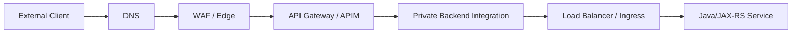
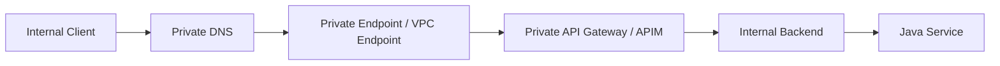
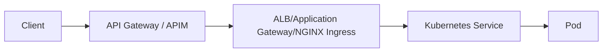

# Part 010 — API Gateway and API Management

> Fokus part ini adalah memahami API Gateway dan API Management sebagai control point untuk API traffic, bukan sekadar reverse proxy. Dalam enterprise Java/JAX-RS system, gateway sering menjadi tempat policy enforcement: authentication, authorization handoff, rate limiting, request validation, transformation, versioning, subscription model, private exposure, developer onboarding, observability, dan traffic governance.

API gateway sering disalahpahami karena namanya mirip dengan ingress, load balancer, atau reverse proxy. Padahal masing-masing punya boundary berbeda.

```text
Client
  -> DNS
  -> Edge/WAF
  -> API Gateway / API Management
  -> Load Balancer / Ingress
  -> Kubernetes Service
  -> Java/JAX-RS Service
```

Jika desain tidak jelas, gateway layer bisa menjadi sumber:

- duplicated authentication;
- inconsistent authorization;
- hidden timeout;
- request body truncation;
- rate limit tidak sesuai tenant/customer;
- subscription key dianggap security padahal hanya consumption control;
- path rewrite merusak JAX-RS resource mapping;
- private API ternyata masih reachable publik;
- JWT validation berbeda antara gateway dan aplikasi;
- observability terputus antara gateway log dan application log;
- cost spike karena logging, transformation, atau high request volume.

---

## 1. Core mental model

API gateway adalah policy enforcement dan API exposure layer.

Ia biasanya menjawab pertanyaan:

- API apa yang diekspos?
- Siapa consumer-nya?
- Bagaimana consumer diautentikasi?
- Bagaimana request dibatasi?
- Bagaimana versi API dikelola?
- Bagaimana request diarahkan ke backend?
- Bagaimana error dan log dikorelasikan?
- Apakah API public, private, partner-only, atau internal?

Ingress dan load balancer menjawab pertanyaan yang lebih rendah:

- Traffic masuk ke cluster lewat mana?
- Host/path mana diarahkan ke service mana?
- Target mana yang sehat?
- TLS terminate di mana?
- Koneksi TCP/HTTP diteruskan ke mana?

Perbedaan ringkas:

| Layer | Primary concern | Typical examples |
|---|---|---|
| Load balancer | Distribution and health | ALB, NLB, Azure Load Balancer, Application Gateway |
| Ingress | Kubernetes HTTP entry routing | NGINX Ingress, AGIC, ALB Ingress |
| Reverse proxy | Request forwarding and local policy | NGINX, Envoy |
| API gateway | API governance and consumer-facing policy | AWS API Gateway, Azure API Management |
| Service mesh | Service-to-service traffic policy | Istio, Linkerd, Consul awareness |

API gateway bisa melakukan routing, tetapi tidak semua routing harus berada di gateway.

---

## 2. API gateway vs ingress

Ingress biasanya workload/platform routing. API gateway biasanya consumer/API governance.

### 2.1 Ingress cocok untuk

- expose service dari Kubernetes;
- host/path routing ke service;
- TLS termination dekat cluster;
- cluster-level traffic management;
- internal service entry point;
- platform-owned routing.

### 2.2 API gateway cocok untuk

- API productization;
- consumer onboarding;
- subscription/API key model;
- OAuth/OIDC/JWT enforcement;
- rate limit/quota per consumer;
- request/response transformation;
- developer portal;
- private/public API boundary;
- API lifecycle/version governance;
- centralized API analytics.

### 2.3 Anti-pattern

Anti-pattern umum:

```text
API Gateway does authentication
Ingress also validates JWT differently
Application also validates JWT differently
Result: inconsistent security behavior
```

Atau:

```text
API Gateway rewrites /v1/orders to /orders
Ingress rewrites /orders to /
JAX-RS expects /api/orders
Result: 404, wrong metrics, broken OpenAPI docs
```

Principle:

> Satu policy boleh enforced di lebih dari satu layer hanya jika tujuannya jelas: defense-in-depth, bukan accidental duplication.

---

## 3. AWS API Gateway mental model

Amazon API Gateway adalah managed service untuk membuat, publish, monitor, dan mengamankan APIs. API Gateway memiliki beberapa flavor, terutama REST API, HTTP API, dan WebSocket API. Untuk Java/JAX-RS backend enterprise, yang paling relevan biasanya REST API atau HTTP API di depan backend integration.

Konsep penting:

```text
AWS API Gateway
  ├── API type: REST API / HTTP API / WebSocket API
  ├── Route or resource/method
  ├── Stage
  ├── Deployment
  ├── Integration
  ├── Authorizer
  ├── Usage plan / API key for REST API
  ├── Throttling / quota
  ├── Custom domain
  ├── Resource policy
  ├── VPC Link / private integration
  ├── Access logs / execution logs
  └── Metrics / tracing integration awareness
```

### 3.1 REST API vs HTTP API awareness

HTTP API biasanya lebih sederhana dan cost/latency-friendly untuk banyak HTTP workloads. REST API memiliki fitur matang yang berbeda. Pilihan harus diverifikasi terhadap kebutuhan fitur: authorizer, private integration, usage plan, transformation, logging, policy, dan compatibility.

Jangan memilih hanya karena nama.

Review questions:

- Apakah perlu usage plan/API key?
- Apakah perlu request/response mapping kompleks?
- Apakah API public atau private?
- Apakah backend ada di VPC?
- Apakah perlu Lambda authorizer atau JWT authorizer?
- Apakah CloudWatch logging cukup?
- Apakah cost per request sesuai volume?

### 3.2 Route, resource, method

API Gateway REST API sering dimodelkan sebagai resource + method:

```text
/quotes        GET, POST
/quotes/{id}   GET, PATCH
/orders        POST
/orders/{id}   GET
```

HTTP API memakai route seperti:

```text
GET /quotes
POST /quotes
GET /quotes/{id}
ANY /{proxy+}
```

Untuk Java/JAX-RS backend, jangan asal memakai catch-all route jika API governance butuh visibility per endpoint. Catch-all memang fleksibel, tetapi bisa mengurangi kontrol policy per route dan membuat API catalog kurang jelas.

### 3.3 Stage/environment

Stage adalah deployment environment/logical stage API.

Contoh:

```text
dev
qa
staging
prod
```

Tetapi jangan otomatis menyamakan stage API Gateway dengan environment cloud. Dalam enterprise landing zone, environment bisa dipisah di account/subscription/VPC/VNet/cluster. Stage hanyalah salah satu abstraction.

Pertanyaan:

- Apakah `prod` stage berada di prod account?
- Apakah stage variable dipakai?
- Apakah deployment API dikontrol IaC?
- Apakah ada canary deployment?
- Apakah custom domain per environment jelas?

### 3.4 Integration

Integration adalah backend target.

Bisa berupa:

- Lambda;
- HTTP endpoint;
- private integration via VPC Link ke ALB/NLB;
- AWS service integration;
- mock integration.

Untuk Java/JAX-RS di EKS, pattern umum:

```text
Client
  -> API Gateway
  -> VPC Link
  -> internal NLB/ALB
  -> EKS ingress/service
  -> Java/JAX-RS pod
```

Design concern:

- Apakah traffic ke backend private?
- Apakah VPC Link target benar?
- Apakah NLB/ALB health check aligned?
- Apakah gateway timeout compatible dengan backend timeout?
- Apakah Host header/forwarded headers benar?
- Apakah request body size limit cocok?

### 3.5 Private API

Private REST API di API Gateway hanya callable dari dalam VPC melalui interface VPC endpoint powered by PrivateLink. Resource policy dan VPC endpoint policy dapat mengontrol siapa/apa yang boleh invoke.

Mental model:

```text
VPC client
  -> Interface VPC Endpoint for execute-api
  -> Private API Gateway endpoint
  -> API method
  -> Backend integration
```

Private API bukan hanya “API tanpa public DNS”. Ia butuh:

- interface VPC endpoint;
- resource policy;
- DNS/private DNS behavior;
- security group untuk endpoint;
- route/network reachability;
- IAM/auth policy jika digunakan.

Failure mode:

- API dipanggil dari luar VPC;
- VPC endpoint tidak ada atau salah VPC;
- private DNS disabled;
- resource policy tidak allow VPC endpoint;
- endpoint policy terlalu restriktif;
- custom domain/private DNS salah;
- security group endpoint menolak traffic.

---

## 4. Azure API Management mental model

Azure API Management, atau APIM, adalah platform API management untuk publish, secure, transform, monitor, dan manage APIs. Ia lebih dekat ke “API product and policy layer” dibanding sekadar load balancer.

Konsep penting:

```text
Azure API Management
  ├── API Management instance
  ├── Gateway
  ├── API
  ├── Operation
  ├── Product
  ├── Subscription
  ├── Subscription key
  ├── Policy
  ├── Named value
  ├── Backend
  ├── Developer portal
  ├── Private endpoint / VNet integration awareness
  ├── Diagnostics / Application Insights / Azure Monitor
  └── Version/revision management
```

### 4.1 API, operation, product, subscription

APIM separates API surface from consumer packaging.

- **API**: exposed API definition.
- **Operation**: method/path under API.
- **Product**: bundle of APIs exposed to consumers.
- **Subscription**: consumer access to product/API, usually via subscription key.
- **Policy**: logic applied inbound, backend, outbound, or on-error.

Important distinction:

> Azure API Management subscription is not the same as Azure subscription.

APIM subscription is an API consumer access construct. Azure subscription is cloud resource/billing/governance boundary.

### 4.2 Policy engine

APIM policies run through sections:

```text
inbound
  -> backend
  -> outbound
  -> on-error
```

Policy can handle:

- JWT validation;
- rate limiting;
- quota;
- header manipulation;
- URL rewrite;
- backend routing;
- caching;
- content validation;
- CORS;
- error shaping;
- transformation;
- logging/enrichment.

Powerful, but risky.

Policy code can become hidden application logic. Avoid putting business rules in APIM unless explicitly owned and tested.

### 4.3 Private endpoint and VNet integration

APIM can be integrated with private networking depending on tier/features. Inbound private endpoint lets clients on private network access APIM over Private Link. Outbound VNet integration can be used to reach private backends depending tier/design.

Mental model:

```text
Private client
  -> Private DNS
  -> APIM private endpoint
  -> APIM gateway
  -> Private backend via VNet path
  -> AKS/Application Gateway/Service
```

Questions:

- Is public network access disabled?
- Is private DNS configured?
- Is only gateway endpoint private, or also management/developer portal considered?
- Is backend private too?
- Does APIM have outbound VNet integration to reach backend?
- Are firewall/NSG routes correct?

---

## 5. Authentication and authorization boundary

API gateway can validate identity tokens, but it rarely owns all authorization logic.

### 5.1 Authentication

Common patterns:

- JWT validation;
- OAuth/OIDC integration;
- custom authorizer;
- API key/subscription key;
- mTLS awareness;
- IAM-based invocation for AWS private/internal APIs.

### 5.2 API key/subscription key is not user identity

API key/subscription key identifies a client/app/subscription, not necessarily an end user.

Do not treat subscription key as complete security for sensitive APIs.

Better mental model:

| Mechanism | Identifies | Good for | Not enough for |
|---|---|---|---|
| API key | App/consumer subscription | metering, basic access, quota | strong user auth |
| JWT | user/service principal claims | authn/authz handoff | quota by commercial subscription unless mapped |
| mTLS | client certificate/workload | strong client identity | user-level authorization |
| IAM/RBAC | cloud principal | AWS/Azure internal access | business domain permission |

### 5.3 Where should authorization live?

Gateway can enforce coarse rules:

- token issuer;
- audience;
- required claim;
- scope;
- route access;
- subscription/product access.

Application should usually enforce domain authorization:

- can this user access this quote?
- can this tenant modify this order?
- can this account view this customer data?
- is this state transition allowed?
- does this role allow price override?

For CSG-like quote/order flows, domain authorization cannot be fully delegated to gateway because it depends on business object state, tenant/customer ownership, workflow state, and entitlement.

---

## 6. Rate limiting and quota

Rate limiting protects platform and backend capacity.

Common dimensions:

- per client;
- per API key/subscription;
- per JWT subject;
- per tenant;
- per IP;
- per route;
- per environment;
- global account-level/provider-level throttle.

### 6.1 AWS API Gateway throttling

AWS API Gateway supports throttling at multiple levels depending API type/features, including account/Region, stage/method, and usage plan/client dimensions for REST API usage plans.

Concern:

- account-level throttle can affect multiple APIs;
- per-client throttle should be lower than backend saturation point;
- retry behavior from clients can amplify throttling;
- `429` must be handled by clients;
- rate limit should align with business contract.

### 6.2 Azure API Management rate limit

APIM policies such as `rate-limit-by-key` can limit calls by arbitrary key. Key can be subscription, IP, claim, tenant, or expression-derived value.

Concern:

- key expression must be stable;
- distributed/scale behavior must be understood;
- rate limit by IP behind NAT may punish many users;
- rate limit by JWT claim needs token validation first;
- quota must be communicated to consumers;
- `429` response should include useful retry semantics when possible.

### 6.3 Backend still needs protection

Gateway rate limit is not enough if backend can also be called internally, through ingress, or through private network bypass.

Backend should still have:

- request timeout;
- bulkhead;
- connection pool limit;
- circuit breaker;
- idempotency for retried mutations;
- backpressure strategy;
- metrics per consumer/tenant if possible.

---

## 7. Request and response transformation

Gateway can transform:

- path;
- query parameter;
- header;
- body;
- protocol;
- response status;
- error shape.

Useful for:

- backward compatibility;
- legacy consumer adaptation;
- header normalization;
- adding correlation ID;
- mapping external URL to internal backend path;
- hiding backend implementation detail.

Dangerous when:

- transformation becomes business logic;
- OpenAPI spec no longer matches backend;
- JAX-RS resource path differs from gateway path without documentation;
- error semantics are rewritten inconsistently;
- security headers are stripped accidentally;
- large payload transformation increases latency/cost;
- debugging requires reading hidden gateway policy.

Rule:

> Transform at gateway for API contract adaptation, not for domain decisions.

---

## 8. API versioning

Versioning can happen at several layers:

- path: `/v1/orders`;
- header: `Accept: application/vnd.company.order.v1+json`;
- query parameter;
- gateway API versioning feature;
- backend route versioning;
- deployment/stage versioning.

For enterprise systems, path versioning is often simplest operationally, but not always ideal.

Important concerns:

- gateway route version must match Java/JAX-RS route;
- old version deprecation policy must be clear;
- metrics must separate versions;
- rate limits may differ by version;
- security policy must apply consistently;
- documentation/developer portal must show correct contract;
- backend deployment must support multiple versions if gateway routes to same service.

Failure mode:

```text
Gateway exposes /v2/quotes
Backend only supports /v1/quotes
Gateway rewrites /v2 -> /v1 temporarily
Nobody documents semantic differences
Client observes mixed behavior
```

---

## 9. Developer portal and API product thinking

Azure APIM has a strong API product model with developer portal. AWS API Gateway can also publish APIs, use usage plans, API keys, docs/OpenAPI workflows depending setup.

For internal enterprise APIs, developer portal may still matter:

- onboarding internal teams;
- documenting auth requirements;
- documenting rate limits;
- publishing OpenAPI specs;
- clarifying error model;
- showing deprecation timelines;
- making ownership visible.

But portal does not guarantee production readiness. API docs must match actual gateway policy and backend behavior.

Checklist:

- Is OpenAPI spec source-controlled?
- Is generated spec same as deployed gateway config?
- Are examples realistic?
- Are error codes documented?
- Are rate limits documented?
- Are authentication flows documented?
- Is owner/contact visible?
- Is deprecation policy visible?

---

## 10. Private API and private backend integration

Private API is critical for enterprise systems that must not expose backend APIs to the public internet.

### 10.1 AWS private API patterns

Pattern A: Private API Gateway endpoint:

```text
VPC client
  -> Interface VPC Endpoint for execute-api
  -> Private API Gateway
  -> Backend integration
```

Pattern B: Public/private API Gateway with private backend integration:

```text
Client
  -> API Gateway
  -> VPC Link
  -> internal NLB/ALB
  -> EKS service
```

These are different.

- Private API controls who can call API Gateway.
- Private integration controls how API Gateway reaches backend privately.

You can need one, the other, or both depending architecture.

### 10.2 Azure APIM private patterns

Pattern A: APIM private inbound:

```text
Private client
  -> Private DNS
  -> APIM private endpoint
  -> APIM gateway
```

Pattern B: APIM outbound to private backend:

```text
APIM gateway
  -> VNet/private route
  -> Application Gateway / AKS / internal API
```

Pattern C: Public APIM fronting private backend:

```text
Internet client
  -> APIM public gateway
  -> private backend via VNet integration
```

This can be valid, but security review must be explicit.

Questions:

- Is the API itself private, or only the backend private?
- Is public network access disabled where required?
- Is DNS private or public?
- What is the authentication boundary?
- Can backend be bypassed directly?
- Are firewall/NSG rules least privilege?

---

## 11. Backend integration with Java/JAX-RS

Gateway design directly affects application behavior.

### 11.1 Headers

Gateway should preserve or set:

- correlation ID;
- request ID;
- original host;
- original scheme;
- client IP chain;
- authenticated principal claims if deliberately forwarded;
- tenant/customer header only if trusted and signed/validated;
- trace context headers.

Do not blindly trust headers from external clients.

Java service should treat gateway-provided identity carefully:

```text
External client header -> untrusted
Gateway validated claim -> trusted only if gateway is trusted and header cannot be spoofed
Application domain authorization -> still required
```

### 11.2 Error model

Gateway can return errors before request hits application:

- 401 unauthorized;
- 403 forbidden;
- 404 route not found;
- 413 payload too large;
- 429 too many requests;
- 502 bad gateway;
- 503 unavailable;
- 504 timeout.

Application logs may have nothing for these requests.

Incident triage must check gateway logs before concluding “no request received”.

### 11.3 Payload size

Gateway may enforce payload size and timeout limits.

For file upload/export/import flows:

- avoid sending very large binary payloads through API gateway if object storage presigned/SAS flow is better;
- document max payload;
- align gateway limit, ingress limit, app server limit, and object storage pattern;
- use streaming where applicable;
- avoid buffering huge payload in Java heap.

### 11.4 Idempotency

Gateways and clients may retry. Mutating APIs must handle idempotency explicitly.

For quote/order operations:

- quote creation;
- order submission;
- payment/order orchestration;
- workflow transition;
- external system callback;
- export job creation.

Use idempotency key/request ID pattern where appropriate. Gateway rate limit does not solve duplicate mutation.

---

## 12. Observability and correlation

API gateway must be part of observability, not a black box.

Minimum signals:

- request count by route/API/version;
- latency by route;
- 4xx/5xx by route;
- auth failures;
- rate limit events;
- WAF/policy failures if applicable;
- backend integration latency;
- gateway timeout count;
- request/response size;
- consumer/subscription dimension if allowed;
- correlation ID propagation;
- tracing headers.

### 12.1 Correlation ID pattern

Recommended path:

```text
Client request
  -> Gateway ensures/creates correlation ID
  -> Gateway logs it
  -> Gateway forwards to backend
  -> Java service logs it
  -> Java service propagates to DB/broker/outbound calls where applicable
```

Do not let every layer create unrelated IDs without linking them.

### 12.2 Gateway vs application latency

Always separate:

```text
Gateway total latency
Backend integration latency
Application processing latency
Downstream dependency latency
```

If gateway latency is high but backend latency low, issue may be at edge/policy/transformation/client side.

If backend latency high, trace into Java service and dependencies.

---

## 13. Failure mode catalog

### 13.1 401 from gateway

Common causes:

- missing token;
- wrong issuer;
- wrong audience;
- expired token;
- wrong signing key/JWKS;
- clock skew;
- gateway expects subscription key;
- custom authorizer rejects request.

Debug:

```text
1. Check gateway auth policy/authorizer logs.
2. Decode token header/claims safely.
3. Verify issuer/audience/scope.
4. Check JWKS/certificate rotation.
5. Check subscription/API key requirement.
6. Confirm app was not reached.
```

### 13.2 403 from gateway

Common causes:

- authenticated but not authorized;
- resource policy denies;
- VPC endpoint policy denies;
- APIM product/subscription does not include API;
- IP allowlist denies;
- private endpoint restriction;
- WAF/security rule blocks request.

Debug:

```text
1. Identify whether 403 from gateway, WAF, or backend.
2. Check policy/resource policy/subscription/product.
3. Check IP/private endpoint condition.
4. Check route-level authorization.
5. Check audit log.
```

### 13.3 404 from gateway

Common causes:

- route not deployed;
- wrong stage/base path;
- custom domain mapping wrong;
- path rewrite mismatch;
- method not configured;
- backend 404 masked as gateway 404.

Debug:

```text
1. Check route/method exists.
2. Check deployed stage/revision.
3. Check custom domain/base path mapping.
4. Check path rewrite.
5. Compare gateway access log and app log.
```

### 13.4 429 Too Many Requests

Common causes:

- usage plan quota exceeded;
- rate limit policy triggered;
- account-level throttle;
- client retry storm;
- gateway protecting backend;
- shared subscription key overused.

Debug:

```text
1. Identify rate limit dimension.
2. Check consumer/subscription/API key.
3. Check route-level vs global throttle.
4. Check client retry behavior.
5. Check backend capacity to decide whether limit should change.
```

### 13.5 502/503/504

Common causes:

- backend unreachable;
- private integration broken;
- VPC Link/VNet integration issue;
- load balancer target unhealthy;
- TLS handshake failed;
- backend timeout;
- gateway timeout;
- DNS for backend wrong;
- ingress/service changed.

Debug:

```text
1. Gateway access log.
2. Gateway integration latency/error.
3. Private link/VPC Link/VNet path.
4. Backend load balancer health.
5. Ingress/service endpoints.
6. Java application logs/traces.
7. Downstream dependency metrics.
```

---

## 14. Security model

API gateway is security-sensitive. Treat gateway config like code.

### 14.1 Least privilege

- Gateway should only reach intended backends.
- CI/CD should only deploy allowed APIs/policies.
- Authorizers/policies should be reviewed.
- Named values/secrets should not leak.
- Private APIs should have resource/network policies.
- APIM access should be RBAC-controlled.

### 14.2 Defense in depth

Gateway may validate JWT, but backend should still validate critical assumptions.

Examples:

- Gateway validates token issuer/audience.
- Backend validates domain permission.
- Gateway rate-limits consumer.
- Backend applies bounded resources and idempotency.
- Gateway blocks obvious malformed request.
- Backend validates schema/domain invariants.

### 14.3 Header trust

Never trust identity headers unless:

- gateway strips incoming client-provided identity headers;
- gateway sets canonical headers after validation;
- backend only accepts such headers from trusted network path;
- this behavior is documented and tested.

---

## 15. Cost model

Gateway costs can matter at high volume.

Cost drivers:

- request count;
- data transfer;
- caching;
- WAF/security features;
- logging volume;
- metrics dimensions;
- developer tier/premium tier choices;
- private endpoint/VNet integration;
- multi-region deployment;
- policy complexity increasing latency/capacity needs.

Cost review questions:

- What is expected RPS?
- What is average and p95 payload size?
- Are large uploads routed through gateway unnecessarily?
- Are access logs sampling/retention appropriate?
- Are high-cardinality dimensions controlled?
- Are non-prod gateways right-sized?
- Is gateway tier/SKU justified?

---

## 16. API gateway review checklist

### 16.1 API exposure

- Is API public, private, partner-only, or internal?
- Is DNS correct?
- Is custom domain/base path mapping documented?
- Is public exposure approved?
- Is private endpoint/VPC endpoint required?

### 16.2 Routing

- Are routes explicit enough?
- Are catch-all routes justified?
- Are path rewrites documented?
- Is backend path aligned with JAX-RS mapping?
- Are versions managed consistently?
- Is default route safe?

### 16.3 Authentication and authorization

- What auth mechanism is used?
- Is JWT issuer/audience/scope validated?
- Is API key/subscription key being misused as strong auth?
- What authorization stays in application?
- Are identity headers sanitized?
- Are service-to-service calls authenticated?

### 16.4 Rate limit and quota

- What dimension is rate-limited?
- Are limits per consumer/tenant/API/route?
- Is `429` behavior documented?
- Are clients expected to retry?
- Are limits aligned with backend capacity?
- Can one noisy consumer affect others?

### 16.5 Private connectivity

- Is backend reached privately?
- AWS: VPC Link, private API, VPC endpoint, resource policy checked?
- Azure: APIM private endpoint, VNet integration, private DNS checked?
- Is public backend bypass possible?
- Are firewall/SG/NSG rules least privilege?

### 16.6 Reliability

- Are gateway timeout and backend timeout aligned?
- Are retries understood?
- Are long-running operations asynchronous?
- Are idempotency keys used for mutations?
- Is payload size limit documented?
- Is backend health monitored?

### 16.7 Observability

- Are access logs enabled?
- Is correlation ID propagated?
- Are route-level metrics available?
- Are auth/rate-limit failures visible?
- Are gateway errors distinguishable from backend errors?
- Are dashboards and alerts defined?

### 16.8 Governance

- Is OpenAPI spec source-controlled?
- Is gateway config managed by IaC/GitOps/pipeline?
- Is developer portal/API catalog updated?
- Is deprecation policy clear?
- Is owner/team visible?
- Is PR/ADR review required for policy change?

---

## 17. Internal verification checklist

Untuk konteks CSG/team, jangan asumsi. Verifikasi:

- Apakah AWS API Gateway digunakan di environment mana pun?
- Apakah Azure API Management digunakan di environment mana pun?
- Apakah API gateway berada sebelum Application Gateway/ALB/NLB/NGINX ingress?
- Apakah API Gateway/APIM digunakan untuk public APIs, partner APIs, internal APIs, atau semua?
- Apakah API authentication dilakukan di gateway, aplikasi, atau keduanya?
- Apakah JWT/OIDC issuer, audience, scope, dan claims standard terdokumentasi?
- Apakah API key/subscription key digunakan? Untuk metering, auth, atau keduanya?
- Apakah rate limit/quota per consumer/tenant/customer ada?
- Apakah private API/private endpoint digunakan?
- Apakah backend API bisa dibypass dari network path lain?
- Apakah gateway policy/config dikelola IaC atau manual?
- Apakah OpenAPI spec menjadi source of truth?
- Apakah path rewrite atau header transformation dipakai?
- Apakah APIM policies/AWS mapping templates mengandung logic yang seharusnya berada di aplikasi?
- Apakah logs gateway masuk ke CloudWatch/Azure Monitor/Log Analytics?
- Apakah correlation ID diset di gateway dan diteruskan ke Java service?
- Apakah ada runbook untuk 401/403/429/502/504?
- Apakah ada incident historis terkait API gateway, WAF, auth, rate limit, atau private connectivity?

---

## 18. Design patterns

### 18.1 Public API with gateway governance



Use when API is externally consumed and needs strong governance.

### 18.2 Internal private API



Use when API must not be public.

### 18.3 Gateway plus Kubernetes ingress



Use when gateway handles API governance and ingress handles cluster routing.

Risk: duplicated routing/auth/timeout unless ownership is clear.

---

## 19. What senior engineers should ask

1. Why do we need an API gateway here instead of ingress/load balancer only?
2. What policy is enforced at the gateway, and what remains in the application?
3. Is this API public, private, partner-only, or internal?
4. Can the backend be bypassed directly?
5. What is the identity model: JWT, API key, subscription, mTLS, IAM/RBAC?
6. Are rate limits per consumer, tenant, API, route, or global?
7. Are route rewrites documented and tested?
8. Does OpenAPI match deployed gateway behavior and Java/JAX-RS mapping?
9. Are timeout and payload size limits compatible with backend behavior?
10. How do we correlate gateway log with application log and distributed trace?
11. What happens during auth provider outage, gateway outage, or private endpoint failure?
12. What is rollback if a gateway policy blocks production traffic?
13. Who owns gateway config: platform, backend team, security, or API governance?
14. Is the gateway policy auditable through IaC or version control?

---

## 20. Summary

API Gateway dan API Management adalah governance layer untuk API traffic. Mereka bukan sekadar “router HTTP”. Mereka dapat menentukan siapa boleh memanggil API, berapa banyak traffic yang boleh masuk, bagaimana request dibentuk, bagaimana versi API dipublikasikan, dan bagaimana traffic menuju backend.

Mental model yang harus melekat:

```text
API Gateway / APIM
  = exposure boundary
  + consumer governance
  + auth/policy enforcement
  + rate limit/quota
  + route/version management
  + transformation boundary
  + observability point
  + private/public connectivity control
```

Untuk backend Java/JAX-RS, gateway decision berdampak langsung pada:

- route mapping;
- authentication handoff;
- domain authorization;
- forwarded headers;
- correlation ID;
- timeout;
- payload limit;
- error semantics;
- idempotency;
- observability;
- security review.

Senior engineer harus bisa melihat gateway sebagai bagian dari end-to-end production path, bukan komponen terpisah milik platform team saja.

---

## Reference anchors

Gunakan referensi resmi berikut saat butuh detail konfigurasi vendor:

- AWS API Gateway HTTP APIs: `https://docs.aws.amazon.com/apigateway/latest/developerguide/http-api.html`
- AWS API Gateway private REST APIs: `https://docs.aws.amazon.com/apigateway/latest/developerguide/apigateway-private-apis.html`
- AWS API Gateway usage plans and API keys: `https://docs.aws.amazon.com/apigateway/latest/developerguide/api-gateway-api-usage-plans.html`
- AWS API Gateway request throttling: `https://docs.aws.amazon.com/apigateway/latest/developerguide/api-gateway-request-throttling.html`
- AWS API Gateway Lambda authorizers: `https://docs.aws.amazon.com/apigateway/latest/developerguide/apigateway-use-lambda-authorizer.html`
- AWS API Gateway JWT authorizers for HTTP APIs: `https://docs.aws.amazon.com/apigateway/latest/developerguide/http-api-jwt-authorizer.html`
- AWS private integration setup: `https://docs.aws.amazon.com/apigateway/latest/developerguide/set-up-private-integration.html`
- Azure API Management key concepts: `https://learn.microsoft.com/en-us/azure/api-management/api-management-key-concepts`
- Azure API Management policies: `https://learn.microsoft.com/en-us/azure/api-management/api-management-policies`
- Azure API Management policy configuration: `https://learn.microsoft.com/en-us/azure/api-management/api-management-howto-policies`
- Azure API Management validate-jwt policy: `https://learn.microsoft.com/en-us/azure/api-management/validate-jwt-policy`
- Azure API Management rate-limit-by-key policy: `https://learn.microsoft.com/en-us/azure/api-management/rate-limit-by-key-policy`
- Azure API Management subscriptions: `https://learn.microsoft.com/en-us/azure/api-management/api-management-subscriptions`
- Azure API Management private endpoint: `https://learn.microsoft.com/en-us/azure/api-management/private-endpoint`
- Azure API Management virtual network concepts: `https://learn.microsoft.com/en-us/azure/api-management/virtual-network-concepts`
