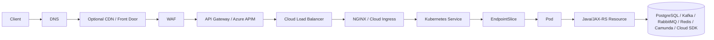
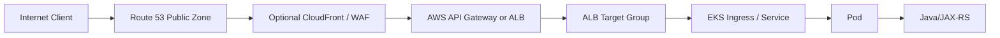
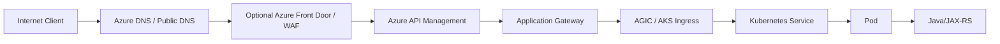

# Part 011 — End-to-End Traffic Flow

> Fokus part ini adalah memahami satu request production secara utuh: dari client, DNS, optional edge/CDN/front door, WAF, API Gateway/APIM, load balancer, ingress, Kubernetes Service, EndpointSlice, Pod, sampai Java/JAX-RS endpoint. Targetnya bukan menghafal komponen, tetapi mampu menjawab: request ini masuk lewat mana, berhenti di mana, berubah di mana, kehilangan header di mana, TLS terminate di mana, timeout terjadi di mana, dan siapa yang harus dihubungi saat terjadi incident.

Di enterprise backend system, request path jarang sesederhana `client -> service`. Biasanya ada banyak boundary:

- public/private DNS;
- CDN atau edge layer jika digunakan;
- WAF atau DDoS protection;
- API gateway atau API management;
- regional load balancer;
- NGINX ingress atau cloud ingress controller;
- Kubernetes Service;
- EndpointSlice;
- Pod;
- application container;
- Java/JAX-RS resource method;
- downstream dependency seperti PostgreSQL, Kafka, RabbitMQ, Redis, Camunda, object storage, config, secret manager, atau cloud SDK.

Senior engineer harus bisa membaca seluruh path tersebut sebagai satu sistem, bukan sebagai tumpukan komponen terpisah.

---

## 1. Core mental model

End-to-end traffic flow adalah gabungan dari beberapa chain:

```text
Name resolution chain
  client resolver -> public/private DNS -> CNAME/alias -> entry point

Network routing chain
  source network -> firewall/proxy/NAT -> load balancer -> subnet -> node/pod

HTTP routing chain
  host/path/header -> gateway rule -> ingress rule -> service -> endpoint

TLS chain
  client TLS -> edge TLS -> gateway TLS -> ingress TLS -> service/pod TLS if used

Timeout chain
  client timeout -> gateway timeout -> load balancer timeout -> ingress timeout -> app timeout -> downstream timeout

Identity/security chain
  client identity -> gateway auth -> service auth -> workload identity -> downstream authorization

Observability chain
  request id -> correlation id -> access log -> app log -> trace -> metric -> alert
```

Saat incident, jangan langsung bertanya “aplikasinya error apa?”. Pertanyaan yang lebih tepat:

1. Apakah request mencapai entry point yang benar?
2. Apakah DNS resolve ke IP/hostname yang benar?
3. Apakah WAF/gateway/load balancer menerima request?
4. Apakah route rule cocok dengan host/path yang dikirim client?
5. Apakah health check melihat backend sebagai healthy?
6. Apakah ingress memilih Kubernetes Service yang benar?
7. Apakah Service punya EndpointSlice yang menunjuk Pod siap melayani?
8. Apakah Pod menerima request?
9. Apakah Java/JAX-RS handler dieksekusi?
10. Apakah downstream dependency memperlambat atau menggagalkan response?

Jika salah satu jawabannya belum jelas, root cause belum layak disimpulkan.

---

## 2. Canonical request path

Bentuk umum request path untuk Java/JAX-RS service di cloud-managed Kubernetes:



Tidak semua environment memiliki semua layer. Beberapa sistem internal mungkin hanya:

```text
Corporate client
  -> private DNS
  -> internal load balancer
  -> ingress
  -> service
  -> pod
```

Beberapa sistem public mungkin lebih panjang:

```text
Internet client
  -> public DNS
  -> edge routing/CDN
  -> WAF
  -> API Gateway/APIM
  -> regional L7 load balancer
  -> ingress
  -> service
  -> pod
```

Yang penting bukan jumlah layer, tetapi kejelasan fungsi setiap layer.

| Layer | Fungsi utama | Failure yang umum |
|---|---|---|
| DNS | Menentukan entry point | wrong record, stale cache, private/public mismatch |
| Edge/CDN/Front Door | Global entry, caching, WAF edge | wrong origin, cache issue, TLS issue |
| WAF | Request filtering | false positive, blocked header/body/path |
| API Gateway/APIM | API governance, auth, rate limit | 401/403/429, route mismatch, policy error |
| Load balancer | Backend distribution | unhealthy target, listener mismatch, timeout |
| Ingress | Kubernetes HTTP routing | wrong host/path, missing annotation, TLS secret issue |
| Service | Stable virtual service | wrong selector, no endpoints |
| EndpointSlice | Backend pod mapping | pod not ready, endpoint stale, scale churn |
| Pod | Runtime execution | crash, readiness false, CPU/memory pressure |
| Java/JAX-RS | Business/API handler | thread starvation, slow downstream, bad exception mapping |

---

## 3. Public client vs corporate/private client

Request source menentukan DNS, routing, firewall, and trust model.

### 3.1 Internet client

Internet client biasanya melewati public DNS dan public entry point.

```text
Internet client
  -> public recursive DNS
  -> public DNS zone
  -> public edge/gateway/load balancer
  -> public or private backend integration
```

Concern utama:

- WAF;
- DDoS protection;
- TLS certificate;
- public exposure;
- authentication;
- rate limiting;
- bot traffic;
- API abuse;
- data leakage melalui error response;
- log PII;
- cost spike akibat traffic besar.

### 3.2 Corporate/private client

Corporate/private client biasanya melewati private DNS, VPN, Direct Connect, ExpressRoute, private load balancer, atau private endpoint.

```text
Corporate client
  -> corporate DNS
  -> DNS forwarder/resolver
  -> private DNS zone
  -> private IP entry point
  -> internal gateway/load balancer
```

Concern utama:

- DNS forwarding;
- split-horizon DNS;
- firewall allowlist;
- CIDR overlap;
- proxy;
- internal CA;
- routing asymmetry;
- private endpoint DNS;
- MTU;
- latency;
- ownership handoff antara network team dan platform team.

### 3.3 Debug implication

Untuk incident, selalu klasifikasikan source:

```text
Is the caller public, internal cloud, on-prem, partner network, another VPC/VNet, or another cluster?
```

Kesalahan umum adalah men-debug dari laptop engineer yang punya path berbeda dari production caller. Hasil `curl` dari laptop belum tentu merepresentasikan path dari pod, on-prem client, partner integration, atau API gateway.

---

## 4. DNS phase

DNS adalah phase pertama yang sering diabaikan.

Request tidak bisa mencapai entry point yang benar jika nama tidak resolve ke target yang benar.

### 4.1 Apa yang harus diketahui

Untuk setiap hostname production, Anda harus tahu:

- hostname public atau private;
- authoritative zone;
- CNAME/alias chain;
- TTL;
- apakah split-horizon DNS digunakan;
- apakah private hosted zone/private DNS zone terhubung ke VPC/VNet yang benar;
- apakah on-prem DNS melakukan forwarding ke cloud resolver;
- apakah Kubernetes CoreDNS ikut dalam path;
- apakah private endpoint mengubah resolusi FQDN service menjadi private IP.

### 4.2 DNS chain contoh

```text
api.example.internal
  -> corporate DNS
  -> conditional forwarder
  -> cloud resolver
  -> private hosted zone / private DNS zone
  -> internal load balancer private IP
```

Atau:

```text
api.example.com
  -> public DNS
  -> CNAME to edge/gateway/load-balancer hostname
  -> public entry point
```

### 4.3 Failure mode DNS

| Symptom | Kemungkinan penyebab |
|---|---|
| `NXDOMAIN` | record tidak ada, wrong zone, resolver salah |
| resolve ke public IP padahal harus private | private zone tidak terkait VPC/VNet, split DNS salah |
| resolve ke private IP dari network yang tidak punya route | private endpoint DNS dipakai dari network yang salah |
| sebagian client berhasil, sebagian gagal | resolver berbeda, stale cache, TTL, conditional forwarding |
| pod resolve berbeda dari node/laptop | CoreDNS config, search domain, ndots, DNS policy |
| failover lambat | TTL terlalu tinggi, client DNS cache |

### 4.4 Debug command yang umum

```bash
# Dari laptop / bastion / debug host
nslookup api.example.com
dig api.example.com

# Dari pod di cluster
kubectl run dns-debug --rm -it --image=busybox:1.36 -- nslookup api.example.com

# Cek Kubernetes service DNS
kubectl run dns-debug --rm -it --image=busybox:1.36 -- nslookup my-service.my-namespace.svc.cluster.local
```

Debug harus dilakukan dari lokasi caller yang relevan.

---

## 5. Edge/CDN/front door phase

Tidak semua system memakai edge/CDN/front door. Jika digunakan, layer ini sering menjadi global entry point sebelum regional backend.

Contoh:

```text
Client
  -> Azure Front Door / CDN / similar edge layer
  -> WAF edge policy
  -> regional gateway/load balancer
```

Concern utama:

- origin hostname;
- origin health probe;
- TLS certificate di edge;
- TLS ke origin;
- WAF policy;
- caching behavior;
- header forwarding;
- host header override;
- route precedence;
- geo/routing rule;
- failover policy;
- access log.

Untuk REST API Java/JAX-RS, caching harus diperlakukan hati-hati. Tidak semua endpoint aman untuk cache. HTTP method semantics penting:

- `GET` bisa cache jika memang aman dan header benar;
- `POST`, `PUT`, `PATCH`, `DELETE` umumnya tidak boleh di-cache sembarangan;
- response yang mengandung tenant/customer-specific data harus punya cache-control yang ketat.

Failure yang umum:

- edge mengirim Host header yang tidak cocok dengan gateway/ingress rule;
- edge health probe path tidak sama dengan readiness API;
- WAF edge memblokir payload valid;
- TLS antara edge dan origin gagal;
- cache menyajikan response stale;
- origin failover mengarah ke region/environment yang salah.

---

## 6. WAF phase

WAF berada sebelum backend dan dapat memblokir request valid jika rule terlalu agresif.

WAF biasanya melihat:

- method;
- path;
- query string;
- header;
- body;
- IP address;
- geo;
- rate;
- managed rule signature;
- custom rule.

### 6.1 Dampak ke Java/JAX-RS service

Jika request diblokir WAF, aplikasi tidak pernah melihat request tersebut. Tidak ada log di service, tidak ada trace di aplikasi, dan tidak ada breakpoint yang akan kena.

Tanda WAF problem:

- client menerima 403 sebelum request mencapai app;
- tidak ada application log;
- tidak ada ingress log;
- WAF log menunjukkan managed rule match;
- hanya payload tertentu yang gagal;
- endpoint upload/search/filter lebih sering kena false positive.

### 6.2 Debug WAF

Perlu data berikut:

- timestamp;
- source IP;
- request path;
- request ID;
- WAF rule ID;
- action: block/count/allow;
- sampled request;
- header/body field yang trigger;
- recent WAF policy change.

Jangan langsung disable WAF. Lebih aman:

1. Ubah rule ke count mode jika proses internal mengizinkan.
2. Tambahkan exception sempit berdasarkan path/header yang valid.
3. Validasi bahwa payload memang bukan attack.
4. Pastikan evidence tercatat untuk security review.

---

## 7. API Gateway / APIM phase

API Gateway atau Azure API Management adalah policy boundary, bukan hanya router.

Layer ini dapat melakukan:

- route matching;
- authentication;
- JWT validation;
- subscription key validation;
- OAuth/OIDC integration;
- rate limiting;
- quota enforcement;
- request transformation;
- response transformation;
- backend selection;
- private integration;
- logging;
- developer portal exposure.

### 7.1 Dampak ke request

Gateway dapat mengubah request sebelum sampai ke backend:

- menambah forwarded headers;
- menghapus header tertentu;
- mengganti host header;
- mengubah path prefix;
- menambahkan identity claims;
- mengubah response code;
- memotong request body jika melewati limit;
- melakukan timeout lebih cepat dari backend.

### 7.2 Failure mode gateway

| Status | Kemungkinan penyebab |
|---:|---|
| 401 | token tidak ada, token invalid, issuer/audience salah |
| 403 | policy menolak, scope/role kurang, subscription invalid |
| 404 | route/stage/version salah |
| 413 | payload terlalu besar |
| 429 | rate limit/quota |
| 500 | gateway policy error |
| 502 | backend integration error |
| 503 | backend unavailable |
| 504 | gateway timeout |

### 7.3 Backend contract

Untuk Java/JAX-RS backend, sepakati contract:

- apakah backend menerima path original atau path hasil rewrite;
- header mana yang authoritative untuk correlation ID;
- header mana yang menunjukkan authenticated subject;
- apakah backend tetap melakukan authorization domain;
- timeout gateway vs application;
- error response mapping;
- payload limit;
- idempotency key;
- tenant/customer context propagation.

Gateway bukan alasan untuk menghapus authorization domain di backend. Gateway dapat melakukan coarse-grained access control, tetapi business authorization tetap harus jelas di service boundary.

---

## 8. Load balancer phase

Load balancer menghubungkan entry layer ke backend target.

Di AWS:

- ALB untuk L7 HTTP/HTTPS;
- NLB untuk L4 TCP/TLS/UDP;
- target group;
- listener;
- rule;
- health check;
- IP target atau instance target.

Di Azure:

- Application Gateway untuk L7;
- Azure Load Balancer untuk L4;
- backend pool;
- health probe;
- routing rule;
- public/private frontend.

### 8.1 Health check adalah production contract

Health check bukan formalitas. Ia menentukan apakah target menerima traffic.

Health check harus menjawab:

- apakah process hidup;
- apakah app siap menerima traffic;
- apakah dependency wajib tersedia;
- apakah endpoint readiness terlalu mahal;
- apakah endpoint readiness terlalu dangkal;
- apakah status code cocok dengan expected range;
- apakah port/protocol/path benar.

Untuk Java/JAX-RS service, pisahkan:

```text
/livez   -> process masih hidup
/readyz  -> siap menerima traffic
/health  -> external health summary, jika ada
```

Jangan membuat readiness bergantung pada semua dependency non-critical. Jika Redis cache mati tetapi service masih bisa degraded mode, readiness tidak harus false. Jika database utama wajib untuk semua operation, readiness boleh mempertimbangkan koneksi database, tetapi harus hati-hati agar tidak membuat seluruh fleet flap.

### 8.2 Failure mode load balancer

| Symptom | Kemungkinan penyebab |
|---|---|
| 503 dari LB | semua target unhealthy, no backend, wrong health check |
| 502 | backend close connection, protocol mismatch, TLS mismatch |
| 504 | backend lambat, timeout LB lebih pendek |
| hanya satu AZ gagal | target/subnet/AZ mismatch, cross-zone setting, route/SG/NSG |
| client IP hilang | proxy protocol/header belum dikonfigurasi |
| sticky session bermasalah | session state di app, cookie config, scaling |
| health check sehat tapi user request gagal | health terlalu dangkal, route berbeda, auth/path berbeda |

---

## 9. Ingress phase

Ingress adalah HTTP routing layer di Kubernetes.

Contoh umum:

```text
Cloud LB
  -> Ingress Controller
  -> Ingress rule host/path
  -> Kubernetes Service
  -> Pod endpoints
```

Ingress bisa berupa:

- NGINX Ingress Controller;
- AWS Load Balancer Controller dengan ALB Ingress;
- Application Gateway Ingress Controller di AKS;
- cloud/service-mesh specific ingress.

### 9.1 Ingress concern

- host rule;
- path rule;
- path rewrite;
- TLS secret;
- backend service name;
- backend service port;
- annotations;
- timeout;
- body size limit;
- proxy buffer;
- header size limit;
- rate limiting;
- access log;
- controller sync status.

### 9.2 Common ingress failure

| Symptom | Kemungkinan penyebab |
|---|---|
| 404 dari ingress | host/path rule tidak match |
| 502 | service endpoint tidak reachable, pod close connection |
| 503 | service tidak punya endpoint ready |
| 504 | upstream timeout |
| TLS error | secret/cert/SNI mismatch |
| upload gagal | body size/proxy buffer limit |
| intermittent | rollout, EndpointSlice churn, readiness flap |

### 9.3 Debug command

```bash
kubectl get ingress -A
kubectl describe ingress -n <ns> <name>
kubectl get svc -n <ns>
kubectl get endpointslice -n <ns> -l kubernetes.io/service-name=<service>
kubectl logs -n <ingress-ns> deploy/<ingress-controller>
```

Untuk AWS/Azure managed ingress, cek juga event dan status controller karena konfigurasi Kubernetes mungkin belum berhasil tersinkron ke cloud load balancer.

---

## 10. Kubernetes Service and EndpointSlice phase

Kubernetes Service memberi nama dan virtual endpoint stabil. EndpointSlice menyimpan daftar backend endpoint, biasanya Pod IP.

```text
Service selector
  -> matching Pods
  -> EndpointSlices
  -> traffic distribution to Pod IP:port
```

### 10.1 Service selector correctness

Kesalahan selector sangat umum:

```yaml
selector:
  app: quote-service
```

Jika label Pod tidak cocok, Service tidak punya endpoint.

Debug:

```bash
kubectl get svc -n <ns> <service> -o yaml
kubectl get pod -n <ns> --show-labels
kubectl get endpointslice -n <ns> -l kubernetes.io/service-name=<service>
```

### 10.2 Endpoint readiness

EndpointSlice hanya useful jika Pod ready. Pod tidak ready jika:

- readiness probe gagal;
- container belum start;
- app masih warming up;
- dependency check gagal;
- CPU/memory pressure;
- rollout belum selesai;
- port mismatch;
- probe path salah.

### 10.3 Service port vs targetPort

Masalah klasik:

```yaml
ports:
  - port: 80
    targetPort: 8080
```

Jika container sebenarnya listen di 8081, ingress dan load balancer bisa sehat di layer tertentu tetapi request tetap gagal.

---

## 11. Pod and Java/JAX-RS phase

Saat request mencapai Pod, masalah berpindah ke runtime aplikasi.

Java/JAX-RS service harus dilihat sebagai:

```text
Container process
  -> HTTP server connector
  -> request thread / event loop
  -> filter/interceptor
  -> auth/context extraction
  -> JAX-RS resource matching
  -> business service
  -> repository/client
  -> downstream dependency
  -> response mapping
```

### 11.1 Failure mode di app layer

- thread pool habis;
- connection pool habis;
- GC pause;
- slow downstream;
- blocking call di event loop;
- bad timeout default;
- retry storm;
- exception mapping salah;
- request body terlalu besar;
- multipart parsing mahal;
- JSON serialization lambat;
- tenant context hilang;
- correlation ID tidak diteruskan;
- downstream 429/5xx tidak diklasifikasi benar.

### 11.2 Log minimum

Untuk request production, aplikasi sebaiknya mampu menampilkan:

- timestamp;
- service name;
- environment;
- version/build SHA;
- route/resource method;
- HTTP method;
- status code;
- latency;
- request ID/correlation ID;
- authenticated subject/service jika aman;
- tenant/customer context jika diizinkan dan tidak melanggar privacy;
- downstream dependency latency;
- error class;
- retry count jika ada.

Jangan log token, secret, raw PII, full request body sensitif, SAS/presigned URL, atau credential SDK.

---

## 12. Response path

Response tidak hanya “balik ke client”. Ia melewati chain yang sama secara reverse:

```text
Java/JAX-RS response
  -> pod network
  -> Kubernetes Service / ingress upstream
  -> ingress
  -> load balancer
  -> gateway/APIM
  -> WAF/edge
  -> client
```

Layer mana pun dapat mengubah response:

- gateway dapat map error;
- WAF dapat block response tertentu;
- ingress dapat mengubah header;
- edge dapat cache;
- load balancer dapat close idle connection;
- proxy dapat truncate response;
- client dapat timeout sebelum response tiba.

### 12.1 Response correctness concern

Untuk REST API enterprise:

- status code harus merepresentasikan failure dengan benar;
- error body harus tidak membocorkan internal detail;
- correlation ID harus muncul di response header;
- cache-control harus benar;
- content-type harus benar;
- content-length atau transfer-encoding harus sesuai;
- retryable vs non-retryable error harus jelas;
- idempotent operation harus aman terhadap retry.

---

## 13. Header propagation

Header adalah metadata contract antar layer.

Header penting:

| Header | Fungsi |
|---|---|
| `Host` | route matching di gateway/ingress/backend |
| `X-Forwarded-For` | original client IP chain |
| `X-Forwarded-Proto` | original protocol HTTP/HTTPS |
| `X-Forwarded-Host` | original host |
| `Forwarded` | standardized forwarded info |
| `X-Request-ID` | request ID |
| `X-Correlation-ID` | correlation across services |
| `traceparent` | W3C trace context |
| `baggage` | distributed trace baggage, gunakan hati-hati |
| `Authorization` | bearer token, jangan log |
| `Idempotency-Key` | safe retry for mutating operations |

### 13.1 Common header failures

- backend melihat `http` padahal client memakai `https` karena `X-Forwarded-Proto` hilang;
- generated redirect memakai wrong host;
- auth layer membaca wrong issuer/audience karena gateway rewrite;
- correlation ID dibuat ulang di setiap service;
- `X-Forwarded-For` dipercaya tanpa sanitization;
- WAF/gateway menghapus header custom;
- trace tidak tersambung karena `traceparent` hilang.

### 13.2 Rule untuk backend

Backend Java/JAX-RS harus punya policy eksplisit:

- header mana yang dipercaya;
- hanya percaya forwarded header dari trusted proxy;
- jangan percaya client-supplied identity header tanpa gateway enforcement;
- sanitize header yang masuk ke log;
- teruskan correlation/trace header ke downstream;
- generate request ID jika tidak ada;
- jangan overwrite trace context sembarangan.

---

## 14. TLS termination chain

TLS bisa terminate di beberapa titik:

```text
Client
  --TLS--> Edge/WAF
  --TLS or HTTP--> Gateway/APIM
  --TLS or HTTP--> Load Balancer
  --TLS or HTTP--> Ingress
  --TLS or HTTP--> Pod
```

Tidak semua hop harus TLS, tetapi setiap keputusan harus sadar risiko dan boundary.

### 14.1 Pertanyaan review TLS

- Di mana TLS pertama kali terminate?
- Apakah traffic internal re-encrypted?
- Siapa yang mengelola certificate?
- Bagaimana certificate rotation?
- Apakah SNI dibutuhkan?
- Apakah backend memvalidasi certificate upstream/downstream?
- Apakah mTLS digunakan antar service?
- Apakah TLS policy/cipher memenuhi baseline security?
- Apakah private network dianggap cukup, atau tetap butuh encryption in transit?

### 14.2 Failure TLS

| Symptom | Penyebab umum |
|---|---|
| certificate expired | renewal gagal, cert tidak reload |
| hostname mismatch | SNI/Host salah, wrong certificate |
| handshake failure | TLS version/cipher mismatch |
| backend 502 | LB/gateway gagal TLS ke backend |
| only some clients fail | old TLS version, corporate proxy, trust store |
| Java client fails | truststore tidak punya internal CA |

Untuk Java service, perhatikan truststore, keystore, internal CA, certificate rotation, dan cloud SDK TLS behavior melalui proxy/private endpoint.

---

## 15. Timeout chain

Timeout harus dilihat sebagai chain, bukan satu angka.

```text
Client timeout
  > API gateway timeout
  > load balancer idle/request timeout
  > ingress proxy timeout
  > app server timeout
  > downstream client timeout
```

Rule umum: upstream timeout harus lebih besar dari downstream/application timeout yang sengaja dikontrol, agar aplikasi punya kesempatan memberi error yang benar.

Contoh buruk:

```text
Gateway timeout: 30s
App downstream DB timeout: 60s
```

Dampaknya gateway memberi 504, sementara app masih bekerja. Ini bisa menyebabkan duplicate retry, thread menumpuk, dan operasi mutating berjalan tanpa client tahu hasilnya.

Contoh lebih sehat:

```text
Gateway timeout: 30s
Ingress timeout: 28s
App request budget: 25s
DB timeout: 3s-5s per call
SDK timeout: bounded
```

### 15.1 Timeout budget

Untuk request path, definisikan budget:

```text
Total budget: 2s
  auth/gateway: 100ms
  routing/ingress: 50ms
  app processing: 600ms
  DB: 400ms
  cache: 50ms
  messaging: 100ms
  object storage: 300ms
  buffer: 400ms
```

Angka di atas hanya contoh. Yang penting adalah budget eksplisit.

### 15.2 Timeout failure mode

- client retry sebelum server selesai;
- gateway 504 tetapi backend tetap melakukan mutasi;
- retry storm;
- thread pool habis;
- connection pool habis;
- load balancer idle timeout close connection;
- long upload/download putus;
- downstream SDK default timeout terlalu panjang;
- timeout tidak tercatat di metrics.

---

## 16. Traffic flow patterns for AWS

Contoh AWS public REST API path:



Contoh AWS private service path:

```text
Corporate client
  -> corporate DNS
  -> Route 53 Resolver inbound/outbound path
  -> Route 53 private hosted zone
  -> internal ALB/NLB
  -> EKS ingress/service
  -> pod
```

Contoh pod-to-AWS-service private path:

```text
Pod
  -> CoreDNS
  -> AWS service FQDN resolves to VPC endpoint private IP
  -> route inside VPC
  -> interface endpoint / gateway endpoint
  -> AWS service data plane
```

AWS-specific things to verify:

- Route 53 hosted zone and resolver;
- ALB/NLB listener;
- target group health;
- AWS Load Balancer Controller annotations;
- security group on LB, node, pod if used;
- VPC endpoint/private DNS;
- NAT gateway path;
- CloudWatch access logs/metrics;
- WAF logs;
- API Gateway access logs;
- X-Ray/OpenTelemetry integration if used.

---

## 17. Traffic flow patterns for Azure

Contoh Azure public REST API path:



Contoh Azure private service path:

```text
Corporate client
  -> corporate DNS
  -> conditional forwarder
  -> Azure Private DNS Zone
  -> private Application Gateway or internal Load Balancer
  -> AKS ingress/service
  -> pod
```

Contoh pod-to-Azure-service private path:

```text
Pod
  -> CoreDNS
  -> Azure service FQDN
  -> Private DNS Zone resolves to private endpoint IP
  -> VNet route
  -> Private Endpoint NIC
  -> Azure service data plane
```

Azure-specific things to verify:

- public/private DNS zone;
- Azure Front Door if used;
- Azure APIM policy;
- Application Gateway listener/rule/probe;
- AGIC sync;
- Azure Load Balancer rule;
- NSG/UDR/firewall;
- Private Endpoint and Private DNS Zone;
- Azure Monitor logs;
- Log Analytics workspace;
- Application Insights/OpenTelemetry if used.

---

## 18. Impact to PostgreSQL, Kafka, RabbitMQ, Redis, Camunda, and NGINX

End-to-end flow tidak berhenti di JAX-RS endpoint jika handler memanggil dependency.

### 18.1 PostgreSQL

Concern:

- connection pool;
- private endpoint/subnet route;
- DNS resolution;
- TLS trust;
- database failover;
- transaction timeout;
- slow query;
- connection leak.

Traffic symptom yang tampak di API:

- elevated latency;
- 500/503 jika pool habis;
- timeout;
- partial transaction;
- retry unsafe jika operation mutating.

### 18.2 Kafka/RabbitMQ

Concern:

- broker DNS;
- bootstrap address;
- TLS/SASL/cert;
- private route;
- producer timeout;
- consumer lag;
- publish confirm;
- backpressure;
- message idempotency.

Traffic symptom:

- API lambat karena synchronous publish;
- request sukses tetapi event tidak terkirim;
- duplicate event karena retry;
- downstream process tertunda.

### 18.3 Redis

Concern:

- cache endpoint DNS;
- TLS/AUTH;
- failover;
- connection pool;
- timeout rendah;
- eviction;
- cache stampede.

Traffic symptom:

- latency spike;
- fallback ke DB;
- increased DB load;
- inconsistent cache.

### 18.4 Camunda

Concern:

- process engine/API endpoint;
- job worker callback;
- transaction boundary;
- retry semantics;
- incident creation;
- external task timeout;
- correlation ID across workflow.

Traffic symptom:

- API returns success tetapi process stuck;
- duplicate workflow transition;
- state machine inconsistency;
- hard-to-debug async failure.

### 18.5 NGINX

Concern:

- ingress routing;
- proxy timeout;
- body size;
- buffer;
- header forwarding;
- TLS termination;
- upstream health;
- access log.

Traffic symptom:

- 413 upload too large;
- 499 client closed request;
- 502 upstream error;
- 504 upstream timeout;
- missing forwarded header.

---

## 19. Production-safe debugging sequence

Gunakan urutan dari luar ke dalam.

### 19.1 Step 1 — classify request

```text
Who is the caller?
Public internet, corporate network, pod, another service, partner, batch job, or on-prem system?
```

### 19.2 Step 2 — verify DNS

```bash
nslookup <hostname>
dig <hostname>
```

Dari lokasi yang sama dengan caller.

### 19.3 Step 3 — verify entry point

Cek:

- public/private IP;
- load balancer hostname;
- gateway route;
- WAF log;
- access log;
- TLS certificate;
- listener.

### 19.4 Step 4 — verify routing rule

Cek:

- host;
- path;
- method;
- header;
- stage/version;
- rewrite;
- backend target.

### 19.5 Step 5 — verify backend health

Cek:

- target group/backend pool health;
- Kubernetes ingress status;
- service endpoints;
- pod readiness;
- pod logs.

### 19.6 Step 6 — verify application execution

Cek:

- application access log;
- correlation ID;
- error log;
- thread pool;
- latency metric;
- dependency call latency.

### 19.7 Step 7 — verify downstream dependency

Cek:

- database;
- broker;
- Redis;
- object storage;
- config/secret manager;
- cloud SDK;
- network/private endpoint;
- IAM/RBAC.

### 19.8 Step 8 — verify response path

Cek:

- response status;
- gateway mapping;
- WAF response inspection;
- client timeout;
- proxy timeout;
- retry behavior.

---

## 20. Common symptom-to-layer map

| Symptom | Layer yang harus dicek dulu |
|---|---|
| `NXDOMAIN` | DNS |
| wrong IP | DNS/private DNS/split horizon |
| TLS certificate mismatch | edge/gateway/ingress/backend TLS |
| 401 | gateway/auth/backend auth |
| 403 | WAF/gateway/RBAC/backend authorization |
| 404 | gateway route/ingress route/JAX-RS route |
| 413 | gateway/ingress/body size/app parser |
| 429 | gateway rate limit/cloud API throttling/backend limiter |
| 499 | client/proxy closed connection |
| 502 | gateway/LB/ingress/backend protocol error |
| 503 | unhealthy target/no endpoint/backend unavailable |
| 504 | timeout chain |
| intermittent failure | rollout, readiness flap, AZ issue, DNS cache, endpoint churn |
| only pod fails | CoreDNS, NetworkPolicy, egress, workload identity |
| only on-prem fails | hybrid DNS, firewall, route, MTU, proxy |
| app log missing | request blocked before app |
| trace broken | header propagation/instrumentation |

---

## 21. Correctness concerns

End-to-end traffic flow berpengaruh langsung ke correctness, bukan hanya connectivity.

### 21.1 Mutating requests and retries

Jika client/gateway melakukan retry untuk `POST`, `PUT`, atau command operation, backend harus punya idempotency strategy.

Contoh risiko:

```text
Client sends POST /orders
  -> gateway times out at 30s
  -> backend completes at 32s
  -> client retries
  -> duplicate order created
```

Mitigasi:

- idempotency key;
- unique business constraint;
- command deduplication;
- status lookup;
- clear retry semantics;
- shorter internal timeout than gateway timeout.

### 21.2 Header-derived context

Jika tenant/customer/user context berasal dari gateway header, backend harus memastikan header itu hanya diterima dari trusted gateway.

Jangan membiarkan client public mengirim:

```text
X-Tenant-ID: some-other-tenant
X-User-Role: admin
```

lalu backend mempercayainya tanpa verifikasi.

### 21.3 Async side effects

Jika JAX-RS handler mem-publish Kafka/RabbitMQ event, start Camunda workflow, atau upload object storage, response path harus mencerminkan state yang benar.

Pertanyaan review:

- Apakah response dikirim setelah side effect durable?
- Apakah event publish transactional dengan DB update?
- Apakah retry bisa membuat duplicate event?
- Apakah tracing mencakup async boundary?
- Apakah failure async terlihat di dashboard?

---

## 22. Performance concerns

Traffic path menambah latency per layer.

Sumber latency:

- DNS lookup;
- TLS handshake;
- WAF inspection;
- gateway policy;
- load balancer queueing;
- ingress proxying;
- pod cold start/warmup;
- Java thread pool queue;
- downstream database/broker/cache/object storage;
- cross-AZ traffic;
- cross-region traffic;
- proxy/firewall path;
- excessive retries.

Optimasi harus berdasarkan measurement, bukan asumsi. Jangan menghapus security layer hanya karena “mungkin lambat”. Ukur dulu:

- p50/p95/p99 latency per layer;
- target response time;
- upstream/downstream timing;
- gateway integration latency;
- ingress upstream latency;
- app handler latency;
- DB/broker/cache latency;
- timeout count;
- retry count.

---

## 23. Cost concerns

Traffic path juga berdampak ke cost.

Cost driver:

- load balancer hourly cost;
- load balancer LCU/capacity unit;
- NAT Gateway processing;
- cross-AZ data transfer;
- cross-region data transfer;
- WAF request inspection;
- API gateway/API management request volume;
- log ingestion;
- high-cardinality metrics;
- trace volume;
- CDN egress;
- object storage egress;
- private endpoint hourly/data processing cost.

PR review harus bertanya:

```text
Apakah perubahan routing ini memindahkan traffic dari private endpoint ke NAT?
Apakah traffic antar AZ meningkat?
Apakah logs/traces dari layer baru akan menggandakan ingestion cost?
Apakah gateway baru dikenakan biaya per request?
```

---

## 24. Observability concerns

End-to-end traffic flow hanya bisa dioperasikan jika setiap layer punya telemetry.

Minimal telemetry:

| Layer | Telemetry |
|---|---|
| DNS | resolver logs jika tersedia, query test |
| WAF | allowed/blocked logs, rule ID |
| Gateway/APIM | access logs, latency, 4xx/5xx, policy error |
| Load balancer | request count, target health, 5xx, latency |
| Ingress | access log, upstream status, upstream latency |
| Kubernetes | Service/EndpointSlice/Pod events, readiness |
| App | structured logs, metrics, traces |
| Dependency | latency, error, throttle, saturation |

Correlation ID harus muncul di sebanyak mungkin layer. Jika gateway membuat request ID tetapi app membuat ID baru, incident triage menjadi sulit.

---

## 25. Internal verification checklist

Gunakan checklist ini untuk sistem yang Anda pegang.

### Entry and DNS

- Hostname public dan private apa saja yang digunakan?
- DNS zone mana yang authoritative?
- Apakah ada CNAME/alias chain?
- Berapa TTL?
- Apakah split-horizon DNS digunakan?
- Apakah on-prem DNS forwarding terdokumentasi?
- Apakah CoreDNS punya custom config?

### Edge, WAF, and gateway

- Apakah ada CDN/front door?
- Apakah WAF aktif?
- Di mana WAF logs?
- Gateway/APIM route apa yang mengarah ke service ini?
- Auth policy apa yang diterapkan?
- Rate limit/quota apa yang aktif?
- Apakah gateway melakukan path/header transformation?

### Load balancer and ingress

- Load balancer mana yang digunakan?
- Listener dan certificate mana yang aktif?
- Health check path/port/protocol apa?
- Target group/backend pool mana yang digunakan?
- Ingress controller apa yang digunakan?
- Ingress annotation apa yang penting?
- Timeout/body size/header size limit berapa?

### Kubernetes service and pod

- Service selector apa?
- Apakah EndpointSlice berisi endpoint ready?
- Readiness/liveness probe apa?
- Container listen di port berapa?
- Resource request/limit berapa?
- PDB dan rollout strategy apa?

### Application and dependency

- JAX-RS route mana yang menerima request?
- Correlation ID header apa yang digunakan?
- Timeout budget berapa?
- Downstream dependency apa saja?
- Retry/idempotency policy apa?
- Error mapping bagaimana?
- Log dan trace tersedia di mana?

### Security, cost, and compliance

- Apakah request path melewati public internet atau private network?
- Apakah TLS terminate/re-encrypt sesuai policy?
- Apakah identity context aman?
- Apakah request/response mengandung PII?
- Apakah logs menyimpan data sensitif?
- Apakah cross-AZ/cross-region traffic diketahui?
- Apakah WAF/gateway/load balancer cost dimonitor?

---

## 26. PR review checklist

Saat mereview PR/ADR yang mengubah request path, tanyakan:

1. Hostname apa yang berubah?
2. DNS zone dan TTL apa yang berubah?
3. Public/private exposure berubah atau tidak?
4. Apakah WAF/gateway policy berubah?
5. Apakah route host/path/method berubah?
6. Apakah load balancer listener/target/probe berubah?
7. Apakah ingress annotation berubah?
8. Apakah Service selector/port berubah?
9. Apakah readiness/liveness probe berubah?
10. Apakah TLS certificate atau termination point berubah?
11. Apakah timeout chain masih konsisten?
12. Apakah header propagation tetap benar?
13. Apakah correlation/trace tetap tersambung?
14. Apakah retry/idempotency aman untuk mutating request?
15. Apakah traffic melewati NAT/private endpoint yang berbeda?
16. Apakah ada dampak cost dari data transfer/logging/gateway?
17. Apakah rollback path jelas?
18. Apakah test dilakukan dari lokasi caller yang benar?
19. Apakah dashboard/alert diperbarui?
20. Apakah perubahan perlu review platform/security/SRE?

---

## 27. Summary

End-to-end traffic flow adalah peta realitas produksi. Tanpa peta ini, debugging berubah menjadi tebakan.

Mental model yang harus melekat:

```text
A request is not only an HTTP call.
It is DNS + routing + security + TLS + gateway policy + load balancing
+ Kubernetes service discovery + application runtime + downstream dependency
+ observability + timeout + cost + compliance.
```

Untuk senior backend engineer, kemampuan penting bukan hanya menulis endpoint JAX-RS, tetapi memahami bagaimana endpoint itu diekspos, diamankan, dirutekan, dimonitor, dan gagal di production.

Jika Anda bisa menggambar request path secara akurat, Anda bisa:

- men-debug 502/503/504 lebih cepat;
- membedakan app bug dari platform issue;
- mereview PR ingress/gateway/DNS dengan tajam;
- memahami blast radius perubahan routing;
- mencegah retry storm;
- menjaga security dan compliance;
- membaca cost dari traffic architecture;
- berbicara efektif dengan platform, SRE, network, dan security team.

---

## Reference anchors

Gunakan referensi resmi berikut saat butuh detail konfigurasi vendor:

- AWS Application Load Balancer overview: `https://docs.aws.amazon.com/elasticloadbalancing/latest/application/introduction.html`
- AWS ALB target group health checks: `https://docs.aws.amazon.com/elasticloadbalancing/latest/application/target-group-health-checks.html`
- AWS NLB target group health checks: `https://docs.aws.amazon.com/elasticloadbalancing/latest/network/target-group-health-checks.html`
- Kubernetes Services: `https://kubernetes.io/docs/concepts/services-networking/service/`
- Kubernetes EndpointSlices: `https://kubernetes.io/docs/concepts/services-networking/endpoint-slices/`
- Kubernetes DNS for Services and Pods: `https://kubernetes.io/docs/concepts/services-networking/dns-pod-service/`
- Azure Load Balancer overview: `https://learn.microsoft.com/en-us/azure/load-balancer/load-balancer-overview`
- Azure Application Gateway overview: `https://learn.microsoft.com/en-us/azure/application-gateway/overview`
- Azure Application Gateway Ingress Controller: `https://learn.microsoft.com/en-us/azure/application-gateway/ingress-controller-overview`
- Azure API Management key concepts: `https://learn.microsoft.com/en-us/azure/api-management/api-management-key-concepts`
- Azure Private Endpoint DNS integration: `https://learn.microsoft.com/en-us/azure/private-link/private-endpoint-dns-integration`
