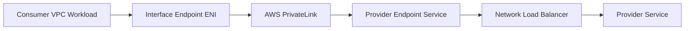
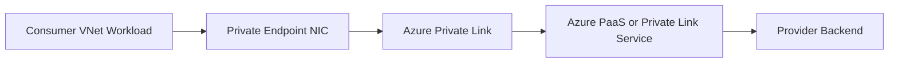
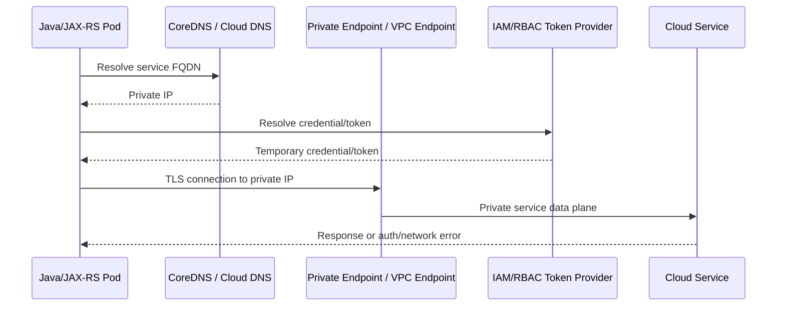
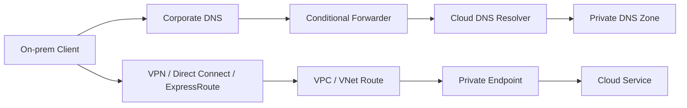

# Part 012 — Private Connectivity and Private Endpoint

> Fokus part ini adalah memahami private connectivity sebagai production boundary: bagaimana workload di VPC/VNet, EKS/AKS, atau on-prem mengakses cloud services, database, registry, API, object storage, dan managed services tanpa melewati public internet. Targetnya bukan sekadar tahu nama AWS PrivateLink atau Azure Private Endpoint, tetapi mampu membuktikan apakah traffic benar-benar private, men-debug DNS/routing/security failure, dan mereview PR yang menyentuh private access.

Private connectivity sering menjadi area yang terlihat “platform-only”, padahal efeknya langsung terasa ke Java/JAX-RS service:

- SDK call timeout;
- `AccessDenied` yang sebenarnya salah endpoint/identity;
- DNS resolve ke public IP padahal harus private;
- pod tidak bisa pull image dari registry;
- service bisa akses object storage dari dev tetapi gagal di prod;
- on-prem client tidak bisa akses private API;
- NAT Gateway cost membengkak karena traffic tidak lewat private endpoint;
- security review menolak public exposure;
- failover gagal karena private DNS tidak ikut berubah.

Senior backend engineer tidak harus menjadi network engineer, tetapi harus bisa membaca private connectivity path sampai cukup untuk membedakan: DNS issue, route issue, firewall issue, identity issue, endpoint issue, atau application issue.

---

## 1. Core mental model

Private connectivity berarti caller mengakses service melalui private network path, bukan public internet path.

Namun “private” tidak berarti hanya satu hal. Ada beberapa dimensi:

```text
Private IP
  -> target punya alamat private di VPC/VNet

Private DNS
  -> FQDN service resolve ke private IP dari network tertentu

Private route
  -> route table/UDR mengirim traffic lewat private network path

Private security boundary
  -> SG/NSG/firewall hanya mengizinkan source tertentu

Private identity boundary
  -> caller tetap harus punya IAM/RBAC/credential yang benar

Private service exposure
  -> service tidak perlu public IP atau public endpoint terbuka
```

Private connectivity bukan pengganti identity. Private endpoint hanya membuat path jaringan lebih aman; authorization tetap diperlukan.

```text
Private network reachability != permission to use the service
```

Aplikasi bisa berhasil connect secara network tetapi tetap gagal karena IAM/RBAC. Sebaliknya aplikasi bisa punya IAM/RBAC benar tetapi timeout karena DNS/routing/private endpoint salah.

---

## 2. Why private endpoint exists

Tanpa private endpoint, private workload sering mengakses cloud service seperti object storage, secret manager, registry, atau API cloud melalui public service endpoint.

Contoh buruk untuk workload private:

```text
Pod in private subnet
  -> NAT Gateway
  -> public AWS/Azure service endpoint
  -> cloud service
```

Ini mungkin tetap aman secara TLS dan IAM/RBAC, tetapi punya masalah:

- melewati public endpoint;
- bergantung pada NAT gateway;
- menambah egress/NAT cost;
- sulit menerapkan allowlist granular;
- tidak cocok untuk environment yang melarang public service access;
- memperbesar blast radius jika NAT/firewall bermasalah;
- menyulitkan compliance evidence bahwa akses private-only.

Dengan private endpoint:

```text
Pod in private subnet
  -> private DNS resolves service FQDN to private IP
  -> route inside VPC/VNet
  -> endpoint network interface / endpoint service
  -> cloud service
```

Keuntungan:

- traffic tetap di private network path cloud provider;
- workload tidak butuh public IP;
- NAT dependency berkurang;
- security boundary lebih jelas;
- service exposure bisa dibatasi dari selected VPC/VNet/subnet;
- audit dan compliance evidence lebih kuat;
- egress control lebih mudah.

Trade-off:

- DNS menjadi lebih kompleks;
- endpoint per service/per region/per network bisa banyak;
- ada biaya private endpoint/interface endpoint;
- route dan security rule harus benar;
- on-prem/hybrid DNS harus dirancang;
- troubleshooting lebih sulit karena hostname sama bisa resolve berbeda tergantung network.

---

## 3. Private endpoint vs public endpoint vs NAT

| Pattern | Path | Kelebihan | Risiko |
|---|---|---|---|
| Public endpoint from public client | Internet -> public service endpoint | sederhana untuk public API | exposure, WAF/security perlu kuat |
| Private subnet via NAT to public service | private workload -> NAT -> public service endpoint | mudah, tidak perlu endpoint per service | NAT cost, public endpoint dependency, compliance concern |
| Private endpoint / PrivateLink | private workload -> private IP endpoint -> service | private path, tighter control | DNS/routing/config lebih kompleks |
| On-prem via VPN/ExpressRoute to private endpoint | on-prem -> hybrid link -> private endpoint | private hybrid access | DNS forwarding, routing, firewall, MTU complexity |

Rule praktis:

- Gunakan public endpoint untuk public API yang memang harus diakses internet dan dilindungi gateway/WAF.
- Gunakan NAT untuk generic outbound internet yang memang tidak tersedia private endpoint, dengan kontrol firewall/proxy.
- Gunakan private endpoint untuk cloud service/data plane penting: database, object storage, registry, secret manager, config service, internal API, dan managed service yang harus private-only.

---

## 4. AWS private connectivity model

Di AWS, konsep penting:

- VPC Endpoint;
- Gateway Endpoint;
- Interface Endpoint;
- AWS PrivateLink;
- Endpoint Service;
- Private DNS for endpoint;
- Route 53 private hosted zone;
- Security Group;
- endpoint policy;
- route table.

### 4.1 Gateway Endpoint

Gateway Endpoint digunakan untuk service tertentu seperti S3 dan DynamoDB.

Mental model:

```text
Private subnet route table
  -> route for AWS service prefix list
  -> Gateway Endpoint
  -> AWS service
```

Karakteristik:

- tidak memakai endpoint network interface di subnet;
- dikaitkan ke route table;
- biasanya tidak butuh security group endpoint;
- endpoint policy bisa membatasi akses;
- cocok untuk private access ke S3/DynamoDB dari VPC.

### 4.2 Interface Endpoint

Interface Endpoint memakai Elastic Network Interface dengan private IP di subnet.

Mental model:

```text
Pod/EC2 in VPC
  -> DNS resolves service hostname to private IP
  -> Interface Endpoint ENI
  -> AWS PrivateLink
  -> AWS service / endpoint service
```

Karakteristik:

- punya private IP di subnet;
- punya security group;
- private DNS bisa diaktifkan untuk mengganti resolusi hostname service standar;
- dikenakan biaya per endpoint dan data processing;
- banyak digunakan untuk AWS services seperti Secrets Manager, STS, ECR API, ECR Docker, CloudWatch Logs, SSM, dan service lain.

### 4.3 AWS PrivateLink

AWS PrivateLink adalah teknologi untuk mengakses service secara private seolah-olah service itu berada di VPC caller. Consumer membuat interface endpoint; provider mengekspos endpoint service, umumnya di belakang NLB.



PrivateLink berguna untuk:

- SaaS/private service exposure;
- cross-account service sharing;
- central service access;
- private API antar VPC/account;
- menghindari peering penuh jika hanya butuh expose service tertentu.

### 4.4 AWS private DNS

Interface endpoint bisa mengaktifkan private DNS. Jika aktif, hostname AWS service standar dapat resolve ke private IP endpoint dari dalam VPC.

Contoh mental model:

```text
secretsmanager.<region>.amazonaws.com
  -> from internet/public resolver: public IP/service endpoint
  -> from VPC with private DNS endpoint: private endpoint IP
```

Ini kuat tetapi berbahaya jika tidak dipahami. Hostname sama bisa resolve berbeda tergantung lokasi caller.

---

## 5. Azure private connectivity model

Di Azure, konsep penting:

- Azure Private Endpoint;
- Azure Private Link;
- Private Link Service;
- Private DNS Zone;
- DNS zone group;
- Private Endpoint NIC;
- VNet/subnet;
- NSG;
- UDR;
- Azure Firewall;
- Service Endpoint awareness.

### 5.1 Azure Private Endpoint

Azure Private Endpoint membuat network interface dengan private IP di VNet Anda untuk mengakses Azure PaaS service atau Private Link Service.

Mental model:

```text
Workload in VNet
  -> DNS resolves service FQDN to private endpoint IP
  -> Private Endpoint NIC
  -> Azure Private Link
  -> Azure PaaS service
```

Contoh target:

- Azure Storage;
- Azure SQL;
- Azure Database for PostgreSQL;
- Azure Key Vault;
- Azure Container Registry;
- Azure App Configuration;
- Azure Monitor ingestion/query endpoints in some architectures;
- partner/customer-owned Private Link Service.

### 5.2 Azure Private Link

Private Link adalah platform capability yang memungkinkan private access ke service. Private Endpoint adalah interface di consumer VNet. Private Link Service adalah cara expose service provider melalui Standard Load Balancer.



### 5.3 Private DNS Zone

Private Endpoint membutuhkan DNS yang benar. Azure sering menggunakan zone seperti:

```text
privatelink.<service-domain>
```

FQDN public service biasanya diarahkan sehingga dari VNet tertentu resolve ke private endpoint IP.

Kesalahan paling umum di Azure Private Endpoint adalah endpoint sudah dibuat tetapi Private DNS Zone belum linked ke VNet yang dipakai caller.

### 5.4 Service Endpoint awareness

Azure juga punya Service Endpoint. Ini berbeda dari Private Endpoint.

| Concept | Model |
|---|---|
| Service Endpoint | memperluas identity VNet/subnet ke Azure service public endpoint tertentu |
| Private Endpoint | menghadirkan private IP endpoint untuk service di VNet Anda |

Untuk system baru yang membutuhkan private-only access, Private Endpoint sering lebih sesuai, tetapi keputusan final harus mengikuti platform/security standard internal.

---

## 6. DNS is the control point

Private endpoint hampir selalu bergantung pada DNS.

Yang sering salah dipahami:

```text
Private endpoint exists, therefore app uses private endpoint.
```

Belum tentu. App hanya menggunakannya jika hostname yang dipakai resolve ke private IP endpoint dan routing/security mengizinkan.

### 6.1 DNS behavior

Satu hostname bisa resolve berbeda:

```text
From public internet:
  service.example.cloud -> public IP

From VPC/VNet with private DNS:
  service.example.cloud -> private endpoint IP

From on-prem without DNS forwarding:
  service.example.cloud -> public IP or NXDOMAIN
```

### 6.2 DNS verification

Selalu cek dari lokasi caller:

```bash
# dari pod
kubectl run dns-debug --rm -it --image=busybox:1.36 -- nslookup <service-fqdn>

# dari node/debug VM/bastion
nslookup <service-fqdn>
dig <service-fqdn>
```

Expected output harus private IP jika private endpoint dipakai.

### 6.3 DNS failure mode

| Symptom | Kemungkinan penyebab |
|---|---|
| resolve ke public IP | private DNS disabled/not linked/wrong resolver |
| resolve ke private IP tapi timeout | route/SG/NSG/firewall issue |
| on-prem resolve public IP | conditional forwarding belum diset |
| pod resolve berbeda dari VM | CoreDNS forwarding/config berbeda |
| NXDOMAIN | zone tidak ada, record tidak dibuat, resolver salah |
| intermittent | stale cache, multi-zone conflict, TTL, multiple resolvers |

---

## 7. Routing and firewall model

Setelah DNS resolve ke private IP, traffic harus bisa mencapai endpoint.

### 7.1 AWS route/security

Untuk AWS Interface Endpoint:

```text
Pod/EC2 subnet
  -> VPC local route
  -> endpoint ENI private IP
  -> endpoint security group inbound allows source
```

Yang harus dicek:

- endpoint ENI subnet;
- source subnet;
- security group endpoint;
- security group source workload;
- NACL jika digunakan;
- route table;
- VPC DNS resolution/hostnames;
- endpoint policy;
- service-specific resource policy.

Untuk Gateway Endpoint:

- route table harus punya route ke prefix list melalui endpoint;
- subnet route table yang dipakai workload harus terasosiasi;
- bucket/resource policy bisa membatasi `aws:sourceVpce`;
- endpoint policy bisa membatasi action/resource.

### 7.2 Azure route/security

Untuk Azure Private Endpoint:

```text
Pod/VM subnet
  -> VNet route to private endpoint IP
  -> Private Endpoint NIC
  -> Azure Private Link
  -> service
```

Yang harus dicek:

- Private Endpoint subnet;
- caller subnet;
- VNet peering jika cross-VNet;
- NSG rules;
- UDR;
- Azure Firewall route;
- Private DNS Zone link;
- Private Endpoint connection status;
- service firewall/private access config.

### 7.3 Hybrid route

Untuk on-prem:

```text
On-prem client
  -> corporate DNS resolves FQDN to private IP
  -> VPN/Direct Connect/ExpressRoute route
  -> cloud VPC/VNet
  -> private endpoint IP
```

Yang harus dicek:

- route advertisement;
- CIDR overlap;
- firewall allowlist;
- DNS conditional forwarding;
- return path;
- MTU;
- TLS trust;
- proxy bypass.

---

## 8. Identity still matters

Private endpoint tidak memberi permission.

Contoh AWS:

```text
Network path to Secrets Manager endpoint works
  but AWS SDK still gets AccessDenied
```

Penyebab bisa:

- IAM role tidak punya `secretsmanager:GetSecretValue`;
- resource policy menolak principal;
- endpoint policy membatasi resource;
- wrong region;
- wrong secret ARN;
- IRSA tidak bekerja;
- STS endpoint tidak reachable untuk credential refresh.

Contoh Azure:

```text
Network path to Key Vault private endpoint works
  but Azure SDK still gets 403 Forbidden
```

Penyebab bisa:

- managed identity belum punya role/access policy;
- salah scope;
- wrong tenant;
- wrong client ID;
- Key Vault firewall/private access config;
- Azure Workload Identity federation salah;
- token audience salah.

Debug harus memisahkan:

```text
DNS -> route -> TCP/TLS -> authentication -> authorization -> service operation
```

Jangan campur semua sebagai “private endpoint problem”.

---

## 9. Pod-to-private-service call

Pattern penting untuk EKS/AKS:



Hal yang sering terlupakan:

- credential/token resolution juga bisa butuh endpoint sendiri;
- AWS SDK mungkin perlu STS endpoint jika AssumeRole/IRSA;
- ECR image pull butuh beberapa endpoint di private EKS architecture;
- Azure SDK DefaultAzureCredential bisa mencoba beberapa credential source sebelum managed identity/workload identity;
- DNS resolution dilakukan sebelum IAM/RBAC;
- TCP timeout biasanya network/routing/firewall;
- 403 biasanya identity/authorization/service policy;
- TLS error bisa truststore, proxy, SNI, or certificate chain.

---

## 10. Private API pattern

Private API berarti API hanya bisa diakses dari private network boundary.

Pattern umum:

### 10.1 AWS

```text
Client in VPC/on-prem
  -> private DNS
  -> VPC endpoint / private API / internal ALB/NLB
  -> EKS/Java service
```

Bisa melibatkan:

- API Gateway private REST API;
- VPC endpoint;
- internal ALB/NLB;
- PrivateLink endpoint service;
- Route 53 private hosted zone.

### 10.2 Azure

```text
Client in VNet/on-prem
  -> private DNS
  -> APIM private access / private endpoint / internal Application Gateway
  -> AKS/Java service
```

Bisa melibatkan:

- Azure API Management internal/private endpoint setup;
- Application Gateway private frontend;
- Azure Load Balancer internal frontend;
- Private Link Service;
- Private DNS Zone.

### 10.3 Review questions

- Siapa caller yang diizinkan?
- Dari network mana saja API bisa diakses?
- Apakah DNS public masih resolve?
- Apakah public endpoint disabled atau hanya tidak didokumentasikan?
- Apakah gateway auth tetap aktif?
- Apakah WAF masih relevan untuk private API?
- Apakah on-prem DNS/routing siap?
- Apakah access log tetap lengkap?
- Apakah certificate trusted oleh caller private?

---

## 11. Private registry pattern

Container registry private access penting karena registry outage atau auth failure dapat menghentikan rollout.

### 11.1 AWS ECR private access

Private EKS/ECS/EC2 environment biasanya perlu memperhatikan endpoint untuk:

- ECR API;
- ECR Docker registry;
- S3 access for image layers in some flows;
- CloudWatch Logs if private logging path is required;
- STS if using role assumption;
- DNS resolution.

Failure yang umum:

- `ImagePullBackOff`;
- `ErrImagePull`;
- token auth gagal;
- ECR endpoint tidak reachable;
- S3 layer download path tidak ada;
- security group endpoint tidak allow node/pod;
- private DNS disabled.

### 11.2 Azure ACR private access

AKS dengan ACR private endpoint perlu memastikan:

- AKS identity punya permission pull;
- ACR private endpoint dibuat;
- Private DNS Zone linked ke VNet AKS;
- public network access sesuai policy;
- route/NSG/firewall mengizinkan;
- kubelet/node identity benar.

Failure yang umum:

- `ImagePullBackOff`;
- ACR resolves public IP dari node;
- managed identity tidak punya `AcrPull`;
- private DNS zone tidak linked;
- firewall block;
- image tag tidak ada.

---

## 12. Private database pattern

Database production seharusnya tidak diekspos sembarangan ke public network.

### 12.1 Managed PostgreSQL

AWS:

```text
EKS pod
  -> DNS
  -> RDS/Aurora private endpoint in subnet
  -> SG allows pod/node SG
  -> PostgreSQL TLS/auth
```

Azure:

```text
AKS pod
  -> Private DNS Zone
  -> Azure PostgreSQL Flexible Server private access / private endpoint pattern
  -> NSG/route/firewall
  -> PostgreSQL TLS/auth
```

Concern:

- DNS endpoint;
- subnet placement;
- SG/NSG;
- TLS;
- certificate trust;
- connection pool;
- failover DNS behavior;
- read replica endpoint;
- maintenance window;
- max connections;
- private access from migration/batch jobs.

### 12.2 Debug database private access

```bash
# DNS
nslookup <db-hostname>

# TCP reachability from debug pod if tools available
nc -vz <db-hostname> 5432

# TLS/cert inspection if allowed
openssl s_client -connect <db-hostname>:5432 -starttls postgres
```

Jangan menjalankan query destruktif untuk connectivity test. Gunakan user read-only atau health-check-safe operation.

---

## 13. Private object storage pattern

Object storage sering digunakan untuk document, export/import, attachment, archive, dan integration payload.

### 13.1 AWS S3

Private access bisa melalui Gateway Endpoint atau Interface Endpoint, tergantung kebutuhan dan service architecture.

Concern:

- endpoint route table association;
- bucket policy dengan `aws:sourceVpce` jika digunakan;
- IAM role;
- presigned URL behavior;
- SDK region;
- multipart upload;
- lifecycle;
- encryption;
- object metadata;
- access logs.

Important nuance: presigned URL biasanya diakses oleh client. Jika client berada di internet, presigned URL ke private-only endpoint tidak akan bisa diakses kecuali client punya private network path. Jadi strategi direct download/upload harus mempertimbangkan lokasi client.

### 13.2 Azure Blob Storage

Private access via Private Endpoint dan Private DNS Zone.

Concern:

- blob endpoint DNS;
- private endpoint subresource;
- storage firewall;
- managed identity/RBAC/SAS;
- SAS token audience/path;
- upload/download location;
- lifecycle tier;
- encryption;
- diagnostic logs.

SAS URL yang menunjuk storage account private endpoint hanya usable oleh client yang bisa resolve dan route ke private IP tersebut. Untuk external users, perlu pattern berbeda: controlled proxy API, public endpoint dengan strict SAS, atau brokered download architecture sesuai policy internal.

---

## 14. Private secret and config pattern

Secret/config service private access penting karena aplikasi sering butuh secret/config saat startup.

### 14.1 Startup dependency risk

Jika semua pod mengambil secret/config saat startup dan endpoint private bermasalah:

```text
Deployment rollout
  -> new pods start
  -> cannot reach secret/config service
  -> pods crash/not ready
  -> rollout stuck
  -> old pods may be drained
  -> outage
```

Mitigasi:

- startup backoff;
- cache secret/config jika aman;
- avoid draining all old pods before new pods ready;
- PDB;
- staged rollout;
- alert on secret/config latency;
- external secret sync observability;
- documented fallback for non-secret config.

### 14.2 AWS

Common private endpoint candidates:

- Secrets Manager;
- SSM Parameter Store;
- AppConfig if used;
- KMS;
- STS;
- CloudWatch Logs.

### 14.3 Azure

Common private endpoint candidates:

- Key Vault;
- Azure App Configuration;
- Azure Storage if config artifacts are stored there;
- ACR;
- Azure Monitor ingestion if architecture requires private link.

---

## 15. Private endpoint and cloud SDK behavior

Cloud SDK biasanya memakai hostname service standar. Private endpoint bekerja jika DNS mengganti resolusi hostname tersebut ke private IP.

### 15.1 AWS SDK for Java

Hal yang perlu dicek:

- region provider;
- endpoint override;
- credential provider chain;
- STS endpoint reachability;
- DNS private endpoint;
- HTTP client timeout;
- proxy settings;
- retry policy;
- TLS truststore;
- service-specific endpoint policy.

Misconfiguration umum:

- region salah sehingga SDK memanggil endpoint region lain;
- endpoint override ke public/custom endpoint lama;
- private DNS disabled;
- STS tidak reachable sehingga credential refresh gagal;
- retry memperparah timeout endpoint.

### 15.2 Azure SDK for Java

Hal yang perlu dicek:

- endpoint URL;
- DefaultAzureCredential resolution;
- managed identity/workload identity;
- private DNS zone;
- authority host/tenant;
- HTTP pipeline timeout;
- proxy settings;
- retry policy;
- TLS truststore;
- RBAC scope.

Misconfiguration umum:

- SDK memakai public endpoint karena DNS tidak linked;
- wrong managed identity client ID;
- role assignment belum propagate;
- Key Vault/Storage firewall menolak;
- private endpoint subresource salah;
- retry terlalu agresif.

---

## 16. On-prem-to-private-endpoint call

Hybrid private access lebih sulit karena DNS dan routing melibatkan dua dunia.



Checklist penting:

- Apakah on-prem resolver tahu zone private?
- Apakah forwarding menuju resolver cloud yang benar?
- Apakah route ke private endpoint IP advertised ke on-prem?
- Apakah firewall allow source CIDR on-prem?
- Apakah return path simetris?
- Apakah certificate hostname tetap cocok?
- Apakah proxy harus dilewati dengan `NO_PROXY`?
- Apakah client trust internal CA/public CA yang dipakai endpoint?
- Apakah latency sesuai timeout aplikasi?

Failure hybrid sering disalahartikan sebagai cloud service outage. Padahal akar masalahnya bisa di corporate DNS, firewall, route advertisement, atau proxy.

---

## 17. Private endpoint failure modes

| Symptom | Likely layer | Example cause |
|---|---|---|
| `NXDOMAIN` | DNS | private zone missing/not linked |
| public IP returned | DNS | private DNS disabled, wrong resolver |
| private IP returned but timeout | Network | SG/NSG/firewall/route issue |
| connection refused | Endpoint/backend | wrong port, service unavailable |
| TLS hostname mismatch | TLS | wrong endpoint/Host/SNI |
| 401 | Authentication | token missing/invalid |
| 403 / AccessDenied | Authorization | IAM/RBAC/policy/scope issue |
| SDK credential error | Identity endpoint | STS/IMDS/workload identity issue |
| works from VM but not pod | Kubernetes DNS/network | CoreDNS, NetworkPolicy, pod subnet |
| works from cloud but not on-prem | Hybrid | DNS forwarding, route, firewall |
| image pull fails | Registry private path | auth, private DNS, endpoint, identity |
| startup fails | Secret/config path | endpoint unavailable, identity, retry/backoff |

---

## 18. Troubleshooting playbook

### 18.1 Step 1 — identify caller and target

```text
Caller: pod, node, VM, on-prem client, gateway, CI/CD runner, batch job?
Target: S3/Blob, Secrets/Key Vault, registry, database, API, config, broker?
Cloud: AWS, Azure, cross-cloud, hybrid?
```

### 18.2 Step 2 — verify DNS from caller location

```bash
nslookup <target-fqdn>
dig <target-fqdn>
```

Expected:

- private IP for private endpoint path;
- correct region/service domain;
- no unexpected CNAME to public-only endpoint.

### 18.3 Step 3 — verify route and security

AWS:

- VPC route table;
- endpoint subnet;
- security group endpoint inbound;
- NACL;
- endpoint policy;
- VPC Flow Logs.

Azure:

- VNet/subnet;
- Private Endpoint connection status;
- NSG;
- UDR;
- Azure Firewall;
- Network Watcher;
- effective routes/effective security rules.

### 18.4 Step 4 — verify TCP/TLS

```bash
nc -vz <target-fqdn> <port>
openssl s_client -connect <target-fqdn>:<port> -servername <target-fqdn>
```

Gunakan hanya jika image/tooling tersedia dan sesuai policy internal.

### 18.5 Step 5 — verify identity

AWS:

```bash
aws sts get-caller-identity
```

Azure:

```bash
az account show
```

Untuk pod, tool CLI mungkin tidak tersedia. Alternatifnya log identity metadata secara aman saat startup atau gunakan SDK diagnostic dengan redaction.

### 18.6 Step 6 — verify authorization/resource policy

AWS:

- IAM policy;
- trust policy;
- resource policy;
- endpoint policy;
- KMS key policy;
- bucket policy condition seperti `aws:sourceVpce`.

Azure:

- role assignment;
- scope;
- Key Vault access model;
- storage firewall;
- private endpoint connection approval;
- tenant/subscription mismatch.

### 18.7 Step 7 — verify SDK behavior

- region;
- endpoint URL;
- credential provider chain;
- proxy;
- timeout;
- retry;
- TLS trust;
- SDK version;
- error classification.

### 18.8 Step 8 — verify observability

- endpoint metrics;
- cloud service metrics;
- flow logs;
- app logs;
- SDK logs;
- DNS query logs if available;
- gateway/load balancer logs;
- audit logs.

---

## 19. Security considerations

Private endpoint memperkecil exposure, tetapi bukan security silver bullet.

Tetap perlu:

- least privilege IAM/RBAC;
- resource policy;
- endpoint policy jika tersedia;
- encryption in transit;
- encryption at rest;
- secret rotation;
- audit log;
- no public fallback unless approved;
- deny public network access jika requirement private-only;
- data exfiltration control;
- private DNS governance;
- network segmentation;
- CI/CD credential control.

### 19.1 Public fallback risk

Risiko serius:

```text
Private endpoint exists but service still allows public access.
```

Jika DNS/route private gagal, beberapa caller mungkin tetap bisa keluar via NAT ke public endpoint. Ini membuat failure tersembunyi dan melanggar policy private-only.

Review harus memastikan:

- public network access disabled jika required;
- resource policy membatasi source VPC/VNet/private endpoint;
- logs bisa membedakan public vs private access;
- NAT path tidak menjadi silent fallback untuk sensitive service.

---

## 20. Cost considerations

Private endpoint bukan gratis.

Cost driver:

- interface endpoint hourly charge;
- data processing charge;
- per-zone/per-subnet endpoint count;
- Private DNS operations jika signifikan;
- cross-AZ traffic;
- cross-region private connectivity;
- duplicated endpoints per environment;
- logs/flow logs;
- NAT Gateway cost jika private endpoint tidak digunakan.

Trade-off penting:

```text
NAT cost + public endpoint exposure + compliance concern
vs
Private endpoint cost + DNS/routing complexity + endpoint sprawl
```

Untuk high-volume traffic seperti object storage atau logs, cost path harus dihitung, bukan diasumsikan.

---

## 21. Performance considerations

Private endpoint biasanya mengurangi exposure, bukan otomatis mengurangi latency.

Perhatikan:

- endpoint region;
- AZ placement;
- cross-AZ path;
- DNS resolution latency;
- proxy/firewall insertion;
- TLS handshake;
- SDK connection pooling;
- retry behavior;
- managed service throttling;
- private endpoint throughput limit jika ada;
- hybrid link latency.

Performance test harus dilakukan dari lokasi caller production, bukan dari laptop.

---

## 22. Correctness concerns

Private connectivity dapat memengaruhi correctness.

### 22.1 Presigned URL / SAS correctness

Jika backend membuat presigned URL/SAS untuk client, pastikan client punya network path ke endpoint yang URL resolve.

Pattern:

```text
External browser user + private-only Blob/S3 endpoint = download fails
```

Solusi tergantung policy:

- backend proxy download;
- temporary public access with strict signed URL;
- private client network requirement;
- separate internal/external download flow;
- document access broker service.

### 22.2 Region and endpoint correctness

Jika SDK region/endpoint salah, operation bisa:

- gagal;
- lebih lambat;
- kena cross-region cost;
- membaca resource environment lain;
- menulis ke bucket/container salah;
- melanggar data residency.

### 22.3 Failover correctness

Private DNS harus ikut dalam failover plan. Jika database/storage/API failover ke region lain tetapi private DNS masih menunjuk endpoint lama, aplikasi tetap gagal.

---

## 23. Observability requirements

Private connectivity perlu telemetry di beberapa layer.

AWS:

- VPC Flow Logs;
- CloudTrail;
- service-specific logs;
- endpoint metrics if available;
- Route 53 Resolver query logs jika digunakan;
- CloudWatch metrics/logs;
- application SDK metrics.

Azure:

- Network Watcher;
- NSG flow logs jika tersedia/diaktifkan;
- Azure Activity Log;
- Private Endpoint connection state;
- Azure Monitor metrics;
- Private DNS query visibility sesuai setup;
- Log Analytics;
- application diagnostics.

App-level:

- dependency latency;
- timeout count;
- DNS/connection error class;
- SDK status/error code;
- retry count;
- credential refresh error;
- endpoint/region config at startup, tanpa membocorkan secret.

---

## 24. Internal verification checklist

### General

- Service apa saja yang harus diakses private-only?
- Apakah public network access disabled untuk service sensitif?
- Apakah private endpoint dibuat per environment?
- Apakah private endpoint dibuat per region?
- Siapa owner private DNS?
- Siapa owner route/firewall/SG/NSG?
- Apakah ada standard naming/tagging private endpoint?

### AWS

- VPC Endpoint apa saja yang tersedia?
- Gateway Endpoint untuk S3/DynamoDB ada atau tidak?
- Interface Endpoint untuk STS, ECR, Secrets Manager, SSM, CloudWatch, KMS, dan service lain yang diperlukan ada atau tidak?
- Private DNS enabled?
- Endpoint security group inbound dari source benar?
- Endpoint policy membatasi resource/action?
- Route table terkait Gateway Endpoint benar?
- Bucket/resource policy memakai `aws:sourceVpce` jika required?
- Route 53 private hosted zone/resolver rule benar?
- VPC Flow Logs aktif?

### Azure

- Private Endpoint apa saja yang tersedia?
- Private Endpoint connection approved?
- Private DNS Zone linked ke VNet yang benar?
- DNS zone group dibuat?
- NSG/UDR/firewall path benar?
- Public network access disabled jika required?
- Role assignment/RBAC untuk managed identity benar?
- Private endpoint subresource benar?
- Network Watcher/effective routes/effective security rules bisa diakses?
- Azure Monitor diagnostic logs aktif?

### Kubernetes/EKS/AKS

- Pod resolve FQDN ke private IP?
- CoreDNS forwarding benar?
- NetworkPolicy mengizinkan egress?
- ServiceAccount/workload identity benar?
- SDK region/endpoint benar?
- Image pull registry private path berfungsi?
- Secret/config retrieval saat startup resilient?
- Debug pod tersedia sesuai policy?

### Hybrid/on-prem

- Conditional DNS forwarding ke cloud resolver tersedia?
- Route ke private endpoint IP advertised?
- Firewall allowlist benar?
- Return path simetris?
- Proxy/NO_PROXY benar?
- Internal CA/truststore tersedia?
- MTU dan latency diketahui?
- On-prem monitoring melihat failure path?

---

## 25. PR review checklist

Saat mereview perubahan yang menyentuh private connectivity, tanyakan:

1. Service apa yang dibuat private?
2. Caller mana yang harus bisa mengakses?
3. Hostname apa yang digunakan aplikasi?
4. Dari network caller, hostname resolve ke IP apa?
5. Apakah IP tersebut private endpoint IP?
6. Apakah route table/UDR mendukung path tersebut?
7. Apakah SG/NSG/firewall mengizinkan source?
8. Apakah public endpoint masih terbuka?
9. Apakah IAM/RBAC/resource policy sudah least privilege?
10. Apakah endpoint policy/resource policy membatasi source private endpoint jika diperlukan?
11. Apakah SDK region/endpoint override berubah?
12. Apakah workload identity/managed identity/IRSA terpengaruh?
13. Apakah secret/config startup dependency aman?
14. Apakah image pull path tetap berfungsi?
15. Apakah on-prem DNS/routing/firewall terpengaruh?
16. Apakah observability tersedia untuk DNS/network/auth failure?
17. Apakah ada cost baru dari endpoint/data processing?
18. Apakah DR/failover private DNS ikut diperbarui?
19. Apakah rollback bisa dilakukan tanpa membuka public access sembarangan?
20. Apakah platform/security/network team sudah mereview?

---

## 26. Summary

Private connectivity adalah kombinasi DNS, routing, security rule, endpoint service, identity, SDK behavior, observability, dan policy. Private endpoint hanya satu komponen dalam chain tersebut.

Mental model yang harus melekat:

```text
Private access works only when all of these are true:
  correct hostname
  + private DNS resolution
  + private route
  + allowed SG/NSG/firewall
  + healthy private endpoint
  + valid TLS
  + valid identity
  + valid authorization
  + correct SDK region/endpoint
  + observable failure signals
```

Untuk senior backend engineer, kemampuan penting adalah membuktikan path, bukan mengasumsikan path.

Jangan berkata:

```text
"Sudah pakai private endpoint."
```

Katakan:

```text
"Dari pod namespace X, FQDN Y resolve ke private IP Z, route tetap di VNet/VPC, SG/NSG mengizinkan source, public access disabled, SDK memakai region yang benar, workload identity punya permission minimal, dan log/metric tersedia untuk failure."
```

Itulah level reasoning yang dibutuhkan untuk production-grade enterprise Java/JAX-RS systems.

---

## Reference anchors

Gunakan referensi resmi berikut saat butuh detail konfigurasi vendor:

- AWS PrivateLink overview: `https://docs.aws.amazon.com/vpc/latest/privatelink/what-is-privatelink.html`
- AWS Interface VPC endpoints: `https://docs.aws.amazon.com/vpc/latest/privatelink/interface-endpoints.html`
- AWS Gateway VPC endpoints: `https://docs.aws.amazon.com/vpc/latest/privatelink/gateway-endpoints.html`
- AWS VPC endpoint policies: `https://docs.aws.amazon.com/vpc/latest/privatelink/vpc-endpoints-access.html`
- AWS manage DNS names for endpoint services: `https://docs.aws.amazon.com/vpc/latest/privatelink/manage-dns-names.html`
- AWS Route 53 private hosted zones: `https://docs.aws.amazon.com/Route53/latest/DeveloperGuide/hosted-zones-private.html`
- Azure Private Link documentation: `https://learn.microsoft.com/en-us/azure/private-link/`
- Azure Private Endpoint overview: `https://learn.microsoft.com/en-us/azure/private-link/private-endpoint-overview`
- Azure Private Endpoint DNS integration: `https://learn.microsoft.com/en-us/azure/private-link/private-endpoint-dns-integration`
- Azure Private Endpoint private DNS zone values: `https://learn.microsoft.com/en-us/azure/private-link/private-endpoint-dns`
- Azure Private Link Service: `https://learn.microsoft.com/en-us/azure/private-link/private-link-service-overview`
- Kubernetes DNS for Services and Pods: `https://kubernetes.io/docs/concepts/services-networking/dns-pod-service/`
