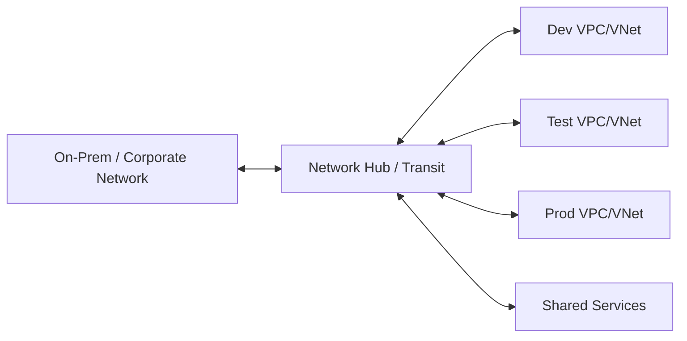
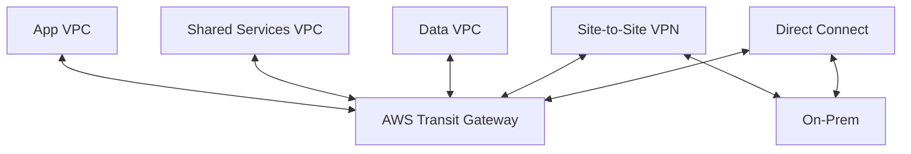
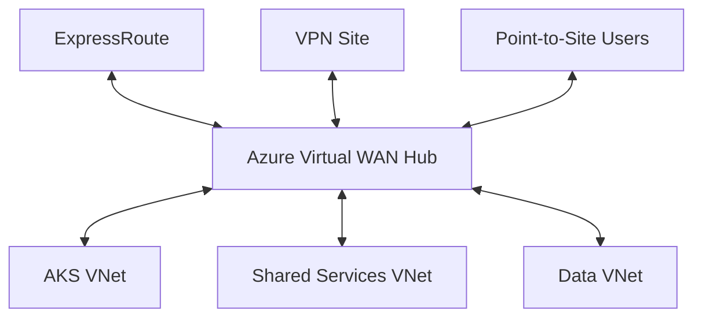

# Part 013 — Hybrid and On-Prem Connectivity

> Fokus part ini adalah memahami konektivitas antara cloud dan on-prem/corporate network sebagai sistem routing, DNS, security, latency, dan operational ownership. Untuk senior backend engineer, hybrid connectivity bukan sekadar “network team sudah buka jalur”; ia menentukan apakah Java/JAX-RS service bisa mengakses database, broker, API internal, identity provider, file store, observability endpoint, dan dependency legacy secara aman serta predictable.

Di enterprise system, terutama CPQ, quote management, order management, telco BSS/OSS, dan quote-to-cash, hybrid connectivity sering muncul karena:

- sebagian dependency masih berada di data center atau private corporate network;
- customer deployment dapat bersifat cloud, on-prem, atau hybrid;
- beberapa integration endpoint hanya tersedia melalui private network;
- data residency, compliance, atau contractual boundary membatasi public internet exposure;
- platform cloud memakai managed services, tetapi core enterprise integration masih melewati private routing;
- beberapa environment berbeda memiliki jalur connectivity berbeda antara dev, test, staging, production, dan customer-specific deployment.

Hal yang harus dihindari: menganggap hybrid connectivity sebagai detail infrastruktur di luar aplikasi. Dari sudut pandang backend, jalur hybrid memengaruhi timeout, retry, TLS trust, DNS resolution, egress policy, cost, failover, observability, dan incident escalation.

---

## 1. Core mental model

Hybrid connectivity adalah kombinasi dari lima chain:

```text
Addressing chain
  cloud CIDR -> subnet -> on-prem CIDR -> route advertisement -> overlap check

Routing chain
  workload subnet -> route table/UDR -> gateway/firewall/router -> remote network

Security chain
  security group/NSG -> firewall rule -> proxy policy -> TLS trust -> application auth

Name resolution chain
  pod/client resolver -> private DNS -> forwarding rule -> on-prem DNS -> answer

Operational chain
  backend team -> platform/SRE -> network team -> security team -> customer/on-prem team
```

Saat ada masalah hybrid, symptom di aplikasi biasanya terlihat seperti:

- `ConnectTimeoutException`;
- `UnknownHostException`;
- `SSLHandshakeException`;
- `Connection reset`;
- HTTP `502`, `503`, atau `504`;
- Kafka broker unreachable;
- RabbitMQ connection refused;
- PostgreSQL connection pool exhaustion;
- Redis timeout;
- cloud SDK timeout saat memakai endpoint private;
- intermittent latency spike;
- hanya gagal dari satu cluster/subnet/environment.

Jangan langsung menyimpulkan “dependency down”. Dalam hybrid path, dependency bisa sehat, tetapi route, DNS, firewall, proxy, MTU, certificate, atau asymmetric routing bermasalah.

---

## 2. Why hybrid connectivity exists

Hybrid connectivity ada karena enterprise jarang memindahkan semua sistem ke cloud dalam satu langkah. Biasanya ada campuran:

| Area | Contoh hybrid dependency |
|---|---|
| Legacy core system | CRM, billing, order orchestration, inventory, provisioning |
| Data | on-prem PostgreSQL/Oracle, file share, data warehouse, archive |
| Messaging | Kafka/RabbitMQ cluster internal, ESB, MQ gateway |
| Identity | corporate IdP, LDAP/AD, internal CA, token service |
| Security | firewall, proxy, SIEM, DLP, certificate authority |
| Customer integration | private customer endpoint, partner VPN, dedicated link |
| Operations | monitoring, logging, bastion, incident tooling |

Dalam konteks Java/JAX-RS backend, hybrid connectivity biasanya muncul pada:

```text
REST call to internal API
JDBC connection to private database
Kafka producer/consumer to remote broker
RabbitMQ AMQP connection to internal broker
Redis access through private IP
Camunda worker calling internal orchestration endpoint
Cloud SDK accessing private endpoint
File import/export through object storage or private file gateway
```

Karena itu, aplikasi harus diperlakukan sebagai participant dalam network topology, bukan hanya container yang berjalan di Kubernetes.

---

## 3. Connectivity patterns

### 3.1 Public internet integration

```text
Cloud workload -> NAT/firewall/proxy -> public internet -> remote public endpoint
```

Dipakai jika remote endpoint memang public dan security policy mengizinkan. Untuk enterprise production, ini sering dibatasi oleh allowlist, outbound firewall, proxy, TLS inspection, atau DLP.

Kelebihan:

- setup relatif sederhana;
- tidak membutuhkan dedicated private link;
- cocok untuk SaaS endpoint public.

Risiko:

- IP allowlist berubah jika NAT berubah;
- data keluar melalui public internet;
- latency lebih sulit diprediksi;
- observability network path terbatas;
- TLS inspection dapat merusak SDK atau mTLS;
- egress cost dan NAT cost bisa membesar.

### 3.2 Site-to-site VPN

```text
Cloud VPC/VNet -> VPN gateway -> IPsec tunnel -> on-prem/customer gateway -> private network
```

Dipakai untuk private connectivity yang relatif cepat disediakan, tetapi throughput dan latency bergantung pada internet path, gateway capacity, tunnel health, dan routing.

Kelebihan:

- private IP reachability;
- cocok untuk environment non-prod atau customer integration tertentu;
- lebih murah dan cepat dibanding dedicated circuit.

Risiko:

- internet underlay tetap ada;
- tunnel flap bisa menyebabkan intermittent failure;
- throughput terbatas;
- BGP/static route salah bisa memutus traffic;
- asymmetric routing mudah terjadi;
- monitoring tunnel harus jelas.

### 3.3 Dedicated private circuit

```text
Cloud provider edge -> dedicated/private circuit -> corporate/customer network
```

Di AWS biasanya memakai Direct Connect. Di Azure memakai ExpressRoute. Dedicated circuit cocok untuk production traffic dengan kebutuhan latency, bandwidth, reliability, atau compliance lebih tinggi.

Kelebihan:

- path lebih predictable;
- bandwidth lebih besar;
- tidak bergantung penuh pada public internet;
- cocok untuk traffic production besar dan sensitive.

Risiko:

- setup lebih lama;
- membutuhkan provider/carrier;
- routing dan failover lebih kompleks;
- biaya lebih tinggi;
- incident melibatkan lebih banyak pihak;
- tetap butuh desain redundancy.

### 3.4 Hub-and-spoke / transit network



Pattern ini dipakai agar konektivitas tidak dibuat point-to-point antara semua network. Hub menjadi titik kontrol routing, firewall, DNS forwarding, inspection, dan centralized egress.

Kelebihan:

- routing lebih terpusat;
- security inspection lebih konsisten;
- onboarding VPC/VNet baru lebih mudah;
- cocok untuk enterprise landing zone.

Risiko:

- hub menjadi critical dependency;
- salah route di hub bisa berdampak luas;
- firewall bottleneck;
- observability harus lintas account/subscription;
- ownership harus sangat jelas.

---

## 4. AWS implementation model

### 4.1 AWS Site-to-Site VPN

AWS Site-to-Site VPN menyediakan IPsec tunnel antara AWS dan remote network. Endpoint AWS bisa berupa Virtual Private Gateway atau Transit Gateway, tergantung arsitektur.

Mental model:

```text
VPC subnet route table
  -> route to on-prem CIDR
  -> target: VGW/TGW
  -> VPN attachment
  -> customer gateway
  -> on-prem router/firewall
```

Hal penting:

- route table subnet harus punya route menuju CIDR remote;
- Security Group tetap harus mengizinkan traffic;
- NACL jika dipakai harus cocok untuk ephemeral port;
- firewall on-prem harus mengizinkan source CIDR dari cloud;
- DNS belum otomatis bekerja hanya karena routing aktif;
- BGP memberi dynamic route advertisement, tetapi harus dipahami policy-nya;
- tunnel health harus dimonitor.

### 4.2 AWS Direct Connect

AWS Direct Connect menyediakan dedicated network connection ke AWS. Direct Connect biasanya dipakai untuk bandwidth lebih besar, latency lebih stabil, atau requirement private connectivity yang lebih ketat.

Konsep yang perlu diketahui:

| Konsep | Makna |
|---|---|
| Connection | physical/logical dedicated connectivity ke AWS edge location |
| Virtual Interface/VIF | logical interface untuk private/public/transit connectivity |
| Direct Connect Gateway | resource untuk menghubungkan Direct Connect ke VPC/TGW lintas region tertentu |
| Transit VIF | VIF untuk AWS Transit Gateway |
| Private VIF | VIF untuk VPC melalui virtual private gateway |
| BGP session | pertukaran route antara customer router dan AWS |

Untuk backend engineer, yang perlu diketahui bukan cara provisioning circuit, tetapi konsekuensi runtime:

- apakah traffic ke dependency on-prem melewati Direct Connect atau fallback VPN;
- apakah failover terjadi otomatis;
- apakah route lebih spesifik mengalahkan route lain;
- apakah latency baseline diketahui;
- apakah firewall/security inspection ada di path;
- apakah DNS resolution ke hostname on-prem diarahkan ke resolver yang benar.

### 4.3 AWS Transit Gateway

Transit Gateway adalah hub untuk menghubungkan banyak VPC, VPN, dan Direct Connect. Di enterprise, TGW sering menjadi pusat routing antar account/environment.



Review points:

- TGW route table association;
- TGW route table propagation;
- attachment per VPC/VPN/DX;
- blackhole route;
- asymmetric route;
- environment isolation;
- shared services access;
- inspection VPC path;
- blast radius jika route table salah.

### 4.4 AWS hybrid failure pattern

| Symptom | Kemungkinan root cause |
|---|---|
| Pod timeout ke on-prem API | missing route, SG deny, firewall deny, tunnel down |
| DNS resolve public IP, bukan private IP | resolver forwarding/private hosted zone salah |
| Hanya prod gagal, dev berhasil | route table/security boundary berbeda |
| Kafka intermittently disconnects | tunnel flap, MTU, firewall idle timeout, broker advertised listener salah |
| JDBC pool habis | latency spike, firewall drop, DB reachable tapi slow |
| TLS handshake failure | internal CA tidak trusted di JVM truststore |
| Response 504 dari gateway | downstream timeout lebih lama dari gateway timeout |

---

## 5. Azure implementation model

### 5.1 Azure VPN Gateway

Azure VPN Gateway menyediakan encrypted tunnel antara Azure VNet dan on-prem/customer network. Gateway berada di subnet khusus bernama `GatewaySubnet`.

Mental model:

```text
AKS/App subnet
  -> route table / system route / UDR
  -> virtual network gateway
  -> IPsec tunnel
  -> on-prem VPN device
  -> private network
```

Hal penting:

- gateway subnet tidak dipakai untuk workload biasa;
- UDR pada subnet aplikasi dapat mengubah path traffic;
- NSG dan firewall tetap berlaku di path;
- BGP dapat dipakai untuk dynamic route exchange;
- custom DNS resolver sering dibutuhkan untuk hybrid name resolution;
- SKU gateway memengaruhi throughput dan fitur;
- tunnel dan gateway harus dimonitor.

### 5.2 Azure ExpressRoute

ExpressRoute menyediakan private connectivity antara on-prem/corporate network dan Microsoft cloud. Ia sering dipakai untuk production enterprise workloads.

Konsep penting:

| Konsep | Makna |
|---|---|
| ExpressRoute circuit | logical private circuit melalui connectivity provider |
| Peering | routing domain untuk private/Microsoft connectivity |
| ExpressRoute gateway | virtual network gateway yang menghubungkan VNet ke circuit |
| GatewaySubnet | subnet khusus untuk gateway |
| BGP | route exchange antara on-prem dan Microsoft edge |
| FastPath | optimization path untuk bypass gateway pada beberapa skenario |

Untuk backend engineer, pertanyaan praktisnya:

- apakah VNet aplikasi terhubung ke ExpressRoute langsung atau via hub;
- apakah spoke VNet route dipropagate ke on-prem;
- apakah traffic private endpoint dari on-prem didukung;
- apakah DNS private endpoint dapat resolve dari on-prem;
- apakah firewall/router on-prem mengembalikan traffic ke next hop yang sama;
- apakah maintenance gateway dapat menyebabkan intermittent connectivity.

### 5.3 Azure Virtual WAN

Virtual WAN adalah managed hub untuk large-scale branch, VPN, ExpressRoute, dan VNet connectivity. Ia berguna saat enterprise memiliki banyak site, banyak VNet, dan routing policy terpusat.



Review points:

- hub route table;
- route propagation;
- routing preference;
- ExpressRoute/VPN coexistence;
- firewall/NVA insertion;
- connectivity to private endpoints;
- spoke VNet association;
- route summarization;
- operational ownership.

### 5.4 Azure hybrid failure pattern

| Symptom | Kemungkinan root cause |
|---|---|
| AKS pod tidak bisa call on-prem API | UDR salah, NSG deny, firewall deny, VPN/ER issue |
| Private endpoint tidak bisa diakses dari on-prem | DNS private zone tidak ter-forward, route/firewall salah |
| Connection intermittent saat maintenance | gateway/ExpressRoute path stateful behavior |
| Latency naik hanya dari satu VNet | route preference atau firewall insertion berbeda |
| TLS error ke internal API | internal CA belum masuk truststore Java |
| Wrong endpoint IP | Azure Private DNS Zone link salah atau DNS forwarding salah |
| Asymmetric routing | route balik on-prem tidak melalui jalur yang sama |

---

## 6. BGP awareness without becoming a network engineer

BGP adalah mekanisme pertukaran route antar network domain. Backend engineer tidak harus mengkonfigurasi BGP, tetapi harus tahu dampaknya.

Pertanyaan yang perlu dipahami:

1. CIDR cloud apa yang di-advertise ke on-prem?
2. CIDR on-prem apa yang di-advertise ke cloud?
3. Apakah ada route summarization?
4. Apakah ada route yang lebih spesifik dari jalur lain?
5. Apakah VPN dan dedicated circuit sama-sama aktif?
6. Jalur mana yang menang saat normal?
7. Jalur mana yang menang saat failover?
8. Apakah failback otomatis?
9. Apakah ada route filtering?
10. Apakah route propagation berbeda antara dev/test/prod?

BGP problem dapat terlihat seperti application problem. Misalnya:

```text
10:00 route berubah
10:01 Kafka producer timeout
10:02 connection pool mulai penuh
10:03 API latency naik
10:04 HPA menambah pod
10:05 semakin banyak connection attempt
10:06 firewall/session table makin penuh
10:07 incident terlihat seperti application saturation
```

Padahal root cause dapat berupa route preference atau tunnel failover.

---

## 7. CIDR overlap

CIDR overlap adalah salah satu masalah hybrid paling mahal untuk diperbaiki.

Contoh:

```text
Cloud VPC/VNet:     10.20.0.0/16
On-prem network:    10.20.5.0/24
Customer network:   10.20.8.0/24
```

Jika overlap terjadi, routing menjadi ambigu. Akibatnya:

- traffic ke dependency bisa tetap di dalam cloud padahal harus ke on-prem;
- route lebih spesifik dapat menang tanpa disadari;
- NAT harus dipakai sebagai workaround;
- Private Endpoint dan DNS makin kompleks;
- troubleshooting menjadi sulit karena IP terlihat valid tetapi salah domain.

Checklist minimal:

- Pastikan CIDR cloud tidak overlap dengan corporate/on-prem/customer networks.
- Pastikan CIDR Kubernetes pod/service tidak overlap dengan remote networks jika memakai overlay/kubenet tertentu.
- Pastikan reserved CIDR terdokumentasi.
- Pastikan customer-specific deployment punya CIDR planning.
- Jangan memilih `10.0.0.0/16` sembarangan untuk sandbox yang nanti harus terkoneksi.

---

## 8. Routing domain and firewall domain

Routing domain menjawab: “paket tahu harus lewat mana?”

Firewall domain menjawab: “paket boleh lewat atau tidak?”

Dua hal ini sering tertukar.

| Kondisi | Artinya |
|---|---|
| Route ada, firewall deny | packet tahu jalan, tetapi diblokir |
| Firewall allow, route tidak ada | policy mengizinkan, tetapi packet tidak tahu jalan |
| DNS benar, route salah | hostname benar, koneksi gagal |
| Route benar, DNS salah | koneksi menuju IP yang salah |
| Route dan firewall benar, TLS gagal | network sehat, trust/application layer bermasalah |

Debugging harus memisahkan layer:

```text
DNS -> route -> firewall -> TCP -> TLS -> HTTP/protocol -> application auth -> business logic
```

Jangan lompat dari `timeout` langsung ke perubahan kode Java.

---

## 9. DNS forwarding in hybrid systems

Hybrid connectivity tidak lengkap tanpa hybrid DNS.

Contoh kebutuhan:

```text
Pod in AKS/EKS needs to call:
  https://pricing.internal.company.local
```

Agar berhasil:

1. Pod memakai resolver cluster.
2. CoreDNS meneruskan query ke cloud resolver atau custom DNS.
3. Cloud resolver meneruskan domain internal ke on-prem DNS.
4. On-prem DNS mengembalikan private IP.
5. Route ke private IP tersedia.
6. Firewall mengizinkan traffic.
7. TLS certificate hostname cocok dan CA dipercaya JVM.

Jika salah satu hilang, symptom bisa berupa `UnknownHostException`, timeout, atau TLS error.

### DNS failure modes

| Failure | Symptom |
|---|---|
| Zone tidak di-forward | `UnknownHostException` |
| Wrong resolver | resolve ke public IP |
| Split-horizon mismatch | hasil berbeda dari laptop dan pod |
| TTL terlalu panjang | failover lambat |
| Private endpoint record salah | resolve ke IP lama/salah VNet |
| CoreDNS config salah | hanya pod yang gagal, node/laptop berhasil |

---

## 10. Latency and timeout budgeting

Hybrid path hampir selalu lebih lambat dan lebih variatif dibanding same-region private service call.

Senior engineer harus membuat timeout budget:

```text
Client timeout:             30s
API gateway timeout:        25s
Ingress timeout:            20s
Application handler budget: 15s
Downstream hybrid call:      3s connect, 5s read
Retry budget:                max 1 retry for safe/idempotent call
```

Anti-pattern:

```text
HTTP client timeout: 60s
Gateway timeout: 30s
Thread pool: 200
Retry: 3 attempts
Downstream latency spike: 20s
Result: thread starvation before error is returned
```

Hybrid dependency harus punya:

- connect timeout pendek;
- read timeout bounded;
- retry hanya untuk safe/idempotent operation;
- circuit breaker;
- fallback/graceful degradation jika memungkinkan;
- metric per endpoint;
- alert untuk latency p95/p99;
- dashboard yang memisahkan cloud-local vs hybrid dependency latency.

---

## 11. MTU and packet fragmentation awareness

MTU jarang dibahas oleh backend engineer, tetapi sering muncul pada VPN, IPsec, overlay network, dan large payload.

Gejala MTU issue:

- small request berhasil, large request timeout;
- TLS handshake kadang gagal;
- Kafka/RabbitMQ large message bermasalah;
- file upload/download lambat atau stuck;
- hanya terjadi melalui VPN, bukan local network;
- retransmission tinggi.

Action untuk backend engineer:

- catat payload size saat failure;
- bandingkan small vs large request;
- minta network team memeriksa MTU/fragmentation/path MTU discovery;
- hindari large message di broker;
- gunakan streaming untuk file transfer;
- jangan menyelesaikan MTU issue dengan menaikkan timeout tanpa analisis.

---

## 12. TLS trust in hybrid deployment

Hybrid traffic sering memakai certificate dari internal CA. JVM tidak otomatis mempercayai internal CA kecuali truststore dikonfigurasi.

Gejala:

```text
javax.net.ssl.SSLHandshakeException
PKIX path building failed
unable to find valid certification path to requested target
certificate_unknown
hostname verification failed
```

Correctness concern:

- Jangan disable certificate validation.
- Jangan set “trust all certificates” di production.
- Jangan mematikan hostname verification.
- Masukkan internal CA ke truststore yang benar.
- Pastikan rotation certificate tidak memerlukan image rebuild manual jika bisa dihindari.
- Pastikan mTLS client certificate lifecycle jelas jika dipakai.

Untuk Java/JAX-RS service:

- HTTP client harus memakai truststore yang benar.
- Keystore/truststore secret harus di-manage lewat secret manager/Kubernetes secret/CSI driver sesuai platform standard.
- Rotation harus punya reload/restart strategy.
- Observability harus bisa membedakan TLS error dari network timeout.

---

## 13. Impact on Java/JAX-RS backend

Hybrid connectivity memengaruhi desain aplikasi dalam beberapa area.

### 13.1 HTTP client configuration

Setiap call ke hybrid dependency harus punya:

- explicit connect timeout;
- explicit read/request timeout;
- bounded retry;
- endpoint-specific metric;
- correlation header;
- error classification;
- circuit breaker jika dependency critical;
- clear mapping ke response API.

Contoh rule:

```text
Do not let a private on-prem API call inherit default infinite/very-long timeout.
```

### 13.2 Thread model

Blocking JAX-RS endpoint yang menunggu hybrid call dapat menghabiskan request thread.

Risiko:

```text
Hybrid dependency slow
  -> request thread blocked
  -> pool saturated
  -> unrelated endpoint ikut lambat
  -> readiness probe gagal
  -> pod restart/removed
  -> incident meluas
```

Mitigasi:

- timeout ketat;
- bulkhead per dependency;
- async/non-blocking client jika sesuai;
- queue/backpressure;
- circuit breaker;
- dependency-specific thread pool;
- limit concurrent calls.

### 13.3 Error contract

Jangan bocorkan detail network internal ke client.

Lebih baik mapping:

| Internal failure | API behavior |
|---|---|
| dependency timeout | `503 Service Unavailable` atau domain-specific temporary failure |
| DNS failure | `503`, alert internal |
| TLS trust failure | `500/503`, security incident candidate |
| auth failure ke dependency | `502/503` atau controlled internal error |
| validation/business error dari dependency | domain-specific 4xx/422 jika memang input issue |

---

## 14. Impact on PostgreSQL, Kafka, RabbitMQ, Redis, Camunda, and NGINX

### 14.1 PostgreSQL

Hybrid DB access perlu sangat hati-hati. Jika Java service di cloud mengakses PostgreSQL on-prem:

- latency memengaruhi transaction duration;
- connection pool lebih mudah penuh;
- failover DB bisa butuh DNS/route update;
- TLS trust harus benar;
- firewall idle timeout dapat memutus idle connection;
- long transaction lebih berisiko;
- chatty query pattern menjadi mahal.

Checklist:

- connection pool size;
- connection timeout;
- socket timeout;
- validation query;
- SSL mode;
- DNS TTL;
- failover behavior;
- p95/p99 query latency per network path.

### 14.2 Kafka

Kafka hybrid issue sering berasal dari advertised listener, firewall, DNS, atau MTU.

Checklist:

- broker advertised listeners resolve dari pod;
- semua broker port reachable;
- security protocol jelas: PLAINTEXT/SASL_SSL/mTLS;
- DNS result sama dari pod dan broker config;
- message size tidak melewati MTU/path constraint;
- producer retry tidak membuat duplicate tanpa idempotency;
- consumer group rebalance tidak dipicu network instability.

### 14.3 RabbitMQ

RabbitMQ over hybrid path sensitif terhadap connection lifecycle.

Checklist:

- heartbeat interval;
- connection timeout;
- channel recovery;
- TLS trust;
- firewall idle timeout;
- publisher confirm;
- prefetch;
- DLQ behavior saat remote broker tidak reachable.

### 14.4 Redis

Redis hybrid biasanya berisiko karena Redis sering dipakai sebagai low-latency dependency.

Checklist:

- apakah Redis memang boleh remote/hybrid;
- latency p99;
- command timeout;
- retry policy;
- connection pool;
- cluster endpoint resolution;
- failover behavior;
- apakah cache miss storm terjadi saat Redis lambat.

### 14.5 Camunda

Camunda pattern bisa berbeda: embedded engine, external task worker, Zeebe/gRPC, atau REST integration.

Checklist:

- worker polling timeout;
- job lock duration;
- retry behavior;
- idempotency handler;
- network partition behavior;
- incident creation;
- correlation ID propagation.

### 14.6 NGINX

NGINX ingress/proxy harus punya timeout yang sejalan dengan downstream.

Checklist:

- proxy connect/read/send timeout;
- upstream keepalive;
- body size limit;
- header size limit;
- TLS upstream verification;
- access log includes upstream status/time;
- 502/503/504 classification.

---

## 15. Impact on EKS, AKS, on-prem, and hybrid deployment

### 15.1 EKS

EKS-specific concerns:

- pod IP berasal dari VPC jika memakai VPC CNI;
- subnet route table harus tahu path ke on-prem;
- Security Group for nodes/pods memengaruhi egress;
- CoreDNS forwarding harus sesuai;
- NetworkPolicy tidak otomatis tersedia kecuali CNI/policy engine mendukung;
- private endpoint dan on-prem route bisa saling berinteraksi;
- CloudWatch/VPC Flow Logs membantu melihat traffic.

### 15.2 AKS

AKS-specific concerns:

- Azure CNI membuat pod IP berasal dari VNet;
- UDR dapat mengarahkan egress ke firewall/NVA;
- NSG bisa memblokir traffic subnet;
- Private DNS Zone dan custom DNS resolver penting untuk private endpoint/hybrid;
- Azure Monitor/Network Watcher membantu diagnosa;
- private cluster membuat control plane access perlu jalur private.

### 15.3 On-prem deployment

Jika aplikasi Java/JAX-RS juga bisa berjalan on-prem:

- AWS/Azure SDK mungkin tidak bisa memakai metadata service atau workload identity;
- endpoint cloud mungkin harus private/public/proxy;
- certificate truststore lebih tergantung environment;
- secret/config retrieval harus punya fallback atau deployment-specific strategy;
- observability harus bisa dikirim ke cloud atau local collector;
- cloud control plane dependency harus dipahami.

### 15.4 Hybrid deployment

Hybrid deployment harus eksplisit tentang:

- service location;
- data location;
- identity source;
- DNS source of truth;
- network ownership;
- incident escalation;
- deployment pipeline boundary;
- compliance evidence location.

---

## 16. Failure modes

| Failure mode | Detection signal | Debugging direction |
|---|---|---|
| VPN tunnel down | tunnel metric, route missing, timeout spike | check gateway/tunnel status and route propagation |
| Direct circuit issue | latency/loss, route withdrawal | check circuit/provider status and BGP session |
| Wrong route table/UDR | only subnet/environment affected | inspect route from source subnet |
| Firewall deny | TCP timeout/reset, firewall logs | verify source/destination/port/protocol |
| DNS forwarding missing | `UnknownHostException` | compare pod resolver vs expected DNS path |
| Split-horizon wrong | resolves public IP instead of private | inspect DNS zone and forwarding rule |
| CIDR overlap | traffic goes to wrong place | check effective routes and overlapping prefixes |
| Asymmetric routing | SYN seen, response lost | inspect return route and firewall state |
| TLS trust failure | `SSLHandshakeException` | inspect certificate chain and JVM truststore |
| MTU issue | small request works, large fails | test payload size and path MTU |
| Proxy misconfiguration | connect failure or 407 | inspect proxy and `NO_PROXY` |
| Idle timeout | long-lived connection reset | tune keepalive/heartbeat/firewall timeout |

---

## 17. Production-safe debugging flow

Gunakan flow ini sebelum menyimpulkan root cause:

```text
1. Identify source
   - pod name, namespace, node, subnet, cluster, environment

2. Identify destination
   - hostname, resolved IP, port, protocol, TLS/SNI, dependency owner

3. Check DNS
   - from pod, from node if allowed, from corporate network

4. Check routing
   - effective route table / UDR / TGW / VWAN / gateway

5. Check security
   - SG/NSG/firewall/proxy/allowlist

6. Check TCP/TLS
   - connect timeout vs reset vs handshake failure

7. Check application protocol
   - HTTP status, Kafka broker metadata, AMQP handshake, PostgreSQL auth

8. Check observability
   - app logs, load balancer logs, flow logs, firewall logs, gateway metrics

9. Check recent changes
   - route, firewall, DNS, certificate, deployment, secret, config, dependency release

10. Decide action
   - rollback, route fix, firewall rule, DNS fix, certificate fix, dependency escalation
```

Production-safe principle:

- do not test by opening broad firewall rules;
- do not disable TLS verification;
- do not increase timeout globally without bounded analysis;
- do not restart random pods before collecting evidence;
- do not assume laptop result equals pod result;
- do not assume dev network equals prod network.

---

## 18. Observability requirements

Hybrid connectivity needs observability at multiple layers.

### Application metrics

- request count by dependency;
- latency p50/p95/p99 by dependency;
- timeout count;
- connection failure count;
- TLS failure count;
- DNS failure count if instrumented;
- retry count;
- circuit breaker open count;
- pool utilization.

### Network/platform telemetry

- VPN tunnel status;
- BGP session status;
- Direct Connect/ExpressRoute status;
- gateway throughput;
- packet drop;
- firewall deny logs;
- VPC Flow Logs / NSG flow logs;
- DNS query logs if available;
- NAT/firewall SNAT port exhaustion;
- route change events.

### Log fields

Application logs for hybrid calls should include:

```text
correlationId
operationName
dependencyName
destinationHost
destinationPort
resolvedIp if safe and allowed
connectTimeoutMs
readTimeoutMs
elapsedMs
attempt
errorClass
httpStatus or protocolStatus
```

Avoid logging secrets, tokens, credentials, PII, or full request bodies.

---

## 19. Trade-offs

| Decision | Benefit | Cost/Risk |
|---|---|---|
| VPN | faster setup, lower cost | variable latency, throughput limit, tunnel flap |
| Direct Connect/ExpressRoute | predictable private path | higher cost, longer setup, provider dependency |
| Hub-and-spoke | centralized control | hub bottleneck/blast radius |
| Direct VPC/VNet peering | simple for few networks | mesh complexity at scale |
| Central firewall | consistent inspection | latency, bottleneck, operational dependency |
| Private DNS forwarding | correct private resolution | complex split-horizon debugging |
| Proxy-based egress | central policy | Java/SDK proxy config complexity |
| Long timeouts | fewer premature failures | thread starvation and slow incident detection |
| Aggressive retries | masks transient failures | retry storm and duplicate side effects |

---

## 20. Correctness concerns

Hybrid connectivity can break correctness, not only availability.

Examples:

- retrying a non-idempotent order submission can duplicate order intent;
- network timeout does not prove downstream did not process the request;
- event publish timeout may leave ambiguous publish state;
- database transaction across hybrid path may hold locks too long;
- DNS failover may send writes to wrong region/system if consistency model unclear;
- split-brain can occur if both sides think they are active;
- stale config can point to old endpoint;
- partial file upload may be interpreted as complete if metadata handling is weak.

Design rule:

```text
For every hybrid write operation, define idempotency, timeout semantics, retry boundary, and reconciliation path.
```

---

## 21. Security and identity concerns

Hybrid networking is not a substitute for application security.

Even if traffic is private:

- service authentication is still required;
- TLS should still be used where appropriate;
- mTLS may be required for sensitive service-to-service communication;
- firewall allowlist is not fine-grained authorization;
- private IP does not prove caller identity;
- secrets must not be embedded in config files;
- audit logs must show who/what accessed what;
- least privilege applies to cloud identity and network access.

Questions to ask:

- What identity does the Java service use when calling the remote dependency?
- Is authorization done at dependency side or only firewall side?
- Are credentials rotated?
- Is TLS certificate issued by internal CA?
- Does the JVM truststore include the right CA?
- Are tokens scoped to audience/resource?
- Is traffic inspected or exempted?
- Is sensitive data crossing network/domain boundaries?

---

## 22. Cost concerns

Hybrid cost is easy to miss because it sits between platform, network, and application.

Cost drivers:

- VPN gateway hours;
- Direct Connect/ExpressRoute circuit/provider fees;
- data transfer out;
- cross-AZ/cross-region traffic;
- firewall/NVA throughput;
- NAT Gateway if public egress fallback happens;
- log ingestion for flow/firewall logs;
- overprovisioned gateway SKU;
- duplicate traffic from retries;
- chatty API calls over remote path.

Backend optimization:

- reduce chatty calls;
- batch where correct;
- cache read-mostly reference data;
- avoid large messages over broker;
- colocate latency-sensitive components;
- measure dependency latency and call volume;
- avoid retry storms;
- compress only when CPU/network trade-off is justified.

---

## 23. Privacy and compliance concerns

Hybrid path often crosses organizational, geographic, customer, or regulatory boundaries.

Verify:

- data classification crossing the link;
- PII in request/response/logs;
- encryption in transit;
- allowed region/country path;
- customer-specific isolation;
- audit evidence;
- retention policy for flow/firewall logs;
- access review for network and cloud operators;
- DLP/proxy requirement;
- incident notification requirement if link exposes sensitive data.

Do not assume “private network” automatically satisfies compliance. Compliance usually needs evidence.

---

## 24. PR review checklist

Use this checklist for PR/ADR that introduces or changes hybrid connectivity.

### Network

- [ ] Source environment, cluster, namespace, subnet, and CIDR are identified.
- [ ] Destination hostname, IP/CIDR, port, and protocol are identified.
- [ ] Route path is documented.
- [ ] VPN/Direct Connect/ExpressRoute/Virtual WAN/TGW dependency is documented.
- [ ] Firewall/security rule requirement is explicit.
- [ ] DNS resolution path is explicit.
- [ ] CIDR overlap risk is checked.
- [ ] Public internet fallback is denied or intentional.

### Application

- [ ] Connect timeout and read timeout are explicit.
- [ ] Retry policy is bounded and operation-safe.
- [ ] Idempotency is defined for writes.
- [ ] Circuit breaker/bulkhead is considered.
- [ ] Error mapping is controlled.
- [ ] Correlation ID is propagated.
- [ ] Logs do not expose sensitive data.

### Security

- [ ] TLS requirement is defined.
- [ ] Internal CA/truststore strategy is defined.
- [ ] Authentication method is documented.
- [ ] Authorization is not delegated only to firewall.
- [ ] Secret storage and rotation are defined.
- [ ] Audit log source is known.

### Operations

- [ ] Dashboard exists or will be added.
- [ ] Alert exists for dependency latency/failure.
- [ ] Runbook explains DNS/route/firewall/TLS checks.
- [ ] Escalation owner is known.
- [ ] Failover behavior is known.
- [ ] Rollback plan is defined.

---

## 25. Internal verification checklist

Use this list to validate real CSG/team environment. Do not assume any answer.

### Architecture and ownership

- [ ] Which systems are cloud, on-prem, or hybrid?
- [ ] Which cloud provider is involved: AWS, Azure, or both?
- [ ] Who owns hybrid connectivity: platform, SRE, network, security, customer team?
- [ ] Is there a hub-and-spoke or transit architecture?
- [ ] Is there a network diagram per environment?

### AWS-specific

- [ ] Is AWS Site-to-Site VPN used?
- [ ] Is AWS Direct Connect used?
- [ ] Is AWS Transit Gateway used?
- [ ] Which VPCs attach to TGW?
- [ ] Which TGW route tables are associated/propagated?
- [ ] Are VPC Flow Logs enabled?
- [ ] Are Route 53 Resolver forwarding rules used?

### Azure-specific

- [ ] Is Azure VPN Gateway used?
- [ ] Is Azure ExpressRoute used?
- [ ] Is Azure Virtual WAN used?
- [ ] Which VNets are connected to hub/VWAN?
- [ ] Are UDRs used for firewall/NVA routing?
- [ ] Are NSG flow logs/Network Watcher diagnostics available?
- [ ] Is Azure Private DNS Resolver or custom DNS forwarding used?

### DNS

- [ ] Which private domains are resolved by cloud DNS?
- [ ] Which domains are forwarded to on-prem DNS?
- [ ] Does pod DNS result match expected private IP?
- [ ] Are split-horizon DNS zones documented?
- [ ] What TTL is used for critical records?

### Security

- [ ] Which firewall rules allow the traffic?
- [ ] Is traffic inspected by proxy/firewall?
- [ ] Are internal CA certificates required?
- [ ] Is mTLS required?
- [ ] What audit logs prove access?

### Runtime

- [ ] What timeout/retry settings does the Java service use?
- [ ] What happens during tunnel/circuit failure?
- [ ] Are dependency metrics visible?
- [ ] Are errors classified by DNS/network/TLS/protocol/application?
- [ ] Is there a production-safe debug pod/tooling?

---

## 26. Senior engineer heuristics

Use these heuristics during design and incident review:

1. If it crosses a network boundary, it needs explicit timeout and observability.
2. If it crosses an organization boundary, it needs explicit security and ownership.
3. If it crosses a routing domain, DNS and route must both be verified.
4. If it crosses a cloud/on-prem boundary, assume latency and failure modes differ from same-cluster calls.
5. If a write operation crosses hybrid network, idempotency is mandatory.
6. If DNS is split-horizon, test from the workload location, not from your laptop only.
7. If a firewall is stateful, asymmetric routing can break only return traffic.
8. If a broker is remote, verify advertised endpoints, not only bootstrap endpoint.
9. If TLS uses internal CA, JVM truststore is part of deployment architecture.
10. If the network path is undocumented, production debugging will be slow.

---

## 27. Official references

- AWS Transit Gateway + Site-to-Site VPN: https://docs.aws.amazon.com/whitepapers/latest/aws-vpc-connectivity-options/aws-transit-gateway-vpn.html
- AWS Site-to-Site VPN: https://docs.aws.amazon.com/vpn/latest/s2svpn/SetUpVPNConnections.html
- AWS Direct Connect with Transit Gateway/VPN: https://docs.aws.amazon.com/whitepapers/latest/aws-vpc-connectivity-options/aws-direct-connect-aws-transit-gateway-vpn.html
- Azure VPN Gateway: https://learn.microsoft.com/en-us/azure/vpn-gateway/vpn-gateway-about-vpngateways
- Azure ExpressRoute virtual network gateways: https://learn.microsoft.com/en-us/azure/expressroute/expressroute-about-virtual-network-gateways
- Azure Virtual WAN: https://learn.microsoft.com/en-us/azure/virtual-wan/virtual-wan-faq
