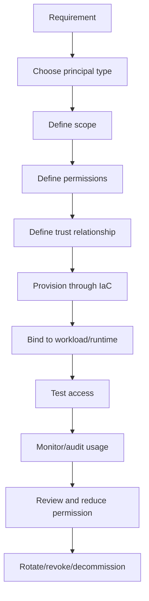

# Part 014 — Cloud Identity Foundation

> Fokus part ini adalah membangun mental model identity untuk cloud production systems. Targetnya bukan menghafal menu IAM atau Azure RBAC, tetapi mampu menjawab: siapa caller-nya, apa identitas runtime-nya, siapa yang mempercayai siapa, permission apa yang diberikan, pada scope apa, dengan credential apa, berapa lama credential berlaku, dan bagaimana failure identity muncul di Java/JAX-RS service.

Dalam enterprise backend system, identity adalah security boundary utama. Network private membantu membatasi reachability, tetapi identity menentukan authorization. Java service yang berjalan di EKS/AKS dan memanggil object storage, secret manager, config service, database, broker, API gateway, atau managed service harus memiliki runtime identity yang jelas.

Identity problem sering muncul sebagai:

- `AccessDenied`;
- `Unauthorized`;
- `Forbidden`;
- `ExpiredToken`;
- `NoCredentialProviders`;
- `DefaultAzureCredential failed`;
- wrong role assigned;
- wrong scope;
- wrong tenant/subscription/account;
- wrong token audience;
- Kubernetes ServiceAccount tidak terhubung ke cloud identity;
- secret statis tertinggal di environment variable;
- local development berhasil, pod production gagal.

Senior engineer harus bisa membaca error identity sebagai kombinasi authentication, authorization, trust, scope, credential lifecycle, dan runtime environment.

---

## 1. Core mental model

Cloud identity memiliki beberapa pertanyaan dasar:

```text
Who are you?
  -> authentication / identity assertion

Who trusts your identity?
  -> federation / trust policy / tenant / issuer

What are you allowed to do?
  -> permission policy / role assignment / RBAC / ABAC

Where are you allowed to do it?
  -> account / subscription / resource group / resource / region / namespace

How do you prove it at runtime?
  -> token / temporary credential / managed identity / projected service account token

How long is the proof valid?
  -> expiration / rotation / refresh

How is it audited?
  -> CloudTrail / Azure Activity Log / service audit / app logs
```

Identity is not a string in config. It is a relationship between caller, issuer, trust boundary, permission, resource, and time.

---

## 2. Identity vocabulary

| Term | Meaning | Backend relevance |
|---|---|---|
| Identity provider | System that authenticates identities | Entra ID, corporate IdP, OIDC provider, SAML IdP |
| Principal | Entity that can be authenticated/authorized | user, role, service principal, managed identity, workload |
| User | Human identity | developer/admin access, break-glass, audit |
| Group | Collection of users/principals | access management at scale |
| Role | Set of permissions or assumable identity | AWS IAM role, Azure role definition/assignment concept differs |
| Service account | Kubernetes identity for pod | bridge to workload identity |
| Service principal | Azure application identity instance | used by apps/automation, often with RBAC |
| Managed identity | Azure-managed service identity | secretless access from Azure resources |
| Federation | Trusting external identity assertion | OIDC/SAML/workload identity/CI-CD identity |
| Trust policy | Who can assume/use an identity | central to AWS role assumption |
| Permission policy | What actions/resources are allowed | least privilege control |
| RBAC | Role-based access control | Azure resources, Kubernetes, platform systems |
| ABAC | Attribute/tag-based access control | condition-based access decisions |
| Temporary credential | Short-lived credential issued at runtime | avoids long-lived static secrets |
| Token audience | Intended recipient/resource of token | prevents token reuse against wrong service |

The dangerous simplification is saying “the service has access”. Better phrasing:

```text
This workload identity, issued by this issuer, trusted by this cloud account/subscription, has this permission set, at this resource scope, for this duration, audited here.
```

---

## 3. Authentication vs authorization vs trust

These three are different.

### Authentication

Authentication answers: “Can the caller prove who it is?”

Examples:

- user signs in through corporate IdP;
- pod presents projected OIDC token;
- Azure resource obtains managed identity token;
- CI/CD runner presents OIDC token;
- service presents mTLS client certificate.

### Authorization

Authorization answers: “Is this identity allowed to perform this action on this resource?”

Examples:

- can read secret `prod/db/password`;
- can put object to bucket/container;
- can describe Kafka cluster;
- can pull image from registry;
- can write logs;
- can assume role;
- can access Key Vault secret.

### Trust

Trust answers: “Does the resource/cloud accept the identity issuer and claim?”

Examples:

- AWS IAM role trusts an OIDC provider and ServiceAccount claim;
- Azure federated credential trusts a Kubernetes issuer and subject;
- a service trusts JWTs from a specific issuer/audience;
- an mTLS server trusts client certificates from an internal CA.

Many incidents happen because authentication succeeds but authorization fails, or token is valid but audience/scope/trust relationship is wrong.

---

## 4. Lifecycle of cloud identity

Identity should have lifecycle, not accidental existence.



Key review questions:

- Why does this identity exist?
- Which workload uses it?
- What environment is it for?
- What resources can it access?
- Is the scope minimal?
- Are permissions action/resource constrained?
- Is access temporary or long-lived?
- Is usage audited?
- Who owns decommissioning?

---

## 5. Human identity vs workload identity

### Human identity

Human identity is used by people: developers, operators, SREs, security team, platform engineers.

Production human access should usually be:

- federated through corporate IdP;
- group-based;
- time-bound if privileged;
- audited;
- approved;
- separated by environment;
- protected by MFA/conditional access;
- not embedded into applications.

### Workload identity

Workload identity is used by software: Java service, batch job, worker, controller, CI/CD runner.

Production workload identity should be:

- non-human;
- specific to workload/environment;
- secretless where possible;
- short-lived credential based;
- least privilege;
- auditable;
- provisioned through IaC;
- bound to Kubernetes ServiceAccount or managed runtime;
- not reused across unrelated services.

Anti-pattern:

```text
One shared cloud access key used by multiple services across dev/test/prod.
```

Better:

```text
Each workload/environment has a dedicated identity with scoped permissions and short-lived runtime credentials.
```

---

## 6. AWS identity model at foundation level

AWS identity starts with AWS account as boundary and IAM as identity/permission system.

Core concepts:

| AWS concept | Meaning |
|---|---|
| IAM user | Long-term human or application identity; avoid for workloads where roles/federation are possible |
| IAM group | Collection of IAM users |
| IAM role | Assumable identity with permissions |
| Trust policy | Defines who can assume the role |
| Permission policy | Defines allowed/denied actions and resources |
| STS | Issues temporary credentials |
| AssumeRole | Operation to assume a role |
| Instance profile | Role delivery mechanism for EC2 |
| OIDC provider | Federation provider used by IRSA and other flows |
| Resource policy | Policy attached to resource, e.g. S3 bucket policy |
| Condition | Constraint based on attributes such as tags, source, principal, MFA, VPC endpoint |

Mental model:

```text
Caller identity
  -> allowed to assume role by trust policy
  -> receives temporary credential from STS
  -> uses credential to call AWS service
  -> AWS evaluates identity policy + resource policy + conditions + explicit deny
```

For Java services on EKS, the important pattern is usually:

```text
Kubernetes ServiceAccount
  -> projected OIDC token
  -> IAM role trust policy accepts token claims
  -> AWS STS AssumeRoleWithWebIdentity
  -> AWS SDK receives temporary credentials
  -> service calls S3/Secrets Manager/SQS/etc.
```

Part 015 and Part 017 will go deeper. Here the foundation is: AWS roles are meant to be assumed; runtime should prefer temporary credentials over long-lived access keys.

---

## 7. Azure identity model at foundation level

Azure identity uses Microsoft Entra ID for identity and Azure RBAC for resource authorization.

Core concepts:

| Azure concept | Meaning |
|---|---|
| Microsoft Entra ID tenant | Identity directory boundary |
| User | Human identity |
| Group | Collection of identities |
| App registration | Application object definition in Entra ID |
| Service principal | Local identity instance of an app in a tenant |
| Managed identity | Azure-managed identity for supported resources |
| System-assigned managed identity | Lifecycle tied to one Azure resource |
| User-assigned managed identity | Independent identity assignable to resources |
| Azure RBAC role assignment | Grants role to principal at scope |
| Scope | Management group, subscription, resource group, or resource |
| Federated credential | Trust relationship for external OIDC token |

Mental model:

```text
Principal exists in Entra ID
  -> role assignment grants role at scope
  -> runtime obtains token for resource/audience
  -> Azure service validates token and RBAC/data-plane permissions
```

For Java services on AKS, a common modern pattern is:

```text
Kubernetes ServiceAccount
  -> projected OIDC token
  -> federated identity credential on Azure identity
  -> Azure SDK DefaultAzureCredential obtains token
  -> service calls Key Vault/Blob/App Configuration/etc.
```

Part 016 and Part 017 will go deeper. Foundation: Azure separates identity directory, role assignment, scope, and token audience. A token can be valid but still useless if RBAC scope or audience is wrong.

---

## 8. RBAC vs IAM policy vs ABAC

### RBAC

RBAC grants access by assigning roles to principals at a scope.

Example mental model:

```text
Principal: quote-order-api-prod
Role: Key Vault Secrets User
Scope: specific Key Vault
```

Benefit:

- easier to reason about at organization scale;
- consistent role assignment model;
- good for platform governance.

Risk:

- built-in roles may be broader than needed;
- wrong scope can overgrant;
- role assignment inheritance can surprise reviewers.

### IAM policy

Policy-based authorization defines allowed/denied actions and resources, often with conditions.

Example mental model:

```text
Allow s3:GetObject on arn:aws:s3:::quote-export-prod/reports/*
Condition: request through specific VPC endpoint
```

Benefit:

- fine-grained control;
- condition keys can enforce context;
- strong resource-level restriction.

Risk:

- complex policy evaluation;
- explicit deny can override allow;
- resource policy + identity policy interactions can confuse debugging.

### ABAC/tag-based access

ABAC uses attributes/tags/claims to decide access.

Example:

```text
Allow access only when principal tag Environment=prod matches resource tag Environment=prod.
```

Benefit:

- scalable for many resources;
- supports consistent environment/team boundaries.

Risk:

- tag quality becomes security-critical;
- missing/mutable tags can cause overgrant or deny;
- harder to audit if not standardized.

---

## 9. Least privilege discipline

Least privilege means granting only what is needed, where it is needed, for as long as needed.

It does not mean:

```text
Give read-only access to everything because write access is dangerous.
```

Read access can still expose secrets, PII, pricing data, customer data, internal topology, audit logs, object exports, and system metadata.

### Permission design process

```text
1. Identify operation
   e.g. read secret, write object, publish event, pull image

2. Identify resource
   e.g. one secret, one bucket prefix, one container, one registry repository

3. Identify environment
   e.g. dev/test/prod/customer-specific

4. Identify caller
   e.g. ServiceAccount/workload identity/service principal/IAM role

5. Identify constraints
   e.g. VPC endpoint, source subnet, tag, time, token audience

6. Define deny conditions if needed
   e.g. no public access, no cross-environment access

7. Add audit and review
   e.g. CloudTrail, Activity Log, service logs
```

### Least privilege smell list

- wildcard action: `*`;
- wildcard resource: `*`;
- same identity used by many services;
- same identity used across environments;
- human identity used by application;
- static access key in config;
- role assignment at subscription/account when resource scope is enough;
- secrets readable by CI/CD and runtime without separation;
- broad storage access when prefix-level access is enough;
- ability to create new credentials/secrets without strong review;
- missing audit log.

---

## 10. Temporary credentials

Temporary credentials reduce blast radius because they expire.

Examples:

- AWS STS credentials;
- AWS role session credentials;
- Azure access tokens;
- workload identity tokens;
- CI/CD OIDC exchange;
- short-lived mTLS certificates in some platforms.

Benefits:

- no long-lived secret embedded in application;
- easier rotation;
- reduced impact if token leaks;
- better audit of session identity;
- supports federation.

Risks:

- credential refresh failure can cause outage;
- clock skew can break token validation;
- token audience mismatch;
- session duration too short for long-running operation;
- SDK credential cache behavior misunderstood;
- local development and production credential chain differ.

For Java services, always understand:

```text
Where does credential come from?
How long does it live?
Who refreshes it?
What happens if refresh fails?
What metric/log shows credential failure?
```

---

## 11. Token audience

Token audience answers: “For whom was this token issued?”

A valid token for Service A should not be accepted by Service B. In cloud systems, wrong audience can cause confusing errors.

Examples:

- Azure token requested for wrong resource endpoint;
- OIDC token issued for Kubernetes audience but expected by cloud provider;
- JWT from API gateway accepted without audience validation;
- mTLS cert validates identity but application ignores intended usage;
- local token from developer CLI works but production workload token has different audience.

Security rule:

```text
Always validate issuer, subject, audience, expiry, and intended scope.
```

For service-to-service and cloud SDK calls, audience is often hidden by SDK defaults. That is convenient but dangerous if endpoint override, private endpoint, sovereign cloud, or custom environment changes expected resource/audience.

---

## 12. Service account, service principal, and managed identity

These names are often confused.

### Kubernetes ServiceAccount

A Kubernetes ServiceAccount identifies a pod to the Kubernetes API and can also be used as the subject for workload identity federation.

It is not automatically an AWS IAM role or Azure managed identity.

### AWS IAM role

An AWS IAM role is an assumable identity. In EKS IRSA, a Kubernetes ServiceAccount can be allowed to assume an IAM role through OIDC federation.

### Azure service principal

A service principal is an identity in Microsoft Entra ID representing an application or automation actor in a tenant.

### Azure managed identity

A managed identity is managed by Azure and can be assigned to supported Azure resources. In AKS workload identity, a Kubernetes ServiceAccount can federate to an Azure identity depending on setup.

### Practical mapping

| Runtime context | Cloud identity pattern |
|---|---|
| EKS pod | Kubernetes ServiceAccount -> OIDC -> AWS IAM role -> STS temporary credentials |
| AKS pod | Kubernetes ServiceAccount -> OIDC -> federated credential -> Azure identity/token |
| EC2 app | Instance profile -> IAM role credentials |
| Azure VM/app | Managed identity -> Azure access token |
| CI/CD | OIDC federation -> cloud role/service principal/identity |
| Local dev | SSO/CLI credential, never production static key copied locally |

---

## 13. Impact on Java/JAX-RS backend

Identity affects Java backend in concrete ways.

### 13.1 SDK credential provider chain

AWS SDK and Azure SDK both use credential provider chains. The application may not explicitly pass credentials, but the SDK searches runtime sources.

Common sources:

- environment variables;
- system properties;
- profile/CLI login;
- web identity token file;
- metadata service;
- managed identity endpoint;
- workload identity projection;
- custom credential provider.

Risk:

```text
Local dev uses developer admin credential.
Production uses workload identity.
Test passes locally but fails in pod because runtime identity lacks permission.
```

Design rule:

- log credential source category safely if possible;
- never log tokens or keys;
- make region/tenant/subscription/account explicit;
- test in cluster, not only locally;
- include access-denied runbook.

### 13.2 Startup vs runtime access

Some services read secrets/config at startup. Others fetch at runtime.

Startup access failure:

```text
pod CrashLoopBackOff
readiness never becomes true
secret/config access denied
```

Runtime access failure:

```text
application starts
specific endpoint fails when dependency access is needed
```

Both need different observability. Startup failure should be visible in pod logs/events. Runtime failure should produce dependency metrics and controlled API response.

### 13.3 Thread and latency impact

Credential acquisition can block or retry. If every request triggers credential resolution instead of reusing SDK clients, latency and throttling can spike.

Correct pattern:

- create SDK clients once and reuse;
- let SDK manage credential refresh;
- configure timeout/retry;
- avoid per-request client creation;
- do not fetch secret from remote manager on every request without cache;
- separate credential failure metrics from dependency service failure metrics.

---

## 14. Impact on PostgreSQL, Kafka, RabbitMQ, Redis, Camunda, and NGINX

### PostgreSQL

Identity may appear as:

- static DB username/password from secret manager;
- IAM/database authentication in some managed DB setups;
- Azure AD authentication for database in some Azure patterns;
- TLS client certificate;
- network-level access plus database role.

Checklist:

- Is DB auth tied to cloud identity or separate DB credential?
- Where is password/certificate stored?
- How is rotation handled?
- Does connection pool survive credential rotation?
- Are DB permissions least privilege?

### Kafka

Kafka identity may use:

- SASL/SCRAM;
- mTLS;
- IAM-based auth in specific managed AWS patterns;
- OAuth/OIDC in some enterprise broker setups;
- ACLs per topic/group.

Checklist:

- producer/consumer identity;
- topic-level ACL;
- consumer group permission;
- certificate/secret rotation;
- broker audit logs;
- idempotent producer setting if relevant.

### RabbitMQ

RabbitMQ identity often uses username/password, TLS client cert, or external auth plugins.

Checklist:

- vhost permission;
- exchange/queue permission;
- secret rotation;
- TLS trust;
- connection recovery behavior after credential rotation.

### Redis

Redis identity may be simple AUTH/ACL or managed service access policy.

Checklist:

- ACL user per service;
- command restriction;
- key prefix convention;
- password/token rotation;
- TLS enabled;
- cache data sensitivity.

### Camunda

Camunda access may involve REST auth, worker credentials, OAuth client, or platform identity.

Checklist:

- worker identity;
- task/topic access;
- admin vs runtime permission;
- token refresh;
- audit trail for process modification.

### NGINX/API gateway

NGINX/gateway often enforces JWT, mTLS, API key, or header-based identity propagation.

Checklist:

- issuer validation;
- audience validation;
- subject/claim mapping;
- header spoofing prevention;
- downstream identity propagation;
- log redaction.

---

## 15. Impact on EKS, AKS, on-prem, and hybrid

### EKS

EKS identity concerns:

- Kubernetes RBAC controls access to Kubernetes API;
- AWS IAM controls access to AWS APIs;
- IRSA maps ServiceAccount to IAM role through OIDC;
- node role and pod role must not be confused;
- pod should not inherit broad node permission;
- AWS SDK credential provider chain must resolve web identity credentials correctly.

Failure patterns:

- ServiceAccount annotation missing;
- trust policy subject mismatch;
- wrong namespace/name;
- OIDC provider not associated;
- IAM role lacks resource permission;
- SDK version/config does not pick web identity provider;
- token file not mounted.

### AKS

AKS identity concerns:

- Kubernetes RBAC controls access to Kubernetes API;
- Azure RBAC controls Azure resource access;
- workload identity maps ServiceAccount to Azure identity through federated credential;
- managed identity can be system-assigned or user-assigned;
- Azure SDK credential chain must select the expected credential;
- role assignment scope matters.

Failure patterns:

- federated credential subject mismatch;
- wrong tenant/client ID;
- missing role assignment;
- role assigned at wrong scope;
- token audience wrong;
- SDK picks CLI credential locally but managed identity in cluster;
- Key Vault data-plane permission missing even if management-plane role exists.

### On-prem

On-prem runtime may not have cloud metadata identity. Options must be explicit:

- workload federation;
- service principal with secret/certificate;
- external secrets injected by deployment system;
- private credential broker;
- customer-managed identity integration;
- offline/air-gapped secret provisioning.

Never assume EKS/AKS workload identity works unchanged on-prem.

### Hybrid

Hybrid systems often combine cloud identity and corporate identity:

```text
Cloud workload identity
  -> calls on-prem API
  -> authenticates with OAuth/mTLS/service credential
  -> on-prem service authorizes via corporate policy
```

Verify both sides:

- cloud identity permission;
- network reachability;
- application auth;
- token issuer/audience;
- certificate trust;
- audit logs in both cloud and on-prem systems.

---

## 16. Failure modes

| Failure mode | Symptom | Likely debugging target |
|---|---|---|
| No credential found | SDK startup/runtime error | provider chain, env vars, token mount, metadata access |
| Access denied | 403/AccessDenied | permission policy, role assignment, resource policy |
| Wrong scope | Azure AuthorizationFailed | RBAC scope/inheritance/resource group/subscription |
| Trust mismatch | cannot assume role/federate | trust policy, issuer, subject, audience |
| Expired token | ExpiredToken/401 | refresh logic, clock skew, credential cache |
| Wrong tenant/account | resource not found or forbidden | subscription/account/tenant config |
| Local works, pod fails | environment credential mismatch | compare credential provider source |
| Pod has node permissions | unexpected broad access | node role leakage/metadata access |
| Secret rotation breaks app | auth failure after rotation | cache/reload/restart strategy |
| Token audience mismatch | 401 invalid audience | requested resource/audience config |
| Explicit deny | allow exists but still denied | deny policy/SCP/resource policy/condition |
| Data-plane permission missing | management access works but read secret/blob fails | service-specific data role/policy |

---

## 17. Production-safe debugging flow

```text
1. Identify the failing operation
   - action, resource, environment, account/subscription, region

2. Identify runtime caller
   - pod, namespace, ServiceAccount, node, workload identity, role/client ID

3. Identify credential source
   - env var, web identity token, managed identity, metadata, CLI, service principal

4. Check authentication
   - token exists, issuer valid, subject correct, audience correct, not expired

5. Check trust
   - AWS trust policy or Azure federated credential accepts the subject/issuer

6. Check authorization
   - identity policy, resource policy, RBAC role assignment, data-plane permission

7. Check scope/resource
   - correct bucket/container/secret/key/resource group/subscription/account

8. Check network dependency
   - private endpoint, firewall, DNS, metadata endpoint, token endpoint reachability

9. Check audit logs
   - CloudTrail, Azure Activity Log, service-specific audit

10. Fix minimally
   - narrow policy/scope adjustment, trust correction, service account binding, config correction
```

Production-safe rules:

- do not grant admin/owner just to test;
- do not paste production tokens into local tools;
- do not log credentials;
- do not disable auth temporarily;
- do not copy developer credentials into pod;
- do not make one shared role to bypass review;
- always rollback broad permissions after emergency access.

---

## 18. Observability and audit

Identity must be observable.

### Application logs

Log safely:

```text
operationName
dependencyName
cloudProvider
accountOrSubscriptionAlias if safe
resourceName or logical resource alias
credentialProviderType if safe
authorizationFailureType
correlationId
requestId from cloud SDK if available
```

Do not log:

```text
access key
secret key
token
JWT body if contains sensitive claims
client secret
certificate private key
full connection string with password
```

### AWS audit

Look for:

- CloudTrail event name;
- principal ARN;
- assumed role session;
- source identity/session tags if used;
- error code;
- resource ARN;
- source IP/VPC endpoint context;
- explicit deny clues.

### Azure audit

Look for:

- Azure Activity Log;
- role assignment changes;
- principal ID/client ID;
- scope;
- Key Vault diagnostic logs if relevant;
- storage data access logs if enabled;
- application/service diagnostic logs;
- Entra sign-in/workload identity logs where applicable.

### Metrics

Useful metrics:

- credential acquisition failure count;
- token refresh latency/failure;
- access denied count by dependency;
- secret retrieval failure;
- config retrieval failure;
- SDK request error classification;
- cloud API throttling;
- workload identity webhook/error events if available.

---

## 19. Security concerns

### Static credentials

Static credentials are sometimes unavoidable, but they should be treated as exception.

Risk:

- leaked via logs;
- copied into CI/CD variables;
- hardcoded in config;
- shared across services;
- not rotated;
- used from developer laptop;
- impossible to attribute to one workload.

Preferred:

- workload identity;
- managed identity;
- role assumption;
- OIDC federation;
- secret manager with rotation;
- short-lived credentials.

### Privilege escalation

Watch for permissions that allow creating or modifying identity:

- create access key;
- attach policy;
- assign role;
- update trust policy;
- create federated credential;
- manage Key Vault access policy/RBAC;
- read all secrets;
- impersonate service account;
- create pods with privileged ServiceAccount.

### Confused deputy

A confused deputy occurs when a privileged service is tricked into using its authority on behalf of another caller. Mitigate with:

- audience validation;
- source condition;
- external ID where relevant;
- resource scoping;
- tenant/customer boundary checks;
- explicit authorization in application logic;
- idempotency and request provenance.

---

## 20. Correctness concerns

Identity mistakes can corrupt business correctness.

Examples:

- service writes export files into wrong bucket/container because environment identity points to wrong resource;
- dev workload can read prod secret due to broad scope;
- worker consumes wrong Kafka topic due to shared credential;
- database migration uses app runtime identity with excessive privilege;
- API gateway accepts token with wrong audience;
- retry after token refresh duplicates non-idempotent write;
- secret rotation changes downstream identity mid-flight and breaks long-running process;
- tenant/customer isolation relies only on app parameter, not identity/resource boundary.

Design rule:

```text
Identity boundary should align with environment, workload, tenant/customer boundary where required, and blast-radius expectation.
```

---

## 21. Performance and reliability concerns

Identity can affect performance.

Failure examples:

- creating SDK client per request triggers repeated credential lookup;
- token endpoint latency increases request latency;
- metadata service unavailable causes startup delay;
- secret manager throttling causes request failures;
- broad retry on auth failure increases load but never succeeds;
- credential refresh synchronized across many pods causes spike;
- token expiry during long upload/export causes partial failure.

Mitigation:

- reuse clients;
- cache secrets/config with safe TTL;
- use SDK credential refresh mechanisms;
- classify auth failures as non-retryable unless token refresh is expected;
- stagger restarts;
- monitor token/secret retrieval;
- design long-running jobs with resumability.

---

## 22. Cost concerns

Identity itself is not usually the largest cost driver, but bad identity design creates cost indirectly:

- runaway jobs due to over-permission;
- accidental writes to wrong storage account/bucket;
- excessive log volume from repeated auth failure;
- retry storms against cloud APIs;
- broad access hiding unused resources;
- no tag ownership because automation identity bypasses policy;
- orphaned service principals/roles/secrets;
- duplicated identities with no lifecycle owner.

Cost review questions:

- Does this identity allow creating expensive resources?
- Are tag policies enforced?
- Can this workload write unlimited logs/objects/events?
- Are failed auth retries creating high API call volume?
- Are unused identities periodically removed?

---

## 23. Privacy and compliance concerns

Identity controls access to regulated data.

Verify:

- who can read PII-containing storage;
- who can read logs containing customer identifiers;
- who can read secrets;
- who can decrypt data keys;
- who can export data;
- who can assume production roles;
- whether privileged access is time-bound;
- whether audit evidence is retained;
- whether service-to-service access respects tenant/customer isolation;
- whether emergency access is documented and reviewed.

Do not treat identity review as paperwork. It is part of regulatory defensibility.

---

## 24. PR review checklist

Use this for any PR/ADR touching cloud identity.

### Caller and scope

- [ ] Runtime caller is identified.
- [ ] Environment is identified.
- [ ] Account/subscription/tenant is identified.
- [ ] Resource scope is minimal.
- [ ] Cross-account/cross-subscription access is explicit.

### Permission

- [ ] Actions are minimal.
- [ ] Resources are constrained.
- [ ] Wildcards are justified or removed.
- [ ] Read access is treated as sensitive.
- [ ] Data-plane permissions are included only when needed.
- [ ] Privilege escalation permissions are avoided.

### Trust and credential

- [ ] Trust policy/federated credential is reviewed.
- [ ] Issuer/subject/audience are correct.
- [ ] Credential is short-lived or rotation is defined.
- [ ] Static secret usage is justified.
- [ ] SDK credential provider chain is understood.
- [ ] Local dev credential differs safely from production.

### Kubernetes

- [ ] ServiceAccount is dedicated to workload/environment.
- [ ] Pod is bound to expected identity.
- [ ] Node identity is not overused.
- [ ] Kubernetes RBAC is not broader than needed.
- [ ] Secret mount/env usage is reviewed.

### Observability and operations

- [ ] Access-denied errors are observable.
- [ ] Audit logs can identify caller.
- [ ] Runbook exists for credential failure.
- [ ] Rotation/revocation plan exists.
- [ ] Owner is assigned.
- [ ] Decommission path exists.

---

## 25. Internal verification checklist

Use this to discover real CSG/team identity architecture. Do not assume answers.

### Organization and governance

- [ ] What is the corporate identity provider?
- [ ] Is cloud access federated through SSO?
- [ ] What are the AWS accounts and Azure subscriptions used by the team?
- [ ] What is the production access approval process?
- [ ] Is privileged access time-bound?
- [ ] Are break-glass accounts documented?
- [ ] Where are identity policies stored: console, Terraform, Bicep, CloudFormation, other IaC?

### AWS

- [ ] Which IAM roles are used by Java/JAX-RS services?
- [ ] Are IAM users/access keys still used anywhere?
- [ ] Are roles environment-specific?
- [ ] What trust policies allow role assumption?
- [ ] Is IRSA used for EKS workloads?
- [ ] Are CloudTrail logs available?
- [ ] Are resource policies used for S3/KMS/Secrets/etc.?
- [ ] Are permission boundaries/SCPs used?

### Azure

- [ ] Which Entra tenant is used?
- [ ] Which service principals exist for apps/automation?
- [ ] Are managed identities used?
- [ ] Is AKS Workload Identity used?
- [ ] What role assignments exist for service identities?
- [ ] Are assignments scoped to subscription, resource group, or resource?
- [ ] Are Azure Activity Logs and diagnostic logs available?
- [ ] Is PIM used for privileged human access?

### Kubernetes

- [ ] Which ServiceAccounts map to cloud identities?
- [ ] Are ServiceAccounts reused across services?
- [ ] Are namespaces environment/team-isolated?
- [ ] Are Kubernetes RBAC permissions reviewed?
- [ ] Can pods access node metadata service?
- [ ] Are identity-related annotations/labels standardized?

### Java runtime

- [ ] Which AWS/Azure SDK versions are used?
- [ ] What credential provider chain is expected?
- [ ] Are SDK clients reused?
- [ ] Are token/credential refresh failures logged safely?
- [ ] Is local development credential behavior documented?
- [ ] Are access-denied errors mapped and alerted?

### Secrets and certificates

- [ ] Where are static secrets stored if any?
- [ ] Who can read them?
- [ ] How are they rotated?
- [ ] Are truststores/keystores managed centrally?
- [ ] Are internal CA certificates required?
- [ ] Is mTLS used for any service-to-service call?

---

## 26. Senior engineer heuristics

1. Private network is not authorization.
2. A valid token is not necessarily the right token.
3. A role assignment at broad scope is usually a future incident.
4. Read permission can be as sensitive as write permission.
5. Runtime identity must be different from human operator identity.
6. Local success with developer credentials proves little about production.
7. Credential refresh is a runtime dependency and needs observability.
8. Trust relationship is as important as permission policy.
9. Identity should be provisioned through IaC, not tribal console changes.
10. Every production identity needs an owner, purpose, scope, audit path, and decommission plan.

---

## 27. Official references

- AWS IAM roles: https://docs.aws.amazon.com/IAM/latest/UserGuide/id_roles.html
- AWS temporary security credentials and STS: https://docs.aws.amazon.com/IAM/latest/UserGuide/id_credentials_temp.html
- AWS identity providers and federation: https://docs.aws.amazon.com/IAM/latest/UserGuide/id_roles_providers.html
- Azure RBAC role assignments and scope: https://learn.microsoft.com/en-us/azure/role-based-access-control/role-assignments-portal
- Azure managed identities: https://learn.microsoft.com/en-us/entra/identity/managed-identities-azure-resources/overview
- Microsoft Entra service principals: https://learn.microsoft.com/en-us/entra/identity-platform/app-objects-and-service-principals
