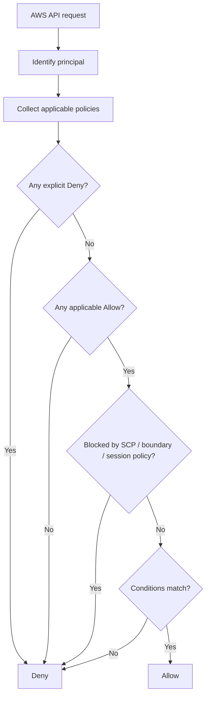
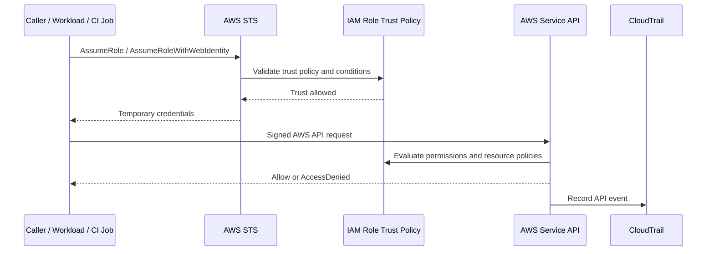
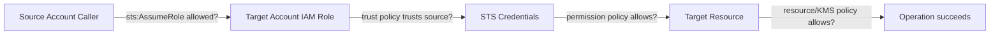

# Part 015 — AWS IAM Deep Dive

> Fokus part ini adalah memahami AWS IAM sebagai authorization fabric untuk AWS account. Targetnya bukan hafal JSON policy, tetapi mampu membaca: siapa principal-nya, role apa yang dipakai, siapa yang boleh assume role tersebut, permission apa yang efektif, resource apa yang bisa disentuh, condition apa yang membatasi, dan bukti auditnya ada di mana.

Untuk Java/JAX-RS backend di EKS, VM, batch worker, atau pipeline CI/CD, IAM menentukan apakah aplikasi boleh membaca secret, mengambil config, upload object ke S3, publish event, menulis log, menarik image, membaca parameter, atau memanggil managed service AWS.

Di production, IAM failure biasanya muncul sebagai:

- `AccessDenied`;
- `AccessDeniedException`;
- `UnauthorizedOperation`;
- `NoCredentialsProvider`;
- `The security token included in the request is expired`;
- `The requested DurationSeconds exceeds the MaxSessionDuration`;
- `not authorized to perform: sts:AssumeRole`;
- `not authorized to perform: s3:GetObject`;
- `explicit deny in a resource-based policy`;
- `no identity-based policy allows the action`;
- pod berhasil resolve DNS tetapi gagal authorization;
- local development berhasil karena credential developer terlalu luas, pod production gagal karena workload role sempit.

Senior engineer harus bisa membedakan network failure, credential discovery failure, authentication failure, authorization failure, trust failure, dan policy evaluation failure.

---

## 1. Core mental model

IAM menjawab lima pertanyaan:

```text
Who is calling?
  -> AWS principal: user, role, assumed role session, federated identity, service principal

Can this caller obtain credentials?
  -> static credential, STS temporary credential, instance profile, IRSA, federation

Is the caller trusted to act as this role?
  -> trust policy / AssumeRole / OIDC / SAML / service trust

What can the caller do?
  -> identity-based policy / session policy / permission boundary / SCP / resource policy

Is there an explicit deny anywhere?
  -> explicit deny wins over allow
```

IAM is not only “attach policy to user”. In production AWS, most application access should be role-based and temporary-credential-based.

A safer production sentence is:

```text
The Kubernetes ServiceAccount quote-api/prod is mapped through IRSA to IAM role qno-prod-quote-api-role.
That role trusts the EKS OIDC provider and only the exact ServiceAccount subject.
The role allows s3:GetObject and s3:PutObject only on the required bucket prefix,
and SecretsManager:GetSecretValue only for specific secret ARNs.
CloudTrail records the assumed-role session.
```

Not:

```text
The app has AWS access.
```

---

## 2. AWS IAM objects

| Object | Meaning | Production relevance |
|---|---|---|
| IAM user | Long-lived AWS identity, usually human or legacy automation | Avoid for application runtime where possible |
| IAM group | Collection of IAM users | Useful for legacy human access, not workload identity |
| IAM role | Assumable identity with permissions | Preferred runtime identity for apps, pods, EC2, CI/CD |
| IAM policy | JSON document that grants/denies actions | Main authorization definition |
| Trust policy | Resource-based policy on role defining who can assume it | Controls role entry point |
| Permission policy | Policy defining what the role can do after assumption | Controls effective AWS API access |
| Permissions boundary | Maximum permission boundary for user/role | Delegation guardrail |
| Session policy | Optional policy passed during role assumption | Further restricts temporary credentials |
| STS | Security Token Service issuing temporary credentials | Core to role assumption |
| Instance profile | Wrapper that attaches IAM role to EC2 instance | Common for EC2/EKS node role |
| Service-linked role | Role predefined for AWS service integration | Needed by some AWS services |
| Resource-based policy | Policy attached to resource such as S3 bucket, KMS key, SQS queue | Critical for cross-account and service-to-service access |
| SCP | Service Control Policy at AWS Organizations layer | Sets account-level permission guardrail |
| CloudTrail | API audit log | Evidence for who did what |
| IAM Access Analyzer | Helps analyze external access and policy findings | Review and security evidence |

Key distinction:

```text
IAM role has two sides:

1. Who can become this role?
   -> trust policy

2. What can this role do after becoming it?
   -> permission policy
```

Many production bugs happen because engineers inspect only one side.

---

## 3. IAM policy anatomy

An IAM policy statement generally has:

```json
{
  "Effect": "Allow",
  "Action": ["s3:GetObject"],
  "Resource": ["arn:aws:s3:::example-bucket/reports/*"],
  "Condition": {
    "StringEquals": {
      "aws:PrincipalTag/environment": "prod"
    }
  }
}
```

Core fields:

| Field | Meaning | Review question |
|---|---|---|
| `Effect` | `Allow` or `Deny` | Is there an explicit deny? |
| `Action` | AWS API operation | Is action too broad, such as `s3:*`? |
| `Resource` | ARN target | Is resource scoped or `*`? |
| `Condition` | Context constraint | Does condition match runtime context? |
| `Principal` | Used in trust/resource policies | Who is trusted or allowed? |

Practical review rule:

```text
Action should be as narrow as possible.
Resource should be as narrow as possible.
Condition should encode environment, source, tag, account, organization, VPC endpoint, or identity claim when relevant.
Explicit Deny should be understood, documented, and tested.
```

---

## 4. Trust policy vs permission policy

A trust policy is attached to an IAM role and decides who may assume the role.

Example conceptually:

```json
{
  "Effect": "Allow",
  "Principal": {
    "AWS": "arn:aws:iam::111122223333:role/ci-deploy-role"
  },
  "Action": "sts:AssumeRole"
}
```

A permission policy attached to the role decides what the temporary credentials can do after the role is assumed.

Example conceptually:

```json
{
  "Effect": "Allow",
  "Action": [
    "secretsmanager:GetSecretValue"
  ],
  "Resource": [
    "arn:aws:secretsmanager:ap-southeast-1:111122223333:secret:qno/prod/db-*"
  ]
}
```

Failure patterns:

| Symptom | Likely side to inspect |
|---|---|
| `not authorized to perform sts:AssumeRole` | Trust policy and caller permission to assume role |
| `AccessDenied` for S3/Secrets Manager after role assumption succeeds | Permission policy/resource policy/SCP/boundary |
| Role cannot be assumed by pod | EKS OIDC provider, trust policy `sub`, ServiceAccount annotation |
| CI/CD cannot deploy | Federation trust, role assumption, permission policy, SCP |
| Cross-account access denied | Trust policy in target account and permission in source account |

---

## 5. Policy evaluation mental model

AWS policy evaluation can be mentally simplified as:

```text
Start: implicit deny
  -> Is there an explicit deny in any applicable policy?
       yes -> Deny
  -> Is there an allow in applicable identity/resource/session policy?
       no -> Deny
  -> Is allow blocked by permission boundary or SCP?
       yes -> Deny
  -> Are conditions satisfied?
       no -> Deny
  -> Allow
```

Mermaid view:



Do not debug IAM by reading only one policy. Effective authorization may involve:

- identity-based policy;
- resource-based policy;
- trust policy;
- permissions boundary;
- session policy;
- AWS Organizations SCP;
- VPC endpoint policy;
- KMS key policy;
- S3 bucket policy;
- service-specific authorization model;
- tag/condition keys;
- region/account mismatch.

---

## 6. STS and temporary credentials

AWS STS issues temporary credentials. Temporary credentials are typically composed of:

```text
AccessKeyId
SecretAccessKey
SessionToken
Expiration
```

Common STS flows:

| Flow | Used by | Notes |
|---|---|---|
| `AssumeRole` | Cross-account access, CI/CD, delegated admin | Caller needs permission and role must trust caller |
| `AssumeRoleWithWebIdentity` | EKS IRSA, OIDC federation | Web identity token exchanged for AWS credentials |
| `AssumeRoleWithSAML` | Enterprise SSO/federation | SAML assertion exchanged for AWS credentials |
| `GetCallerIdentity` | Debugging | Confirms current principal |

For backend engineers, the most useful diagnostic command is conceptually:

```bash
aws sts get-caller-identity
```

From inside a workload, this tells you which AWS principal the SDK is actually using.

Important: `get-caller-identity` answering successfully does not mean the role has the correct permission. It only proves the credential is valid and recognized.

---

## 7. Role assumption lifecycle



Debugging implication:

- If failure happens before temporary credentials are issued, inspect trust/federation.
- If temporary credentials are issued but service call fails, inspect permission/resource/SCP/boundary/condition.
- If CloudTrail has no service API event, the request may not have reached AWS service authorization layer or used wrong region/account/endpoint.

---

## 8. IAM user, group, and why workload should prefer roles

IAM users are long-lived identities. They can have long-lived access keys. That creates operational risk:

- key leakage;
- difficult rotation;
- unclear runtime ownership;
- stale automation credentials;
- human access mixed with machine access;
- weak audit if shared by multiple jobs/services.

For application runtime, prefer:

- IAM role for EC2 via instance profile;
- IAM role for EKS pod via IRSA;
- IAM role for ECS task where relevant;
- role assumption from CI/CD via OIDC federation;
- short-lived STS credentials.

Use IAM users only when there is a clear legacy or vendor constraint, and document rotation, scope, owner, and audit.

---

## 9. IAM role types that backend engineers commonly see

| Role type | Example | Risk |
|---|---|---|
| Workload role | `qno-prod-quote-api-role` | Too broad resource permissions |
| Node role | EKS node instance role | Accidentally used by pods if IRSA missing |
| CI/CD deploy role | `github-actions-prod-deploy-role` | Can mutate infrastructure or deploy wrong env |
| Cross-account read role | prod account role assumed by audit/tooling account | Trust too broad |
| Service-linked role | AWS service-managed role | Deleting or modifying can break service integration |
| Break-glass role | emergency admin role | Requires strict audit/PIM-like governance |

A dangerous EKS anti-pattern:

```text
Pod has no IRSA role.
AWS SDK falls back to node instance profile.
Node role has broad permissions.
Application works but uses wrong blast radius.
```

This is why `GetCallerIdentity` from the pod matters.

---

## 10. Permissions boundaries

A permissions boundary sets the maximum permissions an IAM user or role can get from identity-based policies. It does not grant permissions by itself.

Mental model:

```text
Effective permissions = identity policy allow INTERSECT boundary allow
```

If a role policy allows `s3:PutObject` but its boundary does not allow `s3:PutObject`, the request is denied.

Use cases:

- delegating IAM role creation to platform teams safely;
- letting application teams create roles but not admin roles;
- enforcing maximum privilege for generated roles;
- preventing privilege escalation through IAM mutation.

Review questions:

- Does the role have a permissions boundary?
- Does the boundary include the required actions?
- Does the boundary accidentally block new service integration?
- Is the boundary managed centrally?
- Is the boundary included in IaC and PR review?

Failure mode:

```text
Policy attached: yes.
Action appears allowed: yes.
Still denied: yes.
Cause: permission boundary or SCP does not allow it.
```

---

## 11. IAM conditions

Conditions make policies contextual.

Common condition categories:

| Condition idea | Example use |
|---|---|
| Principal tag | allow only principals tagged `environment=prod` |
| Resource tag | allow access only to resources tagged for same team/env |
| Source VPC endpoint | require access through private endpoint |
| Source account/org | avoid confused deputy access |
| Requested region | restrict to approved regions |
| MFA | require MFA for sensitive human action |
| Source identity/session name | improve auditability |
| OIDC subject/audience | bind role to exact Kubernetes ServiceAccount |

Condition pitfalls:

- condition key does not apply to the service/action;
- tag missing on resource;
- wrong case-sensitive string;
- role session tag not propagated;
- VPC endpoint condition fails because traffic uses NAT/internet path;
- OIDC `sub` claim does not match namespace/service account;
- policy copied from another environment with stale account ID or region.

For Java services, condition failure looks like generic `AccessDenied`. The application usually cannot tell which condition failed unless logs, CloudTrail, and policy simulator/Access Analyzer are used.

---

## 12. Resource-based policies

Some AWS resources can have policies attached directly to them.

Common examples:

- S3 bucket policy;
- KMS key policy;
- SQS queue policy;
- SNS topic policy;
- Secrets Manager resource policy;
- ECR repository policy;
- Lambda resource policy.

Why this matters:

```text
Identity policy says caller can access resource.
Resource policy may still deny or fail to allow cross-account access.
KMS key policy may deny decrypt even if S3 GetObject is allowed.
VPC endpoint policy may deny the request even if IAM allows it.
```

For object storage and encryption, common hidden dependency:

```text
S3 GetObject allowed
BUT object encrypted with KMS CMK
AND role lacks kms:Decrypt on key
=> application gets access failure
```

PR review should inspect both the data service policy and the KMS key policy.

---

## 13. Cross-account access

Cross-account access requires agreement from both sides.

Example mental model:

```text
Source account role/user must be allowed to call sts:AssumeRole on target role.
Target account role trust policy must trust the source principal/account.
Target role permission policy must allow actions on target resources.
Target resources may also need resource policies or KMS key policies.
SCPs in either account may still block the operation.
```

Mermaid view:



Failure checklist:

- correct target role ARN?
- source principal has `sts:AssumeRole` permission?
- target role trust policy includes source principal/account?
- `ExternalId` required?
- source identity/session name required?
- target role permission policy allows service action?
- resource policy/KMS policy allows target role?
- SCP blocks action?
- region/account in SDK config correct?

---

## 14. IAM and Java/JAX-RS backend services

Java service normally uses AWS SDK credential provider chain. The credential source might be:

- environment variables;
- system properties;
- shared credentials/config file;
- web identity token file for IRSA;
- ECS/EC2 metadata;
- custom credential provider.

Production risk:

| Risk | Effect |
|---|---|
| Wrong credential source wins | app uses developer/static/node credentials |
| Missing IRSA annotation | pod may fallback to node role or fail |
| Credential expires and refresh fails | intermittent `ExpiredToken` |
| Region wrong | calls wrong regional endpoint |
| Endpoint override wrong | request goes to wrong/private endpoint |
| Retry hides AccessDenied | latency spike without real recovery |
| Overbroad role | blast radius too large |
| Error log lacks caller identity | debugging slow |

Recommended application diagnostics:

- log AWS region and service endpoint at startup;
- expose dependency health without leaking secret values;
- include AWS request ID in error logs when available;
- never log credentials, session token, or signed URL;
- include dependency name, action category, and resource alias in structured logs;
- run `GetCallerIdentity` only as controlled diagnostic, not always in hot path.

---

## 15. IAM impact on PostgreSQL, Kafka, RabbitMQ, Redis, Camunda, and NGINX

IAM is not only for S3.

| Component | IAM relevance |
|---|---|
| PostgreSQL | RDS/Aurora auth, Secrets Manager access, KMS decrypt, monitoring permissions, backup/export permissions |
| Kafka/MSK | Cluster describe/connect permissions if IAM auth used, MSK Connect role, CloudWatch logs |
| RabbitMQ/Amazon MQ | Broker management permissions, secret retrieval, monitoring logs |
| Redis/ElastiCache | Management API permissions, secret retrieval, KMS/logging permissions |
| Camunda | Secret/config/object storage access for workers, audit export, backup integration |
| NGINX/Ingress | ALB/NLB controller IAM role, certificate access, Route 53 DNS automation |
| EKS | IRSA, node role, cluster autoscaler/Karpenter roles, EBS/EFS CSI roles, load balancer controller role |

Senior backend engineer should know which IAM role is used by the app and which IAM role is used by platform controllers. They are different blast radii.

---

## 16. IAM and EKS awareness

Part 017 covers workload identity deeply, but the IAM angle is:

```text
Kubernetes ServiceAccount
  -> projected OIDC token
  -> IAM role trust policy with EKS OIDC provider
  -> STS AssumeRoleWithWebIdentity
  -> temporary credentials
  -> AWS SDK call
```

Review items:

- exact namespace and ServiceAccount in trust policy;
- exact OIDC provider ARN;
- `aud` claim expected by AWS STS;
- role annotation on Kubernetes ServiceAccount;
- pod actually uses that ServiceAccount;
- no static AWS credentials in env vars;
- node role not overprivileged;
- CloudTrail shows assumed role session from web identity.

Common failure:

```text
ServiceAccount annotated correctly,
but deployment uses different serviceAccountName.
Pod starts, SDK cannot assume expected role.
```

---

## 17. CloudTrail and audit evidence

CloudTrail is the first place to answer:

```text
Who called what API?
Using which principal/session?
From which source IP/VPC endpoint?
Against which resource?
Was the call allowed or denied?
What request parameters were used?
```

Audit fields to look for:

- `eventTime`;
- `eventSource`;
- `eventName`;
- `awsRegion`;
- `userIdentity.type`;
- `userIdentity.arn`;
- `userIdentity.sessionContext`;
- `sourceIPAddress`;
- `vpcEndpointId` if available;
- `errorCode`;
- `errorMessage`;
- `requestParameters`;
- `resources`.

For role assumption tracing, preserve:

- role session name;
- source identity where enforced;
- session tags if used;
- CI/CD build ID or workload name;
- Kubernetes namespace/service name in naming convention.

Without audit discipline, all assumed-role sessions look similar during an incident.

---

## 18. IAM Access Analyzer awareness

IAM Access Analyzer helps identify resources shared externally and can help validate policies. For backend engineers, its value is not replacing security review, but surfacing risky access patterns.

Useful questions:

- Does any S3 bucket, KMS key, secret, queue, or role trust external account unexpectedly?
- Does policy grant public or cross-account access?
- Does policy include unused broad actions?
- Are findings reviewed before production deployment?
- Are generated policies based on observed access used carefully and narrowed?

Access Analyzer should feed PR review, not be ignored as a dashboard owned only by security.

---

## 19. AccessDenied debugging playbook

When Java service gets `AccessDenied`, debug in this order.

### Step 1 — Identify the real caller

Ask:

```text
Which principal is the SDK using inside the actual runtime?
```

Check:

- `aws sts get-caller-identity` from same runtime if safe;
- SDK credential provider logs if enabled carefully;
- CloudTrail `userIdentity`;
- pod ServiceAccount;
- environment variables overriding credentials;
- EC2/EKS node role fallback.

### Step 2 — Identify exact failed action and resource

Do not say “S3 failed”. Say:

```text
s3:PutObject failed on arn:aws:s3:::bucket/prefix/key
```

Check:

- AWS error code;
- request ID;
- operation name;
- region;
- endpoint;
- resource ARN;
- KMS key if encrypted;
- service-specific subresource.

### Step 3 — Inspect applicable policies

Check:

- identity policy attached to role;
- resource policy;
- KMS key policy;
- VPC endpoint policy;
- permission boundary;
- session policy;
- SCP;
- condition keys;
- tag availability.

### Step 4 — Check explicit deny

Explicit deny always wins. Look for:

- SCP deny;
- bucket policy deny;
- KMS key policy deny;
- condition-based deny;
- VPC endpoint deny;
- region deny;
- organization boundary deny.

### Step 5 — Validate account and region

Many incidents are not policy bugs but target bugs:

- wrong account ID in ARN;
- wrong region in SDK;
- wrong environment variable;
- stale secret/config pointing to old resource;
- endpoint override pointing to dev/private endpoint;
- Route 53/DNS resolves to unexpected path.

---

## 20. Common AWS IAM failure modes

| Failure mode | Symptom | Detection | Fix direction |
|---|---|---|---|
| Missing permission | `AccessDenied` | CloudTrail error, policy review | Add narrow action/resource |
| Wrong trust policy | `AssumeRole` denied | STS event | Fix trusted principal/condition |
| Wrong runtime role | Unexpected caller identity | `GetCallerIdentity` | Fix ServiceAccount/instance profile/env vars |
| Permission boundary block | Policy appears allowed but denied | IAM evaluation detail | Update boundary or request exception |
| SCP block | Account-level deny | Organizations/SCP review | Use approved region/action/account |
| Resource policy block | Cross-account or S3/KMS failure | Resource policy review | Add target role/resource condition |
| KMS missing decrypt | S3/Secrets failure | KMS key policy/CloudTrail | Grant `kms:Decrypt` narrowly |
| VPC endpoint policy deny | Works via internet path but not private path | Endpoint policy/logs | Update endpoint policy |
| Expired token | Intermittent credential errors | SDK logs | Fix refresh/provider/runtime clock |
| Overbroad node role fallback | App works with wrong role | Caller identity | Enforce IRSA and reduce node role |

---

## 21. PR review checklist for AWS IAM changes

Use this checklist for PRs touching Terraform, CloudFormation, Helm, EKS ServiceAccount, AWS SDK integration, S3/Secrets/KMS, or CI/CD deploy roles.

### Identity and trust

- What principal will call this AWS API?
- Is it human, CI/CD, Kubernetes workload, AWS service, or cross-account role?
- Is role assumption required?
- Is the trust policy scoped to exact principal?
- For IRSA, is namespace and ServiceAccount exact?
- Is role session name/source identity auditable?

### Permission scope

- Are actions narrow?
- Are resources narrow?
- Is `*` justified and documented?
- Are conditions used where valuable?
- Are environment/team/customer boundaries encoded?
- Are KMS permissions included only where needed?

### Guardrails

- Does permissions boundary apply?
- Could SCP block it in prod?
- Does resource policy also need update?
- Does VPC endpoint policy allow this path?
- Does this create public or external access?
- Does Access Analyzer flag anything?

### Runtime and operations

- How will the Java service obtain credentials?
- What happens when credentials expire?
- What logs will show caller identity and request ID?
- Is rollback safe?
- Has this been tested in the same account/region/path as production?
- Is there a runbook for AccessDenied?

---

## 22. Internal verification checklist

Verify with platform/SRE/security/backend team:

- AWS account ID per environment.
- AWS Organizations/SCP guardrails.
- IAM role naming convention.
- IAM permission boundary standard.
- Approved IAM policy module or Terraform module.
- Human access model: SSO, IAM Identity Center, break-glass.
- CI/CD role assumption model.
- EKS IRSA pattern.
- Node instance role permissions.
- Workload role per Java service.
- Cross-account access model.
- S3 bucket policy standard.
- KMS key policy standard.
- Secrets Manager access standard.
- VPC endpoint policy usage.
- CloudTrail retention and query location.
- IAM Access Analyzer findings process.
- Emergency access procedure.
- IAM change approval process.
- Incident examples involving `AccessDenied`.

---

## 23. Senior engineer heuristics

- A role name is not evidence. Effective policy is evidence.
- A successful network connection is not authorization.
- A successful `GetCallerIdentity` is not permission.
- A policy allow is not enough if boundary/SCP/resource policy denies.
- Cross-account access requires both source and target side to agree.
- KMS is often the hidden second authorization layer.
- Node role fallback is dangerous in Kubernetes.
- Static access keys should be treated as legacy or exception.
- CloudTrail is part of the system design, not just audit afterthought.
- Least privilege must include action, resource, condition, and lifecycle.

---

## 24. References

- AWS IAM introduction: https://docs.aws.amazon.com/IAM/latest/UserGuide/introduction.html
- AWS IAM policies and permissions: https://docs.aws.amazon.com/IAM/latest/UserGuide/access_policies.html
- AWS IAM roles: https://docs.aws.amazon.com/IAM/latest/UserGuide/id_roles.html
- AWS STS AssumeRole: https://docs.aws.amazon.com/STS/latest/APIReference/API_AssumeRole.html
- AWS permissions boundaries: https://docs.aws.amazon.com/IAM/latest/UserGuide/access_policies_boundaries.html
- AWS troubleshoot AccessDenied: https://docs.aws.amazon.com/IAM/latest/UserGuide/troubleshoot_access-denied.html
- AWS CloudTrail integration with IAM and STS: https://docs.aws.amazon.com/IAM/latest/UserGuide/cloudtrail-integration.html
