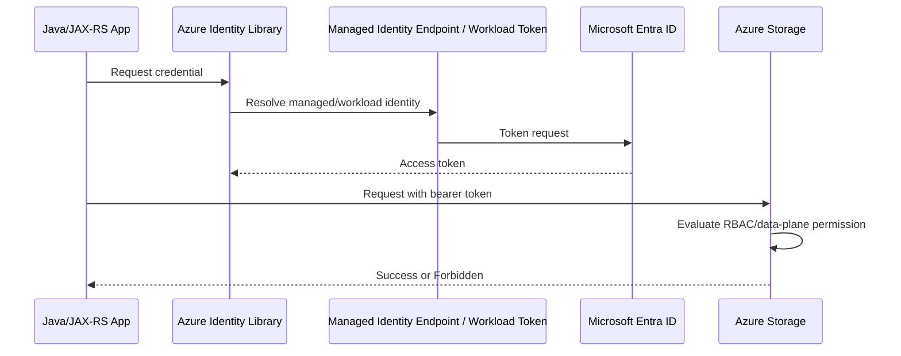

# Part 016 — Azure Identity and RBAC Deep Dive

> Fokus part ini adalah memahami Azure identity dan authorization dari sudut pandang backend engineer. Targetnya bukan sekadar tahu menu “Access control (IAM)”, tetapi mampu menjawab: tenant mana yang mengeluarkan identity, principal mana yang dipakai runtime, role assignment apa yang efektif, scope mana yang berlaku, credential chain mana yang dipilih Azure SDK, dan evidence auditnya ada di mana.

Untuk Java/JAX-RS service di AKS, VM, Azure App Service, pipeline CI/CD, atau hybrid runtime, Azure identity menentukan apakah aplikasi bisa membaca Key Vault secret, mengambil config, mengakses Blob Storage, menarik image dari ACR, menulis log, memanggil Azure resource provider, atau melakukan deployment.

Di production, Azure identity failure sering muncul sebagai:

- `AuthorizationFailed`;
- `AuthenticationFailed`;
- `AADSTS` error;
- `DefaultAzureCredential authentication failed`;
- `ManagedIdentityCredential authentication unavailable`;
- `The client does not have authorization to perform action`;
- `Caller is not authorized to perform action on scope`;
- `Forbidden` from Key Vault or Storage;
- wrong tenant;
- wrong subscription;
- wrong resource group scope;
- wrong managed identity client ID;
- missing data-plane role;
- local development berhasil dengan Azure CLI user, pod production gagal dengan workload identity.

Senior engineer harus bisa membedakan Entra authentication, Azure RBAC authorization, service-specific data-plane authorization, Key Vault policy/RBAC mode, network/private endpoint failure, dan SDK credential chain issue.

---

## 1. Azure identity mental model

Azure access has multiple layers:

```text
Who issues identity?
  -> Microsoft Entra tenant

What identity is used?
  -> user, group, service principal, managed identity, workload identity

What resource plane is being accessed?
  -> management plane or data plane

What authorization system applies?
  -> Azure RBAC, Microsoft Entra role, service-specific RBAC, access policy, ACL

At what scope?
  -> management group, subscription, resource group, resource, tenant, app registration

How does runtime obtain token?
  -> DefaultAzureCredential, ManagedIdentityCredential, WorkloadIdentityCredential, ClientSecretCredential

Where is audit evidence?
  -> Azure Activity Log, Entra sign-in logs, resource diagnostic logs, application logs
```

Do not collapse all Azure identity into “RBAC”. Azure has several authorization contexts:

- Azure RBAC for Azure resources;
- Microsoft Entra roles for directory resources;
- Kubernetes RBAC for cluster objects;
- Key Vault access policy or Azure RBAC mode;
- Storage data-plane RBAC and account keys/SAS;
- application-level OAuth scopes/roles;
- service-specific authorization model.

A precise production sentence is:

```text
The quote-api pod uses AKS Workload Identity mapped to user-assigned managed identity qno-prod-quote-api-mi.
That managed identity has Key Vault Secrets User on the prod Key Vault scope and Storage Blob Data Contributor on one container/resource scope.
The pod uses DefaultAzureCredential, which resolves workload identity in-cluster.
Azure Activity Log and Key Vault diagnostic logs provide audit evidence.
```

Not:

```text
The app has Azure access.
```

---

## 2. Azure identity vocabulary

| Term | Meaning | Production relevance |
|---|---|---|
| Microsoft Entra ID | Identity provider/directory for Azure and Microsoft cloud identity | Issues tokens and hosts users/apps/service principals |
| Tenant | Entra directory boundary | Wrong tenant causes token/auth failures |
| Subscription | Billing/resource container under tenant | Common scope for Azure RBAC |
| Resource group | Resource lifecycle/management grouping | Common scope for app environment resources |
| Resource provider | Azure service API namespace such as `Microsoft.Storage` | Impacts management-plane actions |
| User | Human identity | Developer/admin/operator access |
| Group | Collection of identities | Preferred for human access assignment |
| App registration | Application definition object | Defines client/application identity metadata |
| Service principal | Enterprise application instance in a tenant | Actual security principal used for app access |
| Managed identity | Azure-managed service principal for Azure resources | Secretless identity for workloads/resources |
| System-assigned managed identity | Identity lifecycle tied to one resource | Deleted when resource deleted |
| User-assigned managed identity | Standalone managed identity resource | Reusable across resources/workloads |
| Azure RBAC | Authorization system for Azure resources | Role assignment at management group/subscription/RG/resource scope |
| Role definition | Collection of allowed actions/data actions | Built-in or custom role |
| Role assignment | Principal + role definition + scope | Grants access |
| Scope | Where role applies | Boundary of permission |
| Data action | Data-plane permission in Azure RBAC | Needed for Blob/Queue/Key Vault data access |
| Federated credential | Trust relationship to external token issuer | Used by workload identity and secretless CI/CD |
| Activity Log | Management-plane audit log | Evidence for resource changes |

---

## 3. Azure RBAC vs Microsoft Entra roles

These are different systems.

| Area | Azure RBAC | Microsoft Entra roles |
|---|---|---|
| Governs | Azure resources | Directory/identity resources |
| Example scope | subscription, resource group, storage account, key vault | tenant, administrative unit, app registration |
| Example role | Reader, Contributor, Storage Blob Data Contributor | Global Administrator, Application Administrator |
| Used for | Manage/read Azure resources and some data-plane operations | Manage users, groups, apps, directory settings |
| Common backend relevance | App/workload access to Storage, Key Vault, ACR, Monitor | App registration/service principal management |

Backend engineers often need Azure RBAC knowledge more frequently. But Entra role awareness matters when debugging app registration, service principal, federated credential, or admin permission issues.

Bad assumption:

```text
I have Contributor on the subscription, therefore I can manage every Entra app registration.
```

Those are different control planes.

---

## 4. Management plane vs data plane

Azure separates management operations from data operations.

```text
Management plane:
  create storage account
  configure network rules
  assign RBAC
  create Key Vault
  deploy AKS

Data plane:
  read blob
  write blob
  get secret value
  send event
  query database
```

This distinction causes many production bugs.

Example:

```text
Role: Contributor on resource group
Can manage storage account configuration.
May not be able to read/write blob data unless data-plane role is assigned.
```

Common data-plane roles:

- Storage Blob Data Reader;
- Storage Blob Data Contributor;
- Key Vault Secrets User;
- Key Vault Crypto User;
- ACR pull role patterns;
- service-specific data roles.

Review question:

```text
Does the workload need management-plane access, data-plane access, or both?
```

For application runtime, prefer data-plane-only access. A Java/JAX-RS service that only uploads documents should not have rights to mutate storage account network configuration.

---

## 5. Azure role assignment anatomy

A role assignment is:

```text
Security principal + role definition + scope
```

Example mental model:

```text
Principal:
  qno-prod-quote-api-mi

Role definition:
  Storage Blob Data Contributor

Scope:
  /subscriptions/<sub-id>/resourceGroups/qno-prod-rg/providers/Microsoft.Storage/storageAccounts/qnostorage/blobServices/default/containers/quote-documents
```

Scope inheritance:

```text
Management group
  -> Subscription
    -> Resource group
      -> Resource
        -> Child resource where supported
```

If you assign at subscription scope, it applies broadly. If you assign at resource scope, blast radius is much smaller.

Production review rule:

```text
Assign at the narrowest scope that is operationally manageable.
```

---

## 6. Built-in roles and custom roles

Azure provides built-in roles. Common ones:

| Role | Typical meaning | Risk |
|---|---|---|
| Owner | Full access including role assignment | Very high risk |
| Contributor | Manage resources but not role assignments | Too broad for app runtime |
| Reader | View resources | Useful for diagnostics |
| User Access Administrator | Manage access assignments | Privilege escalation risk |
| Storage Blob Data Reader | Read blob data | Data exposure risk |
| Storage Blob Data Contributor | Read/write/delete blob data depending role | Data mutation risk |
| Key Vault Secrets User | Read secret values | Secret exposure risk |
| AcrPull | Pull image from ACR | Common for AKS/image pull |

Custom roles are useful when built-in roles are too broad. But custom roles require governance:

- versioning;
- owner;
- tested action/dataAction set;
- scope compatibility;
- migration path;
- audit evidence;
- rollback plan.

Anti-pattern:

```text
Use Contributor because exact role is hard to find.
```

Better:

```text
Identify exact management/data actions required by workload and assign narrow built-in/custom role at resource scope.
```

---

## 7. App registration and service principal

App registration and service principal are related but not identical.

Mental model:

```text
App registration:
  global/application definition metadata in a tenant

Service principal:
  concrete security principal instance in a tenant
```

When an app is registered, a service principal can be created in the tenant. That service principal can receive role assignments and authenticate using:

- client secret;
- certificate;
- federated credential;
- managed identity alternative where applicable.

For automation and workload access, service principals are common, but they carry risk if client secrets are used:

- secret leakage;
- secret expiry outage;
- manual rotation;
- reuse across environments;
- weak ownership.

Prefer managed identity or workload identity when the runtime supports it.

---

## 8. Managed identity

Managed identities are Azure-managed identities for Azure resources. Azure manages credentials, so application code does not store client secrets.

Two main types:

| Type | Lifecycle | Use case |
|---|---|---|
| System-assigned | Tied to one Azure resource | Simple one-resource identity |
| User-assigned | Independent Azure resource | Reusable, stable identity across workloads/resources |

Managed identity is still a principal. It needs role assignments.

```text
Managed identity existing does not grant access.
Role assignment grants access.
```

Example flow:



Production considerations:

- correct identity client ID;
- correct tenant;
- correct role assignment;
- correct scope;
- token cache and refresh;
- private endpoint/network path;
- diagnostic logs for data-plane denied requests.

---

## 9. AKS identity awareness

AKS has multiple identity layers:

| Layer | Purpose |
|---|---|
| Cluster identity | AKS control plane acts on Azure resources |
| Kubelet identity | Nodes pull images and interact with Azure resources |
| Kubernetes RBAC identity | User/service access to Kubernetes API |
| Workload identity | Pod authenticates to Azure services |
| Application identity | JWT/OAuth identity of end user or service caller |

Do not confuse cluster managed identity with pod workload identity.

Example failure:

```text
AKS cluster identity can access ACR.
Application pod still cannot read Key Vault.
Reason: pod workload identity has no Key Vault role assignment.
```

Part 017 goes deeper into AKS Workload Identity. For now, remember:

```text
Pod-to-Azure access should use workload identity or managed identity pattern,
not static client secrets baked into Kubernetes Secret unless explicitly justified.
```

---

## 10. Federated credentials

Federated credentials allow Azure to trust an external token issuer without storing a client secret.

Common use cases:

- AKS Workload Identity;
- GitHub Actions/Azure DevOps OIDC federation;
- Kubernetes OIDC issuer;
- secretless deployment pipeline.

Core fields to reason about:

| Field | Meaning |
|---|---|
| issuer | External token issuer URL |
| subject | Exact identity claim allowed, such as service account subject |
| audience | Token audience expected by Entra |
| target identity | App registration or managed identity receiving federation |

Failure modes:

- issuer mismatch;
- subject mismatch;
- audience mismatch;
- federated credential added to wrong identity;
- tenant policy restricts workload identity federation;
- token is valid but role assignment missing;
- local dev credential wins instead of workload identity.

---

## 11. DefaultAzureCredential and Java SDK behavior

Azure SDK for Java commonly uses `DefaultAzureCredential`. It is convenient but must be understood.

In local development, it may use developer credentials such as Azure CLI or IDE login. In Azure-hosted runtime, it may use managed identity or workload identity.

Risk:

```text
Local test succeeds because developer user has broad access.
Production pod fails because managed identity lacks data-plane role.
```

Production recommendations:

- know which credential type is expected in each environment;
- set user-assigned managed identity client ID when required;
- avoid relying on accidental credential order;
- log credential mode at startup if possible without exposing tokens;
- never log access tokens;
- test with workload identity, not only developer account;
- disable or avoid unwanted local credential sources in production packaging where possible.

For Java/JAX-RS service, identity failures should be mapped carefully:

| SDK/auth error | API response consideration |
|---|---|
| App misconfigured identity | Usually 500/internal dependency config error |
| Caller lacks business authorization | 403 at application layer |
| Azure service denies app identity | 500/502 depending dependency semantics, not user 403 unless user directly controls resource |
| Token acquisition timeout | Dependency timeout/failure path |
| Secret unavailable | Startup failure or degraded mode depending criticality |

---

## 12. Azure Activity Log and diagnostic logs

Azure Activity Log records management-plane operations. It helps answer:

```text
Who created/updated/deleted this resource?
Who changed role assignment?
Who modified network rules?
Who changed private endpoint/DNS configuration?
Who changed Key Vault settings?
```

But data-plane operations often require service diagnostic logs.

Examples:

| Service | Evidence source |
|---|---|
| Storage Blob read/write | Storage diagnostic logs / Azure Monitor |
| Key Vault secret get/list | Key Vault diagnostic logs |
| Container Registry pull | ACR logs/diagnostics where configured |
| AKS API/Kubernetes events | AKS control plane logs / Kubernetes audit if enabled |
| Azure SDK calls | Application logs + Azure Monitor/App Insights |

Audit completeness requires both management-plane and data-plane logs.

Review questions:

- Is Activity Log exported centrally?
- Are diagnostic settings enabled for Key Vault, Storage, ACR, AKS, APIM, Application Gateway?
- Are logs retained long enough for compliance/RCA?
- Can logs correlate request ID, principal ID, resource ID, and application correlation ID?

---

## 13. Azure identity impact on common services

| Component | Identity/RBAC relevance |
|---|---|
| Blob Storage | Data-plane roles, SAS strategy, private endpoint, storage firewall |
| Key Vault | RBAC/access policy mode, Secrets User, Crypto User, diagnostic logs |
| Azure App Configuration | App Configuration Data Reader/Owner patterns, labels/environment separation |
| ACR | AcrPull for node/kubelet/workload as applicable |
| AKS | Cluster identity, kubelet identity, workload identity, Kubernetes RBAC |
| PostgreSQL Flexible Server | Entra authentication if used, network private access, admin identity governance |
| Event Hubs | Data Sender/Receiver roles if using Entra auth |
| Azure Cache for Redis | Access keys/Entra auth depending SKU/features; verify internal standard |
| Application Gateway/APIM | Managed identity for certificate/key access or backend integration where used |
| Azure Monitor | Monitoring Reader/Contributor, log query permissions |

The application runtime should normally receive only the data-plane access it needs, not broad resource management access.

---

## 14. Azure RBAC debugging playbook

### Step 1 — Identify the actual principal

Ask:

```text
Which principal object ID is the runtime using?
```

Check:

- managed identity client ID/object ID;
- service principal object ID;
- pod ServiceAccount/federated credential;
- Azure SDK credential resolution logs;
- Entra sign-in logs where applicable;
- application startup configuration.

### Step 2 — Identify exact action and scope

Azure errors often include action and scope:

```text
Microsoft.Storage/storageAccounts/blobServices/containers/blobs/read
on scope /subscriptions/.../resourceGroups/.../providers/Microsoft.Storage/...
```

Capture:

- tenant ID;
- subscription ID;
- resource group;
- resource ID;
- action/dataAction;
- API endpoint;
- correlation/request ID;
- service error code.

### Step 3 — Determine management plane or data plane

Ask:

```text
Is this operation managing the resource or reading/writing data inside it?
```

If data plane, `Contributor` may not be enough.

### Step 4 — Inspect role assignments

Check:

- role assigned to correct principal object ID;
- role assigned at correct scope;
- role includes required action/dataAction;
- inherited role applies as expected;
- deny assignment or policy blocks operation;
- role assignment propagation delay;
- custom role definition includes required operations.

### Step 5 — Check service-specific controls

Even with RBAC:

- Storage firewall/private endpoint may block network;
- Key Vault network ACL may block access;
- Key Vault may use access policy mode instead of RBAC mode;
- APIM/Application Gateway may require managed identity/cert config;
- ACR pull may depend on kubelet identity, not app identity;
- AKS pod may use wrong workload identity.

---

## 15. Common Azure identity failure modes

| Failure mode | Symptom | Detection | Fix direction |
|---|---|---|---|
| Wrong tenant | AADSTS/authentication error | token issuer/tenant logs | Correct tenant authority/config |
| Wrong subscription | Resource not found or AuthorizationFailed | resource ID/account context | Correct subscription/context |
| Role on wrong principal | AuthorizationFailed | compare object IDs | Assign role to actual principal |
| Role on too narrow/wrong scope | AuthorizationFailed | role assignment list | Assign at correct resource/container/RG scope |
| Missing data-plane role | Forbidden on Blob/Key Vault | service diagnostic logs | Add data-specific role |
| Managed identity client ID wrong | DefaultAzureCredential failure | SDK logs/env config | Set correct client ID |
| Federated credential mismatch | Workload identity token rejected | Entra sign-in/error | Fix issuer/subject/audience |
| Propagation delay | Newly assigned role still denied | time correlation | Wait/retry operationally, avoid just-in-time deploy dependency |
| Key Vault mode mismatch | Role assigned but secret denied | Key Vault access config | Verify RBAC vs access policy mode |
| Network mistaken as RBAC | Timeout or forbidden depending service | private endpoint/firewall logs | Fix DNS/firewall/private endpoint |

---

## 16. Conditional Access and PIM awareness

Backend engineers do not usually administer Conditional Access or PIM, but must know their operational impact.

Conditional Access can affect human/developer access and sometimes workload/automation policies depending tenant configuration. It may cause:

- interactive login required;
- MFA challenge;
- blocked legacy auth;
- location/device restriction;
- tenant-level policy surprise during incident.

Privileged Identity Management provides just-in-time privileged access. It may cause:

- role not active until activated;
- time-limited admin access;
- approval workflow;
- audit trail for privileged operations.

Incident implication:

```text
A developer may “have” a role but it is eligible, not active.
Emergency changes may require PIM activation and approval.
```

Internal runbooks should explain this before an outage.

---

## 17. PR review checklist for Azure identity/RBAC

### Principal and credential

- Which principal will the app use?
- Is it user, service principal, managed identity, or workload identity?
- Is the object ID/client ID correct?
- Is a client secret being introduced?
- Can managed identity/workload identity replace the secret?
- Is credential rotation required?

### Scope and role

- What exact scope is used?
- Is assignment at subscription scope really necessary?
- Is resource/container/key-vault scope possible?
- Is role management-plane or data-plane?
- Does built-in role overgrant?
- Is custom role versioned and reviewed?

### AKS/workload identity

- Is OIDC issuer enabled?
- Is federated credential on the correct identity?
- Does subject match namespace and ServiceAccount?
- Does pod use that ServiceAccount?
- Is user-assigned managed identity client ID configured?
- Does workload identity have required RBAC role assignment?

### Audit and operations

- Are Activity Log and diagnostic logs enabled?
- Is role assignment change auditable?
- Is there a rollback plan?
- Could propagation delay break deployment?
- Does application log enough request/correlation info?
- Does this change affect prod, non-prod, or shared subscription?

---

## 18. Internal verification checklist

Verify with platform/SRE/security/backend team:

- Microsoft Entra tenant ID used by each environment.
- Azure subscription per environment.
- Management group hierarchy.
- Resource group naming convention.
- Azure RBAC assignment standard.
- Approved built-in/custom roles.
- Who can assign roles.
- PIM requirement for privileged roles.
- Conditional Access impact on engineers and automation.
- Service principal usage and secret rotation policy.
- Managed identity naming convention.
- User-assigned managed identity strategy.
- AKS cluster identity and kubelet identity.
- AKS Workload Identity pattern.
- Key Vault authorization mode: RBAC or access policy.
- Storage data-plane role standard.
- ACR pull identity model.
- Activity Log export location.
- Diagnostic logs enabled for Key Vault/Storage/ACR/AKS.
- Incident examples involving `AuthorizationFailed` or `DefaultAzureCredential`.

---

## 19. Senior engineer heuristics

- Azure RBAC role assignment is principal + role + scope. Missing one means no access.
- Contributor is not a good application runtime role.
- Management-plane access does not automatically mean data-plane access.
- App registration is not the same thing as service principal.
- Managed identity existing does not mean it has permissions.
- User-assigned managed identity is often better for stable workload identity.
- Local success with Azure CLI credential does not prove production identity works.
- Key Vault and Storage often fail because data-plane role or network control is missing.
- Always compare object IDs, not just display names.
- Activity Log is not enough for data-plane audit; enable diagnostic logs.
- Assign at narrow scope unless operations demand broader scope.
- Treat client secrets as exceptions that need rotation, owner, and expiry monitoring.

---

## 20. References

- Azure RBAC overview and role assignments: https://learn.microsoft.com/en-us/azure/role-based-access-control/role-assignments-portal
- Azure built-in roles: https://learn.microsoft.com/en-us/azure/role-based-access-control/built-in-roles
- Managed identities for Azure resources: https://learn.microsoft.com/en-us/entra/identity/managed-identities-azure-resources/overview
- Register Microsoft Entra app and create service principal: https://learn.microsoft.com/en-us/entra/identity-platform/howto-create-service-principal-portal
- AKS Workload Identity overview: https://learn.microsoft.com/en-us/azure/aks/workload-identity-overview
- AKS managed identity overview: https://learn.microsoft.com/en-us/azure/aks/managed-identity-overview
- Azure Identity client library for Java: https://learn.microsoft.com/en-us/java/api/overview/azure/identity-readme
- Microsoft Entra role-based access control overview: https://learn.microsoft.com/en-us/entra/identity/role-based-access-control/custom-overview
