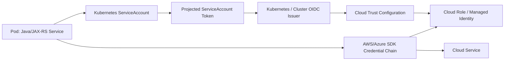
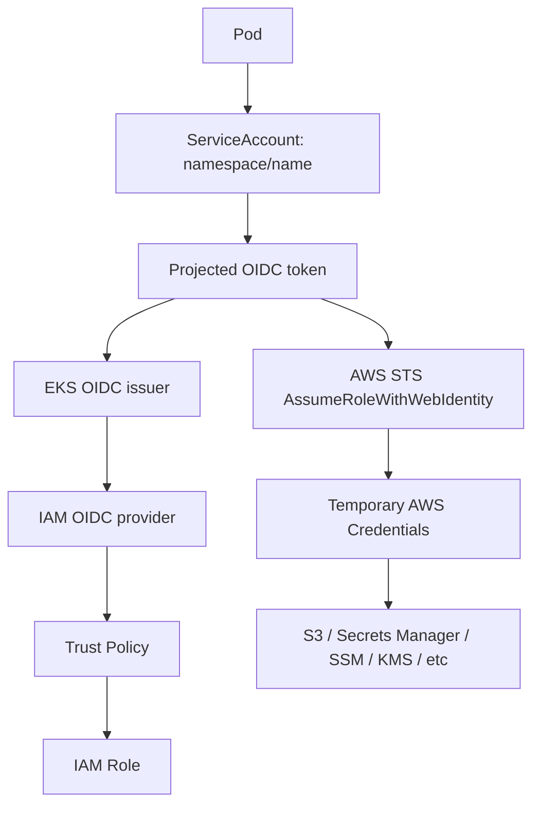
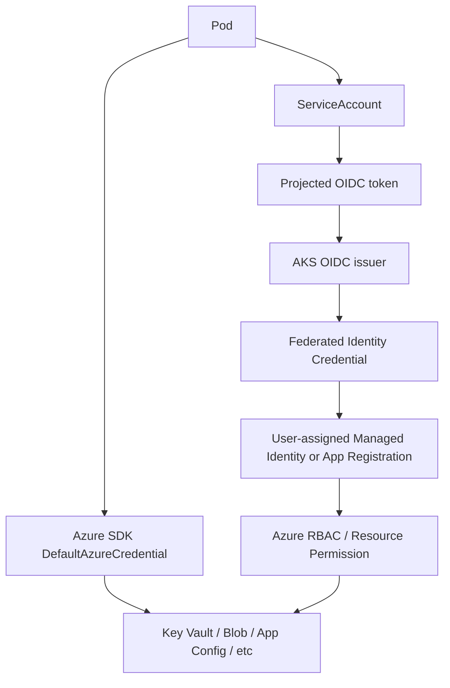

# Part 017 — Kubernetes Workload Identity on AWS and Azure

> Fokus part ini adalah menjawab satu pertanyaan production yang sangat penting: **bagaimana pod Java/JAX-RS mendapatkan hak akses ke cloud service tanpa menyimpan access key, client secret, atau credential statis di Kubernetes Secret?**

Dalam enterprise backend system, workload identity adalah salah satu boundary keamanan paling penting. Aplikasi mungkin perlu membaca secret, mengambil config, upload file ke object storage, publish event, membaca parameter, mengakses managed PostgreSQL, mengambil certificate, atau memanggil API internal. Semua call tersebut membutuhkan identitas runtime yang jelas.

Tanpa workload identity yang benar, tim biasanya jatuh ke salah satu anti-pattern berikut:

- access key disimpan sebagai Kubernetes Secret;
- service principal secret disimpan sebagai environment variable;
- node role terlalu luas dan dipakai semua pod;
- semua service menggunakan satu shared credential;
- local credential developer terbawa ke container;
- permission production lebih luas dari kebutuhan;
- audit log tidak bisa menjawab service mana yang melakukan action;
- rotating credential menjadi operasi berisiko tinggi.

Workload identity menyelesaikan masalah ini dengan pola: **pod membawa identitas Kubernetes, cloud provider mempercayai token Kubernetes tertentu, lalu SDK menukar token itu menjadi credential cloud sementara**.

---

## 1. Problem utama: pod butuh identitas cloud

Aplikasi Java/JAX-RS biasanya tidak hidup sendirian. Ia memanggil dependency seperti:

- AWS S3 atau Azure Blob Storage untuk document, attachment, export/import;
- AWS Secrets Manager atau Azure Key Vault untuk secret;
- AWS Systems Manager Parameter Store atau Azure App Configuration untuk config;
- AWS KMS atau Azure Key Vault Keys untuk encryption/decryption;
- Amazon MSK, Amazon MQ, Event Hubs, atau broker internal;
- CloudWatch atau Azure Monitor untuk telemetry;
- private API internal;
- container registry saat image pull.

Setiap call cloud memiliki tiga pertanyaan:

1. **Siapa caller-nya?**
2. **Apa caller boleh melakukan action tersebut?**
3. **Bagaimana bukti caller itu diaudit?**

Workload identity membuat jawaban atas tiga pertanyaan itu explicit.

```text
Pod identity problem

Java/JAX-RS pod
  needs to call cloud service
    ↓
Should not use static cloud keys
Should not inherit broad node identity
Should be least-privilege
Should be auditable per service
Should rotate automatically
```

---

## 2. Core mental model

Workload identity menghubungkan identity Kubernetes dengan identity cloud.



Konsep intinya:

| Layer | Fungsi |
|---|---|
| Kubernetes ServiceAccount | Identitas workload di cluster |
| Projected token | Token OIDC yang diberikan ke pod |
| OIDC issuer | Pihak yang menerbitkan token dan bisa diverifikasi cloud |
| Trust relationship | Cloud identity mempercayai token tertentu |
| Cloud role/managed identity | Identitas cloud yang membawa permission |
| SDK credential chain | SDK membaca credential/token dari environment runtime |
| Cloud service authorization | IAM/RBAC/resource policy menentukan action yang diizinkan |

Hal penting: ServiceAccount Kubernetes **bukan** IAM role AWS dan **bukan** Azure Managed Identity. ServiceAccount hanya menjadi subject yang dipercaya oleh cloud identity tertentu.

---

## 3. Lifecycle workload identity

Workload identity memiliki lifecycle yang harus dipahami sebagai bagian dari production readiness:

```text
1. Platform enables OIDC issuer on cluster
2. Cloud identity is created
3. Trust/federation rule is configured
4. Cloud permission is assigned
5. Kubernetes ServiceAccount is created/annotated
6. Pod is configured to use the ServiceAccount
7. Token is projected into pod
8. SDK discovers token and identity metadata
9. SDK exchanges token for short-lived cloud credential
10. SDK signs request / obtains access token
11. Cloud service authorizes action
12. Audit log records caller identity and action
13. Token/credential rotates automatically
```

Jika satu langkah salah, symptom-nya bisa terlihat sama: `AccessDenied`, `CredentialUnavailable`, `403`, `InvalidIdentityToken`, `NoCredentialsProvider`, `AuthorizationFailed`, atau timeout.

Senior engineer harus men-debug dari lifecycle, bukan dari error string saja.

---

## 4. AWS implementation: IRSA mental model

Di AWS EKS, model umum yang paling dikenal adalah **IAM Roles for Service Accounts** atau IRSA.

IRSA menghubungkan Kubernetes ServiceAccount dengan IAM role.



IRSA bergantung pada beberapa komponen:

| Komponen | Fungsi |
|---|---|
| EKS OIDC issuer | Menerbitkan token ServiceAccount |
| IAM OIDC provider | Mendaftarkan issuer EKS di IAM |
| IAM role | Identity AWS yang akan diasumsikan pod |
| Trust policy | Membatasi ServiceAccount mana yang boleh assume role |
| Permission policy | Action AWS yang boleh dilakukan |
| ServiceAccount annotation | Mengikat SA ke IAM role ARN |
| AWS SDK credential chain | Membaca web identity token dan role ARN |
| STS | Menukar token menjadi temporary credentials |

---

## 5. AWS IRSA trust relationship

Trust policy adalah boundary paling penting dalam IRSA.

Contoh struktur trust policy:

```json
{
  "Version": "2012-10-17",
  "Statement": [
    {
      "Effect": "Allow",
      "Principal": {
        "Federated": "arn:aws:iam::<account-id>:oidc-provider/oidc.eks.<region>.amazonaws.com/id/<oidc-id>"
      },
      "Action": "sts:AssumeRoleWithWebIdentity",
      "Condition": {
        "StringEquals": {
          "oidc.eks.<region>.amazonaws.com/id/<oidc-id>:aud": "sts.amazonaws.com",
          "oidc.eks.<region>.amazonaws.com/id/<oidc-id>:sub": "system:serviceaccount:<namespace>:<service-account-name>"
        }
      }
    }
  ]
}
```

Yang harus diperhatikan:

- `Principal.Federated` harus mengarah ke OIDC provider cluster yang benar.
- `Action` harus `sts:AssumeRoleWithWebIdentity`.
- `aud` biasanya `sts.amazonaws.com`.
- `sub` harus menunjuk ke ServiceAccount yang tepat.
- Namespace adalah bagian dari identity boundary.
- Wildcard pada `sub` harus sangat hati-hati.
- Role permission policy harus least privilege.

Anti-pattern yang sering terjadi:

```text
Trust policy terlalu longgar:
  system:serviceaccount:*:*

Dampak:
  ServiceAccount mana pun di cluster bisa mencoba assume role.

Trust policy terlalu sempit:
  namespace atau serviceAccount typo

Dampak:
  Pod terlihat benar tetapi STS menolak token.
```

---

## 6. AWS ServiceAccount annotation

ServiceAccount EKS biasanya diberi annotation role ARN.

```yaml
apiVersion: v1
kind: ServiceAccount
metadata:
  name: quote-document-service
  namespace: quote-order
  annotations:
    eks.amazonaws.com/role-arn: arn:aws:iam::123456789012:role/quote-document-service-prod-role
```

Deployment harus menggunakan ServiceAccount tersebut:

```yaml
apiVersion: apps/v1
kind: Deployment
metadata:
  name: quote-document-service
  namespace: quote-order
spec:
  template:
    spec:
      serviceAccountName: quote-document-service
      containers:
        - name: app
          image: example/quote-document-service:1.0.0
```

Jika `serviceAccountName` tidak diset, pod mungkin memakai `default` ServiceAccount. Ini bisa menghasilkan credential missing atau, lebih buruk, workload memakai identity yang tidak dimaksudkan.

---

## 7. AWS SDK credential resolution with IRSA

Aplikasi Java tidak perlu hardcode credential provider jika menggunakan AWS SDK dengan benar.

Pola yang diinginkan:

```java
S3Client s3 = S3Client.builder()
    .region(Region.AP_SOUTHEAST_1)
    .build();
```

SDK akan mencari credential melalui default credential provider chain. Dalam konteks IRSA, runtime biasanya menyediakan:

```text
AWS_ROLE_ARN
AWS_WEB_IDENTITY_TOKEN_FILE
```

Lalu SDK menggunakan web identity token untuk memanggil STS dan memperoleh temporary credentials.

Hal yang harus dihindari:

```java
// Anti-pattern: static key di code/config
AwsBasicCredentials creds = AwsBasicCredentials.create(accessKey, secretKey);
S3Client s3 = S3Client.builder()
    .credentialsProvider(StaticCredentialsProvider.create(creds))
    .build();
```

Static credential merusak rotation, auditability, blast-radius control, dan biasanya sulit dibuktikan aman saat compliance review.

---

## 8. AWS IRSA failure modes

| Symptom | Kemungkinan akar masalah |
|---|---|
| `NoCredentialsProvider` | SDK tidak menemukan web identity token atau env var tidak ada |
| `AccessDenied: sts:AssumeRoleWithWebIdentity` | Trust policy salah, `sub`/`aud` mismatch, OIDC provider salah |
| `InvalidIdentityToken` | Token tidak valid, issuer mismatch, OIDC provider tidak terdaftar |
| `AccessDenied` ke S3/Secrets Manager | Assume role berhasil, tetapi permission policy kurang |
| Local berhasil, pod gagal | Local memakai developer credential, pod memakai IRSA role yang lebih sempit |
| Pod A bisa akses resource Pod B | Role/SA reuse atau policy terlalu longgar |
| Credential expired | SDK version/config tidak refresh credential dengan benar, long-running call bermasalah |
| CloudTrail tidak jelas | Role naming buruk atau semua workload share role |
| Network timeout ke STS | Private subnet tidak punya path ke STS endpoint/NAT/VPC endpoint jika digunakan |

IRSA failure harus dipisahkan menjadi:

1. credential discovery failure;
2. token/trust failure;
3. STS exchange failure;
4. authorization failure ke target service;
5. network/private endpoint failure;
6. SDK/runtime configuration failure.

---

## 9. AWS IRSA debugging path

Gunakan urutan ini sebelum menyimpulkan “IAM rusak”.

```text
1. Cek pod memakai ServiceAccount yang benar
2. Cek ServiceAccount punya annotation role ARN
3. Cek env var AWS_ROLE_ARN dan AWS_WEB_IDENTITY_TOKEN_FILE di pod
4. Cek token file ada dan readable
5. Cek IAM OIDC provider untuk cluster
6. Cek trust policy role
7. Cek permission policy role
8. Cek CloudTrail untuk AssumeRoleWithWebIdentity
9. Cek CloudTrail untuk target action
10. Cek network path ke STS dan target service
11. Cek SDK version dan credential provider override
```

Command yang sering berguna:

```bash
kubectl -n quote-order get pod <pod> -o yaml | grep -A5 serviceAccountName
kubectl -n quote-order get sa quote-document-service -o yaml
kubectl -n quote-order exec -it <pod> -- env | grep AWS_
kubectl -n quote-order exec -it <pod> -- ls -l $AWS_WEB_IDENTITY_TOKEN_FILE
```

Jangan mencetak isi token di log production. Token adalah credential material walaupun short-lived.

---

## 10. AWS EKS Pod Identity awareness

AWS juga memiliki **EKS Pod Identity** sebagai mekanisme yang lebih baru untuk memberikan IAM permission ke pod. Ia tidak sama dengan IRSA dan memiliki komponen seperti EKS Pod Identity Agent.

Untuk seri ini, fokus utama tetap IRSA karena ia muncul eksplisit dalam target daftar isi dan masih umum di production. Namun saat membaca architecture internal, jangan mengasumsikan semua EKS cluster memakai IRSA.

Internal verification:

- Apakah cluster memakai IRSA?
- Apakah cluster memakai EKS Pod Identity?
- Apakah ada transisi dari IRSA ke Pod Identity?
- Apakah SDK Java version mendukung mekanisme yang dipakai?
- Apakah audit dan runbook membedakan keduanya?

---

## 11. Azure implementation: Workload Identity mental model

Di AKS, pola modern adalah **Microsoft Entra Workload ID** atau sering disebut Azure Workload Identity.

Ia menghubungkan Kubernetes ServiceAccount dengan Azure identity melalui federated identity credential.



Komponen penting:

| Komponen | Fungsi |
|---|---|
| AKS OIDC issuer | Menerbitkan token untuk ServiceAccount |
| Workload Identity webhook | Menginjeksi environment variable/token path ke pod |
| Federated identity credential | Mengizinkan Entra identity mempercayai token Kubernetes tertentu |
| Managed identity / app registration | Identity Azure yang dipakai workload |
| Azure RBAC / resource policy | Permission terhadap resource target |
| ServiceAccount annotation | Menghubungkan SA ke client ID |
| Azure SDK credential chain | DefaultAzureCredential membaca workload identity config |

---

## 12. Azure Workload Identity ServiceAccount

Contoh ServiceAccount untuk Azure Workload Identity:

```yaml
apiVersion: v1
kind: ServiceAccount
metadata:
  name: quote-document-service
  namespace: quote-order
  annotations:
    azure.workload.identity/client-id: "<user-assigned-managed-identity-client-id>"
```

Pod biasanya diberi label agar webhook melakukan injection:

```yaml
apiVersion: apps/v1
kind: Deployment
metadata:
  name: quote-document-service
  namespace: quote-order
spec:
  template:
    metadata:
      labels:
        azure.workload.identity/use: "true"
    spec:
      serviceAccountName: quote-document-service
      containers:
        - name: app
          image: example.azurecr.io/quote-document-service:1.0.0
```

Detail label/annotation dapat berbeda tergantung versi dan standar platform. Jangan menghafal manifest sebagai kebenaran universal. Gunakan sebagai mental model dan verifikasi pada cluster internal.

---

## 13. Azure federated identity credential

Federated identity credential mengikat Azure identity ke subject token Kubernetes.

Elemen utamanya:

| Field | Makna |
|---|---|
| issuer | OIDC issuer URL dari AKS cluster |
| subject | Kubernetes ServiceAccount subject |
| audience | Audience token yang diharapkan |
| parent identity | Managed identity atau app registration |

Subject biasanya berbentuk:

```text
system:serviceaccount:<namespace>:<service-account-name>
```

Jika namespace atau ServiceAccount salah, token valid tetapi tidak dipercaya oleh identity Azure.

---

## 14. Azure SDK credential resolution

Untuk Java service, pola umum adalah memakai `DefaultAzureCredential`.

```java
TokenCredential credential = new DefaultAzureCredentialBuilder().build();

SecretClient secretClient = new SecretClientBuilder()
    .vaultUrl("https://<vault-name>.vault.azure.net/")
    .credential(credential)
    .buildClient();
```

Di AKS dengan Workload Identity, credential chain membaca environment variable yang diinjeksi ke pod, misalnya identity/client id, tenant id, dan token file. SDK kemudian memperoleh token Entra untuk resource target.

Hal yang perlu dipahami:

- `DefaultAzureCredential` sangat nyaman, tetapi bisa menyembunyikan credential source.
- Local development mungkin memakai Azure CLI credential.
- Pod production harus memakai workload identity, bukan developer identity.
- Jika chain mencoba credential yang salah duluan, error bisa membingungkan.
- Untuk debugging, log credential source dengan aman tanpa mencetak secret/token.

---

## 15. Azure RBAC vs Key Vault access model

Workload identity hanya membuktikan “siapa caller”. Permission tetap harus diberikan.

Contoh:

```text
AKS ServiceAccount
  ↓ federation
User-assigned Managed Identity
  ↓ role assignment
Storage Blob Data Contributor on storage account/container
  ↓
Blob upload allowed
```

Untuk Azure Key Vault, organisasi bisa memakai Azure RBAC model atau access policy model tergantung konfigurasi. Ini harus diverifikasi internal.

Failure yang sering terjadi:

- managed identity benar, tapi tidak punya role pada scope resource;
- role diberikan pada subscription yang salah;
- role diberikan pada resource group yang berbeda;
- Key Vault memakai access policy tetapi engineer hanya cek Azure RBAC;
- role assignment baru dibuat tetapi propagation belum efektif;
- private endpoint benar, tetapi identity authorization gagal;
- identity benar, tetapi tenant salah.

---

## 16. AWS vs Azure workload identity comparison

| Concern | AWS IRSA | Azure Workload Identity |
|---|---|---|
| Kubernetes identity | ServiceAccount | ServiceAccount |
| Token issuer | EKS OIDC issuer | AKS OIDC issuer |
| Trust object | IAM role trust policy | Federated identity credential |
| Cloud identity | IAM role | Managed identity or app registration |
| Token exchange | STS AssumeRoleWithWebIdentity | Microsoft Entra token flow |
| SDK default path | AWS default credential provider chain | Azure DefaultAzureCredential / WorkloadIdentityCredential |
| Permission model | IAM identity/resource policies | Azure RBAC/resource-specific access model |
| Audit | CloudTrail | Activity Log/resource diagnostics/sign-in logs where applicable |
| Common failure | trust policy `sub`/`aud` mismatch | federated credential / role assignment mismatch |
| Runtime env | `AWS_ROLE_ARN`, `AWS_WEB_IDENTITY_TOKEN_FILE` | workload identity env vars/token file |

Persamaannya: keduanya menghindari static credential dan menggunakan short-lived credential/token.

Perbedaannya: AWS lebih eksplisit pada IAM role + STS; Azure lebih terikat pada Entra identity, managed identity/app registration, dan role assignment scope.

---

## 17. ServiceAccount design discipline

ServiceAccount bukan sekadar YAML tambahan. ServiceAccount adalah identity boundary.

Prinsip desain:

- satu ServiceAccount per deployable service;
- jangan memakai ServiceAccount `default` untuk workload production;
- jangan share ServiceAccount untuk service dengan permission berbeda;
- namespace menjadi bagian dari trust boundary;
- nama ServiceAccount harus cukup jelas untuk audit;
- role/identity cloud harus mengikuti nama workload;
- permission harus mengikuti use case, bukan convenience;
- gunakan separate identity per environment;
- jangan reuse identity prod untuk non-prod;
- jangan memberi wildcard permission untuk mempercepat debugging.

Contoh naming:

```text
namespace: quote-order
serviceAccount: quote-document-service
AWS IAM role: quote-document-service-prod-role
Azure managed identity: mi-quote-document-service-prod
```

Naming bukan keamanan, tetapi naming yang jelas mempercepat audit, debugging, dan incident triage.

---

## 18. Token projection and rotation

Kubernetes projected ServiceAccount token biasanya memiliki expiry dan audience. Ini berbeda dari legacy long-lived ServiceAccount token.

Hal yang perlu diketahui backend engineer:

- token file bisa berubah/dirotasi;
- SDK harus mampu refresh credential;
- jangan membaca token sendiri lalu cache selamanya;
- jangan copy token ke log;
- jangan bake token ke config;
- long-running SDK client seharusnya menggunakan provider yang refresh otomatis;
- container restart bukan strategi credential rotation yang ideal, tetapi kadang menjadi mitigation sementara.

Failure mode:

```text
Application starts
  ↓
Reads token manually into static variable
  ↓
Token expires
  ↓
Cloud call starts failing
  ↓
Only pod restart fixes it
```

Pola yang benar: biarkan SDK credential provider membaca dan refresh credential sesuai lifecycle-nya.

---

## 19. Impact ke Java/JAX-RS backend

Workload identity memengaruhi aplikasi Java/JAX-RS dalam beberapa area:

| Area | Dampak |
|---|---|
| Startup | SDK client mungkin validasi credential saat first call, bukan saat startup |
| Readiness | readiness check sebaiknya tidak terlalu agresif memanggil cloud dependency |
| Error mapping | bedakan 401/403 cloud dependency dari 500 internal logic |
| Retry | auth failure jangan diretry tanpa batas |
| Timeout | token exchange dan target service call butuh timeout eksplisit |
| Logging | jangan log token, access key, Authorization header, SAS, presigned URL |
| Observability | catat dependency name, operation, status, latency, request id |
| Local dev | local credential source harus berbeda dari production workload identity |
| Testing | integration test harus bisa menggunakan identity test yang terbatas |
| Multi-tenant | identity per tenant jarang cocok; biasanya authorization tetap di app/domain layer |

Jangan membuat business logic tergantung langsung pada detail credential chain. Bungkus cloud client dalam adapter yang observable dan testable.

---

## 20. Impact ke PostgreSQL, Kafka, RabbitMQ, Redis, Camunda, dan NGINX

Workload identity tidak hanya soal object storage atau secret manager.

| Komponen | Dampak workload identity |
|---|---|
| PostgreSQL | Digunakan untuk mengambil DB password dari secret manager atau memakai cloud IAM auth jika diterapkan |
| Kafka/MSK/Event Hubs | Bisa terkait SASL/IAM/OAuth credential, schema registry, config access |
| RabbitMQ/Amazon MQ | Secret retrieval, certificate retrieval, broker admin operation |
| Redis | Secret retrieval untuk AUTH/ACL, certificate jika TLS |
| Camunda | Worker/service mungkin butuh secret/config/object storage/event access |
| NGINX/Ingress | Certificate retrieval, external DNS/controller permissions, load balancer controller identity |
| Kubernetes controllers | External Secrets, CSI driver, ingress controller, external-dns juga butuh workload identity |

Jangan hanya mengecek identity aplikasi. Controller platform di cluster juga memiliki identity cloud dan bisa menjadi blast radius besar.

---

## 21. EKS-specific checklist

Untuk EKS, review minimal:

- cluster OIDC issuer aktif;
- IAM OIDC provider terdaftar di account yang benar;
- ServiceAccount memiliki annotation role ARN yang benar;
- pod menggunakan ServiceAccount tersebut;
- trust policy role membatasi `sub` dan `aud`;
- permission policy role least privilege;
- SDK Java version mendukung web identity token;
- STS endpoint reachable dari pod;
- CloudTrail menunjukkan `AssumeRoleWithWebIdentity`;
- target service log menunjukkan role yang benar;
- tidak ada static AWS keys di Secret/env var;
- node role tidak dipakai sebagai fallback tidak sengaja.

---

## 22. AKS-specific checklist

Untuk AKS, review minimal:

- OIDC issuer AKS aktif;
- workload identity enabled;
- mutating webhook berjalan;
- ServiceAccount memiliki annotation client ID yang benar;
- pod memiliki label/konfigurasi workload identity sesuai standar cluster;
- federated identity credential memiliki issuer, subject, audience yang benar;
- managed identity/app registration berada di tenant/subscription yang benar;
- role assignment berada pada scope resource yang benar;
- Azure SDK Java version mendukung Workload Identity;
- resource target seperti Key Vault/Storage menggunakan permission model yang dipahami;
- private endpoint DNS tidak disalahartikan sebagai auth failure;
- Activity Log/resource logs menunjukkan identity yang benar.

---

## 23. On-prem and hybrid considerations

Workload identity EKS/AKS bekerja paling natural di managed Kubernetes cloud. Namun enterprise sering punya hybrid/on-prem deployment.

Pertanyaan penting:

- Jika service berjalan on-prem, apakah ia tetap memakai cloud SDK?
- Apakah on-prem workload bisa memakai workload identity federation?
- Apakah ada service principal/role assumption khusus untuk on-prem?
- Apakah credential disimpan di vault internal?
- Apakah network path ke cloud identity endpoint tersedia?
- Apakah proxy memengaruhi token exchange?
- Apakah DNS private endpoint resolve dari on-prem?
- Apakah audit log tetap bisa mengaitkan action ke workload tertentu?

Jangan memaksakan pola EKS/AKS ke on-prem tanpa verifikasi. Hybrid identity sering memiliki constraint berbeda.

---

## 24. Correctness concerns

Workload identity bisa memengaruhi correctness aplikasi.

Contoh:

- service gagal upload file karena permission `PutObject` kurang;
- service bisa upload tetapi tidak bisa read-back karena `GetObject` tidak ada;
- secret version baru tidak bisa dibaca karena policy hanya mengizinkan path lama;
- config rollback gagal karena identity tidak punya permission ke version sebelumnya;
- retry auth failure menciptakan traffic tinggi tetapi tidak pernah sukses;
- role salah environment menyebabkan service membaca resource dev dari prod atau sebaliknya;
- shared identity membuat audit tidak bisa memisahkan caller;
- permission terlalu luas memungkinkan service menulis object ke prefix tenant lain.

Correctness bukan hanya validasi business rule. Correctness juga berarti aplikasi mengakses resource cloud yang benar, dengan permission yang benar, pada environment yang benar.

---

## 25. Networking concerns

Credential exchange juga membutuhkan network.

AWS:

- pod perlu mencapai STS endpoint;
- target service mungkin lewat public endpoint, NAT, VPC endpoint, atau PrivateLink;
- DNS untuk endpoint harus benar;
- security group/NACL/firewall dapat memblokir;
- private subnet tanpa NAT/VPC endpoint bisa gagal token exchange atau target call.

Azure:

- pod perlu mencapai Entra token endpoint;
- target service bisa lewat public endpoint atau private endpoint;
- private DNS zone harus terhubung ke VNet;
- NSG/UDR/firewall dapat memblokir;
- proxy/TLS inspection bisa memengaruhi SDK credential chain.

Jangan menyimpulkan identity salah sebelum membuktikan network path benar.

---

## 26. Security concerns

Security checklist untuk workload identity:

- tidak ada static cloud credential di code, image, Secret, ConfigMap, Helm values, atau CI log;
- trust policy/federated credential membatasi namespace dan ServiceAccount spesifik;
- permission policy least privilege;
- identity berbeda per service dan environment;
- no wildcard resource kecuali benar-benar diperlukan dan dijelaskan;
- audit log aktif;
- token tidak dicetak di log;
- SDK debug logging tidak membocorkan header sensitif;
- local developer credential tidak bisa menyentuh prod;
- break-glass access jelas;
- role assignment memiliki owner dan review cadence.

---

## 27. Performance concerns

Workload identity bisa menambah latency jika salah konfigurasi:

- SDK membuat client baru per request sehingga credential resolution berulang;
- STS/token endpoint call terjadi terlalu sering;
- credential cache tidak efektif;
- network ke identity endpoint lambat;
- retry token exchange memperpanjang request latency;
- cold start memanggil banyak cloud dependency sekaligus;
- setiap request membaca secret/config langsung dari cloud service.

Pola yang lebih baik:

- buat SDK client sebagai singleton atau managed bean;
- biarkan credential provider cache/refresh otomatis;
- cache secret/config dengan TTL yang aman;
- beri timeout eksplisit;
- instrument dependency latency;
- jangan melakukan credential validation berat di setiap request.

---

## 28. Cost concerns

Workload identity sendiri biasanya bukan cost driver utama, tetapi pola salah di sekitarnya bisa mahal:

- retry storm ke STS/token endpoint;
- secret/config fetch per request;
- private endpoint/NAT traffic meningkat;
- excessive logging saat credential failure;
- cross-region call karena endpoint/region salah;
- running duplicate workload karena identity issue dianggap capacity issue;
- debugging dengan log level terlalu verbose di production.

Cost review harus melihat call volume ke identity, secret, config, storage, dan observability service.

---

## 29. Observability concerns

Minimal telemetry untuk cloud identity flow:

- dependency call name;
- cloud operation;
- status/error code;
- latency;
- retry count;
- throttling count;
- credential source category, tanpa secret;
- target region/endpoint;
- cloud request id;
- correlation id dari inbound request.

Contoh log yang aman:

```json
{
  "event": "cloud_dependency_call_failed",
  "dependency": "aws.s3",
  "operation": "PutObject",
  "bucketAlias": "quote-documents-prod",
  "status": "AccessDenied",
  "awsRequestId": "...",
  "credentialSource": "irsa",
  "serviceAccount": "quote-order/quote-document-service",
  "correlationId": "..."
}
```

Jangan log:

- token file content;
- Authorization header;
- access key;
- secret key;
- session token;
- SAS token;
- presigned URL lengkap jika mengandung signature.

---

## 30. Troubleshooting scenario: pod cannot access S3

```text
Symptom:
  Java service returns 500 during document upload.
  Logs show AccessDenied from S3 PutObject.

Reasoning path:
  1. Is S3 DNS reachable?
  2. Is the error from S3 authorization or network timeout?
  3. Which role did pod assume?
  4. Did STS AssumeRoleWithWebIdentity succeed?
  5. Does role policy allow s3:PutObject on exact bucket/prefix?
  6. Does bucket policy deny this role?
  7. Is KMS key policy also allowing encryption if bucket uses SSE-KMS?
  8. Is app writing to correct bucket/environment/prefix?
```

Common hidden issue: IAM role allows `s3:PutObject`, but KMS key policy does not allow `kms:Encrypt` for the role.

---

## 31. Troubleshooting scenario: pod cannot read Azure Key Vault

```text
Symptom:
  Java service fails startup while reading secret from Key Vault.
  Error says authentication succeeded but authorization failed.

Reasoning path:
  1. Is DefaultAzureCredential using WorkloadIdentityCredential?
  2. Is ServiceAccount annotation client ID correct?
  3. Is federated identity credential subject correct?
  4. Is managed identity in correct tenant/subscription?
  5. Does identity have permission on Key Vault?
  6. Is Key Vault using Azure RBAC or access policy model?
  7. Is private endpoint DNS resolving correctly?
  8. Is firewall denying the request?
```

Common hidden issue: engineer grants Azure RBAC role, but Key Vault is configured to use access policies, or vice versa.

---

## 32. PR review checklist

Saat mereview PR yang menambah cloud access dari pod:

- ServiceAccount baru atau reuse?
- Namespace benar?
- Identity berbeda per environment?
- AWS trust policy atau Azure federated credential membatasi subject spesifik?
- Permission policy least privilege?
- Resource ARN/scope tepat?
- KMS/Key Vault permission ikut dipertimbangkan?
- SDK memakai default provider chain, bukan static credential?
- Timeout dan retry sudah eksplisit?
- Error handling membedakan auth vs network vs throttling?
- Observability mencatat dependency, operation, request id, latency?
- Tidak ada secret/token di log?
- Local development credential tidak bocor ke production?
- Runbook debugging diperbarui?
- IaC/GitOps change konsisten dengan application change?

---

## 33. Internal verification checklist

Checklist ini harus dijalankan terhadap internal CSG/team, bukan diasumsikan.

### Cluster and platform

- Apakah workload berjalan di EKS, AKS, on-prem Kubernetes, atau kombinasi?
- Apakah EKS memakai IRSA, EKS Pod Identity, atau node role fallback?
- Apakah AKS memakai Microsoft Entra Workload ID?
- Apakah OIDC issuer enabled di cluster?
- Apakah ada platform standard untuk ServiceAccount naming?
- Apakah ada namespace isolation policy?

### AWS-specific

- IAM OIDC provider untuk cluster ada di account yang benar?
- Trust policy role membatasi `sub` dan `aud`?
- Role permission policy least privilege?
- Apakah role berbeda untuk dev/test/prod?
- Apakah STS endpoint diakses via NAT, public internet, atau VPC endpoint?
- Apakah CloudTrail menangkap AssumeRoleWithWebIdentity?

### Azure-specific

- AKS OIDC issuer enabled?
- Workload identity webhook berjalan?
- Federated identity credential benar?
- Managed identity atau app registration yang digunakan?
- Role assignment pada scope mana?
- Resource target memakai Azure RBAC atau access policy?
- Apakah Activity Log/resource diagnostics cukup untuk audit?

### Application and Java SDK

- SDK version mendukung workload identity yang digunakan?
- Apakah ada explicit static credential provider?
- Apakah credential source terlihat di debug log aman?
- Apakah SDK client dibuat ulang per request?
- Apakah timeout/retry diatur?
- Apakah error cloud dependency dimapping dengan benar?

### Security and operations

- Apakah ada credential statis di Kubernetes Secret?
- Apakah secret scanning mencakup Helm values dan manifest?
- Apakah audit bisa menjawab service mana melakukan action apa?
- Apakah ada runbook untuk AccessDenied/CredentialUnavailable?
- Apakah ada review berkala role assignment/IAM policy?

---

## 34. Production readiness summary

Workload identity siap production jika:

```text
No static credentials
+ Explicit ServiceAccount per workload
+ Narrow trust/federation rule
+ Least-privilege cloud permission
+ Short-lived credentials
+ SDK default chain works
+ Token refresh handled by SDK
+ Network path to identity and target service verified
+ Audit logs show the expected workload identity
+ Debugging runbook exists
```

Jika salah satu hilang, sistem mungkin tetap berjalan, tetapi operational risk meningkat.

---

## 35. References

Referensi resmi untuk verifikasi lebih lanjut:

- AWS EKS — IAM roles for service accounts: https://docs.aws.amazon.com/eks/latest/userguide/iam-roles-for-service-accounts.html
- AWS EKS — Assign IAM roles to Kubernetes service accounts: https://docs.aws.amazon.com/eks/latest/userguide/associate-service-account-role.html
- AWS EKS — Use IRSA with the AWS SDK: https://docs.aws.amazon.com/eks/latest/userguide/iam-roles-for-service-accounts-minimum-sdk.html
- AWS SDK for Java 2.x — Credentials provider chain: https://docs.aws.amazon.com/sdk-for-java/latest/developer-guide/credentials-chain.html
- Microsoft Learn — AKS Workload Identity overview: https://learn.microsoft.com/en-us/azure/aks/workload-identity-overview
- Microsoft Learn — Workload identity federation concepts: https://learn.microsoft.com/en-us/entra/workload-id/workload-identity-federation
- Microsoft Learn — Azure Identity client library for Java: https://learn.microsoft.com/en-us/java/api/overview/azure/identity-readme
