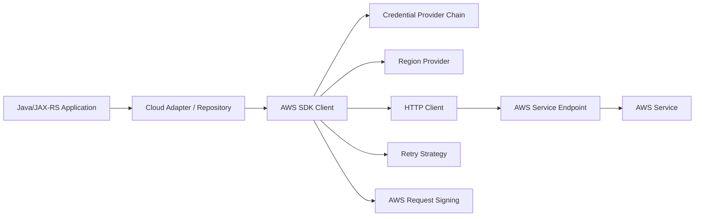

# Part 018 — AWS SDK for Java

> Fokus part ini adalah memahami AWS SDK for Java sebagai production dependency, bukan sekadar library untuk memanggil S3 atau Secrets Manager. SDK menentukan credential resolution, request signing, region selection, endpoint, timeout, retry, pagination, throttling behavior, connection pooling, error classification, dan observability.

Dalam aplikasi Java/JAX-RS, AWS SDK biasanya dipakai di balik fitur yang terlihat sederhana:

- upload/download document ke S3;
- membaca secret dari AWS Secrets Manager;
- mengambil config dari Systems Manager Parameter Store;
- decrypt/encrypt data melalui KMS;
- publish event atau membaca queue;
- membaca metadata environment;
- memanggil service internal via private endpoint;
- mengirim telemetry atau custom metrics.

Masalahnya: failure AWS SDK jarang terlihat sebagai “AWS SDK failure”. Di production, symptom-nya sering muncul sebagai HTTP 500, timeout, thread pool penuh, latency spike, upload gagal, startup lambat, atau incident cost.

Senior backend engineer harus memahami SDK sebagai bagian dari runtime architecture.

---

## 1. Core mental model

AWS SDK for Java adalah client-side runtime layer untuk berbicara dengan AWS service API.



SDK melakukan banyak hal sebelum request mencapai AWS service:

1. menentukan region;
2. menemukan credential;
3. membangun endpoint;
4. melakukan request signing;
5. memilih HTTP connection;
6. menerapkan timeout;
7. mengirim request;
8. membaca response;
9. melakukan retry jika error dianggap retryable;
10. mengubah response/error menjadi object Java;
11. mengekspos metadata seperti request ID.

Jika salah satu layer ini salah, aplikasi bisa gagal walaupun business logic benar.

---

## 2. AWS SDK version awareness

AWS SDK for Java yang umum di sistem modern adalah **AWS SDK for Java 2.x**.

Hal yang perlu diverifikasi:

- apakah aplikasi memakai SDK v1 atau v2;
- apakah ada transitive dependency yang membawa SDK lama;
- apakah semua AWS clients memakai versi konsisten;
- apakah SDK version mendukung IRSA/EKS Pod Identity yang digunakan;
- apakah HTTP client yang dipakai Apache, Netty, URLConnection, atau CRT;
- apakah retry strategy default sudah sesuai workload;
- apakah dependency update masuk security patching process.

SDK v1 dan v2 memiliki API, lifecycle, async model, dan configuration pattern yang berbeda. Jangan copy-paste konfigurasi v1 ke v2 tanpa validasi.

---

## 3. Client builder mental model

Pola dasar SDK v2:

```java
S3Client s3 = S3Client.builder()
    .region(Region.AP_SOUTHEAST_1)
    .build();
```

Untuk async:

```java
S3AsyncClient s3Async = S3AsyncClient.builder()
    .region(Region.AP_SOUTHEAST_1)
    .build();
```

Client builder menggabungkan beberapa konfigurasi:

| Concern | Contoh |
|---|---|
| Region | `Region.AP_SOUTHEAST_1` |
| Credential | default provider chain, web identity, assume role, profile |
| Endpoint | default AWS endpoint atau endpoint override |
| HTTP client | Apache/Netty/URLConnection/CRT |
| Timeout | API call timeout, attempt timeout, connection timeout |
| Retry | standard, adaptive, custom retry strategy |
| Override config | headers, execution interceptors, metrics/logging |

Prinsip production: **buat client sebagai long-lived object**, bukan dibuat ulang per request.

Anti-pattern:

```java
@GET
@Path("/documents/{id}")
public Response download(@PathParam("id") String id) {
    S3Client s3 = S3Client.builder().build(); // anti-pattern
    // ...
}
```

Dampak:

- connection pool tidak efektif;
- credential resolution berulang;
- startup cost pindah ke request path;
- thread/connection leak lebih mungkin;
- latency tail memburuk.

---

## 4. Region provider discipline

AWS service call selalu terkait region, kecuali service global tertentu.

Region bisa datang dari:

- explicit builder config;
- environment variable;
- system property;
- AWS profile/config file;
- instance/container metadata;
- default region provider chain.

Untuk enterprise production, explicit region biasanya lebih mudah diaudit.

```java
S3Client s3 = S3Client.builder()
    .region(Region.of(appConfig.awsRegion()))
    .build();
```

Failure mode region:

| Symptom | Kemungkinan root cause |
|---|---|
| `Unable to load region` | Tidak ada region di builder/env/profile |
| `AccessDenied` | Role benar tapi resource ARN region/account berbeda |
| High latency | Call ke region jauh atau cross-region tidak sengaja |
| S3 redirect/error | Bucket berada di region berbeda |
| Private endpoint gagal | Endpoint override/region tidak cocok dengan VPC endpoint |
| Cost naik | Cross-region data transfer |

Region adalah correctness, latency, security, dan cost concern sekaligus.

---

## 5. Credential provider chain

Credential provider chain adalah mekanisme SDK menemukan credential AWS.

Sumber credential dapat mencakup:

- Java system properties;
- environment variables;
- web identity token untuk IRSA;
- shared credentials/config file;
- container credentials;
- instance profile credentials;
- custom provider;
- STS assume role provider.

Pola production yang diinginkan di EKS dengan IRSA:

```java
S3Client s3 = S3Client.builder()
    .region(region)
    .build();
```

Jangan hardcode credential jika workload identity tersedia.

Anti-pattern:

```java
S3Client s3 = S3Client.builder()
    .credentialsProvider(
        StaticCredentialsProvider.create(
            AwsBasicCredentials.create(accessKey, secretKey)))
    .build();
```

Risiko:

- credential rotation manual;
- secret leakage;
- audit tidak jelas;
- credential dipakai lintas environment;
- blast radius besar;
- compliance finding.

---

## 6. Credential chain and local development

Local development berbeda dari production.

Local bisa memakai:

- AWS profile;
- AWS SSO;
- environment variable sementara;
- assume role dari developer identity;
- localstack/minio endpoint untuk test tertentu.

Production seharusnya memakai:

- IRSA atau EKS Pod Identity;
- instance profile jika VM/EC2;
- CI/CD OIDC federation untuk deployment;
- no static key.

Masalah umum:

```text
Local works
Production fails
```

Artinya sering bukan “code benar”. Local mungkin memakai credential developer yang terlalu luas. Selalu test dengan permission yang mendekati workload role production.

---

## 7. STS and AssumeRole

AWS STS menghasilkan temporary security credentials.

Use case umum:

- IRSA menggunakan `AssumeRoleWithWebIdentity`;
- service account tertentu assume role untuk access terbatas;
- cross-account access;
- CI/CD deploy role;
- break-glass session;
- chained role assumption, walaupun harus hati-hati.

Contoh provider explicit untuk assume role:

```java
StsClient sts = StsClient.builder()
    .region(region)
    .build();

StsAssumeRoleCredentialsProvider provider = StsAssumeRoleCredentialsProvider.builder()
    .stsClient(sts)
    .refreshRequest(r -> r
        .roleArn("arn:aws:iam::123456789012:role/target-role")
        .roleSessionName("quote-service-session"))
    .build();

S3Client s3 = S3Client.builder()
    .region(region)
    .credentialsProvider(provider)
    .build();
```

Gunakan explicit assume role hanya jika memang arsitekturnya membutuhkan. Untuk IRSA standar, default provider chain biasanya cukup.

Failure mode STS:

- role trust policy tidak mengizinkan caller;
- session duration melebihi max;
- STS endpoint tidak reachable;
- source credential tidak ditemukan;
- role chaining terlalu kompleks;
- CloudTrail sulit dibaca karena roleSessionName buruk;
- retry STS memperlambat request path.

---

## 8. Endpoint override

Endpoint override mengubah target endpoint service.

Use case:

- local testing dengan LocalStack atau MinIO;
- private endpoint/interface endpoint scenario tertentu;
- custom S3-compatible storage;
- regional endpoint control;
- testing failure injection.

Contoh:

```java
S3Client s3 = S3Client.builder()
    .region(Region.AP_SOUTHEAST_1)
    .endpointOverride(URI.create("https://s3.ap-southeast-1.amazonaws.com"))
    .build();
```

Endpoint override harus dipakai sangat hati-hati.

Risiko:

- request signing region mismatch;
- TLS hostname mismatch;
- private DNS tidak terpakai;
- call keluar via internet bukan VPC endpoint;
- environment prod menunjuk endpoint test;
- S3 path-style/virtual-hosted-style behavior berubah;
- compliance finding karena data keluar ke endpoint tidak disetujui.

Internal rule yang baik: endpoint override harus terlihat jelas di config, diaudit, dan tidak boleh hardcoded tanpa alasan.

---

## 9. HTTP client layer

SDK membutuhkan HTTP client untuk mengirim request.

Di SDK v2, opsi umum:

- Apache HTTP client untuk sync client;
- URLConnection HTTP client untuk opsi ringan;
- Netty NIO async HTTP client untuk async;
- AWS CRT HTTP client untuk use case tertentu.

Concern utama:

- connection pool size;
- connection acquisition timeout;
- connection timeout;
- socket/read timeout;
- TLS negotiation;
- proxy configuration;
- idle connection cleanup;
- thread pool/event loop;
- backpressure pada async client.

Untuk JAX-RS service high-throughput, HTTP client config harus dianggap bagian dari capacity planning.

---

## 10. Timeout hierarchy

Timeout yang penting:

| Timeout | Makna |
|---|---|
| Connection timeout | Waktu membuka TCP connection |
| TLS handshake timeout | Waktu negosiasi TLS jika exposed oleh client |
| Socket/read timeout | Waktu menunggu data response |
| Connection acquisition timeout | Waktu menunggu connection dari pool |
| API call attempt timeout | Timeout per attempt |
| API call timeout | Timeout total seluruh request termasuk retry |
| Application request timeout | Timeout endpoint JAX-RS |
| Upstream load balancer timeout | Timeout dari ALB/API Gateway/Ingress |

Rule penting: timeout harus berurutan secara masuk akal.

```text
JAX-RS request timeout
  > SDK total API call timeout
    > SDK attempt timeout
      > connection/read timeout
```

Jika SDK timeout lebih panjang dari HTTP request timeout, request user bisa sudah gagal tetapi thread backend masih menunggu AWS call.

---

## 11. Retry strategy

AWS SDK memiliki retry untuk transient error dan throttling. Retry berguna, tetapi bisa berbahaya.

Retry cocok untuk:

- transient network issue;
- 5xx service error tertentu;
- throttling dengan backoff;
- connection reset;
- temporarily unavailable.

Retry tidak cocok untuk:

- AccessDenied;
- invalid credential;
- validation error;
- wrong bucket/key;
- KMS access denied;
- malformed request;
- business rule failure.

Retry harus mempertimbangkan:

- max attempts;
- backoff;
- jitter;
- total timeout;
- idempotency;
- request size;
- downstream rate limit;
- user-facing latency SLO.

Anti-pattern:

```text
API request timeout: 30s
SDK max attempts: 5
Each attempt can wait: 10s
Result: request thread can exceed expected budget and amplify incident
```

---

## 12. Backoff and jitter

Retry tanpa jitter dapat membuat thundering herd.

Saat AWS service throttle atau mengalami partial outage:

```text
Many pods fail at same time
  ↓
All retry after same delay
  ↓
Dependency receives synchronized burst
  ↓
More throttling
  ↓
Retry storm
```

Jitter menyebarkan retry timing.

Untuk backend system high-throughput, retry harus dilihat sebagai traffic multiplier.

```text
effective downstream RPS = inbound RPS × average attempts
```

Jika inbound 1.000 RPS dan rata-rata attempt naik menjadi 3, dependency menerima 3.000 RPS.

---

## 13. Throttling

AWS service dapat mengembalikan throttling karena service quota, account-level limit, resource-level limit, atau hot partition.

Contoh error:

- `ThrottlingException`;
- `TooManyRequestsException`;
- `ProvisionedThroughputExceededException`;
- `RequestLimitExceeded`;
- `SlowDown` pada S3;
- HTTP 429/503 tergantung service.

Engineer harus bertanya:

- service mana yang throttle?
- operation apa?
- region mana?
- account mana?
- throttle per principal, per resource, atau per API?
- apakah retry memperparah?
- apakah pagination/concurrency terlalu agresif?
- apakah ada quota increase process?

Jangan hanya menaikkan max retry. Kadang solusi benar adalah rate limiting, batching, caching, queueing, quota increase, atau desain ulang access pattern.

---

## 14. Pagination

Banyak AWS API mengembalikan response paginated.

Anti-pattern:

```java
ListObjectsV2Response response = s3.listObjectsV2(req);
return response.contents(); // hanya page pertama
```

Pola yang lebih benar:

```java
ListObjectsV2Iterable pages = s3.listObjectsV2Paginator(req);

for (ListObjectsV2Response page : pages) {
    page.contents().forEach(object -> {
        // process object
    });
}
```

Pagination concern:

- page size;
- memory pressure;
- total API call count;
- partial failure;
- checkpoint/resume;
- rate limiting;
- duplicate processing;
- ordering assumption;
- timeout total job;
- cost.

Jangan load semua result ke memory jika daftar object/parameter/secret bisa besar.

---

## 15. Sync vs async client

Sync client cocok untuk:

- request volume moderate;
- blocking application model;
- simple integration;
- JAX-RS endpoint yang sudah blocking;
- operasional lebih mudah.

Async client cocok untuk:

- high concurrency;
- streaming;
- non-blocking pipeline;
- parallel I/O;
- integrasi dengan reactive model.

Tetapi async client bukan magic performance.

Risiko async:

- event loop blocking;
- backpressure salah;
- future tidak ditangani;
- error hilang;
- memory pressure karena concurrency terlalu tinggi;
- thread model sulit dibaca;
- observability lebih rumit.

Untuk banyak enterprise JAX-RS service, sync client dengan timeout, pool, retry, dan bulkhead yang benar lebih aman daripada async yang tidak dipahami tim.

---

## 16. Streaming and large payloads

Untuk S3 upload/download besar, hindari membaca seluruh file ke heap.

Anti-pattern:

```java
byte[] content = inputStream.readAllBytes();
s3.putObject(request, RequestBody.fromBytes(content));
```

Risiko:

- heap pressure;
- GC pause;
- OOM;
- slow request;
- poor backpressure;
- user upload besar membunuh pod.

Pola lebih aman:

```java
s3.putObject(request, RequestBody.fromInputStream(inputStream, contentLength));
```

Untuk file sangat besar, pertimbangkan multipart upload, direct-to-S3 via presigned URL, queue-based processing, dan virus scanning pipeline jika required.

---

## 17. Error handling model

Jangan tangkap semua exception sebagai `RuntimeException` generik.

AWS SDK v2 memiliki exception hierarchy seperti:

- `SdkClientException` untuk client-side issue;
- `AwsServiceException` untuk response error dari AWS service;
- service-specific exception seperti `S3Exception`, `SecretsManagerException`, `KmsException`;
- status code dan AWS request ID pada service exception.

Pattern:

```java
try {
    s3.putObject(request, body);
} catch (S3Exception e) {
    log.warn("S3 putObject failed: status={}, awsRequestId={}, code={}",
        e.statusCode(),
        e.requestId(),
        e.awsErrorDetails().errorCode());
    throw mapS3Failure(e);
} catch (SdkClientException e) {
    log.warn("AWS SDK client-side failure: type={}, message={}",
        e.getClass().getSimpleName(),
        safeMessage(e));
    throw new DependencyUnavailableException("S3 client failure", e);
}
```

Mapping harus membedakan:

| Failure | API response internal |
|---|---|
| AccessDenied | 500/503 internal dependency error, bukan user 403 kecuali domain-nya memang user authorization |
| NoSuchKey | 404 jika object adalah resource user-facing |
| Throttling | 503 atau retry later |
| Timeout | 504/503 tergantung boundary |
| Validation error | 500 jika bug backend, 400 jika input user memang salah |
| KMS denied | 500 security/config issue |

---

## 18. Request signing

AWS SDK menandatangani request menggunakan AWS credentials. Untuk banyak service, signing memakai Signature Version 4.

Implication:

- credential harus valid;
- region memengaruhi signing;
- service name memengaruhi signing;
- clock skew dapat menyebabkan auth failure;
- endpoint override dapat menyebabkan signing mismatch;
- proxy/TLS inspection bisa mengganggu request jika tidak transparan;
- presigned URL adalah signed request yang dibatasi waktu.

Jangan mencoba membuat signing sendiri kecuali benar-benar perlu. Gunakan SDK.

---

## 19. Presigned URL

S3 presigned URL memungkinkan client melakukan operasi langsung ke S3 untuk waktu terbatas.

Use case:

- upload/download file besar tanpa melewati backend;
- mengurangi memory pressure backend;
- mengurangi bandwidth backend;
- temporary document access;
- export result download.

Concern:

- TTL;
- HTTP method;
- content type;
- content length;
- object key scope;
- tenant isolation;
- revocation sulit sebelum expiry;
- URL mengandung signature, jangan log lengkap;
- public/private network path;
- CORS jika browser langsung upload;
- audit caller di S3 akan terlihat sebagai signing principal, bukan end user.

JAX-RS backend harus tetap melakukan domain authorization sebelum membuat presigned URL.

---

## 20. Secrets Manager and Parameter Store usage

AWS SDK sering dipakai untuk membaca secret/config.

Anti-pattern:

```text
Every request reads secret from Secrets Manager
```

Dampak:

- latency tinggi;
- cost meningkat;
- throttling;
- dependency outage memengaruhi semua request;
- startup dan request path tidak terpisah.

Pola lebih baik:

- baca saat startup untuk secret yang diperlukan;
- cache dengan TTL untuk config runtime;
- gunakan refresh background jika perlu;
- fail fast untuk mandatory secret;
- gunakan safe default untuk optional config;
- log version/label, bukan value;
- handle rotation dengan jelas.

---

## 21. KMS usage

KMS call bisa menjadi dependency sensitif.

Concern:

- permission `kms:Decrypt`/`kms:Encrypt`;
- key policy vs IAM policy;
- encryption context;
- request rate;
- latency;
- regionality;
- key disabled/pending deletion;
- audit requirement;
- retry behavior;
- data key caching jika menggunakan envelope encryption.

Common hidden issue:

```text
S3 PutObject fails with AccessDenied
IAM allows s3:PutObject
Root cause: bucket uses SSE-KMS and role lacks kms:Encrypt for the key
```

Selalu review KMS bersama resource target.

---

## 22. Observability for AWS SDK calls

Minimum yang harus terlihat:

- dependency name;
- operation;
- region;
- endpoint category: public/private/custom;
- status code;
- AWS error code;
- AWS request ID;
- latency;
- attempt count jika tersedia;
- throttling indicator;
- timeout type;
- credential source category, tanpa credential;
- correlation ID.

Contoh log aman:

```json
{
  "event": "aws_dependency_call_failed",
  "dependency": "s3",
  "operation": "PutObject",
  "region": "ap-southeast-1",
  "statusCode": 403,
  "awsErrorCode": "AccessDenied",
  "awsRequestId": "...",
  "credentialSource": "irsa",
  "durationMs": 184,
  "correlationId": "..."
}
```

Jangan log:

- access key;
- secret key;
- session token;
- Authorization header;
- full presigned URL;
- secret value;
- full object content;
- PII in object key jika tidak diperlukan.

---

## 23. Metrics to expose

Aplikasi Java/JAX-RS sebaiknya mengekspos metric dependency AWS:

```text
aws_client_requests_total{service,operation,status,error_code}
aws_client_request_duration_seconds{service,operation}
aws_client_retries_total{service,operation,reason}
aws_client_throttles_total{service,operation}
aws_client_timeouts_total{service,operation,timeout_type}
aws_client_inflight_requests{service,operation}
aws_client_connection_pool_pending{service}
```

Hati-hati dengan cardinality:

- jangan jadikan bucket key/object key sebagai label;
- jangan jadikan tenant ID high-cardinality sebagai label tanpa desain;
- jangan jadikan request ID sebagai label;
- jangan jadikan error message mentah sebagai label.

---

## 24. Tracing AWS SDK calls

Distributed tracing idealnya menunjukkan:

```text
Inbound HTTP request
  → application service span
  → AWS S3 PutObject span
  → database update span
  → Kafka publish span
```

Untuk cloud SDK spans:

- catat service dan operation;
- catat region;
- catat status/error;
- jangan catat secret/object content;
- jangan catat full signed URL;
- propagation ke AWS service tidak selalu berarti trace lanjut di AWS side;
- gunakan correlation ID di log untuk menghubungkan app log dan AWS request ID.

---

## 25. Bulkhead and concurrency control

SDK call harus dibatasi agar dependency failure tidak menghabiskan seluruh thread request.

Pola:

- dedicated executor untuk operasi blocking berat;
- semaphore/bulkhead per dependency;
- queue limit;
- timeout pendek dan jelas;
- circuit breaker untuk dependency degraded;
- rate limiter untuk API yang mudah throttle;
- backpressure untuk upload/download.

Contoh reasoning:

```text
JAX-RS worker threads: 200
S3 can hang up to 20s
No bulkhead
  ↓
200 threads blocked on S3
  ↓
Health endpoint ikut lambat
  ↓
Kubernetes restarts pod
  ↓
Incident worsens
```

---

## 26. Idempotency

Retry hanya aman jika operasi idempotent atau memiliki idempotency control.

S3 examples:

- `PutObject` ke key yang sama bisa overwrite object;
- multipart upload bisa meninggalkan orphaned parts;
- delete object bisa aman atau berbahaya tergantung versioning;
- event notification bisa duplicate;
- metadata update mungkin tidak seperti update row database.

Untuk API backend:

- gunakan idempotency key untuk user operation;
- pisahkan object upload dan database commit;
- simpan object key deterministik jika perlu;
- handle duplicate event;
- gunakan compensation untuk partial failure;
- jangan retry non-idempotent operation tanpa desain.

---

## 27. Transaction boundary with AWS services

AWS service call tidak satu transaksi dengan PostgreSQL.

Contoh upload document:

```text
1. Receive file upload
2. PutObject to S3
3. Insert metadata row to PostgreSQL
4. Publish event to Kafka
```

Failure matrix:

| Step gagal | Risiko |
|---|---|
| S3 upload gagal | DB tidak boleh mencatat file berhasil |
| DB insert gagal setelah S3 upload | orphan object |
| Kafka publish gagal setelah DB insert | downstream tidak tahu file baru |
| Retry seluruh flow | duplicate object/event |

Pola mitigation:

- outbox pattern;
- deterministic object key;
- cleanup job untuk orphan object;
- object metadata status;
- idempotency key;
- state machine eksplisit;
- reconciliation job;
- audit trail.

---

## 28. Private endpoint and VPC endpoint behavior

Jika menggunakan VPC endpoint/PrivateLink, SDK tetap memanggil service endpoint seperti biasa, tetapi DNS/routing mengarah ke private path.

Concern:

- private DNS enabled atau tidak;
- endpoint policy;
- security group endpoint;
- route table untuk gateway endpoint;
- regional endpoint;
- bucket policy membatasi source VPC endpoint;
- SDK endpoint override bisa bypass private DNS;
- pod DNS cache/CoreDNS issue;
- cross-region endpoint tidak lewat VPC endpoint lokal.

Debug path:

```bash
kubectl exec -it <pod> -- nslookup s3.<region>.amazonaws.com
kubectl exec -it <pod> -- curl -v https://s3.<region>.amazonaws.com
```

Gunakan debug tool dengan hati-hati; jangan mengirim credential manual.

---

## 29. Proxy support

Enterprise network kadang mewajibkan outbound proxy.

Concern:

- SDK HTTP client harus dikonfigurasi proxy;
- `NO_PROXY` harus mencakup metadata endpoint, VPC endpoint, cluster service jika perlu;
- TLS inspection bisa mengubah trust chain;
- proxy bisa memblokir STS/S3/Secrets Manager endpoint;
- proxy log bisa menyimpan URL sensitif;
- presigned URL melalui proxy perlu policy khusus.

Jika pod tiba-tiba gagal credential atau SDK call setelah network hardening, cek proxy dan NO_PROXY sebelum menyalahkan IAM.

---

## 30. Startup behavior

Aplikasi sering membuat SDK client saat startup, tetapi call AWS pertama terjadi saat request pertama.

Pertanyaan readiness:

- Apakah startup harus fail jika secret/config tidak bisa dibaca?
- Apakah readiness harus memanggil AWS service?
- Apakah liveness harus bebas dari dependency eksternal?
- Apakah first user request menanggung credential warm-up?
- Apakah cold start spike menyebabkan STS/Secrets Manager burst?

Pola umum:

```text
Startup:
  create SDK clients
  load mandatory local config
  optionally prefetch mandatory secrets

Readiness:
  check app internal readiness
  optionally check cached dependency state, not heavy cloud call every time

Request path:
  use already-created SDK clients
```

---

## 31. Testing strategy

Testing AWS SDK integration perlu beberapa level:

| Test | Tujuan |
|---|---|
| Unit test | Adapter mapping, error classification, retry decision |
| Contract test | Request shape dan response handling |
| Local emulator test | Basic S3-like/Secrets-like behavior jika cocok |
| Integration test AWS dev account | IAM, endpoint, permission, real API behavior |
| Failure injection | Timeout, throttling, AccessDenied, partial failure |
| Load test | Connection pool, timeout, retry, concurrency, cost |

Jangan menganggap emulator sama dengan AWS. Emulator berguna, tetapi tidak membuktikan IAM, STS, KMS, VPC endpoint, throttling, atau service-specific edge behavior.

---

## 32. Common anti-patterns

Anti-pattern yang harus ditolak dalam PR:

- static AWS keys di config;
- SDK client dibuat per request;
- region tidak eksplisit;
- timeout default tanpa review;
- retry default dianggap selalu aman;
- catch `Exception` lalu return generic 500 tanpa request ID;
- log full presigned URL;
- list API tanpa pagination;
- read all file bytes ke memory;
- call Secrets Manager per request;
- endpoint override hardcoded;
- local profile dipakai production;
- no metrics per dependency;
- no bulkhead untuk SDK call lambat;
- retry non-idempotent operation tanpa idempotency key;
- permission `*` untuk mengatasi AccessDenied.

---

## 33. Failure mode table

| Symptom | Likely root cause | Debug focus |
|---|---|---|
| `NoCredentialsProvider` | Credential chain tidak menemukan source | Env vars, IRSA, token file, SDK version |
| `AccessDenied` | Permission kurang atau explicit deny | IAM policy, resource policy, KMS policy |
| `InvalidSignatureException` | Region/endpoint/clock/signing mismatch | Region, endpoint override, clock skew |
| Timeout | Network, endpoint, pool, service latency | DNS, route, SG/NACL, HTTP timeout |
| Connection pool exhausted | Client concurrency lebih besar dari pool | Pool config, bulkhead, slow downstream |
| Throttling | Quota/rate limit/hot partition | Metrics, retry count, request rate |
| Only first page returned | Pagination tidak ditangani | Paginator usage |
| OOM during upload | Full payload loaded into heap | Streaming/multipart design |
| Local works, prod fails | Credential/region/resource mismatch | Runtime identity, role, env config |
| Prod uses wrong bucket | Environment config drift | Config source, region, naming, tags |

---

## 34. Debugging playbook

Saat AWS SDK call gagal di production:

```text
1. Identify service and operation
2. Capture AWS request ID if available
3. Classify: client-side, service-side, auth, throttling, timeout, validation
4. Confirm region and endpoint
5. Confirm credential source
6. Confirm assumed role/principal in CloudTrail
7. Check IAM identity policy
8. Check resource policy
9. Check KMS policy if encrypted resource involved
10. Check DNS and network path
11. Check timeout/retry/connection pool metrics
12. Check recent deploy/config/IaC changes
13. Apply safest mitigation: rollback, reduce traffic, disable feature, increase quota, fix policy
```

Jangan mulai debugging dengan menaikkan permission wildcard. Itu sering menyembunyikan root cause dan meninggalkan security debt.

---

## 35. Internal verification checklist

### Dependency and SDK

- AWS SDK major version: v1 atau v2?
- Versi SDK dikunci di mana?
- Apakah ada dependency lama/transitive conflict?
- Service AWS apa saja yang dipanggil aplikasi?
- Apakah setiap client dibuat sebagai singleton/managed bean?
- Apakah ada wrapper/adapter untuk cloud dependency?

### Credential and identity

- Credential source production: IRSA, EKS Pod Identity, instance profile, atau lainnya?
- Apakah ada static AWS keys di Secret/env/config?
- Apakah local development memakai profile/SSO yang aman?
- Apakah role per service/environment?
- Apakah CloudTrail menunjukkan principal yang benar?

### Region and endpoint

- Region dikonfigurasi explicit?
- Apakah ada endpoint override?
- Apakah private endpoint/VPC endpoint dipakai?
- Apakah private DNS enabled?
- Apakah cross-region call disengaja?
- Apakah bucket/resource region cocok?

### Timeout, retry, and HTTP

- API call timeout?
- API call attempt timeout?
- Connection timeout?
- Read/socket timeout?
- Connection pool size?
- Retry mode/max attempts?
- Backoff/jitter?
- Bulkhead/concurrency limit?

### Observability

- Apakah log mencatat AWS request ID?
- Apakah metrics per service/operation tersedia?
- Apakah throttling metric tersedia?
- Apakah timeout metric tersedia?
- Apakah retry count terlihat?
- Apakah trace mencakup AWS dependency span?
- Apakah log bebas dari credential/signature/secret?

### Correctness and operations

- Apakah pagination ditangani?
- Apakah operation retry-safe?
- Apakah upload/download streaming?
- Apakah KMS policy ikut direview?
- Apakah error mapping ke JAX-RS response tepat?
- Apakah runbook AWS SDK failure tersedia?
- Apakah load test mencakup cloud dependency?

---

## 36. PR review checklist

Saat mereview PR yang menambah AWS SDK integration:

- SDK client dibuat sekali, bukan per request?
- Region explicit dan environment-aware?
- Credential memakai default provider/workload identity?
- Tidak ada static access key?
- Endpoint override justified dan aman?
- Timeout dan retry explicit?
- Error handling membedakan service exception vs client exception?
- AWS request ID dilog?
- Metrics/tracing ditambahkan?
- Pagination ditangani?
- Upload/download streaming jika payload besar?
- Operation idempotent atau punya idempotency key?
- KMS/resource policy ikut dipertimbangkan?
- IAM permission least privilege?
- Private endpoint behavior diverifikasi?
- Cost impact dipahami?
- Runbook/debug notes diperbarui?

---

## 37. Production-ready SDK integration shape

Struktur yang sehat:

```text
JAX-RS Resource
  ↓
Application Service
  ↓
Domain Port / Interface
  ↓
AWS Adapter
  ↓
Long-lived AWS SDK Client
  ↓
AWS Service
```

Keuntungan:

- domain logic tidak terikat langsung ke SDK;
- error mapping lebih terkendali;
- testing lebih mudah;
- observability terpusat;
- timeout/retry standard bisa diterapkan konsisten;
- migration atau abstraction lebih mungkin;
- production debugging lebih cepat.

---

## 38. Minimal production standard

Untuk setiap AWS SDK integration, minimal harus ada:

```text
Explicit region
+ Runtime workload identity
+ No static credentials
+ Long-lived client
+ Explicit timeout
+ Reviewed retry
+ Safe error mapping
+ Pagination support where needed
+ Streaming for large payloads
+ Metrics/logs/traces
+ AWS request ID capture
+ Least privilege IAM
+ KMS/resource policy review
+ Private endpoint verification if used
+ Runbook entry
```

Jika salah satu tidak ada, PR belum production-ready.

---

## 39. References

Referensi resmi untuk verifikasi lebih lanjut:

- AWS SDK for Java 2.x — Developer Guide: https://docs.aws.amazon.com/sdk-for-java/latest/developer-guide/home.html
- AWS SDK for Java 2.x — Credentials provider chain: https://docs.aws.amazon.com/sdk-for-java/latest/developer-guide/credentials-chain.html
- AWS SDK for Java 2.x — Using credentials providers: https://docs.aws.amazon.com/sdk-for-java/latest/developer-guide/credentials.html
- AWS SDK for Java 2.x — Retry strategy: https://docs.aws.amazon.com/sdk-for-java/latest/developer-guide/retry-strategy.html
- AWS SDK for Java 2.x — Troubleshooting: https://docs.aws.amazon.com/sdk-for-java/latest/developer-guide/troubleshooting.html
- AWS EKS — Use IRSA with the AWS SDK: https://docs.aws.amazon.com/eks/latest/userguide/iam-roles-for-service-accounts-minimum-sdk.html
- AWS SDKs and Tools — Assume role credential provider: https://docs.aws.amazon.com/sdkref/latest/guide/feature-assume-role-credentials.html
