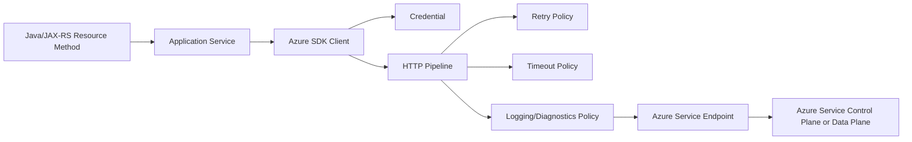
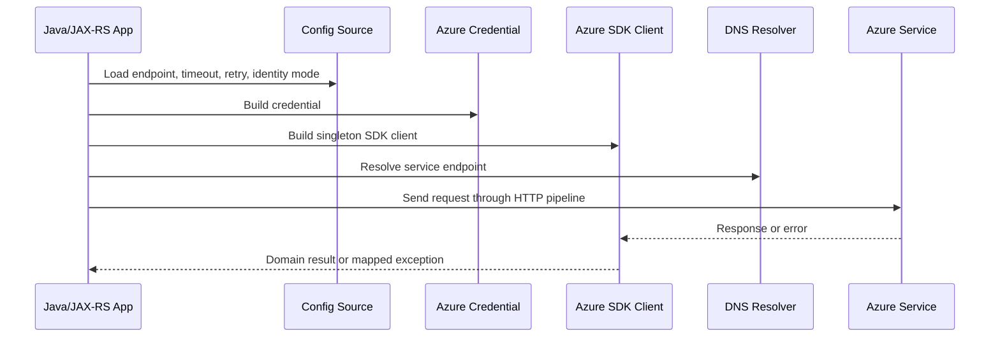
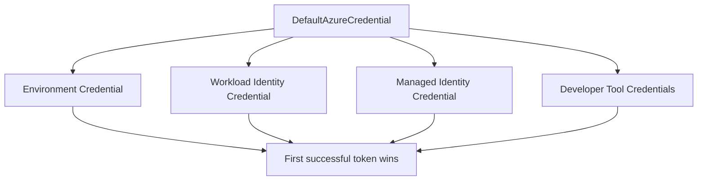
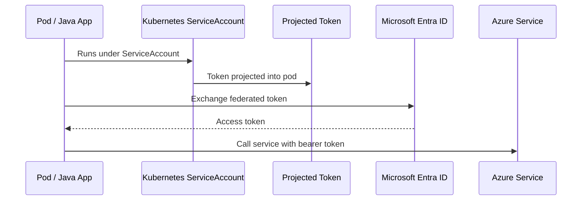
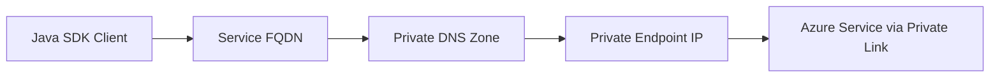
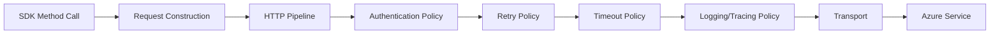
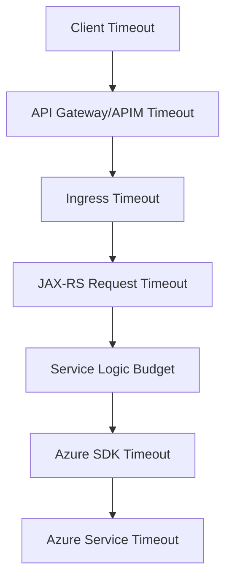
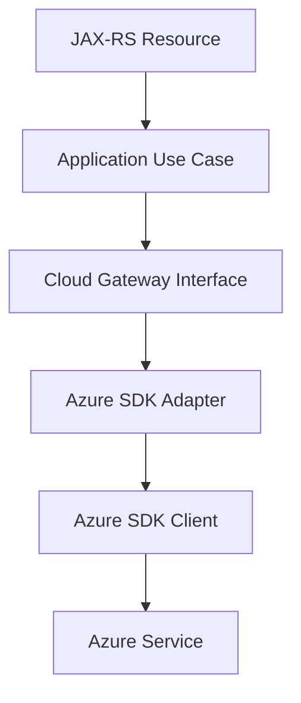
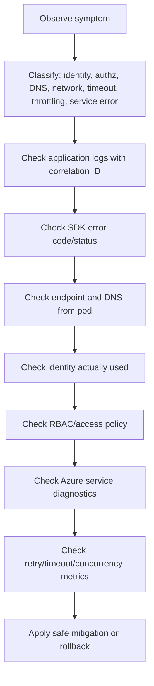

# Cheatsheet AWS and Azure for Enterprise Java/JAX-RS Systems

## Part 019 — Azure SDK for Java

> Goal: understand how Azure SDK calls behave from a Java/JAX-RS backend, especially around credentials, endpoint selection, private networking, retries, timeout, throttling, pagination, async execution, diagnostics, and production debugging.

This part is not about memorizing every Azure SDK client. It is about understanding the runtime contract between a Java service and Azure control/data-plane services.

A Java/JAX-RS service may call Azure SDKs for:

- Azure Blob Storage for object/binary storage.
- Azure Key Vault for secrets, keys, and certificates.
- Azure App Configuration for runtime config and feature flags.
- Azure Service Bus or Event Hubs if used in a messaging architecture.
- Azure Monitor or Application Insights integration.
- Azure Resource Manager APIs if platform automation is embedded, though that should usually be handled by IaC/pipeline, not business services.

The main production question is not “can the SDK call Azure?”

The better question is:

> When Azure identity, DNS, private endpoint, network route, throttling, regional service health, or SDK retry behavior changes, will the application fail safely, observably, and within bounded latency?

---

## 1. Core mental model

The Azure SDK for Java is a set of client libraries that wrap Azure service APIs behind Java client abstractions.

A typical SDK call passes through this chain:



The SDK client is not just a wrapper around HTTP. It owns important behavior:

- how credentials are discovered;
- how tokens are acquired and refreshed;
- how endpoints are selected;
- how HTTP requests are signed or authorized;
- how retries are performed;
- how timeouts are applied;
- how pagination works;
- how diagnostics are emitted;
- how errors are represented;
- how async execution interacts with application threads.

For backend engineers, this means SDK behavior is part of your production architecture.

---

## 2. Why Azure SDK exists

Without an SDK, every application would need to implement:

- OAuth token acquisition from Microsoft Entra ID;
- token caching and refresh;
- service endpoint formatting;
- REST request construction;
- retry behavior;
- pagination;
- binary streaming;
- long-running operation polling;
- structured error parsing;
- diagnostics and distributed tracing hooks.

The SDK centralizes those concerns.

However, that centralization creates a hidden risk: teams may assume the SDK makes all decisions safely by default. It does not. Defaults are useful, but production services still need explicit decisions for credential source, timeout, retry, endpoint, logging, and memory usage.

---

## 3. Control plane vs data plane SDK calls

Azure SDK calls usually fall into two broad categories.

### 3.1 Control plane calls

Control plane calls manage Azure resources.

Examples:

- create a storage account;
- update a network rule;
- list resource groups;
- assign role permissions;
- inspect AKS cluster resources.

These are usually Azure Resource Manager operations.

For normal Java/JAX-RS business services, control plane calls should be rare. Most resource lifecycle should be managed by Terraform, Bicep, ARM templates, GitOps, or platform automation.

### 3.2 Data plane calls

Data plane calls use the actual service capability.

Examples:

- upload a blob;
- download a blob;
- read a secret from Key Vault;
- read a configuration key;
- publish to Event Hubs;
- receive from Service Bus.

Most Java/JAX-RS backend integrations should be data plane calls.

### 3.3 Why the distinction matters

Control plane and data plane often differ in:

- endpoint;
- permission model;
- throttling profile;
- audit log location;
- latency expectation;
- blast radius;
- retry safety;
- ownership team.

A service that needs only blob read/write should not have subscription-level resource management permissions.

---

## 4. Standard Azure SDK client lifecycle

A production SDK integration should follow this lifecycle:



The lifecycle has several invariants.

### 4.1 Build clients once

SDK clients should usually be singleton or long-lived beans.

Do not create a new SDK client per HTTP request.

Bad pattern:

```java
@GET
@Path("/files/{id}")
public Response download(@PathParam("id") String id) {
    BlobServiceClient client = new BlobServiceClientBuilder()
        .endpoint(endpoint)
        .credential(credential)
        .buildClient();

    // use client
}
```

Better pattern:

```java
@ApplicationScoped
public class BlobStorageGateway {
    private final BlobContainerClient containerClient;

    public BlobStorageGateway(BlobContainerClient containerClient) {
        this.containerClient = containerClient;
    }

    public BinaryObject read(String key) {
        BlobClient blob = containerClient.getBlobClient(key);
        // bounded read/streaming strategy here
        return map(blob);
    }
}
```

Why this matters:

- avoids repeated client construction overhead;
- avoids repeated credential chain setup;
- improves connection reuse;
- makes timeout/retry config centralized;
- simplifies observability and testing.

### 4.2 Credentials are runtime infrastructure

Credentials should be configured by environment and workload identity, not hardcoded into code or bundled configuration.

### 4.3 Endpoint is an architectural decision

The endpoint determines whether traffic goes to:

- public Azure service endpoint;
- private endpoint IP through Private Link;
- emulator/local endpoint;
- sovereign cloud endpoint;
- custom endpoint for testing.

Endpoint configuration must be explicit enough for production debugging.

### 4.4 Retry and timeout are part of API design

A JAX-RS request with a 3-second frontend timeout cannot safely call an SDK operation with multiple retries and a 30-second default network wait. Timeout budget must be designed end-to-end.

---

## 5. Authentication model

Azure SDK authentication is commonly handled through the Azure Identity library.

The usual production identity options are:

- managed identity;
- workload identity on AKS;
- service principal with certificate or secret;
- federated credential from CI/CD;
- developer identity for local development.

The right option depends on where the application runs.

---

## 6. DefaultAzureCredential

`DefaultAzureCredential` is convenient because it tries multiple credential sources in order.

It is excellent for developer experience and can also be used in some hosted environments when properly constrained. But for strict production systems, many teams prefer a more explicit credential such as `ManagedIdentityCredential` or `WorkloadIdentityCredential` to avoid accidental credential source changes.

### 6.1 Useful mental model



The key production question:

> Which credential source actually won at runtime?

If the app works locally but fails in AKS, the problem is often that a different credential source is being used.

### 6.2 Failure modes

Common failures:

- environment variables exist but are incomplete;
- app registration exists but lacks RBAC role assignment;
- managed identity exists but is not attached to the workload;
- workload identity federation subject does not match the Kubernetes ServiceAccount;
- token audience mismatch;
- local developer identity has broader permission than production identity;
- SDK silently tries many credentials before failing, increasing startup latency;
- multiple identity paths exist and make behavior hard to reason about.

### 6.3 Production recommendation

For production, prefer the most explicit credential compatible with your platform standard.

Examples:

- AKS workload using Azure Workload Identity: use the team-standard configuration and verify ServiceAccount/federated credential mapping.
- Azure-hosted VM/App Service/Function with managed identity: use managed identity and verify role assignment scope.
- CI/CD: use OIDC federation where possible instead of long-lived client secrets.
- Local development: use developer credentials, but never use local permission success as proof that production identity is correct.

---

## 7. Managed identity

Managed identity allows Azure resources to authenticate to Azure services without embedding secrets.

Types:

- system-assigned managed identity;
- user-assigned managed identity.

### 7.1 System-assigned managed identity

A system-assigned identity is tied to one Azure resource lifecycle.

Useful for:

- VM;
- App Service;
- Function;
- some platform-managed workloads.

If the resource is deleted, the identity is deleted.

### 7.2 User-assigned managed identity

A user-assigned identity is a standalone Azure resource.

Useful for:

- sharing identity across workloads;
- stable identity across resource recreation;
- separating workload identity lifecycle from compute lifecycle;
- assigning a specific identity to an AKS workload pattern.

### 7.3 Managed identity and Java SDK

A Java SDK client may use managed identity through Azure Identity.

Conceptually:

```java
TokenCredential credential = new ManagedIdentityCredentialBuilder()
    .clientId(userAssignedClientId) // only when using user-assigned identity
    .build();
```

Production notes:

- know whether the identity is system-assigned or user-assigned;
- know the client ID if user-assigned identity is used;
- verify RBAC role assignment at the correct scope;
- avoid granting broad subscription-level permissions when resource-level scope is enough;
- include identity information in startup diagnostics without logging secrets or tokens.

---

## 8. Azure Workload Identity for AKS

For AKS, modern workload identity uses Kubernetes ServiceAccount federation with Microsoft Entra ID.

The pod receives a projected token. Azure Identity uses that token to request an Entra token for the configured Azure identity.



### 8.1 What must match

For workload identity to work, several values must align:

- AKS OIDC issuer;
- Entra application or managed identity federation configuration;
- Kubernetes namespace;
- Kubernetes ServiceAccount name;
- token subject;
- token audience;
- Azure role assignment scope;
- SDK credential configuration.

One mismatch is enough to produce authentication failure.

### 8.2 Failure modes

Typical failures:

- ServiceAccount annotation missing;
- pod running under default ServiceAccount accidentally;
- federated credential subject mismatch;
- role assignment created at wrong scope;
- token file not mounted;
- workload identity webhook not working;
- SDK falls back to another credential source;
- local development works but AKS production fails;
- token exchange succeeds but service authorization fails.

### 8.3 Debugging checklist

Inside or around the pod, verify:

- which ServiceAccount the pod uses;
- whether expected annotations exist;
- whether projected token volume exists;
- whether expected environment variables are present;
- whether Azure SDK startup logs show the expected credential;
- whether Azure Activity Log shows denied requests;
- whether the target resource has correct RBAC assignment;
- whether the pod can resolve and reach the service endpoint.

---

## 9. Service principal credential

A service principal is an application identity in Microsoft Entra ID.

It can authenticate using:

- client secret;
- certificate;
- federated credential.

For enterprise systems, long-lived client secrets should be avoided when workload identity or managed identity is available.

### 9.1 When service principal may still appear

Service principals are common in:

- CI/CD pipelines;
- Terraform automation;
- cross-tenant integration;
- legacy deployments;
- environments where managed identity is not available;
- on-prem services calling Azure.

### 9.2 Risk profile

Service principal secrets introduce risks:

- secret rotation outage;
- secret leakage through environment variables or logs;
- excessive permission scope;
- unclear owner;
- expired credential;
- copy-pasted credential across environments.

### 9.3 Production preference

Prefer:

- federated credential for CI/CD;
- certificate over client secret where appropriate;
- strict scope role assignments;
- short rotation cycle;
- no secrets in repo, image, Helm values, or Terraform state;
- audit logs reviewed for unexpected usage.

---

## 10. Azure RBAC and SDK authorization

Authentication proves who the caller is.

Authorization determines what the caller can do.

For Azure SDK calls, access usually requires Azure RBAC role assignment or service-specific access policy depending on the service and configuration.

Examples:

- Blob Storage data plane may require roles such as Storage Blob Data Reader or Storage Blob Data Contributor.
- Key Vault may use Azure RBAC or access policies depending on vault configuration.
- App Configuration requires appropriate data access roles.

### 10.1 Scope matters

Azure RBAC scope can be assigned at:

- management group;
- subscription;
- resource group;
- resource.

Production services should usually receive the narrowest practical scope.

Bad:

```text
Application identity has Contributor on subscription.
```

Better:

```text
Application identity has Storage Blob Data Contributor on one storage account or one container-level scope if supported and operationally feasible.
```

### 10.2 Common authorization failures

- role assignment missing;
- role assigned to wrong identity;
- role assigned at wrong scope;
- role assignment propagation delay;
- using management-plane role for data-plane operation;
- using data-plane role but calling management-plane API;
- Key Vault configured for access policy while team expects RBAC;
- tenant mismatch;
- private endpoint networking issue misread as authorization issue.

---

## 11. Endpoint configuration

Endpoint configuration answers:

> Which URL is the SDK calling?

For Azure services, endpoint format is often service-specific.

Examples:

```text
https://<storage-account>.blob.core.windows.net
https://<key-vault-name>.vault.azure.net
https://<appconfig-name>.azconfig.io
```

With private endpoints, the hostname may stay the same while DNS resolves to a private IP.

That is intentional.

### 11.1 Private endpoint behavior

A common misunderstanding:

> “If we use private endpoint, the application should call a different URL.”

Usually, no. The application often calls the same service FQDN, while private DNS resolves it to a private endpoint IP.



### 11.2 Failure modes

- pod resolves public IP instead of private IP;
- private DNS zone not linked to VNet;
- AKS CoreDNS cannot resolve private zone;
- on-prem DNS forwarding missing;
- firewall blocks private endpoint IP;
- wrong endpoint configured for cloud environment;
- endpoint override used in one environment but not another;
- test environment uses public path while prod uses private path.

### 11.3 Review rule

Every SDK client should have an endpoint decision documented.

Minimum fields:

```yaml
service: Azure Blob Storage
account: <internal verification required>
endpoint: https://<account>.blob.core.windows.net
privateEndpoint: true | false | internal verification required
privateDnsZone: privatelink.blob.core.windows.net | internal verification required
networkPath: AKS subnet -> Private Endpoint subnet
owner: platform/backend/internal verification required
```

---

## 12. HTTP pipeline mental model

Azure SDK clients use an HTTP pipeline. Policies in the pipeline handle behavior such as:

- request ID;
- authentication;
- retry;
- timeout;
- logging;
- tracing;
- user agent;
- custom headers.



### 12.1 Why backend engineers care

The pipeline determines:

- whether a request is retried;
- whether the retry consumes the JAX-RS request time budget;
- whether logs include sensitive headers;
- whether distributed tracing sees the SDK dependency;
- whether transport connection pools are reused;
- whether a stuck Azure service call blocks application threads.

---

## 13. Retry policy

Retries can improve reliability when failures are transient.

They can also make incidents worse when failures are persistent.

### 13.1 Retryable scenarios

Usually retryable:

- temporary network failure;
- HTTP 429 throttling when retry-after is provided;
- HTTP 500/502/503/504 from service;
- connection reset;
- transient DNS/cache issue after short delay.

Usually not retryable:

- 400 bad request;
- 401 authentication failure;
- 403 authorization failure;
- 404 for a definitely missing object/config;
- validation error;
- conflict caused by incorrect state transition unless the operation is explicitly idempotent.

### 13.2 Retry budget

The service must define a retry budget.

Example:

```text
Frontend timeout:          10s
API gateway timeout:       8s
JAX-RS request budget:     6s
Azure SDK dependency call:  2s total
Retry attempts:            1 retry max for synchronous request path
```

A retry budget prevents hidden latency amplification.

### 13.3 Retry storm risk

A retry storm happens when many service instances retry at the same time during a dependency failure.

Contributors:

- high pod count;
- aggressive retry count;
- no jitter;
- no circuit breaker;
- no concurrency limit;
- timeout longer than caller budget;
- autoscaling adds more callers during downstream degradation.

Production rule:

> Retries must be paired with timeout, jitter, circuit breaker, and observable metrics.

---

## 14. Timeout policy

Timeout is not one number.

There are multiple timeout concepts:

- connection timeout;
- response timeout;
- read timeout;
- write timeout;
- per-try timeout;
- total operation timeout;
- JAX-RS request timeout;
- gateway/load balancer timeout.

### 14.1 End-to-end timeout chain



If the SDK timeout exceeds the caller timeout, the app may continue work after the caller has already given up.

### 14.2 Timeout failure mode

Common pattern:

1. Azure service becomes slow.
2. SDK calls wait too long.
3. JAX-RS worker threads are blocked.
4. Kubernetes readiness still passes.
5. Load balancer keeps sending traffic.
6. Queue of requests grows.
7. App fails broadly, even for endpoints not using Azure.

Mitigation:

- small dependency-specific timeout;
- bounded thread pool;
- circuit breaker;
- fallback where safe;
- readiness/liveness designed carefully;
- dashboard per dependency latency.

---

## 15. Throttling and rate limits

Azure services may throttle requests.

The SDK may surface throttling as service-specific exceptions or HTTP status codes such as 429.

### 15.1 Throttling is a capacity signal

Do not treat throttling only as an exception.

It may mean:

- application concurrency too high;
- SDK retry too aggressive;
- service tier too small;
- hot partition/key pattern;
- tenant quota reached;
- noisy neighbor effect;
- platform-level limit;
- inefficient polling loop.

### 15.2 What to measure

Track:

- request count per Azure dependency;
- success/error count by status code;
- 429 count;
- retry count;
- retry-after usage;
- latency before and after retry;
- concurrency;
- payload size;
- operation type.

### 15.3 Design response

For user-facing JAX-RS APIs:

- map dependency throttling to a meaningful service error;
- preserve correlation ID;
- do not expose internal Azure details;
- avoid retrying beyond request budget;
- consider async/offline processing for heavy operations.

---

## 16. Pagination

Many Azure SDK list operations are paginated.

A list call may not return all results in one response.

### 16.1 Hidden failure mode

The app works in dev because there are 20 objects.

It fails in prod because there are 2 million objects.

Problems:

- unbounded memory accumulation;
- slow endpoint response;
- SDK pagination consumes many network calls;
- throttling;
- partial results not handled;
- user-facing API returns too much data.

### 16.2 Safe pagination rules

- Never expose unbounded SDK list calls through synchronous API endpoints.
- Apply application-level pagination.
- Use prefix/filter where possible.
- Stream results only when the caller contract supports streaming.
- Set maximum page size if service supports it.
- Add timeout and cancellation behavior.
- Measure number of service calls per request.

---

## 17. Async client model

Many Azure SDKs provide synchronous and asynchronous clients.

Synchronous clients are simpler.

Asynchronous clients can improve scalability, but only if the application architecture handles async correctly.

### 17.1 Risks in Java/JAX-RS systems

- blocking on async calls defeats the purpose;
- Reactor scheduler misuse can cause thread starvation;
- context propagation may be lost;
- tracing may be harder if not configured;
- exceptions may surface later;
- backpressure may be ignored;
- response stream may outlive request context.

### 17.2 When async makes sense

Async client is useful for:

- high-concurrency I/O-bound workloads;
- streaming upload/download;
- non-blocking frameworks;
- batch/background processing;
- fan-out operations with strict concurrency control.

### 17.3 When sync may be better

Sync client may be safer for:

- low-to-moderate request volume;
- simple CRUD integration;
- teams without reactive operational expertise;
- endpoints with tight and simple latency budgets.

The wrong async implementation is worse than a clear synchronous implementation with proper timeouts and bounded concurrency.

---

## 18. Error handling model

Azure SDK errors should be translated into domain-safe application errors.

Do not leak raw exception messages to external API clients.

### 18.1 Error classification

Classify errors into:

- authentication failure;
- authorization failure;
- validation failure;
- not found;
- conflict;
- throttling;
- timeout;
- network failure;
- service unavailable;
- unknown dependency failure.

### 18.2 Example mapping

```text
Azure 401/credential failure      -> internal auth configuration error; usually 500/503 externally
Azure 403 authorization failure   -> internal permission error; usually 500/503 externally
Azure 404 blob not found          -> domain not found if object absence is expected
Azure 409 conflict                -> domain conflict or retry-safe conditional handling
Azure 429 throttling              -> 503 or 429 depending on API contract
Azure 5xx                         -> dependency unavailable
SDK timeout                       -> dependency timeout
DNS/network failure               -> dependency connectivity failure
```

### 18.3 Correctness concern

Some failures are ambiguous.

Example: upload request times out after sending bytes.

Question:

> Did Azure receive and commit the object, or not?

For ambiguous write failures, design idempotency and reconciliation.

Do not blindly retry non-idempotent writes without a keying strategy.

---

## 19. Diagnostics and logging

Diagnostics must answer:

- which SDK client was called;
- which Azure service endpoint was used;
- which operation was attempted;
- how long it took;
- how many retries occurred;
- which status code returned;
- which identity was used at a safe identifier level;
- what correlation ID ties the SDK call to the inbound API request.

### 19.1 Do not log secrets

Never log:

- bearer tokens;
- SAS tokens;
- connection strings;
- account keys;
- client secrets;
- full presigned/signed URLs;
- Key Vault secret values;
- PII payloads.

### 19.2 Useful safe fields

Usually safe if sanitized:

- service name;
- operation name;
- target account/vault/config store name;
- status code;
- latency;
- retry count;
- exception class;
- error code;
- request ID/correlation ID;
- resource ID hash or internal key hash when needed.

### 19.3 Startup diagnostics

At startup, log sanitized runtime configuration:

```text
Azure SDK integration initialized
service=blob-storage
endpointHost=<storage-account>.blob.core.windows.net
credentialMode=workload-identity
container=<container-name>
timeoutMs=1500
maxRetries=1
privateEndpointExpected=true
```

Do not log credentials or tokens.

---

## 20. Distributed tracing

SDK calls should appear as dependency spans where possible.

A useful trace shows:

```text
HTTP GET /quotes/{id}/documents
  -> PostgreSQL query
  -> Azure Blob getProperties
  -> Azure Blob download
  -> response streaming
```

Without dependency spans, Azure SDK latency looks like generic application time.

### 20.1 Trace propagation limitation

Azure service calls may not behave like internal service-to-service calls. You may not control the remote service span, but you can still trace the outbound dependency span.

### 20.2 High-cardinality warning

Do not use raw blob key, customer ID, quote ID, or object path as metric labels if cardinality is high.

Use logs for detailed lookup, metrics for aggregate health.

---

## 21. Java/JAX-RS integration pattern

A clean integration usually has these layers:



### 21.1 Avoid SDK leakage into domain code

Bad:

```java
public QuoteDocument attach(BlobClient blobClient, Quote quote) {
    // domain logic directly coupled to Azure SDK
}
```

Better:

```java
public interface DocumentStore {
    StoredDocument put(DocumentWriteCommand command);
    Optional<StoredDocument> get(DocumentKey key);
}
```

Then Azure-specific code lives in an adapter.

Why this matters:

- easier testing;
- easier migration between S3 and Blob;
- clearer error mapping;
- no cloud-specific exception leakage;
- safer architecture review.

---

## 22. Dependency injection and configuration

SDK clients should be created using application configuration.

Example config model:

```yaml
azure:
  blob:
    endpoint: "https://<account>.blob.core.windows.net"
    container: "quote-documents"
    credentialMode: "workload-identity"
    timeoutMs: 1500
    maxRetries: 1
    privateEndpointExpected: true
```

### 22.1 Configuration invariants

- endpoint must be environment-specific;
- identity mode must be explicit;
- timeout must be explicit;
- retry must be explicit;
- container/store name must be explicit;
- private endpoint expectation should be documented;
- dangerous defaults should fail fast.

---

## 23. AKS-specific behavior

In AKS, Azure SDK behavior depends on:

- pod ServiceAccount;
- workload identity webhook;
- projected token volume;
- federated identity credential;
- Azure RBAC assignment;
- VNet DNS/private endpoint integration;
- NSG/UDR/firewall route;
- outbound proxy or NAT;
- pod DNS behavior through CoreDNS.

### 23.1 Debug path for AKS Azure SDK failure

Use this sequence:

1. Confirm app config endpoint.
2. Resolve endpoint from inside pod.
3. Confirm resolution is private IP if private endpoint is expected.
4. Test TCP connectivity to endpoint.
5. Confirm pod ServiceAccount.
6. Confirm workload identity annotation/config.
7. Confirm federated credential mapping.
8. Confirm Azure RBAC role assignment.
9. Check SDK exception class and Azure error code.
10. Check Azure Activity Log or service diagnostic logs.

Do not start by changing permissions blindly.

---

## 24. On-prem and hybrid behavior

A Java service running outside Azure can still use Azure SDK.

But identity and networking are different.

Options include:

- service principal with certificate/secret;
- federated identity if supported by the identity provider and pipeline/runtime;
- workload identity equivalent through external identity federation;
- private connectivity through VPN/ExpressRoute;
- public endpoint with firewall restriction;
- corporate proxy.

### 24.1 Hybrid failure modes

- corporate proxy blocks token endpoint;
- TLS inspection breaks certificate validation;
- DNS resolves public path while private path is expected;
- ExpressRoute route does not include private endpoint subnet;
- firewall permits storage endpoint but blocks Entra token endpoint;
- clock skew breaks token validity;
- service principal secret expires;
- CA bundle missing in container image.

---

## 25. Interaction with PostgreSQL, Kafka, RabbitMQ, Redis, Camunda, and NGINX

The Azure SDK is usually not a direct replacement for these systems. It becomes another dependency in the same request path.

### 25.1 PostgreSQL

Risk:

- DB transaction holds locks while SDK call waits.

Rule:

- avoid long remote SDK calls inside database transactions;
- write intent first, execute remote call with idempotency/reconciliation if needed;
- consider outbox pattern for async workflows.

### 25.2 Kafka/RabbitMQ

Risk:

- consumer calls Azure SDK slowly and blocks partitions/queues;
- retry in consumer plus broker redelivery causes amplification.

Rule:

- control concurrency;
- classify retryable vs non-retryable errors;
- use dead-letter or parking strategy;
- emit dependency latency metrics.

### 25.3 Redis

Risk:

- Redis cache hides Azure SDK latency until cache misses spike.

Rule:

- measure cache hit/miss;
- protect cache miss path;
- avoid stampede with single-flight or locking where appropriate.

### 25.4 Camunda

Risk:

- workflow external task retries Azure SDK operations without idempotency.

Rule:

- use deterministic business keys;
- make cloud writes idempotent;
- store operation status;
- avoid infinite workflow retry loops.

### 25.5 NGINX/Ingress

Risk:

- upstream timeout shorter than SDK call;
- ingress reports 504 while app still performs side effect.

Rule:

- align timeout chain;
- use idempotency;
- prefer async job for long-running file/cloud operations.

---

## 26. Security concerns

Review:

- no connection strings or account keys unless explicitly justified;
- no credential in source code;
- no credential in image;
- no secret in Helm values;
- no token in logs;
- least privilege role assignment;
- resource-level scope where practical;
- private endpoint for sensitive data path;
- encryption at rest and in transit;
- diagnostic logs enabled;
- identity usage auditable.

### 26.1 Dangerous anti-patterns

```text
AZURE_CLIENT_SECRET committed to config repo
Storage account key mounted as Kubernetes Secret for all services
Service principal has Contributor on subscription
DefaultAzureCredential accidentally uses developer identity in non-prod shared environment
SDK logs full SAS URL
JAX-RS endpoint returns raw Azure exception body
```

---

## 27. Performance concerns

Watch:

- connection pool exhaustion;
- blocking calls on request threads;
- large downloads into heap;
- unbounded pagination;
- excessive retries;
- high latency through proxy/firewall;
- private endpoint DNS misrouting;
- cross-region calls;
- service tier throttling;
- serialization/deserialization overhead.

### 27.1 Performance review questions

- Is the Azure resource in the same region as the app?
- Does the SDK call happen in a latency-sensitive request path?
- Is there a cache?
- Is cache miss protected?
- Are downloads streamed or loaded into memory?
- Are list operations bounded?
- Is timeout smaller than caller budget?
- Are retries limited?
- Is concurrency bounded?

---

## 28. Cost concerns

SDK calls can drive cost indirectly.

Cost drivers:

- high request count;
- excessive retries;
- verbose diagnostics;
- large blob transfer;
- cross-region data transfer;
- public egress path;
- unnecessary polling;
- unbounded list operations;
- duplicate uploads;
- cache miss storm.

Cost-aware design:

- cache stable config/secrets safely;
- batch where appropriate;
- avoid polling loops;
- bound retries;
- compress where appropriate;
- keep app and storage in the same region when possible;
- monitor dependency request volume.

---

## 29. Privacy and compliance concerns

Azure SDK calls often move regulated data.

Review:

- whether payload contains PII;
- whether object keys contain PII;
- whether logs contain request body or sensitive metadata;
- whether diagnostic traces include customer identifiers;
- whether storage lifecycle matches retention policy;
- whether access is private;
- whether audit logs can prove who accessed what;
- whether data residency is respected;
- whether encryption/key policy matches classification.

---

## 30. Failure mode table

| Symptom | Likely layer | Common cause | First check |
|---|---|---|---|
| `CredentialUnavailableException` | Identity | Credential chain source unavailable | Runtime env vars, workload identity token, managed identity setup |
| `ClientAuthenticationException` | Identity | Token acquisition failed | Entra app/identity, federation, tenant, clock skew |
| HTTP 403 | Authorization | RBAC/access policy missing or wrong scope | Role assignment on target resource |
| Timeout | Network/service | Private endpoint route, firewall, service slowness | DNS, TCP connectivity, service health, SDK timeout |
| Host resolves public IP | DNS | Private DNS zone not linked | DNS query from pod |
| HTTP 429 | Throttling | Too much concurrency/request volume | Azure service metrics and retry count |
| 404 from Blob | Data correctness | Wrong container/key/environment | Config and object key mapping |
| Works locally, fails in AKS | Identity/network | Different credential or private DNS path | Credential source and pod DNS |
| Slow under load | Retry/concurrency | retry amplification, blocked threads | dependency latency and retry metrics |
| Missing logs | Observability | SDK diagnostics not configured | logging/tracing config |

---

## 31. Production-safe debugging flow

When an Azure SDK call fails in production:



Do not:

- increase permissions before proving authorization is the issue;
- disable TLS validation;
- switch to public endpoint without security review;
- increase timeout blindly;
- increase retry count blindly;
- log tokens or full signed URLs;
- hotfix production configuration without tracking drift.

---

## 32. PR review checklist

Use this checklist when reviewing a PR that adds or changes Azure SDK integration.

### Identity

- [ ] Which credential type is used?
- [ ] Is production credential source explicit?
- [ ] Is workload identity or managed identity preferred over static secrets?
- [ ] Is RBAC assigned at the narrowest practical scope?
- [ ] Is local developer identity behavior separated from production behavior?

### Endpoint and networking

- [ ] Which endpoint is called?
- [ ] Is private endpoint expected?
- [ ] Is DNS behavior documented?
- [ ] Is proxy/NAT/firewall behavior considered?
- [ ] Is cross-region or cross-cloud traffic avoided or justified?

### Reliability

- [ ] Are timeout values explicit?
- [ ] Are retries explicit and bounded?
- [ ] Is jitter/backoff used where applicable?
- [ ] Is circuit breaker/bulkhead needed?
- [ ] Are ambiguous write failures handled idempotently?

### Performance

- [ ] Are SDK clients reused?
- [ ] Are large payloads streamed?
- [ ] Are list operations paginated and bounded?
- [ ] Is async used correctly if chosen?
- [ ] Is concurrency controlled?

### Observability

- [ ] Are SDK dependency metrics emitted?
- [ ] Are retry counts visible?
- [ ] Are status/error codes visible?
- [ ] Are traces connected to inbound request correlation ID?
- [ ] Are logs sanitized?

### Security and compliance

- [ ] No token, secret, account key, or SAS leakage.
- [ ] No broad subscription Contributor role without explicit approval.
- [ ] No PII in object keys/log labels.
- [ ] Audit trail available.
- [ ] Encryption and retention requirements considered.

---

## 33. Internal verification checklist

Verify these in the actual CSG/team environment. Do not infer them from generic Azure knowledge.

### Azure subscription and identity

- [ ] Which Azure subscription contains the target service?
- [ ] Which resource group owns the service?
- [ ] Which Entra tenant is used?
- [ ] Which managed identity/service principal/workload identity is used by the Java service?
- [ ] Is the identity system-assigned, user-assigned, service principal, or federated workload identity?
- [ ] Which RBAC role is assigned?
- [ ] At what scope is the role assigned?
- [ ] Where is the role assignment tracked as code?

### AKS and workload identity

- [ ] Which AKS cluster runs the workload?
- [ ] Which namespace and ServiceAccount are used?
- [ ] Is Azure Workload Identity enabled?
- [ ] Is the federated credential subject correct?
- [ ] Does the pod receive projected token volume?
- [ ] Does the SDK use the expected credential source?

### Networking

- [ ] Is the Azure service accessed over public endpoint or private endpoint?
- [ ] Which Private DNS Zone is linked?
- [ ] Does the pod resolve the endpoint to private IP?
- [ ] Is traffic routed through firewall, proxy, NAT, or direct VNet path?
- [ ] Are NSG/UDR rules allowing the call?
- [ ] Is on-prem DNS forwarding involved?

### SDK configuration

- [ ] Which Azure SDK library and version are used?
- [ ] Are clients singleton/long-lived?
- [ ] Are timeout and retry explicitly configured?
- [ ] Are async clients used? If yes, is backpressure/concurrency controlled?
- [ ] Is pagination bounded?
- [ ] Is endpoint configurable per environment?

### Observability and operations

- [ ] Are dependency metrics visible?
- [ ] Are SDK errors classified in logs?
- [ ] Are Azure request IDs captured?
- [ ] Is retry count visible?
- [ ] Are traces connected to application correlation ID?
- [ ] Is there a runbook for SDK dependency failure?
- [ ] Are Azure service diagnostic logs enabled?

---

## 34. Final mental model

Azure SDK for Java is a production dependency layer, not just a convenience library.

For every SDK integration, know:

```text
Who is the caller identity?
What permission does it have?
Which endpoint is called?
Does DNS resolve privately or publicly?
What route does traffic take?
What is the timeout budget?
What retries are allowed?
How are throttling and partial failures handled?
How are errors mapped to API behavior?
What is logged, traced, and measured?
What happens during Azure service degradation?
```

If those questions are not answerable, the integration is not production-ready.

---

## References for further verification

Use official vendor documentation as baseline, then verify actual implementation internally:

- Microsoft Learn — Azure Identity client library for Java.
- Microsoft Learn — DefaultAzureCredential class for Java.
- Microsoft Learn — Authenticate Java apps to Azure services.
- Microsoft Learn — Azure Core shared library for Java and HTTP pipeline behavior.
- Microsoft Learn — Azure managed identity authentication for Java apps.
- Microsoft Learn — Azure SDK client documentation for each service used by the application.

