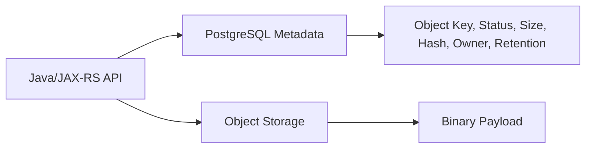
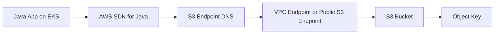
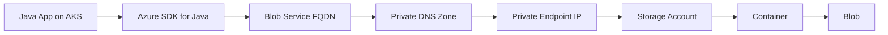
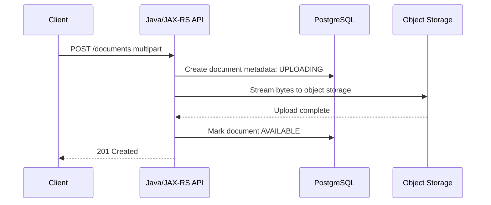
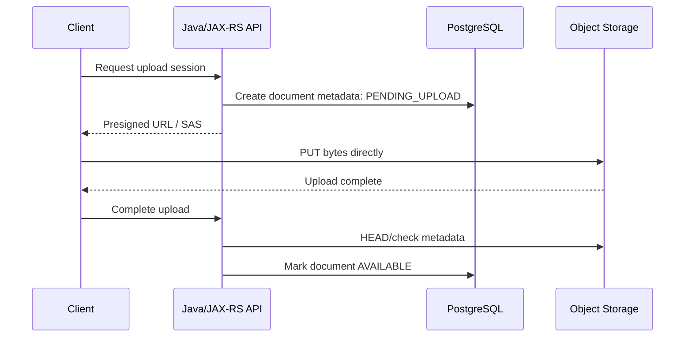
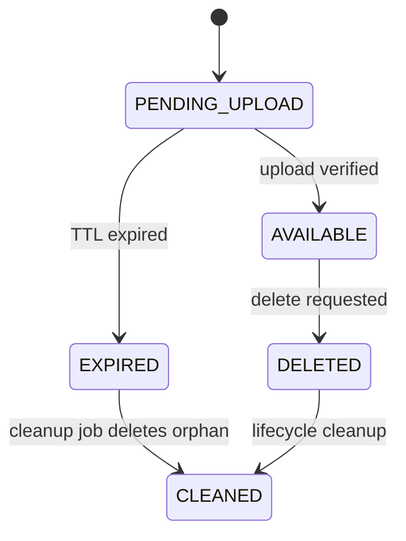
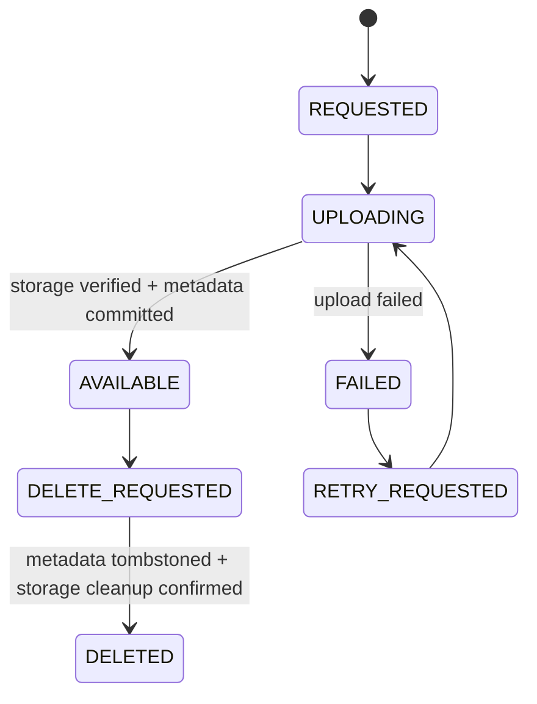

# Cheatsheet AWS and Azure for Enterprise Java/JAX-RS Systems

## Part 020 — Object Storage: AWS S3 and Azure Blob

> Goal: understand object storage as a production backend dependency for Java/JAX-RS systems, not as a generic filesystem replacement.

Object storage is commonly used for:

- uploaded documents;
- quote attachments;
- generated PDFs;
- export/import files;
- batch input/output;
- archived payloads;
- integration handoff files;
- audit evidence files;
- generated reports;
- binary artifacts that should not live in PostgreSQL.

AWS implementation: Amazon S3.

Azure implementation: Azure Blob Storage.

Both solve a similar class of problem, but their identity, authorization, endpoint, lifecycle, encryption, event, and operational models differ.

---

## 1. Core mental model

Object storage stores immutable-looking named objects inside a namespace.

It is not a POSIX filesystem.

The safest mental model:

```text
Object storage = durable key/value storage for binary objects + metadata + access policy + lifecycle rules.
```

A request usually looks like:

```text
PUT object by key
GET object by key
HEAD object metadata
LIST objects by prefix
DELETE object by key
GENERATE temporary access URL
```

### 1.1 Common mapping

| Concept | AWS S3 | Azure Blob Storage |
|---|---|---|
| Top-level storage namespace | Bucket | Storage account + container |
| Object | Object | Blob |
| Object name | Key | Blob name |
| Folder | Prefix convention | Virtual directory convention |
| Temporary delegated access | Presigned URL | SAS token / user delegation SAS |
| Lifecycle | Lifecycle configuration | Lifecycle management policy |
| Versioning | Bucket versioning | Blob versioning |
| Private network access | Gateway/Interface endpoint, PrivateLink patterns | Private Endpoint / Private Link |
| Event integration | S3 event notifications / EventBridge | Event Grid / Storage events |

---

## 2. Why object storage exists

Relational databases are not ideal for large binary payloads.

Putting large files directly in PostgreSQL can cause:

- table bloat;
- backup growth;
- restore slowdown;
- replication pressure;
- transaction latency;
- connection pool contention;
- query performance issues;
- expensive storage scaling;
- hard retention/lifecycle management.

Object storage separates binary durability from relational state.

A common enterprise pattern:



PostgreSQL stores metadata and business state.

Object storage stores bytes.

---

## 3. Object storage is not a filesystem

Do not assume:

- atomic directory rename;
- hierarchical directory semantics;
- file locking;
- append-in-place semantics;
- low-latency small random writes;
- POSIX permissions;
- local filesystem consistency model;
- cheap recursive directory operations.

Object keys can contain `/`, but that is usually a naming convention, not a real directory tree.

Bad assumption:

```text
/tenant-a/quote-123/document.pdf is a real nested directory path.
```

Better assumption:

```text
tenant-a/quote-123/document.pdf is one object key with prefix-like naming.
```

---

## 4. Object identity and key design

Object key design is an architecture decision.

A good key should support:

- uniqueness;
- tenant/customer isolation;
- environment separation;
- traceability;
- lifecycle policy;
- access control pattern;
- operational search;
- privacy constraints;
- future migration.

### 4.1 Example key pattern

```text
env=<env>/domain=quote/order=<order-id>/document=<document-id>/version=<version>/payload.bin
```

This is readable but may leak business identifiers if exposed in logs or signed URLs.

Alternative:

```text
qodoc/<yyyy>/<mm>/<hash-prefix>/<document-uuid>
```

Metadata in PostgreSQL maps business identifiers to opaque object keys.

### 4.2 PII warning

Avoid putting PII directly in object keys.

Bad:

```text
customers/john.doe@example.com/passport.pdf
```

Better:

```text
customers/8f4a.../documents/2fb1...
```

Object keys appear in:

- logs;
- access events;
- signed URLs;
- support tickets;
- metrics if used incorrectly;
- browser history if exposed through direct links.

---

## 5. Metadata strategy

Object metadata can store useful technical fields:

- content type;
- content length;
- checksum/hash;
- document type;
- schema version;
- creator service;
- correlation ID;
- retention class;
- original filename hash;
- virus scan status pointer;
- encryption classification.

But object metadata is not a replacement for relational metadata.

Use PostgreSQL for:

- ownership;
- business status;
- access decision;
- quote/order relationship;
- workflow state;
- audit workflow;
- referential integrity;
- reporting query.

Use object metadata for storage-level hints and operational debugging.

---

## 6. AWS S3 mental model

Amazon S3 stores objects in buckets.

Core elements:

- bucket;
- object key;
- object version;
- metadata;
- tags;
- storage class;
- bucket policy;
- IAM policy;
- access point if used;
- lifecycle rule;
- event notification;
- encryption configuration.

### 6.1 S3 access path



### 6.2 S3 permissions

S3 access may involve:

- IAM identity-based policy;
- bucket policy;
- resource-based conditions;
- VPC endpoint policy;
- KMS key policy if SSE-KMS is used;
- object ownership controls;
- block public access settings.

A successful S3 request may require all relevant layers to allow it.

### 6.3 S3 private access

Common private access patterns:

- Gateway VPC Endpoint for S3;
- Interface Endpoint/PrivateLink pattern where applicable;
- bucket policy condition restricting source VPC endpoint;
- private DNS behavior depending on endpoint type and architecture.

Review question:

> Does EKS access S3 through private AWS network path, or does it egress through NAT/public internet path?

---

## 7. Azure Blob Storage mental model

Azure Blob Storage stores blobs in containers inside a storage account.

Core elements:

- storage account;
- container;
- blob name;
- blob type;
- blob metadata;
- blob index tags if used;
- access tier;
- lifecycle policy;
- versioning/snapshot;
- RBAC/access policy;
- private endpoint;
- encryption configuration.

### 7.1 Azure Blob access path



### 7.2 Azure Blob permissions

Azure Blob access may involve:

- Microsoft Entra ID token;
- Azure RBAC data-plane role;
- storage account key if legacy/explicitly allowed;
- SAS token;
- stored access policy;
- network rules;
- private endpoint;
- firewall/public network access setting;
- encryption/key permissions if CMK is used.

Production services should prefer Entra-based identity and RBAC where possible instead of account keys.

---

## 8. Bucket vs container boundary

The bucket/container boundary is an isolation decision.

Possible models:

### 8.1 One bucket/container per environment

```text
dev-quote-documents
staging-quote-documents
prod-quote-documents
```

Pros:

- simple lifecycle separation;
- simple access boundary;
- easier deletion in non-prod;
- clearer cost allocation.

Cons:

- more resources;
- repeated policy setup;
- possible drift.

### 8.2 One bucket/container per tenant/customer

Pros:

- strong isolation;
- easier per-tenant retention/export;
- clear blast radius.

Cons:

- operational overhead;
- quota/resource count considerations;
- policy complexity;
- onboarding automation required.

### 8.3 Shared bucket/container with key prefix isolation

Pros:

- fewer resources;
- easier bulk operations;
- simpler platform setup.

Cons:

- policy mistakes can expose cross-tenant data;
- lifecycle rules more complex;
- accidental prefix misuse;
- harder per-tenant audit.

### 8.4 Review rule

Do not choose isolation based only on developer convenience. Choose based on:

- data sensitivity;
- tenant isolation requirement;
- regulatory requirement;
- lifecycle and retention;
- operational ownership;
- quota and cost;
- access pattern;
- incident blast radius.

---

## 9. Upload patterns

There are three common upload patterns.

### 9.1 Application-mediated upload

Client uploads to Java service. Java service streams to object storage.



Pros:

- backend controls authorization;
- easy metadata validation;
- no direct storage exposure to client;
- simpler audit in application.

Cons:

- app handles large bytes;
- higher CPU/network load;
- request timeout risk;
- memory pressure if implemented poorly;
- double network hop.

### 9.2 Direct-to-storage upload with presigned URL/SAS

Backend authorizes request and creates temporary upload URL. Client uploads directly to object storage.



Pros:

- reduces app bandwidth;
- better for large files;
- storage handles upload scalability;
- avoids app request thread holding bytes.

Cons:

- more complex lifecycle;
- completion callback required;
- orphan object cleanup needed;
- signed URL leakage risk;
- client sees storage endpoint;
- CORS/browser considerations if web client.

### 9.3 Async upload through background worker

API accepts metadata or staging input, then worker uploads or processes file.

Useful for:

- virus scanning;
- document transformation;
- export generation;
- integration batch files;
- long-running file operations.

---

## 10. Download patterns

### 10.1 Application-mediated download

Backend checks authorization, fetches object, streams response.

Pros:

- backend controls access;
- no signed URL exposure;
- can add audit events;
- can transform content.

Cons:

- app bandwidth cost;
- thread/resource usage;
- large download timeout risk;
- range request support must be implemented if needed.

### 10.2 Temporary direct download

Backend checks authorization, returns presigned URL/SAS.

Pros:

- scalable for large files;
- less load on Java service;
- storage handles transfer.

Cons:

- URL must be short-lived;
- leakage risk;
- hard revocation after issue;
- storage endpoint visible;
- must avoid putting sensitive info in URL/key.

---

## 11. Presigned URL and SAS token

### 11.1 AWS presigned URL

A presigned URL grants temporary access to an S3 operation using the permissions of the signer.

Common use:

- temporary upload;
- temporary download;
- client-side direct transfer;
- integration handoff.

### 11.2 Azure SAS token

A Shared Access Signature delegates limited access to Azure Storage resources.

SAS can define:

- allowed service/resource;
- operation permissions;
- start and expiry time;
- protocol restriction;
- IP restriction where appropriate;
- signed resource scope.

### 11.3 Production rules for temporary URLs

- keep TTL short;
- restrict operation: read vs write;
- restrict object key/blob name;
- restrict content type/size where possible;
- use HTTPS only;
- do not log full URL;
- do not expose account keys;
- store upload session state;
- verify object after client upload;
- clean up expired pending uploads;
- prefer user delegation SAS or identity-based signing where feasible in Azure.

### 11.4 Correctness risk

A temporary upload URL may be used but the client may never call completion.

Therefore, design an object state machine:



---

## 12. Multipart and large object upload

Large files should not be uploaded as one giant in-memory buffer.

### 12.1 AWS S3 multipart upload

S3 multipart upload divides a large object into parts. Parts can be uploaded independently. Failed parts can be retried without restarting the whole upload.

This is useful for:

- large files;
- unreliable networks;
- parallel upload;
- resumability patterns;
- reducing retry blast radius.

### 12.2 Azure Blob large upload

Azure Blob SDK supports streaming and block-based upload behavior for large blobs. Conceptually, large payloads are divided into blocks and committed.

### 12.3 Java service rules

- stream from request body;
- avoid `byte[]` for large payloads;
- set max upload size;
- validate Content-Type;
- validate Content-Length if available;
- calculate checksum where required;
- use temporary files only with clear disk limits;
- handle client disconnect;
- abort incomplete multipart/block upload where possible;
- emit progress/failure metrics.

---

## 13. Streaming from Java/JAX-RS

### 13.1 Dangerous pattern

```java
byte[] bytes = inputStream.readAllBytes();
blobClient.upload(new ByteArrayInputStream(bytes), bytes.length);
```

This can destroy heap under concurrent uploads.

### 13.2 Better pattern

Use streaming APIs and bounded buffers.

Pseudo-shape:

```java
public StoredObject upload(DocumentUploadCommand command, InputStream body) {
    validate(command);
    String objectKey = keyFactory.create(command);

    objectStorage.put(
        objectKey,
        body,
        command.contentLength(),
        command.contentType(),
        command.metadata()
    );

    return metadataRepository.markAvailable(command.documentId(), objectKey);
}
```

The storage adapter handles provider-specific SDK streaming.

### 13.3 Download streaming

For download:

- do not load the entire object into heap;
- stream response body;
- set Content-Type;
- set Content-Length when known;
- support Range if required;
- handle client disconnect;
- avoid logging object content;
- apply authorization before opening stream.

---

## 14. Versioning and object immutability

Versioning protects against accidental overwrite/delete.

Use cases:

- audit evidence;
- regulated document history;
- quote document version history;
- recovery from accidental deletion;
- compliance retention.

### 14.1 Versioning is not business versioning

Storage versioning is provider-level object version history.

Business versioning is application-level state.

Do not rely only on storage versioning for business workflow semantics.

Better:

```text
PostgreSQL document_version table = business version source of truth
Object storage version = recovery/audit support
```

### 14.2 Immutability and legal hold

Some systems require write-once-read-many behavior or retention lock.

Verify internally before assuming:

- regulatory retention requirement;
- immutability policy;
- legal hold process;
- who can bypass/delete;
- audit evidence location.

---

## 15. Lifecycle management

Lifecycle policies automatically transition or delete objects based on rules.

Examples:

- move old exports to cheaper tier;
- delete temporary uploads after 7 days;
- expire incomplete multipart uploads;
- archive audit files after retention threshold;
- delete non-prod test files quickly.

### 15.1 Lifecycle design questions

- Which objects are temporary?
- Which objects are business records?
- Which objects are audit evidence?
- Which objects contain PII?
- What is the retention period?
- Can objects be deleted by user request?
- Is deletion soft or hard?
- What is the restore time from archive/cold tier?
- Does lifecycle differ by environment?

### 15.2 Failure mode

A lifecycle rule can delete production data if prefix/tag conditions are wrong.

Lifecycle policy changes require PR review and test evidence.

---

## 16. Storage classes and access tiers

Object storage offers different cost/performance tiers.

### 16.1 AWS examples

Common S3 classes include hot/frequent access and colder/archive-oriented options. The exact choice depends on access pattern, retrieval latency, and cost.

### 16.2 Azure examples

Azure Blob access tiers include hot, cool/cold/archive-style patterns depending on account and configuration.

### 16.3 Engineering rule

Do not optimize storage tier in isolation.

Consider:

- retrieval latency;
- retrieval cost;
- minimum retention duration;
- operational restore process;
- user expectation;
- DR requirement;
- compliance retention;
- application timeout.

A cheap archive tier is not cheap if urgent restore becomes an incident.

---

## 17. Encryption

Both S3 and Azure Blob support encryption at rest and TLS in transit.

But enterprise systems must know:

- service-managed key or customer-managed key;
- KMS/Key Vault dependency;
- key rotation policy;
- key permission model;
- impact if key access is denied;
- audit evidence;
- cross-region replication key behavior.

### 17.1 AWS S3 encryption layers

Potential layers:

- SSE-S3/service-managed encryption;
- SSE-KMS/customer-managed key;
- bucket policy requiring encryption;
- KMS key policy;
- IAM permissions for KMS actions.

### 17.2 Azure Blob encryption layers

Potential layers:

- Microsoft-managed keys;
- customer-managed keys using Key Vault/Managed HSM;
- storage account encryption settings;
- identity permission to key;
- private endpoint and TLS settings.

### 17.3 Failure mode

Object exists, app has storage permission, but decrypt/read fails because key permission is missing or key is disabled.

Debug must check both storage authorization and key authorization.

---

## 18. Access control

### 18.1 Access control layers in S3

Review:

- IAM role policy;
- bucket policy;
- block public access;
- ACLs if legacy still exist;
- object ownership;
- VPC endpoint policy;
- KMS key policy;
- conditions such as source VPC endpoint, TLS required, encryption required.

### 18.2 Access control layers in Azure Blob

Review:

- Azure RBAC role assignment;
- storage account firewall/network rules;
- private endpoint;
- SAS policy;
- stored access policy;
- account key usage;
- container public access setting;
- Key Vault key permission if CMK is used.

### 18.3 Public exposure rule

Default posture should be private.

Any public access requires explicit architecture/security review.

---

## 19. Private connectivity

Object storage often has public service endpoints by default. Private enterprise systems may require private access.

### 19.1 AWS private access questions

- Is S3 accessed via Gateway VPC Endpoint?
- Is there an endpoint policy?
- Does bucket policy restrict access to the endpoint?
- Does traffic avoid NAT Gateway?
- Are EKS subnet route tables associated correctly?
- Are DNS and endpoint configuration correct?

### 19.2 Azure private access questions

- Is the storage account public network access disabled or restricted?
- Is Private Endpoint configured?
- Is Private DNS Zone linked to AKS VNet?
- Does pod resolve blob endpoint to private IP?
- Are NSG/UDR/firewall rules correct?
- Is on-prem DNS forwarding configured if needed?

### 19.3 Debug command mindset

From inside the pod:

```text
resolve storage endpoint
verify IP is private when expected
test TCP 443 connectivity
check SDK endpoint config
check identity authorization
check storage diagnostic logs
```

---

## 20. Event notification

Object storage can emit events.

Use cases:

- file uploaded;
- file deleted;
- object created triggers virus scan;
- export ready notification;
- downstream processing;
- audit ingestion.

### 20.1 AWS options

- S3 event notifications;
- EventBridge integration;
- Lambda/SQS/SNS targets depending on architecture.

### 20.2 Azure options

- Event Grid events for Blob Storage;
- Function/Event Hub/Service Bus integration depending on architecture.

### 20.3 Correctness concerns

Event-driven object workflows require careful design:

- at-least-once delivery;
- duplicate events;
- out-of-order events;
- event delay;
- object not immediately processable by worker due to permission/network issue;
- metadata not yet committed in DB;
- DB transaction and object event are not atomic.

Use idempotent consumers.

---

## 21. Database and object storage consistency

Object storage and PostgreSQL do not share one ACID transaction.

This creates partial failure scenarios.

### 21.1 Scenario: object uploaded, DB update fails

Result:

- orphan object exists;
- application does not reference it.

Mitigation:

- cleanup job for orphan objects;
- upload session table;
- object key includes session/document ID;
- mark status transitions explicitly.

### 21.2 Scenario: DB metadata created, object upload fails

Result:

- document row exists but object missing.

Mitigation:

- status `UPLOAD_FAILED`;
- retry job;
- user-visible retry flow;
- do not mark available until object verified.

### 21.3 Scenario: object delete succeeds, DB update fails

Result:

- metadata points to missing object.

Mitigation:

- soft delete first;
- asynchronous cleanup;
- tombstone state;
- reconciliation job.

### 21.4 Recommended state model



---

## 22. Idempotency

Idempotency is mandatory for robust object workflows.

### 22.1 Idempotent upload key

Use deterministic or reserved object keys per upload session.

Example:

```text
quote-documents/<document-id>/<upload-attempt-id>/payload
```

or:

```text
quote-documents/<document-id>/current
```

Depending on overwrite policy.

### 22.2 Conditional writes

Use provider-supported conditional behavior where appropriate:

- only create if object does not exist;
- match ETag/version;
- avoid accidental overwrite;
- detect concurrent modification.

### 22.3 Retry safety

Before retrying a failed upload, know whether:

- the object may already exist;
- the object may be partial/incomplete;
- the object may have wrong metadata;
- the DB state has changed;
- the client may retry the same request.

---

## 23. Checksums and data integrity

For critical binary handling, use checksums.

Possible checks:

- client-provided checksum;
- server-computed checksum;
- object ETag where semantics are appropriate;
- stored hash in PostgreSQL;
- post-upload HEAD verification;
- download verification for batch processing.

### 23.1 ETag warning

Do not blindly assume ETag is always a simple MD5 hash. Multipart and provider-specific behavior can change semantics.

Use explicit checksum support where required.

---

## 24. Virus scanning and content inspection

Enterprise file upload often requires malware scanning.

Possible patterns:

### 24.1 Inline scanning

API receives file, scans, then uploads.

Pros:

- simple status;
- object storage only gets clean files.

Cons:

- high latency;
- large CPU/memory load;
- scanner availability blocks upload.

### 24.2 Quarantine bucket/container

Upload to quarantine area. Scanner processes object. Clean files move/promote to available area.

Pros:

- scalable;
- async;
- clear state transitions.

Cons:

- more complex workflow;
- must block access until clean;
- cleanup/retry required.

### 24.3 Review checklist

- Is scanning required?
- Which file types are allowed?
- What is max file size?
- Where are suspicious files stored?
- Who can access quarantine?
- What is user-visible status?
- How are scan failures retried?

---

## 25. Range requests and partial downloads

Large file download may require range support.

Use cases:

- resumable download;
- browser media/file preview;
- large report retrieval;
- integration client retry.

If Java service mediates download, it must handle:

- `Range` header;
- `206 Partial Content`;
- content length;
- content range;
- invalid range;
- streaming from storage range APIs;
- authorization before range access.

If using signed URL/SAS, storage service may handle range behavior directly.

---

## 26. Caching

Object metadata can be cached carefully.

Cache candidates:

- object existence;
- content type;
- content length;
- computed download URL for very short duration only if safe;
- static reference documents.

Avoid caching:

- sensitive signed URLs beyond TTL;
- authorization decisions without invalidation strategy;
- object content in memory unless small and safe;
- stale metadata for mutable objects.

---

## 27. Observability

Object storage integration needs metrics, logs, and traces.

### 27.1 Metrics

Track:

- upload count;
- download count;
- object head/get/put/delete count;
- bytes uploaded/downloaded;
- latency by operation;
- error count by status/error code;
- retry count;
- throttling count;
- signed URL/SAS generation count;
- orphan cleanup count;
- lifecycle deletion count if available.

### 27.2 Logs

Log sanitized fields:

- document ID;
- object key hash or safe opaque key;
- operation;
- content length;
- content type;
- storage provider;
- bucket/container;
- latency;
- status/error code;
- correlation ID;
- retry count.

Never log:

- full signed URL;
- SAS token;
- account key;
- object content;
- PII object name;
- Authorization header.

### 27.3 Traces

Trace should show:

```text
POST /quotes/{id}/documents
  -> metadata insert
  -> object storage PUT
  -> metadata update AVAILABLE
```

or for direct upload:

```text
POST /documents/upload-session
  -> metadata create PENDING_UPLOAD
  -> signed URL generation
```

---

## 28. Cost model

Object storage cost includes more than GB stored.

Cost drivers:

- storage volume;
- request count;
- data retrieval;
- data transfer/egress;
- replication;
- lifecycle tier transitions;
- archive restore;
- logging/diagnostics;
- KMS/Key Vault operations;
- NAT Gateway or egress path;
- cross-region access;
- duplicate orphan files.

### 28.1 Cost anti-patterns

- storing temporary files forever;
- repeated upload retries creating duplicates;
- direct download through Java service causing double data transfer;
- cross-region object access;
- verbose object access logging without retention control;
- no lifecycle rule for exports/import staging;
- using archive tier for files that need frequent access.

---

## 29. Performance model

Performance depends on:

- object size;
- request rate;
- prefix/key distribution;
- network path;
- private endpoint path;
- cross-region distance;
- SDK transfer strategy;
- multipart/block upload;
- connection reuse;
- TLS overhead;
- app thread pool;
- client timeout;
- storage account/bucket limits and service quotas.

### 29.1 Backend performance rule

Large object transfer should be treated as a streaming workload, not a normal JSON API call.

For large files, prefer:

- direct-to-storage upload/download where security allows;
- async processing;
- bounded concurrency;
- multipart/block transfer;
- explicit timeout;
- progress/retry model.

---

## 30. Security baseline

Minimum baseline:

- storage is private by default;
- public access disabled unless explicitly approved;
- workload identity/managed identity/IAM role used;
- no account keys in app if avoidable;
- least privilege read/write/delete permissions;
- private endpoint or VPC endpoint where required;
- encryption at rest enabled;
- TLS required;
- signed URLs/SAS short-lived;
- object keys do not expose PII;
- audit logs enabled;
- lifecycle and retention reviewed;
- delete operations controlled;
- bucket/container policy reviewed by security/platform.

---

## 31. Failure mode table

| Symptom | Likely layer | Common cause | First check |
|---|---|---|---|
| Upload timeout | Network/SDK/app | file too large, timeout too short, storage slow | SDK timeout, object size, network path |
| JVM OOM during upload | Application | loading whole file into heap | upload implementation |
| 403 AccessDenied/AuthorizationFailure | Identity/authz | IAM/RBAC/policy missing | role assignment, bucket/container policy |
| DNS resolves public IP | DNS/private endpoint | private DNS missing | pod DNS lookup |
| Download returns wrong file | Correctness | bad object key mapping | PostgreSQL metadata and key generation |
| Object exists but DB says missing | Consistency | DB update failed after upload | upload state machine/reconciliation |
| DB references missing object | Consistency | delete/upload partial failure | object HEAD and metadata state |
| Signed URL leaked | Security | logged full URL or long TTL | logs and URL TTL |
| High storage cost | Cost | lifecycle missing, orphan files | cost report and cleanup jobs |
| Throttling | Capacity | high request volume/list loop | service metrics and request count |
| Slow downloads | Performance | app-mediated large transfer | direct download strategy and network path |

---

## 32. Troubleshooting playbook

### 32.1 Upload fails

Check:

1. object key generated correctly;
2. bucket/container exists;
3. identity has write permission;
4. KMS/Key Vault key permission if CMK is used;
5. endpoint resolves to expected IP;
6. private endpoint/VPC endpoint path works;
7. file size within limit;
8. SDK timeout/retry config;
9. storage service diagnostic logs;
10. DB state transition.

### 32.2 Download fails

Check:

1. application authorization decision;
2. metadata row points to correct object key;
3. object exists via HEAD;
4. identity has read permission;
5. object version if versioned;
6. encryption key permission;
7. endpoint/DNS path;
8. response streaming logic;
9. range request logic if used;
10. client timeout.

### 32.3 Signed URL/SAS fails

Check:

1. URL not expired;
2. clock skew;
3. permission includes required operation;
4. object key/blob name matches;
5. content type/headers match signing constraints;
6. IP/protocol restrictions;
7. signer identity permission;
8. account/container/bucket policy;
9. URL was not modified by proxy/client;
10. full URL not logged or exposed beyond intended recipient.

### 32.4 Private access fails

Check:

1. DNS resolution from pod;
2. private IP expected vs actual;
3. route table/UDR;
4. Security Group/NSG;
5. firewall rule;
6. VPC endpoint/private endpoint status;
7. endpoint policy;
8. bucket/container firewall/network rules;
9. on-prem DNS forwarding if hybrid;
10. SDK endpoint override.

---

## 33. Java/JAX-RS object storage adapter pattern

Use an abstraction to avoid leaking S3/Blob SDK details into domain logic.

```java
public interface ObjectStore {
    PutObjectResult put(PutObjectCommand command, InputStream stream);
    Optional<ObjectMetadata> head(ObjectKey key);
    InputStream openStream(ObjectKey key);
    TemporaryAccessUrl createDownloadUrl(ObjectKey key, Duration ttl);
    void delete(ObjectKey key);
}
```

Provider-specific implementations:

```text
S3ObjectStore implements ObjectStore
AzureBlobObjectStore implements ObjectStore
```

Domain service uses `ObjectStore`, not `S3Client` or `BlobClient` directly.

Benefits:

- cloud portability;
- easier testing;
- safer error mapping;
- clear retry/timeout policy;
- consistent observability;
- PR review focuses on adapter boundary.

---

## 34. Integration with PostgreSQL

A typical metadata table:

```sql
CREATE TABLE document_object (
    document_id UUID PRIMARY KEY,
    quote_id UUID NOT NULL,
    storage_provider TEXT NOT NULL,
    bucket_or_container TEXT NOT NULL,
    object_key TEXT NOT NULL,
    object_version TEXT NULL,
    content_type TEXT NOT NULL,
    content_length BIGINT NOT NULL,
    checksum TEXT NULL,
    status TEXT NOT NULL,
    created_at TIMESTAMPTZ NOT NULL,
    updated_at TIMESTAMPTZ NOT NULL
);
```

Production notes:

- do not store signed URL as permanent state;
- store object key and version, not temporary access token;
- status must represent partial failure;
- audit table may be required for access/download events;
- object deletion should be stateful, not blind.

---

## 35. Integration with Kafka/RabbitMQ

Object storage often pairs with messaging.

Patterns:

- event contains object key, not full payload;
- consumer downloads object;
- producer uploads object then publishes metadata event;
- scanner publishes clean/dirty result;
- export job publishes file-ready event.

### 35.1 Message design

Good event fields:

```json
{
  "eventId": "...",
  "documentId": "...",
  "storageProvider": "azure-blob",
  "bucketOrContainer": "quote-documents",
  "objectKey": "...",
  "objectVersion": "...",
  "contentType": "application/pdf",
  "contentLength": 123456,
  "checksum": "..."
}
```

Do not include:

- signed URL unless explicitly required and short-lived;
- raw file bytes;
- account key;
- SAS token;
- PII in routing keys.

---

## 36. Integration with Camunda/workflow

Workflow engines should not treat object storage operations as invisible side effects.

Workflow should track:

- upload requested;
- upload completed;
- scan requested;
- scan completed;
- document approved;
- retention applied;
- deletion requested;
- deletion completed.

External tasks must be idempotent.

If a worker uploads a file and then fails before completing task, retry must not corrupt object state.

---

## 37. PR review checklist

### Object model

- [ ] Is object key design documented?
- [ ] Does key avoid PII leakage?
- [ ] Is metadata stored in PostgreSQL?
- [ ] Is object storage not used as a database?
- [ ] Are object states explicit?

### Upload/download

- [ ] Is large file handling streaming-based?
- [ ] Is max file size enforced?
- [ ] Is Content-Type validated?
- [ ] Is Content-Length handled?
- [ ] Is checksum required?
- [ ] Is Range support needed?
- [ ] Is direct upload/download considered?

### Identity/security

- [ ] Is access private by default?
- [ ] Is least privilege used?
- [ ] Are account keys avoided?
- [ ] Are presigned URLs/SAS short-lived?
- [ ] Are full temporary URLs excluded from logs?
- [ ] Is encryption requirement met?
- [ ] Are KMS/Key Vault permissions correct?

### Networking

- [ ] Does traffic use VPC endpoint/private endpoint if required?
- [ ] Does DNS resolve privately?
- [ ] Are route table/UDR and SG/NSG correct?
- [ ] Is cross-region traffic avoided or justified?

### Reliability/correctness

- [ ] Are partial failures modeled?
- [ ] Is upload idempotent?
- [ ] Are orphan objects cleaned?
- [ ] Are retries bounded?
- [ ] Is lifecycle policy safe?
- [ ] Are delete operations reversible or audited if required?

### Observability/cost

- [ ] Are storage operation metrics emitted?
- [ ] Are errors classified?
- [ ] Are bytes uploaded/downloaded measured?
- [ ] Are logs sanitized?
- [ ] Is lifecycle/cost reviewed?
- [ ] Are orphan cleanup metrics visible?

---

## 38. Internal verification checklist

Verify these in the actual CSG/team environment.

### AWS S3

- [ ] Which buckets are used for Quote & Order workloads?
- [ ] Which AWS account owns each bucket?
- [ ] Are buckets environment-specific?
- [ ] Is S3 Block Public Access enabled?
- [ ] What bucket policies exist?
- [ ] Which IAM roles can read/write/delete?
- [ ] Are VPC endpoints used?
- [ ] Are endpoint policies configured?
- [ ] Is SSE-S3 or SSE-KMS used?
- [ ] Which KMS key is used if applicable?
- [ ] Is versioning enabled?
- [ ] Are lifecycle rules configured?
- [ ] Are event notifications configured?
- [ ] Are access logs or CloudTrail data events enabled if required?

### Azure Blob Storage

- [ ] Which storage accounts are used?
- [ ] Which containers store documents/exports/imports?
- [ ] Which subscription/resource group owns them?
- [ ] Is public network access disabled/restricted?
- [ ] Are Private Endpoints configured?
- [ ] Which Private DNS Zones are linked?
- [ ] Which managed identities/service principals have access?
- [ ] Which RBAC data roles are assigned?
- [ ] Are account keys disabled or controlled?
- [ ] Is CMK used?
- [ ] Is versioning enabled?
- [ ] Are lifecycle policies configured?
- [ ] Are Event Grid events configured?
- [ ] Are storage diagnostic logs enabled?

### Application architecture

- [ ] Does Java service stream upload/download?
- [ ] Does it store metadata in PostgreSQL?
- [ ] Is object key opaque enough?
- [ ] Are temporary upload sessions modeled?
- [ ] Are signed URLs/SAS generated? With what TTL?
- [ ] Is virus scanning required?
- [ ] Is orphan cleanup implemented?
- [ ] Are object operations included in tracing?
- [ ] Are storage errors mapped safely?
- [ ] Is there a production runbook?

---

## 39. Final mental model

Object storage is one of the most important external dependencies in enterprise backend systems.

It is durable and scalable, but it is not magic.

For every object storage design, answer:

```text
What is stored?
Who owns it?
What is the object key?
Does the key leak sensitive data?
Where is business metadata stored?
Who can read/write/delete?
Is access private?
How are temporary URLs controlled?
How are large files streamed?
How are partial failures reconciled?
How are objects encrypted?
How are objects retained/deleted?
How are access and changes audited?
How do we debug upload/download failure?
How do we control cost?
```

If the design cannot answer these, it is not production-ready.

---

## References for further verification

Use official vendor documentation as baseline, then verify actual implementation internally:

- AWS Documentation — Amazon S3 User Guide.
- AWS Documentation — S3 presigned URLs.
- AWS Documentation — S3 multipart upload.
- AWS Documentation — AWS SDK for Java S3 upload best practices.
- Microsoft Learn — Azure Blob Storage documentation.
- Microsoft Learn — Azure Storage Blob client library for Java.
- Microsoft Learn — Shared Access Signatures for Azure Storage.
- Microsoft Learn — Azure Blob Storage lifecycle, access tiers, private endpoints, and security guidance.

