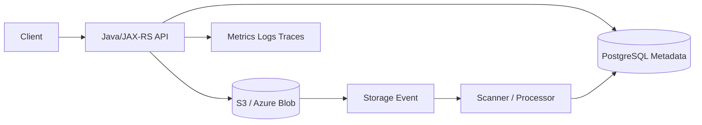
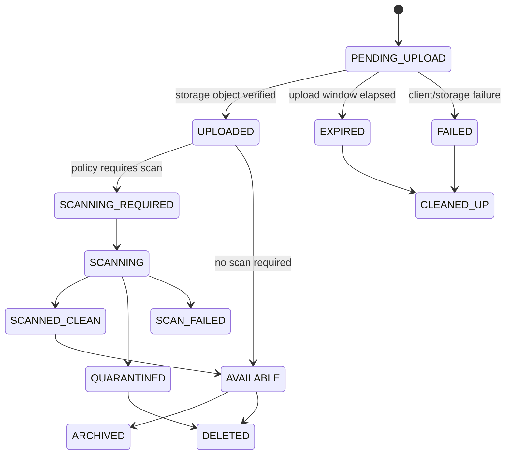
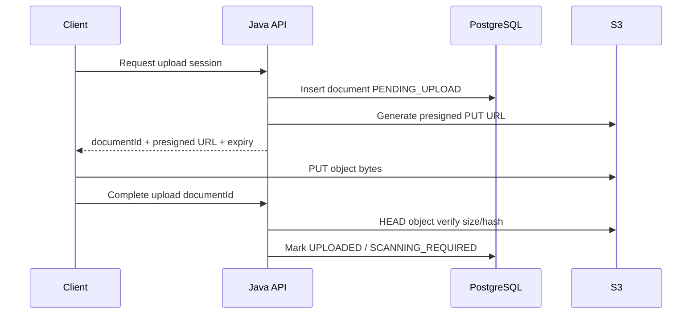
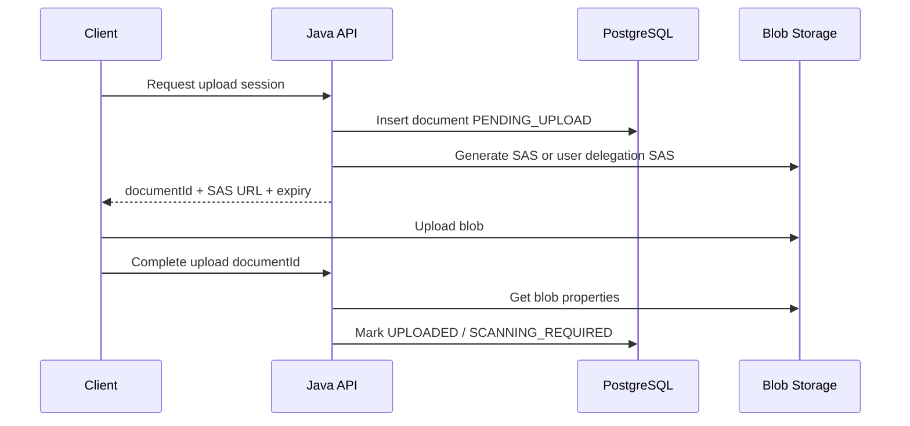

# Cheatsheet AWS and Azure for Enterprise Java/JAX-RS Systems

## Part 021 — File and Binary Handling from Java Services

> Goal: design file and binary handling flows that are safe for JVM memory, secure by default, compatible with object storage, observable in production, and defensible during incident review.

This part builds on Part 020.

Object storage is where the bytes usually live.

This part focuses on the application-facing lifecycle:

```text
client upload/download request
    -> Java/JAX-RS endpoint
    -> validation
    -> streaming
    -> object storage
    -> PostgreSQL metadata
    -> async scanning/processing
    -> audit/observability
    -> secure retrieval
```

In enterprise Quote & Order style systems, files may represent:

- quote attachments;
- signed documents;
- generated PDFs;
- CSV imports;
- bulk export files;
- partner integration payloads;
- workflow evidence;
- audit evidence;
- customer-submitted documents;
- internal operational reports.

The hard part is not `upload file`.

The hard part is keeping correctness, security, memory, latency, observability, and retention under control.

---

## 1. Core mental model

A file-handling backend should not treat a binary object as just another request body.

Use this model:

```text
File handling = byte stream + metadata + authorization + lifecycle + retention + audit + failure recovery.
```

The actual bytes are only one piece.

A production design needs to answer:

```text
Who may upload?
Who owns the file?
What entity is it attached to?
What state is the upload in?
Where are bytes stored?
What metadata is persisted?
Has it been scanned?
Can it be downloaded?
Who may download it?
When does access expire?
When is it deleted or archived?
How is failure reconciled?
```

---

## 2. Why file handling is dangerous in Java backend systems

File APIs often look simple, but they can break production in non-obvious ways.

Common failure patterns:

- reading entire file into heap;
- unlimited multipart upload size;
- slow client holding servlet/request threads;
- object storage timeout without retry boundary;
- upload succeeds but metadata transaction fails;
- metadata commit succeeds but object upload fails;
- antivirus scan is skipped or races with download;
- signed URL exposes object key or wrong tenant data;
- content type is trusted from client input;
- object key contains PII;
- temporary files fill node disk;
- range downloads bypass authorization;
- retry creates duplicate objects;
- orphan objects accumulate forever;
- large downloads saturate application pods;
- logs include object names or customer filenames;
- file lifecycle does not match business retention policy.

A senior engineer should assume file handling is a distributed workflow, not a single controller method.

---

## 3. Recommended architecture split

Separate three concerns:

| Concern | Preferred owner | Example |
|---|---|---|
| Business metadata | PostgreSQL | document id, quote id, status, owner, checksum, retention class |
| Binary payload | Object storage | S3 object / Azure Blob |
| Lifecycle transitions | Application + async workers | pending, uploaded, scanned, approved, deleted |

Example:



Do not store large files in PostgreSQL unless there is a deliberate reason and the operational impact is accepted.

---

## 4. Upload pattern options

There are three common upload patterns.

### 4.1 Pattern A — client uploads to Java service, Java streams to storage

```text
Client -> Java API -> S3/Blob
```

Use when:

- the API must inspect the stream;
- client cannot access object storage directly;
- strict centralized authorization is required;
- upload size is moderate;
- corporate clients only know the application endpoint;
- extra processing must happen inline.

Risks:

- application pod bandwidth becomes bottleneck;
- API thread/request timeout must cover upload;
- JVM memory and temp disk must be controlled;
- retries can duplicate uploads;
- ingress/load balancer timeouts may abort long uploads.

### 4.2 Pattern B — Java service creates upload session, client uploads directly to storage

```text
Client -> Java API: create upload session
Java API -> PostgreSQL: pending metadata
Java API -> S3/Blob: presigned URL or SAS
Client -> S3/Blob: upload bytes
Client -> Java API: complete upload
Java API -> storage HEAD: verify object
Java API -> PostgreSQL: mark uploaded
```

Use when:

- large files are expected;
- application pods should not proxy bytes;
- browser/client can handle direct upload;
- object storage can be safely exposed via short-lived delegated URL;
- network path to storage is acceptable.

Risks:

- URL leakage;
- object uploaded but completion callback never happens;
- object key must be unguessable;
- policy must restrict method, key, size, content type if possible;
- orphan cleanup is required.

### 4.3 Pattern C — integration system drops file into storage, backend processes event

```text
Partner/System -> Object Storage
Object Storage Event -> Queue/Event Bus
Worker -> Validate/Process -> PostgreSQL
```

Use when:

- files arrive from batch/integration systems;
- processing is asynchronous;
- throughput matters more than immediate API response;
- external partner already has storage-level access.

Risks:

- event loss or duplicate event;
- file appears before metadata exists;
- malformed file consumes worker capacity;
- poison file retries forever;
- identity boundary may be too broad.

---

## 5. Upload state machine

A robust file upload should have explicit state.



Avoid a boolean like:

```text
uploaded = true
```

That loses lifecycle detail.

Prefer:

```text
status = PENDING_UPLOAD | UPLOADED | SCANNING | AVAILABLE | QUARANTINED | FAILED | DELETED
```

---

## 6. Metadata model

A minimal file metadata table might include:

```text
document_id
business_entity_type
business_entity_id
tenant_id
storage_provider
storage_account_or_bucket
storage_container
object_key
version_id_or_etag
content_type
content_length
checksum
original_filename_sanitized
upload_status
scan_status
created_by
created_at
available_at
retention_class
delete_after
correlation_id
```

### 6.1 Do not rely only on object storage metadata

Object storage metadata is useful, but application state should live in the system of record.

PostgreSQL metadata gives you:

- queryability;
- transactional attachment to domain entities;
- authorization context;
- lifecycle state;
- auditability;
- retention decisions;
- cleanup reconciliation;
- migration capability.

---

## 7. JAX-RS upload endpoint principles

A file upload endpoint must enforce boundaries before streaming too much data.

Checklist:

- authenticate caller;
- authorize against business entity;
- validate declared content type;
- validate file size limit;
- reject unsupported multipart fields;
- create metadata row before or after upload intentionally;
- stream bytes without buffering whole file;
- compute checksum if required;
- write object with safe key;
- commit metadata state;
- emit audit/metric/trace;
- return stable document id, not raw object key.

### 7.1 Avoid heap buffering

Bad pattern:

```java
byte[] allBytes = inputStream.readAllBytes();
s3.putObject(request, RequestBody.fromBytes(allBytes));
```

This couples maximum file size to JVM heap.

Under concurrent upload, it becomes a production incident.

Better mental model:

```text
read small chunks -> stream to storage/client -> apply bounded memory
```

### 7.2 Example JAX-RS shape

This is illustrative, not a complete library-specific implementation.

```java
@POST
@Path("/quotes/{quoteId}/documents")
@Consumes(MediaType.MULTIPART_FORM_DATA)
@Produces(MediaType.APPLICATION_JSON)
public Response uploadDocument(
        @PathParam("quoteId") String quoteId,
        @Context SecurityContext securityContext,
        MultipartFormDataInput multipart) {

    // 1. Authenticate and authorize against quote/order domain.
    // 2. Validate metadata fields.
    // 3. Validate file part presence, filename, content type, and declared size if available.
    // 4. Create upload metadata in PENDING_UPLOAD state.
    // 5. Stream file part to object storage using bounded memory.
    // 6. Verify object size/checksum where possible.
    // 7. Mark UPLOADED or SCANNING_REQUIRED.
    // 8. Return document id and current status.

    return Response.accepted(entity).build();
}
```

The important point is the lifecycle, not this exact API shape.

---

## 8. Streaming upload to AWS S3

AWS SDK for Java supports streaming uploads, but the implementation details matter.

Core concerns:

- known content length vs unknown content length;
- synchronous vs asynchronous client;
- multipart upload for large/unknown streams;
- retry behavior;
- checksum validation;
- timeout configuration;
- aborting incomplete multipart uploads;
- memory pressure from buffering unknown streams.

### 8.1 Known length is safer

If `Content-Length` is known and trusted after validation, a simple streaming upload can be bounded.

Conceptual shape:

```java
PutObjectRequest request = PutObjectRequest.builder()
    .bucket(bucket)
    .key(objectKey)
    .contentType(contentType)
    .contentLength(contentLength)
    .metadata(metadata)
    .build();

s3Client.putObject(request, RequestBody.fromInputStream(inputStream, contentLength));
```

Do not blindly trust client-provided length.

Validate against:

- API limit;
- business document policy;
- tenant policy;
- ingress limit;
- object storage policy.

### 8.2 Unknown length needs special care

Unknown-length streams can cause buffering depending on API path.

For large unknown streams, prefer:

- multipart upload;
- direct-to-storage upload;
- temporary file with strict disk limit;
- async streaming with bounded backpressure.

### 8.3 Multipart upload correctness

Multipart upload introduces its own lifecycle:

```text
CreateMultipartUpload
UploadPart 1..N
CompleteMultipartUpload
AbortMultipartUpload on failure
```

Failure modes:

- complete fails after all parts uploaded;
- worker crashes before abort;
- orphaned multipart uploads accumulate;
- retries upload duplicated part numbers;
- checksum mismatch;
- object appears only after completion;
- lifecycle cleanup rule is missing.

Production rule:

```text
Every multipart upload path must have abort and cleanup logic.
```

---

## 9. Streaming upload to Azure Blob Storage

Azure Blob Storage Java client supports uploads from file, stream, binary data, and text.

Core concerns:

- block blob upload size;
- overwrite behavior;
- metadata and tags;
- access tier;
- request conditions;
- timeout/retry through Azure Core HTTP pipeline;
- private endpoint DNS;
- managed identity/RBAC;
- SAS token vs SDK credential path.

Conceptual shape:

```java
BlobClient blobClient = containerClient.getBlobClient(blobName);

blobClient.upload(inputStream, contentLength, true);
blobClient.setHttpHeaders(new BlobHttpHeaders()
    .setContentType(contentType));
```

This is not sufficient alone for production.

You still need:

- authorization before upload;
- object name discipline;
- metadata row;
- failure mapping;
- checksum or ETag handling;
- observability;
- scan/retention lifecycle.

---

## 10. Direct-to-storage upload with presigned URL or SAS

Direct-to-storage upload reduces load on Java service.

### 10.1 AWS presigned URL upload flow



### 10.2 Azure SAS upload flow



### 10.3 Guardrails for delegated upload

Presigned URL/SAS must be constrained.

Review:

- short expiry;
- method restriction;
- object key restriction;
- content length restriction if supported by mechanism/policy;
- content type expectation;
- HTTPS only;
- tenant/entity binding;
- single-use behavior simulated through metadata state;
- server-side verification after upload;
- orphan cleanup for expired sessions;
- no broad bucket/container permission.

---

## 11. Download pattern options

### 11.1 Pattern A — Java service proxies download

```text
Client -> Java API -> S3/Blob -> Java API -> Client
```

Use when:

- authorization must be evaluated per request;
- client cannot access object storage;
- content must be transformed;
- range request support is not required or is implemented carefully;
- file size is moderate.

Risks:

- pod bandwidth bottleneck;
- long-running request threads;
- ingress timeout;
- application autoscaling pressure;
- expensive double data transfer;
- partial download handling complexity.

### 11.2 Pattern B — Java service returns temporary download URL

```text
Client -> Java API: authorize
Java API -> S3/Blob: generate presigned URL/SAS
Java API -> Client: temporary URL
Client -> S3/Blob: download
```

Use when:

- files are large;
- client can access storage endpoint;
- strict short-lived access is acceptable;
- object key leakage is controlled;
- audit requirement can be met with storage access logs and application audit.

Risks:

- URL sharing before expiry;
- URL appears in browser history/proxy logs;
- storage access log must be enabled if needed;
- direct access may bypass application-level download event unless tracked separately.

---

## 12. Range request support

Range requests allow clients to download partial content.

Useful for:

- large PDFs;
- resumable downloads;
- media-like assets;
- unstable client connections;
- browser preview.

But they complicate:

- authorization;
- audit semantics;
- content-length handling;
- cache behavior;
- object storage SDK calls;
- response header correctness.

If the Java API proxies downloads, it must handle:

```text
Range: bytes=0-1048575
```

and return correct:

```text
206 Partial Content
Content-Range
Accept-Ranges
Content-Length
Content-Type
ETag
```

Do not implement range requests casually.

Prefer delegated storage download if the storage service can safely handle range requests directly.

---

## 13. Content-Type strategy

Do not trust `Content-Type` from the client as truth.

Use it as a hint.

Validate with:

- allowed file extension list;
- server-side MIME detection where needed;
- magic number inspection for high-risk file types;
- virus/malware scanning;
- business document type rules;
- security review.

Examples:

| Claimed type | Actual risk |
|---|---|
| `application/pdf` | Could be executable or malicious payload renamed as PDF |
| `text/csv` | Could include formula injection for spreadsheet consumers |
| `image/png` | Could contain malformed parser exploit |
| `application/zip` | Could be zip bomb |

### 13.1 CSV injection warning

If exporting CSV files consumed by spreadsheet tools, consider formula injection.

Dangerous cell prefixes:

```text
= + - @
```

This is not a cloud storage issue, but it often appears in export/download workflows.

---

## 14. Content-Length and size limit strategy

Define size limits at multiple layers:

- client UI;
- API gateway/APIM;
- load balancer;
- ingress controller;
- JAX-RS runtime;
- multipart parser;
- service validation;
- object storage policy if possible.

The smallest effective limit wins.

If these are inconsistent, users see confusing failures:

```text
413 Payload Too Large
502 Bad Gateway
504 Gateway Timeout
connection reset
SDK timeout
partial upload
```

Internal verification should map every upload limit in the request path.

---

## 15. Temporary file strategy

Some libraries spool multipart data to disk.

This is safer than heap buffering, but still dangerous.

Check:

- temp directory location;
- disk size;
- cleanup behavior;
- concurrent upload limit;
- container ephemeral storage limit;
- node disk pressure behavior;
- Kubernetes eviction threshold;
- security of temp file permissions;
- whether temp files are encrypted at rest.

Production rule:

```text
A temp-file based upload path must have disk quota, cleanup, and monitoring.
```

---

## 16. Memory pressure model

Java file upload memory is affected by:

- multipart parser buffering;
- request body buffering by framework;
- gateway/ingress buffering;
- SDK buffering;
- checksum calculation;
- compression/decompression;
- async queues;
- logging accidental byte arrays;
- retry buffering.

### 16.1 Worst-case estimate

Use a simple bound:

```text
max_upload_memory ~= concurrent_uploads * per_upload_buffer
```

But also include hidden buffers:

```text
framework buffer + SDK buffer + TLS buffer + checksum buffer + queue buffer
```

If 50 concurrent uploads each buffer 16 MiB, that is already 800 MiB before application objects.

---

## 17. Backpressure and concurrency control

File endpoints should have stricter concurrency control than lightweight JSON APIs.

Controls:

- separate thread pool;
- request body size limit;
- upload semaphore;
- rate limit per tenant/client;
- async queue for processing;
- bounded executor;
- circuit breaker around object storage;
- bulkhead separate from business APIs.

Do not let large uploads starve quote/order APIs.

---

## 18. Virus scanning and content inspection

Many enterprises require malware scanning for uploaded documents.

Common patterns:

### 18.1 Inline scanning

```text
Client -> Java API -> scanner -> object storage -> available
```

Pros:

- simple state;
- file rejected before storage availability;
- easier immediate user feedback.

Cons:

- high latency;
- scanner outage blocks upload;
- large files tie up API request;
- scaling scanner inline is hard.

### 18.2 Asynchronous scanning

```text
Upload -> object storage -> event -> scanner -> status update
```

Pros:

- better scalability;
- upload response can be quick;
- scanner can be isolated.

Cons:

- file must remain unavailable until clean;
- state machine required;
- quarantine path required;
- event duplicate/loss handling required.

Production rule:

```text
Do not allow download before scan status permits it.
```

Unless internal policy explicitly says scanning is not required for that document class.

---

## 19. Private object access

A private object should not be public just because the application can generate a URL.

Private access should involve:

- private bucket/container;
- no public ACL or anonymous access;
- workload identity for service access;
- short-lived delegated access for clients;
- private endpoint if required;
- storage access logging;
- audit record in application metadata;
- tenant authorization before URL generation.

### 19.1 Common mistake

Bad:

```text
Store object in public bucket/container and rely on unguessable URL.
```

Better:

```text
Private bucket/container + explicit identity authorization + short-lived delegated URL.
```

---

## 20. Expiring link strategy

Presigned URLs and SAS tokens are capability URLs.

Whoever has the URL can usually use it until expiry, subject to policy constraints.

Recommended default:

- short TTL;
- generated only after authorization;
- narrow object key;
- only required method;
- no broad container/bucket scope;
- log issuance event;
- do not log full URL;
- rotate signing identity/key according to platform policy;
- separate upload URL TTL from download URL TTL.

### 20.1 Do not log full delegated URLs

Full presigned URLs/SAS URLs may contain sensitive signature material.

Log:

```text
documentId, objectKeyHash, operation, expiry, requester, correlationId
```

Do not log:

```text
full URL with signature
```

---

## 21. File naming strategy

Original filenames are user input.

Risks:

- path traversal style names;
- weird Unicode;
- control characters;
- PII leakage;
- log injection;
- duplicate collisions;
- unsafe browser rendering;
- misleading extension.

Recommended:

- store sanitized original filename as metadata;
- do not use original filename as object key;
- generate opaque object key;
- normalize Unicode if needed;
- escape filename in `Content-Disposition`;
- enforce maximum filename length;
- reject control characters.

---

## 22. Content-Disposition strategy

For download responses, choose intentionally:

```text
Content-Disposition: attachment; filename="document.pdf"
```

or:

```text
Content-Disposition: inline; filename="document.pdf"
```

`inline` can create browser execution/rendering risks depending on content type.

For sensitive or user-generated content, default to attachment unless product requirements need inline preview.

---

## 23. Checksums and integrity

Use checksums to detect corruption and duplicate upload issues.

Options:

- client-provided checksum;
- server-computed checksum during stream;
- object storage checksum/ETag awareness;
- metadata checksum in PostgreSQL;
- post-upload verification.

Important caveat:

```text
ETag is not always a simple MD5 hash, especially for multipart uploads or encrypted objects.
```

Do not build correctness logic on a simplified ETag assumption.

---

## 24. Idempotency strategy

Upload completion APIs should be idempotent.

Example:

```text
POST /documents/{documentId}/complete
```

If called twice:

- first call verifies object and marks uploaded;
- second call should return current state, not create a second document;
- if object is already scanned/available, do not reset lifecycle accidentally.

Use stable identifiers:

```text
uploadSessionId
documentId
objectKey
idempotencyKey
```

---

## 25. Partial failure handling

### 25.1 Object upload succeeds, metadata update fails

Risk:

```text
orphan object exists without metadata state
```

Mitigation:

- pre-create metadata row;
- reconciliation job;
- object prefix includes upload session id;
- lifecycle cleanup for pending objects;
- storage event can repair metadata cautiously.

### 25.2 Metadata says uploaded, object missing

Risk:

```text
download fails later
```

Mitigation:

- verify object before marking uploaded;
- HEAD object during completion;
- periodic consistency audit;
- mark metadata as broken if object missing;
- alert on mismatch.

### 25.3 Scan fails after upload

Risk:

```text
file is neither available nor cleaned
```

Mitigation:

- explicit `SCAN_FAILED` state;
- retry policy;
- quarantine path;
- operator dashboard;
- user-facing status.

---

## 26. Interaction with PostgreSQL

PostgreSQL should store business metadata, not large bytes.

Typical metadata operations:

- create document record;
- attach to quote/order/customer entity;
- enforce tenant ownership;
- track status;
- store object key;
- store checksum and size;
- record audit events;
- query documents by business entity;
- drive cleanup and retention.

### 26.1 Transaction boundary warning

Database transaction and object storage write are not one atomic transaction.

This is distributed consistency.

Use explicit recovery design.

Do not pretend this is ACID across PostgreSQL and S3/Blob.

---

## 27. Interaction with Kafka/RabbitMQ

File workflows often emit events:

```text
DocumentUploadRequested
DocumentUploaded
DocumentScanRequested
DocumentScanCompleted
DocumentAvailable
DocumentDeleted
```

Event payload should not include raw bytes.

Prefer:

```json
{
  "documentId": "doc-123",
  "businessEntityType": "QUOTE",
  "businessEntityId": "quote-456",
  "status": "UPLOADED",
  "contentLength": 1048576,
  "checksum": "sha256:...",
  "correlationId": "..."
}
```

Avoid:

```json
{
  "fileBytes": "base64..."
}
```

Base64 in events increases broker load, retention cost, memory usage, and privacy risk.

---

## 28. Interaction with Camunda/workflow

For workflow systems, do not pass large file bytes through process variables.

Store:

- document id;
- metadata id;
- storage reference id;
- status;
- scan result;
- business classification.

A workflow step can wait for:

```text
DocumentAvailable(documentId)
```

Rather than carrying file content.

---

## 29. Interaction with NGINX/ingress/load balancer

Upload/download paths are sensitive to proxy settings.

Verify:

- maximum body size;
- request buffering;
- response buffering;
- idle timeout;
- read timeout;
- write timeout;
- header size;
- TLS termination;
- client IP forwarding;
- 413/502/503/504 behavior;
- access log fields.

Mismatch example:

```text
API accepts 100 MiB, ingress allows 10 MiB -> user sees 413 before Java code runs.
```

Another mismatch:

```text
Java upload timeout 5 minutes, load balancer idle timeout 60 seconds -> random connection resets.
```

---

## 30. EKS and AKS considerations

### 30.1 Pod resources

Set realistic:

- memory request/limit;
- CPU request/limit;
- ephemeral storage request/limit;
- readiness/liveness probes;
- max concurrent uploads;
- HPA metric.

### 30.2 Node pressure

Large uploads can create:

- memory pressure;
- disk pressure;
- network saturation;
- pod eviction;
- noisy neighbor impact.

### 30.3 Private storage access

EKS path may use:

- IRSA;
- VPC Endpoint / PrivateLink pattern;
- security groups;
- Route 53 private hosted zone;
- S3 gateway/interface endpoint depending on design.

AKS path may use:

- Workload Identity or managed identity;
- Private Endpoint;
- Private DNS Zone;
- NSG/UDR/firewall path;
- Azure Storage RBAC.

---

## 31. On-prem and hybrid considerations

On-prem clients may face:

- no direct internet access;
- corporate proxy;
- internal CA;
- DNS forwarding issues;
- private endpoint routing;
- firewall allowlist;
- MTU issues;
- slow WAN;
- TLS inspection.

Direct-to-storage upload may not work if clients cannot resolve or reach storage endpoints.

For hybrid deployments, verify:

```text
Can the client reach the delegated URL endpoint?
Can the Java service reach object storage privately?
Can on-prem DNS resolve private endpoint names correctly?
Does proxy allow large upload/download streams?
```

---

## 32. Observability model

Every file operation should emit structured telemetry.

### 32.1 Metrics

Recommended metrics:

```text
file_upload_started_total
file_upload_completed_total
file_upload_failed_total
file_upload_bytes
file_upload_duration_seconds
file_download_started_total
file_download_completed_total
file_download_failed_total
file_download_bytes
file_scan_pending_count
file_scan_failed_total
object_storage_put_duration_seconds
object_storage_get_duration_seconds
object_storage_error_total
orphan_file_cleanup_total
```

Labels must be low-cardinality.

Good labels:

```text
environment, service, operation, status, provider, document_type
```

Dangerous labels:

```text
documentId, objectKey, filename, customerId, quoteId
```

### 32.2 Logs

Log:

- document id;
- operation;
- state transition;
- size bucket;
- provider;
- storage operation;
- sanitized error code;
- correlation id.

Do not log:

- full presigned URL/SAS;
- raw object key if it contains sensitive structure;
- original filename if it may contain PII;
- file content;
- access token;
- account keys.

### 32.3 Tracing

Trace spans:

```text
HTTP upload request
metadata insert/update
object storage PUT/HEAD/GET
scanner call
message publish
metadata state transition
```

This makes it easier to locate whether latency is in client upload, application processing, object storage, scanner, database, or broker.

---

## 33. Security model

File handling security includes:

- tenant authorization;
- entity-level authorization;
- file type validation;
- malware scanning;
- object storage access policy;
- short-lived delegated access;
- no public bucket/container;
- encryption at rest;
- TLS in transit;
- audit logs;
- retention/deletion policy;
- PII handling;
- secure filename handling;
- safe response headers.

### 33.1 Authorization must happen before URL generation

Do not generate a presigned/SAS URL and then rely on client behavior.

Order:

```text
Authenticate -> authorize business action -> create constrained URL -> audit issuance
```

---

## 34. Privacy and compliance concerns

Ask:

- does the file contain PII?
- does the filename contain PII?
- does the object key contain PII?
- is access logged?
- is retention defined?
- is deletion legally allowed?
- is the file included in subject access/export requests?
- is cross-region replication allowed?
- is external sharing allowed?
- does scanning vendor/process access customer data?

For regulated systems, binary payload is often evidence.

Treat lifecycle as part of compliance, not just storage cleanup.

---

## 35. Performance concerns

Performance depends on:

- upload size distribution;
- concurrent upload count;
- direct vs proxy mode;
- network path;
- object storage region;
- private endpoint path;
- TLS termination;
- SDK timeout/retry;
- checksum calculation;
- scanner capacity;
- PostgreSQL metadata contention;
- downstream event processing.

Do not benchmark only with small files.

Test:

- p50/p95/p99 upload latency;
- large file latency;
- concurrent upload load;
- failure retry behavior;
- slow client behavior;
- scanner backlog;
- object storage throttling.

---

## 36. Cost concerns

File systems generate cost in several places:

- object storage capacity;
- request count;
- data transfer;
- NAT gateway egress;
- cross-region replication;
- lifecycle transition;
- log ingestion;
- malware scanning compute;
- application pod bandwidth;
- database metadata growth;
- orphaned objects;
- temporary failed multipart uploads.

Direct-to-storage can reduce application compute cost but may increase storage request visibility and require stricter security design.

---

## 37. Failure mode table

| Symptom | Likely area | Debug first |
|---|---|---|
| 413 Payload Too Large | Gateway/ingress/body limit | API gateway, ingress, JAX-RS multipart limit |
| 502/504 during upload | timeout/proxy/upstream | load balancer, ingress, app logs, request duration |
| JVM OOM during upload | buffering | heap dump, multipart config, SDK upload path |
| Pod evicted | ephemeral storage/disk pressure | kube events, node disk, temp directory |
| Upload succeeds but document missing | metadata failure | DB transaction logs, reconciliation job |
| Document visible but download 404 | object missing/wrong key | HEAD object, metadata key, storage logs |
| AccessDenied from storage | identity/policy | IRSA/Workload Identity, RBAC/IAM, audit logs |
| Download link works too long | URL TTL/policy | presigned/SAS generation logic |
| Private endpoint unreachable | DNS/routing/security | DNS resolution, route table, SG/NSG/firewall |
| Scan backlog grows | scanner capacity | queue depth, scanner logs, file size distribution |

---

## 38. Production-safe debugging flow

When an upload/download fails:

```text
1. Identify documentId / uploadSessionId / correlationId.
2. Check application metadata state.
3. Check API response status and error code.
4. Check gateway/ingress/load balancer logs.
5. Check application logs and trace.
6. Check object storage operation logs/metrics.
7. Check cloud identity audit logs for denied access.
8. Check DNS/private endpoint path if connectivity error.
9. Check pod memory/disk/network saturation.
10. Check scanner/worker backlog if file is stuck.
11. Reconcile metadata vs object existence.
12. Avoid manual object deletion unless lifecycle impact is understood.
```

---

## 39. PR review checklist

Ask these before approving file-handling changes:

- [ ] Is the file size limit explicit?
- [ ] Is upload streaming or accidentally buffering into memory?
- [ ] Is multipart parser configured safely?
- [ ] Are temp files bounded and cleaned?
- [ ] Is object key generated safely?
- [ ] Is original filename sanitized?
- [ ] Is business authorization checked before upload/download?
- [ ] Is metadata stored in PostgreSQL?
- [ ] Is object upload + metadata update failure handled?
- [ ] Is direct-to-storage URL constrained and short-lived?
- [ ] Is full presigned/SAS URL excluded from logs?
- [ ] Is malware scanning required and enforced?
- [ ] Is file unavailable before scan completion?
- [ ] Are retries idempotent?
- [ ] Are range requests intentionally supported or rejected?
- [ ] Are content type and content disposition safe?
- [ ] Are object storage errors mapped safely?
- [ ] Are metrics/logs/traces added?
- [ ] Is cost impact considered?
- [ ] Is retention/deletion policy respected?

---

## 40. Internal verification checklist

### Application/API

- [ ] What max upload size is allowed per document type?
- [ ] Is upload direct-to-service or direct-to-storage?
- [ ] Is download proxied or delegated by URL?
- [ ] Which JAX-RS/multipart library is used?
- [ ] Does the library buffer to memory or disk?
- [ ] Where is temp storage located?
- [ ] What are pod memory and ephemeral storage limits?
- [ ] Is upload concurrency limited?
- [ ] Is range download supported?
- [ ] Are response headers security-reviewed?

### Metadata and lifecycle

- [ ] Which PostgreSQL table stores document metadata?
- [ ] What are the document states?
- [ ] Is scan state separate from upload state?
- [ ] Is orphan cleanup implemented?
- [ ] Is metadata vs object reconciliation implemented?
- [ ] Is delete/archive lifecycle documented?
- [ ] Is retention class captured?
- [ ] Are audit events emitted?

### AWS

- [ ] Which S3 buckets store uploaded files?
- [ ] Are buckets private?
- [ ] Is public access blocked?
- [ ] Are VPC endpoints/private access patterns used?
- [ ] Which IAM role can read/write objects?
- [ ] Are presigned URLs used?
- [ ] What TTL is used?
- [ ] Are lifecycle rules configured?
- [ ] Are incomplete multipart uploads cleaned?
- [ ] Are access logs/CloudTrail data events enabled if required?

### Azure

- [ ] Which storage accounts and containers store uploaded files?
- [ ] Is public network access disabled/restricted?
- [ ] Are Private Endpoints configured?
- [ ] Which Private DNS Zones are linked?
- [ ] Which managed identities/service principals have Storage Blob Data roles?
- [ ] Are SAS tokens used?
- [ ] What TTL and permissions are used?
- [ ] Are lifecycle policies configured?
- [ ] Are diagnostic logs enabled?
- [ ] Are account keys disabled or tightly controlled?

### Security/compliance

- [ ] Are files classified by sensitivity?
- [ ] Can object keys or filenames leak PII?
- [ ] Is malware scanning required?
- [ ] Is scan result enforced before download?
- [ ] Is encryption configured?
- [ ] Is deletion/retention aligned with policy?
- [ ] Are downloads audited?
- [ ] Are delegated URLs excluded from logs?
- [ ] Is external sharing allowed?
- [ ] Is support access controlled?

---

## 41. Final mental model

File handling is not a controller method.

It is a production workflow across:

```text
HTTP request path
JVM memory
Kubernetes pod resources
object storage
PostgreSQL metadata
identity/RBAC
network/private endpoint
virus scanning
observability
audit/retention
cost
failure recovery
```

A production-ready design must make object bytes, metadata, identity, lifecycle, and failure reconciliation explicit.

If the design cannot explain what happens when upload succeeds but metadata fails, it is not ready.

If it buffers large files into heap, it is not ready.

If download can happen before authorization or scanning, it is not ready.

If signed URLs are logged, it is not ready.

If no one knows how orphan files are cleaned, it is not ready.

---

## References for further verification

Use official vendor documentation as baseline, then verify actual implementation internally:

- AWS Documentation — Amazon S3 multipart upload.
- AWS Documentation — AWS SDK for Java 2.x S3 streaming upload best practices.
- AWS Documentation — S3 presigned URLs.
- Microsoft Learn — Upload a blob with Java.
- Microsoft Learn — Azure Blob Storage client library for Java.
- Microsoft Learn — Shared Access Signatures for Azure Storage.
- Kubernetes Documentation — Resource management, ephemeral storage, services, and ingress.
- Internal platform/SRE/security documentation for upload limits, storage access, scanning, and retention.
