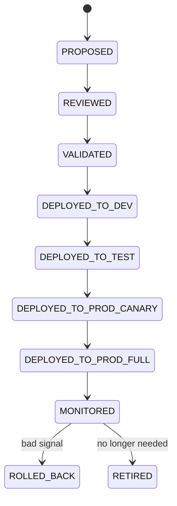
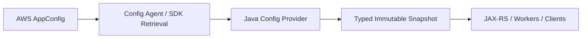

# Cheatsheet AWS and Azure for Enterprise Java/JAX-RS Systems

## Part 022 — Config Management in AWS and Azure

> Goal: treat configuration as production control data with lifecycle, ownership, validation, rollout, rollback, observability, and failure behavior.

Configuration is not just `application.properties`.

In enterprise backend systems, configuration controls:

- endpoint URLs;
- timeout values;
- retry limits;
- circuit breaker thresholds;
- feature flags;
- tenant behavior;
- external integration routing;
- object storage bucket/container names;
- Kafka/RabbitMQ topic/queue names;
- Redis TTLs;
- database pool sizing;
- API gateway routes;
- security toggles;
- operational kill switches.

A bad config change can cause a production incident without any code deployment.

---

## 1. Core mental model

Configuration is runtime decision data.

Use this model:

```text
Configuration = named value + scope + owner + type + validation + version + rollout + rollback + audit.
```

A production config value should answer:

```text
What does this value control?
Who owns it?
Which service reads it?
Which environment/tenant does it apply to?
What type and allowed range does it have?
What is the safe default?
Can it change at runtime?
How is it validated before activation?
How is it rolled back?
How is access audited?
What happens if the config service is down?
```

---

## 2. Config is not secret

Keep this distinction strict.

| Category | Example | Should be secret? |
|---|---|---|
| Config | timeout = 2s | No |
| Config | feature flag enabled | No |
| Config | S3 bucket name / Blob container name | Usually no, but can be sensitive internally |
| Config | Kafka topic name | Usually no |
| Secret | database password | Yes |
| Secret | API token | Yes |
| Secret | private key | Yes |
| Secret | signing secret | Yes |

Do not put secrets into ordinary config systems unless the system explicitly supports secret handling, encryption, access control, audit, and rotation.

This part is about config.

Secret management is Part 023.

---

## 3. Why config management matters

Configuration is a control plane for application behavior.

It can change behavior faster than code deployment.

That is powerful and dangerous.

Examples of config-caused incidents:

- timeout changed from `2s` to `200ms`;
- retry count changed from `2` to `20`;
- wrong Kafka topic name;
- wrong object storage bucket/container;
- feature flag enabled for all tenants;
- endpoint switched from private DNS to public DNS;
- Redis TTL changed from minutes to days;
- connection pool max changed too high;
- circuit breaker disabled during dependency instability;
- environment label points prod to test service;
- config key removed without safe default.

---

## 4. Configuration source types

Common sources:

| Source | Strength | Risk |
|---|---|---|
| Code default | deterministic, versioned with code | requires deployment to change |
| Environment variable | simple container-native config | hard to change at runtime, can sprawl |
| Kubernetes ConfigMap | declarative, GitOps-friendly | restart/reload semantics can be confusing |
| AWS SSM Parameter Store | hierarchical config store | latency, IAM, throttling, version/label discipline needed |
| AWS AppConfig | dynamic config and feature flags | rollout/validation model must be understood |
| Azure App Configuration | centralized app config and feature flags | label/refresh/cache design required |
| Database table | domain-owned dynamic config | must build governance/audit/validation yourself |
| GitOps values | reviewable and auditable | not ideal for very dynamic runtime flags |

No single source is universally correct.

The right choice depends on change frequency, blast radius, ownership, and operational risk.

---

## 5. Configuration lifecycle

A mature config lifecycle looks like:



For low-risk config, this can be lightweight.

For production-impacting config, this lifecycle should be explicit.

---

## 6. Config classification

Classify config by risk.

### 6.1 Static deployment config

Examples:

- service port;
- base path;
- JVM profile;
- region;
- environment name.

Usually changed only through deployment.

### 6.2 Runtime operational config

Examples:

- timeout;
- retry count;
- circuit breaker threshold;
- rate limit;
- cache TTL;
- batch size.

Can change runtime, but should be validated and monitored.

### 6.3 Feature flag

Examples:

- enable new quote validation rule;
- route subset of tenants to new flow;
- enable new export format;
- enable async document scanner.

Needs ownership, expiry, rollout, and cleanup.

### 6.4 Business policy config

Examples:

- maximum attachment size per customer tier;
- allowed document types;
- pricing rule toggles;
- tenant-specific workflow behavior.

Should usually be modeled more carefully than generic technical config.

---

## 7. Config scope

Every config value needs a scope.

Possible scopes:

- global;
- cloud provider;
- region;
- environment;
- cluster;
- namespace;
- service;
- tenant;
- customer segment;
- user group;
- operation;
- endpoint;
- integration partner.

Bad:

```text
timeout=5s
```

Better:

```text
service.quote-order.integration.billing.timeout=5s
scope=prod/ap-southeast-*/quote-order
owner=backend-platform
```

---

## 8. Environment variable strategy

Environment variables are good for:

- immutable deployment-time settings;
- bootstrapping external config location;
- region/environment identification;
- feature flag provider endpoint;
- config profile/label;
- non-secret operational toggles with low change frequency.

They are bad for:

- frequently changing runtime settings;
- large structured config;
- tenant-specific rules;
- secret rotation without restart;
- config requiring audit/versioning beyond deployment history.

### 8.1 Bootstrap pattern

Common bootstrap env vars:

```text
APP_ENV=prod
APP_REGION=ap-southeast-1
CONFIG_PROVIDER=aws-appconfig
CONFIG_APPLICATION=quote-order
CONFIG_PROFILE=prod
CONFIG_LABEL=stable
```

For Azure:

```text
APP_ENV=prod
AZURE_CLIENT_ID=<user-assigned-managed-identity-client-id-if-needed>
APP_CONFIG_ENDPOINT=https://<name>.azconfig.io
APP_CONFIG_LABEL=prod
```

Do not put credentials in plain env vars if workload identity is available.

---

## 9. Kubernetes ConfigMap strategy

Kubernetes ConfigMaps are useful for deployment-time configuration.

Examples:

- application profiles;
- non-secret endpoint names;
- log level default;
- feature provider endpoint;
- static tuning values.

But understand reload behavior.

If a ConfigMap is mounted as environment variables:

```text
Pod restart required to see updates.
```

If mounted as files:

```text
Projected file may update, but application must re-read/reload safely.
```

With GitOps, ConfigMap changes may trigger rollout depending on chart/controller design.

Do not assume all ConfigMap changes automatically change running application behavior.

---

## 10. AWS Systems Manager Parameter Store

AWS Systems Manager Parameter Store provides hierarchical key/value storage for configuration and can also store SecureString values.

For config use cases, it is commonly used for:

- service endpoint URLs;
- non-secret environment settings;
- resource identifiers;
- tuning parameters;
- feature toggles in simple systems;
- bootstrap references to other resources.

Example hierarchy:

```text
/quote-order/prod/service/base-url
/quote-order/prod/integration/billing/timeout-ms
/quote-order/prod/storage/document-bucket
/quote-order/prod/kafka/document-events-topic
```

### 10.1 Parameter Store strengths

- simple model;
- hierarchical names;
- IAM-controlled access;
- versioning;
- API/SDK access;
- useful for bootstrap config;
- integrates with AWS ecosystem.

### 10.2 Parameter Store risks

- config key sprawl;
- weak schema discipline if not enforced by application;
- runtime calls can add latency;
- throttling possible;
- eventual operational confusion between config and secrets;
- cross-account/region assumptions can break;
- application startup can fail if Parameter Store is unavailable and no fallback exists.

### 10.3 Usage guidance

Use Parameter Store for stable or moderately dynamic config.

For controlled dynamic rollout, validation, and feature flags, evaluate AWS AppConfig.

---

## 11. AWS AppConfig

AWS AppConfig is designed for application configuration and feature flags with deployment strategies, validation, and controlled rollout.

Key concepts:

- application;
- environment;
- configuration profile;
- hosted configuration or external source;
- deployment strategy;
- validators;
- feature flags;
- deployment rollback behavior through monitoring/alarm integration patterns.

### 11.1 Why AppConfig exists

It exists because direct config mutation is dangerous.

AppConfig adds:

- validation before rollout;
- staged deployment;
- controlled percentage rollout;
- versioned configuration;
- runtime retrieval model;
- feature flag support.

### 11.2 Good AppConfig use cases

- feature flag rollout;
- tuning timeout/retry values;
- enabling/disabling integrations;
- rolling out tenant-visible behavior gradually;
- emergency kill switches;
- operational flags requiring audit and rollback.

### 11.3 AppConfig failure concerns

Plan for:

- config fetch failure;
- stale cached config;
- invalid config version;
- rollout activates bad value;
- app fails open vs fails closed;
- feature flag remains forever;
- inconsistent config across pods during rollout.

---

## 12. Azure App Configuration

Azure App Configuration centralizes application settings and feature flags.

Common concepts:

- key;
- value;
- label;
- content type;
- feature flag;
- key-value revisions;
- refresh;
- managed identity/RBAC;
- endpoint;
- integration with application frameworks.

### 12.1 Label strategy

Labels are commonly used for environment or version segmentation.

Example:

```text
key: quote-order:integration:billing:timeout-ms
label: prod
value: 2000
```

Or:

```text
key: quote-order:integration:billing:timeout-ms
label: prod-blue
value: 2000
```

Be careful.

Labels can become an accidental environment separation model.

Make label conventions explicit.

### 12.2 Feature flags

Azure App Configuration supports feature management patterns.

Use feature flags for controlled behavior rollout, not permanent configuration junk.

Each flag should have:

- owner;
- purpose;
- target scope;
- expected removal date;
- default behavior;
- rollout plan;
- rollback plan;
- telemetry.

---

## 13. Config naming convention

A good config key should be readable, scoped, and stable.

Example:

```text
quote-order.integration.billing.timeout-ms
quote-order.integration.billing.retry.max-attempts
quote-order.storage.documents.max-upload-bytes
quote-order.storage.documents.presigned-url-ttl-seconds
quote-order.redis.quote-cache.ttl-seconds
quote-order.kafka.document-events.topic
```

Avoid ambiguous names:

```text
timeout
url
enabled
max
newFlow
```

Names should express the domain and dependency.

---

## 14. Config schema and type safety

Config values need type validation.

Validate:

- string enum;
- integer range;
- duration format;
- byte size format;
- URL shape;
- regex pattern;
- boolean semantics;
- list length;
- JSON schema if structured;
- cross-field constraints.

Example constraints:

```text
billing.timeout-ms must be between 100 and 10000
billing.retry.max-attempts must be between 0 and 5
presigned-url-ttl-seconds must be between 60 and 900
redis.quote-cache.ttl-seconds must be between 30 and 86400
```

Config without validation is remote code behavior mutation with fewer guardrails.

---

## 15. Safe defaults

Every config read should have an intentional fallback model.

Options:

### 15.1 Fail fast

Use when config is mandatory for safe operation.

Example:

```text
object storage bucket/container name missing
```

The service should fail startup rather than write to an unknown location.

### 15.2 Use safe default

Use when conservative behavior is acceptable.

Example:

```text
feature flag fetch failed -> feature disabled
```

### 15.3 Use last known good value

Use for dynamic runtime config.

Example:

```text
config refresh failed -> continue with cached validated value
```

### 15.4 Fail closed

Use for security-sensitive behavior.

Example:

```text
authorization policy config missing -> deny operation
```

### 15.5 Fail open

Use only when explicitly accepted.

Example:

```text
non-critical banner config missing -> omit banner
```

Never leave fail-open/fail-closed behavior implicit.

---

## 16. Runtime reload strategy

Runtime reload can reduce deployment needs, but it can also introduce inconsistent behavior.

Decide per config key:

| Config type | Reload at runtime? | Notes |
|---|---:|---|
| Endpoint URL | Usually no or carefully | connection pools may need rebuild |
| Timeout | Yes, with validation | observe latency/error changes |
| Retry count | Yes, with strict max | avoid retry storm |
| Feature flag | Yes | normal use case |
| Database pool size | Usually no | may need restart/recreate pool |
| Kafka topic | Usually no | consumer/producer lifecycle impact |
| Security policy | Carefully | prefer fail closed |
| Secret reference | Depends | coordinate with secret rotation |

### 16.1 Reload atomicity

If config has multiple related fields, reload them atomically.

Bad:

```text
read timeout from version 10
read retry count from version 11
read endpoint from version 9
```

Better:

```text
load config snapshot version 11
validate entire snapshot
activate entire snapshot
```

---

## 17. Config snapshot pattern

For complex services, load config as a typed immutable snapshot.

```java
public record BillingIntegrationConfig(
    URI endpoint,
    Duration timeout,
    int maxRetryAttempts,
    boolean enabled
) {}
```

Activation pattern:

```text
fetch raw config
parse into typed object
validate constraints
compare with current snapshot
activate atomically
emit config version metric/log
```

Do not let random code paths fetch arbitrary config keys on every request unless there is a deliberate reason.

---

## 18. Cache strategy

Remote config should usually be cached.

Cache dimensions:

- TTL;
- refresh interval;
- stale-while-error behavior;
- maximum stale age;
- startup behavior;
- per-pod consistency;
- metric for config age;
- manual refresh trigger if supported.

### 18.1 Cache failure model

Ask:

```text
If AWS AppConfig/Azure App Configuration is unavailable for 30 minutes, does the service keep running safely?
```

For most production systems, the answer should be:

```text
Use last known good config and alert when stale beyond threshold.
```

But mandatory startup config may still fail fast.

---

## 19. Feature flag discipline

Feature flags are not free.

Every flag adds branching behavior.

Each production feature flag needs:

- clear owner;
- reason for existence;
- default value;
- rollout population;
- telemetry;
- rollback path;
- expiry/removal date;
- test coverage for both branches;
- cleanup task.

### 19.1 Types of flags

| Type | Purpose | Removal expectation |
|---|---|---|
| Release flag | gradual rollout | remove after rollout |
| Experiment flag | compare behavior | remove after decision |
| Ops flag | kill switch/degrade mode | may remain but must be documented |
| Permission flag | entitlement | often becomes domain policy |
| Migration flag | transition systems | remove after migration |

Do not let release flags become permanent architecture.

---

## 20. Operational kill switches

Kill switches are high-value config.

Examples:

```text
disable document export
disable partner callback
disable non-critical enrichment
disable async reprocessing
disable optional cloud SDK call
force read-only mode for specific flow
```

A good kill switch:

- is safe by design;
- has clear blast radius;
- is tested;
- has telemetry;
- has documented owner;
- can be activated quickly;
- has rollback/deactivation path;
- does not corrupt state.

A bad kill switch hides errors while corrupting workflow state.

---

## 21. Config and Java/JAX-RS backend design

In Java services, config affects:

- HTTP client timeout;
- connection pool;
- object storage client;
- Kafka/RabbitMQ producers/consumers;
- Redis cache TTL;
- PostgreSQL pool;
- JAX-RS resource behavior;
- authentication/authorization integration;
- logging verbosity;
- tracing sampling;
- async worker concurrency.

### 21.1 Avoid per-request remote config fetch

Bad:

```java
public Response getQuote(String id) {
    var timeout = configClient.get("billing.timeout-ms");
    ...
}
```

Better:

```java
public Response getQuote(String id) {
    var snapshot = configProvider.currentSnapshot();
    var timeout = snapshot.billing().timeout();
    ...
}
```

Remote config should not become a hidden dependency for every request unless intentionally engineered.

---

## 22. Config and PostgreSQL

Config may influence PostgreSQL behavior:

- pool size;
- query timeout;
- statement timeout;
- read/write routing;
- feature-specific table usage;
- migration flag;
- batch size.

Be careful with runtime changes.

Changing pool size at runtime may not affect existing pools unless the pool is recreated.

Changing query timeout may change correctness if business operation previously relied on longer transactions.

---

## 23. Config and Kafka/RabbitMQ

Config may influence messaging:

- topic/queue names;
- consumer group;
- retry topic;
- DLQ routing;
- batch size;
- poll interval;
- prefetch count;
- concurrency;
- message TTL;
- circuit breaker around publish.

Be careful changing topic/queue names at runtime.

It may create split-brain processing:

```text
some pods publish to old topic
some pods publish to new topic
```

Prefer deployment-controlled changes for routing primitives.

---

## 24. Config and Redis

Config may influence:

- cache TTL;
- key prefix;
- connection timeout;
- max connections;
- circuit breaker;
- cache enable/disable;
- negative cache TTL.

Runtime TTL changes are usually safe if bounded.

Runtime key prefix changes can create cache misses or duplicate key spaces.

Cache key format should not be casually toggled with config.

---

## 25. Config and Camunda/workflow

Workflow-related config may include:

- worker concurrency;
- polling interval;
- task timeout;
- retry count;
- escalation threshold;
- business rule toggle;
- integration enablement.

Changing workflow behavior at runtime can affect in-flight process instances.

Ask:

```text
Does this config affect only new instances or also existing instances?
```

For long-running workflows, config versioning may need to be captured per process instance.

---

## 26. Config and NGINX/API gateway/load balancer

Some config lives outside the Java app:

- max body size;
- timeout;
- route path;
- TLS policy;
- header forwarding;
- rate limit;
- WAF behavior;
- upstream target.

Application config must align with platform config.

Example:

```text
Application upload limit: 100 MiB
Ingress body limit: 50 MiB
APIM limit: 20 MiB
```

The actual user-visible limit is not what the Java service says.

---

## 27. AWS implementation patterns

### 27.1 Parameter Store bootstrap

Use for stable config:

```text
/quote-order/prod/storage/document-bucket
/quote-order/prod/redis/quote-cache-ttl-seconds
/quote-order/prod/integration/billing/base-url
```

Java service can load on startup using AWS SDK and cache values.

### 27.2 AppConfig dynamic runtime config

Use for:

```text
feature flags
kill switches
runtime thresholds
safe rollout toggles
```

Pattern:



### 27.3 IAM control

Workload should have read access only to required config paths/profiles.

Avoid broad permissions like:

```text
ssm:GetParameter on *
appconfig:* on *
```

Prefer path/profile-scoped permissions.

---

## 28. Azure implementation patterns

### 28.1 Azure App Configuration as central config store

Use for:

- shared application config;
- feature flags;
- environment-labeled values;
- dynamic refresh;
- central governance.

Example key/label:

```text
key: quote-order:storage:documents:container
label: prod
```

### 28.2 Managed identity access

Java service in AKS should ideally access App Configuration using workload identity/managed identity.

Avoid static connection strings if managed identity is available and supported by the deployment model.

### 28.3 Refresh design

Define:

- refresh interval;
- sentinel key if using sentinel refresh pattern;
- cache expiration;
- stale behavior;
- what happens on fetch failure;
- telemetry for active config version.

---

## 29. Versioning and rollback

Config should be versioned.

Version can come from:

- config service revision;
- Git commit;
- AppConfig version;
- Azure App Configuration revision;
- explicit semantic version field;
- deployment artifact version.

### 29.1 Rollback rule

Rollback must restore a known good config snapshot, not just edit a value manually under pressure.

Bad:

```text
try changing timeout from 200ms to 500ms during incident
```

Better:

```text
roll back to config snapshot prod-2026-07-10-03
```

Manual emergency edits may be necessary, but they should be captured and reconciled afterward.

---

## 30. Config drift

Drift happens when running state differs from expected state.

Sources of drift:

- manual console edits;
- environment-specific hotfixes;
- stale Kubernetes ConfigMaps;
- failed GitOps sync;
- unsynchronized labels;
- one pod fails to refresh;
- old deployment still running;
- config value exists in multiple stores.

Detect drift with:

- config version metric;
- dashboard by pod;
- GitOps diff;
- config service revision history;
- startup log of config snapshot hash;
- periodic config audit.

---

## 31. Observability for config

Expose:

```text
active_config_version
active_config_hash
config_refresh_success_total
config_refresh_failure_total
config_refresh_duration_seconds
config_last_success_timestamp
config_age_seconds
feature_flag_evaluation_total
feature_flag_enabled_ratio
config_validation_failure_total
```

Log:

- config version activated;
- validation failure;
- refresh failure;
- fallback to cached value;
- stale threshold exceeded;
- feature flag rollout activation.

Do not log secrets.

Do not log massive config payloads.

---

## 32. Security concerns

Config can reveal architecture.

Even non-secret config may expose:

- internal endpoints;
- bucket/container names;
- topic names;
- tenant identifiers;
- feature roadmap;
- disabled security controls;
- private network names.

Protect config access with:

- least privilege;
- environment scoping;
- audit logs;
- no broad read permissions;
- no config dumps in logs;
- review of public documentation/examples;
- separate secret store for secrets.

---

## 33. Correctness concerns

Bad config can produce correct-looking but wrong behavior.

Examples:

- wrong tenant rollout rule;
- wrong tax/rating/pricing integration endpoint;
- wrong Kafka topic causing missing events;
- wrong Redis key prefix causing stale reads;
- wrong timeout causing partial workflows;
- wrong feature flag default enabling incomplete code path;
- wrong region causing cross-region dependency.

For business-critical config, add semantic validation.

Not just:

```text
is string non-empty?
```

But:

```text
is this endpoint allowed for this environment?
is this tenant configured for this feature?
is this timeout within operationally accepted bounds?
```

---

## 34. Performance concerns

Config system performance matters when:

- config is fetched on request path;
- many pods refresh simultaneously;
- retries happen during config outage;
- feature evaluation is high frequency;
- config payload is large;
- config is parsed repeatedly;
- refresh causes object allocation spikes.

Rules:

- prefer cached typed snapshots;
- avoid per-request remote calls;
- add jitter to refresh schedule;
- bound refresh timeout;
- validate off request path;
- expose refresh latency metrics.

---

## 35. Cost concerns

Config cost is usually small, but can grow through:

- excessive API calls;
- per-request config fetch;
- high-frequency refresh across many pods;
- log dumps of config payloads;
- high-cardinality feature flag telemetry;
- duplicate stores per environment;
- overuse of premium tiers/features.

Cost rule:

```text
Remote config should be refreshed intentionally, not polled recklessly.
```

---

## 36. Failure mode table

| Symptom | Likely area | Debug first |
|---|---|---|
| Service fails startup | missing mandatory config | startup logs, config provider access, key/label/path |
| Wrong endpoint called | environment/label/path error | active config version/hash, endpoint value, deployment env |
| Feature enabled unexpectedly | flag targeting/default issue | feature flag config, label, rollout rules, audit log |
| Pods behave differently | inconsistent refresh | config hash by pod, rollout timing, cache age |
| Access denied reading config | IAM/RBAC | AWS IAM, Azure RBAC, workload identity |
| Runtime latency spike | per-request config fetch | traces, config client metrics |
| Retry storm | bad retry config | active retry values, dependency errors |
| Config rollback failed | no snapshot/version | revision history, GitOps state, manual edits |
| Secret leaked in config | config/secret boundary failure | config keys, audit, logs, rotation plan |
| Production points to test dependency | label/env mistake | key scope, label strategy, endpoint allowlist |

---

## 37. Production-safe debugging flow

When config is suspected:

```text
1. Identify service, pod, environment, region, and config provider.
2. Capture active config version/hash from metrics or logs.
3. Compare affected pod vs healthy pod.
4. Check recent config change history.
5. Verify key/path/label/profile used by the service.
6. Verify identity access to config provider.
7. Validate parsed typed config, not only raw values.
8. Check whether config reload happened before incident start.
9. Check fallback behavior: default, cached, fail fast, fail closed.
10. Roll back to known good snapshot if config is confirmed bad.
11. Record drift/manual edits after incident.
```

Avoid changing multiple config values at once during incident response unless blast radius is understood.

---

## 38. PR review checklist

Ask these before approving config-related changes:

- [ ] Is this value config, secret, or domain policy?
- [ ] Is the owner clear?
- [ ] Is the scope clear?
- [ ] Is the type explicit?
- [ ] Are allowed values/ranges validated?
- [ ] Is there a safe default?
- [ ] Is fail-open/fail-closed behavior explicit?
- [ ] Does changing this require restart or runtime reload?
- [ ] Is reload atomic if multiple values are related?
- [ ] Is the config version observable?
- [ ] Is rollback possible?
- [ ] Is the config source controlled by GitOps/IaC or audited service?
- [ ] Are secrets excluded?
- [ ] Are feature flags given owner and expiry?
- [ ] Is per-request remote config fetch avoided?
- [ ] Are refresh failures handled safely?
- [ ] Is cost of polling/refresh acceptable?
- [ ] Is the value environment/tenant scoped correctly?
- [ ] Is internal CSG/team verification required?

---

## 39. Internal verification checklist

### General

- [ ] What is the approved config source for Java services?
- [ ] Which config is in env vars?
- [ ] Which config is in Kubernetes ConfigMaps?
- [ ] Which config is in AWS Parameter Store/AppConfig?
- [ ] Which config is in Azure App Configuration?
- [ ] Which values are controlled by GitOps/IaC?
- [ ] Which values can be edited manually?
- [ ] What is the approval process for prod config changes?
- [ ] Is there an audit trail?
- [ ] Is there a config rollback process?

### AWS

- [ ] Are AWS SSM Parameter Store paths standardized?
- [ ] Are AWS AppConfig applications/environments/profiles defined?
- [ ] Are deployment strategies used?
- [ ] Are validators used?
- [ ] Are feature flags used?
- [ ] Which IAM roles can read config?
- [ ] Which IAM roles can change config?
- [ ] Are prod config changes audited?
- [ ] Are config values encrypted where needed?
- [ ] Are secrets separated from config?

### Azure

- [ ] Which Azure App Configuration stores are used?
- [ ] What key naming convention is used?
- [ ] What label strategy is used?
- [ ] Are feature flags used?
- [ ] Is managed identity used for access?
- [ ] Which RBAC roles are assigned?
- [ ] Who can edit prod config?
- [ ] Is refresh configured?
- [ ] Is revision history used for rollback?
- [ ] Are secrets stored in Key Vault instead of App Configuration values?

### Kubernetes

- [ ] Which ConfigMaps affect the service?
- [ ] Are ConfigMaps mounted as env vars or files?
- [ ] Do ConfigMap changes trigger rollout?
- [ ] Are config hashes included in deployment annotations?
- [ ] Are stale pods detectable?
- [ ] Are Helm values/Kustomize overlays environment-specific?
- [ ] Is GitOps drift visible?

### Application

- [ ] Is config loaded into typed immutable objects?
- [ ] Is validation implemented?
- [ ] Is config reload atomic?
- [ ] Is last-known-good supported?
- [ ] Is active config version exposed?
- [ ] Are feature flags observable?
- [ ] Are unsafe values rejected?
- [ ] Are per-request config calls avoided?
- [ ] Are logs free from secret/config dumps?
- [ ] Are config-related incidents documented?

---

## 40. Final mental model

Configuration is a production control plane.

It can change system behavior without changing code.

That means it needs engineering discipline:

```text
ownership
scope
type safety
validation
versioning
rollout
rollback
caching
failure behavior
observability
audit
security boundary
```

For senior backend engineers, the key question is not:

```text
Where do we store this setting?
```

The better question is:

```text
What behavior does this setting control, what is its blast radius, and how do we safely change it in production?
```

If a config value can break production, it deserves production-grade lifecycle.

---

## References for further verification

Use official vendor documentation as baseline, then verify actual implementation internally:

- AWS Documentation — Systems Manager Parameter Store.
- AWS Documentation — AWS AppConfig.
- AWS Documentation — IAM permissions for SSM/AppConfig access.
- Microsoft Learn — Azure App Configuration.
- Microsoft Learn — Azure App Configuration feature management.
- Microsoft Learn — Azure App Configuration Java client library.
- Microsoft Learn — Managed identity and Azure RBAC access patterns.
- Kubernetes Documentation — ConfigMaps and environment variable/projected volume behavior.
- Internal platform/SRE/security documentation for approved config sources, rollout process, and prod change governance.
