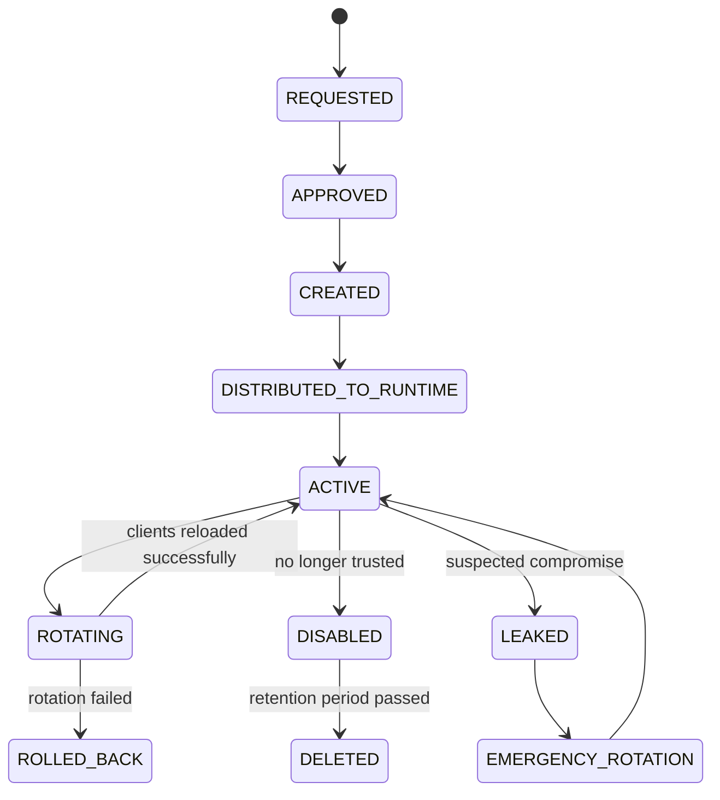

# Cheatsheet AWS and Azure for Enterprise Java/JAX-RS Systems

## Part 023 — Secret Management in AWS and Azure

> Goal: treat secrets as high-risk production control data with lifecycle, ownership, access boundary, rotation, audit, reload behavior, and failure handling.

Secrets are not just encrypted strings.

In enterprise backend systems, secrets are runtime authority.

A service that holds a secret can usually do something powerful:

- connect to PostgreSQL;
- authenticate to Kafka or RabbitMQ;
- access Redis;
- call a partner API;
- sign a JWT;
- decrypt protected data;
- fetch another secret;
- access object storage;
- authenticate to an internal gateway;
- prove service identity to another system.

A leaked secret is often equivalent to a leaked permission boundary.

A missing, stale, or rotated secret can become a production outage.

---

## 1. Core mental model

A secret is sensitive runtime material used to authenticate, authorize, sign, encrypt, or prove identity.

Use this model:

```text
Secret = sensitive value + purpose + owner + scope + version + access policy + rotation policy + audit trail + reload behavior.
```

Every production secret should answer:

```text
What does this secret allow?
Who owns it?
Which workload can read it?
Which environment/tenant does it belong to?
How is it stored?
How is it encrypted?
How is access authorized?
How is access audited?
How is it rotated?
How does the app pick up rotation?
What happens if retrieval fails?
What is the blast radius if it leaks?
```

The most dangerous secret is not necessarily the one with the longest value.

The most dangerous secret is the one with unclear ownership, broad access, no rotation, and no audit.

---

## 2. Secret vs config vs key vs certificate

Keep categories strict.

| Category | Example | Primary concern |
|---|---|---|
| Config | timeout, retry count, feature flag | correctness, rollout, rollback |
| Secret | password, API token, client secret | confidentiality, access, rotation |
| Key | KMS key, data encryption key, signing key | cryptographic control and policy |
| Certificate | TLS server/client cert | identity, trust chain, expiry |

A common mistake is mixing them:

- storing secrets in ordinary config;
- treating a KMS key like an application password;
- treating a TLS certificate like a static file forever;
- storing private keys in GitOps values;
- using Kubernetes Secret as if it were a complete enterprise secret manager;
- logging secret-derived URLs, headers, or connection strings.

This part focuses on secrets.

Key management and encryption are Part 024.

---

## 3. Why secret management exists

Secret management exists because static credentials do not scale operationally or securely.

Without disciplined secret management, systems drift into:

- hardcoded credentials;
- secrets in Git history;
- secrets in CI/CD variables with unclear ownership;
- secrets copied across namespaces;
- secrets shared by multiple services;
- passwords that never rotate;
- manual updates during incident pressure;
- logs containing connection strings;
- broad IAM/RBAC access to all secrets;
- production secrets usable from developer machines;
- broken apps after rotation because reload was never designed.

A mature system makes secrets:

```text
centralized
scoped
encrypted
audited
rotatable
least-privileged
workload-identity-bound
observable without leaking value
recoverable during failure
```

---

## 4. Secret lifecycle

A production secret has a lifecycle.



The hard parts are not creation and storage.

The hard parts are:

- knowing who should read the secret;
- rotating without downtime;
- proving who accessed it;
- detecting stale consumers;
- removing old versions safely;
- preventing accidental disclosure;
- recovering when the secret system is unreachable.

---

## 5. Secret classification

Classify secrets by blast radius.

### 5.1 Low blast radius secret

Example:

- test API token;
- dev-only integration credential;
- short-lived sandbox credential.

Still protect it, but lifecycle may be lighter.

### 5.2 Service credential

Example:

- database password;
- RabbitMQ username/password;
- Kafka SASL credential;
- Redis AUTH token;
- third-party API key.

This can break production if missing or rotated incorrectly.

### 5.3 Privileged operational secret

Example:

- break-glass credential;
- database admin password;
- cloud automation credential;
- certificate private key;
- signing key.

This should have strict access, logging, approval, and emergency handling.

### 5.4 Tenant/customer-specific secret

Example:

- customer integration token;
- tenant-specific encryption material;
- partner credential per tenant.

This has privacy and isolation implications.

A single global secret for all tenants is simpler, but increases blast radius.

---

## 6. AWS secret services

AWS commonly gives you two relevant options:

| Service | Best for | Notes |
|---|---|---|
| AWS Secrets Manager | secrets with lifecycle, rotation, versioning, audit | best default for passwords/API keys that rotate |
| AWS Systems Manager Parameter Store `SecureString` | encrypted parameters and simpler secrets | useful for lower-complexity encrypted values; be careful with rotation expectations |

Do not choose only by price.

Choose by lifecycle requirements.

---

## 7. AWS Secrets Manager mental model

AWS Secrets Manager stores secret values, versions them, encrypts them with AWS KMS, controls access with IAM/resource policy, and logs access through AWS audit mechanisms.

Important concepts:

- secret name;
- secret ARN;
- secret value;
- secret version;
- staging label such as `AWSCURRENT`, `AWSPREVIOUS`, `AWSPENDING`;
- KMS key;
- IAM permission;
- resource policy;
- rotation function or rotation workflow;
- CloudTrail audit;
- client-side caching.

For Java/JAX-RS services, the normal question is not:

```text
Can I call GetSecretValue?
```

The better question is:

```text
Should this service fetch the secret at startup, cache it, mount it through Kubernetes, or avoid using a secret by using workload identity instead?
```

---

## 8. AWS Secrets Manager version labels

Version labels matter during rotation.

Typical labels:

| Label | Meaning |
|---|---|
| `AWSCURRENT` | version clients should use |
| `AWSPREVIOUS` | previous valid version |
| `AWSPENDING` | candidate version during rotation |

Why this matters:

- rotation can create a new value before all clients use it;
- rollback may require using the previous version;
- clients that cache forever may remain on old values;
- deleting old versions too early can break long-running workloads;
- multi-instance Java services can be at different refresh states.

A backend service should never assume a secret is immutable.

---

## 9. AWS Systems Manager SecureString

Parameter Store supports `SecureString`, which encrypts parameter values using AWS KMS.

Good use cases:

- simple encrypted parameter;
- hierarchical naming like `/prod/order-service/db/password`;
- lower-frequency secret-like values;
- services already using SSM Parameter Store for config;
- cases where advanced rotation lifecycle is not required.

Watch out for:

- parameter size limits;
- throughput/API throttling;
- IAM path-based permissions;
- confusing config and secrets in the same hierarchy;
- lack of the same rotation workflow semantics as Secrets Manager;
- accidental broad access to `/prod/*` paths.

A simple rule:

```text
If it must rotate cleanly and has credential lifecycle, prefer Secrets Manager.
If it is encrypted low-complexity parameter data, SecureString may be acceptable.
```

Verify internal platform standard before choosing.

---

## 10. Azure secret services

Azure commonly uses:

| Service | Best for | Notes |
|---|---|---|
| Azure Key Vault Secrets | application secrets, passwords, tokens | central secret store with RBAC/access control and audit |
| Azure Key Vault Certificates | TLS certificates and certificate lifecycle | separate certificate-specific lifecycle |
| Azure Key Vault Keys | cryptographic keys | Part 024 |
| Azure App Configuration Key Vault references | config that references secrets | useful integration, but Key Vault remains source of secret |

Do not put secret values directly into Azure App Configuration unless the design explicitly treats it as a secret-capable path.

For most enterprise systems:

```text
Azure App Configuration = non-secret runtime config.
Azure Key Vault = secrets, keys, certificates.
```

---

## 11. Azure Key Vault Secrets mental model

Azure Key Vault stores secrets as named values with versions, access control, audit integration, optional private endpoint access, and integration with managed identity.

Important concepts:

- vault;
- secret name;
- secret version;
- secret identifier URI;
- enabled/disabled state;
- expiration;
- not-before time;
- RBAC role assignment or legacy access policy;
- managed identity/service principal;
- private endpoint;
- diagnostic logs;
- soft delete and purge protection;
- Java SDK client behavior.

For AKS workloads, the normal production model should be:

```text
Pod identity -> Azure Workload Identity / managed identity -> Key Vault RBAC -> secret retrieval
```

Avoid long-lived client secrets for accessing Key Vault from workloads.

---

## 12. Key Vault access model: RBAC vs access policy

Azure Key Vault supports modern Azure RBAC-based access and legacy vault access policies.

For enterprise environments, verify which model is standard internally.

Important distinction:

| Model | Boundary | Review concern |
|---|---|---|
| Azure RBAC | Azure role assignment at scope | consistent with Azure governance but can be broad if scope is wrong |
| Access policy | Key Vault-specific policy | easier to reason locally but can diverge from central RBAC governance |

PR review question:

```text
Is this workload granted only the minimum required Key Vault operation on the minimum required vault/secret scope?
```

A service that only reads one secret should not be able to list, write, delete, recover, purge, or manage every secret in the vault.

---

## 13. Kubernetes Secret is not enough

Kubernetes Secret is a Kubernetes object.

It is not automatically an enterprise secret management strategy.

Kubernetes Secret can be useful as a runtime projection mechanism, but by itself it raises questions:

- Who creates it?
- Is it stored in Git?
- Is it encrypted at rest in etcd?
- Who can read it through Kubernetes RBAC?
- Is it namespace-scoped correctly?
- How is it rotated?
- How do pods reload it?
- Is it synced from a cloud secret manager?
- Is it copied across namespaces?
- Does it appear in CI/CD logs?

A Kubernetes Secret should usually be treated as a delivery mechanism, not the source of truth.

---

## 14. Common Kubernetes delivery patterns

### 14.1 Environment variable injection

Example:

```text
Cloud secret manager -> Kubernetes Secret -> env var -> Java process
```

Strength:

- simple;
- application code unchanged;
- common in containerized systems.

Weakness:

- env vars are fixed for the process lifetime;
- rotation usually requires pod restart;
- env vars can appear in process inspection/debug output;
- hard to reload safely;
- accidental log dumps can expose values.

Use for low-change secrets, but be explicit about rollout-on-rotation.

### 14.2 Mounted file

Example:

```text
Cloud secret manager -> CSI driver -> mounted file -> Java reads file
```

Strength:

- supports file-based certs/keys;
- can support rotation depending on driver/config;
- avoids env var sprawl.

Weakness:

- app must handle file read and reload semantics;
- update propagation timing must be understood;
- file permission and mount path discipline matter.

### 14.3 Direct SDK fetch

Example:

```text
Java service -> cloud SDK -> Secrets Manager/Key Vault
```

Strength:

- explicit caching and reload logic;
- good auditability per application identity;
- avoids syncing secret into Kubernetes Secret.

Weakness:

- app depends on secret service availability;
- SDK timeout/retry/circuit breaker required;
- startup can fail if cloud secret service is unreachable;
- per-request secret fetch is a serious anti-pattern.

### 14.4 External Secrets operator

Example:

```text
Cloud secret manager -> External Secrets Operator -> Kubernetes Secret -> pod
```

Strength:

- GitOps-friendly desired state;
- decouples application code from cloud SDK;
- common multi-cloud pattern.

Weakness:

- another controller to operate;
- sync interval matters;
- Kubernetes Secret still exists;
- RBAC and controller permissions become critical.

### 14.5 Secrets Store CSI Driver

Example:

```text
Cloud secret manager -> Secrets Store CSI Driver provider -> volume mount -> pod
```

Strength:

- avoids static secret material in manifests;
- can integrate with AWS/Azure identity;
- useful for file-style secrets and certs.

Weakness:

- rotation behavior must be tested;
- application reload still matters;
- mounted secret is still accessible inside the pod;
- provider identity permissions must be least-privileged.

---

## 15. EKS secret retrieval patterns

Common EKS patterns:

```text
EKS Pod -> IRSA/EKS Pod Identity -> IAM role -> Secrets Manager / SSM Parameter Store
```

or:

```text
EKS Pod -> AWS Secrets and Configuration Provider / CSI -> mounted secret
```

Important review points:

- ServiceAccount annotation or Pod Identity association;
- IAM role trust policy;
- IAM permission to exact secret ARN/path;
- KMS decrypt permission if customer-managed KMS key is used;
- private endpoint access if public egress is restricted;
- DNS resolution for private endpoint;
- SDK timeout and retry behavior;
- caching strategy.

Failure path example:

```text
Java app startup
  -> AWS SDK credential chain
  -> projected service account token
  -> STS AssumeRoleWithWebIdentity
  -> Secrets Manager GetSecretValue
  -> KMS decrypt
  -> secret cache initialization
```

Any link can fail.

Do not debug this as “the password is wrong” until identity, network, KMS, and audit logs are checked.

---

## 16. AKS secret retrieval patterns

Common AKS patterns:

```text
AKS Pod -> Azure Workload Identity -> federated credential -> managed identity/app -> Key Vault RBAC -> Key Vault Secret
```

or:

```text
AKS Pod -> Azure Key Vault provider for Secrets Store CSI Driver -> mounted secret
```

Important review points:

- ServiceAccount annotation;
- federated identity credential;
- managed identity client ID;
- Key Vault RBAC role assignment;
- vault firewall/private endpoint;
- Private DNS Zone link;
- secret version or latest version usage;
- mounted file sync and rotation;
- Azure SDK credential chain behavior.

Failure path example:

```text
Java app startup
  -> DefaultAzureCredential
  -> workload identity token file
  -> Entra token exchange
  -> Key Vault SecretClient
  -> Key Vault RBAC authorization
  -> secret version retrieval
  -> application cache initialization
```

Any link can fail.

---

## 17. Secret access should be workload-bound

Avoid this pattern:

```text
shared CI/CD secret -> injected into all pods
```

Prefer:

```text
specific workload identity -> least-privilege secret access -> audited runtime retrieval
```

A Java service should receive only what it needs.

Examples:

| Service | Allowed secret access |
|---|---|
| quote-api | only quote-api DB credential and quote partner token |
| order-worker | only order DB credential and broker credential |
| document-exporter | only object storage signing credential if required |
| camunda-worker | only workflow engine credential and integration secrets |

Do not grant one namespace identity access to all application secrets unless there is a strong platform reason.

---

## 18. Secret naming strategy

Good names encode purpose and scope without leaking sensitive value.

Example AWS:

```text
/prod/quote-order/quote-api/postgres/app-user
/prod/quote-order/order-worker/rabbitmq/app-user
/prod/quote-order/integration/customer-x/token
```

Example Azure Key Vault:

```text
prod-quote-api-postgres-app-user
prod-order-worker-rabbitmq-app-user
prod-integration-customer-x-token
```

Avoid names like:

```text
password
prod-password
secret1
admin-password
superuser-token
new-secret
old-secret
```

Naming should support:

- environment separation;
- service ownership;
- tenant/customer boundary;
- rotation;
- audit search;
- emergency response.

---

## 19. Secret versioning strategy

Versioning is not optional in production.

Secret versioning supports:

- safe rotation;
- rollback;
- staged rollout;
- forensic review;
- drift detection;
- compatibility windows.

But versioning can create false safety.

Bad pattern:

```text
App always requests latest version, caches forever, never reports active version.
```

Better pattern:

```text
App requests current version, caches with TTL, exposes non-sensitive version identifier, supports restart/reload, and emits retrieval failures.
```

Do not log secret values.

Logging secret version ID may be acceptable if your internal security policy allows it.

---

## 20. Rotation strategy

Secret rotation has two halves:

```text
Secret store rotation + application adoption
```

Rotating the stored value is not enough.

The application must be able to use the new value.

### 20.1 Single-value rotation

Example:

```text
old password replaced by new password
```

Risk:

- old clients break immediately;
- connection pools keep stale connections;
- rolling deployment timing matters.

### 20.2 Dual credential rotation

Example:

```text
credential A active -> credential B created -> apps switch -> A disabled
```

Safer for zero-downtime rotation.

Use when dependency supports multiple credentials.

### 20.3 Certificate rotation

Certificate rotation must consider:

- certificate chain;
- private key;
- trust store;
- server reload;
- client trust update;
- expiry monitoring;
- mTLS identity mapping.

Certificate lifecycle is often harder than password lifecycle.

---

## 21. Java/JAX-RS secret consumption patterns

### 21.1 Startup-only retrieval

The app fetches secrets at startup and keeps them for process lifetime.

Strength:

- simple;
- fails fast;
- predictable.

Risk:

- rotation requires restart;
- secret service outage blocks startup;
- long-running pods may use stale values.

Use when rotation is deployment-triggered and controlled.

### 21.2 Cache with TTL

The app fetches secrets and refreshes periodically.

Strength:

- supports rotation;
- avoids per-request calls;
- limits secret service dependency.

Risk:

- refresh failure logic must be explicit;
- stale value windows exist;
- active version must be observable.

Recommended for many production services if implemented carefully.

### 21.3 On-demand retrieval per request

Avoid this in normal request path.

Problems:

- adds latency;
- increases cost;
- increases throttling risk;
- turns secret manager into request-path dependency;
- can cause cascading failure during secret service degradation.

Use only for unusual cases with strong justification.

### 21.4 Mounted file watch

The app reads secret from file and watches for changes.

Strength:

- useful for cert/key files;
- can support rotation with CSI.

Risk:

- file watcher semantics differ by runtime/driver;
- partial update handling matters;
- Java libraries may not reload connection pools automatically.

Test actual behavior.

---

## 22. Connection pools and secret rotation

Database credential rotation is not just changing a string.

Java services often use connection pools such as HikariCP.

Rotation concerns:

- existing connections may remain valid;
- new connections may fail with old password;
- pool may keep retrying with stale password;
- forced pool restart may be needed;
- rolling pod restart may be safer than in-process mutation;
- maxLifetime can determine how long stale credentials persist.

Safe rotation flow:

```text
1. Create new credential while old credential remains valid.
2. Update secret store current value.
3. Trigger app refresh or rolling restart.
4. Verify new connections use new credential.
5. Wait for old connections to drain.
6. Disable old credential.
7. Monitor auth failures.
```

Do not rotate database passwords without understanding pool behavior.

---

## 23. Secret management for PostgreSQL

PostgreSQL secret types:

- application DB username/password;
- migration user credential;
- read-only/reporting credential;
- admin/break-glass credential;
- TLS client certificate if used.

Review questions:

- Does each service have its own DB user?
- Are privileges least-privileged?
- Are migration credentials separated from runtime credentials?
- Is password rotation tested?
- Are connection pools compatible with rotation?
- Are old credentials disabled after rotation?
- Are DB auth failures monitored?

Never share one PostgreSQL superuser credential across services.

---

## 24. Secret management for Kafka and RabbitMQ

Messaging secrets may include:

- SASL username/password;
- client certificate;
- broker truststore password;
- RabbitMQ username/password;
- management API credential.

Review questions:

- Is producer identity separated from consumer identity?
- Are ACLs topic/queue scoped?
- Are DLQ/admin permissions separated from runtime publish/consume?
- Does rotation require reconnect?
- Are long-lived consumers restarted during rotation?
- Are authentication failures visible in broker metrics/logs?

For event-driven systems, stale broker credentials can cause silent consumer lag.

Do not only monitor HTTP errors.

---

## 25. Secret management for Redis

Redis secrets may include:

- AUTH token;
- ACL user/password;
- TLS certificate;
- admin credential.

Review questions:

- Is Redis used for cache, lock, session, rate limit, or idempotency?
- What happens if credential rotation causes reconnect storms?
- Are clients configured with sane reconnect backoff?
- Is AUTH/ACL least-privileged where supported?
- Are Redis auth failures visible?

Redis credential failures often look like latency spikes, cache miss storms, or degraded application behavior.

---

## 26. Secret management for Camunda/workflow systems

Workflow platforms may use secrets for:

- worker authentication;
- external task API;
- database credential;
- integration connectors;
- notification endpoints;
- customer/tenant credentials.

Workflow systems amplify secret mistakes because jobs retry automatically.

If a rotated secret breaks a worker, the system may produce:

- retry storms;
- incident backlog;
- stuck process instances;
- duplicated external calls;
- partial business state transitions.

Secret rotation for workflow workers should include job retry/backoff awareness.

---

## 27. Secret management for NGINX/API gateway

Gateway-related secrets may include:

- TLS private key;
- upstream mTLS client certificate;
- JWT validation key material;
- basic auth credential;
- API key for upstream service;
- WAF/gateway integration secret.

Review questions:

- Where is certificate private key stored?
- How is certificate renewed?
- Does NGINX reload without dropping connections?
- Does gateway cache JWKS/key material?
- Are private keys excluded from logs and config dumps?
- Are gateway secrets managed separately from app secrets?

Edge secrets have high blast radius.

Treat them as production-critical assets.

---

## 28. Secret caching

Caching is required for reliability and cost, but it creates staleness.

A good cache policy defines:

- TTL;
- refresh interval;
- refresh timeout;
- fail-open vs fail-closed behavior;
- maximum staleness;
- version visibility;
- emergency invalidation;
- metrics;
- retry/backoff.

Bad pattern:

```text
Fetch secret on every request.
```

Also bad:

```text
Fetch once at startup and never rotate, but claim rotation is supported.
```

Better:

```text
Fetch at startup, cache with bounded TTL, refresh in background, keep last-known-good if refresh fails, emit alerts when stale threshold is exceeded.
```

For authentication secrets, fail-open/fail-closed must be decided carefully.

---

## 29. Startup failure behavior

Decide what should happen when secret retrieval fails at startup.

Possible behaviors:

| Behavior | When acceptable | Risk |
|---|---|---|
| fail fast | required secret missing | can block rollout if secret system degraded |
| start degraded | optional integration secret missing | needs clear readiness behavior |
| use last-known-good | local durable cache exists | stale/compromise risk |
| retry until success | init-style dependency | can hide outage and delay rollout |

For most required secrets:

```text
fail readiness, do not serve traffic, emit clear logs/metrics.
```

Do not serve partially initialized services unless the degradation is intentional and observable.

---

## 30. Readiness and liveness

Secret retrieval should affect readiness, not usually liveness.

Bad pattern:

```text
Secret refresh fails -> liveness fails -> pod restarts -> more secret requests -> storm.
```

Better pattern:

```text
Secret refresh fails -> readiness reflects dependency state only if service cannot safely serve -> alert -> keep process alive for debugging and recovery.
```

Use liveness for deadlock/crash conditions, not transient cloud dependency failures.

---

## 31. Secret leakage paths

Secrets leak through boring paths.

Common leakage paths:

- Git history;
- Helm values;
- Terraform state;
- CI/CD logs;
- application startup logs;
- exception messages;
- HTTP headers dumped in logs;
- connection strings in metrics labels;
- support bundle exports;
- Kubernetes Secret read permission;
- `kubectl describe pod` env output;
- process environment inspection;
- memory dumps;
- debug endpoints;
- browser-visible presigned/SAS URLs with too much scope.

Assume anything printed during debugging may be retained.

Production-safe debugging must never require revealing the secret value.

---

## 32. Secret observability without leaking values

Observe secret usage safely.

Useful signals:

- secret retrieval success/failure count;
- retrieval latency;
- cache hit/miss;
- active secret version ID or hash prefix if policy allows;
- age since last refresh;
- stale cache age;
- authorization failures;
- throttling;
- rotation event timestamp;
- pod restart after rotation;
- dependency auth failures.

Never emit:

- secret value;
- full connection string with password;
- bearer token;
- private key;
- full signed URL if it grants access;
- raw Authorization header.

Log redaction should be tested, not assumed.

---

## 33. Network and private endpoint concerns

Secret retrieval is a network call unless secrets are already mounted.

Network path matters:

```text
pod -> DNS -> private endpoint/VPC endpoint -> secret service -> KMS/Key Vault backend -> response
```

Failure modes:

- DNS resolves public endpoint when private expected;
- private DNS zone not linked;
- VPC endpoint policy denies access;
- security group/NSG blocks traffic;
- firewall blocks service tag/domain;
- proxy intercepts TLS;
- NAT egress cost spike due to public path;
- secret manager endpoint reachable but KMS/Key Vault key operation fails.

For restricted environments, verify the secret path is private.

---

## 34. IAM/RBAC concerns

Access to secrets should be least-privileged.

AWS concerns:

- `secretsmanager:GetSecretValue` scoped to exact ARN;
- `ssm:GetParameter` scoped to exact path;
- `kms:Decrypt` scoped to required key and encryption context if possible;
- trust policy bound to specific ServiceAccount/OIDC subject;
- no wildcard `secretsmanager:*` in workload role;
- no broad `/prod/*` access unless justified.

Azure concerns:

- Key Vault Secrets User vs broader roles;
- scope assignment at vault/resource group/subscription;
- managed identity/federated identity correctness;
- no broad contributor role for secret reading;
- separate human admin from workload read access;
- PIM/approval for privileged operations.

The runtime identity should not be able to manage the secret it reads unless there is a strong reason.

---

## 35. Cost and performance concerns

Secret calls are not free operationally.

Costs and performance risks:

- per-request secret retrieval;
- frequent refresh across many pods;
- thundering herd after rollout;
- throttling during autoscaling;
- high latency on cold start;
- extra NAT/data processing cost if not private;
- controller sync interval too aggressive;
- large number of secret versions retained.

Design for:

```text
startup warmup + bounded cache + jittered refresh + backoff + observable stale state
```

---

## 36. Failure modes

| Symptom | Likely cause | First checks |
|---|---|---|
| app fails at startup | missing secret, IAM/RBAC deny, network/DNS issue | pod logs, audit logs, identity config |
| AccessDenied / Forbidden | wrong role/scope/policy | IAM policy, Key Vault RBAC, ServiceAccount |
| credential not found | wrong name/path/version | secret name, env label, vault, region |
| KMS decrypt denied | missing KMS permission | key policy, IAM, encryption context |
| Key Vault firewall denied | network path blocked | private endpoint, DNS zone, firewall |
| secret stale after rotation | cache/reload missing | cache TTL, pod restart, mounted file update |
| DB auth failures after rotation | pool still uses old password | connection pool, rollout state |
| broker consumers stop | credential rotation not adopted | consumer logs, broker auth logs, lag |
| high latency | per-request secret calls | dependency metrics, cache hit ratio |
| throttling | too many secret API calls | retry policy, cache, autoscaling event |
| secret appears in logs | poor redaction | log pipeline, exception formatting |

---

## 37. Production debugging playbook

When a pod cannot retrieve a secret:

```text
1. Identify exact secret name/path/version expected by the app.
2. Identify runtime identity of the pod.
3. Verify cloud credential chain selected the expected identity.
4. Check IAM/RBAC permission for that exact secret.
5. Check KMS/Key Vault key permission if applicable.
6. Check DNS resolution from inside the pod/namespace.
7. Check private endpoint/VPC endpoint route and firewall.
8. Check audit logs for deny events.
9. Check SDK timeout/retry logs.
10. Check app cache/reload behavior.
```

Do not rotate, recreate, or broaden permissions before locating the failing boundary.

Production-safe debug data:

- secret name/path;
- secret version ID;
- identity principal ID/role ARN;
- request ID/correlation ID;
- error code;
- timestamp;
- region/vault/account/subscription;
- network endpoint resolved IP.

Unsafe debug data:

- secret value;
- password;
- token;
- private key;
- full signed URL;
- Authorization header.

---

## 38. Java implementation guardrails

For Java/JAX-RS services:

- never fetch secrets in every request handler;
- never log secret-bearing exceptions raw;
- wrap secret retrieval with timeout;
- use bounded retry with jitter;
- expose non-sensitive health/metrics;
- avoid global mutable secret state without atomic update;
- consider restart-on-rotation for database credentials;
- use workload identity instead of static cloud access keys;
- avoid placing cloud credentials in application config;
- document whether rotation requires restart;
- test startup behavior when secret manager is unavailable;
- test runtime refresh failure.

Example internal abstraction:

```java
public interface SecretProvider {
    SecretValue get(String logicalName);
}

public record SecretValue(
        String value,
        String version,
        Instant loadedAt,
        Instant expiresAt
) {}
```

The application should depend on logical secret names, not cloud-specific secret paths everywhere.

Cloud-specific mapping belongs in infrastructure/configuration layer.

---

## 39. PR review checklist

Ask these before approving a secret-related change:

- What secret is introduced or modified?
- What action does this secret authorize?
- Is this actually a secret, or just config?
- Which workload identity can read it?
- Is access least-privileged?
- Is network access private if required?
- Is KMS/Key Vault key permission correct?
- Is the secret stored in Git, CI logs, Terraform state, or Helm values?
- How does rotation work?
- Does rotation require pod restart?
- Are old versions retained long enough and removed eventually?
- Is retrieval cached?
- What happens if secret retrieval fails?
- Are failures observable?
- Are values redacted from logs?
- Is audit evidence available?
- Is rollback possible?

---

## 40. Internal verification checklist

### General

- [ ] What is the approved secret manager for AWS workloads?
- [ ] What is the approved secret manager for Azure workloads?
- [ ] Which secrets are still in Kubernetes Secrets directly?
- [ ] Which secrets are in CI/CD variables?
- [ ] Which secrets are in Terraform state or Helm values?
- [ ] Which secrets are manually created?
- [ ] Which secrets are managed by IaC?
- [ ] Who owns each production secret?
- [ ] Who approves production secret changes?
- [ ] Is there a secret inventory?

### AWS

- [ ] Which secrets are in AWS Secrets Manager?
- [ ] Which secret-like values are in SSM SecureString?
- [ ] Are IAM policies scoped to exact ARNs/paths?
- [ ] Is KMS decrypt permission scoped correctly?
- [ ] Is IRSA or EKS Pod Identity used?
- [ ] Are VPC endpoints/private connectivity used?
- [ ] Are secret access events visible in CloudTrail?
- [ ] Is rotation enabled where required?
- [ ] Are old versions managed?
- [ ] Is client-side caching used?

### Azure

- [ ] Which secrets are in Azure Key Vault?
- [ ] Is Key Vault using Azure RBAC or access policies?
- [ ] Are managed identity/workload identity mappings correct?
- [ ] Are role assignments scoped narrowly?
- [ ] Is Key Vault private endpoint used?
- [ ] Is Private DNS Zone linked correctly?
- [ ] Are diagnostic logs enabled?
- [ ] Is soft delete/purge protection configured?
- [ ] Is rotation policy defined where required?
- [ ] Are secret versions monitored?

### Kubernetes

- [ ] Are Kubernetes Secrets synced from cloud secret manager?
- [ ] Is Secrets Store CSI Driver used?
- [ ] Is External Secrets Operator used?
- [ ] Are ServiceAccounts mapped to cloud identities?
- [ ] Can pods read only required secrets?
- [ ] Are secrets mounted as env vars or files?
- [ ] Does rotation trigger restart or reload?
- [ ] Are RBAC permissions scoped by namespace?
- [ ] Is etcd encryption enabled?
- [ ] Are debug pods restricted from reading secrets?

### Application

- [ ] Are secrets fetched at startup, by cache, file mount, or SDK?
- [ ] Is per-request secret retrieval avoided?
- [ ] Is timeout configured?
- [ ] Is retry bounded with jitter?
- [ ] Is secret cache TTL defined?
- [ ] Is last-known-good behavior defined?
- [ ] Is active version observable safely?
- [ ] Are secret values redacted from logs?
- [ ] Is rotation tested with PostgreSQL/broker/Redis?
- [ ] Is failure behavior documented?

---

## 41. Final mental model

Secret management is not storage.

It is runtime authority management.

The senior-engineer question is not:

```text
Where do we put the password?
```

The better question is:

```text
Which runtime identity can access which authority-bearing value, through what network path, with what rotation behavior, audit trail, and failure mode?
```

If you cannot answer that, the secret design is not production-ready.

---

## References for further verification

Use official vendor documentation as baseline, then verify actual implementation internally:

- AWS Documentation — AWS Secrets Manager.
- AWS Documentation — Use AWS Secrets Manager secrets with Amazon EKS Pods.
- AWS Documentation — AWS Secrets and Configuration Provider for Kubernetes Secrets Store CSI Driver.
- AWS Documentation — Retrieving AWS Secrets Manager secrets with AWS SDK for Java.
- AWS Documentation — Systems Manager Parameter Store and SecureString.
- Microsoft Learn — Azure Key Vault overview.
- Microsoft Learn — Azure Key Vault secrets.
- Microsoft Learn — Azure Key Vault Provider for Secrets Store CSI Driver for AKS.
- Microsoft Learn — Azure Key Vault provider configuration options and autorotation.
- Kubernetes Documentation — Secrets.
- Internal platform/SRE/security documentation for approved secret stores, rotation process, workload identity, private endpoint, and audit requirements.
