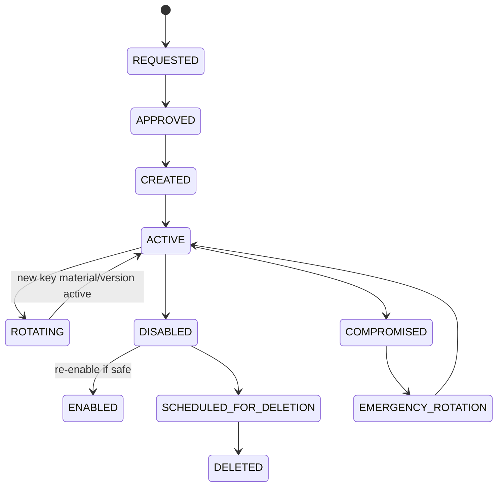
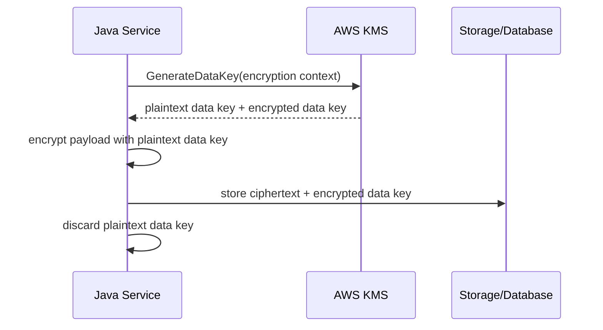

# Cheatsheet AWS and Azure for Enterprise Java/JAX-RS Systems

## Part 024 — Key Management and Encryption

> Goal: understand encryption and key management as production control systems, not just security checkboxes.

Encryption is often described as if it were a binary setting:

```text
encryption: enabled
```

That is not enough.

For production systems, the real questions are:

```text
What is encrypted?
Where is it encrypted?
Who controls the key?
Which service can use the key?
Can the key rotate?
What happens if key access fails?
Can we prove encryption and access history?
What is the blast radius of key compromise or deletion?
```

Key management is where security, availability, compliance, and operations meet.

A broken key policy can look exactly like a database outage, object storage outage, secret outage, or application startup failure.

---

## 1. Core mental model

Encryption protects data by transforming plaintext into ciphertext.

Key management controls who can perform that transformation or reverse it.

Use this model:

```text
Encryption = algorithm + data + key + context + policy + audit + lifecycle.
```

A production encryption design should answer:

```text
What data is protected?
Is encryption in transit, at rest, or application-level?
Which key protects it?
Who can use the key?
Who can administer the key?
Is the key provider-managed or customer-managed?
How does rotation work?
How is access audited?
What happens if key usage is denied?
What is the recovery plan if key material is unavailable?
```

Do not treat keys like passwords.

A password authenticates a principal.

A key controls cryptographic operations.

---

## 2. Encryption categories

| Category | Meaning | Example |
|---|---|---|
| Encryption in transit | protects data over network | HTTPS, TLS, mTLS |
| Encryption at rest | protects persisted data | S3/Blob, RDS/PostgreSQL, disks, backups |
| Application-level encryption | app encrypts before storage | field-level encryption, payload encryption |
| Envelope encryption | data key encrypts data, key-encryption-key protects data key | common KMS pattern |
| Signing | proves integrity/authenticity | JWT signing, artifact signing |
| Key wrapping | encrypts one key with another key | CMK wrapping data encryption key |

Each has different failure modes.

A system can have TLS enabled and still leak data at rest.

A database can be encrypted at rest and still leak through logs.

A key can be rotated and still leave old ciphertext decryptable through previous key material, depending on service behavior.

---

## 3. Encryption is not access control

Encryption and access control are related but not the same.

Access control answers:

```text
Who is allowed to read/write/use this resource?
```

Encryption answers:

```text
Can protected data be interpreted without the required key operation?
```

Bad reasoning:

```text
The bucket is encrypted, so access policy is less important.
```

Correct reasoning:

```text
Bucket policy, IAM/RBAC, network boundary, KMS/Key Vault permissions, audit logs, and encryption must all align.
```

Encryption does not compensate for broad public access.

KMS access does not compensate for bad application authorization.

---

## 4. Key lifecycle

Keys have a lifecycle.



Dangerous lifecycle mistakes:

- deleting a key without knowing what it encrypts;
- disabling a key used by active services;
- rotating without understanding client/service behavior;
- granting key administration to runtime workloads;
- using one key for unrelated blast-radius domains;
- losing audit trail for key usage;
- assuming all encrypted data is automatically re-encrypted on rotation.

---

## 5. Service-managed keys vs customer-managed keys

Cloud services often support two broad models.

| Model | Who manages key lifecycle? | Use when |
|---|---|---|
| Service-managed/platform-managed key | cloud service/provider | standard encryption at rest is enough |
| Customer-managed key | customer controls key in KMS/Key Vault/Managed HSM | compliance, audit, separation of duties, revocation control |

Customer-managed keys give control, but also add failure modes.

With CMK, a bad key policy can break:

- object storage read/write;
- database storage encryption;
- backup restore;
- secret retrieval;
- disk attach;
- broker startup;
- registry pull if artifacts are encrypted;
- cross-region replication.

Do not choose CMK casually.

Choose CMK when the organization is ready to operate the key lifecycle.

---

## 6. AWS KMS mental model

AWS Key Management Service is a managed service for creating and controlling cryptographic keys used across AWS services and applications.

Important concepts:

- KMS key;
- key ARN;
- symmetric key;
- asymmetric key;
- AWS managed key;
- customer managed key;
- key policy;
- IAM policy;
- grants;
- aliases;
- automatic rotation;
- on-demand/manual rotation;
- envelope encryption;
- encryption context;
- CloudTrail audit;
- multi-Region key awareness.

In AWS, access to encrypted data may require both:

```text
resource permission + kms permission
```

Example:

```text
S3 GetObject allowed
but
kms:Decrypt denied
=
object read fails
```

This is a common production debugging trap.

---

## 7. AWS KMS key policy

KMS key policy is not optional background configuration.

It is part of the authorization path.

A principal may need permission through:

- key policy;
- IAM identity policy;
- grants;
- service integration permissions;
- encryption context conditions.

Senior review questions:

- Who can administer the key?
- Who can use the key for encrypt/decrypt?
- Can the workload decrypt only what it needs?
- Is the key policy scoped to account/role/service?
- Are wildcard principals avoided?
- Is cross-account access intentional?
- Are deletion/disable permissions highly restricted?
- Are grants understood and monitored?

Runtime workloads usually need use permissions, not key administration.

---

## 8. AWS envelope encryption

Envelope encryption uses two layers:

```text
plaintext data
  encrypted by data encryption key
    data encryption key encrypted by KMS key
```

Mental model:

```text
KMS key protects data keys.
Data keys protect data.
```

Why it exists:

- encrypting large data directly with KMS is inefficient;
- KMS controls data key generation/decryption;
- services can encrypt at scale;
- audit can show KMS key usage;
- key access can be centrally controlled.

Example flow:



Most application teams do not need to implement envelope encryption manually for cloud-managed storage.

But they must understand the model to debug access failures.

---

## 9. AWS KMS rotation

KMS rotation does not always mean all old data is immediately re-encrypted.

Important distinctions:

- rotating key material for a KMS key;
- creating a new KMS key and moving aliases;
- re-encrypting existing data;
- rotating application-level data keys;
- rotating signing keys.

Questions to ask:

- Is automatic rotation enabled?
- Is the key type eligible for automatic rotation?
- Does the service continue to decrypt old ciphertext?
- Is re-encryption required by compliance?
- Does alias movement affect new writes only?
- How is rotation audited?
- What is the rollback path?

Do not assume rotation has the same semantics across key types and services.

---

## 10. Azure Key Vault Keys mental model

Azure Key Vault provides secure storage and controlled use of keys, secrets, and certificates.

For keys, important concepts include:

- Key Vault;
- key;
- key version;
- key operations;
- Azure RBAC or access policy;
- managed identity/service principal;
- key rotation policy;
- key expiration;
- soft delete;
- purge protection;
- Azure Managed HSM awareness;
- diagnostic logs;
- private endpoint.

Azure services commonly use:

```text
platform-managed keys
or
customer-managed keys stored in Azure Key Vault / Managed HSM
```

For CMK, the Azure service typically uses your key encryption key to wrap/unwrap service-managed data encryption keys.

---

## 11. Azure Key Vault key operations

Key permissions are operation-specific.

Examples:

- encrypt;
- decrypt;
- wrap key;
- unwrap key;
- sign;
- verify;
- get;
- list;
- create;
- update;
- delete;
- recover;
- purge;
- rotate.

A Java service that only verifies signatures does not need permission to sign.

A service that only uses a service encrypted with CMK may not need direct Key Vault key permission at all; the managed service identity may need it.

Always identify the principal that performs the key operation.

It may not be your application pod.

---

## 12. Azure CMK and envelope encryption

Azure customer-managed key model commonly works like this:

```text
Azure service stores data
  -> service uses data encryption key internally
  -> data encryption key is wrapped by customer-managed key in Key Vault
```

Operational implications:

- Key Vault availability and permissions can affect the managed service;
- disabling the key can make data inaccessible;
- deleting/purging key material can be catastrophic;
- private endpoint/firewall settings can affect service-to-vault access depending on integration;
- role assignments and managed identities must be correct;
- key rotation must be tested against the managed service.

A CMK design must include an operational runbook.

---

## 13. Key Vault soft delete and purge protection

Soft delete and purge protection matter because accidental key deletion can become catastrophic.

Questions to verify:

- Is soft delete enabled?
- Is purge protection required by policy?
- Who can purge?
- What is the retention period?
- How is accidental deletion detected?
- Can production keys be recovered?
- Is break-glass access controlled?

A deleted key can be worse than a leaked password because it can make encrypted data permanently unrecoverable if purged.

---

## 14. TLS and certificate management

TLS is encryption in transit.

Certificate management is its own lifecycle problem.

Important concepts:

- server certificate;
- client certificate;
- private key;
- certificate chain;
- root CA;
- intermediate CA;
- truststore;
- keystore;
- SNI;
- mTLS;
- certificate renewal;
- certificate revocation;
- expiry monitoring.

TLS failure usually appears as:

- handshake failure;
- certificate expired;
- unknown CA;
- hostname mismatch;
- client certificate rejected;
- protocol/cipher mismatch;
- gateway 502/503;
- Java `SSLHandshakeException`.

For Java services, truststore configuration is production-critical.

---

## 15. TLS termination chain

A request path may terminate TLS multiple times.

Example:

```text
client
  -> edge/CDN/WAF TLS
  -> API Gateway/APIM TLS
  -> ALB/Application Gateway TLS
  -> NGINX ingress TLS
  -> pod HTTPS or plain HTTP
  -> downstream service TLS/mTLS
```

Review questions:

- Where is TLS terminated?
- Is traffic re-encrypted between layers?
- Is backend TLS validated or just encrypted?
- Are internal certs from corporate CA?
- Who owns renewal?
- Are private keys stored in Key Vault/Secrets Manager/Kubernetes Secret?
- Are certificates mounted or injected?
- Can NGINX/gateway reload certificates safely?

A system can be encrypted externally but plaintext internally.

That may be acceptable or unacceptable depending on policy.

Verify, do not assume.

---

## 16. mTLS service-to-service concerns

mTLS provides mutual authentication at transport level.

It can prove:

```text
client holds a trusted certificate
server holds a trusted certificate
```

But it does not automatically solve:

- business authorization;
- tenant authorization;
- replay protection at application level;
- identity mapping correctness;
- certificate issuance governance;
- certificate rotation;
- revocation behavior;
- observability of identity.

For service-to-service communication, mTLS should align with:

- service identity;
- workload identity;
- authorization policy;
- ingress/egress policy;
- certificate lifecycle;
- incident response.

---

## 17. Application-level encryption

Most cloud-managed services already provide encryption at rest.

Application-level encryption may still be required when:

- field-level privacy is required;
- data must remain encrypted before reaching storage;
- multi-tenant isolation requires tenant-specific keys;
- logs/replicas/backups must not expose plaintext;
- regulatory controls demand application-managed encryption;
- cloud provider/service operators should not be able to see plaintext under normal operations.

But application-level encryption adds complexity:

- key lookup per tenant/data class;
- key rotation and re-encryption;
- search/indexing limitations;
- performance overhead;
- partial failure risk;
- debugging difficulty;
- backup/restore compatibility;
- irreversible data loss if keys are deleted.

Do not implement app-level encryption casually.

Use cryptographic libraries and patterns approved by security team.

---

## 18. Java cryptography guardrails

For Java services:

- do not invent encryption algorithms;
- do not hardcode keys;
- do not store encryption keys in source code;
- do not use outdated algorithms or modes;
- do not log plaintext or ciphertext with sensitive metadata;
- do not use deterministic encryption unless explicitly designed;
- do not reuse IV/nonce improperly;
- prefer cloud KMS/Key Vault or approved internal crypto library;
- separate signing keys from encryption keys;
- make key IDs/version IDs part of encrypted payload metadata when doing app-level encryption;
- design key rotation before storing production data.

If the application encrypts data, the data format should include enough metadata to decrypt later safely:

```json
{
  "alg": "approved-algorithm",
  "keyId": "logical-key-id",
  "keyVersion": "version-id",
  "ciphertext": "...",
  "context": "..."
}
```

The exact format must follow internal security standards.

---

## 19. Encryption context / additional authenticated data

Encryption context, or additional authenticated data, binds ciphertext to context.

Example context:

```text
service=quote-api
environment=prod
tenantId=tenant-123
dataClass=quote-document
```

Benefits:

- prevents ciphertext from being valid in the wrong context;
- improves auditability;
- can support policy conditions;
- helps detect misuse.

Risk:

- putting sensitive data into context may expose metadata in logs/audit;
- changing context breaks decryption;
- inconsistent context construction causes production failures.

Use stable, non-secret, policy-relevant context.

---

## 20. Key scoping strategy

One key for everything is simple but dangerous.

Too many keys are operationally expensive.

Scope keys by meaningful blast radius.

Possible scoping:

| Scope | Example |
|---|---|
| environment | prod vs non-prod |
| application | quote-order service group |
| data class | documents vs audit logs |
| tenant | high-isolation customer data |
| region | regional data sovereignty/failover |
| service | specific workload |

Bad pattern:

```text
one global prod key for every workload and data class
```

Also bad:

```text
unique key per row without lifecycle tooling
```

Pick a scope that matches risk, compliance, and operational capability.

---

## 21. Key ownership and separation of duties

Separate these roles:

| Role | Responsibility |
|---|---|
| Key administrator | creates, rotates, disables key |
| Key user | encrypts/decrypts/signs/verifies |
| Resource administrator | manages bucket/database/service |
| Application owner | owns usage and failure behavior |
| Security/compliance | defines policy and evidence requirements |

A runtime application should rarely be a key administrator.

A platform engineer should not automatically be able to decrypt application data unless operationally justified.

A security review should identify who can both access ciphertext and use the key.

That combination determines real exposure.

---

## 22. Encryption in object storage

### AWS S3

S3 can use server-side encryption options such as service-managed keys or AWS KMS keys.

Review questions:

- Is bucket encryption enabled?
- Is SSE-S3 or SSE-KMS used?
- If SSE-KMS, which KMS key?
- Can the application role use `kms:Encrypt`/`kms:Decrypt` as needed?
- Do presigned URLs interact correctly with encrypted objects?
- Are cross-account reads allowed?
- Does replication require key permissions in both regions/accounts?

### Azure Blob Storage

Azure Storage is encrypted at rest by default, and can support customer-managed keys for additional control.

Review questions:

- Is platform-managed or customer-managed key used?
- Which Key Vault key protects the storage account?
- Does the storage account identity have key access?
- Is key rotation supported/tested?
- Do SAS flows expose access beyond intended scope?
- Are private endpoints and network rules aligned?

Object encryption failures often appear as access denied, not as “encryption error”.

---

## 23. Encryption in managed PostgreSQL

Managed PostgreSQL encryption concerns:

- storage encryption;
- backup encryption;
- replica encryption;
- TLS for client connections;
- certificate trust;
- customer-managed key if supported/enabled;
- key access for restore/failover;
- rotation and maintenance windows.

Review questions:

- Is data encrypted at rest?
- Are backups encrypted?
- Is TLS required for connections?
- Does Java validate server certificate?
- Is CMK used?
- What happens if CMK access fails?
- Can PITR restore use the same key?
- Are replicas in another region using compatible keys?

A restore drill should include key access verification.

---

## 24. Encryption in messaging systems

Kafka/RabbitMQ encryption areas:

- TLS client-to-broker;
- broker-to-broker encryption;
- encryption at rest for broker disks;
- credential secret encryption;
- certificate/key rotation;
- topic/queue payload encryption if application-level required.

Review questions:

- Is TLS required for producers/consumers?
- Is broker certificate trusted by Java clients?
- Is mTLS used?
- Are client certs rotated?
- Are persisted messages encrypted at rest?
- Are DLQs/logs protected?
- Does app-level encryption break routing/filtering/debugging?

Messaging encryption must be aligned with retry and replay behavior.

Encrypted payloads can make operational debugging harder unless metadata is designed carefully.

---

## 25. Encryption in Redis

Redis encryption concerns:

- TLS in transit;
- encryption at rest if supported by managed service;
- AUTH/ACL secret handling;
- backup encryption;
- key/certificate rotation;
- client reconnect behavior.

Review questions:

- Is TLS enabled?
- Does Java Redis client validate certificates?
- Are AUTH/ACL credentials managed as secrets?
- Are backups/snapshots encrypted?
- Does failover preserve encryption settings?
- What happens during certificate rotation?

For Redis, encryption must be balanced with latency requirements.

Measure rather than assume.

---

## 26. Key management and secrets

Secrets are usually encrypted by keys.

Example:

```text
Secrets Manager secret -> encrypted with AWS KMS key
Key Vault secret -> protected by Key Vault service/HSM-backed controls
```

Failure example:

```text
App has permission to read secret
but
does not have permission to use required key
=
secret retrieval fails
```

When debugging secret failures, always check the key layer.

Part 023 and Part 024 are tightly connected.

---

## 27. Key management and CI/CD

CI/CD may need to:

- push encrypted artifacts;
- sign images;
- decrypt deployment secrets;
- apply IaC that references keys;
- provision CMK-backed resources;
- rotate keys/certificates;
- deploy cert material to ingress.

Risks:

- broad deployment role can manage production keys;
- secrets/keys appear in pipeline logs;
- Terraform state stores sensitive references;
- manual key changes drift from IaC;
- pipeline OIDC role has too much KMS/Key Vault privilege;
- destroy/apply can disable or delete critical keys.

Key admin operations should usually require stronger controls than ordinary deployment.

---

## 28. Key management and GitOps

GitOps should not store private keys or raw secrets.

GitOps can store:

- key references;
- certificate issuer references;
- SecretProviderClass manifests;
- ExternalSecret manifests;
- encrypted-sealed secret objects only if internally approved;
- ingress TLS reference names;
- policy declarations.

Review questions:

- Is the private key material in Git?
- Is only a reference stored?
- Is the referenced key/cert environment-specific?
- Does GitOps sync trigger safe reload?
- Is rollback compatible with key/cert version?

Git history is long-lived.

Assume anything committed may exist forever.

---

## 29. Observability for encryption and keys

Observe key systems without leaking sensitive material.

Useful signals:

- key operation success/failure count;
- decrypt/encrypt latency;
- access denied events;
- throttling;
- certificate expiry;
- key rotation events;
- key disabled/deleted events;
- service failing due to KMS/Key Vault;
- TLS handshake failure rate;
- Java SSL exception count;
- CMK-backed resource errors;
- audit log availability.

Critical alerts:

- key scheduled for deletion;
- key disabled;
- Key Vault unavailable/blocked;
- KMS access denied spike;
- certificate expires soon;
- TLS handshake failure spike;
- unexpected principal uses key;
- purge operation attempted.

---

## 30. Audit and compliance evidence

For compliance, you may need to prove:

- encryption at rest is enabled;
- encryption in transit is enforced;
- key access is least-privileged;
- key usage is audited;
- key rotation policy exists;
- key deletion is controlled;
- certificate renewal is monitored;
- privileged key operations are approved;
- CMK is used for specific resources;
- data recovery has been tested.

Evidence sources may include:

- AWS CloudTrail;
- AWS Config;
- KMS key policy;
- S3/RDS/EBS encryption settings;
- Azure Activity Log;
- Azure Policy;
- Key Vault diagnostic logs;
- resource encryption settings;
- CI/CD approval records;
- change tickets;
- DR test evidence.

Compliance evidence should be collected before an audit, not during panic.

---

## 31. Cost and performance concerns

Key management has cost and latency implications.

Potential cost/performance drivers:

- high-volume KMS decrypt calls;
- per-request application-level encryption;
- Key Vault operation volume;
- frequent secret/key refresh;
- retry storms during KMS/Key Vault throttling;
- cross-region key/service access;
- HSM/Premium tier usage;
- verbose audit/log ingestion;
- certificate automation failures causing emergency work.

Patterns to reduce risk:

- cache data keys carefully where approved;
- avoid per-request KMS/Key Vault calls for static configuration;
- use envelope encryption properly;
- use jittered refresh;
- monitor throttling;
- benchmark app-level encryption paths;
- model cross-region dependencies.

---

## 32. Failure modes

| Symptom | Likely cause | First checks |
|---|---|---|
| S3 object AccessDenied | missing `kms:Decrypt` | KMS key policy, IAM, object encryption |
| Blob read fails | CMK/Key Vault permission issue | storage identity, Key Vault RBAC, key state |
| secret retrieval fails | key decrypt denied | secret policy + KMS/Key Vault key permission |
| DB restore fails | backup encrypted with inaccessible key | key state, region, restore identity |
| pods fail after cert renewal | truststore not updated | cert chain, Java truststore, ingress reload |
| TLS handshake failure | expired cert or wrong CA | certificate expiry, SNI, hostname |
| app decrypt fails | wrong key version/context | ciphertext metadata, key version, context |
| key rotation causes outage | service not compatible with rotation | managed service docs, runbook |
| high latency | per-request key operation | metrics, SDK calls, cache |
| audit gap | diagnostics disabled | CloudTrail/Activity Log/Key Vault logs |
| permanent data loss risk | key deletion/purge | recovery setting, soft delete, backups |

---

## 33. Production debugging playbook

When encrypted resource access fails:

```text
1. Identify the resource being accessed.
2. Identify whether the resource is encrypted with service-managed key or CMK.
3. Identify the key ARN/key ID/key vault/key version.
4. Identify the principal performing the operation.
5. Check resource permission.
6. Check key permission.
7. Check key state: enabled, disabled, pending deletion, expired.
8. Check network/private endpoint access to key service if relevant.
9. Check audit logs for deny events.
10. Check SDK/request ID and service-specific error code.
```

For TLS errors:

```text
1. Capture exact error and endpoint.
2. Check certificate expiry.
3. Check hostname/SNI.
4. Check certificate chain.
5. Check Java truststore.
6. Check mTLS client certificate if used.
7. Check gateway/ingress certificate reload.
8. Check recent certificate rotation/change.
```

Do not disable encryption, bypass certificate validation, or grant broad key access as a first response.

---

## 34. Java/JAX-RS implementation guardrails

For Java services:

- use TLS with hostname verification enabled;
- do not disable certificate validation to “fix” production;
- externalize truststore/keystore lifecycle;
- avoid custom crypto unless required and approved;
- use cloud SDK clients with timeouts/retries;
- expose TLS/key-related errors safely;
- do not log plaintext, private keys, or decrypted payloads;
- handle key service throttling;
- include key ID/version in encrypted payload metadata if doing app-level encryption;
- test decrypt of old data after rotation;
- test restore from backup with current key policy;
- document whether app can survive KMS/Key Vault outage.

A Java backend should not silently fall back to plaintext if encryption setup fails.

Fail safe.

---

## 35. AWS review checklist

- [ ] Which AWS KMS keys are used by the service?
- [ ] Are keys AWS managed or customer managed?
- [ ] Is key policy least-privileged?
- [ ] Are key admins separated from key users?
- [ ] Does workload role have only required KMS actions?
- [ ] Are encryption context conditions used where appropriate?
- [ ] Is key rotation configured and understood?
- [ ] Are keys protected from accidental deletion?
- [ ] Are CloudTrail logs enabled for key usage?
- [ ] Are S3/RDS/EBS/Secrets Manager resources using intended encryption?
- [ ] Are cross-account/cross-region permissions intentional?
- [ ] Is restore/failover tested with key access?

---

## 36. Azure review checklist

- [ ] Which Key Vaults store keys/certificates/secrets?
- [ ] Are Azure services using platform-managed or customer-managed keys?
- [ ] Which Key Vault key protects each CMK-backed resource?
- [ ] Is Azure RBAC/access policy least-privileged?
- [ ] Are key users separated from key administrators?
- [ ] Is soft delete enabled?
- [ ] Is purge protection required/enabled?
- [ ] Is key rotation policy configured?
- [ ] Are Key Vault diagnostic logs enabled?
- [ ] Are private endpoints/firewall rules correct?
- [ ] Are managed identities assigned correct key permissions?
- [ ] Is restore/failover tested with key access?

---

## 37. Kubernetes review checklist

- [ ] Where are TLS certificates stored?
- [ ] Are certificate private keys stored securely?
- [ ] Is Secrets Store CSI Driver used for cert/key material?
- [ ] Are Kubernetes Secrets encrypted at rest?
- [ ] Who can read TLS Secret objects?
- [ ] Does ingress reload cert changes safely?
- [ ] Are service mesh/mTLS certificates managed automatically?
- [ ] Are trust bundles updated safely?
- [ ] Are keystore/truststore files mounted with least privilege?
- [ ] Are certificate expiry alerts configured?

---

## 38. PR review checklist

Ask these before approving encryption/key changes:

- What data is being protected?
- Is encryption in transit, at rest, or application-level?
- Is this service-managed key or customer-managed key?
- Who owns the key?
- Who can administer the key?
- Who can use the key?
- What happens if key access is denied?
- Is rotation enabled or planned?
- Does rotation require re-encryption?
- Does the app need direct key access?
- Is certificate lifecycle defined?
- Are logs/audit enabled?
- Is restore/failover tested?
- Is deletion/purge protected?
- Is cost/latency impact understood?
- Is rollback possible?

---

## 39. Internal verification checklist

### General

- [ ] What encryption standards apply internally?
- [ ] Which data classes require CMK?
- [ ] Which data classes require app-level encryption?
- [ ] Which systems require mTLS?
- [ ] Who owns key lifecycle?
- [ ] Who owns certificate lifecycle?
- [ ] Is there a key inventory?
- [ ] Is there a certificate inventory?
- [ ] Is there a rotation calendar?
- [ ] Is there emergency key compromise procedure?

### Data stores

- [ ] Is object storage encrypted with intended key model?
- [ ] Is PostgreSQL encrypted at rest?
- [ ] Are backups encrypted?
- [ ] Are replicas encrypted?
- [ ] Is broker storage encrypted?
- [ ] Is Redis backup/snapshot encryption configured?
- [ ] Are logs encrypted and access-controlled?
- [ ] Are exports/imports encrypted?

### Runtime

- [ ] Does Java validate TLS certificates?
- [ ] Are truststores managed and updated?
- [ ] Are keystores protected?
- [ ] Are mTLS client certs rotated?
- [ ] Are key-related failures observable?
- [ ] Are KMS/Key Vault calls cached appropriately?
- [ ] Are SDK timeouts configured?
- [ ] Are retries bounded?

### Operations

- [ ] Are key disable/delete events alerted?
- [ ] Are certificate expiry alerts configured?
- [ ] Is key usage audited?
- [ ] Is unexpected principal usage detected?
- [ ] Are restore drills performed with key access?
- [ ] Is cross-region/cross-account key access documented?
- [ ] Is CMK runbook available?
- [ ] Is emergency rotation tested?

---

## 40. Final mental model

Encryption is not a checkbox.

Key management is not a side setting.

Together they define whether protected data is:

```text
confidential
recoverable
auditable
rotatable
available
compliant
```

The senior-engineer question is not:

```text
Is encryption enabled?
```

The better question is:

```text
Which key protects which data, who can use that key, how does it rotate, what breaks if it is denied, and how do we prove and recover the design in production?
```

If key access can break the service, key management belongs in the production architecture review.

---

## References for further verification

Use official vendor documentation as baseline, then verify actual implementation internally:

- AWS Documentation — AWS Key Management Service concepts.
- AWS Documentation — AWS KMS key policies.
- AWS Documentation — AWS KMS key rotation.
- AWS Documentation — Envelope encryption and AWS service integrations.
- AWS Documentation — Secrets Manager encryption with AWS KMS.
- Microsoft Learn — Azure Key Vault overview.
- Microsoft Learn — Azure Key Vault keys and key rotation.
- Microsoft Learn — Customer-managed keys for Azure services.
- Microsoft Learn — Azure encryption at rest.
- Microsoft Learn — Azure Key Vault soft delete and purge protection.
- Kubernetes Documentation — Secrets, TLS Secrets, and cluster encryption considerations.
- Internal security/platform documentation for key ownership, CMK policy, certificate lifecycle, TLS/mTLS standard, HSM requirement, and compliance evidence.
