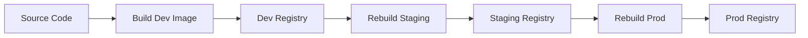
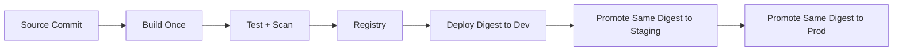

# Container Registry: ECR and ACR

> Fokus part ini bukan “cara push image Docker”.
>
> Fokusnya adalah memahami **container registry sebagai production dependency**: supply chain boundary, deployment source of truth, security gate, rollback anchor, image promotion mechanism, private network dependency, and possible outage source.

Dalam sistem enterprise Java/JAX-RS yang berjalan di Kubernetes, registry bukan komponen kecil di belakang CI/CD. Registry adalah dependency yang memengaruhi:

- apakah pod bisa start,
- image mana yang benar-benar dijalankan,
- apakah rollback mungkin dilakukan,
- apakah image sudah discan,
- apakah image bisa ditarik secara private,
- apakah environment promotion terkendali,
- apakah audit deployment bisa dibuktikan,
- apakah cluster tetap bisa recover saat node replacement terjadi.

Untuk konteks AWS dan Azure:

- AWS menggunakan **Amazon Elastic Container Registry (ECR)**.
- Azure menggunakan **Azure Container Registry (ACR)**.
- EKS biasanya menarik image dari ECR.
- AKS biasanya menarik image dari ACR.
- Hybrid/on-prem cluster bisa menarik image dari private registry cloud, internal registry, replicated registry, atau disconnected registry.

---

## 1. Core Mental Model

Container registry adalah **artifact store untuk container images dan OCI artifacts**.

Dalam lifecycle production, image registry berada di antara:

```mermaid
flowchart LR
    DEV[Developer Commit] --> CI[CI Build]
    CI --> TEST[Unit / Integration / Security Test]
    TEST --> IMG[Build Container Image]
    IMG --> SCAN[Vulnerability / Policy Scan]
    SCAN --> REG[Container Registry]
    REG --> PROMOTE[Promotion to Environment]
    PROMOTE --> GITOPS[GitOps / Helm / Kustomize]
    GITOPS --> K8S[Kubernetes Deployment]
    K8S --> NODE[Node pulls image]
    NODE --> POD[Pod starts Java/JAX-RS service]
```



Registry menjawab pertanyaan penting:

| Pertanyaan | Kenapa penting |
|---|---|
| Image apa yang akan dijalankan? | Menentukan runtime code, dependencies, base OS, JVM, agent, dan vulnerability surface. |
| Apakah image immutable? | Menentukan apakah deployment bisa diaudit dan di-rollback dengan benar. |
| Siapa yang boleh push? | Menentukan supply chain security. |
| Siapa yang boleh pull? | Menentukan runtime access boundary. |
| Apakah image discan? | Menentukan security gate sebelum production. |
| Apakah image tersedia di region/environment target? | Menentukan reliability deployment dan node recovery. |
| Apakah registry private? | Menentukan exposure, egress path, dan compliance boundary. |

---

## 2. Registry Is Not Just Storage

Registry menyimpan layer image. Namun dalam production architecture, registry juga menjadi:

1. **Promotion boundary**  
   Image berpindah dari dev candidate ke staging candidate ke production release.

2. **Trust boundary**  
   Hanya image dari registry resmi yang boleh dijalankan oleh cluster.

3. **Rollback boundary**  
   Rollback hanya aman jika image digest lama masih tersedia.

4. **Security boundary**  
   Vulnerability scanning, signing, admission control, dan policy enforcement biasanya dimulai dari registry metadata.

5. **Cost boundary**  
   Storage, replication, scanning, transfer, and retention policy semuanya punya implikasi biaya.

6. **Availability boundary**  
   Jika node baru perlu pull image dan registry unreachable, deployment bisa gagal walaupun aplikasi dan cluster sehat.

---

## 3. Key Concepts

### 3.1 Registry

Registry adalah service yang menyimpan image dan artifact. Contoh:

- `123456789012.dkr.ecr.ap-southeast-1.amazonaws.com`
- `mycompanyprod.azurecr.io`

### 3.2 Repository

Repository adalah namespace untuk image tertentu.

Contoh:

```text
quote-order-api
quote-price-engine
catalog-sync-worker
camunda-worker
nginx-ingress-custom
```

### 3.3 Image Tag

Tag adalah label manusiawi pada image.

Contoh:

```text
1.24.7
release-2026-07-11
main-8f4c921
staging
latest
```

Masalahnya: **tag bisa berubah** jika tidak dibuat immutable.

`latest` adalah tag yang buruk untuk production karena tidak menjelaskan versi, commit, build, vulnerability state, atau approval state.

### 3.4 Image Digest

Digest adalah identifier content-addressed.

Contoh:

```text
sha256:2c26b46b68ffc68ff99b453c1d30413413422d706483bfa0f98a5e886266e7ae
```

Digest lebih kuat daripada tag karena merepresentasikan isi image.

Production deployment idealnya mengunci image dengan digest:

```yaml
image: myregistry/quote-order-api@sha256:...
```

Atau minimal menyimpan digest sebagai evidence di deployment metadata.

### 3.5 Layer

Container image terdiri dari layer. Layer reuse membantu pull lebih cepat, tetapi juga membuat base image hygiene penting.

Jika base image vulnerable, banyak service bisa terdampak sekaligus.

### 3.6 OCI Artifact

Registry modern tidak hanya menyimpan Docker image. Ia juga bisa menyimpan artifact kompatibel OCI, misalnya:

- container image,
- Helm chart,
- SBOM,
- signature,
- attestation,
- policy artifact.

---

## 4. AWS Implementation: Amazon ECR

Amazon ECR adalah managed container registry di AWS untuk private repository, public repository, OCI image, Docker image, dan artifact kompatibel OCI.

### 4.1 ECR Private Registry

ECR private registry berada dalam AWS account dan region tertentu.

Format umum:

```text
<account-id>.dkr.ecr.<region>.amazonaws.com/<repository>:<tag>
```

Contoh:

```text
123456789012.dkr.ecr.ap-southeast-1.amazonaws.com/quote-order-api:1.24.7
```

Mental model penting:

- Registry scoped ke AWS account dan region.
- Repository ada di dalam registry.
- Permission diatur dengan IAM dan repository policy.
- Pull dari EKS membutuhkan node/workload punya permission ke ECR.
- Private connectivity bisa menggunakan VPC endpoint untuk ECR API, ECR Docker registry, dan S3 dependency untuk image layers.

### 4.2 ECR Repository

Repository biasanya dipetakan ke service atau artifact family.

Contoh enterprise naming:

```text
csg/quote-order/quote-api
csg/quote-order/order-api
csg/quote-order/catalog-sync-worker
csg/platform/nginx-base
```

Prinsip desain:

- Jangan campur banyak aplikasi unrelated dalam satu repository.
- Pisahkan base image, app image, worker image, dan infra image jika ownership berbeda.
- Gunakan naming yang memudahkan audit service ownership.
- Terapkan lifecycle policy per repository family.

### 4.3 ECR Authentication

Untuk Docker login ke ECR, AWS CLI mengambil authorization token dari ECR API.

Contoh pattern:

```bash
aws ecr get-login-password --region ap-southeast-1 \
  | docker login \
      --username AWS \
      --password-stdin 123456789012.dkr.ecr.ap-southeast-1.amazonaws.com
```

Di production pipeline, jangan gunakan static IAM user access key jika bisa dihindari. Lebih baik gunakan:

- OIDC federation dari CI/CD ke AWS IAM role,
- short-lived STS credentials,
- scoped IAM policy hanya untuk repository yang diperlukan,
- separate push role dan pull role.

### 4.4 ECR IAM Permission Model

Minimal push biasanya butuh action seperti:

```text
ecr:GetAuthorizationToken
ecr:BatchCheckLayerAvailability
ecr:InitiateLayerUpload
ecr:UploadLayerPart
ecr:CompleteLayerUpload
ecr:PutImage
```

Minimal pull biasanya butuh:

```text
ecr:GetAuthorizationToken
ecr:BatchGetImage
ecr:GetDownloadUrlForLayer
```

Untuk EKS, permission pull biasanya melekat ke:

- node IAM role,
- Fargate pod execution role,
- atau pattern lain sesuai cluster setup.

Workload identity seperti IRSA tidak otomatis berarti pod bisa pull image, karena image pull dilakukan oleh kubelet/container runtime sebelum aplikasi berjalan.

### 4.5 ECR Image Scanning

ECR mendukung vulnerability scanning. Secara konseptual ada dua model:

1. **Scan on push**  
   Image discan saat masuk registry.

2. **Continuous scanning / enhanced scanning**  
   Finding dapat berubah ketika CVE baru muncul setelah image dipush.

Production implication:

- Jangan menganggap image aman selamanya hanya karena lolos scan saat build.
- CVE baru bisa muncul untuk image lama.
- Security gate perlu membedakan severity, exploitability, fix availability, dan runtime exposure.
- Untuk Java service, scan OS package saja tidak cukup; library Java dan base JVM image juga harus diperhatikan.

### 4.6 ECR Lifecycle Policy

Lifecycle policy menghapus atau mengarsipkan image berdasarkan rule.

Gunakan untuk:

- menghapus build image lama,
- menjaga storage cost,
- menghindari registry penuh oleh branch build,
- mempertahankan release image tertentu,
- mempertahankan rollback window.

Bahaya lifecycle policy:

- Menghapus image yang masih direferensikan deployment lama.
- Menghapus image yang dibutuhkan untuk rollback.
- Menghapus image digest yang masih dipakai environment DR.
- Menghapus image yang belum dipromosikan tapi sedang diuji.
- Mengandalkan tag pattern yang tidak konsisten.

Rule yang sehat biasanya mempertahankan:

- N latest build per branch,
- semua production release untuk window tertentu,
- release yang sedang aktif di environment,
- image yang direferensikan deployment history,
- image yang diperlukan untuk DR.

### 4.7 ECR Tag Immutability

Tag immutability mencegah tag yang sama menunjuk ke image berbeda.

Untuk production, immutability hampir selalu lebih aman.

Pattern buruk:

```text
quote-order-api:prod
quote-order-api:latest
quote-order-api:stable
```

Pattern lebih baik:

```text
quote-order-api:1.24.7
quote-order-api:2026.07.11.3
quote-order-api:main-8f4c921
quote-order-api@sha256:...
```

Jika tetap perlu tag environment, tag itu harus dianggap pointer convenience, bukan source of truth audit.

### 4.8 ECR Cross-Region and Cross-Account Replication

Replication berguna untuk:

- multi-region deployment,
- DR readiness,
- account separation,
- shared service registry,
- reducing pull latency,
- avoiding cross-region transfer during deployment.

Hal yang perlu direview:

- Apakah replication mencakup semua repository?
- Apakah tag immutability ikut diterapkan?
- Apakah vulnerability finding direplikasi atau dievaluasi ulang?
- Apakah lifecycle policy source dan target selaras?
- Apakah failover region punya image yang sama sebelum DR event?
- Apakah digest sama tersedia di target region?

### 4.9 ECR Private Network Access

Untuk private cluster tanpa internet egress, pull image dari ECR membutuhkan endpoint yang benar.

Biasanya perlu memahami:

- ECR API endpoint,
- ECR Docker registry endpoint,
- S3 access untuk image layers,
- private DNS,
- security group endpoint,
- route table,
- NAT fallback jika endpoint tidak lengkap.

Failure umum:

- `ImagePullBackOff`
- `ErrImagePull`
- timeout ke `*.dkr.ecr.<region>.amazonaws.com`
- authentication error karena token tidak bisa diambil
- layer download gagal karena S3 endpoint/route tidak tersedia

---

## 5. Azure Implementation: Azure Container Registry

Azure Container Registry adalah managed registry service untuk Docker-compatible images, OCI images, Helm charts, dan artifact terkait.

### 5.1 ACR Registry

Format umum:

```text
<registry-name>.azurecr.io/<repository>:<tag>
```

Contoh:

```text
csgprod.azurecr.io/quote-order/quote-api:1.24.7
```

Mental model penting:

- ACR adalah Azure resource.
- Registry berada dalam resource group dan region.
- Authentication menggunakan Microsoft Entra identity, service principal, managed identity, atau admin user.
- Authorization menggunakan Azure RBAC atau repository-level permission model jika digunakan.
- Premium tier membuka kemampuan enterprise seperti private endpoint dan geo-replication.

### 5.2 ACR Repository

Repository di ACR menyimpan image dan artifact.

Naming yang baik:

```text
quote-order/quote-api
quote-order/order-api
quote-order/camunda-worker
platform/base-java17
platform/nginx-custom
```

Hindari:

- repository terlalu generik seperti `backend`,
- tag `latest` untuk production,
- repository campur untuk banyak domain,
- tidak ada ownership metadata.

### 5.3 ACR Authentication Options

ACR dapat diakses dengan beberapa mekanisme:

| Mekanisme | Cocok untuk | Risiko |
|---|---|---|
| Microsoft Entra user | Developer/manual operation | Tidak ideal untuk automation production |
| Service principal | Automation lama | Secret lifecycle harus dikelola |
| Managed identity | Azure runtime | Lebih baik untuk AKS/Container Apps/VM |
| Admin user | Emergency/simple setup | Umumnya tidak disarankan untuk production |
| Repository-scoped token | Scoped access | Perlu governance dan rotation |

Untuk AKS, image pull biasanya menggunakan kubelet identity yang diberi role pull ke ACR.

### 5.4 ACR and AKS Integration

AKS dapat diintegrasikan dengan ACR sehingga kubelet identity memiliki permission untuk pull image.

Konsep penting:

- Image pull terjadi sebelum container start.
- Managed identity aplikasi tidak selalu sama dengan identity yang melakukan image pull.
- `DefaultAzureCredential` di aplikasi tidak memengaruhi ability kubelet menarik image.
- Role pull harus diberikan pada identity yang benar.

Failure umum:

```text
ErrImagePull
ImagePullBackOff
unauthorized: authentication required
denied: requested access to the resource is denied
dial tcp: i/o timeout
```

### 5.5 ACR Private Endpoint

ACR dapat diakses melalui private endpoint untuk membatasi registry hanya dari jaringan private.

Yang perlu dicek:

- private endpoint untuk registry,
- private DNS zone untuk `privatelink.azurecr.io`,
- VNet link ke private DNS zone,
- NSG/UDR/firewall route,
- AKS subnet reachability,
- public network access disabled atau tidak,
- apakah CI/CD runner berada di network yang bisa akses private endpoint.

Masalah klasik:

- AKS bisa resolve ACR ke IP private, tetapi CI/CD runner publik tidak bisa push.
- Private DNS belum linked ke VNet AKS.
- Public access disabled sebelum private path valid.
- Firewall memblokir FQDN atau IP private endpoint.
- Role assignment benar, tetapi network path salah.

### 5.6 ACR Geo-Replication

Geo-replication membantu image tersedia dekat dengan deployment region.

Berguna untuk:

- multi-region deployment,
- DR,
- lower latency image pull,
- reducing dependency on single region registry availability.

Hal yang harus dipastikan:

- tier mendukung geo-replication,
- region target sama dengan region AKS,
- image promotion mempertimbangkan replication lag,
- deployment tidak dimulai sebelum image tersedia di replica,
- observability registry menunjukkan replication status.

### 5.7 ACR Tasks

ACR Tasks dapat membangun image di Azure, termasuk trigger dari source commit atau base image update.

Untuk enterprise backend, gunakan dengan hati-hati:

- CI/CD utama mungkin tetap di Azure DevOps, GitHub Actions, Jenkins, GitLab, atau internal tool.
- ACR Tasks bisa berguna untuk base image rebuild.
- Jangan membuat parallel build path yang tidak diaudit.
- Pastikan output image tetap melewati scanning, signing, and promotion gate.

---

## 6. ECR vs ACR Mapping

| Concern | AWS ECR | Azure ACR |
|---|---|---|
| Registry scope | AWS account + region | Azure resource in subscription/resource group |
| Repository | ECR repository | ACR repository |
| Auth for push | IAM/STS token via ECR auth | Entra identity, service principal, managed identity, admin user |
| Auth for pull from Kubernetes | Node/Fargate execution role to ECR | AKS kubelet identity / AcrPull / repository reader |
| Private access | VPC endpoints + private DNS | Private Endpoint + Private DNS Zone |
| Scanning | ECR basic/enhanced scanning, Inspector integration | Microsoft Defender for Cloud integration |
| Retention | Lifecycle policy | Retention/cleanup features and automation |
| Replication | Cross-region/cross-account replication | Geo-replication |
| Signing | ECR managed/manual signing features depending setup | Content trust / supply chain tooling depending setup |
| Audit | CloudTrail | Azure Activity Log / diagnostic logs |
| Cost drivers | storage, transfer, scanning, signing, replication | SKU, storage, transfer, geo-replication, Defender scanning |

Caveat penting: mapping ini bukan 1:1. Permission model, private networking, replication behavior, scan model, and integration path berbeda.

---

## 7. Image Promotion Strategy

Ada dua pendekatan utama.

### 7.1 Rebuild per Environment



Masalah:

- image dev dan prod belum tentu identik,
- build non-determinism bisa masuk,
- audit lebih sulit,
- bug bisa muncul karena perbedaan base image saat rebuild.

### 7.2 Build Once, Promote by Digest



Lebih baik untuk production karena:

- artifact sama melewati semua environment,
- audit digest jelas,
- rollback lebih deterministik,
- security approval melekat ke artifact,
- deployment evidence lebih kuat.

Rekomendasi default untuk enterprise system: **build once, promote by immutable digest**.

---

## 8. Tagging Strategy

Tag harus menjawab minimal:

- source commit,
- semantic version atau release number,
- build number,
- branch/source context,
- environment promotion status jika diperlukan.

Contoh:

```text
1.24.7
1.24.7-build.83
main-8f4c921
release-2026-07-11-03
```

Jangan gunakan tag mutable sebagai production truth:

```text
latest
prod
stable
current
```

Jika tag seperti `prod` tetap dipakai untuk human convenience, deployment manifest harus tetap mereferensikan digest atau mencatat digest yang dipromosikan.

---

## 9. Digest Pinning in Kubernetes

Contoh deployment lebih aman:

```yaml
apiVersion: apps/v1
kind: Deployment
metadata:
  name: quote-order-api
spec:
  template:
    spec:
      containers:
        - name: quote-order-api
          image: 123456789012.dkr.ecr.ap-southeast-1.amazonaws.com/quote-order-api@sha256:abc123...
```

Atau untuk ACR:

```yaml
image: csgprod.azurecr.io/quote-order/quote-api@sha256:abc123...
```

Keuntungan:

- tidak ada surprise karena tag berubah,
- rollback menunjuk artifact yang sama,
- evidence audit kuat,
- GitOps diff lebih bermakna.

Trade-off:

- digest kurang human-readable,
- pipeline harus otomatis menulis digest ke values/manifest,
- beberapa workflow manual menjadi kurang nyaman.

---

## 10. Image Pull in Kubernetes

Saat pod dibuat, kubelet melakukan image pull sebelum container berjalan.

Artinya:

- aplikasi belum sempat membaca secret,
- aplikasi belum sempat memakai AWS SDK/Azure SDK,
- application workload identity belum tentu relevan,
- masalah pull image berada di level node/kubelet/container runtime/registry/network.

Debug awal:

```bash
kubectl describe pod <pod> -n <namespace>
kubectl get events -n <namespace> --sort-by=.lastTimestamp
kubectl get pod <pod> -n <namespace> -o yaml
```

Cari event seperti:

```text
Failed to pull image
ErrImagePull
ImagePullBackOff
unauthorized
manifest unknown
TLS handshake timeout
i/o timeout
no such host
```

---

## 11. Common Failure Modes

### 11.1 Tag Exists Locally but Not in Registry

Symptom:

```text
manifest unknown
not found
```

Kemungkinan:

- tag belum dipush,
- push ke registry/region/account/subscription yang salah,
- deployment manifest menunjuk repository salah,
- promotion pipeline gagal,
- lifecycle policy menghapus image.

### 11.2 Authentication Failure

Symptom:

```text
unauthorized: authentication required
denied: requested access to the resource is denied
```

Kemungkinan AWS:

- node role tidak punya ECR pull permission,
- token ECR gagal diambil,
- repository policy deny,
- cross-account permission belum benar.

Kemungkinan Azure:

- kubelet identity belum punya `AcrPull` atau role repository reader,
- ACR menggunakan ABAC/repository permission model yang berbeda,
- registry admin disabled dan pipeline masih pakai admin credential,
- service principal secret expired.

### 11.3 Network Timeout

Symptom:

```text
dial tcp: i/o timeout
TLS handshake timeout
context deadline exceeded
```

Kemungkinan:

- private endpoint DNS salah,
- VPC endpoint tidak lengkap,
- S3 endpoint untuk ECR layer tidak tersedia,
- NSG/security group deny,
- route table/UDR salah,
- firewall/proxy memblokir registry,
- public access disabled sebelum private path valid.

### 11.4 TLS/Certificate Error

Symptom:

```text
x509: certificate signed by unknown authority
```

Kemungkinan:

- corporate TLS inspection,
- private registry menggunakan internal CA,
- node trust store belum benar,
- proxy memodifikasi TLS,
- registry mirror salah konfigurasi.

### 11.5 Image Scan Gate Blocks Deployment

Symptom:

- pipeline gagal setelah push,
- promotion ditolak,
- policy engine menolak deployment.

Kemungkinan:

- CVE high/critical baru,
- base image outdated,
- package manager cache meninggalkan vulnerable package,
- Java dependency CVE,
- false positive belum dikelola,
- exception/waiver process belum jelas.

### 11.6 Lifecycle Deleted Needed Image

Symptom:

- rollback gagal,
- DR environment tidak bisa start,
- old deployment replica tidak bisa pindah node.

Kemungkinan:

- lifecycle rule terlalu agresif,
- tag pattern salah,
- digest lama tidak dipreservasi,
- deployment history tidak dihubungkan dengan retention policy.

---

## 12. Production Debugging Playbook

### 12.1 Start from Kubernetes Event

```bash
kubectl describe pod <pod> -n <namespace>
```

Bedakan:

| Error | Kemungkinan root cause |
|---|---|
| `ImagePullBackOff` | generic pull failure after retry |
| `ErrImagePull` | immediate image pull failure |
| `manifest unknown` | image/tag/digest tidak ada |
| `unauthorized` | identity/RBAC/IAM issue |
| `no such host` | DNS issue |
| `i/o timeout` | routing/firewall/private endpoint issue |
| `x509` | TLS trust issue |

### 12.2 Verify Image Reference

Cek:

- registry hostname,
- repository name,
- tag/digest,
- region,
- account/subscription,
- environment mapping.

```bash
kubectl get deploy <name> -n <namespace> -o jsonpath='{.spec.template.spec.containers[*].image}'
```

### 12.3 Verify Registry Artifact

AWS:

```bash
aws ecr describe-images \
  --repository-name quote-order-api \
  --image-ids imageTag=1.24.7 \
  --region ap-southeast-1
```

Azure:

```bash
az acr repository show-tags \
  --name <acr-name> \
  --repository quote-order/quote-api \
  --output table
```

### 12.4 Verify Runtime Pull Identity

AWS/EKS:

- node IAM role,
- Fargate pod execution role,
- repository policy,
- cross-account permission,
- CloudTrail denied events.

Azure/AKS:

- kubelet identity,
- role assignment on ACR,
- `AcrPull` or repository reader role,
- subscription/resource group scope,
- Activity Log denied events.

### 12.5 Verify Network Path

AWS private ECR path:

- ECR API VPC endpoint,
- ECR Docker VPC endpoint,
- S3 gateway/interface endpoint as applicable,
- private DNS enabled,
- endpoint security group,
- route table.

Azure private ACR path:

- private endpoint,
- private DNS zone,
- VNet link,
- AKS subnet route,
- NSG/UDR,
- firewall rule,
- public network access setting.

---

## 13. Security Concerns

### 13.1 Push Permission Is More Sensitive Than Pull Permission

Push permission means someone can introduce code into runtime path.

Separate roles:

- CI build role: can push candidate image.
- Promotion role: can tag/promote approved image.
- Runtime pull identity: can only pull approved registry/repository.
- Human operator: read-only unless break-glass.

### 13.2 Registry Admin Account Should Be Avoided

ACR admin account and long-lived registry passwords are risky in production. Prefer Entra identity, managed identity, scoped token, or federated CI/CD identity.

Similarly in AWS, avoid long-lived IAM user access key for registry push/pull.

### 13.3 Admission Control

Registry policy alone is not enough. Kubernetes should also enforce:

- allowed registry list,
- disallow `latest`,
- require digest pinning if possible,
- require signed image if organization uses signing,
- require scan result threshold,
- restrict privileged base image,
- block images from public registry unless mirrored.

Tools vary by platform, but the policy intent should be clear.

### 13.4 Base Image Governance

Java services depend heavily on base image quality.

Review:

- base OS,
- JDK/JRE vendor,
- JVM version,
- CA certificates,
- timezone data,
- glibc/musl implications,
- shell/package manager availability,
- non-root user,
- vulnerability scan policy.

---

## 14. Cost Concerns

Registry cost usually hides in:

- stored layers,
- duplicated images across repos,
- unbounded branch builds,
- geo/cross-region replication,
- scanning,
- data transfer,
- pull-through cache,
- logs and audit events.

Cost hygiene:

- lifecycle policy,
- tag cleanup,
- avoid huge images,
- avoid unnecessary duplicate base layers,
- use regional registry near cluster,
- track per-team repository usage,
- retain production releases intentionally, not accidentally.

---

## 15. Performance Concerns

Image pull time affects:

- deployment speed,
- autoscaling reaction time,
- node replacement time,
- incident recovery,
- blue/green rollout duration.

Improve by:

- smaller images,
- stable base layers,
- local/regional registry,
- pre-pulling critical images if needed,
- avoiding cold pull from remote regions,
- avoiding massive debug tooling inside production images,
- using digest to improve cache predictability.

For Java:

- choose base image carefully,
- avoid packaging source/build cache,
- separate build and runtime image via multi-stage build,
- include only runtime dependencies,
- keep JVM flags externalized via config, not baked into many image variants.

---

## 16. Registry Outage Scenarios

### Scenario A: Running pods continue, new pods fail

Existing pods usually continue because image is already present. But new nodes or evicted pods may fail to start.

Impact:

- autoscaling fails,
- rolling deployment hangs,
- self-healing degraded,
- node replacement fails,
- DR recovery blocked.

Mitigation:

- avoid unnecessary rollouts during registry incident,
- pause deployments,
- preserve running pods,
- use PDB carefully,
- maintain replicated registry for DR,
- keep critical images cached where appropriate.

### Scenario B: CI can build but cannot push

Impact:

- release pipeline blocked,
- hotfix blocked,
- promotion blocked.

Mitigation:

- validate registry health before release window,
- separate build failure from registry failure,
- have emergency release process,
- maintain clear escalation to platform team.

### Scenario C: Security scan service unavailable

Impact:

- pipeline blocked or bypass requested.

Decision needed:

- fail closed for production?
- allow emergency break-glass?
- require waiver?
- record audit evidence?

---

## 17. Impact to Java/JAX-RS Backend

Container registry design affects Java/JAX-RS services through:

- base image JDK version,
- CA trust store,
- timezone and locale,
- native dependencies,
- JVM diagnostics tooling,
- image size and cold start,
- vulnerability profile,
- rollout speed,
- rollback reliability,
- GitOps manifest stability,
- ability to reproduce production runtime.

For JAX-RS service, ensure the image captures:

- application artifact,
- runtime server or framework,
- JVM configuration approach,
- health endpoint readiness,
- non-root execution,
- signal handling for graceful shutdown,
- logs to stdout/stderr,
- no embedded secrets.

---

## 18. Impact to PostgreSQL, Kafka, RabbitMQ, Redis, Camunda, and NGINX

Registry issues can affect more than app API pods.

| Component | Registry impact |
|---|---|
| PostgreSQL migration job | migration image cannot start, schema rollout blocked |
| Kafka consumer worker | worker scaling or redeploy fails |
| RabbitMQ worker | async processing recovery delayed |
| Redis-dependent cache warmer | cache preload job fails |
| Camunda worker | process task handling degraded |
| NGINX ingress custom image | ingress rollout failure can affect traffic |
| Database backup/export job | backup utility image unavailable |
| Smoke test job | release validation blocked |

Production registry strategy must cover all runtime and operational images, not only main API service.

---

## 19. EKS/AKS/Hybrid Considerations

### EKS

Verify:

- node IAM role pull permission,
- ECR endpoint access for private cluster,
- repository policy for cross-account pull,
- image pull from replicated region,
- CloudTrail audit for ECR actions,
- VPC endpoint private DNS,
- EKS addon and controller images.

### AKS

Verify:

- kubelet identity role assignment,
- ACR private endpoint,
- private DNS zone link,
- ACR SKU and geo-replication,
- Activity Log and diagnostic logs,
- Defender image scanning integration,
- AKS system images and private cluster behavior.

### Hybrid/On-Prem

Verify:

- can on-prem cluster reach cloud registry?
- is proxy required?
- is internal CA trusted?
- are images replicated to internal registry?
- how does disconnected install work?
- what is the fallback when cloud registry is unreachable?
- is license/compliance okay for copying base images?

---

## 20. Internal Verification Checklist

Use this checklist with platform/SRE/DevOps/security/backend team.

### Registry Ownership

- [ ] Which registry is authoritative for production images?
- [ ] Who owns repository creation?
- [ ] Who owns lifecycle policy?
- [ ] Who owns vulnerability scanning policy?
- [ ] Who owns image signing/admission policy?
- [ ] Who approves production promotion?

### Registry Structure

- [ ] Registry names.
- [ ] Repository naming convention.
- [ ] Environment separation model.
- [ ] Account/subscription boundary.
- [ ] Region placement.
- [ ] Shared vs per-team registry.
- [ ] Base image repository ownership.

### Authentication and Authorization

- [ ] CI/CD push identity.
- [ ] Promotion identity.
- [ ] Runtime pull identity.
- [ ] Human read/write access.
- [ ] Emergency break-glass access.
- [ ] Cross-account/cross-subscription pull.
- [ ] Role assignment audit.
- [ ] Long-lived secret usage.

### Tagging and Digest

- [ ] Is tag immutability enabled?
- [ ] Is production deployed by digest?
- [ ] Is `latest` blocked?
- [ ] Is commit SHA included?
- [ ] Is build number included?
- [ ] Is release version included?
- [ ] Is digest recorded in deployment evidence?

### Security

- [ ] Image scanning enabled.
- [ ] Scan result threshold.
- [ ] Waiver process.
- [ ] Base image policy.
- [ ] Non-root image policy.
- [ ] Image signing policy.
- [ ] Admission control policy.
- [ ] Public registry usage policy.
- [ ] SBOM/attestation requirement.

### Private Networking

- [ ] ECR VPC endpoints or ACR private endpoint.
- [ ] Private DNS configured.
- [ ] AKS/EKS subnet can reach registry.
- [ ] CI/CD runner can push through approved path.
- [ ] Public access setting reviewed.
- [ ] Firewall/proxy behavior known.
- [ ] Registry access logs available.

### Retention and DR

- [ ] Lifecycle policy preview reviewed.
- [ ] Production rollback window defined.
- [ ] DR image availability verified.
- [ ] Replication configured where needed.
- [ ] Old active digest protected from deletion.
- [ ] Registry outage runbook exists.

### Observability

- [ ] Registry audit logs enabled.
- [ ] Pull failure alerts.
- [ ] Scan failure alerts.
- [ ] Replication failure alerts.
- [ ] Storage growth dashboard.
- [ ] ImagePullBackOff dashboard in Kubernetes.
- [ ] CI/CD push failure alert.

---

## 21. PR Review Checklist

Ask these before approving registry-related changes:

- [ ] Does the change introduce a new image repository?
- [ ] Is ownership clear?
- [ ] Is image tag immutable?
- [ ] Is production deployment pinned to digest?
- [ ] Is the image built once and promoted, or rebuilt per environment?
- [ ] Is image scanning enforced?
- [ ] Is base image approved?
- [ ] Is the image non-root?
- [ ] Does it avoid embedding secrets?
- [ ] Does EKS/AKS have pull permission?
- [ ] Does private networking allow pull from target cluster?
- [ ] Is registry path compatible with DR?
- [ ] Is lifecycle policy safe for rollback?
- [ ] Are registry logs/audit available?
- [ ] Is cost impact understood?
- [ ] Is rollback documented?

---

## 22. Common Anti-Patterns

| Anti-pattern | Why dangerous |
|---|---|
| Deploying `latest` | Not auditable, not deterministic. |
| Mutable production tags | Same manifest can run different code over time. |
| Rebuild per environment | Prod image may differ from tested image. |
| Long-lived registry password | Credential leakage risk. |
| Public registry direct pull in prod | Availability and supply chain risk. |
| No lifecycle policy | Cost and clutter grow silently. |
| Over-aggressive lifecycle policy | Rollback/DR image missing. |
| No private registry path | Egress, compliance, and outage risk. |
| No scan gate | Vulnerable images enter runtime path. |
| No digest evidence | RCA and audit become weak. |

---

## 23. Minimal Production Standard

A production-grade registry setup should have:

- private registry per approved cloud/environment boundary,
- no `latest` in production,
- immutable tags,
- digest-based deployment or digest evidence,
- CI/CD federation instead of static credentials,
- separated push and pull identities,
- runtime pull permission scoped to required repositories,
- vulnerability scanning,
- base image governance,
- retention policy aligned with rollback/DR,
- private endpoint/VPC endpoint where required,
- registry audit logs,
- ImagePullBackOff alerting,
- documented registry outage runbook.

---

## 24. Key Takeaways

- Container registry is part of production architecture, not only CI/CD plumbing.
- Tag is a label; digest is the real artifact identity.
- Build once, promote by digest is safer than rebuild per environment.
- Image pull identity is not always the same as application runtime identity.
- Private registry access requires identity, DNS, routing, firewall, and endpoint correctness.
- Registry retention must protect rollback and DR.
- Registry outage can break autoscaling, node recovery, and release hotfix even when existing pods are healthy.
- For Java/JAX-RS systems, image design controls runtime reproducibility, JVM baseline, security exposure, and incident recovery speed.

---

## References

- AWS: Amazon Elastic Container Registry User Guide
- AWS: ECR image scanning
- AWS: ECR lifecycle policies
- AWS: ECR PrivateLink / VPC endpoints
- Microsoft Learn: Azure Container Registry overview
- Microsoft Learn: Azure Container Registry authentication
- Microsoft Learn: Azure Container Registry private endpoints
- Microsoft Learn: Troubleshoot AKS image pull from ACR
