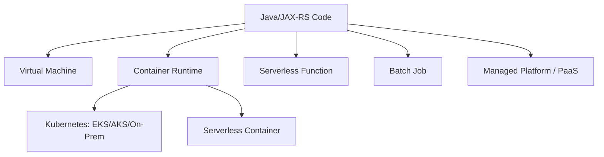

# Compute Options for Backend Engineers

> Fokus part ini adalah memahami pilihan compute sebagai **architecture decision**, bukan menghafal daftar service.
>
> Untuk senior Java/JAX-RS engineer, pertanyaan pentingnya bukan “service mana yang keren”, tetapi:
>
> - Siapa yang mengoperasikan runtime?
> - Di mana state disimpan?
> - Bagaimana scaling terjadi?
> - Apa failure mode-nya?
> - Bagaimana observability-nya?
> - Bagaimana deployment/rollback dilakukan?
> - Apa security boundary-nya?
> - Bagaimana cost berubah saat traffic naik atau idle?
> - Apakah model ini cocok untuk cloud, on-prem, dan hybrid?

---

## 1. Compute Mental Model

Compute adalah tempat kode berjalan.

Di enterprise backend system, compute bisa berupa:



Setiap opsi compute memindahkan batas tanggung jawab.

Semakin managed sebuah platform, semakin sedikit infrastruktur yang Anda kelola, tetapi semakin banyak constraint platform yang harus Anda terima.

---

## 2. Control vs Convenience

Compute choice adalah trade-off antara **control** dan **convenience**.

| Compute model | Control | Operational burden | Platform constraint |
|---|---:|---:|---:|
| Bare metal/on-prem server | Sangat tinggi | Sangat tinggi | Rendah |
| VM | Tinggi | Tinggi | Rendah-sedang |
| Container on VM | Tinggi | Tinggi | Sedang |
| Kubernetes | Tinggi | Sedang-tinggi | Sedang |
| Serverless container | Sedang | Rendah-sedang | Sedang-tinggi |
| Serverless function | Rendah-sedang | Rendah | Tinggi |
| Managed service/PaaS | Rendah | Rendah | Tinggi |

Tidak ada pilihan yang selalu benar.

Untuk enterprise Java/JAX-RS microservices yang kompleks, Kubernetes sering dipilih karena memberikan:

- standard deployment abstraction,
- service discovery,
- horizontal scaling,
- GitOps compatibility,
- cloud/on-prem/hybrid portability,
- sidecar/agent integration,
- ingress/network policy integration,
- consistent operational model.

Namun Kubernetes juga membawa operational burden:

- cluster upgrades,
- node capacity,
- pod scheduling,
- ingress complexity,
- service mesh jika digunakan,
- security policy,
- observability stack,
- cost optimization,
- platform ownership.

---

## 3. Compute Options Overview

### 3.1 Virtual Machine

VM memberikan OS-level control.

Cocok untuk:

- legacy application,
- stateful custom runtime,
- custom networking/security agent,
- software yang sulit dikontainerisasi,
- license-bound workload,
- workload yang butuh kernel/OS customization,
- hybrid/on-prem parity.

Tidak ideal untuk:

- high-frequency microservice deployment,
- dynamic autoscaling yang granular,
- standard cloud-native rollout,
- workload yang butuh banyak independent service scaling.

### 3.2 Container

Container membungkus aplikasi dan dependencies dalam image.

Cocok untuk:

- Java/JAX-RS service,
- worker,
- batch job,
- migration job,
- NGINX customization,
- Camunda worker,
- sidecar tooling.

Container bukan orchestrator. Anda tetap butuh platform untuk:

- scheduling,
- restart,
- service discovery,
- networking,
- volume,
- secret,
- rollout,
- autoscaling,
- observability.

### 3.3 Kubernetes

Kubernetes mengatur container workload di cluster.

Cocok untuk:

- banyak microservices,
- independent deployment,
- service discovery,
- progressive delivery,
- GitOps,
- mixed workload,
- cloud/on-prem/hybrid strategy,
- standardized platform engineering.

Tidak ideal jika:

- hanya satu service sederhana,
- tim tidak punya platform/SRE maturity,
- workload sangat event-driven kecil dan cocok function,
- operational cost cluster lebih besar dari manfaatnya.

### 3.4 Serverless Function

Function menjalankan unit kecil kode berdasarkan event.

Cocok untuk:

- event handler kecil,
- scheduled task ringan,
- glue logic,
- file processing trigger,
- notification,
- simple webhook,
- low idle cost workload.

Tidak ideal untuk:

- long-running JAX-RS API,
- complex domain transaction,
- heavy JVM cold start sensitive workload,
- stateful orchestration,
- low-latency always-warm service,
- complex dependency graph dengan banyak internal libraries.

### 3.5 Batch Job

Batch compute menjalankan pekerjaan finite.

Cocok untuk:

- export/import besar,
- billing batch,
- reconciliation,
- report generation,
- data migration,
- periodic cleanup,
- replay event,
- backfill.

Kunci desain:

- idempotency,
- checkpointing,
- retry,
- resource request,
- timeout,
- audit result,
- partial failure handling.

### 3.6 Managed Platform / PaaS

Managed platform mengabstraksi banyak detail runtime.

Cocok untuk:

- simple API,
- internal tool,
- fast delivery,
- team kecil,
- workload yang tidak butuh Kubernetes control.

Trade-off:

- limited portability,
- platform-specific deployment,
- limited networking customization,
- identity and secret integration berbeda,
- debugging sering bergantung pada platform diagnostics.

---

## 4. AWS Compute Options

### 4.1 Amazon EC2

EC2 adalah VM di AWS.

Gunakan ketika Anda butuh:

- OS-level control,
- custom agent,
- custom network stack,
- workload legacy,
- license-specific runtime,
- direct host tuning,
- self-managed database/broker/cache,
- migration dari on-prem VM.

Untuk Java/JAX-RS:

- Anda mengelola JDK/JRE,
- patch OS,
- process manager/systemd,
- log agent,
- TLS/cert,
- scaling group,
- health check,
- deployment script,
- rollback script.

Operational concern:

- AMI lifecycle,
- patching,
- SSH/bastion policy,
- security group,
- IAM instance profile,
- disk sizing,
- Auto Scaling Group,
- load balancer target health,
- CloudWatch agent,
- backup/snapshot.

### 4.2 Amazon ECS

ECS adalah container orchestration service AWS.

Gunakan ketika:

- Anda ingin container orchestration tanpa Kubernetes API,
- AWS-native integration lebih penting daripada portability,
- tim sudah nyaman dengan ECS service/task model,
- workload stateless/containerized,
- ingin Fargate serverless container atau EC2-backed cluster.

Trade-off:

- tidak sama dengan Kubernetes,
- GitOps/Kubernetes ecosystem tidak langsung berlaku,
- portability ke AKS/on-prem lebih rendah,
- service discovery/networking model AWS-specific.

### 4.3 AWS Fargate

Fargate adalah serverless compute untuk container pada ECS dan EKS.

Gunakan ketika:

- tidak ingin mengelola node,
- workload stateless,
- scaling relatif predictable,
- security isolation per task/pod penting,
- capacity planning node ingin dikurangi.

Trade-off:

- control node rendah,
- startup time dan cost model berbeda,
- daemonset/host-level agent tidak cocok,
- observability/networking perlu disesuaikan.

### 4.4 Amazon EKS

EKS adalah managed Kubernetes control plane AWS.

Gunakan ketika:

- organisasi standardisasi Kubernetes,
- ingin cloud/on-prem/hybrid portability,
- banyak microservices,
- perlu ecosystem Kubernetes,
- GitOps/Helm/Kustomize dipakai,
- workload campuran API, worker, job, ingress, controller.

EKS cocok untuk enterprise Java/JAX-RS jika:

- platform team mengelola cluster baseline,
- service team mengelola workload,
- observability dan network policy tersedia,
- deployment pipeline matang,
- IAM/workload identity jelas,
- cost/capacity dipantau.

### 4.5 AWS Lambda

Lambda menjalankan function tanpa mengelola server.

Gunakan untuk:

- event processing kecil,
- S3/object event,
- lightweight integration,
- scheduled job sederhana,
- asynchronous enrichment,
- automation.

Untuk Java, hati-hati:

- cold start,
- packaging size,
- connection reuse,
- initialization time,
- timeout,
- concurrency limit,
- idempotency,
- observability,
- framework overhead.

JAX-RS murni biasanya lebih cocok di container/Kubernetes daripada dipaksa ke Lambda, kecuali memakai adapter/framework khusus dan trade-off-nya diterima.

### 4.6 AWS Batch

AWS Batch cocok untuk job finite dengan compute provisioning otomatis.

Gunakan untuk:

- batch import/export,
- reconciliation,
- data processing,
- simulation,
- periodic heavy job.

Untuk quote/order systems:

- nightly reconciliation,
- bulk product/catalog import,
- large quote export,
- historical backfill,
- event replay.

---

## 5. Azure Compute Options

### 5.1 Azure Virtual Machines

Azure VM mirip EC2 sebagai VM-level compute.

Gunakan ketika:

- OS-level control dibutuhkan,
- workload legacy,
- custom agent,
- lift-and-shift,
- license-specific runtime,
- custom network/security setup.

Operational concern:

- VM image lifecycle,
- patching,
- managed disk,
- NSG,
- managed identity,
- backup,
- scale set,
- boot diagnostics,
- Azure Monitor agent.

### 5.2 Azure Kubernetes Service

AKS adalah managed Kubernetes service Azure.

Gunakan ketika:

- organisasi standardisasi Kubernetes,
- workload Java/JAX-RS microservices,
- membutuhkan GitOps,
- container deployment banyak,
- integrasi Azure networking/identity/monitoring dibutuhkan,
- hybrid strategy perlu konsisten dengan Kubernetes.

AKS membawa integrasi:

- Azure CNI,
- Azure Load Balancer,
- Application Gateway/AGIC,
- ACR integration,
- managed identity,
- workload identity,
- Azure Monitor Container Insights,
- Key Vault CSI Driver.

### 5.3 Azure Container Apps

Azure Container Apps adalah serverless container platform untuk microservices/containerized apps tanpa mengelola Kubernetes cluster secara langsung.

Gunakan ketika:

- ingin deploy container,
- tidak perlu full Kubernetes control,
- scale-to-zero menarik,
- event-driven workload,
- internal service sederhana,
- Dapr/KEDA-style event scaling cocok.

Trade-off:

- bukan full Kubernetes platform bagi tim aplikasi,
- control networking/sidecar/daemonset lebih terbatas,
- platform-specific behavior,
- portability ke EKS/on-prem lebih rendah dibanding Kubernetes manifest standar.

### 5.4 Azure Functions

Azure Functions adalah serverless function platform.

Cocok untuk:

- trigger kecil,
- scheduled task,
- queue/event handler,
- file processing,
- integration glue,
- automation.

Untuk Java:

- perhatikan cold start,
- function timeout,
- dependency size,
- connection reuse,
- telemetry,
- concurrency,
- retry behavior,
- idempotency.

Jangan otomatis memindahkan domain-heavy JAX-RS service ke function hanya karena ingin “serverless”.

### 5.5 Azure Batch

Azure Batch cocok untuk large-scale parallel/batch workload.

Gunakan untuk:

- data processing,
- compute-heavy jobs,
- scheduled batch,
- import/export,
- backfill,
- scientific/analytical jobs.

Untuk enterprise backend:

- pastikan job idempotent,
- output auditable,
- failure resumable,
- credential scoped,
- network path ke database/object storage private.

---

## 6. Compute Selection Framework

Gunakan decision lens berikut.

### 6.1 Workload Shape

| Workload shape | Bias compute |
|---|---|
| Long-running HTTP API | Kubernetes, VM, PaaS, serverless container |
| Many microservices | Kubernetes |
| Event handler kecil | Function |
| Heavy batch finite | Batch/Kubernetes Job |
| Legacy app | VM |
| Worker async | Kubernetes, ECS, Container Apps |
| Low traffic internal tool | PaaS/serverless container |
| Hybrid/on-prem parity | Kubernetes/VM |
| Stateful custom runtime | VM/Kubernetes with careful storage |
| High compliance control | VM/Kubernetes with strong governance |

### 6.2 Operational Ownership

Ask:

- Siapa patch OS?
- Siapa patch Kubernetes?
- Siapa patch node image?
- Siapa restart failed process?
- Siapa manage TLS?
- Siapa manage autoscaling?
- Siapa respond saat CPU/memory penuh?
- Siapa debug network?
- Siapa maintain deployment rollback?
- Siapa own observability?

Jika jawabannya tidak jelas, compute choice belum siap.

### 6.3 Deployment Model

| Requirement | Better fit |
|---|---|
| GitOps manifest | Kubernetes |
| Simple zip deploy | PaaS/function |
| Container image promotion | Kubernetes/ECS/Container Apps |
| Immutable VM image | VM/scale set |
| Blue/green at ingress layer | Kubernetes/load balancer/API gateway |
| Canary per service | Kubernetes/service mesh/progressive delivery |
| Fast rollback by image digest | Kubernetes/container platform |

### 6.4 Scaling Model

| Scaling need | Better fit |
|---|---|
| Request-based HTTP autoscaling | Kubernetes HPA, Container Apps, PaaS |
| Queue depth autoscaling | Kubernetes KEDA, Container Apps, Function |
| Scheduled batch scaling | Batch/Kubernetes CronJob |
| Node-level reserved capacity | VM/Kubernetes |
| Scale to zero | Function/Container Apps |
| Predictable always-on API | Kubernetes/VM/PaaS |

### 6.5 State Model

Compute should not hide state complexity.

For Java/JAX-RS microservices:

- process memory is ephemeral,
- session state should not depend on a single pod,
- file system should not be assumed durable,
- database transaction is external,
- broker message offset/ack semantics matter,
- Redis cache may be lost,
- Camunda state is in engine/database,
- object storage is external.

If a compute model encourages local state accidentally, challenge it.

---

## 7. Java/JAX-RS Considerations

### 7.1 JVM Startup and Cold Start

JVM startup matters differently by compute:

| Compute | JVM startup concern |
|---|---|
| VM | Usually less critical after boot |
| Kubernetes | Affects rollout, autoscaling, recovery |
| Serverless function | Critical for cold start latency |
| Serverless container | Important if scale-to-zero |
| Batch | Affects job startup overhead |

For Java 17+:

- minimize classpath bloat,
- avoid heavy startup initialization unless needed,
- warm connection pools carefully,
- expose readiness only after dependencies are ready,
- ensure graceful shutdown handles SIGTERM,
- tune heap relative to cgroup/container memory.

### 7.2 Connection Pooling

Compute affects connection behavior.

Kubernetes autoscaling can multiply:

- PostgreSQL connections,
- Kafka consumers,
- RabbitMQ connections/channels,
- Redis clients,
- cloud SDK connections.

If HPA scales from 10 pods to 80 pods, each with 20 DB connections, database may fail before application CPU hits limit.

Compute selection must include dependency capacity.

### 7.3 Readiness and Liveness

For Kubernetes:

- liveness should answer “should this container be restarted?”
- readiness should answer “can this pod receive traffic?”
- startup probe should protect slow JVM boot.

Bad health checks cause cascading failure:

- liveness checks restart during dependency blip,
- readiness checks include optional dependency,
- health endpoint performs expensive DB query,
- startup too slow and pod killed repeatedly.

### 7.4 Graceful Shutdown

Java service must handle SIGTERM:

- stop accepting new requests,
- finish in-flight request,
- commit/rollback transaction,
- stop consumer polling,
- close producer/consumer,
- release locks,
- flush metrics/logs,
- respect termination grace period.

Compute platform controls how much time you get.

---

## 8. Impact to Platform Components

### 8.1 PostgreSQL

Compute scaling affects database:

- connection count,
- transaction concurrency,
- migration job execution,
- network latency,
- failover reconnection,
- connection pool exhaustion.

Review:

- max pool per pod,
- max pods,
- database max connections,
- PgBouncer/proxy if used,
- migration execution strategy.

### 8.2 Kafka

Compute affects Kafka through:

- consumer group scaling,
- partition count,
- rebalance behavior,
- graceful shutdown,
- offset commit timing,
- producer batching,
- DNS/network stability.

Kubernetes rolling updates can trigger rebalance storm if not controlled.

### 8.3 RabbitMQ

Compute affects RabbitMQ through:

- connection/channel count,
- prefetch,
- ack/nack behavior,
- consumer concurrency,
- redelivery storms,
- graceful shutdown.

### 8.4 Redis

Compute affects Redis through:

- client count,
- connection pooling,
- cache stampede,
- cold pod startup,
- local cache invalidation,
- failover handling.

### 8.5 Camunda

Compute affects Camunda through:

- job worker concurrency,
- external task lock duration,
- retry behavior,
- engine/database load,
- deployment sequencing,
- worker graceful shutdown.

### 8.6 NGINX

Compute affects NGINX through:

- ingress controller placement,
- custom image pull,
- reload behavior,
- worker connection limits,
- resource limits,
- load balancer health probes.

---

## 9. Kubernetes vs Serverless for Enterprise Java APIs

For complex Java/JAX-RS enterprise API, Kubernetes is often better when you need:

- long-running service,
- stable low latency,
- custom ingress behavior,
- private network policies,
- sidecar/agent integration,
- consistent deployment across cloud/on-prem,
- many internal dependencies,
- controlled rollout,
- mature observability.

Serverless function may be better when:

- workload is event-triggered,
- logic is small,
- idle cost matters,
- scale-to-zero matters,
- operational simplicity matters,
- latency/cold start is acceptable,
- dependency graph is simple.

Serverless container may sit in the middle:

- container packaging,
- less cluster management,
- event/request scaling,
- platform constraints,
- lower operational burden than Kubernetes.

---

## 10. Failure Modes by Compute Model

### 10.1 VM Failure Modes

- host failure,
- disk full,
- OS patch issue,
- process died,
- systemd misconfigured,
- stale package,
- log disk exhaustion,
- manual config drift,
- security agent conflict,
- SSH access issue.

Debug:

- VM metrics,
- boot diagnostics,
- system logs,
- app logs,
- load balancer health,
- security group/NSG,
- disk usage,
- process manager status.

### 10.2 Kubernetes Failure Modes

- pod pending,
- image pull failure,
- crash loop,
- readiness failure,
- liveness restart,
- node pressure,
- insufficient CPU/memory,
- DNS issue,
- service selector mismatch,
- ingress misroute,
- network policy deny,
- PVC attach failure,
- HPA mis-scaling.

Debug:

```bash
kubectl get pod -n <namespace>
kubectl describe pod <pod> -n <namespace>
kubectl logs <pod> -n <namespace>
kubectl get events -n <namespace> --sort-by=.lastTimestamp
kubectl top pod -n <namespace>
kubectl describe deploy <deploy> -n <namespace>
```

### 10.3 Function Failure Modes

- cold start latency,
- timeout,
- concurrency throttle,
- event retry duplication,
- poison message,
- dependency connection burst,
- package size issue,
- memory underallocation,
- missing environment config,
- identity permission issue.

Debug:

- invocation logs,
- duration,
- timeout count,
- throttle count,
- error count,
- retry/dead-letter queue,
- dependency metrics,
- cold start signal if available.

### 10.4 Batch Failure Modes

- job stuck pending,
- insufficient capacity,
- partial output,
- duplicate execution,
- timeout,
- checkpoint missing,
- output overwrite,
- dependency throttling,
- failed retry creates duplicate side effect.

Debug:

- job status,
- container logs,
- input partition,
- output checkpoint,
- retry count,
- resource usage,
- dependency metrics,
- audit trail.

---

## 11. Availability and Resilience

Compute is part of resilience design.

Questions:

- Can workload survive one node failure?
- Can workload survive one AZ failure?
- Can workload survive control plane issue?
- Does autoscaling depend on metrics pipeline?
- Does deployment require registry availability?
- Does recovery require database/broker capacity?
- Does graceful shutdown prevent duplicate side effects?
- Does retry behavior amplify outage?

For Kubernetes:

- use multiple replicas,
- spread across zones,
- use PodDisruptionBudget,
- configure topology spread constraints if needed,
- set resource requests/limits,
- validate node group capacity,
- avoid single-node critical workload,
- understand cluster autoscaler/Karpenter behavior.

For VM:

- use availability zones/sets,
- use Auto Scaling/VM Scale Sets,
- health check behind load balancer,
- immutable image or config management,
- automated replacement,
- backup and restore.

For function/serverless:

- understand concurrency limits,
- configure DLQ/retry,
- use idempotency,
- monitor throttling,
- avoid connection storm.

---

## 12. Security Boundary

Compute determines runtime security boundary.

### 12.1 VM

Review:

- OS hardening,
- SSH/RDP access,
- patching,
- endpoint protection,
- disk encryption,
- managed identity/instance profile,
- firewall/security group/NSG,
- secret injection,
- audit logs.

### 12.2 Kubernetes

Review:

- namespace boundary,
- service account,
- workload identity,
- RBAC,
- network policy,
- pod security standard,
- image policy,
- secret mount,
- node isolation,
- runtime class if used,
- admission control.

### 12.3 Function/Serverless

Review:

- function identity,
- trigger auth,
- environment variables,
- secret references,
- outbound network path,
- concurrency abuse,
- event source permission,
- logging PII risk.

---

## 13. Cost Model

Compute cost is not just CPU.

Cost drivers:

- reserved/always-on capacity,
- idle nodes,
- over-requested Kubernetes resources,
- underutilized VM,
- autoscaling floor,
- serverless invocation count,
- serverless duration/memory,
- data transfer,
- NAT/egress,
- load balancer,
- logging volume,
- metrics cardinality,
- managed control plane,
- storage attached to compute,
- licensing.

For Kubernetes, common cost leak:

- high CPU/memory requests “just in case”,
- too many node pools,
- daemonset overhead,
- low bin-packing efficiency,
- over-retained logs,
- cross-zone traffic,
- NAT egress from pods,
- idle non-prod clusters.

For VM:

- forgotten instances,
- oversized machines,
- unused disks,
- snapshots,
- no scheduling for dev/test,
- no commitment strategy where appropriate.

For serverless:

- high duration,
- high memory allocation,
- high invocation retries,
- chatty event flow,
- cold start mitigation via provisioned concurrency or always-on features.

---

## 14. Observability Requirements

Any compute model must expose:

- CPU,
- memory,
- disk,
- network,
- request rate,
- error rate,
- latency,
- saturation,
- restart count,
- deployment version,
- dependency call metrics,
- logs,
- traces,
- health check status.

For Java/JAX-RS:

- JVM heap/non-heap,
- GC pause,
- thread pool,
- HTTP server metrics,
- connection pool,
- Kafka/RabbitMQ consumer lag,
- DB query latency,
- Redis latency,
- cloud SDK call metrics.

Without compute-level observability, architecture review is incomplete.

---

## 15. Compute Decision Matrix

| Decision factor | VM | Kubernetes | Serverless container | Function | Batch |
|---|---:|---:|---:|---:|---:|
| Runtime control | High | High | Medium | Low-medium | Medium |
| Operational burden | High | Medium-high | Medium-low | Low | Medium |
| Java API fit | Medium | High | Medium-high | Low-medium | Low |
| Event handler fit | Low | Medium | High | High | Medium |
| Batch fit | Medium | High via Jobs | Medium | Medium | High |
| Hybrid portability | High | High | Low-medium | Low | Medium |
| Startup sensitivity | Low | Medium | Medium-high | High | Medium |
| Deployment standardization | Medium | High | Medium | Medium | Medium |
| Private networking control | High | High | Medium | Medium | Medium |
| Cost when idle | High | Medium-high | Low-medium | Low | Low-medium |
| Debuggability | High | High if mature | Medium | Medium-low | Medium |

---

## 16. Compute Selection for Common Backend Scenarios

### Scenario 1: Quote API

Characteristics:

- long-running HTTP API,
- low latency,
- DB access,
- Redis cache,
- Kafka/RabbitMQ event publishing,
- observability required,
- controlled rollout.

Best fit:

- EKS/AKS Kubernetes Deployment,
- possibly VM/PaaS if organization standardizes there.

Avoid defaulting to function unless API is simple and cold start/timeout trade-off is accepted.

### Scenario 2: Catalog Import Worker

Characteristics:

- batch/async,
- reads large file,
- writes DB,
- publishes events,
- retryable,
- long-running.

Best fit:

- Kubernetes Job/CronJob,
- AWS Batch/Azure Batch,
- worker deployment if continuous queue-based.

### Scenario 3: Camunda External Task Worker

Characteristics:

- long-running worker,
- concurrency controlled,
- lock/lease semantics,
- graceful shutdown important.

Best fit:

- Kubernetes Deployment,
- ECS/Container Apps if platform standard,
- avoid function unless task duration and retry semantics are simple.

### Scenario 4: Webhook Receiver

Characteristics:

- HTTP ingress,
- bursty,
- simple validation,
- queue handoff.

Best fit:

- Kubernetes API service if part of existing platform,
- function/serverless container if isolated and simple.

### Scenario 5: Maintenance Cleanup

Characteristics:

- scheduled,
- finite,
- idempotent,
- not latency-sensitive.

Best fit:

- Kubernetes CronJob,
- serverless function,
- batch service.

---

## 17. Internal Verification Checklist

### Platform Standard

- [ ] What compute platform is approved for backend services?
- [ ] Is EKS, AKS, VM, ECS, Container Apps, or Functions used?
- [ ] Is there a platform decision record?
- [ ] Are there exceptions?
- [ ] Who approves exceptions?

### Runtime Ownership

- [ ] Who owns OS patching?
- [ ] Who owns Kubernetes upgrade?
- [ ] Who owns node image?
- [ ] Who owns base container image?
- [ ] Who owns JVM runtime version?
- [ ] Who owns runtime security agent?
- [ ] Who owns autoscaling configuration?

### Deployment

- [ ] Is deployment GitOps, CI/CD direct, or manual?
- [ ] Is rollback tested?
- [ ] Is image digest recorded?
- [ ] Are environment promotions controlled?
- [ ] Are smoke tests required?
- [ ] Are migration jobs coordinated with app rollout?

### Scaling and Capacity

- [ ] What is scaling trigger?
- [ ] What is min/max replica?
- [ ] What is node capacity?
- [ ] Are resource requests/limits set?
- [ ] Is database connection capacity aligned?
- [ ] Is broker partition/consumer capacity aligned?
- [ ] Is Redis client capacity aligned?
- [ ] Is load test evidence available?

### Networking

- [ ] Is workload public, private, or hybrid?
- [ ] What ingress path is used?
- [ ] What egress path is used?
- [ ] Is NAT/proxy required?
- [ ] Are private endpoints used?
- [ ] Are DNS dependencies documented?
- [ ] Are security group/NSG rules reviewed?

### Identity and Secrets

- [ ] What runtime identity is used?
- [ ] Is workload identity enabled?
- [ ] Are static credentials avoided?
- [ ] How are secrets injected?
- [ ] Is secret rotation supported?
- [ ] Is config reload supported?

### Observability

- [ ] Are logs collected?
- [ ] Are metrics collected?
- [ ] Are traces collected?
- [ ] Are JVM metrics available?
- [ ] Are deployment versions visible?
- [ ] Are alerts mapped to SLO?
- [ ] Are dashboards owned?

### Resilience

- [ ] Multi-AZ placement?
- [ ] PDB/topology spread?
- [ ] Graceful shutdown?
- [ ] Retry/circuit breaker?
- [ ] Dependency degradation?
- [ ] DR restore path?
- [ ] Runbook?

### Cost

- [ ] Are resources right-sized?
- [ ] Is idle cost acceptable?
- [ ] Are non-prod schedules used?
- [ ] Is log volume controlled?
- [ ] Are cross-zone/cross-region costs understood?
- [ ] Are autoscaling limits set?

---

## 18. PR Review Checklist

When reviewing a change that introduces or changes compute:

- [ ] Why this compute model?
- [ ] What alternatives were rejected?
- [ ] Who operates it?
- [ ] How does it scale?
- [ ] How does it fail?
- [ ] How is it deployed?
- [ ] How is it rolled back?
- [ ] How is it observed?
- [ ] How does it authenticate to cloud services?
- [ ] How does it receive secrets/config?
- [ ] How does it reach PostgreSQL/Kafka/RabbitMQ/Redis/Camunda?
- [ ] How does it behave during dependency outage?
- [ ] What is the cost model?
- [ ] What is the DR story?
- [ ] Is this consistent with platform standards?
- [ ] What internal team must approve this?

---

## 19. Common Anti-Patterns

| Anti-pattern | Why dangerous |
|---|---|
| Choosing Kubernetes for one tiny service with no platform maturity | Operational burden exceeds benefit. |
| Choosing function for complex domain API | Cold start, timeout, and observability complexity. |
| Running many Java services on VM manually | Drift, patching, deployment inconsistency. |
| Autoscaling app without dependency capacity | DB/broker/cache becomes failure point. |
| No resource requests/limits | Scheduling and cost become unpredictable. |
| No graceful shutdown | Duplicate processing and broken transactions. |
| No ownership boundary | Incidents bounce between teams. |
| Treating serverless as “no ops” | Still needs identity, network, observability, retry, and cost control. |
| Ignoring private networking | Runtime works in dev, fails in enterprise prod. |
| Not testing rollback | Compute change becomes irreversible during incident. |

---

## 20. Minimal Production Standard

A production-grade compute choice should have:

- explicit rationale,
- documented ownership,
- approved deployment path,
- rollback mechanism,
- runtime identity,
- secret/config strategy,
- private networking model,
- health checks,
- autoscaling guardrails,
- dependency capacity analysis,
- observability baseline,
- cost estimate,
- security baseline,
- incident runbook,
- DR consideration.

---

## 21. Key Takeaways

- Compute choice is an operational contract, not only a hosting decision.
- VM gives control but high operational burden.
- Kubernetes gives standardization and portability but requires platform maturity.
- Serverless functions reduce infrastructure management but add runtime constraints.
- Serverless containers sit between Kubernetes and functions.
- Batch compute is the right model for finite, retryable, auditable jobs.
- Java/JAX-RS services need careful handling for startup, memory, thread pools, graceful shutdown, and dependency connections.
- Scaling compute without scaling dependencies creates production incidents.
- The best compute choice is the one whose failure modes your team can observe, debug, and operate.

---

## References

- AWS: Overview of AWS Compute Services
- AWS: Amazon EC2 documentation
- AWS: Amazon ECS documentation
- AWS: Amazon EKS documentation
- AWS: AWS Lambda documentation
- Microsoft Learn: Choose an Azure Compute Service
- Microsoft Learn: Choose an Azure compute option for microservices
- Microsoft Learn: Azure Kubernetes Service architecture guidance
- Microsoft Learn: Azure Container Apps architecture guidance
