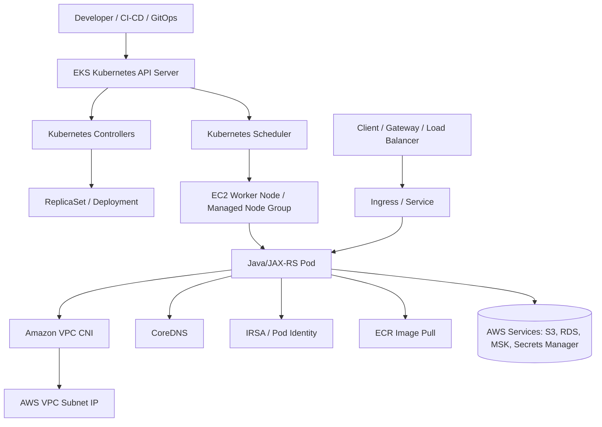

# Part 027 — EKS Foundation

> Fokus part ini bukan “cara klik create cluster”. Fokusnya adalah membangun mental model EKS sebagai managed Kubernetes platform yang menjadi runtime production untuk Java 17+ / JAX-RS / Jakarta RESTful services, microservices, NGINX ingress, PostgreSQL, Kafka, RabbitMQ, Redis, Camunda, GitOps, observability, dan private cloud integration.

## 1. Posisi EKS dalam Arsitektur Backend Enterprise

Amazon Elastic Kubernetes Service, atau EKS, adalah managed Kubernetes service di AWS. EKS mengelola Kubernetes control plane, sedangkan workload application berjalan di compute/data plane seperti EC2 worker nodes, managed node group, self-managed nodes, Fargate, atau opsi lain yang tersedia dalam arsitektur AWS.

Untuk senior backend engineer, EKS harus dipahami sebagai **runtime boundary** antara aplikasi dan platform cloud:

- aplikasi Java/JAX-RS berjalan sebagai container di pod;
- pod dijadwalkan ke node;
- node berada di subnet VPC;
- pod mendapat network identity melalui CNI;
- pod mendapat cloud identity melalui IRSA atau mekanisme workload identity lain;
- traffic masuk melalui load balancer, ingress, service, lalu pod;
- logs/metrics/traces keluar melalui observability pipeline;
- image ditarik dari ECR atau registry lain;
- secret/config diambil dari Kubernetes Secret, AWS Secrets Manager, SSM Parameter Store, external secret controller, atau CSI driver;
- database, broker, Redis, object storage, dan cloud API diakses melalui private networking dan IAM.

EKS bukan hanya tempat deploy container. EKS adalah titik pertemuan antara Kubernetes semantics, AWS networking, AWS identity, cloud load balancing, registry, storage, observability, and production operations.

## 2. Problem yang Dipecahkan EKS

Tanpa managed Kubernetes, team harus mengelola sendiri:

- Kubernetes API server;
- etcd;
- control plane HA;
- certificate rotation;
- cluster upgrades;
- API endpoint exposure;
- integration dengan cloud networking;
- integration dengan load balancer;
- node lifecycle;
- add-on lifecycle.

EKS mengurangi operational burden dengan mengelola control plane. Namun EKS tidak menghapus tanggung jawab aplikasi dan platform team. Banyak failure production tetap terjadi pada sisi yang masih dimiliki team:

- subnet IP exhaustion;
- node capacity shortage;
- pod crash loop;
- readiness/liveness misconfiguration;
- target group unhealthy;
- IAM role salah;
- IRSA annotation salah;
- DNS/private endpoint salah;
- image pull error;
- missing logs;
- unsafe rollout;
- node drain tanpa PodDisruptionBudget;
- add-on version drift;
- cluster endpoint exposure terlalu luas.

Jadi model mental yang benar: **AWS manages the Kubernetes control plane availability; your organization still owns architecture correctness, workload correctness, network correctness, identity correctness, and operational readiness.**

## 3. EKS Core Components

### 3.1 Managed Control Plane

Control plane adalah otak Kubernetes. Di EKS, AWS mengelola komponen control plane seperti Kubernetes API server dan etcd. Application team biasanya tidak login ke control plane host, tidak patch etcd langsung, dan tidak mengatur HA control plane secara manual.

Namun control plane tetap punya dampak langsung ke aplikasi:

- `kubectl` bergantung pada API server;
- deployment controller membuat/menyesuaikan ReplicaSet dan Pod;
- service account token, admission, RBAC, dan API object validation terjadi di control plane;
- controller seperti AWS Load Balancer Controller menonton Kubernetes API;
- GitOps tool seperti Argo CD/Flux melakukan reconciliation via API server.

Failure mode:

- API server unreachable;
- cluster endpoint private-only tetapi operator berada di network yang tidak punya akses;
- RBAC deny;
- AWS IAM authentication mapping salah;
- API rate limiting saat banyak controller atau automation;
- control plane upgrade memunculkan incompatibility dengan add-on atau controller lama.

### 3.2 Data Plane / Worker Nodes

Data plane adalah tempat container benar-benar berjalan. Dalam EKS, data plane bisa berupa:

- managed node group;
- self-managed node group;
- Fargate profile;
- hybrid node pattern jika digunakan;
- specialized node group untuk workload tertentu.

Untuk Java/JAX-RS service, node menentukan:

- CPU/memory yang tersedia;
- JVM heap headroom;
- garbage collector behavior under pressure;
- network throughput;
- ENI/pod IP capacity;
- disk/ephemeral storage;
- node-level security group;
- image pull speed;
- topology spread antar Availability Zone;
- pod eviction saat resource pressure.

### 3.3 Managed Node Group

Managed node group adalah cara AWS membantu mengelola lifecycle EC2 nodes untuk EKS. Ini biasanya lebih mudah dioperasikan daripada self-managed node karena beberapa proses seperti provisioning, rolling update, dan integration dengan cluster dikelola lebih rapi.

Gunakan managed node group ketika:

- team ingin lifecycle node lebih standar;
- ada kebutuhan upgrade node yang predictable;
- workload cocok dengan EC2 node biasa;
- platform ingin membatasi variasi node management;
- operating model lebih penting daripada full customization.

Failure mode yang perlu diperhatikan:

- node group tidak scale karena limit ASG/subnet/capacity;
- AMI/version drift;
- node upgrade mengganggu workload karena PDB tidak siap;
- instance type tidak cocok dengan memory/CPU profile aplikasi;
- subnet di AZ tertentu tidak punya IP cukup;
- taint/toleration salah sehingga pod tidak terjadwal.

### 3.4 Self-Managed Nodes

Self-managed nodes memberi kontrol lebih besar atas bootstrap, AMI, runtime, dan lifecycle. Namun operational burden juga lebih tinggi.

Gunakan self-managed nodes hanya jika ada alasan kuat, misalnya:

- custom AMI sangat spesifik;
- bootstrap process berbeda;
- runtime/security agent tertentu wajib;
- specialized hardware;
- compliance requirement;
- migration dari cluster lama.

Trade-off:

| Area | Managed Node Group | Self-Managed Nodes |
|---|---|---|
| Operational burden | Lebih rendah | Lebih tinggi |
| Customization | Medium | Tinggi |
| Upgrade lifecycle | Lebih standar | Perlu automation sendiri |
| Debugging | Lebih predictable | Lebih banyak variasi |
| Platform governance | Lebih mudah distandardisasi | Harus dikontrol ketat |

### 3.5 Fargate Profile

EKS Fargate memungkinkan pod berjalan tanpa mengelola EC2 nodes langsung. Dari sisi application engineer, ini terlihat menarik karena “tanpa node management”. Namun Fargate bukan default jawaban untuk semua workload.

Cocok untuk:

- workload stateless kecil/menengah;
- isolation per pod;
- batch atau auxiliary service;
- team yang ingin mengurangi node management;
- workload dengan kebutuhan resource yang jelas.

Perlu hati-hati untuk:

- daemonset requirement;
- node-level agent observability;
- storage requirement;
- startup latency;
- cost per workload;
- compatibility dengan add-on tertentu;
- traffic/load balancing behavior;
- debugging node-level issue yang berbeda dari EC2 node.

Untuk Java/JAX-RS, Fargate harus dievaluasi terhadap JVM memory, cold start, log/metric agent, private endpoint access, dan cost profile.

## 4. EKS Add-ons

EKS add-ons adalah komponen operasional yang membuat cluster bisa bekerja dengan AWS dan Kubernetes primitives. Add-ons yang paling penting untuk fondasi:

- Amazon VPC CNI;
- CoreDNS;
- kube-proxy;
- EBS CSI driver jika workload butuh block storage;
- EFS CSI driver jika workload butuh shared file system;
- AWS Load Balancer Controller, walau sering dipasang sebagai controller terpisah;
- observability/logging agent;
- security agent/admission controller jika digunakan.

### 4.1 Amazon VPC CNI

Amazon VPC CNI memberikan IP dari VPC ke pod. Ini membuat pod menjadi “first-class participant” di VPC networking. Dampaknya besar:

- pod dapat berkomunikasi langsung dengan private IP di VPC;
- security/routing mengikuti AWS VPC semantics;
- subnet IP capacity menjadi faktor scaling pod;
- ENI dan IP allocation memengaruhi scheduling;
- pod-to-RDS/MSK/ElastiCache/private endpoint path menjadi lebih cloud-native.

VPC CNI adalah salah satu hal terpenting yang harus dipahami backend engineer di EKS, karena banyak masalah aplikasi sebenarnya berasal dari pod IP, subnet, ENI, routing, atau security group.

### 4.2 CoreDNS

CoreDNS menyelesaikan DNS Kubernetes dan DNS eksternal dari dalam cluster. Semua Java service yang memanggil service lain melalui DNS bergantung pada CoreDNS.

Failure mode:

- CoreDNS overloaded;
- DNS latency tinggi;
- DNS record private endpoint salah;
- conditional forwarding salah;
- JVM DNS caching terlalu lama;
- `ndots` menyebabkan query amplification;
- service discovery gagal.

Untuk Java/JAX-RS, DNS bukan detail kecil. HTTP client, JDBC, Kafka client, Redis client, AWS SDK, dan Azure SDK semuanya akhirnya bergantung pada resolusi nama.

### 4.3 kube-proxy

kube-proxy mengelola routing service di node agar traffic ke Kubernetes Service dapat diarahkan ke endpoint/pod yang benar. Walau sering tidak terlihat oleh backend engineer, kube-proxy berdampak pada:

- Service ClusterIP;
- NodePort;
- load balancing internal service;
- packet routing di node;
- service endpoint changes;
- debugging connection refused/timeouts.

Jika kube-proxy rusak atau version mismatch, symptom bisa muncul sebagai service tidak reachable, intermittent traffic, atau routing aneh antar pod.

## 5. EKS Architecture Mental Model



Baca diagram ini sebagai chain tanggung jawab:

1. CI/CD atau GitOps menulis desired state.
2. Kubernetes API menerima desired state.
3. Scheduler menempatkan pod ke node.
4. Runtime menjalankan container.
5. VPC CNI memberi IP dan network path.
6. CoreDNS memberi name resolution.
7. Identity layer memberi credential AWS.
8. Load balancer/ingress membawa traffic masuk.
9. Observability layer membawa sinyal keluar.
10. AWS services menjadi dependency runtime.

Jika Java service error, jangan langsung asumsikan bug aplikasi. Bisa jadi salah satu lapisan di atas gagal.

## 6. ECR Integration

EKS workload biasanya menarik image dari Amazon Elastic Container Registry, atau dari registry enterprise lain. Untuk ECR, node/pod harus punya jalur dan permission untuk pull image.

Hal yang harus dicek:

- image repository benar;
- tag/digest benar;
- node role punya permission pull;
- registry private endpoint jika cluster private;
- DNS untuk ECR endpoint benar;
- image scanning policy;
- image retention policy;
- immutable tag/digest policy;
- cross-region replication jika diperlukan.

Failure mode:

- `ImagePullBackOff`;
- `ErrImagePull`;
- denied karena permission;
- timeout karena tidak ada egress/private endpoint;
- wrong tag karena mutable tag;
- image removed oleh retention policy;
- pull lambat saat scale out.

Untuk production, gunakan image digest untuk deployment kritis. Tag seperti `latest` atau mutable semantic tag dapat merusak reproducibility.

## 7. IRSA dan Runtime Identity

IAM Roles for Service Accounts, atau IRSA, memungkinkan pod menggunakan IAM role melalui Kubernetes ServiceAccount dan OIDC federation. Ini lebih aman daripada static AWS access key dalam secret.

Mental model:

- Kubernetes ServiceAccount menjadi identity lokal Kubernetes;
- OIDC provider menghubungkan cluster ke IAM;
- IAM role trust policy mengizinkan service account tertentu melakukan assume role;
- AWS SDK membaca projected token;
- STS menukar token menjadi temporary credentials;
- SDK memakai temporary credentials untuk call AWS service.

Contoh boundary yang harus jelas:

| Boundary | Contoh |
|---|---|
| Kubernetes identity | `ServiceAccount quote-api` |
| AWS identity | `IAM Role quote-api-s3-readwrite` |
| Trust boundary | OIDC provider + trust policy |
| Permission boundary | IAM permission policy |
| Runtime usage | AWS SDK for Java |
| Audit trail | CloudTrail STS + service API calls |

Failure mode:

- service account annotation salah;
- OIDC provider tidak ada;
- trust policy tidak match namespace/service account;
- audience token salah;
- IAM policy kurang permission;
- SDK mengambil credential dari source lain;
- pod restart diperlukan setelah annotation/role berubah;
- STS endpoint tidak reachable dari private cluster.

Part ini hanya fondasi. Detail mendalam sudah dibahas di Part 017 dan AWS SDK behavior di Part 018.

## 8. Security Group dan Cluster Network Boundary

EKS menggunakan security group pada beberapa level:

- cluster security group;
- node security group;
- load balancer security group;
- security group untuk pod jika fitur digunakan;
- security group untuk RDS/MSK/ElastiCache/private endpoint;
- security group untuk shared services.

Untuk backend engineer, security group perlu dibaca sebagai **network-level authorization**. IAM mengatur siapa boleh memanggil API cloud. Security group mengatur traffic TCP/UDP boleh lewat atau tidak.

Contoh problem:

- pod punya IAM permission ke RDS secret, tetapi tidak bisa connect ke database karena SG deny;
- pod bisa resolve private endpoint DNS, tetapi TCP timeout karena endpoint SG deny;
- ALB health check gagal karena node/pod port tidak dibuka;
- NLB berhasil connect tetapi Java service menolak karena wrong protocol/TLS;
- Kafka broker private reachable dari node tertentu saja karena SG terlalu sempit.

## 9. Cluster Endpoint: Public, Private, or Both

EKS cluster endpoint adalah endpoint Kubernetes API server. Ini bukan endpoint aplikasi. Banyak engineer baru menyamakan “cluster endpoint public” dengan “aplikasi public”, padahal berbeda.

Model umum:

| Endpoint mode | Makna | Risiko / perhatian |
|---|---|---|
| Public endpoint enabled | API server bisa dicapai dari internet dengan kontrol IAM/RBAC/CIDR | Pastikan CIDR allowlist ketat dan audit akses |
| Private endpoint enabled | API server bisa dicapai dari VPC/private network | Operator harus punya VPN/bastion/SSM/private access |
| Public + private | Fleksibel untuk operasi | Harus dicek exposure dan governance |
| Private-only | Lebih tertutup | CI/CD/GitOps/operator harus berada di network yang benar |

Failure mode:

- CI/CD tidak bisa deploy karena endpoint private-only;
- engineer tidak bisa `kubectl` dari laptop;
- public endpoint CIDR terlalu luas;
- private DNS/route tidak benar;
- emergency access tidak tersedia saat incident;
- GitOps controller di luar VPC tidak bisa connect.

Cluster endpoint adalah area yang harus direview oleh platform/security team, bukan keputusan aplikasi sepihak.

## 10. EKS Lifecycle

### 10.1 Cluster Provisioning

Provisioning EKS biasanya dilakukan dengan IaC seperti Terraform, eksctl, CloudFormation, atau platform internal. Hal yang harus dinyatakan eksplisit:

- cluster name;
- Kubernetes version;
- VPC/subnet;
- endpoint access mode;
- cluster IAM role;
- logging settings;
- add-ons;
- node groups;
- tags;
- encryption settings;
- OIDC provider;
- bootstrap access;
- upgrade policy.

### 10.2 Add-on Installation

Setelah cluster ada, add-on harus dipasang dan dikelola:

- VPC CNI;
- CoreDNS;
- kube-proxy;
- EBS/EFS CSI jika diperlukan;
- AWS Load Balancer Controller;
- metrics server;
- observability agent;
- policy/security controller.

Jangan anggap add-on “sekali pasang selesai”. Add-on punya version, config, compatibility matrix, dan upgrade path.

### 10.3 Workload Deployment

Workload Java/JAX-RS biasanya masuk melalui:

- container image di ECR;
- Kubernetes Deployment;
- Service;
- Ingress;
- ConfigMap/Secret/external secret;
- ServiceAccount dengan IRSA;
- HPA/PDB;
- NetworkPolicy jika digunakan;
- observability annotation/env/config.

### 10.4 Operations

Operasi harian meliputi:

- scaling node/pod;
- upgrade cluster/node/add-on;
- monitoring pod/node/control plane;
- triage logs/events;
- cost/capacity review;
- security patching;
- incident response;
- DR readiness;
- change review.

### 10.5 Decommissioning

Cluster decommission harus memperhatikan:

- workload migration;
- DNS cutover;
- load balancer cleanup;
- target group cleanup;
- EBS/EFS volume retention;
- IAM role cleanup;
- security group cleanup;
- VPC endpoint cleanup;
- CloudWatch log retention;
- orphaned ENI;
- cost leak.

## 11. Dampak ke Java/JAX-RS Backend

EKS memengaruhi Java service dalam beberapa area.

### 11.1 Startup dan Readiness

Java service sering punya startup lebih lambat dibanding service Go/Node. Jika readiness probe terlalu agresif, pod bisa dianggap unhealthy sebelum service siap.

Checklist:

- bedakan liveness dan readiness;
- readiness harus mengecek kesiapan menerima traffic, bukan sekadar JVM hidup;
- liveness jangan bergantung pada dependency eksternal yang transient;
- startup probe bisa membantu aplikasi dengan boot time panjang;
- graceful shutdown harus memberi waktu request selesai.

### 11.2 Memory dan CPU

JVM harus membaca container limits dengan benar. Salah sizing dapat menyebabkan:

- OOMKilled;
- GC thrashing;
- latency spike;
- thread starvation;
- node memory pressure;
- overprovisioning cost.

Checklist:

- set request/limit sesuai profile;
- gunakan JVM container-aware settings;
- sisakan native memory headroom;
- pantau heap, non-heap, thread count, direct buffer;
- jangan hanya melihat pod CPU average.

### 11.3 HTTP Client dan Timeout

Di Kubernetes, timeout chain melibatkan:

- client timeout;
- gateway timeout;
- load balancer idle timeout;
- ingress timeout;
- service mesh/proxy timeout jika ada;
- JAX-RS server timeout;
- downstream timeout.

EKS tidak memperbaiki timeout aplikasi. Timeout harus didesain end-to-end.

### 11.4 Cloud SDK Calls

AWS SDK call dari pod bergantung pada:

- DNS;
- route;
- security group;
- VPC endpoint/private endpoint;
- IRSA;
- STS;
- SDK retry/timeout;
- service quota/throttling.

Jika SDK timeout, akar masalah bisa network, identity, endpoint, quota, atau SDK config.

## 12. Dampak ke PostgreSQL, Kafka, RabbitMQ, Redis, Camunda, dan NGINX

### PostgreSQL

EKS workload yang connect ke PostgreSQL harus memperhatikan:

- private subnet path;
- security group;
- DNS endpoint;
- connection pool;
- failover behavior;
- TLS CA;
- password/secret rotation;
- RDS Proxy/connection proxy jika digunakan.

### Kafka / RabbitMQ

Messaging client di EKS perlu memperhatikan:

- bootstrap DNS;
- broker advertised listeners;
- private connectivity;
- TLS/SASL cert/secret;
- rebalance saat pod restart;
- pod disruption;
- consumer lag monitoring;
- network timeout.

### Redis

Redis client harus mempertimbangkan:

- private endpoint/subnet;
- DNS failover;
- cluster mode endpoint;
- timeout rendah tapi tidak terlalu agresif;
- reconnect/backoff;
- AUTH/ACL secret rotation;
- latency sensitivity.

### Camunda

Camunda deployment di Kubernetes bergantung pada:

- database reliability;
- job executor concurrency;
- pod restart behavior;
- stateful dependency;
- transaction boundary;
- message/event correlation;
- observability untuk stuck jobs/incidents.

### NGINX Ingress

NGINX ingress di EKS berperan sebagai L7 routing layer. Perhatikan:

- load balancer integration;
- health check;
- request body size;
- timeout;
- header forwarding;
- TLS termination;
- client IP preservation;
- rate limiting jika digunakan;
- config reload behavior.

## 13. Production Failure Modes

| Symptom | Kemungkinan Penyebab | Layer |
|---|---|---|
| Pod pending | node capacity, taint/toleration, resource request terlalu besar, subnet IP habis | Scheduling / capacity |
| Pod crash loop | app config, secret missing, JVM memory, dependency startup failure | Application/runtime |
| ImagePullBackOff | ECR permission, tag salah, private endpoint/egress, image removed | Registry/network/IAM |
| AccessDenied AWS SDK | IRSA trust/policy salah, wrong role, missing permission | Identity |
| SDK timeout | DNS, route, SG, endpoint, NAT, service outage, retry storm | Network/SDK |
| ALB 503 | target group empty/unhealthy, readiness fail, service selector salah | Ingress/LB |
| ALB 504 | backend timeout, app thread starvation, ingress timeout, downstream slow | App/LB/dependency |
| DNS intermittent | CoreDNS overload, resolver issue, private zone conflict | DNS |
| Cannot connect DB | SG deny, DNS wrong, route missing, TLS trust, secret wrong | Network/security/config |
| Missing logs | logging agent down, wrong stdout/stderr, retention/filter issue | Observability |
| High cost | overprovisioned nodes, idle LB, NAT traffic, log volume | Cost |

## 14. Production-Safe Debugging Flow

Gunakan alur dari luar ke dalam, lalu dari pod ke dependency.

### 14.1 Check Desired State

```bash
kubectl get deploy,rs,pod,svc,ingress -n <namespace>
kubectl describe deploy <name> -n <namespace>
kubectl describe pod <pod> -n <namespace>
kubectl get events -n <namespace> --sort-by=.lastTimestamp
```

Cari:

- image yang dipakai;
- replica ready/desired;
- probe failure;
- scheduling failure;
- mount secret/config failure;
- service account;
- node placement;
- event terbaru.

### 14.2 Check Runtime Logs

```bash
kubectl logs <pod> -n <namespace> --previous
kubectl logs <pod> -n <namespace>
```

Cari:

- startup exception;
- missing config;
- credential provider error;
- DNS/connect timeout;
- TLS handshake error;
- database pool exhausted;
- Kafka/RabbitMQ reconnect;
- OOM signs.

### 14.3 Check Network from Pod

Gunakan debug pod yang disetujui platform/security team.

```bash
kubectl exec -n <namespace> <pod> -- nslookup <host>
kubectl exec -n <namespace> <pod> -- curl -v <url>
kubectl exec -n <namespace> <pod> -- nc -vz <host> <port>
```

Jangan menjalankan debug tool sembarangan di production jika image/tool tidak disetujui.

### 14.4 Check Identity

```bash
kubectl get sa <service-account> -n <namespace> -o yaml
kubectl describe pod <pod> -n <namespace> | grep -i service
```

Cek:

- service account benar;
- IRSA annotation benar;
- projected token ada;
- AWS SDK memakai provider chain yang diharapkan;
- CloudTrail menunjukkan role yang benar.

### 14.5 Check AWS/EKS Layer

Cek melalui console/CLI/platform dashboard:

- node status;
- managed node group health;
- add-on versions;
- VPC CNI logs;
- CoreDNS health;
- cluster endpoint setting;
- load balancer target health;
- security group;
- subnet available IP;
- CloudWatch Container Insights jika aktif.

## 15. PR Review Checklist untuk EKS Foundation

Saat mereview PR yang menyentuh deployment EKS, tanyakan:

1. Apakah namespace, service account, dan IAM role jelas?
2. Apakah image memakai tag immutable atau digest?
3. Apakah request/limit JVM realistis?
4. Apakah readiness/liveness/startup probe benar?
5. Apakah HPA/PDB/topology spread disiapkan?
6. Apakah config/secret source aman?
7. Apakah deployment aman terhadap rolling update?
8. Apakah pod butuh akses AWS service? Role mana?
9. Apakah network path ke database/broker/Redis private?
10. Apakah logs/metrics/traces tersedia?
11. Apakah rollback jelas?
12. Apakah ada dampak ke node capacity/subnet IP?
13. Apakah change butuh security/platform review?
14. Apakah cost bertambah karena node/LB/log volume?
15. Apakah failure mode sudah didokumentasikan?

## 16. Internal Verification Checklist

Verifikasi ke platform/SRE/DevOps/security/backend team:

### Cluster and Ownership

- Nama cluster EKS per environment.
- AWS account ID per environment.
- Region dan Availability Zone yang digunakan.
- Owner cluster.
- Owner namespace aplikasi.
- Runbook EKS production.
- Escalation path untuk cluster incident.

### Version and Add-ons

- Kubernetes version.
- VPC CNI version.
- CoreDNS version.
- kube-proxy version.
- EBS/EFS CSI driver version jika digunakan.
- AWS Load Balancer Controller version.
- Metrics/logging/security agent version.
- Add-on upgrade process.

### Node and Capacity

- Managed node group atau self-managed.
- Instance type.
- Node group per workload class.
- Taint/toleration strategy.
- Autoscaling strategy.
- Subnet available IP.
- Spot usage jika ada.
- Node upgrade process.
- PDB requirement.

### Networking

- VPC ID.
- Subnet mapping.
- Public/private subnet usage.
- NAT Gateway/egress path.
- VPC endpoint usage.
- Cluster endpoint public/private setting.
- Security group model.
- NetworkPolicy support.

### Identity and Security

- IRSA atau EKS Pod Identity strategy.
- OIDC provider.
- ServiceAccount annotation convention.
- IAM role naming.
- Permission review process.
- CloudTrail audit path.
- Break-glass access.

### Registry and Deployment

- ECR repository.
- Image tag/digest policy.
- Image scanning.
- Image promotion flow.
- GitOps repo.
- Helm/Kustomize structure.
- Rollback process.

### Observability

- CloudWatch log groups.
- Container Insights.
- Prometheus/Grafana jika ada.
- Trace backend.
- Alert rules.
- Dashboard utama.
- SLO/SLA/error budget.

## 17. Anti-Patterns

- Menganggap EKS hanya “Kubernetes biasa” tanpa memahami VPC CNI.
- Menggunakan static AWS keys di Kubernetes Secret.
- Public cluster endpoint dengan CIDR terlalu luas.
- Tidak punya PDB untuk workload penting.
- Readiness probe hanya mengecek `/health` palsu yang selalu 200.
- Liveness probe memanggil database sehingga transient DB issue membunuh semua pod.
- Menggunakan mutable image tag untuk production.
- Tidak memonitor subnet IP exhaustion.
- Tidak men-version-control add-on configuration.
- Men-debug AccessDenied hanya dari aplikasi tanpa melihat CloudTrail.
- Mengubah security group saat incident tanpa mencatat RCA/change evidence.
- Menganggap node scaling otomatis menyelesaikan pod IP exhaustion.

## 18. Summary

EKS adalah managed Kubernetes platform yang mengurangi beban control plane, tetapi tetap menuntut disiplin tinggi pada networking, identity, workload sizing, add-on lifecycle, deployment safety, observability, dan production operations.

Untuk senior Java/JAX-RS engineer, EKS harus dibaca sebagai runtime yang memengaruhi:

- bagaimana request masuk ke pod;
- bagaimana pod mendapat IP;
- bagaimana pod mendapat credential AWS;
- bagaimana pod menarik image;
- bagaimana pod menemukan dependency;
- bagaimana pod connect ke PostgreSQL/Kafka/RabbitMQ/Redis/Camunda;
- bagaimana failure muncul sebagai 502/503/504, timeout, DNS error, AccessDenied, ImagePullBackOff, atau CrashLoopBackOff;
- bagaimana perubahan kecil pada cluster dapat menjadi incident production.

Part berikutnya akan masuk lebih dalam ke EKS networking: VPC CNI, pod IP from VPC, subnet IP exhaustion, security group, AWS Load Balancer Controller, ALB/NLB integration, Route 53, private/public endpoint, dan NetworkPolicy.
