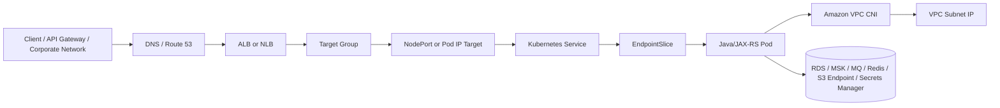
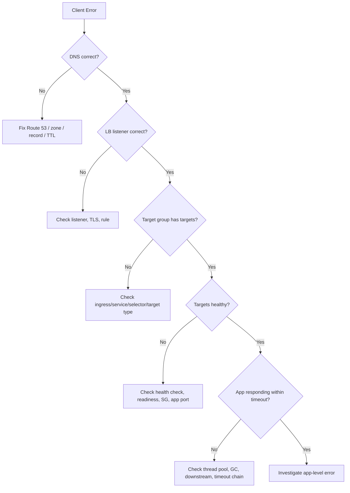
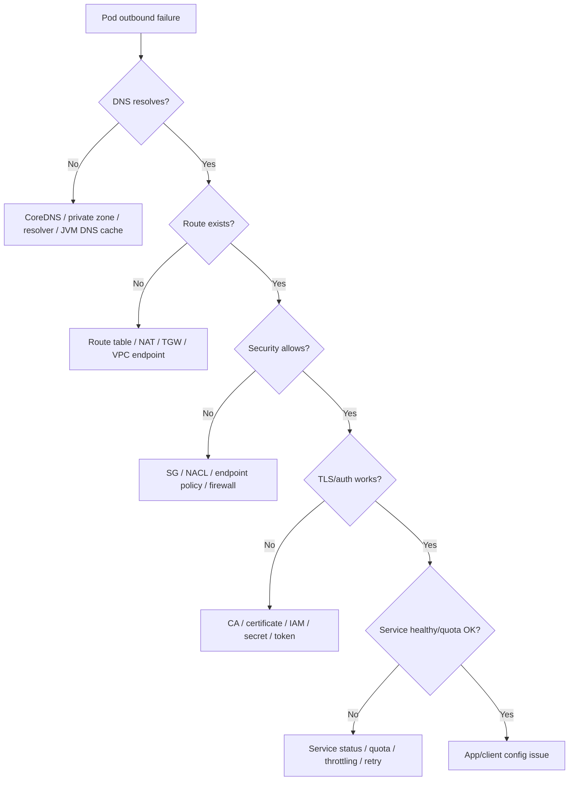

# Part 028 — EKS Networking

> Fokus part ini adalah memahami bagaimana network benar-benar bekerja di Amazon EKS. Banyak incident EKS tidak berasal dari “Kubernetes rusak”, tetapi dari kombinasi subnet IP, VPC CNI, security group, load balancer target type, health check, DNS, private endpoint, NAT, route table, dan timeout chain.

## 1. EKS Networking Mental Model

EKS networking adalah gabungan dari dua dunia:

1. **Kubernetes networking model**
   - Pod;
   - Service;
   - EndpointSlice;
   - Ingress;
   - NetworkPolicy;
   - CoreDNS;
   - kube-proxy;
   - CNI.

2. **AWS VPC networking model**
   - VPC;
   - subnet;
   - route table;
   - security group;
   - NACL;
   - ENI;
   - private IP;
   - NAT Gateway;
   - VPC Endpoint;
   - PrivateLink;
   - Route 53;
   - ALB/NLB target group.

Di EKS, pod networking tidak bisa dipahami hanya dari Kubernetes object. Karena Amazon VPC CNI memberi IP VPC langsung ke pod, maka pod adalah bagian dari VPC address space. Ini berbeda dari banyak cluster overlay networking yang menyembunyikan pod network di balik overlay.

Konsekuensinya:

- subnet IP capacity membatasi jumlah pod;
- pod traffic terlihat sebagai VPC traffic;
- security group dan route table menjadi relevan untuk pod;
- private endpoint dapat diakses dari pod via VPC path;
- VPC Flow Logs bisa membantu network debugging;
- AWS Load Balancer Controller dapat menargetkan pod IP secara langsung.

## 2. High-Level Traffic Model



Baca flow ini dari dua arah:

- **Inbound path:** client → DNS → ALB/NLB → target group → Kubernetes service/pod → Java endpoint.
- **Outbound path:** pod → VPC CNI → route table/security group → private endpoint/NAT/firewall → cloud or enterprise dependency.

Jika aplikasi memberi error, tentukan dulu path mana yang gagal: inbound, east-west, atau outbound.

## 3. Amazon VPC CNI

Amazon VPC CNI adalah network plugin yang menghubungkan Kubernetes pod dengan AWS VPC. Ia menjalankan komponen seperti `aws-node` di node dan mengatur ENI/IP allocation.

Mental model sederhana:

- Node EC2 punya primary ENI.
- VPC CNI dapat menambah ENI/secondary IP sesuai kapasitas instance type.
- Pod diberi IP dari subnet VPC.
- Pod menggunakan IP tersebut untuk traffic keluar/masuk.
- Kubernetes tetap melihat pod sebagai pod, tetapi AWS network melihatnya sebagai private IP di VPC.

### Dampak ke Backend Engineer

Untuk Java/JAX-RS service:

- setiap pod butuh IP;
- scale out pod berarti konsumsi IP subnet;
- HPA dapat gagal secara tidak langsung jika subnet IP habis;
- traffic ke RDS/MSK/Redis terlihat dari node/pod VPC IP;
- security group dan route table menentukan reachability;
- DNS private endpoint harus resolve ke IP private yang routable.

### Failure Mode VPC CNI

| Symptom | Kemungkinan Penyebab |
|---|---|
| Pod pending | subnet IP habis, ENI limit, node capacity |
| Pod scheduled tapi tidak bisa network | CNI issue, route/SG/NACL salah |
| Intermittent connectivity | node tertentu salah SG/route, IP exhaustion pressure |
| Scale-out lambat | IP allocation latency, EC2 API throttling |
| Dependency timeout | route table, endpoint SG, DNS, NAT, firewall |
| VPC Flow Logs reject | SG/NACL/route issue |

## 4. Pod IP from VPC

Salah satu karakteristik penting EKS adalah pod mendapat IP dari VPC. Ini membuat desain network lebih mudah diintegrasikan dengan AWS services, tetapi membuat IP planning lebih penting.

### Keuntungan

- pod dapat mencapai private AWS resources secara natural;
- tidak perlu overlay NAT untuk banyak skenario;
- VPC Flow Logs dapat membantu observability;
- ALB/NLB dapat menargetkan pod IP;
- security control dapat lebih dekat ke VPC semantics;
- hybrid/private connectivity lebih mudah dipahami.

### Risiko

- subnet IP exhaustion;
- sulit scale jika CIDR terlalu kecil;
- instance type ENI/IP limit memengaruhi pod density;
- pod churn dapat memperberat IP allocation;
- shared subnet dapat menjadi bottleneck lintas workload;
- banyak team tidak sadar HPA butuh IP, bukan hanya CPU.

### Rule of Thumb

Untuk production EKS, jangan hanya menanyakan:

> Berapa node yang kita butuhkan?

Tanyakan juga:

> Berapa pod maksimum per AZ, berapa subnet IP yang tersedia, berapa ENI/IP limit per instance type, dan apa yang terjadi saat HPA scale out bersamaan dengan deployment rollout?

## 5. Subnet IP Exhaustion

Subnet IP exhaustion adalah salah satu failure mode paling penting di EKS. Gejalanya sering terlihat sebagai pod pending atau scale-out yang tidak terjadi, padahal CPU/memory cluster tampak masih cukup.

### Skenario Umum

Misal:

- satu namespace melakukan rolling deployment besar;
- HPA service lain scale out karena traffic spike;
- batch job berjalan bersamaan;
- node autoscaler menambah node;
- subnet hanya punya sedikit available IP.

Akibatnya:

- node baru mungkin tidak punya cukup IP untuk pod;
- pod pending;
- ALB target group kehilangan healthy target;
- autoscaling terlihat gagal;
- incident terlihat sebagai availability problem di aplikasi.

### Debugging Checklist

Cek:

- available IP per subnet;
- pod density per node;
- VPC CNI logs;
- node events;
- pending pod events;
- EC2 ENI/IP limits;
- subnet per AZ;
- HPA scale event;
- rollout surge settings;
- node group scaling limits.

Contoh Kubernetes commands:

```bash
kubectl get pods -A --field-selector=status.phase=Pending
kubectl describe pod <pod> -n <namespace>
kubectl get nodes -o wide
kubectl -n kube-system logs ds/aws-node
```

Contoh yang perlu dicek di AWS:

- subnet available IPv4 address count;
- ENI count;
- EC2 instance type IP limit;
- VPC CNI configuration;
- prefix delegation/custom networking jika digunakan;
- EC2 API throttling.

## 6. Prefix Delegation and Custom Networking Awareness

Untuk mengurangi pressure IP allocation, EKS dapat menggunakan pendekatan seperti prefix delegation atau custom networking, tergantung design platform.

### Prefix Delegation

Prefix delegation memungkinkan assignment blok IP ke node sehingga jumlah IP untuk pod dapat meningkat dan EC2 API calls dapat berkurang dibanding alokasi IP individual.

Perlu dicek:

- apakah VPC CNI prefix delegation diaktifkan;
- instance type yang digunakan;
- subnet CIDR cukup besar;
- warm prefix/IP target configuration;
- dampak ke pod density;
- monitoring IP usage.

### Custom Networking

Custom networking memungkinkan pod menggunakan subnet/security group berbeda dari primary node subnet dalam VPC yang sama. Ini sering dipakai untuk mengurangi IPv4 exhaustion atau memisahkan pod subnet.

Perlu dicek:

- apakah ENIConfig digunakan;
- subnet untuk pod;
- security group untuk pod subnet;
- route table;
- NAT/private endpoint reachability;
- observability dan operational complexity.

Jangan mengaktifkan fitur ini tanpa ownership yang jelas. Ini mengubah model debugging network.

## 7. Security Group for Node

Default mental model yang sering terjadi: pod pada node berbagi effective network boundary yang berasal dari node security group, kecuali fitur security groups for pods digunakan.

Security group node memengaruhi:

- egress pod ke dependency;
- inbound traffic dari load balancer ke node/pod target;
- node-to-control-plane traffic;
- DNS/resolver path;
- monitoring/logging egress;
- image pull egress/private endpoint;
- database/broker access jika dependency allowlist menggunakan node SG.

### Failure Mode

| Symptom | Kemungkinan Penyebab |
|---|---|
| Pod tidak bisa connect DB | DB SG tidak allow node SG/pod SG |
| ALB target unhealthy | LB SG tidak boleh connect ke node/pod port |
| NLB connect timeout | target SG/NACL/route issue |
| SDK timeout | endpoint SG tidak allow source |
| Kafka broker timeout | broker SG hanya allow CIDR/SG tertentu |

### Review Questions

- Apakah security group terlalu luas?
- Apakah dependency allowlist memakai CIDR atau SG reference?
- Apakah node group berbeda punya SG berbeda?
- Apakah workload dengan sensitivity berbeda berbagi node SG?
- Apakah ada SG rule sementara dari incident yang belum dibersihkan?

## 8. Security Groups for Pods Awareness

Security groups for pods memungkinkan security group diterapkan lebih granular ke pod tertentu. Ini berguna ketika workload berbeda punya requirement network security berbeda tetapi berjalan di shared cluster.

Cocok untuk:

- pod yang harus akses database tertentu;
- workload regulated yang perlu segmentation;
- shared node group dengan sensitivity berbeda;
- compliance requirement yang meminta network boundary per workload.

Trade-off:

- lebih kompleks;
- butuh compatibility instance type/CNI;
- butuh governance ketat;
- debugging lebih sulit;
- tidak semua pattern cocok;
- dapat memengaruhi scaling/pod placement.

Jangan menganggap security groups for pods menggantikan NetworkPolicy. Keduanya bekerja di level dan tujuan yang berbeda:

- Security group: AWS VPC-level firewall semantics.
- NetworkPolicy: Kubernetes pod-to-pod/pod egress policy semantics.

## 9. AWS Load Balancer Controller

AWS Load Balancer Controller mengelola AWS load balancer berdasarkan Kubernetes resources seperti Ingress dan Service. Ini adalah bridge penting antara Kubernetes desired state dan AWS ELB resources.

Tanpa controller yang benar, Kubernetes bisa memakai legacy behavior atau tidak membuat resource AWS sesuai ekspektasi.

Controller biasanya mengelola:

- Application Load Balancer untuk Ingress;
- Network Load Balancer untuk Service type `LoadBalancer`;
- target group;
- listener;
- rules;
- health check;
- security group rules;
- subnet selection;
- tags;
- target registration.

### Failure Mode Controller

| Symptom | Kemungkinan Penyebab |
|---|---|
| Ingress tidak membuat ALB | controller missing, IAM permission kurang, annotation salah |
| ALB ada tapi target empty | service selector salah, target type mismatch |
| Target unhealthy | health check path/port salah, readiness fail |
| TLS tidak aktif | certificate ARN salah, listener annotation salah |
| Wrong subnet | subnet tag salah, annotation salah |
| Cannot modify LB | IAM role controller kurang permission |
| Security group tidak update | permission/tag/ownership issue |

### Debugging

```bash
kubectl get ingress -A
kubectl describe ingress <name> -n <namespace>
kubectl get svc -n <namespace>
kubectl -n kube-system logs deploy/aws-load-balancer-controller
```

Cek juga di AWS:

- ALB/NLB resource;
- target group target health;
- listener rules;
- security group;
- subnet mapping;
- controller IAM role;
- CloudTrail denied events.

## 10. ALB Ingress on EKS

Application Load Balancer cocok untuk HTTP/HTTPS routing. Di EKS, ALB biasanya dibuat dari Kubernetes Ingress oleh AWS Load Balancer Controller.

### Cocok untuk

- REST API;
- HTTP path-based routing;
- host-based routing;
- TLS termination;
- WAF integration;
- public atau internal API;
- microservice ingress.

### Key Concepts

- Ingress resource mendeskripsikan routing intent;
- ALB listener menerima HTTP/HTTPS;
- listener rule mencocokkan host/path;
- target group mengarah ke pod atau node;
- health check menentukan target healthy;
- target type memengaruhi path traffic.

### Target Type: Instance vs IP

| Target type | Cara kerja | Dampak |
|---|---|---|
| `instance` | ALB target ke node/NodePort | Lebih indirect, bergantung NodePort dan node routing |
| `ip` | ALB target langsung ke pod IP | Lebih direct, cocok dengan VPC CNI pod IP |

Untuk EKS dengan VPC CNI, `ip` target sering lebih natural untuk pod-level targeting. Namun pilihan harus mengikuti standar platform internal, observability, security group model, dan compatibility.

### ALB Health Check

Health check harus align dengan readiness aplikasi.

Bad pattern:

- health check path selalu 200 meskipun app belum siap;
- health check memanggil dependency berat;
- health check butuh auth;
- health check timeout lebih pendek dari normal startup;
- health check port/path tidak match container.

Good pattern:

- readiness menunjukkan kemampuan menerima traffic;
- liveness tidak membunuh pod karena dependency transient;
- startup probe digunakan untuk boot panjang;
- health path ringan dan deterministic;
- ALB health check selaras dengan readiness.

## 11. NLB with Kubernetes Service

Network Load Balancer cocok untuk L4/TCP/UDP traffic atau skenario yang membutuhkan low-latency TCP load balancing.

Cocok untuk:

- TCP service;
- internal private service;
- high throughput;
- preserving source IP dalam beberapa konfigurasi;
- non-HTTP protocol;
- private NLB untuk service-to-service atau hybrid access.

Di Kubernetes, NLB biasanya dibuat melalui Service type `LoadBalancer` dengan annotation yang sesuai.

### Failure Mode NLB

- service annotation salah;
- target type salah;
- health check port/protocol salah;
- target group empty;
- node/pod SG deny;
- source IP behavior tidak sesuai ekspektasi;
- TLS termination terjadi di layer yang salah;
- NACL/route table deny;
- DNS mengarah ke LB lama.

### Review Questions

- Apakah protokol benar-benar butuh NLB, bukan ALB?
- Apakah service internal atau public?
- Apakah target type IP atau instance?
- Apakah source IP preservation diperlukan?
- Apakah health check memahami protocol service?
- Apakah security group/NACL/route table sudah sesuai?
- Apakah observability L4 cukup untuk incident triage?

## 12. Route 53 and EKS

Route 53 dapat digunakan untuk public DNS, private hosted zone, service discovery, alias record ke load balancer, dan internal routing.

Dalam EKS, Route 53 biasanya muncul di beberapa path:

- public API domain → ALB/API Gateway;
- internal domain → internal ALB/NLB;
- private hosted zone untuk service internal;
- private endpoint DNS;
- ExternalDNS controller jika digunakan;
- failover/weighted/latency routing jika ada.

### ExternalDNS Awareness

Jika cluster memakai ExternalDNS, Kubernetes resources dapat membuat/memperbarui DNS records otomatis.

Risiko:

- annotation salah membuat record salah;
- conflict antar cluster/environment;
- TTL terlalu panjang;
- record production terhapus oleh cleanup;
- IAM permission terlalu luas;
- private/public zone tertukar.

### DNS Debugging

Dari pod:

```bash
nslookup <service-domain>
dig <service-domain>
```

Cek:

- record resolve ke IP publik atau private?
- CNAME/alias chain benar?
- private hosted zone attached ke VPC benar?
- CoreDNS forwarding benar?
- TTL sesuai?
- split-horizon DNS tidak konflik?

## 13. Cluster Endpoint Network Access

Cluster endpoint menentukan bagaimana Kubernetes API server diakses. Ini berbeda dari application ingress.

Mode yang perlu dipahami:

- public endpoint;
- private endpoint;
- public + private;
- restricted public CIDR;
- private-only operation.

### Private-Only Cluster Implications

Jika cluster endpoint private-only:

- CI/CD runner harus berada di network yang bisa mengakses VPC;
- GitOps controller harus bisa reach API server;
- engineer perlu VPN/bastion/SSM/private access;
- emergency access harus diuji;
- DNS untuk endpoint harus resolve benar;
- route/firewall harus mengizinkan access.

### Common Failure

- `kubectl` timeout dari laptop;
- CI/CD deployment gagal;
- Argo CD tidak bisa sync;
- DNS resolve ke private IP yang tidak reachable;
- security team membuka public endpoint sementara lalu lupa menutup;
- endpoint CIDR allowlist terlalu luas.

## 14. NetworkPolicy in EKS

Kubernetes NetworkPolicy mengatur komunikasi pod-to-pod dan pod egress/ingress di level Kubernetes policy. Pada EKS, dukungan enforcement bergantung pada CNI/configuration yang digunakan.

Pertanyaan penting:

- Apakah NetworkPolicy diaktifkan?
- Siapa yang mengelola policy?
- Default posture allow-all atau deny-by-default?
- Apakah egress policy mencakup DNS?
- Apakah policy mencakup access ke database/broker/private endpoint?
- Apakah policy diuji sebelum production?
- Apakah observability untuk denied traffic tersedia?

### Common Mistake

Membuat deny-all egress tanpa allow DNS. Akibatnya service tidak bisa resolve dependency dan error terlihat sebagai timeout atau unknown host.

Contoh concern:

```yaml
# Ini hanya ilustrasi. Jangan copy ke production tanpa review platform/security.
apiVersion: networking.k8s.io/v1
kind: NetworkPolicy
metadata:
  name: default-deny-egress
spec:
  podSelector: {}
  policyTypes:
    - Egress
```

Jika policy seperti ini diterapkan tanpa allow rule untuk DNS, private endpoint, database, broker, metrics exporter, dan required control plane path, banyak workload bisa gagal.

## 15. Inbound Traffic Failure Analysis

Saat user mendapat 502/503/504, gunakan chain berikut.



### 502

Kemungkinan:

- backend connection reset;
- protocol mismatch;
- TLS mismatch;
- app closes connection;
- ingress/proxy config salah.

### 503

Kemungkinan:

- no healthy target;
- service selector salah;
- pod readiness fail;
- deployment belum ready;
- target registration delay.

### 504

Kemungkinan:

- app slow;
- downstream slow;
- timeout chain mismatch;
- connection pool exhausted;
- retry storm;
- JVM GC pause;
- load balancer idle timeout.

## 16. Outbound Traffic Failure Analysis

Saat pod tidak bisa call AWS service, database, broker, atau external dependency:



### SDK Timeout vs AccessDenied

- `AccessDenied` biasanya identity/policy/trust/resource policy.
- `UnknownHostException` biasanya DNS.
- `ConnectTimeout` biasanya route/SG/NACL/firewall/endpoint.
- `ReadTimeout` bisa dependency slow, LB timeout, packet loss, TLS/proxy issue.
- `ThrottlingException` biasanya quota/rate limit/retry policy.

Jangan debug semuanya sebagai “network issue”. Klasifikasikan error dulu.

## 17. Private Connectivity from EKS Pods

Pod-to-private-service call membutuhkan beberapa hal benar sekaligus:

- pod punya IP di subnet routable;
- DNS resolve ke private IP;
- route table mengarah ke target benar;
- SG/NACL mengizinkan;
- endpoint policy/resource policy mengizinkan jika ada;
- IAM role mengizinkan jika service AWS;
- TLS trust benar;
- SDK endpoint/region benar.

Contoh untuk S3 via VPC endpoint:

- DNS/route harus memakai endpoint path;
- bucket policy mungkin membatasi source VPC endpoint;
- IAM role harus punya permission S3;
- SDK region harus benar;
- retry/timeout harus sesuai;
- CloudTrail/S3 access log bisa dipakai audit.

Contoh untuk RDS PostgreSQL:

- DNS endpoint resolve;
- pod/node SG allowed ke DB SG port 5432;
- route private antar subnet;
- TLS CA benar;
- secret credential benar;
- connection pool tidak melebihi DB capacity;
- failover behavior dipahami.

## 18. EKS Networking and Java/JAX-RS Concerns

### Connection Pooling

Java service biasanya memakai pool untuk HTTP, JDBC, Kafka, RabbitMQ, Redis. Pool salah sizing dapat menimbulkan:

- port exhaustion;
- connection storm saat pod scale out;
- database max connection habis;
- broker overload;
- Redis timeout;
- NAT/endpoint pressure.

### DNS Caching

JVM dapat cache DNS. Ini berdampak pada:

- RDS failover;
- service endpoint change;
- blue/green cutover;
- private endpoint DNS update;
- Route 53 failover.

Pastikan DNS TTL behavior sesuai dengan platform standard.

### Timeout Chain

Jangan hanya set timeout di ALB/NGINX. Java client/server timeout harus selaras:

- client request timeout;
- connection timeout;
- read timeout;
- pool acquisition timeout;
- server request timeout;
- ingress timeout;
- load balancer idle timeout;
- downstream timeout.

### Retry Storm

Jika outbound call dari semua pod retry agresif saat dependency down, EKS scaling dapat memperparah incident.

Guardrail:

- exponential backoff;
- jitter;
- circuit breaker;
- bounded retry;
- bulkhead;
- idempotency;
- load shedding;
- clear metrics.

## 19. Impact to PostgreSQL, Kafka, RabbitMQ, Redis, Camunda, and NGINX

### PostgreSQL

Networking concerns:

- pod-to-DB route;
- SG allow source;
- DNS failover;
- TLS;
- connection pool;
- pgbouncer/RDS Proxy jika digunakan;
- cross-AZ latency/cost.

### Kafka

Networking concerns:

- bootstrap server DNS;
- advertised listener routability;
- broker SG;
- client timeout;
- consumer rebalance during pod restart;
- cross-AZ broker traffic;
- DNS caching.

### RabbitMQ

Networking concerns:

- AMQP port;
- management port exposure;
- heartbeat timeout;
- connection churn saat rolling deployment;
- TLS certificate;
- cluster node DNS.

### Redis

Networking concerns:

- primary/replica endpoint;
- cluster mode slots;
- failover DNS;
- low latency path;
- SG;
- TLS/AUTH;
- reconnect behavior.

### Camunda

Networking concerns:

- database dependency;
- job worker communication;
- REST API exposure;
- message/event integration;
- transaction timeout;
- observability for job incidents.

### NGINX

Networking concerns:

- ALB/NLB to NGINX path;
- client IP headers;
- body size;
- upstream timeout;
- keepalive;
- TLS termination;
- config reload;
- target health.

## 20. Observability Signals

Minimum EKS networking signals:

- ALB/NLB metrics;
- target group health;
- load balancer access logs;
- ingress controller logs;
- AWS Load Balancer Controller logs;
- CoreDNS metrics/logs;
- VPC CNI metrics/logs;
- VPC Flow Logs;
- pod network errors;
- application HTTP client metrics;
- DNS latency;
- connection pool metrics;
- retry/throttle metrics;
- CloudTrail denied events.

Metrics yang berguna untuk Java service:

- request latency by route;
- downstream latency by dependency;
- HTTP connection pool usage;
- JDBC pool usage;
- DNS error count;
- connect timeout count;
- read timeout count;
- retry count;
- circuit breaker state;
- JVM GC pause;
- thread pool saturation.

## 21. Cost Concerns

EKS networking dapat menghasilkan biaya yang tidak terlihat di kode aplikasi:

- NAT Gateway hourly + data processing cost;
- cross-AZ data transfer;
- load balancer hourly/LCU/NLCU;
- VPC endpoint hourly/data processing;
- log ingestion dari load balancer/VPC Flow Logs;
- duplicate traffic karena retry storm;
- cross-region calls;
- overprovisioned node karena subnet/pod density planning buruk.

Review cost setiap kali:

- membuat LB baru;
- menambah private endpoint;
- mengubah routing antar AZ;
- menambah verbose logs;
- mengubah retry policy;
- membuat service public;
- mengaktifkan VPC Flow Logs luas tanpa retention/cost plan.

## 22. Security Concerns

Security review untuk EKS networking harus mencakup:

- public vs internal load balancer;
- listener TLS policy;
- certificate ownership;
- SG inbound/outbound;
- NACL jika digunakan;
- private endpoint vs public internet;
- WAF integration;
- source IP handling;
- header spoofing;
- NetworkPolicy;
- default namespace isolation;
- egress allowlist;
- DNS exfiltration risk;
- auditability of changes.

Common high-risk mistakes:

- service type `LoadBalancer` membuat public NLB tanpa disadari;
- ALB internet-facing untuk API internal;
- SG inbound `0.0.0.0/0` ke backend port;
- health endpoint mengekspos detail sensitif;
- private hosted zone salah attach;
- allowing all egress tanpa review;
- TLS terminated terlalu awal tanpa trusted internal path;
- relying only on obscurity of internal DNS.

## 23. PR Review Checklist for EKS Networking

Saat review PR yang menyentuh ingress/service/networking:

1. Apakah service harus public atau internal?
2. Apakah ALB/NLB adalah pilihan yang benar?
3. Apakah target type `ip` atau `instance` sesuai standar platform?
4. Apakah health check path/port/protocol benar?
5. Apakah readiness probe align dengan LB health check?
6. Apakah TLS termination chain jelas?
7. Apakah DNS record public/private benar?
8. Apakah Route 53 zone yang digunakan benar?
9. Apakah SG/NACL/route table mendukung path yang dimaksud?
10. Apakah subnet punya cukup IP untuk scale-out?
11. Apakah perubahan memengaruhi NAT/egress/private endpoint cost?
12. Apakah NetworkPolicy perlu ditambah/diubah?
13. Apakah source IP preservation dibutuhkan?
14. Apakah timeout chain sudah selaras?
15. Apakah logs/metrics target health tersedia?
16. Apakah rollback DNS/LB/ingress aman?
17. Apakah change membutuhkan platform/security approval?

## 24. Internal Verification Checklist

### VPC and Subnet

- VPC ID cluster.
- Cluster subnet per AZ.
- Subnet untuk node.
- Subnet untuk pod jika custom networking.
- Available IP per subnet.
- Route table association.
- NAT Gateway path.
- VPC endpoint path.
- NACL jika aktif.

### VPC CNI

- VPC CNI version.
- Prefix delegation enabled/disabled.
- Warm IP/prefix config.
- Custom networking enabled/disabled.
- ENIConfig usage.
- Pod density per node.
- CNI metrics/logs.
- EC2 API throttling indicator.

### Load Balancing

- AWS Load Balancer Controller version.
- Controller IAM role.
- Ingress class.
- ALB/NLB annotations standard.
- Internal vs internet-facing policy.
- Target type standard.
- Health check standard.
- TLS certificate source.
- Access log location.
- Target group health dashboard.

### DNS

- Route 53 public hosted zone.
- Route 53 private hosted zone.
- ExternalDNS usage.
- DNS ownership model.
- TTL standard.
- Split-horizon DNS.
- CoreDNS config.
- Private endpoint DNS.

### Security

- Node security group.
- Load balancer security group.
- Security groups for pods usage.
- Dependency SG allowlist.
- NetworkPolicy support and default stance.
- WAF integration.
- Egress allowlist.
- CloudTrail audit.

### Operations

- Debug pod/image approved by security.
- VPC Flow Logs enabled scope.
- Load balancer access logs.
- CoreDNS dashboard.
- CNI dashboard.
- Incident runbook.
- Rollback plan for ingress/DNS/LB changes.

## 25. Production Troubleshooting Commands

Kubernetes view:

```bash
kubectl get ingress -A
kubectl get svc -A
kubectl get endpointslices -A
kubectl get pods -A -o wide
kubectl describe ingress <name> -n <namespace>
kubectl describe svc <name> -n <namespace>
kubectl describe pod <pod> -n <namespace>
kubectl get events -A --sort-by=.lastTimestamp
```

Controller and add-on logs:

```bash
kubectl -n kube-system logs deploy/aws-load-balancer-controller
kubectl -n kube-system logs ds/aws-node
kubectl -n kube-system logs deploy/coredns
```

Pod DNS/connectivity checks:

```bash
kubectl exec -n <namespace> <pod> -- nslookup <host>
kubectl exec -n <namespace> <pod> -- curl -v <url>
kubectl exec -n <namespace> <pod> -- nc -vz <host> <port>
```

AWS side checks:

- ALB/NLB listener;
- target group health;
- security group inbound/outbound;
- subnet available IP;
- route table;
- VPC endpoint;
- Route 53 record;
- VPC Flow Logs;
- CloudTrail denied events.

## 26. Anti-Patterns

- Tidak menghitung subnet IP capacity sebelum mengaktifkan HPA.
- Menganggap node autoscaling cukup untuk semua scaling problem.
- Membuat Service `LoadBalancer` tanpa memastikan internal/public mode.
- Health check ALB tidak align dengan readiness.
- Menggunakan `instance` target type tanpa memahami NodePort path.
- Menggunakan `ip` target type tanpa memahami pod SG/routing/registration.
- Membiarkan ExternalDNS mengelola zone production tanpa governance.
- Tidak punya dashboard target group health.
- Tidak mengaktifkan/logging VPC Flow Logs di area kritis atau mengaktifkannya terlalu luas tanpa cost plan.
- Membuka SG ke CIDR besar karena incident lalu lupa menutup.
- Deny-all egress NetworkPolicy tanpa allow DNS dan dependency penting.
- Mengabaikan JVM DNS cache saat failover.
- Men-set retry agresif sehingga network incident menjadi retry storm.

## 27. Summary

EKS networking adalah salah satu area paling penting untuk senior backend engineer karena ia menentukan apakah aplikasi Java/JAX-RS benar-benar bisa menerima traffic, memanggil dependency, mengakses cloud service, dan bertahan saat scale/incident.

Hal yang harus selalu diingat:

- pod memakai IP dari VPC melalui VPC CNI;
- subnet IP adalah capacity constraint;
- security group, route table, NAT, private endpoint, dan DNS memengaruhi pod;
- ALB/NLB target type mengubah traffic path;
- health check harus align dengan readiness;
- Route 53/private DNS/CoreDNS dapat menjadi root cause incident;
- NetworkPolicy perlu dipahami, bukan diasumsikan;
- Java timeout, DNS cache, connection pool, dan retry policy adalah bagian dari network behavior;
- production debugging harus mengikuti chain: DNS → route → security → endpoint → TLS/auth → service health → application.

Part berikutnya akan membahas EKS storage, autoscaling, dan operations: EBS/EFS CSI, StorageClass, PersistentVolume, Cluster Autoscaler, Karpenter, node drain, upgrade, disruption, Spot node, CloudWatch Container Insights, Prometheus, dan runbook operasional.
