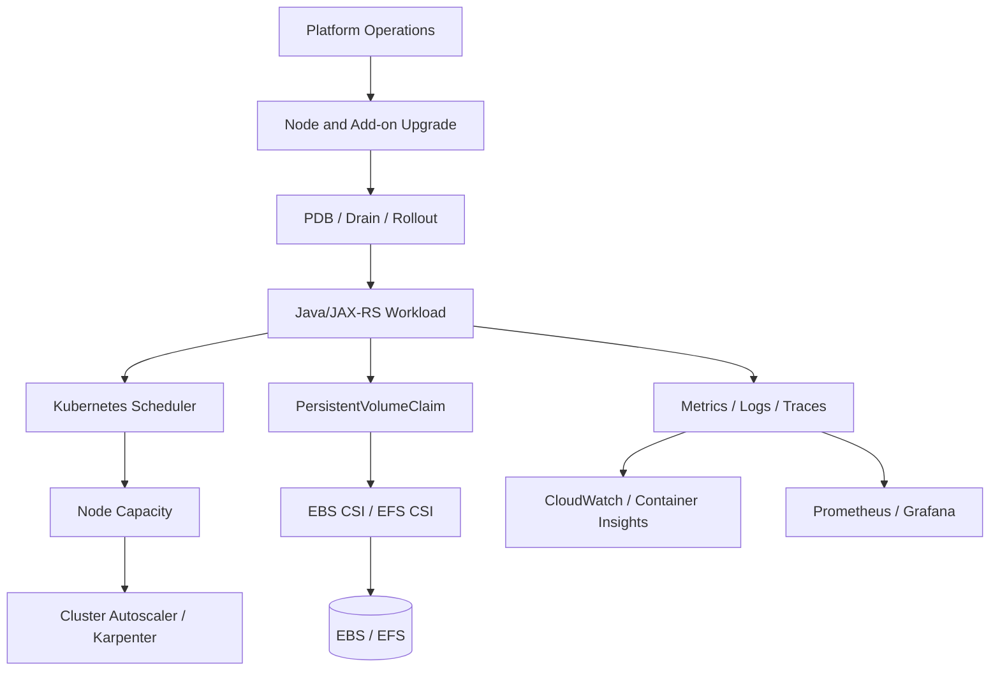
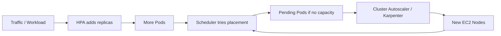
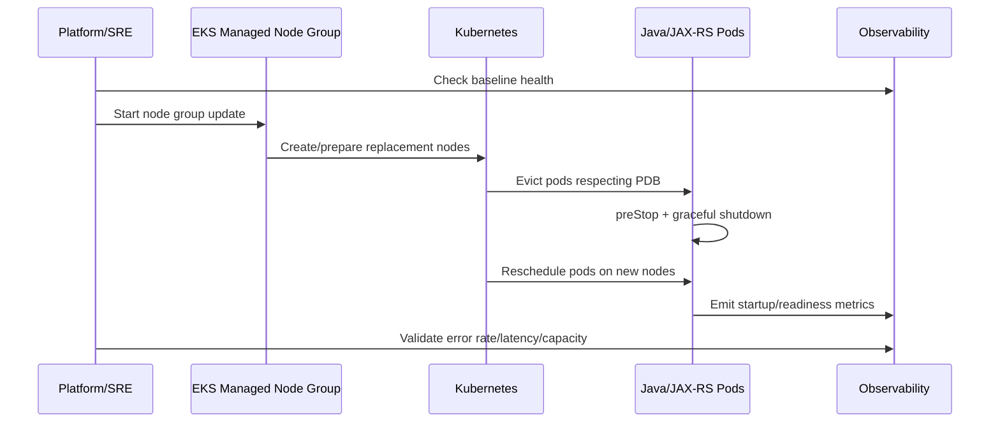

# Part 029 — EKS Storage, Autoscaling, and Operations

> Fokus part ini adalah memahami EKS sebagai platform operasi production, bukan sekadar tempat menjalankan pod. Setelah networking bekerja, problem berikutnya biasanya muncul dari storage lifecycle, node capacity, autoscaling, disruption, node upgrade, add-on drift, Spot interruption, missing metrics, dan runbook yang tidak jelas.

## 1. Mental Model: EKS Operations Is About Controlling Change

Di production, EKS bukan hanya Kubernetes managed control plane. EKS adalah kombinasi dari:

- Kubernetes API server yang dikelola AWS;
- EC2 node group atau Fargate profile;
- Amazon VPC CNI, CoreDNS, kube-proxy, dan add-on lain;
- IAM identity untuk controller dan workload;
- storage integration seperti EBS CSI dan EFS CSI;
- autoscaler seperti Cluster Autoscaler atau Karpenter;
- observability pipeline seperti CloudWatch Container Insights dan Prometheus;
- release process melalui Helm, GitOps, atau pipeline deployment;
- operational runbook untuk upgrade, rollback, capacity issue, dan incident.

Untuk senior backend engineer, pertanyaan pentingnya bukan “apakah cluster bisa menjalankan pod?”, tetapi:

- apa yang terjadi saat node diganti?
- apa yang terjadi saat volume pindah node?
- apa yang terjadi saat AZ tertentu penuh atau terganggu?
- apa yang terjadi saat pod tidak bisa dijadwalkan?
- apa yang terjadi saat autoscaler terlalu lambat?
- apa yang terjadi saat add-on version drift?
- apa yang terjadi saat registry, DNS, IAM, atau KMS terganggu?
- apa yang terjadi saat upgrade node mematikan terlalu banyak replica?



## 2. EKS Storage Is Not Just “Mount a Disk”

Kubernetes storage di EKS adalah kontrak antara beberapa layer:

| Layer | Pertanyaan |
|---|---|
| Application | Apakah service benar-benar butuh persistent storage? |
| Kubernetes | PVC, PV, StorageClass, access mode, reclaim policy, volume binding mode |
| CSI driver | Siapa yang provision, attach, mount, resize, snapshot? |
| AWS service | EBS, EFS, encryption, KMS, subnet/AZ, security group |
| Operations | Backup, restore, failover, expansion, cleanup, observability |

Untuk banyak backend Java/JAX-RS service, pilihan default seharusnya tetap **stateless**. Simpan durable data di PostgreSQL, object storage, Kafka/RabbitMQ, Redis managed service, atau Camunda database. Persistent volume di pod harus dianggap sebagai exception yang perlu alasan kuat.

Gunakan persistent volume di pod hanya jika:

- workload memang stateful;
- aplikasi membutuhkan local working directory yang survive restart;
- third-party component membutuhkan filesystem semantics;
- ada controller/operator yang memang dirancang stateful;
- lifecycle backup/restore sudah jelas.

Hindari persistent volume untuk:

- temporary upload file yang bisa langsung streaming ke S3/Blob;
- cache yang bisa di-rebuild;
- log file lokal;
- file exchange antar service;
- data penting tanpa backup dan restore drill.

## 3. EBS CSI Driver: Block Storage Untuk Single-Writer Workload

Amazon EBS CSI driver menyediakan integrasi EBS sebagai Kubernetes volume. Mental model utamanya:

- EBS adalah block storage;
- EBS volume berada di satu Availability Zone;
- umumnya dipakai sebagai `ReadWriteOnce`;
- volume harus attach ke node di AZ yang sama;
- scheduler harus memperhatikan volume topology;
- encryption dan KMS permission dapat memblokir attach/mount;
- snapshot dan restore adalah bagian dari backup design, bukan otomatis magic.

Contoh pola StorageClass EBS:

```yaml
apiVersion: storage.k8s.io/v1
kind: StorageClass
metadata:
  name: gp3-encrypted
provisioner: ebs.csi.aws.com
parameters:
  type: gp3
  encrypted: "true"
volumeBindingMode: WaitForFirstConsumer
allowVolumeExpansion: true
reclaimPolicy: Retain
```

Hal penting pada `volumeBindingMode: WaitForFirstConsumer`:

- volume dibuat setelah scheduler tahu pod akan ditempatkan di node/AZ mana;
- mengurangi risiko volume dibuat di AZ yang salah;
- penting untuk cluster multi-AZ.

### EBS Failure Modes

| Symptom | Kemungkinan akar masalah | Debug awal |
|---|---|---|
| PVC stuck `Pending` | StorageClass salah, CSI driver tidak sehat, permission kurang, quota EBS | `kubectl describe pvc`, event CSI, EKS add-on status |
| Pod stuck `ContainerCreating` | Volume attach/mount gagal | `kubectl describe pod`, kubelet logs, CSI node logs |
| Volume tidak bisa attach | Node beda AZ, volume masih attached, KMS denied | cek AZ node/PV, CloudTrail, EC2 volume status |
| Latency tinggi | IOPS/throughput kurang, noisy workload, filesystem issue | CloudWatch EBS metrics, app latency, node IO |
| Data hilang setelah delete | Reclaim policy `Delete`, backup tidak ada | cek PV reclaim policy, snapshot policy |

### EBS Design Checklist

- Gunakan EBS hanya untuk workload yang memang butuh block storage.
- Pastikan `StorageClass` punya `volumeBindingMode: WaitForFirstConsumer` untuk multi-AZ.
- Pastikan encryption dan KMS key policy benar.
- Pastikan backup/snapshot policy jelas.
- Pastikan reclaim policy sesuai risiko data.
- Pastikan pod punya PDB dan graceful shutdown jika workload stateful.
- Pastikan restore flow pernah diuji.

## 4. EFS CSI Driver: Shared Filesystem, Not Low-Latency Database

Amazon EFS CSI driver digunakan untuk mount EFS ke pod. EFS cocok untuk shared filesystem semantics:

- `ReadWriteMany`;
- beberapa pod bisa mount filesystem yang sama;
- workload yang butuh shared file path;
- file processing yang tidak cocok untuk object storage murni;
- legacy component yang butuh POSIX-like filesystem.

Namun EFS bukan pengganti PostgreSQL, Redis, Kafka, atau object storage.

Trade-off EFS:

| Aspek | Konsekuensi |
|---|---|
| Shared filesystem | Mudah untuk sharing file, tetapi concurrency correctness menjadi tanggung jawab aplikasi |
| Network filesystem | Latency lebih tinggi dari local disk/block storage |
| POSIX permission | UID/GID dan access point harus dikelola benar |
| Multi-AZ mount target | Network/security group harus benar per AZ |
| Throughput mode | Salah sizing dapat membuat throughput bottleneck |
| Cost | Storage, throughput, dan access pattern perlu diperiksa |

### Kapan EFS Masuk Akal

EFS masuk akal ketika:

- banyak replica harus membaca file konfigurasi/binary besar yang sama;
- ada shared workspace untuk batch-like process;
- aplikasi legacy butuh shared filesystem;
- operator stateful component memang mendukung EFS;
- latency filesystem tidak berada di request path kritis.

EFS berisiko ketika:

- dipakai untuk transactional data;
- dipakai sebagai message queue;
- dipakai untuk high-QPS low-latency access;
- dipakai tanpa file locking/concurrency model yang jelas;
- dipakai untuk menyimpan PII tanpa access/audit/encryption review.

## 5. Persistent Storage Impact to Java/JAX-RS Services

Aplikasi Java/JAX-RS sering terlihat stateless, tetapi diam-diam membuat state lokal melalui:

- upload temp file;
- generated reports;
- export/import staging file;
- local cache;
- embedded workflow file;
- local log file;
- certificate/key material;
- downloaded external artifacts.

Production rule:

> Treat local filesystem as disposable unless explicitly designed otherwise.

Implikasi desain:

- file upload besar sebaiknya streaming ke object storage, bukan ditahan di heap;
- temporary file harus punya cleanup policy;
- local cache harus rebuildable;
- pod restart tidak boleh menghilangkan business-critical state;
- volume mount path harus jelas ownership dan permission-nya;
- aplikasi harus handle `IOException`, disk full, permission denied, dan mount unavailable;
- readiness probe sebaiknya tidak hanya mengecek HTTP port, tetapi juga dependency penting jika service tidak bisa berfungsi tanpa volume.

## 6. Autoscaling Mental Model

Autoscaling di EKS terjadi di beberapa level:

| Level | Mekanisme | Apa yang diskalakan |
|---|---|---|
| Application replicas | HPA | jumlah pod |
| Resource recommendation | VPA | request/limit rekomendasi atau update |
| Node capacity | Cluster Autoscaler | jumlah node dalam node group/ASG |
| Node provisioning | Karpenter | node baru sesuai kebutuhan pod |
| AWS infrastructure | EC2 Auto Scaling / capacity pool | instance capacity |

Jangan campur mental model:

- HPA menambah pod, bukan node.
- Cluster Autoscaler/Karpenter menambah node, bukan memperbaiki aplikasi lambat.
- Autoscaler bereaksi terhadap resource request dan scheduling pressure, bukan business throughput secara langsung.
- Jika request/limit salah, autoscaler juga akan mengambil keputusan salah.



## 7. Cluster Autoscaler vs Karpenter

### Cluster Autoscaler

Cluster Autoscaler bekerja dengan node group/Auto Scaling Group. Ia cocok ketika:

- node group sudah jelas;
- instance type relatif stabil;
- organisasi ingin kontrol node group eksplisit;
- capacity model sederhana;
- cluster maturity belum siap untuk provisioning yang lebih dinamis.

Kelemahannya:

- fleksibilitas instance lebih terbatas;
- scaling bisa lambat jika node group tidak cocok;
- perlu desain node group yang baik;
- overprovisioning sering terjadi jika ukuran node terlalu kasar.

### Karpenter

Karpenter melihat pending pod dan memprovision node berdasarkan requirement workload. Ia cocok ketika:

- workload beragam;
- ingin provisioning lebih cepat dan fleksibel;
- ingin bin-packing lebih efisien;
- ingin memakai banyak instance family;
- ingin Spot/On-Demand strategy yang lebih dinamis.

Risikonya:

- policy NodePool/EC2NodeClass harus direview ketat;
- salah constraint bisa membuat node mahal atau tidak sesuai compliance;
- disruption/consolidation policy harus aman;
- observability autoscaler harus matang;
- perlu ownership jelas antara platform dan app team.

### Decision Heuristic

| Kondisi | Lebih cocok |
|---|---|
| Node pool sederhana dan stabil | Cluster Autoscaler |
| Workload variatif dan butuh fleksibilitas tinggi | Karpenter |
| Tim platform ingin kontrol eksplisit node group | Cluster Autoscaler |
| Fokus cost efficiency dan fast provisioning | Karpenter |
| Compliance membutuhkan instance class tertentu | Bisa keduanya, tetapi constraint harus eksplisit |

## 8. Resource Requests, Limits, and Java Runtime Reality

Autoscaling hanya sebaik input resource-nya. Untuk Java service, request/limit perlu memperhitungkan:

- JVM heap;
- metaspace;
- thread stack;
- direct buffer;
- Netty/HTTP client buffer jika digunakan;
- TLS buffer;
- connection pool;
- temporary object allocation;
- GC behavior;
- sidecar overhead;
- log agent overhead.

Contoh anti-pattern:

```yaml
resources:
  requests:
    cpu: "50m"
    memory: "256Mi"
  limits:
    cpu: "500m"
    memory: "512Mi"
```

Untuk service enterprise dengan JAX-RS, SDK cloud, database pool, Kafka/RabbitMQ client, Redis client, tracing agent, dan JSON serialization, nilai seperti itu bisa terlalu optimistis.

Yang perlu diperiksa:

- apakah heap diset sesuai container memory?
- apakah `MaxRAMPercentage` dikontrol?
- apakah CPU limit menyebabkan throttling?
- apakah HPA memakai CPU, memory, RPS, latency, atau custom metric?
- apakah pod request terlalu kecil sehingga node overpacked?
- apakah pod limit terlalu ketat sehingga OOMKill?

## 9. Node Group Upgrade and Pod Disruption

Upgrade node group bukan sekadar mengganti AMI. Dampaknya:

- node baru dibuat;
- pod lama di-drain;
- workload dipindah;
- PDB menentukan berapa banyak pod boleh unavailable;
- readiness/liveness probe menentukan kapan pod dianggap siap;
- connection draining menentukan apakah request lama selesai;
- Kafka consumer rebalance bisa terjadi;
- database connection pool bisa spike;
- Camunda workers bisa kehilangan lock jika shutdown buruk;
- NGINX ingress bisa kehilangan endpoint sementara.

### Safe Node Upgrade Flow



### PDB Example

```yaml
apiVersion: policy/v1
kind: PodDisruptionBudget
metadata:
  name: quote-api-pdb
spec:
  minAvailable: 2
  selector:
    matchLabels:
      app: quote-api
```

PDB bukan pengganti replica count. Jika service hanya punya satu replica, `minAvailable: 1` dapat memblokir voluntary disruption, tetapi tetap tidak membuat service highly available.

## 10. Add-On Upgrade Discipline

EKS add-on seperti VPC CNI, CoreDNS, kube-proxy, EBS CSI, dan observability agent adalah bagian dari production dependency graph.

Risiko add-on drift:

- bug networking tidak terpatch;
- version compatibility dengan Kubernetes tertinggal;
- behavior berubah saat upgrade mendadak;
- IP allocation issue;
- DNS issue;
- storage provisioning issue;
- metrics/log ingestion issue.

Checklist sebelum add-on upgrade:

- cek compatibility matrix dengan Kubernetes version;
- cek release notes;
- cek breaking changes;
- cek IAM permission baru;
- cek Helm/add-on managed ownership;
- cek canary cluster atau non-prod;
- cek dashboard baseline;
- siapkan rollback path;
- dokumentasikan expected change.

## 11. Spot Node Awareness

Spot node dapat mengurangi biaya, tetapi tidak boleh dipakai tanpa disruption model.

Cocok untuk:

- stateless workloads;
- batch workers idempotent;
- async consumers dengan retry;
- non-critical background processors;
- horizontally scalable services.

Berisiko untuk:

- singleton service;
- stateful workload tanpa replication;
- latency-critical API tanpa cukup On-Demand capacity;
- workload dengan long-running non-idempotent transaction;
- worker yang tidak handle graceful shutdown.

Aplikasi Java harus siap menerima termination:

- handle SIGTERM;
- stop menerima request baru;
- drain in-flight request;
- commit/rollback transaction dengan jelas;
- close database/broker/Redis connections;
- release Camunda/external task lock jika relevan;
- expose shutdown metrics.

## 12. Observability: CloudWatch Container Insights and Prometheus

EKS operations membutuhkan observability minimal:

- node CPU/memory/disk/network;
- pod CPU/memory/restart/OOMKill;
- pending pod count;
- HPA status;
- autoscaler decision logs;
- PVC/PV status;
- CSI driver errors;
- CoreDNS latency/error;
- VPC CNI IP usage;
- ALB/NLB target health;
- application error rate/latency;
- JVM GC/thread/memory metrics;
- database/broker/Redis client metrics.

CloudWatch Container Insights berguna untuk AWS-native metrics/log aggregation. Prometheus/Grafana berguna untuk Kubernetes-native dan application-level metric exploration. Banyak organisasi memakai keduanya: CloudWatch untuk platform/cloud integration, Prometheus untuk service-level metric dan SLO.

### Minimum Dashboard Untuk EKS Production

- cluster health;
- node capacity;
- pod restart/OOMKill;
- pending pods;
- autoscaler activity;
- VPC CNI IP capacity;
- CoreDNS health;
- ingress/load balancer health;
- application p95/p99 latency;
- error rate;
- JVM memory/GC;
- DB/broker/Redis dependency latency;
- log ingestion health.

## 13. EKS Operational Runbook

### Daily/Weekly Review

- cek node readiness;
- cek pending pods;
- cek restart count dan OOMKill;
- cek storage PVC/PV anomalies;
- cek autoscaler errors;
- cek add-on version drift;
- cek subnet IP utilization;
- cek cost anomaly;
- cek certificate/secret expiry;
- cek error budget burn.

### Before Production Deployment

- verify image digest/tag;
- verify resource request/limit;
- verify HPA/PDB;
- verify readiness/liveness/startup probe;
- verify config/secret availability;
- verify IAM role/IRSA;
- verify NetworkPolicy/security group requirement;
- verify log/metric/tracing;
- verify rollback strategy;
- verify database migration impact.

### During Incident

- freeze non-essential changes;
- identify scope: app, node, cluster, AWS service, network, identity, storage;
- compare baseline vs current metrics;
- inspect events before logs;
- check pod status and node status;
- check recent deployment/GitOps sync/IaC changes;
- check AWS health and service-specific metrics;
- rollback only when rollback target is known-good;
- document timeline.

## 14. Impact to PostgreSQL, Kafka, RabbitMQ, Redis, Camunda, and NGINX

### PostgreSQL

EKS node churn can cause connection storms. Java services need:

- bounded connection pools;
- startup backoff;
- readiness probe that avoids marking pod ready before DB pool is usable;
- graceful shutdown to close connections;
- migration job isolation.

### Kafka/RabbitMQ

Pod rescheduling can trigger:

- Kafka consumer group rebalance;
- message redelivery;
- duplicate processing;
- RabbitMQ consumer reconnect;
- backpressure during node replacement.

Consumers must be idempotent and shutdown-aware.

### Redis

Redis clients may see:

- connection reset;
- reconnect storm;
- timeout spike;
- cache stampede after many pods restart.

Use bounded retry, jitter, and cache stampede protection.

### Camunda

Workflow workers need:

- graceful shutdown;
- lock extension awareness;
- idempotent handlers;
- clear retry strategy;
- metrics for acquired/failed/locked jobs.

### NGINX Ingress

Ingress pods need:

- enough replicas;
- PDB;
- node spread;
- readiness probe;
- connection draining;
- metrics for 499/502/503/504.

## 15. Common Failure Modes

| Failure | Typical Signal | Likely Root Cause | First Debug Step |
|---|---|---|---|
| Pod pending | `0/n nodes available` | insufficient CPU/memory, taints, node selector, volume topology | `kubectl describe pod` |
| PVC pending | PVC events | CSI/StorageClass/quota/permission | `kubectl describe pvc` |
| Volume mount fail | `ContainerCreating` stuck | EBS AZ mismatch, KMS denied, CSI issue | pod events + CSI logs |
| OOMKill | restart count, exit code 137 | memory limit too low, heap config wrong | pod status + JVM metrics |
| CPU throttling | latency spike | CPU limit too tight | container CPU throttling metric |
| Autoscaler not scaling | pending pods stay pending | request/taint/node group/Karpenter constraint | autoscaler logs |
| Node upgrade outage | replica unavailable | no PDB, bad readiness, too few replicas | deployment + PDB + events |
| Spot interruption impact | sudden pod loss | workload not disruption-tolerant | node events + app logs |
| Missing logs | gap in CloudWatch | agent issue, IAM, log config | Fluent Bit/agent logs |
| Missing metrics | dashboard blank | Container Insights/Prometheus scrape issue | agent status + scrape target |

## 16. Production-Safe Debugging Commands

```bash
# Cluster and node health
kubectl get nodes -o wide
kubectl describe node <node-name>

# Workload health
kubectl get pods -A -o wide
kubectl describe pod <pod-name> -n <namespace>
kubectl get events -A --sort-by=.metadata.creationTimestamp

# Storage
kubectl get sc,pv,pvc -A
kubectl describe pvc <pvc-name> -n <namespace>
kubectl logs -n kube-system -l app=ebs-csi-controller
kubectl logs -n kube-system -l app=efs-csi-controller

# Autoscaling
kubectl get hpa -A
kubectl describe hpa <hpa-name> -n <namespace>
kubectl get pdb -A
kubectl describe pdb <pdb-name> -n <namespace>

# Scheduling pressure
kubectl get pods -A --field-selector=status.phase=Pending
kubectl describe pod <pending-pod> -n <namespace>

# Add-ons
kubectl get pods -n kube-system
kubectl describe deployment coredns -n kube-system
```

Production-safe rule:

> Observe first, mutate later. Do not delete pods, scale deployments, or patch node groups before you understand blast radius and rollback path.

## 17. PR Review Checklist

For any PR or change touching EKS storage/autoscaling/operations, ask:

- Does this workload really need persistent volume?
- Is the storage class explicit?
- Is volume AZ behavior understood?
- Is encryption/KMS permission handled?
- Is backup/restore defined?
- Are resource requests realistic for Java runtime?
- Are limits safe or likely to cause throttling/OOM?
- Is HPA based on meaningful metrics?
- Does autoscaler have matching node capacity?
- Does workload have enough replicas?
- Is PDB configured correctly?
- Does shutdown handle SIGTERM?
- Are readiness/liveness/startup probes correct?
- Is Spot usage safe for this workload?
- Are logs, metrics, and traces present?
- Is rollback tested?
- Are operational owners clear?

## 18. Internal Verification Checklist

Verify with platform/SRE/DevOps/security/backend team:

- EBS CSI driver version and ownership.
- EFS CSI driver usage, if any.
- Approved StorageClass list.
- Default reclaim policy.
- Volume encryption and KMS key policy.
- Snapshot/backup policy.
- Restore drill evidence.
- Cluster Autoscaler or Karpenter usage.
- Karpenter NodePool/EC2NodeClass constraints if used.
- Managed node group upgrade process.
- Add-on upgrade process.
- PodDisruptionBudget standard.
- Spot node usage policy.
- Node drain and maintenance window procedure.
- CloudWatch Container Insights setup.
- Prometheus/Grafana setup.
- Alert rules for pending pods, OOMKill, node not ready, PVC pending, CoreDNS errors, and autoscaler failures.
- EKS operational runbook.
- Incident notes involving node upgrade, storage, autoscaling, or missing observability.

## 19. Key Takeaways

- EKS production quality depends heavily on storage, autoscaling, node lifecycle, disruption handling, and observability.
- EBS is AZ-bound block storage; EFS is shared network filesystem. They solve different problems.
- Java services must be designed for graceful shutdown, realistic resource requests, bounded connection pools, and restart-safe behavior.
- Autoscaling depends on resource requests and scheduling signals. Bad requests produce bad scaling decisions.
- Node upgrades and Spot interruptions are normal operational events, not rare exceptions.
- Observability must include cluster, node, pod, storage, autoscaler, ingress, JVM, and dependency metrics.
- Internal runbook and ownership are as important as the Kubernetes YAML.

## 20. References

- AWS Documentation — Use Kubernetes volume storage with Amazon EBS: `https://docs.aws.amazon.com/eks/latest/userguide/ebs-csi.html`
- AWS Documentation — Use elastic file system storage with Amazon EFS: `https://docs.aws.amazon.com/eks/latest/userguide/efs-csi.html`
- AWS Documentation — Scale cluster compute with Karpenter and Cluster Autoscaler: `https://docs.aws.amazon.com/eks/latest/userguide/autoscaling.html`
- AWS Documentation — Simplify node lifecycle with managed node groups: `https://docs.aws.amazon.com/eks/latest/userguide/managed-node-groups.html`
- AWS Documentation — Update a managed node group: `https://docs.aws.amazon.com/eks/latest/userguide/update-managed-node-group.html`
- AWS Documentation — CloudWatch Container Insights: `https://docs.aws.amazon.com/AmazonCloudWatch/latest/monitoring/ContainerInsights.html`
