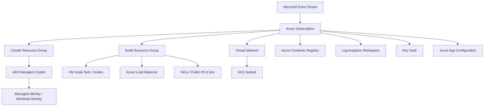
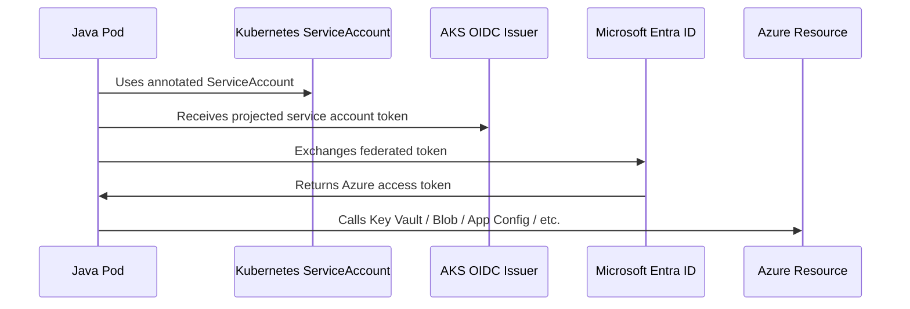

# Part 030 — AKS Foundation

> Fokus part ini adalah membangun mental model Azure Kubernetes Service sebagai managed Kubernetes platform untuk Java/JAX-RS backend. AKS bukan hanya “Kubernetes di Azure”. Ia membawa resource group, subscription, managed identity, VM scale set, VNet/subnet, ACR, Azure Monitor, Azure Policy, private cluster, add-on, dan lifecycle operasi Azure.

## 1. What AKS Is

Azure Kubernetes Service adalah managed Kubernetes service di Azure. Azure mengelola banyak bagian control plane, sedangkan tim platform/application tetap bertanggung jawab atas workload, node pool, networking, identity, security posture, add-on, observability, upgrade, dan deployment practice.

Untuk backend engineer, AKS harus dilihat sebagai platform runtime untuk:

- Java/JAX-RS microservices;
- REST APIs behind ingress/API gateway;
- async workers consuming Kafka/RabbitMQ/Event Hubs-compatible endpoints;
- services calling PostgreSQL, Redis, Blob Storage, Key Vault, App Configuration, and internal APIs;
- Kubernetes-native deployment using Helm/GitOps;
- enterprise networking through VNet, private endpoint, firewall, DNS, and hybrid connectivity.

AKS mengurangi beban mengelola Kubernetes control plane, tetapi tidak menghapus tanggung jawab engineering untuk:

- resource requests/limits;
- rollout safety;
- workload identity;
- network reachability;
- secret/config integration;
- observability;
- incident response;
- cost and capacity;
- upgrade compatibility.

## 2. AKS Resource Boundary Mental Model

Satu AKS cluster biasanya menyentuh banyak Azure boundary:



Hal yang sering membingungkan:

- **Cluster resource group** menyimpan AKS managed cluster resource.
- **Node resource group** berisi resource infrastruktur yang dibuat/dikelola AKS, seperti VMSS, NIC, load balancer, managed disks, dan public IP jika ada.
- **Subscription** adalah billing/governance/security boundary penting.
- **Resource group** adalah lifecycle/ownership grouping, bukan security boundary utama.
- **VNet/subnet** dapat dibuat oleh platform team dan dipakai oleh AKS.
- **Managed identity** menentukan apa yang dapat dilakukan AKS terhadap Azure resources.

## 3. AKS Control Plane vs Data Plane

| Area | Dikelola oleh Azure | Tetap perlu dikelola tim |
|---|---|---|
| Kubernetes control plane | API server/control plane availability | version lifecycle, private/public endpoint decision, RBAC integration |
| Nodes | VMSS integration, node image support | node pool sizing, upgrade, taints, labels, autoscaling |
| Networking | Azure network integration primitives | VNet/subnet planning, NSG/UDR, ingress, DNS, private endpoint |
| Identity | Managed identity primitives | role assignment, workload identity, least privilege |
| Observability | Azure Monitor integration options | log/metric coverage, dashboard, alert, SLO |
| Security | Azure features/policies | workload hardening, image policy, secret handling, network exposure |

Backend engineer perlu memahami boundary ini agar tidak salah eskalasi. Misalnya, 503 dari Application Gateway bukan otomatis masalah AKS control plane; bisa jadi readiness probe, backend pool, NSG, route table, pod crash, atau service selector.

## 4. Node Pools: System and User Separation

AKS memakai node pool. Dua kategori penting:

- **System node pool** untuk system-critical pods seperti CoreDNS dan cluster components.
- **User node pool** untuk application workloads.

Production design sebaiknya memisahkan:

- system workloads;
- stateless API workloads;
- async worker workloads;
- memory-heavy workloads;
- spot workloads;
- privileged/platform workloads;
- GPU/specialized workloads jika ada.

Contoh konsep node pool:

```yaml
nodePools:
  - name: system
    mode: System
    vmSize: Standard_D4s_v5
    minCount: 3
    maxCount: 5
    purpose: cluster-system

  - name: api
    mode: User
    vmSize: Standard_D8s_v5
    minCount: 3
    maxCount: 20
    purpose: java-jaxrs-api

  - name: workers
    mode: User
    vmSize: Standard_D8s_v5
    minCount: 2
    maxCount: 30
    purpose: async-workers
```

Node pool design memengaruhi:

- blast radius;
- upgrade sequencing;
- autoscaling;
- cost;
- pod scheduling;
- security boundary;
- workload isolation;
- capacity reservation;
- availability zone placement.

## 5. VM Scale Set Under the Hood

AKS node pools umumnya direpresentasikan oleh Azure VM Scale Sets. Artinya node lifecycle memiliki Azure infrastructure layer:

- VM image;
- node OS SKU;
- VM size;
- autoscaling;
- disk;
- NIC;
- availability zones;
- upgrade and repair;
- node image version.

Kubernetes melihat node sebagai worker node, tetapi Azure melihatnya sebagai VMSS instances. Saat debugging, Anda sering harus menghubungkan dua view:

| Kubernetes view | Azure view |
|---|---|
| Node NotReady | VM instance unhealthy, network issue, disk pressure, kubelet issue |
| Pod pending | node pool capacity/taint/resource shortage |
| ImagePullBackOff | ACR auth/network/registry issue |
| LoadBalancer service pending | Azure Load Balancer/Public IP/permission/quota issue |
| PVC attach fail | Azure Disk/Files/CSI/identity/zone issue |

## 6. AKS Networking Foundation Preview

Detail networking akan dibahas di Part 031. Untuk foundation, pahami dulu pilihan besar:

- Azure CNI;
- kubenet awareness;
- Azure CNI powered by Cilium if used;
- VNet/subnet planning;
- pod IP behavior;
- NSG;
- UDR;
- Azure Load Balancer;
- Application Gateway/AGIC;
- private cluster;
- private endpoint;
- Azure DNS/Private DNS.

AKS networking tidak boleh diputuskan belakangan. Subnet sizing, private endpoint, ingress model, firewall path, dan DNS strategy memengaruhi aplikasi sejak awal.

Untuk Java/JAX-RS service, networking memengaruhi:

- inbound API path;
- outbound call ke Key Vault/App Configuration/Blob/PostgreSQL/Redis;
- DNS resolution;
- TLS validation;
- timeout behavior;
- source IP visibility;
- private vs public exposure;
- egress cost and control.

## 7. AKS Identity Model

AKS modern sangat bergantung pada managed identity dan workload identity.

Ada beberapa identity yang perlu dibedakan:

| Identity | Digunakan untuk |
|---|---|
| Cluster managed identity | AKS resource operations terhadap Azure resources |
| Kubelet identity | Pull image dari ACR dan operasi node-level tertentu |
| Workload identity | Pod mendapatkan token federated untuk mengakses Azure services |
| Service principal legacy | Model lama, masih mungkin ada di cluster lama |
| User identity | Human/operator access via Entra ID + Kubernetes RBAC |

### Managed Identity

Managed identity menghindari static secret untuk Azure resource access. Untuk AKS, managed identity dapat dipakai oleh cluster dan komponen Azure yang terkait.

Masalah umum:

- role assignment belum diberikan;
- role diberikan di scope yang salah;
- identity yang dipakai bukan identity yang diasumsikan;
- propagation delay setelah role assignment;
- terlalu banyak permission karena memakai Contributor luas;
- audit sulit karena naming buruk.

### Workload Identity

Azure Workload Identity memungkinkan pod menggunakan federated credential untuk mengakses Azure resources melalui Azure SDK tanpa static client secret.

Flow mental model:



Senior engineer harus bisa menjawab:

- ServiceAccount mana yang dipakai pod?
- Federated credential menunjuk ke subject yang benar?
- Managed identity/client ID mana yang dipakai?
- Role assignment ada di scope yang benar?
- Azure SDK credential chain memilih credential yang benar?
- Token audience benar?
- Audit log menunjukkan principal yang diharapkan?

## 8. ACR Integration

Azure Container Registry adalah registry umum untuk image AKS. Integrasi AKS dengan ACR biasanya dilakukan dengan permission agar kubelet/node identity dapat pull image.

Failure mode umum:

| Symptom | Kemungkinan akar masalah |
|---|---|
| `ImagePullBackOff` | ACR permission kurang, image tag salah, private endpoint/DNS issue, registry unavailable |
| `ErrImagePull` | image tidak ada, auth gagal, network unreachable |
| deployment pakai image lama | tag mutable, digest tidak dipin, cache behavior |
| image pull lambat | image terlalu besar, network path, registry region |
| security finding terlambat | scanning tidak diwajibkan sebelum promotion |

Production rule:

> Prefer immutable image digest for production release, and treat tag as human-friendly label, not source of truth.

## 9. Cluster Endpoint: Public, Private, and Operational Access

AKS cluster endpoint dapat memiliki public/private access pattern tergantung setup. Private cluster mengurangi public exposure, tetapi menambah requirement:

- operator harus punya network path ke private endpoint;
- CI/CD runner harus bisa mencapai API server;
- DNS resolution harus benar;
- break-glass access harus dirancang;
- incident response tidak boleh bergantung pada laptop yang tidak punya route.

Pertanyaan review:

- Apakah cluster API server public atau private?
- Jika public, apakah authorized IP ranges dibatasi?
- Jika private, bagaimana pipeline dan operator mengaksesnya?
- Apakah DNS private endpoint resolve benar?
- Apakah ada runbook saat VPN/ExpressRoute bermasalah?

## 10. AKS Add-Ons and Platform Components

AKS cluster biasanya memakai beberapa add-on/integrasi:

- Azure Monitor Container Insights;
- Azure Policy for AKS;
- Key Vault Secrets Store CSI Driver;
- Application Gateway Ingress Controller jika digunakan;
- Azure CNI/Cilium dataplane jika digunakan;
- workload identity webhook;
- CSI drivers for Azure Disk and Azure Files;
- cluster autoscaler;
- ingress controller;
- service mesh jika ada.

Add-on harus punya:

- owner;
- version policy;
- upgrade path;
- compatibility matrix;
- observability;
- rollback plan;
- security review.

Jangan biarkan add-on menjadi “invisible production dependency”.

## 11. AKS Storage Foundation Preview

Detail storage akan dibahas di Part 032, tetapi foundation-nya:

| Storage | Cocok untuk | Catatan |
|---|---|---|
| Azure Disk CSI | block storage, single-writer stateful workload | zone and attach semantics matter |
| Azure Files CSI | shared filesystem | latency/concurrency/security review needed |
| Blob Storage | object/binary/document/export/import | usually accessed via SDK or CSI only with clear reason |
| EmptyDir | temporary per-pod data | lost on pod removal |

Java/JAX-RS service sebaiknya tidak bergantung pada local filesystem kecuali jelas.

## 12. AKS Observability Foundation

Minimum observability untuk AKS:

- Azure Monitor Container Insights;
- Log Analytics workspace;
- Kubernetes events;
- node/pod CPU/memory/restart metrics;
- ingress/load balancer metrics;
- application logs with correlation ID;
- JVM metrics;
- HTTP latency and error rate;
- dependency metrics for PostgreSQL/Redis/Kafka/RabbitMQ/Blob/Key Vault/App Configuration;
- alerting for failed rollout, pending pod, OOMKill, node not ready, image pull failure, and ingress 5xx.

Untuk production, observability harus menjawab:

- apakah incident ada di app, node, cluster, network, identity, atau dependency?
- apakah impact terbatas ke namespace/service tertentu?
- apakah baru terjadi setelah deployment, scale event, node upgrade, atau policy change?
- apakah error berasal dari Azure service, DNS, private endpoint, or app code?

## 13. AKS Lifecycle: Version, Node Image, and Upgrade

AKS lifecycle melibatkan:

- Kubernetes version;
- node image version;
- node OS SKU;
- add-on version;
- Azure CNI/network plugin;
- workload compatibility;
- API deprecation;
- PDB and rollout safety;
- maintenance window;
- rollback/mitigation plan.

Upgrade bukan hanya platform concern. Backend engineer perlu memeriksa:

- deprecated Kubernetes API di manifest;
- readiness/liveness probe behavior;
- PDB;
- resource request/limit;
- Java shutdown handling;
- migration job safety;
- broker consumer behavior during rescheduling;
- ingress route stability;
- observability during upgrade.

## 14. Impact to Java/JAX-RS Backend

AKS foundation memengaruhi Java service dalam beberapa cara langsung:

### Runtime Identity

Jika service mengambil secret dari Key Vault, config dari App Configuration, atau file dari Blob Storage, credential chain harus sesuai workload identity/managed identity.

### Networking

Private endpoint, DNS, NSG, UDR, and firewall path menentukan apakah SDK call berhasil.

### Deployment

Readiness probe harus mencerminkan service readiness yang benar. Jangan menandai pod ready jika dependency mandatory belum usable.

### Shutdown

Node upgrade dan scaling akan mengirim SIGTERM. Service harus:

- stop menerima request baru;
- drain in-flight request;
- close DB/broker/Redis clients;
- flush telemetry;
- release locks;
- finish or safely abort background jobs.

### Resource Sizing

JVM memory needs must include heap and non-heap. Memory limit yang terlalu kecil menyebabkan OOMKill; CPU limit terlalu ketat dapat menyebabkan throttling dan p99 latency naik.

## 15. Impact to PostgreSQL, Kafka/RabbitMQ, Redis, Camunda, and NGINX

### PostgreSQL

AKS pod restart/scale event dapat membuat connection storm. Gunakan bounded pool, startup jitter, and migration isolation.

### Kafka/RabbitMQ

Consumer rebalance/redelivery harus dianggap normal. Worker harus idempotent, shutdown-aware, dan punya retry/backoff.

### Redis

Cache stampede dapat terjadi setelah rollout besar. Gunakan jitter, bounded retry, and sensible TTL.

### Camunda

Job/external task workers harus handle lock expiry, duplicate execution, and graceful shutdown.

### NGINX/Ingress

Ingress harus punya enough replicas, PDB, node spread, and clear timeout configuration.

## 16. Common AKS Foundation Failure Modes

| Failure | Typical Signal | Likely Root Cause | First Debug Step |
|---|---|---|---|
| Pod cannot pull image | `ImagePullBackOff` | ACR permission, wrong tag, private endpoint/DNS | `kubectl describe pod`, ACR role assignment |
| Pod cannot call Key Vault | 403/credential error | workload identity/federated credential/RBAC scope issue | inspect ServiceAccount, Azure Activity Log |
| Pod pending | scheduler event | node pool capacity, taint, resource request, subnet IP | `kubectl describe pod` |
| LoadBalancer service stuck | external IP pending | Azure LB permission/quota/subnet issue | service events + Azure resource state |
| Cluster access fails | kubectl cannot connect | private endpoint/DNS/VPN/firewall/authorized IP | resolve endpoint + network path |
| Sudden 5xx after node update | pods drained too fast | no PDB, bad readiness, low replicas | deployment/PDB/events |
| Missing logs | no Log Analytics data | agent/add-on/IAM/workspace config issue | Container Insights agent logs |
| Azure SDK uses wrong identity | unexpected 403 | DefaultAzureCredential selects unintended source | app startup logs + identity env vars |

## 17. Production-Safe Debugging Commands

```bash
# Cluster and node view
kubectl get nodes -o wide
kubectl describe node <node-name>

# Workloads
kubectl get pods -A -o wide
kubectl describe pod <pod-name> -n <namespace>
kubectl get events -A --sort-by=.metadata.creationTimestamp

# Service and ingress
kubectl get svc -A
kubectl describe svc <service-name> -n <namespace>
kubectl get ingress -A
kubectl describe ingress <ingress-name> -n <namespace>

# Identity
kubectl get serviceaccount -n <namespace>
kubectl describe serviceaccount <sa-name> -n <namespace>

# Rollout safety
kubectl get deploy,statefulset,daemonset -A
kubectl get hpa,pdb -A
kubectl rollout status deployment/<deployment-name> -n <namespace>
```

Azure-side checks usually require Azure CLI or Portal access:

```bash
# AKS cluster basics
az aks show --resource-group <rg> --name <cluster>

# Node pools
az aks nodepool list --resource-group <rg> --cluster-name <cluster> -o table

# ACR access check
az acr show --name <acr-name>

# Role assignment examples
az role assignment list --assignee <principal-id> --scope <scope>
```

Do not mutate production cluster before confirming ownership and rollback path.

## 18. AKS Foundation PR Review Checklist

For AKS-related PR/ADR, ask:

- Which subscription and resource group are affected?
- Which AKS cluster and namespace are affected?
- Is this using system or user node pool?
- Are node selectors, taints, and tolerations intentional?
- Are resource requests realistic for Java runtime?
- Are readiness/liveness/startup probes correct?
- Is HPA/PDB configured?
- Does the workload use managed identity/workload identity correctly?
- Does it need access to ACR, Key Vault, Blob, App Configuration, PostgreSQL, Redis, Kafka/RabbitMQ?
- Are RBAC role assignments least privilege and scoped correctly?
- Is network path private or public?
- Are logs/metrics/traces available?
- Is rollback safe?
- Is there an operational owner?

## 19. Internal Verification Checklist

Verify with platform/SRE/DevOps/security/backend team:

- AKS cluster names and environments.
- Azure subscription and management group structure.
- Cluster resource group and node resource group naming.
- AKS Kubernetes version and support policy.
- Node pool layout: system/user/spot/specialized.
- VM sizes and autoscaling settings.
- Azure CNI/kubenet/Cilium mode.
- VNet/subnet ownership.
- Cluster endpoint mode: public/private.
- Authorized IP ranges if public endpoint is used.
- ACR integration and image pull identity.
- Managed identity and kubelet identity.
- Workload identity setup and standard annotation pattern.
- Azure RBAC/Kubernetes RBAC model.
- Azure Monitor and Log Analytics workspace.
- Key Vault CSI Driver usage.
- Azure Policy for AKS usage.
- Ingress model: NGINX, AGIC, Application Gateway, or other.
- Upgrade process and maintenance window.
- Incident notes involving AKS cluster, ACR, identity, endpoint access, or node pool upgrade.

## 20. Key Takeaways

- AKS is Azure-managed Kubernetes, but production responsibility still spans workload, node pool, identity, network, observability, security, and lifecycle.
- Understand Azure resource boundaries: subscription, resource group, node resource group, VNet, subnet, identity, and Log Analytics.
- Node pool design is a production architecture decision, not a default checkbox.
- Managed identity and workload identity are central to secretless access from Java services to Azure resources.
- ACR integration, private endpoint, DNS, and RBAC are common sources of image pull and SDK access failures.
- Private cluster improves exposure posture but requires serious access planning for CI/CD and incident response.
- Backend engineers must understand enough AKS foundation to review PRs, debug production, and ask the right platform questions.

## 21. References

- Microsoft Learn — What is Azure Kubernetes Service: `https://learn.microsoft.com/en-us/azure/aks/what-is-aks`
- Microsoft Learn — Managed identities in AKS: `https://learn.microsoft.com/en-us/azure/aks/managed-identity-overview`
- Microsoft Learn — AKS network best practices: `https://learn.microsoft.com/en-us/azure/aks/operator-best-practices-network`
- Microsoft Learn — Configure kubenet networking in AKS: `https://learn.microsoft.com/en-us/azure/aks/configure-kubenet`
- Microsoft Learn — Azure CNI powered by Cilium in AKS: `https://learn.microsoft.com/en-us/azure/aks/azure-cni-powered-by-cilium`
- Microsoft Learn — Supported Kubernetes versions in AKS: `https://learn.microsoft.com/en-us/azure/aks/supported-kubernetes-versions`
