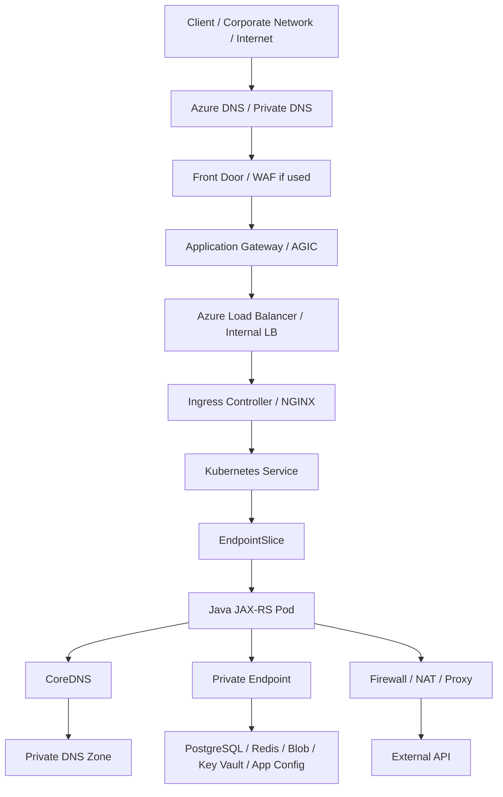
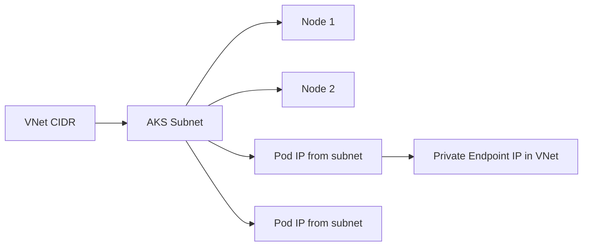
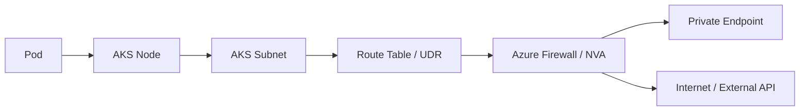
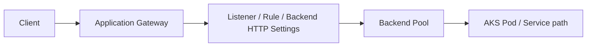
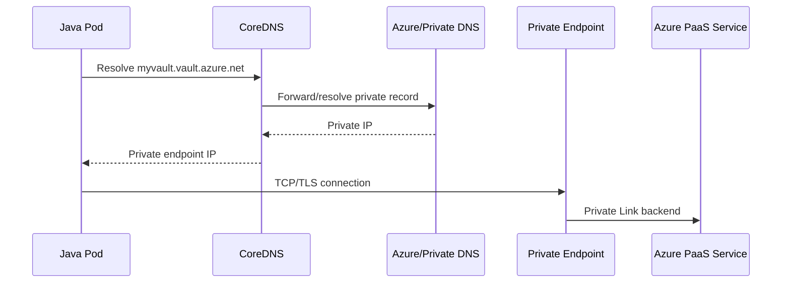
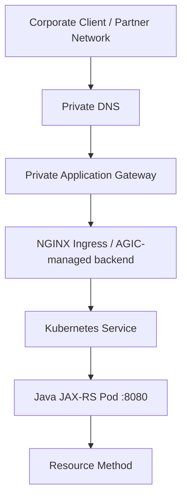
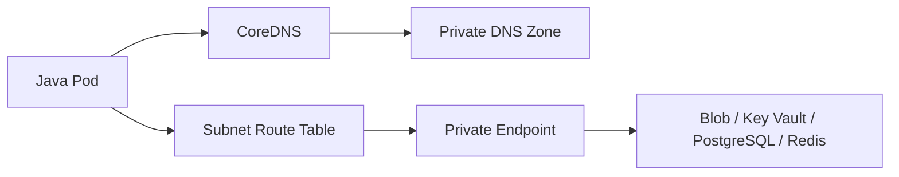
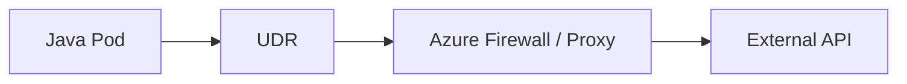

# Part 031 — AKS Networking

> Fokus part ini adalah memahami AKS networking sebagai gabungan antara Kubernetes networking model dan Azure networking model. Untuk senior Java/JAX-RS backend engineer, tujuan utamanya bukan menghafal opsi network plugin, tetapi mampu membaca traffic path, mengenali boundary VNet/subnet/NSG/UDR/private endpoint, men-debug 502/503/504/DNS/TLS/timeout, dan mereview perubahan networking sebelum menjadi production incident.

## 1. Core Mental Model

AKS networking adalah tempat bertemunya empat lapisan:

1. **Kubernetes networking**: Pod, Service, EndpointSlice, Ingress, NetworkPolicy, CoreDNS.
2. **Azure networking**: VNet, subnet, NSG, UDR, Azure Load Balancer, Application Gateway, Private Endpoint, Private DNS Zone.
3. **Platform integration**: AKS-managed resources, node resource group, managed identity, CNI, ingress controller, observability add-ons.
4. **Application behavior**: Java HTTP client timeout, JDBC connection pool, Kafka/RabbitMQ client bootstrap, Redis client reconnect, SDK credential/token call, TLS truststore, correlation header.

Jika satu request gagal, jangan langsung menyimpulkan “AKS error”. Failure bisa terjadi di:

- DNS record;
- private DNS zone link;
- Application Gateway listener/rule/probe;
- Azure Load Balancer backend pool;
- NSG rule;
- UDR ke firewall;
- pod readiness;
- service selector;
- EndpointSlice kosong;
- NetworkPolicy deny;
- Java thread pool saturation;
- TLS certificate mismatch;
- private endpoint approval/DNS mismatch.

## 2. AKS Network Building Blocks



AKS networking harus selalu dibaca dari dua arah:

- **Inbound**: client → DNS → edge/WAF/gateway → load balancer → ingress → service → pod.
- **Outbound**: pod → DNS → route table → NSG/firewall/NAT/private endpoint → dependency.

Banyak engineer hanya memeriksa inbound path. Dalam enterprise system, outbound path ke database, broker, object storage, Key Vault, App Configuration, and third-party APIs sering lebih sering menjadi akar masalah.

## 3. Azure CNI, kubenet, and Overlay Awareness

AKS dapat berjalan dengan beberapa model networking. Jangan menyimpulkan model cluster tanpa verifikasi.

### 3.1 Azure CNI

Dengan Azure CNI classic/node-subnet style, pod mendapatkan IP dari Azure VNet/subnet. Konsekuensinya:

- pod terlihat sebagai alamat di VNet;
- routing ke resource Azure/private endpoint lebih natural;
- NSG/UDR/firewall design perlu mempertimbangkan pod address space;
- subnet harus cukup besar untuk node + pod capacity;
- IP exhaustion dapat membuat pod gagal schedule walaupun node CPU/memory masih cukup.

Mental model:



### 3.2 Azure CNI Overlay

Azure CNI Overlay memisahkan pod CIDR dari VNet subnet. Ini membantu IP address management karena pod tidak langsung menghabiskan VNet subnet IP sebanyak model traditional Azure CNI.

Konsekuensi yang harus dipahami:

- pod-to-pod communication memakai overlay address space;
- node tetap punya IP dari VNet;
- traffic keluar cluster dapat terlihat berbeda dari Azure CNI classic;
- network policy, observability, and troubleshooting perlu memahami overlay path;
- jangan menyamakan “pod IP from VNet” dengan semua AKS cluster.

### 3.3 kubenet Awareness

kubenet adalah model lama/legacy di banyak konteks AKS. Masih mungkin ditemui di cluster existing. Ia biasanya memerlukan routing behavior yang berbeda dibanding Azure CNI.

Prinsip senior engineer:

- jangan refactor network policy, subnet, atau private endpoint assumption tanpa tahu network plugin;
- jangan copy manifest/annotation ingress dari cluster lain tanpa memeriksa network plugin;
- jangan mendiagnosis IP exhaustion sebelum tahu apakah pod IP berasal dari VNet subnet atau overlay CIDR.

## 4. Subnet IP Planning

Subnet planning adalah desain kapasitas, bukan hanya angka CIDR.

Yang harus dihitung:

- jumlah node minimum dan maksimum;
- jumlah pod maksimum per node;
- system pod overhead;
- surge capacity saat upgrade;
- blue/green deployment atau parallel rollout;
- cluster autoscaler headroom;
- node pool tambahan di masa depan;
- private endpoint subnet terpisah;
- Application Gateway subnet jika digunakan;
- firewall subnet jika memakai Azure Firewall;
- reserved IP Azure pada tiap subnet.

Contoh kesalahan umum:

```text
Node pool max: 50 nodes
Max pod per node: 30 pods
Pod IP needed: 1,500+
Subnet planned: /24
Result: scheduling failure under scale or upgrade surge
```

Untuk Java/JAX-RS service, subnet yang terlalu kecil dapat muncul sebagai:

- pod stuck Pending;
- rollout tidak selesai;
- HPA scale out gagal;
- node pool scale out berhasil tetapi pod tetap tidak dapat IP;
- service dianggap tidak ready lalu ingress mengembalikan 503.

## 5. NSG: Network Security Group

NSG adalah filtering layer di Azure network. Ia dapat diterapkan di subnet atau NIC. Dalam konteks AKS, NSG sering berada pada subnet node/pod atau resource terkait.

Hal yang perlu dipahami:

- NSG bekerja di Azure network layer, bukan Kubernetes layer;
- NetworkPolicy bekerja di Kubernetes/pod layer;
- NSG deny dapat memblokir traffic bahkan jika Kubernetes Service/Ingress benar;
- NSG allow terlalu luas dapat membuka blast radius;
- rule priority penting;
- service tag dapat membantu, tetapi harus direview security team.

Contoh failure:

| Symptom | Possible NSG root cause |
|---|---|
| Pod cannot reach PostgreSQL private endpoint | Outbound subnet rule blocked |
| Application Gateway 502/503 | AppGw subnet cannot reach backend/pod/node path |
| AKS node cannot pull image | outbound to ACR blocked or private endpoint DNS/routing broken |
| Health probe failing | probe source not allowed |
| On-prem client cannot call private ingress | inbound from corporate CIDR blocked |

## 6. UDR and Forced Tunneling

User Defined Route menentukan next hop untuk traffic subnet. Enterprise environment sering menggunakan UDR untuk memaksa outbound traffic melewati firewall, NVA, atau hub network.

UDR penting karena dapat mengubah real traffic path:



Failure mode UDR:

- default route `0.0.0.0/0` diarahkan ke firewall tetapi firewall belum allow dependency;
- return path asymmetric;
- private endpoint route kalah prioritas dengan forced tunneling assumption;
- DNS diarahkan ke private IP tetapi route ke private endpoint tidak benar;
- firewall TLS inspection memecahkan SDK/TLS validation;
- Azure platform service endpoint/private endpoint behavior tidak dipahami.

## 7. Azure Load Balancer in AKS

Kubernetes `Service type: LoadBalancer` di AKS biasanya membuat Azure Load Balancer resource di node resource group.

Contoh manifest konseptual:

```yaml
apiVersion: v1
kind: Service
metadata:
  name: quote-order-internal-api
  annotations:
    service.beta.kubernetes.io/azure-load-balancer-internal: "true"
spec:
  type: LoadBalancer
  selector:
    app: quote-order-api
  ports:
    - name: http
      port: 80
      targetPort: 8080
```

Hal yang perlu direview:

- public atau internal load balancer;
- frontend IP;
- subnet placement;
- health probe;
- backend pool;
- source IP preservation requirement;
- NSG rule;
- quota;
- ownership resource di node resource group;
- apakah service harus exposed via LoadBalancer atau cukup ClusterIP behind ingress.

Untuk Java/JAX-RS backend, jangan membuka service LoadBalancer langsung jika traffic seharusnya melewati API gateway, WAF, atau ingress policy.

## 8. Application Gateway and AGIC

Application Gateway adalah L7 load balancer/reverse proxy Azure. AGIC, jika digunakan, menghubungkan Kubernetes Ingress dengan Application Gateway configuration.

Traffic model:



Hal yang perlu dipahami:

- listener menerima host/path;
- rule menentukan routing;
- backend setting menentukan protocol, port, timeout, probe;
- health probe menentukan apakah backend dianggap sehat;
- WAF policy bisa block request sebelum mencapai pod;
- TLS bisa terminate di Application Gateway, ingress, pod, atau kombinasi;
- AGIC dapat mengubah konfigurasi App Gateway berdasarkan Ingress.

Failure mode umum:

| Symptom | Possible root cause |
|---|---|
| 502 Bad Gateway | backend unhealthy, wrong port, TLS mismatch, probe failure |
| 403 WAF | WAF managed/custom rule blocked request |
| 404 | listener/path rule mismatch or ingress host mismatch |
| Timeout | backend response longer than App Gateway timeout |
| Works via pod port-forward but fails via AppGw | ingress/service/probe/NSG/AppGw config issue |

## 9. Azure Front Door Awareness

Azure Front Door dapat berada di depan Application Gateway/APIM/ingress untuk global edge, routing, acceleration, WAF, atau failover.

Backend engineer tidak harus mengelola Front Door, tetapi harus tahu dampaknya:

- header forwarding;
- client IP header;
- TLS termination chain;
- WAF false positive;
- caching behavior jika enabled;
- timeout behavior;
- global failover behavior;
- health probe from edge;
- custom domain and certificate renewal.

Jika production traffic melewati Front Door, debugging harus mulai dari edge telemetry, bukan hanya pod log.

## 10. DNS in AKS Networking

AKS DNS melibatkan beberapa resolver dan zone:

- Kubernetes CoreDNS untuk service discovery internal;
- Azure DNS untuk public/private Azure records;
- Private DNS Zone untuk private endpoint;
- custom DNS server jika hub/spoke atau hybrid;
- on-prem DNS forwarding jika corporate client mengakses private API.

Pod-to-private-service flow:



Debug mindset:

- `nslookup`/`dig` dari laptop tidak cukup; resolve dari pod;
- DNS hasil public vs private harus dibandingkan;
- Private DNS Zone harus linked ke VNet yang benar;
- custom DNS server harus bisa resolve AKS/private endpoint records;
- CoreDNS health harus dicek;
- TTL dapat membuat failover/cutover terlihat lambat;
- wrong CNAME chain dapat mengarah ke public endpoint.

## 11. Private Cluster and Private Endpoint

Private AKS cluster berarti API server tidak terbuka public seperti cluster biasa. Akses ke control plane melalui private endpoint/private DNS path.

Hal yang berubah:

- admin/operator access harus melalui network yang bisa resolve dan reach private API server;
- CI/CD runner harus berada di network yang benar atau memakai private connectivity;
- GitOps controller yang berjalan di dalam cluster biasanya tetap dapat beroperasi;
- emergency access perlu runbook jelas;
- DNS untuk API server private FQDN menjadi critical dependency.

Jangan menyamakan:

- **private AKS cluster**: control plane endpoint private;
- **private ingress/API**: application endpoint private;
- **private endpoint to PaaS**: pod mengakses Azure service via private IP;
- **private DNS**: nama resolve ke private IP.

Keempatnya berbeda dan dapat gagal secara independen.

## 12. Private Endpoint from AKS Workloads

Untuk dependencies seperti PostgreSQL Flexible Server, Redis, Blob Storage, Key Vault, App Configuration, atau ACR, private endpoint pattern biasanya melibatkan:

- private endpoint resource;
- subnet khusus private endpoint;
- Private DNS Zone;
- VNet link;
- NSG/firewall rule;
- SDK endpoint configuration;
- TLS hostname tetap menggunakan public FQDN yang resolve ke private IP.

Prinsip penting:

> Private endpoint bukan berarti aplikasi memakai URL berbeda. Sering kali hostname tetap sama, tetapi DNS internal mengarah ke private IP.

Untuk Java service:

- jangan hardcode private IP;
- gunakan FQDN resmi service;
- pastikan truststore menerima certificate hostname;
- pastikan timeout dan retry tidak menutupi DNS/routing failure;
- log dependency hostname, bukan secret/token.

## 13. NetworkPolicy in AKS

NetworkPolicy mengontrol traffic antar pod dan/atau egress pod tergantung engine dan plugin yang digunakan.

Gunakan NetworkPolicy untuk:

- membatasi service-to-service traffic;
- mencegah lateral movement;
- memisahkan namespace;
- membatasi egress ke dependency tertentu;
- membuat security posture eksplisit.

Tetapi jangan menganggap NetworkPolicy menggantikan:

- NSG;
- firewall;
- IAM/RBAC;
- API authentication;
- mTLS/JWT;
- private endpoint;
- secret management.

Minimal policy thinking:

```yaml
apiVersion: networking.k8s.io/v1
kind: NetworkPolicy
metadata:
  name: allow-ingress-from-nginx
spec:
  podSelector:
    matchLabels:
      app: quote-order-api
  policyTypes:
    - Ingress
  ingress:
    - from:
        - namespaceSelector:
            matchLabels:
              platform.csg.io/role: ingress
      ports:
        - protocol: TCP
          port: 8080
```

Checklist:

- Apakah cluster punya network policy provider?
- Apakah default deny diterapkan?
- Apakah DNS egress tetap diizinkan?
- Apakah health probe path tetap jalan?
- Apakah metrics scraping tetap jalan?
- Apakah Kafka/RabbitMQ/PostgreSQL/Redis egress diizinkan?
- Apakah policy diuji di staging?

## 14. Inbound Traffic Flow to Java/JAX-RS Service

Typical private enterprise API flow:



Review questions:

- Where is TLS terminated?
- Is the backend protocol HTTP or HTTPS?
- Which layer injects `X-Forwarded-*` headers?
- Does the application trust forwarded headers safely?
- Are readiness and liveness endpoints separated?
- Is health probe path lightweight?
- Are timeout values aligned across layers?
- Are request body limits aligned?
- Are large file uploads routed through the correct path?

## 15. Outbound Traffic Flow from Java/JAX-RS Service

Typical pod-to-Azure-service flow:



Typical pod-to-external-service flow:



Impact ke Java/JAX-RS:

- DNS latency dapat muncul sebagai request latency;
- retry tanpa jitter dapat memperparah firewall/NAT/endpoint failure;
- TLS inspection dapat membuat handshake gagal;
- connection pool yang terlalu besar dapat menekan firewall/NAT SNAT capacity;
- SDK credential call ke Entra ID/metadata endpoint perlu egress path yang benar;
- proxy/NO_PROXY salah dapat membuat private endpoint dilewati secara tidak sengaja.

## 16. Impact to PostgreSQL, Kafka, RabbitMQ, Redis, Camunda, and NGINX

| Dependency | AKS networking concern |
|---|---|
| PostgreSQL | private endpoint DNS, connection pool, TLS, NSG, firewall, failover IP/DNS behavior |
| Kafka | bootstrap address, broker advertised listener, private DNS, firewall ports, client metadata refresh |
| RabbitMQ | AMQP/TLS port reachability, heartbeat timeout, cluster endpoint, DNS, firewall idle timeout |
| Redis | private endpoint, TLS, connection reuse, reconnect storm, AUTH/ACL, SNAT/ephemeral port pressure |
| Camunda | worker-to-engine/API path, long polling timeout, retry storm, private API, service identity |
| NGINX Ingress | service selector, EndpointSlice, upstream timeout, proxy body size, source IP headers, TLS chain |

The main rule: every dependency is both an application dependency and a network dependency.

## 17. Failure Modes

| Failure mode | Typical symptom | Detection | Likely fix path |
|---|---|---|---|
| Subnet IP exhaustion | Pods Pending | `kubectl describe pod`, Azure subnet IP usage | resize subnet/new subnet/node pool/network model review |
| NSG deny | timeout/refused | NSG flow logs, Network Watcher, firewall logs | adjust NSG with security review |
| UDR wrong next hop | private endpoint unreachable | effective routes, traceroute, Network Watcher | correct route table/firewall path |
| Private DNS not linked | public IP returned | `nslookup` from pod | link private zone to VNet/custom DNS forwarding |
| CoreDNS unhealthy | service DNS failure | CoreDNS logs, pod DNS timeout | fix CoreDNS resources/add-on/node pressure |
| App Gateway probe fail | 502/503 | backend health, probe logs | fix readiness path/port/protocol/NSG |
| NetworkPolicy deny | only some pod traffic blocked | policy audit, test pod | adjust policy and test DNS/health/metrics |
| TLS mismatch | handshake failure, 502 | ingress/AppGw logs, Java SSL exception | align hostname/cert/backend protocol |
| Egress firewall block | SDK/API timeout | firewall deny logs | allow dependency FQDN/IP/service tag via process |
| SNAT/port pressure | intermittent outbound timeout | Azure LB/NAT/firewall metrics | connection reuse/pool sizing/NAT design |

## 18. Production-Safe Debugging Commands

Use commands as read-only first.

```bash
# Pod/service/endpoint view
kubectl get pod -n <ns> -o wide
kubectl get svc -n <ns>
kubectl get endpointslice -n <ns>
kubectl describe svc <service> -n <ns>

# Ingress/application gateway controller hints
kubectl get ingress -n <ns>
kubectl describe ingress <ingress> -n <ns>

# DNS from inside cluster
kubectl run dns-debug --rm -it --image=busybox:1.36 --restart=Never -- nslookup <hostname>

# Connectivity from debug pod
kubectl run net-debug --rm -it --image=curlimages/curl --restart=Never -- sh
curl -vk https://<dependency-hostname>

# Network policy inventory
kubectl get networkpolicy -A

# Node placement and IPs
kubectl get nodes -o wide
kubectl describe node <node>
```

Azure-side read-only checks:

```bash
# Cluster network profile
az aks show -g <resource-group> -n <cluster> --query networkProfile

# Node resource group
az aks show -g <resource-group> -n <cluster> --query nodeResourceGroup -o tsv

# Subnet and route table
az network vnet subnet show -g <rg> --vnet-name <vnet> -n <subnet>
az network route-table route list -g <rg> --route-table-name <route-table>

# Private DNS zone links
az network private-dns link vnet list -g <dns-rg> -z <zone>

# Application Gateway backend health
az network application-gateway show-backend-health -g <rg> -n <appgw>
```

Do not change NSG, UDR, or ingress annotation directly in production without approval, diff, rollback plan, and blast-radius assessment.

## 19. PR Review Checklist

For any PR/ADR touching AKS networking, ask:

- Does it change public/private exposure?
- Does it create or modify LoadBalancer/Ingress/Application Gateway behavior?
- Does it require new NSG/firewall rule?
- Does it depend on Private DNS Zone or custom DNS forwarding?
- Does it change hostname, TLS, or certificate behavior?
- Does it change timeout/body size/header behavior across gateway/ingress/app?
- Does it increase pod count and therefore subnet/IP pressure?
- Does it introduce new egress dependency?
- Does it require NetworkPolicy update?
- Does it affect PostgreSQL/Kafka/RabbitMQ/Redis/Camunda connectivity?
- Is rollback safe?
- Are dashboards/logs available to debug failure?

## 20. Internal Verification Checklist

Verify internally before relying on assumptions:

- AKS network plugin: Azure CNI classic/node-subnet, Azure CNI overlay, kubenet, or Cilium-based configuration.
- VNet and subnet CIDR.
- Node pool subnet and private endpoint subnet.
- Pod CIDR/service CIDR/DNS service IP.
- Maximum pods per node.
- Current subnet IP utilization.
- NSG attached to subnet/NIC.
- UDR and next hop.
- Azure Firewall/NVA/proxy path.
- Public/private ingress model.
- Azure Load Balancer resources in node resource group.
- Application Gateway/AGIC usage.
- Azure Front Door/APIM usage if any.
- Private cluster setting.
- Private DNS Zone links.
- Custom DNS server/forwarder.
- NetworkPolicy provider and default deny posture.
- Private endpoint strategy for PostgreSQL, Redis, Blob, Key Vault, App Configuration, ACR.
- Observability: App Gateway logs, Azure LB metrics, NSG flow logs, firewall logs, AKS Container Insights, ingress logs.
- Incident notes related to DNS, 502/503/504, timeout, private endpoint, or IP exhaustion.

## 21. Minimal Production Readiness Standard

An AKS networking design is not production-ready unless:

- all inbound paths are drawn end-to-end;
- all outbound dependencies are listed with DNS, route, identity, port, and timeout;
- private endpoint DNS behavior is validated from pods;
- ingress/load balancer health checks are explicitly configured;
- subnet capacity covers scale-out and upgrade surge;
- NSG/UDR/firewall rules are reviewed by platform/security;
- NetworkPolicy behavior is tested if enabled;
- source IP/header semantics are understood;
- observability exists at edge, gateway, ingress, pod, and dependency layer;
- rollback path is documented.

## 22. Senior Engineer Summary

AKS networking is not just Kubernetes networking. It is Azure VNet/subnet/routing/security/private connectivity integrated with Kubernetes service discovery and application behavior. A good senior backend engineer can debug from `curl` error to DNS, from 503 to health probe, from Pending pod to subnet IP exhaustion, from SDK timeout to private endpoint DNS, and from “works locally” to firewall/proxy/TLS difference.

The production habit to build: every service endpoint must have a known DNS path, route path, security rule, identity model, timeout budget, observability signal, and rollback plan.
