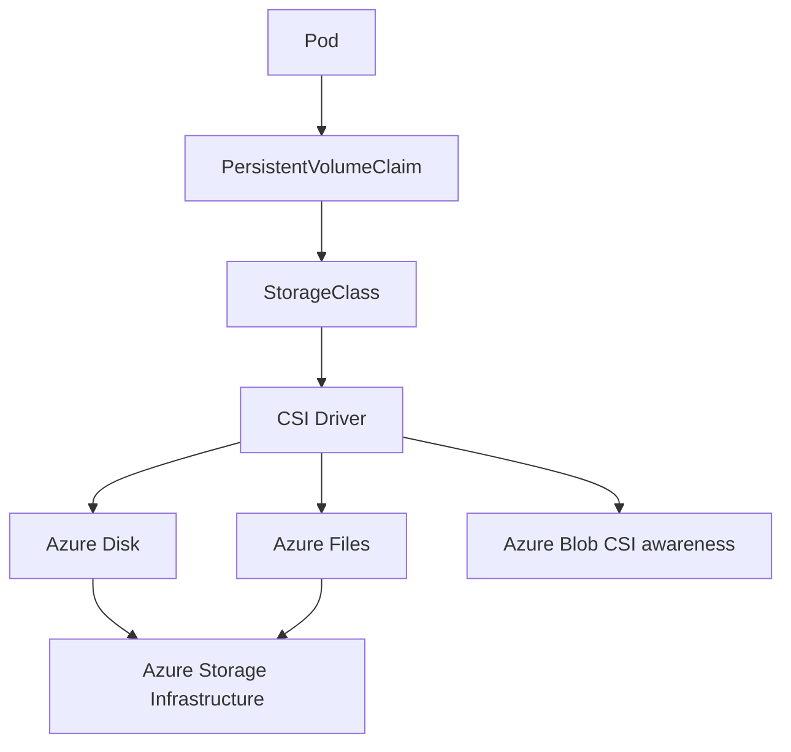
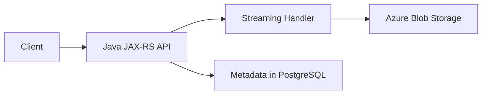
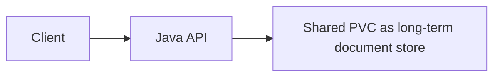
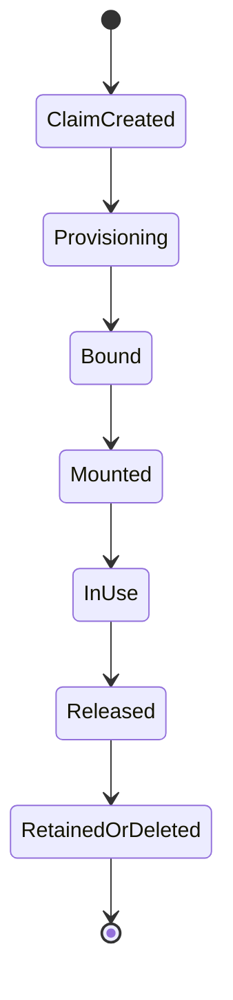
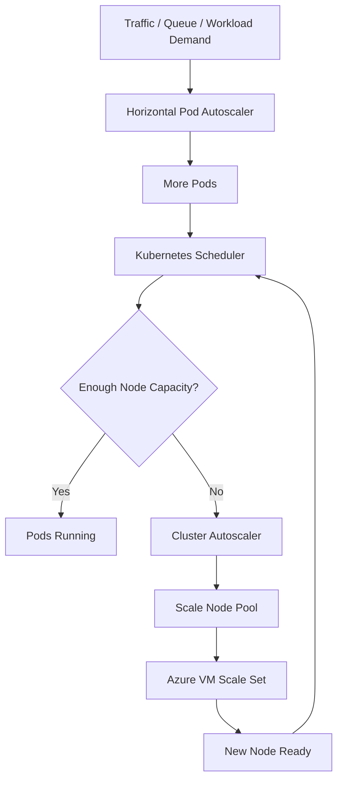
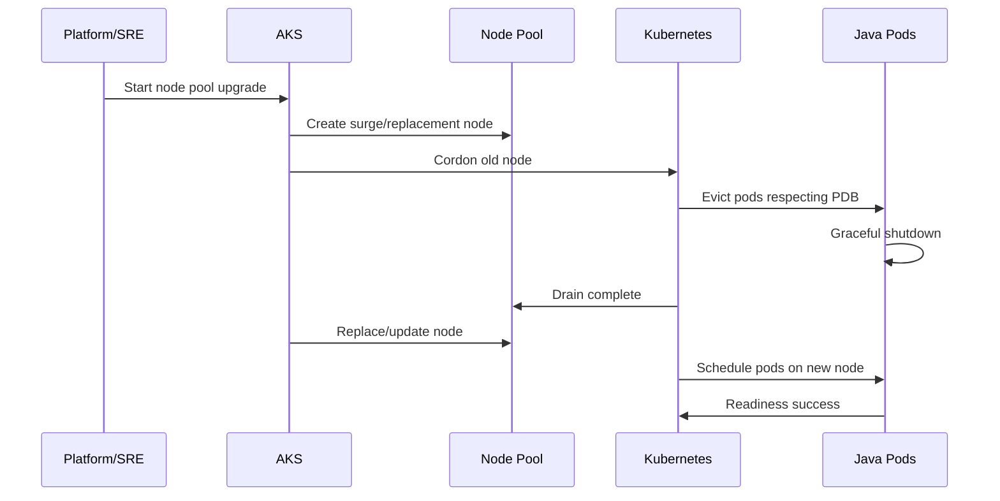
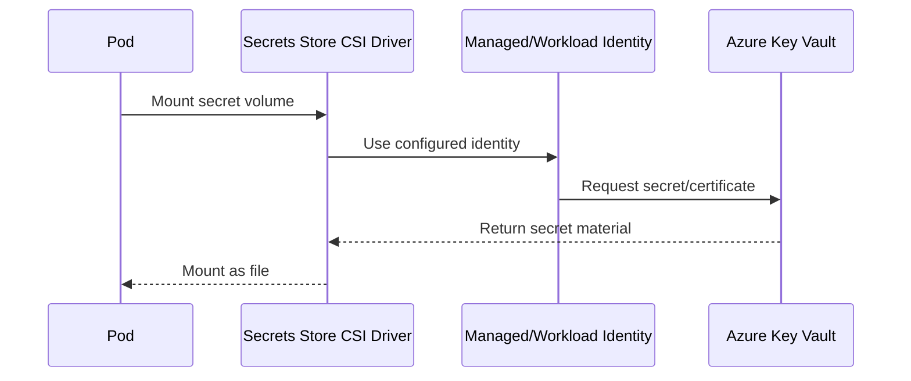

# Part 032 — AKS Storage, Autoscaling, and Operations

> Fokus part ini adalah mengoperasikan AKS secara production-grade dari sudut pandang senior Java/JAX-RS backend engineer: storage, autoscaling, node pool operation, upgrade, disruption control, observability, Key Vault CSI integration, and incident runbook. AKS bukan hanya tempat menjalankan pod. Ia adalah runtime yang harus dirawat agar rollout, scale-out, secret mount, persistent volume, monitoring, and upgrade tidak menjadi sumber outage.

## 1. Core Mental Model

AKS operations berada di antara tiga tanggung jawab:

1. **Azure-managed responsibility**: managed control plane, Azure integration, managed identities, platform primitives.
2. **Platform/SRE responsibility**: node pool, network, storage class, add-ons, monitoring, upgrade policy, policy-as-code, runbook.
3. **Application team responsibility**: resource request/limit, probes, graceful shutdown, PVC usage, retry behavior, logging, deployment safety, data correctness.

Backend engineer tidak harus menjadi AKS administrator penuh, tetapi harus mampu membaca dampak operational choices terhadap aplikasi:

- mengapa pod Pending;
- mengapa PVC tidak attach;
- mengapa rollout stuck saat node upgrade;
- mengapa autoscaler tidak menambah node;
- mengapa Key Vault secret mount gagal;
- mengapa log tidak muncul di Log Analytics;
- mengapa Spot node menyebabkan worker restart;
- mengapa Java service terkena OOMKilled atau CPU throttling;
- mengapa persistent storage choice salah untuk workload stateless.

## 2. AKS Storage Mental Model

Kubernetes storage terdiri dari beberapa lapisan:



Key objects:

- **Volume**: mount yang dipakai pod.
- **PersistentVolumeClaim**: request storage dari workload.
- **PersistentVolume**: storage yang diprovision untuk cluster.
- **StorageClass**: policy provisioning, performance, reclaim, binding, expansion.
- **CSI Driver**: interface Kubernetes ke Azure storage service.

Production rule:

> Jangan menggunakan persistent volume hanya karena aplikasi butuh menyimpan file sementara. Untuk Java/JAX-RS service, local temp file, object storage, database, and persistent volume memiliki semantics yang sangat berbeda.

## 3. Azure Disk CSI

Azure Disk CSI cocok untuk block storage yang attached ke node/pod. Biasanya digunakan untuk workload stateful yang membutuhkan disk single-writer.

Karakteristik penting:

- umumnya cocok untuk `ReadWriteOnce` pattern;
- attach ke node tertentu;
- zone awareness penting;
- pod rescheduling antar zone dapat gagal jika disk tidak tersedia di zone target;
- performance bergantung disk SKU/size/IOPS/throughput;
- snapshot/backup strategy harus jelas;
- reclaim policy menentukan nasib disk saat PVC dihapus.

Contoh konseptual StorageClass:

```yaml
apiVersion: storage.k8s.io/v1
kind: StorageClass
metadata:
  name: managed-csi-premium
provisioner: disk.csi.azure.com
parameters:
  skuName: Premium_LRS
reclaimPolicy: Retain
allowVolumeExpansion: true
volumeBindingMode: WaitForFirstConsumer
```

Review concern:

- `Retain` vs `Delete` sesuai data criticality?
- Apakah storage encrypted sesuai policy?
- Apakah volume expansion diizinkan?
- Apakah `WaitForFirstConsumer` digunakan agar scheduling mempertimbangkan topology?
- Apakah disk SKU cocok dengan latency/IOPS kebutuhan workload?
- Apakah ini seharusnya managed PostgreSQL/Redis/Object Storage, bukan disk di pod?

## 4. Azure Files CSI

Azure Files CSI cocok untuk shared file storage ketika beberapa pod/node perlu akses bersamaan.

Use case yang mungkin:

- shared document staging;
- legacy app requiring filesystem share;
- NGINX/static shared config tertentu;
- batch import/export temporary share;
- integration bridge dengan sistem lama.

Trade-off:

- network filesystem latency lebih tinggi daripada local disk;
- SMB/NFS semantics perlu dipahami;
- throughput/IOPS bergantung tier dan quota;
- file locking behavior dapat mengejutkan;
- credential/identity/security harus direview;
- jangan gunakan untuk hot path API jika object storage lebih sesuai.

Untuk Java/JAX-RS file upload/download, biasanya pattern yang lebih aman adalah:



Bukan:



Persistent volume tidak otomatis menjadi document management strategy.

## 5. StorageClass Review

StorageClass adalah policy decision. Jangan treat sebagai default teknis.

Review checklist:

- provisioner: Azure Disk, Azure Files, Blob CSI, or custom;
- reclaim policy: `Delete` atau `Retain`;
- volume binding mode;
- allow volume expansion;
- SKU/tier;
- zone redundancy/local redundancy;
- encryption/key requirement;
- backup/snapshot mechanism;
- ownership and cleanup;
- cost impact;
- quota impact;
- disaster recovery implications.

Failure dari StorageClass sering muncul jauh dari root cause. Misalnya, `PVC Pending` bisa terjadi karena storage quota, wrong provisioner, zone conflict, identity permission, or policy deny.

## 6. PersistentVolume Lifecycle

Lifecycle dasar:



Critical questions:

- Jika namespace dihapus, apakah volume ikut hilang?
- Jika release gagal, siapa yang cleanup disk/file share?
- Jika pod pindah node/zone, apakah volume bisa attach?
- Jika restore diperlukan, bagaimana PVC baru dibuat dari backup/snapshot?
- Jika data corrupt, apakah aplikasi punya consistency guard?

Untuk stateful workload, storage lifecycle adalah data lifecycle. Jangan biarkan IaC/Helm uninstall menghapus data production tanpa explicit protection.

## 7. What Should Be Stateful in AKS?

Untuk enterprise Java/JAX-RS systems, default bias sebaiknya:

- stateless API in AKS;
- database as managed PostgreSQL where possible;
- broker as managed/self-managed with explicit operational ownership;
- file/document in object storage;
- secrets in Key Vault;
- config in App Configuration/ConfigMap depending sensitivity;
- PVC only when workload truly needs filesystem semantics.

PVC cocok jika:

- workload stateful memang didesain untuk Kubernetes;
- backup/restore tested;
- rescheduling behavior understood;
- volume topology understood;
- operator/runbook exists;
- data loss risk accepted and mitigated.

PVC anti-pattern jika:

- dipakai sebagai cache yang bisa hilang tetapi diberi Retain mahal;
- dipakai sebagai database tanpa HA/backup;
- dipakai sebagai document store padahal Blob Storage lebih tepat;
- dipakai untuk share mutable state antar stateless API pod;
- tidak punya owner cleanup.

## 8. Autoscaling Layers in AKS

AKS scaling terdiri dari beberapa layer:



Layer yang berbeda menjawab pertanyaan berbeda:

| Layer | Menjawab |
|---|---|
| HPA | Berapa pod dibutuhkan? |
| Cluster Autoscaler | Apakah perlu node tambahan untuk pod pending? |
| Node pool scaling | Berapa kapasitas maksimum/minimum pool? |
| KEDA if used | Apakah scaling berdasarkan queue/event/external metric? |
| JVM tuning | Apakah setiap pod benar-benar mampu memproses beban? |

Jangan menyalahkan Cluster Autoscaler jika HPA metric tidak muncul. Jangan menyalahkan HPA jika node pool max count sudah tercapai.

## 9. Cluster Autoscaler

Cluster Autoscaler menambah/mengurangi node berdasarkan scheduling pressure dan utilization.

Ia biasanya menambah node ketika ada pod Pending karena resource tidak cukup. Ia tidak menambah node hanya karena CPU aplikasi tinggi jika pod belum meminta scale-out.

Common failure modes:

| Symptom | Possible root cause |
|---|---|
| Pod Pending, no scale-out | autoscaler disabled, max node reached, quota reached, taint/toleration mismatch |
| Scale-out slow | VM provisioning delay, quota, image pull delay, subnet/IP capacity |
| Scale-down not happening | pods not evictable, PDB, local storage, system pod, utilization threshold |
| New node exists but pod not scheduled | node selector, affinity, taint, resource request too high |
| Autoscaler loops | bad requests/limits, fragmentation, competing node pools |

Production tuning concerns:

- min/max count per node pool;
- resource requests accuracy;
- node pool labels/taints;
- PDB blocking scale-down;
- spot vs regular pool;
- quota and subnet capacity;
- rollout surge and upgrade surge;
- log/metric visibility for autoscaler decisions.

## 10. Node Pool Scaling and Isolation

Node pool design should map to workload classes:

```yaml
nodePools:
  - name: system
    mode: System
    purpose: cluster-system
  - name: api
    mode: User
    purpose: latency-sensitive-jaxrs-api
  - name: workers
    mode: User
    purpose: kafka-rabbitmq-camunda-workers
  - name: batch
    mode: User
    purpose: scheduled-batch-jobs
  - name: spot
    mode: User
    purpose: interruptible-noncritical-workloads
```

Reasons to separate node pools:

- system pods should not compete with heavy API pods;
- API and worker workloads have different CPU/memory/latency profiles;
- upgrades can be sequenced;
- taints/tolerations can protect critical workloads;
- spot nodes can be limited to interruptible workloads;
- cost attribution improves;
- blast radius shrinks.

For Java services, avoid mixing:

- latency-sensitive APIs;
- long-running consumers;
- CPU-heavy export jobs;
- memory-heavy batch processing;
- platform controllers;
- system add-ons.

## 11. Resource Requests, Limits, and JVM Behavior

Autoscaling correctness depends on accurate requests.

For Java/JAX-RS pods:

- CPU request too low → noisy neighbor and throttling;
- CPU limit too strict → latency spikes due to throttling;
- memory request too low → scheduling overcommit;
- memory limit too low → OOMKilled;
- heap not container-aware/tuned → memory pressure;
- thread pool too large → CPU contention and connection storm;
- connection pool too large → database/broker/firewall pressure.

Operational rule:

> A pod that has no resource request is not production-shaped. A Java pod with arbitrary heap, arbitrary CPU limit, and arbitrary HPA target is a future incident.

Checklist:

- JVM max heap aligned with container memory limit;
- direct memory/metaspace/thread stack accounted;
- request reflects steady-state load;
- limit reflects safe burst or intentionally omitted CPU limit policy;
- HPA metric reflects real bottleneck;
- load test validates pod capacity;
- GC and thread metrics visible.

## 12. Node Pool Upgrade

AKS node pool upgrade is disruption management.

Upgrade touches:

- Kubernetes node version;
- node image;
- OS SKU;
- kubelet/container runtime;
- CNI/CSI/add-on compatibility;
- pod eviction;
- PDB;
- surge node capacity;
- subnet IP capacity;
- application graceful shutdown;
- rollout stability.

Simplified lifecycle:



Failure modes:

- PDB too strict blocks drain;
- no spare capacity;
- subnet lacks IP for surge;
- pod terminationGracePeriod too short;
- Java service ignores SIGTERM;
- readiness turns true before app dependencies ready;
- node selector prevents rescheduling;
- PVC cannot attach in new zone;
- old API version removed in new Kubernetes version.

## 13. Pod Disruption Budget

PDB protects availability during voluntary disruptions such as node drain.

Example:

```yaml
apiVersion: policy/v1
kind: PodDisruptionBudget
metadata:
  name: quote-order-api-pdb
spec:
  minAvailable: 2
  selector:
    matchLabels:
      app: quote-order-api
```

PDB is not a magic HA guarantee.

It only works if:

- replicas are sufficient;
- pods are spread across nodes/zones;
- readiness is accurate;
- node pool has enough capacity;
- rollout strategy is sane;
- service can tolerate losing one or more pods.

Bad PDB examples:

- `minAvailable: 1` with only one replica: blocks eviction.
- `maxUnavailable: 0`: often blocks operations.
- selector matches wrong pods: no protection or wrong protection.
- PDB exists but pods all on same node: still bad blast radius.

## 14. Spot Node Pool Awareness

Spot node pools can reduce cost for interruptible workloads. They are not appropriate for all Java services.

Good candidates:

- stateless batch workers;
- retryable async consumers;
- non-critical processing;
- preemptible cache warming;
- CI-like workloads;
- horizontally scalable tasks with idempotency.

Bad candidates:

- user-facing critical API without redundancy;
- long transactions;
- non-idempotent workers;
- single-instance schedulers;
- stateful workloads with local state;
- workloads with slow startup and no graceful cancellation.

For Kafka/RabbitMQ/Camunda workers on Spot:

- ensure idempotency;
- tune graceful shutdown;
- commit offsets/acks safely;
- avoid long uninterruptible processing;
- design retry/dead-letter strategy;
- expose interruption/restart metrics.

## 15. Azure Monitor Container Insights and Log Analytics

Observability in AKS commonly uses Azure Monitor Container Insights and Log Analytics workspace.

Telemetry categories:

- pod/container logs;
- node metrics;
- container CPU/memory;
- restart count;
- Kubernetes events;
- inventory metadata;
- controller health;
- cluster/node capacity;
- Azure resource metrics;
- application logs if routed correctly.

Production review questions:

- Are application logs structured JSON?
- Is correlation ID included?
- Are Kubernetes events retained long enough?
- Are logs separated by namespace/environment/service?
- Are noisy debug logs controlled?
- Is log ingestion cost monitored?
- Are alerts based on actionable symptoms?
- Can incident responders query by deployment version?
- Can you correlate App Gateway 502 with pod readiness failure?

Example KQL ideas:

```kusto
ContainerLogV2
| where NamespaceName == "quote-order"
| where PodName startswith "quote-order-api"
| where LogMessage has "ERROR"
| project TimeGenerated, PodName, ContainerName, LogMessage
| order by TimeGenerated desc
```

```kusto
KubePodInventory
| where Namespace == "quote-order"
| summarize Restarts=sum(ContainerRestartCount) by Name, ClusterName
| order by Restarts desc
```

## 16. Key Vault CSI Driver

Key Vault CSI Driver allows pods to mount secrets/certificates from Azure Key Vault through CSI volumes.

Mental model:



Benefits:

- avoids hardcoding secrets in image;
- can reduce static Kubernetes Secret usage;
- integrates with Key Vault audit;
- supports certificate mount patterns;
- can support rotation depending configuration.

Risks:

- mount failure blocks pod startup;
- identity/role assignment wrong;
- Key Vault private endpoint DNS broken;
- secret rotation not reflected as app expects;
- app reads secret once at startup and never reloads;
- mounted file accidentally logged/read by wrong process;
- syncing to Kubernetes Secret reintroduces secret exposure.

For Java apps:

- prefer reload-aware configuration for certificates/secrets where required;
- do not log mounted file content;
- ensure file permission and path are explicit;
- design fallback carefully; do not silently use stale credential forever;
- expose startup failure clearly.

## 17. Operational Runbook: PVC Pending

Symptoms:

- pod stuck Pending;
- event says PVC not bound;
- event mentions provisioner failure;
- volume attach/mount timeout.

Read-only steps:

```bash
kubectl get pvc -n <ns>
kubectl describe pvc <pvc> -n <ns>
kubectl get storageclass
kubectl describe storageclass <storageclass>
kubectl get events -n <ns> --sort-by=.lastTimestamp
kubectl describe pod <pod> -n <ns>
```

Check:

- storage class exists;
- CSI driver pods healthy;
- Azure Disk/File quota;
- identity permission;
- zone/topology conflict;
- reclaim policy;
- policy-as-code denial;
- node availability.

Do not delete PVC in production unless data owner confirms impact.

## 18. Operational Runbook: Pod Pending Due to Capacity

Read-only steps:

```bash
kubectl describe pod <pod> -n <ns>
kubectl get nodes -o wide
kubectl top nodes
kubectl get events -A --sort-by=.lastTimestamp
kubectl get pdb -n <ns>
kubectl get hpa -n <ns>
```

Azure checks:

```bash
az aks nodepool list -g <rg> --cluster-name <cluster> -o table
az aks show -g <rg> -n <cluster> --query networkProfile
az vm list-usage -l <region> -o table
```

Likely causes:

- CPU/memory request too high;
- node pool max reached;
- quota reached;
- subnet IP exhaustion;
- taint/toleration mismatch;
- node selector mismatch;
- affinity too strict;
- PVC topology conflict;
- autoscaler disabled.

## 19. Operational Runbook: Upgrade Blocked

Symptoms:

- node drain stuck;
- upgrade never completes;
- pods stuck Terminating;
- replicas unavailable;
- PDB violation.

Read-only steps:

```bash
kubectl get nodes
kubectl get pods -A -o wide | grep Terminating
kubectl get pdb -A
kubectl describe pdb <pdb> -n <ns>
kubectl describe node <node>
kubectl get events -A --sort-by=.lastTimestamp
```

Check:

- PDB too strict;
- app ignores SIGTERM;
- long termination grace;
- finalizers blocking pod delete;
- local storage prevents eviction;
- no spare node capacity;
- HPA min replicas too low;
- readiness/liveness unstable;
- PVC attach issue;
- deprecated APIs.

Escalate to platform/SRE before forcing deletion of production pods.

## 20. Impact to Java/JAX-RS Backend

AKS operations affect Java services directly:

| AKS operational area | Java/JAX-RS impact |
|---|---|
| Node upgrade | SIGTERM, graceful shutdown, in-flight request draining |
| Autoscaling | startup time, readiness delay, connection pool surge |
| Storage | upload temp file, batch processing, report export/import |
| Key Vault CSI | startup dependency, secret reload, certificate renewal |
| Container Insights | log format, correlation ID, runtime metrics |
| Spot nodes | idempotency, offset commit, retry behavior |
| PDB | availability during maintenance |
| Resource request | scheduling, HPA behavior, latency stability |
| CPU throttling | tail latency, GC behavior, timeout cascade |
| OOMKilled | request loss, consumer rebalance, partial processing |

Production Java app requirements:

- handle SIGTERM;
- stop accepting new work before shutdown;
- finish or safely cancel in-flight work;
- close database/broker clients;
- expose readiness accurately;
- log shutdown reason;
- avoid local persistent state unless intentional;
- tune JVM memory to container limits;
- emit metrics for heap, GC, threads, pools, HTTP latency.

## 21. Impact to PostgreSQL, Kafka, RabbitMQ, Redis, Camunda, and NGINX

| Component | AKS operations concern |
|---|---|
| PostgreSQL | connection storm during scale-out, pool max, DNS failover, secret rotation |
| Kafka | rebalance storm during node drain, offset commit, consumer group lag |
| RabbitMQ | unacked messages, heartbeat timeout, reconnect storm |
| Redis | reconnect storm, TLS/AUTH secret rotation, cache warm-up after restart |
| Camunda | worker lock timeout, retry semantics, long-running job cancellation |
| NGINX Ingress | ingress pod disruption, config reload, certificate mount, upstream endpoint churn |

A cluster upgrade is also an application event. Treat node drain as a controlled failure injection.

## 22. Cost and Capacity Concerns

Common AKS cost leaks:

- oversized node pools;
- inaccurate resource requests causing poor bin packing;
- idle system/user pools;
- expensive disk SKU for low-value data;
- retained orphaned disks/file shares;
- excessive log ingestion;
- too many load balancers/public IPs;
- overprovisioned max node count without governance;
- no autoscaler scale-down;
- debug logging left on after incident.

Cost review should include:

- node utilization;
- pod request vs actual usage;
- PVC inventory;
- unattached disks;
- Log Analytics ingestion/retention;
- ingress/load balancer resources;
- spot eligibility;
- environment shutdown policy for non-prod;
- tag/resource group ownership.

## 23. Security and Compliance Concerns

AKS operations must not bypass security discipline.

Review:

- who can create PVCs;
- whether StorageClass can create public/external resources;
- whether Key Vault CSI syncs to Kubernetes Secret;
- whether secret files are mounted only in required pods;
- whether node pool identities have least privilege;
- whether logs contain PII/secrets;
- whether disk encryption/key policy meets compliance;
- whether Spot/interruption behavior affects audit correctness;
- whether debug pods are controlled;
- whether production node access is audited.

## 24. Failure Modes

| Failure mode | Symptom | Detection | Safe response |
|---|---|---|---|
| Azure Disk attach failure | pod stuck ContainerCreating | pod events, CSI logs | check zone/node/PVC/CSI/quota |
| Azure Files mount failure | mount timeout | pod events, CSI logs | check storage account/network/identity |
| PVC deleted accidentally | data missing | audit log, PV state | restore from backup/snapshot if available |
| Autoscaler max reached | pods Pending | events, nodepool max | increase max/quota or reduce requests |
| PDB blocks upgrade | drain stuck | PDB status/events | adjust replicas/PDB with review |
| OOMKilled | pod restart | pod status, metrics | tune heap/memory request/limit |
| CPU throttling | latency spike | container CPU throttling metric | tune CPU limit/request |
| Key Vault mount failure | pod startup fail | CSI driver logs, pod events | check identity/RBAC/DNS/private endpoint |
| Logs missing | no app logs in workspace | agent status, query gap | check logging pipeline/namespace filters |
| Spot eviction | pod restart/rebalance | node events, eviction notice | move critical workload or improve idempotency |

## 25. Production-Safe Debugging Commands

Kubernetes:

```bash
kubectl get pod -n <ns> -o wide
kubectl describe pod <pod> -n <ns>
kubectl get events -n <ns> --sort-by=.lastTimestamp
kubectl get pvc,pv -n <ns>
kubectl get storageclass
kubectl get hpa -n <ns>
kubectl get pdb -n <ns>
kubectl top pod -n <ns>
kubectl top node
kubectl logs <pod> -n <ns> --previous
```

CSI/add-ons:

```bash
kubectl get pods -n kube-system | grep csi
kubectl logs -n kube-system -l app=csi-azuredisk-controller
kubectl logs -n kube-system -l app=csi-azurefile-controller
kubectl get pods -n kube-system | grep secrets-store
```

Azure:

```bash
az aks show -g <rg> -n <cluster>
az aks nodepool list -g <rg> --cluster-name <cluster> -o table
az aks get-upgrades -g <rg> -n <cluster>
az vm list-usage -l <region> -o table
```

Use write operations only after impact assessment, approval, and rollback plan.

## 26. PR Review Checklist

For any PR/ADR touching AKS storage/autoscaling/operations, ask:

- Does this introduce PVC or change StorageClass?
- Is data lifecycle clear?
- Is reclaim policy safe?
- Is backup/restore tested?
- Does this affect node pool placement, selector, taint, or toleration?
- Are resource requests/limits justified by measurement?
- Does HPA metric match bottleneck?
- Can cluster autoscaler satisfy scale-out?
- Does subnet/quota support surge?
- Is PDB correct for replicas?
- Does app handle SIGTERM and graceful shutdown?
- Does this require Key Vault CSI or secret reload?
- Are logs/metrics/traces available?
- Is cost impact visible?
- Is rollback safe?

## 27. Internal Verification Checklist

Verify internally:

- AKS Kubernetes version and support window.
- Node pool layout: system/user/spot/specialized.
- Node pool VM sizes, min/max, autoscaler setting.
- Node pool labels, taints, zones.
- Upgrade strategy and maintenance window.
- Surge/max unavailable/node drain timeout policy.
- PDB standards.
- Resource request/limit standards for Java apps.
- HPA/KEDA usage.
- Azure Disk CSI Driver and Azure Files CSI Driver status.
- StorageClass list and default StorageClass.
- Reclaim policy for each StorageClass.
- PVC inventory and owner.
- Backup/snapshot policy for stateful data.
- Key Vault CSI Driver status and secret rotation setting.
- Azure Monitor Container Insights enabled or alternative observability stack.
- Log Analytics workspace, retention, ingestion cost.
- Alert rules for Pending pods, restart spikes, node not ready, PVC failure, HPA/CA failure.
- Incident notes related to node upgrade, autoscaling, storage, secrets, or missing logs.

## 28. Minimal Production Readiness Standard

An AKS workload is production-ready only if:

- resource requests/limits are measured and reviewed;
- graceful shutdown works under node drain;
- readiness/liveness/startup probes are accurate;
- PDB matches availability requirement;
- HPA/KEDA policy is tested;
- node pool capacity and quota support scale-out;
- storage usage is intentional and protected;
- secret/config mount behavior is tested;
- logs/metrics/traces are queryable;
- upgrade and rollback are documented;
- cost and cleanup ownership are clear.

## 29. Senior Engineer Summary

AKS operations fail in ordinary ways: disk cannot mount, node cannot scale, pod cannot drain, PDB blocks upgrade, resource requests are wrong, logs disappear, secrets do not mount, and Java apps do not shut down gracefully. The senior engineer advantage is not memorizing every AKS command. It is recognizing that platform operation and application correctness are coupled.

For production Java/JAX-RS services, AKS readiness means: stateless where possible, persistent state only by design, resource sizing based on evidence, autoscaling aligned with bottlenecks, graceful termination proven, secrets mounted securely, observability actionable, and upgrades treated as controlled failure events.
