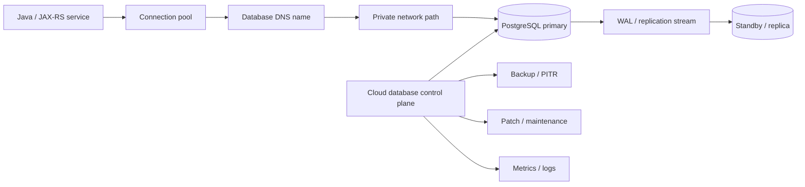
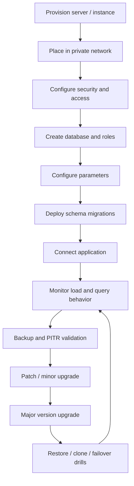
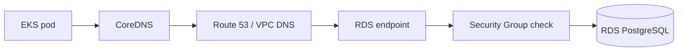
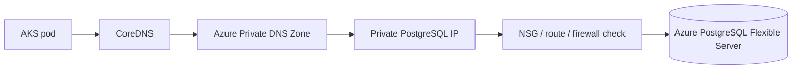

# Part 033 — Managed PostgreSQL on AWS and Azure

> Goal: understand managed PostgreSQL as a production dependency for Java/JAX-RS systems running on EKS, AKS, cloud VM, or hybrid/on-prem environments.

This part is not a PostgreSQL SQL tutorial. It is a cloud architecture and production operations guide for using PostgreSQL safely behind enterprise Java services.

You should finish this part able to review a PR or architecture decision that touches PostgreSQL connectivity, HA, backup, restore, upgrades, connection pooling, private networking, IAM/RBAC, monitoring, cost, and operational risk.

---

## 1. Core mental model

Managed PostgreSQL is not just “Postgres hosted by the cloud provider”. It is a managed database control plane wrapped around a PostgreSQL-compatible data plane.



Separate these concerns:

| Concern | What it means | Why backend engineers care |
|---|---|---|
| PostgreSQL engine | SQL semantics, MVCC, indexes, transactions, locks | Correctness, latency, deadlocks, query behavior |
| Managed database control plane | Provisioning, backups, patching, failover, replica lifecycle | Availability, upgrade risk, restore confidence |
| Network placement | Subnet, private endpoint, SG/NSG, DNS, firewall | Whether pods can connect privately and predictably |
| Client behavior | JDBC, HikariCP, timeout, retry, transaction scope | Whether application fails fast or amplifies outage |
| Operations | monitoring, runbooks, PITR, maintenance window | Whether production incidents are diagnosable |

The dangerous assumption: “managed” does not mean “no database operations”. It means the provider automates part of the infrastructure lifecycle, while your team still owns schema design, connection behavior, migrations, query performance, access control, data lifecycle, and application-level correctness.

---

## 2. Why managed PostgreSQL exists

Managed PostgreSQL exists to reduce undifferentiated operational work:

- provisioning database hosts
- installing and patching the engine
- storage allocation
- backups
- restore mechanics
- failover orchestration
- replication management
- basic metrics and logs
- maintenance scheduling

But it does not remove these responsibilities:

- choosing the right region/AZ/network placement
- designing schema and indexes
- validating migrations
- setting connection pool limits
- handling failover from the application side
- protecting secrets and credentials
- tuning database parameters safely
- monitoring slow queries, locks, replication lag, storage, CPU, IOPS
- testing backup restore
- understanding cost drivers

For a quote/order system, PostgreSQL is often a system-of-record or transaction coordination dependency. A wrong database decision can manifest as order duplication, stuck workflow, quote version inconsistency, failed order submission, or delayed downstream events.

---

## 3. Lifecycle of managed PostgreSQL

A realistic lifecycle looks like this:



Key lifecycle checkpoints:

| Stage | Common failure | Senior engineer question |
|---|---|---|
| Provisioning | Wrong region, wrong SKU/instance class, wrong subnet | Is this database placed near the application and protected by private network? |
| Access | Public exposure, broad SG/NSG, weak credentials | Can only expected workloads connect? |
| Migration | DDL lock, long migration, incompatible change | Is migration backward compatible and production-safe? |
| Runtime | connection storm, pool exhaustion, slow query | Are timeouts, pool sizes, and query metrics known? |
| Backup | backup exists but restore not tested | Have we restored into a separate environment recently? |
| Failover | app keeps stale connection | Does the app recover after DNS endpoint/failover change? |
| Upgrade | version incompatibility, extension issue | Has the upgrade been rehearsed with prod-like data? |

---

## 4. AWS implementation model

### 4.1 Amazon RDS for PostgreSQL

Amazon RDS for PostgreSQL is the standard managed PostgreSQL option in AWS.

You usually care about:

- DB instance class
- storage type and size
- Multi-AZ deployment
- read replicas
- DB subnet group
- security groups
- parameter groups
- option/extension support
- automated backups
- point-in-time restore
- maintenance window
- performance metrics and logs
- CloudWatch alarms
- encryption with AWS KMS
- authentication and secret rotation strategy

Typical private EKS-to-RDS path:



Important AWS objects:

| AWS object | What it controls | Review concern |
|---|---|---|
| DB subnet group | Which subnets RDS can use | Must be private, multi-AZ where required |
| Security Group | Network access to database port | Should allow only app/node/pod SG or approved CIDR |
| Parameter group | PostgreSQL runtime parameters | Changes may require reboot and affect performance/correctness |
| KMS key | Encryption at rest | Key policy and availability matter |
| CloudWatch metrics/logs | Operational visibility | Must include CPU, storage, connections, latency, locks, logs where relevant |
| Backup config | Retention and PITR | Must match RPO/RTO requirements |
| Maintenance window | Patch timing | Must align with business risk and operational coverage |

### 4.2 Aurora PostgreSQL-compatible awareness

Aurora PostgreSQL-compatible is not “the same as RDS PostgreSQL with a different name”. It has a different storage architecture and cluster model.

Use it when the platform/team intentionally needs capabilities such as Aurora cluster behavior, storage scaling characteristics, read replica model, or provider-specific HA/performance profile.

Review caveats:

- confirm PostgreSQL compatibility for required extensions
- confirm version support
- confirm migration path from/to standard PostgreSQL
- confirm failover behavior and DNS endpoint usage
- confirm cost model, especially I/O and replica usage
- do not assume exact operational behavior matches self-managed PostgreSQL

### 4.3 AWS parameter groups

Parameter groups are where many invisible production changes happen.

Examples of parameters that can affect application behavior:

- `max_connections`
- `shared_buffers`
- `work_mem`
- `maintenance_work_mem`
- `statement_timeout`
- `idle_in_transaction_session_timeout`
- `log_min_duration_statement`
- `rds.force_ssl` where applicable
- autovacuum-related settings

PR review questions:

- Is the parameter dynamic or does it require reboot?
- Is the change validated under production-like load?
- Does it interact with application connection pool size?
- Does it change query cancellation behavior?
- Does it increase memory pressure per connection?

---

## 5. Azure implementation model

### 5.1 Azure Database for PostgreSQL Flexible Server

Azure Database for PostgreSQL Flexible Server is the main managed PostgreSQL deployment model to understand for modern Azure PostgreSQL usage.

You usually care about:

- compute tier and SKU
- storage size and autoscale setting
- region and availability zone placement
- high availability mode
- backup retention
- point-in-time restore
- private access through virtual network integration or private networking pattern
- firewall rules if public access exists
- server parameters
- maintenance window
- Azure Monitor metrics and logs
- Microsoft Entra / credential strategy where applicable
- encryption/key strategy

Typical private AKS-to-Azure PostgreSQL path:



Important Azure objects:

| Azure object | What it controls | Review concern |
|---|---|---|
| Flexible server | PostgreSQL managed server | SKU, HA, backup, version, maintenance |
| Subnet / delegated subnet / private network model | Network placement | Must match AKS/VNet/hub-spoke path |
| Private DNS Zone | Name resolution for private endpoint/access | Wrong DNS often causes public or failed resolution |
| NSG / UDR / Firewall | Packet path and allow/deny | Must allow expected pod/node/subnet path |
| Server parameters | Runtime engine behavior | Can change correctness, memory, locks, logging |
| Azure Monitor diagnostics | Observability | Must be enabled before incident, not after |
| Backup policy | Restore capability | Must match RPO/RTO and retention requirements |

### 5.2 Azure server parameters

Azure server parameters are similar in purpose to RDS parameter groups but differ in management surface and allowed values.

Review questions:

- Is the parameter modifiable in Azure Flexible Server?
- Is it dynamic or does it require restart?
- Does it align with Java connection pool settings?
- Does it increase memory or I/O pressure?
- Is there rollback guidance?

---

## 6. AWS vs Azure comparison

| Area | AWS | Azure | Caveat |
|---|---|---|---|
| Standard managed PostgreSQL | Amazon RDS for PostgreSQL | Azure Database for PostgreSQL Flexible Server | Similar role, different control plane and networking model |
| PostgreSQL-compatible advanced option | Aurora PostgreSQL-compatible | No exact 1:1 Aurora equivalent | Do not force a false mapping |
| Network placement | DB subnet group + SG | VNet/subnet/private access + NSG/UDR/private DNS | DNS and firewall semantics differ |
| Runtime parameters | DB parameter group | Server parameters | Change lifecycle differs |
| HA | Multi-AZ/RDS or Aurora cluster model | Flexible Server HA options | Failover behavior must be tested, not assumed |
| Backup/PITR | Automated backups and PITR | Automated backups and PITR | Restore drill is the real evidence |
| Monitoring | CloudWatch, Performance Insights where used | Azure Monitor, diagnostic settings, Query Store where used | Availability depends on enabled diagnostics |
| Encryption | KMS | Azure-managed keys / customer-managed keys | Key policy/RBAC failure can break access |
| Private DNS | VPC DNS / Route 53 private hosted zone patterns | Azure Private DNS Zone patterns | Wrong private DNS is a common outage root cause |

---

## 7. Impact on Java/JAX-RS backend services

A Java/JAX-RS service does not talk to “PostgreSQL in the abstract”. It talks through:

```text
JAX-RS resource
  -> service layer
  -> transaction boundary
  -> repository / DAO
  -> JDBC driver
  -> connection pool
  -> DNS
  -> TCP/TLS
  -> PostgreSQL backend process
```

### 7.1 Connection pool discipline

Most production PostgreSQL incidents involving Java services are amplified by connection pools.

Key settings to review:

| Setting | Risk if wrong |
|---|---|
| maximum pool size | Too high can exhaust DB connections; too low can throttle app |
| connection timeout | Too long can hang request threads; too short can cause false failures |
| idle timeout | Too aggressive can churn connections; too lax can hold resources |
| max lifetime | Must be lower than network/load balancer/database idle timeout where relevant |
| validation query / health check | Bad health check can hide broken connections |
| leak detection | Missing leak detection makes connection leaks harder to diagnose |

Rule of thumb: total possible connections across all pods must be intentionally bounded.

```text
max_db_connections_needed = number_of_pods * max_pool_size_per_pod
```

Then compare it with:

- database `max_connections`
- reserved connections for admin/maintenance
- migration jobs
- background workers
- reporting/query tools
- incident debugging sessions

### 7.2 Timeout strategy

You need layered timeouts:

| Layer | Example concern |
|---|---|
| HTTP request timeout | API should not wait forever on DB |
| transaction timeout | Business operation should have bounded DB lifetime |
| JDBC socket timeout | Broken network should fail eventually |
| connection acquisition timeout | Pool starvation should fail fast |
| statement timeout | Slow query should not monopolize DB resources |
| idle-in-transaction timeout | Bad code should not hold locks indefinitely |

Avoid “infinite by accident”. Infinite waits are outage multipliers.

### 7.3 Retry strategy

Database retries are dangerous when applied blindly.

Safe candidates:

- connection acquisition after failover
- read-only query retry when idempotent
- transaction retry for known serialization/deadlock errors when logic is safe

Dangerous candidates:

- retrying non-idempotent write without idempotency key
- retrying a transaction after partial external side effect
- retrying migration DDL
- retrying under DB overload without backoff

For quote/order flows, pair retries with idempotency keys, unique constraints, and deterministic state transitions.

---

## 8. Impact on PostgreSQL/Kafka/RabbitMQ/Redis/Camunda/NGINX ecosystem

PostgreSQL rarely fails alone. It often sits in a dependency graph.

| Component | PostgreSQL interaction risk |
|---|---|
| Kafka | DB transaction committed but event publish failed; outbox pattern needed |
| RabbitMQ | Message consumed but DB update failed; ack strategy matters |
| Redis | Cache stale after DB change; invalidation correctness matters |
| Camunda | Workflow state may depend on DB transaction outcome |
| NGINX/API gateway | Upstream timeout may be shorter than DB transaction duration |
| Kubernetes | Pod scaling increases DB connections suddenly |
| GitOps/IaC | Config drift can expose DB or change parameters unexpectedly |

Senior-level question: what is the consistency boundary between PostgreSQL and the rest of the platform?

---

## 9. EKS/AKS/on-prem/hybrid considerations

### 9.1 EKS

Check:

- pod DNS resolution to RDS endpoint
- node/pod Security Group path
- subnet route table
- NAT usage should not be needed for private RDS in same VPC/private network path
- IRSA if application retrieves DB secret from AWS Secrets Manager
- CloudWatch logs/metrics for both app and RDS
- NetworkPolicy if used

### 9.2 AKS

Check:

- CoreDNS resolution to Azure private DNS
- VNet/subnet/NSG/UDR path
- private endpoint or VNet integration model
- managed identity/workload identity if retrieving secret from Key Vault
- Azure Monitor diagnostic settings
- NetworkPolicy if used

### 9.3 On-prem/hybrid

Check:

- route from on-prem to database private endpoint/subnet
- DNS forwarding from on-prem resolver to cloud private DNS
- firewall allowlist
- TLS trust chain
- latency and connection pooling behavior
- operational ownership of hybrid network path

Hybrid failure mode: application sees `connection timed out`, but root cause is route advertisement, DNS forwarding, firewall, MTU, or TLS inspection.

---

## 10. Failure modes

| Symptom | Likely root causes | First checks |
|---|---|---|
| Connection timeout | Route, firewall, SG/NSG, private DNS, DB down | DNS result, TCP connect, SG/NSG, route table |
| Connection refused | Wrong endpoint/port, DB not listening, failover in progress | Endpoint, port, DB status |
| SSL handshake failure | TLS config, CA mismatch, proxy/TLS inspection | JDBC SSL mode, truststore, cert chain |
| Too many connections | Pool too large, pod scale-out, connection leak | DB connections metric, pod count, Hikari metrics |
| Slow API | slow query, lock wait, IOPS saturation, CPU pressure | query logs, wait events, CPU, IOPS, locks |
| Deadlock/serialization error | transaction design, concurrent updates | DB logs, transaction code, retry safety |
| Failover causes long outage | stale connections, DNS caching, pool lifetime too high | failover timeline, pool config, DNS TTL |
| Migration stuck | DDL lock, long transaction | lock view, active sessions, migration script |
| Backup restore too slow | untested restore, large DB, wrong RTO assumption | latest restore drill evidence |
| Access denied | wrong user/role/secret/rotation | secret version, DB role, credential source |

---

## 11. Detection and debugging playbook

### 11.1 From Java service

Inspect:

- exception class and SQLState
- connection pool metrics
- request latency histogram
- DB dependency span in tracing
- retry count
- timeout count
- thread dump if request threads are blocked
- logs around transaction start/end

Useful failure grouping:

```text
Can resolve DB DNS?
Can open TCP connection?
Can complete TLS?
Can authenticate?
Can acquire pooled connection?
Can execute cheap query?
Can execute real query within timeout?
Can commit transaction?
```

### 11.2 From Kubernetes

Use a debug pod only if allowed by internal policy.

Checks:

```bash
# DNS resolution
nslookup <db-hostname>

# TCP connectivity
nc -vz <db-hostname> 5432

# Route visibility, if tools available
ip route

# Pod environment and mounted secret reference
printenv | sort
```

Do not paste production credentials into ad hoc shells unless explicitly permitted by the incident runbook.

### 11.3 From cloud side

AWS checks:

- RDS status
- CloudWatch metrics
- DB connections
- CPU/storage/IOPS
- RDS logs
- Performance Insights if enabled
- SG inbound/outbound
- subnet route tables
- DNS/private hosted zone
- backup/maintenance/failover events

Azure checks:

- Flexible Server status
- Azure Monitor metrics
- diagnostic logs
- connection count
- CPU/storage/IOPS
- server parameters
- NSG/UDR/firewall
- Private DNS Zone records
- backup/maintenance/failover events

---

## 12. Correctness concerns

Managed PostgreSQL does not fix incorrect data flow.

Review these correctness patterns:

| Concern | Risk | Safer pattern |
|---|---|---|
| duplicate order creation | retry repeats non-idempotent write | idempotency key + unique constraint |
| event emitted before commit | downstream sees state that may roll back | transactional outbox |
| DB commit but event publish fails | state change invisible to event consumers | outbox relay with retry |
| long transaction | locks, bloat, timeout | short transaction boundary |
| migration incompatible with old code | rolling deployment breaks | backward-compatible migration sequence |
| cache invalidation gap | stale quote/order view | versioned cache keys or explicit invalidation |
| workflow state mismatch | Camunda and DB diverge | clear transaction/workflow boundary |

---

## 13. Performance and capacity concerns

Key metrics to watch:

- CPU
- memory pressure where exposed
- storage utilization
- storage IOPS/throughput
- connection count
- active vs idle connections
- locks and wait events
- slow query count
- transaction duration
- replication lag
- deadlocks
- temp file usage
- cache hit ratio
- autovacuum behavior

Application-side capacity model:

```text
peak_concurrent_requests
  -> DB touching requests ratio
  -> average DB time per request
  -> connection pool demand
  -> database connection and CPU demand
```

Common mistake: scaling pods without scaling database capacity or reducing pool size.

---

## 14. Security and privacy concerns

Review:

- public exposure disabled unless explicitly justified
- database reachable only from approved subnets/workloads
- SG/NSG rules least-privilege
- TLS required
- credentials stored in Secrets Manager/Key Vault, not Git/Helm values/plain env where avoidable
- rotation process defined
- audit logs enabled where required
- PII not written into database logs unnecessarily
- backups encrypted
- snapshots/exports access controlled
- restore environments protected, because restored data is still sensitive data

Security smell: production snapshot restored into a weakly controlled non-prod environment.

---

## 15. Cost concerns

Cost drivers:

- instance/SKU size
- storage allocated and autoscaled
- provisioned IOPS/throughput if used
- backup retention
- read replicas
- Multi-AZ/HA configuration
- cross-AZ or cross-region traffic
- logs and monitoring volume
- PITR retention
- idle oversized non-prod databases
- duplicate restored/cloned environments

Cost review questions:

- Is the database right-sized for actual workload?
- Are non-prod instances running 24/7 unnecessarily?
- Are read replicas actually used?
- Is log verbosity generating avoidable cost?
- Is HA cost aligned with business criticality?
- Are backup retention and compliance requirements aligned?

---

## 16. PR review checklist

Use this checklist for any PR/ADR touching PostgreSQL.

### Architecture

- [ ] Is PostgreSQL the right persistence boundary for this data?
- [ ] Is the managed option clearly identified: RDS, Aurora-compatible, Azure Flexible Server, or self-managed?
- [ ] Is region/AZ placement documented?
- [ ] Is HA mode documented?
- [ ] Is RPO/RTO documented?

### Networking

- [ ] Is access private?
- [ ] Are SG/NSG rules least-privilege?
- [ ] Is DNS resolution path documented?
- [ ] Is on-prem/hybrid access required?
- [ ] Is there any accidental NAT/public route dependency?

### Identity and secrets

- [ ] Where is the DB credential stored?
- [ ] How is it rotated?
- [ ] Does the workload identity have only the secret access it needs?
- [ ] Are DB users/roles scoped by application responsibility?

### Java/JAX-RS integration

- [ ] Is connection pool size bounded across all replicas?
- [ ] Are timeouts explicit?
- [ ] Are retries safe and idempotent?
- [ ] Are transaction boundaries short?
- [ ] Are health checks meaningful but cheap?

### Migration

- [ ] Is migration backward compatible?
- [ ] Could DDL lock large tables?
- [ ] Is rollback realistic?
- [ ] Has migration been tested on prod-like volume?

### Observability

- [ ] Are DB metrics visible?
- [ ] Are slow queries captured?
- [ ] Are pool metrics visible?
- [ ] Is trace correlation available from API to DB call?
- [ ] Are alerts tied to customer impact?

### Operations

- [ ] Is backup enabled?
- [ ] Has restore been tested?
- [ ] Is maintenance window acceptable?
- [ ] Is upgrade path documented?
- [ ] Is incident escalation path known?

---

## 17. Internal verification checklist

Verify with platform/SRE/DevOps/security/backend team:

- [ ] Which managed PostgreSQL service is used for Quote & Order workloads?
- [ ] AWS account or Azure subscription hosting the database.
- [ ] Region and AZ/zone strategy.
- [ ] VPC/VNet and subnet placement.
- [ ] DB subnet group or Azure private network model.
- [ ] Security Group/NSG/firewall rules.
- [ ] Private DNS zone/hosted zone records.
- [ ] EKS/AKS pod-to-DB traffic path.
- [ ] On-prem/hybrid route requirement.
- [ ] DB engine version.
- [ ] Parameter group/server parameter baseline.
- [ ] Extension list.
- [ ] HA/Multi-AZ setting.
- [ ] Backup retention and PITR setting.
- [ ] Last restore drill evidence.
- [ ] Read replica usage.
- [ ] Maintenance window.
- [ ] Version upgrade process.
- [ ] Secrets manager / Key Vault integration.
- [ ] Credential rotation process.
- [ ] Connection pool standard for Java services.
- [ ] Migration tooling: Flyway, Liquibase, custom, or other.
- [ ] Monitoring dashboard.
- [ ] Slow query logging setting.
- [ ] Alerts.
- [ ] Cost owner and cost dashboard.
- [ ] Incident notes involving PostgreSQL.

---

## 18. Production readiness questions

Ask these before approving a PostgreSQL-backed production change:

1. What happens if the primary database fails over during peak traffic?
2. What happens if DNS resolves but TCP cannot connect?
3. What happens if credentials rotate while pods are running?
4. What happens if a migration locks a hot table?
5. What happens if all pods restart and reconnect at once?
6. What happens if backup restore takes longer than expected RTO?
7. What customer-facing operation becomes unavailable if PostgreSQL is degraded?
8. What data correctness invariant must never be violated?
9. What dashboard proves the database is healthy?
10. What runbook tells an on-call engineer what to do first?

---

## 19. Sources to verify against official documentation

Use internal architecture as the source of truth for CSG-specific deployment details. Use vendor docs only for cloud service behavior and terminology.

- AWS: Amazon RDS for PostgreSQL, read replicas, parameter groups, engine upgrades, monitoring, backups, encryption, VPC networking.
- AWS: Aurora PostgreSQL-compatible documentation if Aurora is used internally.
- Microsoft: Azure Database for PostgreSQL Flexible Server overview, high availability, backup/restore, networking, monitoring, server parameters.
- PostgreSQL: upstream documentation for SQL behavior, MVCC, locking, transactions, isolation levels, and query planning.

---

## 20. Key takeaways

- Managed PostgreSQL reduces infrastructure burden, not application/data responsibility.
- Private networking and DNS are part of the database architecture, not separate platform trivia.
- Java connection pool settings can make a small DB issue become a full outage.
- Backup is not real until restore has been tested.
- HA is not real until application failover behavior has been tested.
- Migrations are production changes, not build artifacts.
- The right review frame is: correctness, connectivity, security, performance, observability, cost, and recovery.
