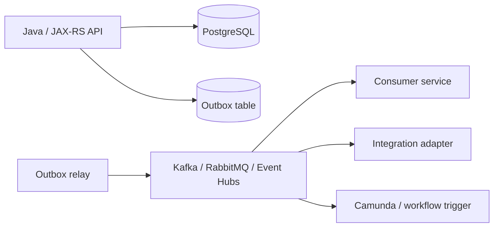
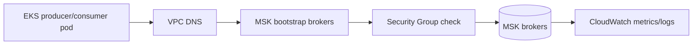
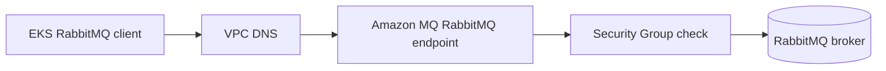
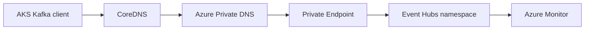
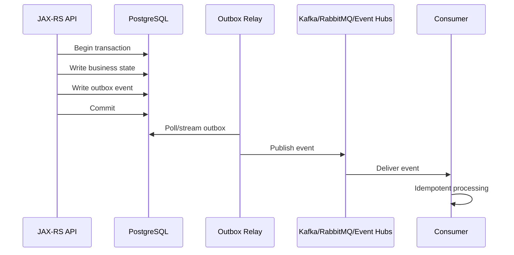

# Part 034 — Managed Messaging on AWS and Azure

> Goal: understand managed Kafka/RabbitMQ-style messaging choices in AWS and Azure from the perspective of a senior Java/JAX-RS backend engineer.

This part is not a Kafka or RabbitMQ fundamentals tutorial. It focuses on cloud-managed messaging decisions, operational consequences, failure modes, and production review checklists.

In enterprise quote/order systems, messaging often carries state transition events, order submission events, integration events, workflow triggers, audit trails, and downstream synchronization signals. A messaging mistake can cause silent lag, duplicate processing, lost business events, stuck workflows, or inconsistent quote/order state.

---

## 1. Core mental model

Messaging systems decouple producers and consumers across time, ownership, and failure domains.



The key question is not only “which broker do we use?” but:

- what delivery semantics are required?
- what ordering semantics are required?
- what failure recovery model is required?
- who owns broker operations?
- how are producers and consumers authenticated?
- how are private network paths enforced?
- how is lag detected?
- how is replay handled?
- how is schema compatibility enforced?
- how does cost scale with throughput, retention, partitions, queues, and logs?

---

## 2. Kafka vs RabbitMQ mental model

Kafka and RabbitMQ solve overlapping but different classes of problems.

| Dimension | Kafka-style streaming | RabbitMQ-style messaging |
|---|---|---|
| Primary abstraction | Topic partition log | Exchange, queue, binding |
| Consumption | Consumer groups read offsets | Consumers receive from queues |
| Retention | Time/size-based log retention | Queue-based until ack/expiry/dead-letter |
| Replay | Natural replay by offset if retained | Possible through DLQ/requeue/custom storage, not the same model |
| Ordering | Per partition | Per queue/consumer constraints, depends on topology |
| Scaling | Partitions and consumer groups | Queues, consumers, prefetch, routing topology |
| Best fit | event streams, audit-like event log, integration fan-out, replay | work queues, commands, routing, request/task distribution |
| Common production risk | partition hot spot, consumer lag, retention/cost, rebalance | unacked messages, queue growth, poison messages, prefetch mistakes |

Senior-level rule: do not choose Kafka only because it sounds modern, and do not choose RabbitMQ only because it is simpler. Choose based on replay, ordering, routing, backpressure, retention, operational ownership, and consumer model.

---

## 3. Managed vs self-managed broker

### Managed broker

Managed broker means the cloud provider owns part of the broker infrastructure lifecycle.

Benefits:

- managed provisioning
- patching support
- integrated monitoring
- managed storage/network integration
- fewer broker host operations
- cloud-native IAM/RBAC/private network integration

Costs/trade-offs:

- provider-specific limits
- feature/version constraints
- less direct control
- SKU/throughput unit/broker instance cost model
- migration friction
- integration with internal observability may require work
- cloud outage/shared control plane dependency

### Self-managed on EKS/AKS

Self-managed Kafka/RabbitMQ on Kubernetes gives more control, but creates more operational responsibility.

You own:

- broker deployment topology
- persistent volumes
- upgrades
- storage expansion
- TLS/certificates
- authn/authz
- rebalancing
- backup/restore if applicable
- monitoring
- incident response
- disaster recovery

For a senior backend engineer, the decision is not ideological. The question is: which operational model gives the system the safest lifecycle at the required scale?

---

## 4. AWS implementation options

## 4.1 Amazon MSK

Amazon MSK is AWS managed Apache Kafka.

Key concepts:

- MSK cluster
- provisioned vs serverless model awareness
- broker nodes
- topic
- partition
- replication factor
- consumer group
- bootstrap broker string
- client authentication
- encryption in transit/at rest
- VPC connectivity
- security groups
- CloudWatch metrics
- broker logs
- storage scaling
- MSK Connect
- MSK Replicator awareness

Typical EKS-to-MSK path:



Review concerns:

| Concern | What to check |
|---|---|
| VPC placement | Is MSK reachable privately from EKS/on-prem where needed? |
| Security group | Are only producer/consumer workloads allowed? |
| Authentication | IAM/SASL/SCRAM/TLS choice and client support |
| Partitions | Enough for throughput, not too many for overhead |
| Replication factor | Availability vs cost/storage |
| Retention | Business replay need vs storage cost |
| Consumer lag | Alerted and tied to customer impact |
| Rebalance behavior | Consumer client configuration and deployment strategy |
| Schema compatibility | Registry or contract process if events are structured |
| Upgrade | Broker version upgrade runbook and client compatibility |

## 4.2 MSK Connect

MSK Connect is managed Kafka Connect for source/sink connector workloads.

Use it when you need connector-style integration and the operational model fits.

Review questions:

- Is connector state and offset handling understood?
- Is the connector running with private connectivity to source/sink?
- Are credentials stored securely?
- Are connector errors and DLQ configured?
- Is throughput sizing understood?
- Who owns connector plugin version upgrades?

## 4.3 Amazon MQ for RabbitMQ

Amazon MQ supports managed RabbitMQ brokers.

Key concepts:

- broker
- single-instance or cluster deployment awareness
- vhost
- exchange
- queue
- binding
- routing key
- user/permission
- TLS endpoint
- CloudWatch metrics
- broker engine version
- maintenance window
- storage and memory alarms

Typical EKS-to-Amazon MQ path:



Review concerns:

| Concern | What to check |
|---|---|
| Deployment mode | Single instance vs cluster; availability expectation |
| Queue durability | Durable queue and persistent message where required |
| Ack behavior | Manual ack vs auto ack; poison message handling |
| Prefetch | Consumer backpressure and fairness |
| DLQ | Dead-letter exchange/queue topology |
| TLS/auth | Broker user, password/secret, TLS mode |
| Memory/disk alarms | Broker flow control and blocked producers |
| Upgrade | RabbitMQ engine version support and compatibility |
| Monitoring | queue depth, unacked, publish/consume rate, connection count |

---

## 5. Azure implementation options

## 5.1 Azure Event Hubs Kafka-compatible endpoint awareness

Azure Event Hubs is a managed event streaming service with Kafka protocol compatibility. This means Kafka client applications can often connect by changing configuration rather than running an Apache Kafka cluster.

This is not the same as operating a full Kafka cluster.

Key concepts:

- Event Hubs namespace
- event hub
- partition
- consumer group
- throughput units / processing units / capacity model depending tier
- Kafka endpoint
- SAS/Azure AD authentication model awareness
- private endpoint
- capture/archive if used
- retention
- Azure Monitor metrics
- diagnostic logs

Typical AKS-to-Event-Hubs path:



Review concerns:

| Concern | What to check |
|---|---|
| Kafka compatibility | Does the application use supported Kafka protocol/client features? |
| Semantics | Is Event Hubs behavior acceptable for the workload? |
| Partitioning | Does partition count support required ordering/parallelism? |
| Consumer groups | Are consumers isolated correctly? |
| Retention | Does retention match replay requirement? |
| Throughput capacity | Are throughput/capacity units sized and monitored? |
| Private endpoint | Is traffic private from AKS/on-prem? |
| Auth | SAS/Azure AD/managed identity approach verified? |
| Monitoring | Incoming/outgoing messages, throttling, lag-like signals, errors |

## 5.2 Azure-native messaging alternatives awareness

Depending on internal architecture, Azure Service Bus may also exist for queue/topic workloads. This part stays focused on Kafka/RabbitMQ mapping because the requested series scope names Kafka/RabbitMQ and Azure Event Hubs Kafka-compatible awareness.

If Azure Service Bus appears in internal architecture, verify it separately instead of treating it as RabbitMQ equivalent.

---

## 6. AWS vs Azure mapping caveats

| Need | AWS option | Azure option | Caveat |
|---|---|---|---|
| Managed Kafka | Amazon MSK | Azure Event Hubs Kafka-compatible endpoint | Event Hubs is Kafka-compatible, not a full managed Kafka cluster in the same operational sense |
| Managed Kafka Connect | MSK Connect | Kafka Connect to Event Hubs or other Azure integration patterns | Connector support/ops model differs |
| Managed RabbitMQ | Amazon MQ for RabbitMQ | No direct first-party RabbitMQ-equivalent managed service in the same way; verify internal choice | Could be self-managed RabbitMQ on AKS or third-party service |
| Private connectivity | MSK VPC/private connectivity, Amazon MQ VPC endpoint/network placement | Event Hubs private endpoint | DNS and auth model differ |
| Monitoring | CloudWatch metrics/logs | Azure Monitor/diagnostic logs | Metrics names and semantics differ |
| Auth | IAM/SASL/SCRAM/TLS depending service | SAS/Azure AD/private endpoint depending service | Client configuration differs significantly |

Do not produce a one-to-one service map without verifying workload semantics.

---

## 7. Java/JAX-RS application impact

Messaging usually appears behind an API boundary:

```text
HTTP request
  -> JAX-RS resource
  -> business transaction
  -> database write
  -> message publish
  -> downstream consumer
```

The correctness question: when exactly is the message considered committed relative to database state?

### 7.1 Producer concerns

Review producer configuration:

- bootstrap servers / endpoint
- TLS settings
- auth mechanism
- retries
- delivery timeout
- request timeout
- idempotent producer setting where applicable
- acknowledgments setting
- batching and linger
- compression
- partition key strategy
- error handling
- metric export

Risk examples:

| Producer issue | Consequence |
|---|---|
| fire-and-forget publish | silent event loss |
| unbounded retry | request thread exhaustion or delayed failure |
| wrong partition key | ordering breaks |
| no idempotency | duplicate business event side effects |
| publish inside DB transaction without outbox | inconsistent commit/publish behavior |

### 7.2 Consumer concerns

Review consumer configuration:

- consumer group
- offset/ack strategy
- max poll interval / heartbeat behavior for Kafka
- manual ack/prefetch for RabbitMQ
- retry policy
- DLQ strategy
- poison message handling
- idempotent processing
- transaction boundary
- observability

Risk examples:

| Consumer issue | Consequence |
|---|---|
| auto-commit before processing | message loss on crash |
| commit/ack after external side effect without idempotency | duplicate side effects |
| no DLQ | poison message blocks processing |
| high prefetch | one consumer hoards messages or memory |
| slow consumer | lag grows and customer workflows delay |

### 7.3 Outbox pattern

For quote/order systems, the outbox pattern is often safer than directly publishing after a database write.



Benefits:

- database state and event intent commit together
- relay can retry safely
- producer API does not need to block on broker availability
- events can be traced and audited

Trade-offs:

- extra table/process
- outbox cleanup needed
- relay lag must be monitored
- duplicate event delivery still possible
- idempotent consumers still required

---

## 8. Impact on PostgreSQL, Redis, Camunda, NGINX, Kubernetes

| Component | Messaging interaction |
|---|---|
| PostgreSQL | Transactional outbox, consumer idempotency tables, event audit |
| Redis | Deduplication cache, rate limits, transient locks; beware eviction correctness |
| Camunda | Workflow triggers, async continuation, event correlation, retry behavior |
| NGINX/API Gateway | HTTP timeouts should not wait for slow broker publish unless required |
| Kubernetes | Pod scale changes producer/consumer concurrency and broker connection count |
| GitOps/IaC | Topic/queue definitions, ACLs, retention, and DLQ topology should be versioned |
| Observability stack | Need lag, queue depth, error rate, DLQ count, publish latency, consume latency |

---

## 9. Private connectivity and network review

Messaging should usually stay private for enterprise backend systems.

Check path:

```text
Pod/node subnet
  -> DNS resolution
  -> route table / UDR
  -> SG/NSG/firewall
  -> private endpoint / private broker endpoint
  -> broker listener
  -> TLS/auth
```

Common failure mode: endpoint resolves to public address from inside the cluster because private DNS is missing or not linked to the VPC/VNet.

### AWS checks

- MSK broker subnets
- MSK security groups
- Amazon MQ broker accessibility setting
- VPC/private connectivity model
- DNS resolution from pod
- cross-account or multi-VPC access requirement
- on-prem route if consumers/producers are outside AWS

### Azure checks

- Event Hubs private endpoint
- Private DNS Zone link to VNet
- NSG/UDR/firewall path
- AKS VNet/subnet integration
- on-prem DNS forwarding
- public network access setting
- authentication model

---

## 10. Security and identity

### Kafka-style security concerns

- client authentication method
- topic-level authorization
- TLS encryption
- certificate lifecycle
- SASL mechanism
- IAM integration where used
- secret storage
- producer/consumer least privilege
- audit trail for admin operations

### RabbitMQ-style security concerns

- broker user lifecycle
- vhost permissions
- exchange/queue permissions
- TLS
- password rotation
- OAuth/IAM/LDAP support if used by platform
- management UI exposure
- audit/logging

### Review principle

A service that only publishes `quote.created` should not have broad admin capability over all topics, queues, users, or broker settings.

---

## 11. Reliability patterns

### 11.1 Delivery semantics

Understand what the system actually promises.

| Promise | Meaning | Required application discipline |
|---|---|---|
| At-most-once | Message may be lost, not duplicated | Rarely acceptable for business events |
| At-least-once | Message can duplicate but should not be lost after accepted | Idempotent consumers required |
| Exactly-once-like | Narrow guarantee under specific broker/client patterns | Still verify database/external side effects |

Most enterprise integrations should assume at-least-once delivery and design idempotent consumers.

### 11.2 Idempotency

Consumer idempotency options:

- unique event ID stored in processed-events table
- business key + version constraint
- idempotency key on downstream API
- deduplication window in Redis, if loss of dedup state is acceptable
- workflow correlation key with deterministic state transition

### 11.3 Backpressure

Backpressure signals:

- Kafka consumer lag
- RabbitMQ queue depth
- unacked messages
- broker CPU/memory/disk pressure
- throttling errors
- producer latency
- publish timeout
- DLQ growth

Do not hide backpressure with infinite retries.

---

## 12. Monitoring and alerting

### Kafka/MSK/Event Hubs style metrics

- incoming messages/bytes
- outgoing messages/bytes
- publish latency
- consumer lag or lag-equivalent signal
- failed sends
- throttling
- partition skew
- under-replicated partitions for Kafka clusters
- broker CPU/memory/storage
- connection count
- retention/storage usage

### RabbitMQ/Amazon MQ style metrics

- queue depth
- unacked messages
- publish rate
- deliver/ack rate
- consumer count
- connection/channel count
- memory alarm
- disk alarm
- node health
- DLQ depth

### Application metrics

- publish success/failure count
- publish latency
- consumer processing latency
- retry count
- DLQ count
- poison message count
- idempotency duplicate count
- event age
- outbox relay lag

Alert on business-relevant lag, not only infrastructure symptoms.

---

## 13. Scaling and capacity

### Kafka/MSK/Event Hubs

Capacity dimensions:

- partitions
- throughput per partition/namespace/cluster
- broker count/SKU/capacity unit
- retention size
- producer batch size
- consumer parallelism
- consumer processing time
- network throughput

Partitioning review:

- Does the partition key preserve required ordering?
- Is one tenant/customer/order type creating a hot partition?
- Can consumer parallelism scale enough?
- Is repartitioning possible without breaking consumers?

### RabbitMQ/Amazon MQ

Capacity dimensions:

- queue count
- message size
- publish rate
- consume rate
- prefetch
- consumer concurrency
- durable vs transient messages
- disk/memory alarms
- connection/channel count

RabbitMQ review:

- Are queues bounded by TTL/max length/DLQ policy where appropriate?
- Are poison messages isolated?
- Are consumers acking only after successful processing?
- Are large messages avoided or offloaded to object storage?

---

## 14. Retention, replay, and DLQ

### Retention

Retention is not just storage cost. It defines how far back consumers can recover.

Questions:

- How long must events be replayable?
- Is retention based on compliance, debugging, DR, or consumer downtime?
- Are messages/events PII-bearing?
- What is the cost of retaining them?
- Who can access historical events?

### Replay

Replay can fix downstream issues, but can also duplicate side effects.

Before replay:

- identify event range
- confirm idempotency
- isolate downstream side effects
- monitor consumer rate
- communicate operational window
- capture audit evidence

### DLQ

DLQ is not a trash can. It is an operational queue requiring ownership.

DLQ checklist:

- reason captured
- original payload retained safely
- retry count visible
- alert configured
- replay process documented
- PII handling reviewed
- owner assigned

---

## 15. Upgrade and maintenance

Messaging upgrades can break clients even when the broker remains “available”.

Check:

- broker engine version
- client library compatibility
- TLS/cipher changes
- auth mechanism changes
- deprecated configuration
- rolling upgrade behavior
- consumer rebalance impact
- maintenance window
- rollback path
- test environment parity

For RabbitMQ, plugin and feature compatibility can matter. For Kafka, protocol/client/broker compatibility matters. For Event Hubs Kafka-compatible usage, verify that used Kafka client features are supported before assuming portability.

---

## 16. Failure modes

| Symptom | Likely root causes | First checks |
|---|---|---|
| Producer timeout | broker unreachable, throttling, auth, DNS, network | DNS, TCP/TLS, auth error, broker metrics |
| Access denied | wrong ACL/IAM/SASL/secret | credential source, permissions, broker audit |
| Consumer lag grows | slow consumer, broker throttle, partition hot spot | consumer metrics, lag, partition distribution |
| RabbitMQ queue grows | consumers down/slow, prefetch, poison messages | queue depth, unacked, consumer count, DLQ |
| Duplicate processing | at-least-once delivery, retry, rebalance | idempotency table/key, offset/ack logs |
| Message loss | auto ack, commit before processing, retention expired | ack/commit strategy, retention, app logs |
| TLS failure | certificate trust, endpoint mismatch, proxy inspection | truststore, hostname verification, cert chain |
| Rebalance storm | deployment churn, consumer config, slow polling | consumer logs, group state, max poll settings |
| Broker memory/disk alarm | queue buildup, large messages, retention pressure | broker metrics, queue/topic size |
| Private endpoint unreachable | DNS/private link/SG/NSG/route issue | DNS result, route, SG/NSG, private endpoint status |

---

## 17. Debugging playbook

### 17.1 Producer debugging

Ask:

1. Can the pod resolve the broker endpoint?
2. Does it resolve to private IP where expected?
3. Can it open TCP connection to the broker port?
4. Does TLS handshake succeed?
5. Does authentication succeed?
6. Does authorization allow publish to this topic/exchange?
7. Is producer timing out or being throttled?
8. Are retries bounded?
9. Are failed publishes surfaced to the API or outbox relay?
10. Is there broker-side evidence?

### 17.2 Consumer debugging

Ask:

1. Is the consumer process running?
2. Is it connected to the expected broker/namespace?
3. Is it in the expected consumer group/queue?
4. Is it receiving messages?
5. Is it acking/committing correctly?
6. Is it stuck on a poison message?
7. Is downstream dependency slow?
8. Is idempotency rejecting duplicates correctly?
9. Is lag decreasing under load?
10. Is DLQ growing?

### 17.3 Kubernetes checks

```bash
# DNS
nslookup <broker-hostname>

# TCP port
nc -vz <broker-hostname> <port>

# Environment/config check
printenv | sort

# App logs
kubectl logs deploy/<deployment-name> -n <namespace>
```

Use production-safe debugging only. Do not run ad hoc consumers or replay tools against production topics/queues without explicit runbook approval.

---

## 18. Cost concerns

Cost drivers:

- broker instance/SKU/capacity unit
- storage/retention
- partitions/topics/queues
- cross-AZ traffic
- cross-region replication
- private endpoint/private link charges
- data ingress/egress
- logs/metrics volume
- connector runtime
- idle non-prod clusters
- over-retention of large payloads

Cost smells:

- large binary payloads sent through broker instead of object storage reference
- topic retention far beyond replay requirement
- many idle non-prod brokers
- excessive CloudWatch/Azure Monitor logs without purpose
- cross-region event flow without business justification
- every microservice has its own underused broker

---

## 19. Decision checklist: managed vs self-managed

Use this before choosing a messaging platform.

| Question | Why it matters |
|---|---|
| Do we need event replay? | Pushes toward Kafka-style log retention |
| Do we need complex routing/work queues? | Pushes toward RabbitMQ-style topology |
| Do we need strict per-entity ordering? | Requires partition/routing key discipline |
| Do we need cloud-managed operations? | Pushes toward MSK/Event Hubs/Amazon MQ |
| Do we need exact Kafka feature compatibility? | Event Hubs compatibility must be verified |
| Do we already have platform expertise? | Operational risk depends on team capability |
| What is the RTO/RPO? | Drives HA/DR design |
| What is the replay/DLQ process? | Determines recoverability |
| What is the security model? | Drives IAM/SASL/TLS/secret strategy |
| What is the cost model at peak? | Avoids surprise bills |

---

## 20. PR review checklist

### Architecture

- [ ] Is the broker choice justified by semantics, not preference?
- [ ] Are delivery, ordering, replay, and retention requirements documented?
- [ ] Is the producer/consumer ownership clear?
- [ ] Is the broker managed or self-managed?
- [ ] Is the operational owner defined?

### Networking

- [ ] Is broker access private?
- [ ] Is DNS resolution correct from EKS/AKS/on-prem?
- [ ] Are SG/NSG/firewall rules least-privilege?
- [ ] Is cross-account/cross-subscription/cross-cloud access required?
- [ ] Is public access disabled or justified?

### Security

- [ ] Is authentication mechanism documented?
- [ ] Are topic/queue permissions least-privilege?
- [ ] Are credentials stored in Secrets Manager/Key Vault or approved mechanism?
- [ ] Is TLS required?
- [ ] Is audit logging enabled where needed?

### Java client behavior

- [ ] Are producer timeouts explicit?
- [ ] Are retries bounded with backoff?
- [ ] Are consumers idempotent?
- [ ] Is offset/ack strategy safe?
- [ ] Is poison message handling defined?
- [ ] Are client metrics exported?

### Operations

- [ ] Are lag/queue depth alerts configured?
- [ ] Is DLQ monitored?
- [ ] Is broker capacity monitored?
- [ ] Is upgrade process documented?
- [ ] Is replay process documented?
- [ ] Is incident runbook available?

### Cost

- [ ] Is retention justified?
- [ ] Are partitions/queues sized intentionally?
- [ ] Is cross-AZ/cross-region traffic understood?
- [ ] Are logs/metrics controlled?
- [ ] Are non-prod brokers right-sized?

---

## 21. Internal verification checklist

Verify with platform/SRE/DevOps/security/backend team:

- [ ] Which messaging systems are used: Kafka, RabbitMQ, MSK, Amazon MQ, Event Hubs, self-managed, or other.
- [ ] Which AWS accounts / Azure subscriptions host brokers.
- [ ] Broker region/AZ/zone placement.
- [ ] VPC/VNet/subnet placement.
- [ ] Private connectivity model.
- [ ] DNS records and private DNS zones.
- [ ] Security Group/NSG/firewall rules.
- [ ] Authentication mechanism.
- [ ] Authorization/ACL model.
- [ ] Secret storage and rotation.
- [ ] Topic/queue naming convention.
- [ ] Retention policy.
- [ ] DLQ policy.
- [ ] Schema registry or event contract process.
- [ ] Producer client standard for Java.
- [ ] Consumer client standard for Java.
- [ ] Retry/timeout defaults.
- [ ] Idempotency standard.
- [ ] Outbox usage.
- [ ] Monitoring dashboards.
- [ ] Lag/queue depth alerts.
- [ ] Broker upgrade process.
- [ ] DR/replication strategy.
- [ ] Cost dashboard.
- [ ] Incident notes involving messaging.

---

## 22. Production readiness questions

1. What happens if the broker is unavailable while the API writes to PostgreSQL?
2. What happens if a message is delivered twice?
3. What happens if a consumer is down for six hours?
4. What happens if retention expires before replay?
5. What happens if one tenant/customer creates a hot partition or queue?
6. What happens if the DLQ grows silently?
7. What happens if credentials rotate while consumers are running?
8. What happens if private DNS resolves to a public endpoint?
9. What happens if broker upgrade triggers rebalances or connection resets?
10. What dashboard shows business-event flow health?

---

## 23. Sources to verify against official documentation

Use internal architecture as the source of truth for CSG-specific deployment details. Use vendor docs only for service behavior and terminology.

- AWS: Amazon MSK Developer Guide, security, private connectivity, metrics, MSK Connect, MSK Replicator.
- AWS: Amazon MQ Developer Guide for RabbitMQ broker architecture, protocols, authentication/authorization, monitoring, and upgrades.
- Microsoft: Azure Event Hubs overview, Kafka protocol support, Kafka client configuration, private endpoint, monitoring, quotas, and troubleshooting.
- Apache Kafka and RabbitMQ upstream docs for protocol semantics, client behavior, delivery guarantees, and operational patterns.

---

## 24. Key takeaways

- Messaging is a correctness boundary, not only an infrastructure dependency.
- Kafka-style and RabbitMQ-style systems have different replay, routing, scaling, and failure models.
- Managed messaging reduces broker infrastructure work but does not remove producer/consumer correctness responsibility.
- Private connectivity, DNS, TLS, and auth are part of messaging architecture.
- At-least-once delivery is the practical default; idempotent consumers are mandatory for serious business flows.
- Lag, queue depth, DLQ count, and outbox relay lag are business health signals.
- A broker decision must be reviewed for semantics, operations, security, cost, observability, and recovery.
