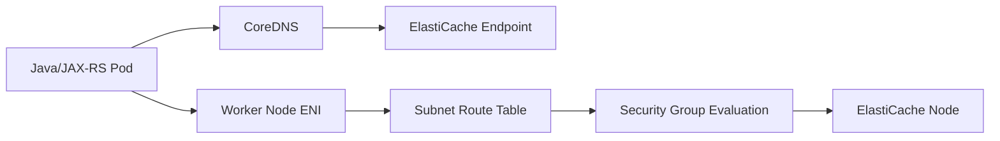
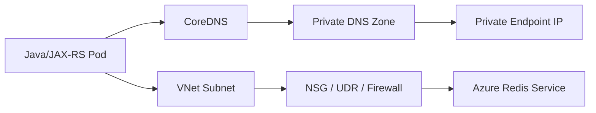

# Part 035 — Managed Redis on AWS and Azure

> Goal: understand Redis/Valkey as a managed cloud dependency, not merely as a fast key-value store. A senior backend engineer should be able to review its network path, identity/security model, memory pressure, failover behavior, client behavior, monitoring, cost, and production failure modes.

This part focuses on Redis/Valkey-like managed cache services in AWS and Azure:

- **AWS:** Amazon ElastiCache for Valkey / Redis OSS.
- **Azure:** Azure Cache for Redis and Azure Managed Redis. The exact product used must be verified internally because cloud product names, SKUs, retirement plans, and enterprise offerings can evolve.
- **Application context:** Java 17+ / JAX-RS / Jakarta RESTful services running on EKS, AKS, on-prem, or hybrid infrastructure.
- **Related systems:** PostgreSQL, Kafka, RabbitMQ, Camunda, NGINX, Kubernetes, service mesh, object storage, secret manager, observability platform, and CI/CD.

---

## 1. Core Mental Model

Redis is usually placed in the architecture to reduce latency, absorb read load, coordinate short-lived state, or keep ephemeral computation results close to the application.

It is **not automatically a durable source of truth**.

A production Redis design must answer these questions clearly:

1. Is Redis used as a **cache**, **session store**, **rate limiter**, **idempotency store**, **distributed coordination mechanism**, **queue-like buffer**, or **temporary workflow state store**?
2. What happens when Redis is unavailable?
3. What happens when Redis silently evicts keys?
4. What happens during failover?
5. What happens if the Java client retries aggressively?
6. What data is allowed to live in Redis?
7. Is the data recoverable from PostgreSQL, Kafka, RabbitMQ, Camunda history, or another source of truth?
8. Is Redis accessed privately from EKS/AKS/on-prem, or does it cross public internet/NAT unexpectedly?
9. Is Redis cost proportional to real business value, or is it hiding inefficient application/database design?

A safe senior-engineering assumption:

> Redis is a low-latency dependency with strict memory, connection, topology, and failover behavior. Treat it as a production system with explicit degradation rules.

---

## 2. Redis Usage Patterns in Enterprise Java Systems

Common usage in Java/JAX-RS backend systems:

| Pattern | Typical Use | Production Risk |
|---|---|---|
| Read-through cache | Cache database/API results | Stale data, stampede, inconsistent invalidation |
| Write-through / write-behind cache | Accelerate write path | Data loss or ordering bug if misused |
| Session store | Store user/session state | Login disruption during failover/eviction |
| Idempotency key store | Prevent duplicate command processing | TTL too short/long, race condition |
| Rate limiter | Protect APIs or downstream systems | Incorrect key cardinality, hot keys |
| Distributed lock | Coordinate critical sections | Deadlocks, unsafe lock expiry, split-brain-style bugs |
| Temporary workflow state | Short-lived orchestration state | Loss of state if Redis treated as durable |
| Feature computation cache | Store expensive calculation result | Staleness and invalidation complexity |

### Senior rule

Redis is safe when the business consequence of losing or recomputing data is understood.

If Redis loss causes permanent business data loss, then Redis is being used as a database and the architecture needs deeper review.

---

## 3. Concept: Cache vs Source of Truth

A cache duplicates data from a source of truth.

A source of truth owns the canonical state.

In a Quote & Order / CPQ / order-management style system, canonical state is usually in systems such as:

- PostgreSQL / managed PostgreSQL.
- Order/quote domain services.
- Event streams such as Kafka.
- Workflow engines such as Camunda.
- External product catalog or customer systems.

Redis may help with:

- Product catalog lookup acceleration.
- Quote calculation memoization.
- User session state.
- Duplicate request protection.
- API throttling.
- Short-lived workflow correlation.

But Redis should not silently become the only place where quote/order state exists.

---

## 4. AWS Implementation: Amazon ElastiCache for Valkey / Redis OSS

Amazon ElastiCache provides managed in-memory data stores. In the Redis-compatible family, modern deployments may use **Valkey** or **Redis OSS** depending on organizational standards and compatibility requirements.

Key AWS concepts:

- **Replication group:** logical Redis/Valkey deployment with primary and optional replicas.
- **Cluster mode disabled:** one shard, optional read replicas.
- **Cluster mode enabled:** multiple shards, data partitioned across slots.
- **Node group / shard:** partition of data with a primary and optional replicas.
- **Multi-AZ with automatic failover:** improves availability by promoting a replica when the primary fails.
- **Subnet group:** controls which VPC subnets ElastiCache nodes use.
- **Security group:** controls network access to Redis nodes.
- **Parameter group:** controls Redis/Valkey engine behavior.
- **Auth token / ACL / TLS:** security mechanisms depending on engine version and configuration.
- **Snapshot:** backup mechanism for supported configurations.
- **Maintenance window:** controlled time for service maintenance.
- **CloudWatch metrics:** primary observability surface.

### Cluster mode disabled

Use this when:

- Dataset fits on a single shard.
- Operational simplicity matters.
- Application/client stack does not need Redis Cluster semantics.
- You need a simpler endpoint model.

Risk:

- Vertical scaling has limits.
- Hot keys and memory pressure hit one primary.
- Write throughput is bounded by one shard.

### Cluster mode enabled

Use this when:

- Dataset or throughput exceeds one shard.
- You need horizontal scaling.
- Application/client supports Redis Cluster slot redirection.

Risk:

- Java client must correctly handle `MOVED` and `ASK` redirections.
- Multi-key commands may fail unless keys are hash-tagged into the same slot.
- Operational complexity increases.
- Debugging requires shard-level visibility.

### ElastiCache endpoint model

Common endpoints:

- **Primary endpoint:** writes in cluster-mode-disabled replication group.
- **Reader endpoint:** read distribution across replicas.
- **Configuration endpoint:** cluster topology discovery for cluster-mode-enabled deployments.
- **Node endpoint:** direct node access, usually not preferred for application code.

Application code should not hardcode node endpoints unless there is a strong operational reason.

---

## 5. Azure Implementation: Azure Cache for Redis and Azure Managed Redis

Azure has Redis-compatible managed offerings. Internal teams must verify which service and SKU are used.

Relevant Azure concepts:

- **Azure Cache for Redis:** managed Redis-compatible cache service.
- **Azure Managed Redis:** newer managed Redis Enterprise-based service in Azure contexts where available.
- **SKU / tier:** controls memory, availability, clustering, networking, persistence, and enterprise features.
- **Private Endpoint / Private Link:** private access from VNet.
- **Private DNS Zone:** DNS integration for private endpoint resolution.
- **Access keys / authentication / identity model:** depends on service and SKU capabilities.
- **TLS:** encrypted transport.
- **Persistence / backup:** available depending on SKU/service.
- **Azure Monitor metrics:** primary monitoring surface.
- **Diagnostic settings:** route logs/metrics to Log Analytics or other sinks where supported.

### Important Azure lifecycle caution

Do not assume every Azure Redis feature exists on every SKU.

Verify:

- Current service name and product roadmap.
- Retirement/migration notices for the specific service tier.
- Whether Private Link is supported.
- Whether clustering is supported.
- Whether persistence is supported.
- Whether managed identity or key-based access is used.
- Whether enterprise Redis features are enabled.

---

## 6. AWS vs Azure Concept Mapping

| Concern | AWS | Azure | Caveat |
|---|---|---|---|
| Managed Redis-compatible service | ElastiCache for Valkey / Redis OSS | Azure Cache for Redis / Azure Managed Redis | Verify product/SKU lifecycle |
| Network boundary | VPC subnet group + security group | VNet/subnet + Private Endpoint/NSG | The private access model differs |
| Private connectivity | VPC-native endpoint exposure via subnet/security group | Private Link / Private Endpoint | DNS behavior differs significantly |
| Scaling | Node type, shards, replicas, serverless options where used | SKU/tier, clustering, enterprise tiers | Feature availability depends on SKU |
| HA | Multi-AZ + automatic failover | Replication/HA depending on tier | Test client reconnect behavior |
| Backup | Snapshots where supported | Persistence/backup where supported | Treat cache backup differently from database backup |
| Metrics | CloudWatch | Azure Monitor | Metric names and dimensions differ |
| Auth | AUTH token / ACL / TLS | Access keys/TLS/identity depending on offering | Verify internal security standard |

---

## 7. Network Path from Java Pod to Redis

Typical EKS path:



Typical AKS path:



Key production point:

> A Redis timeout is often not a Redis problem. It may be DNS, route table, NSG/security group, private endpoint, firewall, TLS, client pool exhaustion, or node failover.

---

## 8. Java Client Considerations

Common Java clients:

- Lettuce.
- Jedis.
- Redisson.
- Spring Data Redis wrapper if used.
- Vendor-specific integration through framework libraries.

### Required client configuration review

Check:

- Connection timeout.
- Command timeout.
- Socket keepalive.
- TLS enabled.
- Authentication method.
- Cluster mode support.
- Topology refresh.
- DNS refresh behavior.
- Connection pool size.
- Retry behavior.
- Read-from-replica behavior.
- Serialization format.
- Compression usage.
- Circuit breaker integration.
- Metrics export.

### Timeout discipline

Redis is fast, but production networks are not magic.

A Java service should have:

- Small connect timeout.
- Bounded command timeout.
- Bounded retry count.
- Circuit breaker for non-critical cache calls.
- Fallback path when Redis is unavailable.
- Separate timeout budget from the end-to-end HTTP request timeout.

Bad pattern:

```text
HTTP request timeout = 30s
Redis command timeout = 30s
Downstream DB timeout = 30s
SDK retry also enabled
```

This creates request pile-up and thread exhaustion.

Better pattern:

```text
HTTP request timeout = 2s to 5s depending on API
Redis command timeout = tens/hundreds of milliseconds depending on use case
Fallback = miss/recompute/degrade
Retry = limited and jittered
```

The exact values must be based on internal SLO and latency profile.

---

## 9. Data Modeling in Redis

Redis data modeling is not only about keys and values. It is about lifecycle.

Key design questions:

- What is the key namespace?
- Does the key include tenant/customer/environment?
- Is the key high-cardinality?
- Is the key likely to become hot?
- What is the TTL?
- What happens when TTL expires?
- Is the value compressed?
- Is the value encrypted before storing?
- Is the value PII-sensitive?
- Can the value be reconstructed?
- What is the invalidation strategy?

### Key naming example

```text
env:service:domain:entity:id:purpose
prod:quote:pricing:quoteId:12345:calc:v2
prod:order:idempotency:commandId:abc-123
prod:api:ratelimit:tenant:tenant-001:endpoint:createQuote
```

Do not put secrets, credentials, raw tokens, or sensitive customer data in keys. Keys often appear in monitoring, debug output, or slow logs.

---

## 10. TTL and Eviction Strategy

TTL is a correctness decision.

Eviction is an emergency behavior.

They are not the same.

### TTL

TTL says: “This data is only valid for this duration.”

Use TTL for:

- Idempotency windows.
- Cache freshness.
- Temporary workflow correlation.
- Rate limit buckets.
- Session expiry.

### Eviction

Eviction says: “Redis is out of memory; it must remove something.”

Eviction policy must be reviewed because it can produce subtle correctness bugs.

Examples:

| Eviction Policy Concern | Impact |
|---|---|
| Evicting idempotency keys | Duplicate command may be accepted |
| Evicting session data | User is logged out or loses context |
| Evicting rate limit counters | Abuse protection weakens |
| Evicting pricing cache | DB/service load spikes |
| Evicting lock keys | Unsafe concurrent execution if lock design is weak |

A cache can tolerate eviction.

A correctness guard often cannot.

---

## 11. Distributed Lock Warning

Redis-based locks are common, but dangerous when treated casually.

Review:

- Lock TTL.
- Lock ownership token.
- Unlock safety.
- Clock assumptions.
- Failover behavior.
- Network partition behavior.
- Idempotency of the protected operation.
- Whether the lock is actually needed.

For critical quote/order state transitions, prefer database constraints, transactional state machines, optimistic locking, or workflow engine semantics where possible.

Use Redis locks only when the failure semantics are acceptable and tested.

---

## 12. Session Store Considerations

If Redis stores sessions:

- Session expiry must match security policy.
- Logout must invalidate server-side state.
- Session data must not include unnecessary PII.
- Redis failover must be tested against login flows.
- Large session payloads must be avoided.
- Session serialization must be version-tolerant.
- Blue/green deployments must handle old session formats.

For stateless JWT-based systems, Redis may still be used for revocation lists, refresh token state, or tenant-level rate limiting.

---

## 13. Idempotency Store Considerations

A robust idempotency key store must define:

- Key derivation.
- TTL.
- Request fingerprint.
- Response replay behavior.
- In-progress marker.
- Race handling.
- Duplicate detection semantics.
- Error replay policy.
- Cleanup behavior.

Bad idempotency design:

```text
SET key processed EX 60
```

This may fail under concurrent requests.

Better pattern:

- Use atomic write-if-absent semantics.
- Store state: `IN_PROGRESS`, `COMPLETED`, `FAILED_RETRYABLE`, `FAILED_FINAL`.
- Store request hash/fingerprint.
- Use TTL appropriate to business duplicate window.
- Ensure command handler remains idempotent even if Redis fails.

---

## 14. Security Baseline

Redis should not be treated as an internal toy service.

Review:

- Private network access only.
- No public exposure unless explicitly approved and strongly justified.
- TLS enabled if supported/required.
- Authentication enabled.
- ACLs used where available.
- Secrets stored in AWS Secrets Manager / Azure Key Vault / equivalent.
- No credentials in image, Git repo, Helm values, or logs.
- Security group / NSG minimum source scope.
- Audit logs and access evidence where supported.
- Sensitive data classification.

### Data privacy rule

Do not store PII, credentials, access tokens, customer secrets, or regulated data in Redis unless data classification, encryption, retention, and audit requirements are explicitly approved.

---

## 15. Observability Metrics

Minimum Redis metrics to monitor:

| Metric Area | What to Watch | Why |
|---|---|---|
| Availability | node status, failover events | Detect service disruption |
| Latency | command latency, network latency | Protect API p95/p99 |
| Memory | used memory, memory fragmentation, freeable memory | Detect eviction risk |
| Evictions | evicted keys | Correctness and performance risk |
| Connections | current connections, rejected connections | Detect client leak/pool exhaustion |
| CPU | engine CPU / host CPU | Detect saturation |
| Throughput | commands/sec, network bytes | Capacity planning |
| Cache quality | hit ratio / misses | Validate usefulness |
| Replication | replica lag, sync events | HA correctness |
| Errors | auth failures, timeouts, client exceptions | Security and client behavior |

### Application-level Redis metrics

The Java service should emit:

- Redis operation count by operation type.
- Latency histogram by operation type.
- Timeout count.
- Fallback count.
- Cache hit/miss count.
- Serialization failure count.
- Circuit breaker open count.
- Pool wait time.
- Command error category.

Cloud metrics alone are not enough.

---

## 16. Common Failure Modes

| Failure Mode | Symptom | Likely Root Cause | First Debug Move |
|---|---|---|---|
| Connection timeout | Java requests slow/fail | SG/NSG, route, firewall, private endpoint, DNS | Resolve DNS from pod and test TCP |
| Access denied/auth failure | Redis auth error | wrong secret, rotated key, ACL mismatch | Compare secret version and app env |
| TLS handshake failure | SSL exception | TLS mismatch, cert trust, proxy inspection | Test TLS with redis-cli/OpenSSL equivalent |
| MOVED/ASK errors | Cluster commands fail | client not cluster-aware | Validate client cluster mode config |
| High evictions | Cache misses spike | memory too small, TTL mismatch, hot dataset | Check memory and eviction policy |
| High latency | API p99 spike | CPU, network, slow commands, hot key | Inspect Redis metrics and app histograms |
| Failover spike | transient errors | primary promotion / topology refresh | Check failover events and client reconnect |
| Rejected connections | app errors under load | connection leak or max clients | Check pool size and current connections |
| Hot key | one shard saturated | skewed key distribution | Inspect top keys/command patterns if available |
| Stale reads | inconsistent data | read replica lag or cache invalidation bug | Check read-from-replica and invalidation logic |
| Cost spike | bill increases | oversizing, too many replicas, cross-zone traffic | Review capacity and traffic pattern |

---

## 17. Production Debugging Workflow

When Java service cannot use Redis:

1. **Identify blast radius**
   - One pod?
   - One namespace?
   - One cluster?
   - One region?
   - One tenant?
   - All workloads using Redis?

2. **Check application error category**
   - DNS failure.
   - TCP connection timeout.
   - TLS failure.
   - Authentication failure.
   - Command timeout.
   - Redis server error.
   - Serialization error.
   - Cluster redirection error.

3. **Check DNS from the same runtime context**
   - From the actual pod if allowed.
   - From a debug pod in same namespace/subnet.
   - Avoid testing only from laptop or cloud console.

4. **Check network path**
   - EKS: subnet, route table, security group, NACL, VPC Flow Logs.
   - AKS: subnet, NSG, UDR, firewall, Private Endpoint, Private DNS Zone, Network Watcher.

5. **Check secret/config**
   - Secret version.
   - Rotation time.
   - App reload behavior.
   - Kubernetes Secret/CSI mount state.

6. **Check Redis service health**
   - Failover events.
   - Node health.
   - Memory pressure.
   - CPU.
   - Connections.
   - Latency.
   - Evictions.

7. **Check Java client behavior**
   - Pool exhaustion.
   - Timeout value.
   - Retry storm.
   - Topology refresh.
   - Cluster mode support.
   - TLS/auth config.

8. **Apply safe mitigation**
   - Disable non-critical cache usage if feature flag exists.
   - Reduce concurrency if Redis is saturated.
   - Increase timeout only as a temporary mitigation and only if it does not violate API timeout budget.
   - Roll back recent config/client changes.
   - Escalate to platform/SRE for managed-service or network-level issue.

---

## 18. Capacity Planning

Capacity is not only memory size.

Review:

- Dataset size.
- Key count.
- Value size distribution.
- TTL distribution.
- Read/write ratio.
- Command complexity.
- Number of clients.
- Connection count per pod.
- Pod replica count.
- Shard count.
- Replica count.
- Expected failover behavior.
- Cross-AZ traffic.
- Backup/persistence overhead.

### Java connection count formula

Approximate worst-case connection count:

```text
total_connections = pod_replicas × connections_per_pod × redis_nodes_touched
```

For cluster mode, clients may open connections to multiple nodes.

This can surprise teams after HPA scales up.

---

## 19. Cost Model

Redis cost drivers:

- Node/SKU memory size.
- Number of shards.
- Number of replicas.
- Multi-AZ / zone redundancy.
- Backup/persistence.
- Data transfer across AZ/region.
- Private endpoint / networking cost.
- Monitoring/log ingestion.
- Overprovisioning for peak but low average utilization.
- Enterprise features.

Cost review question:

> Is Redis reducing a more expensive bottleneck, or is it masking an inefficient query/API design while adding another expensive production dependency?

---

## 20. PR Review Checklist

Ask these before approving Redis-related changes:

- What is Redis being used for?
- Is it cache or source of truth?
- What is the fallback if Redis fails?
- What is the TTL?
- What is the eviction impact?
- Is the key namespace tenant/environment-safe?
- Is data sensitive?
- Is TLS/auth enabled?
- Is secret retrieval secure?
- Is Redis accessed privately?
- Are client timeouts bounded?
- Is retry behavior safe?
- Is cluster mode supported by the client?
- Are cache metrics emitted by the app?
- Are cloud metrics monitored?
- Is failover tested?
- Is cost understood?
- Is there a runbook?

---

## 21. Internal Verification Checklist

Verify with platform/SRE/security/backend teams:

- Which Redis service is used: ElastiCache, Azure Cache for Redis, Azure Managed Redis, self-managed Redis, or another platform.
- Engine: Redis OSS, Valkey, Redis Enterprise, or other compatible engine.
- Region and AZ/zone placement.
- Cluster mode enabled or disabled.
- Shard count.
- Replica count.
- Multi-AZ / zone redundancy.
- Node type / SKU / tier.
- Private network path from EKS/AKS/on-prem.
- Security Group / NSG / firewall rules.
- Private DNS configuration.
- TLS requirement.
- Authentication mechanism.
- Secret storage location.
- Secret rotation process.
- Parameter group / server parameters.
- Backup/snapshot/persistence setting.
- Maintenance window.
- Monitoring dashboard.
- Alert rules.
- Eviction policy.
- Maxmemory configuration.
- Failover runbook.
- Last Redis-related incident.
- Cost dashboard and ownership tag.
- Data classification approval for anything stored in Redis.

---

## 22. Senior Engineer Summary

Redis is easy to adopt and hard to operate correctly at scale.

A senior backend engineer should treat Redis as a bounded, observable, private, secure, and failure-aware dependency.

The most important review questions are:

1. What correctness guarantee depends on Redis?
2. What happens when Redis is slow or unavailable?
3. Is client behavior bounded?
4. Is memory/eviction observable?
5. Is the network path private and understood?
6. Is cost justified?
7. Is there a tested failover/debugging runbook?

When those answers are unclear, Redis is not yet production-ready.

---

## References for Further Internal Alignment

- AWS Documentation: Amazon ElastiCache for Valkey and Redis OSS.
- AWS Documentation: ElastiCache replication groups, cluster mode, Multi-AZ, automatic failover, and monitoring.
- Microsoft Learn: Azure Cache for Redis.
- Microsoft Learn: Azure Managed Redis.
- Microsoft Learn: Azure Redis private endpoint / Private Link guidance.
- Redis/Valkey client documentation for the Java client used internally.
