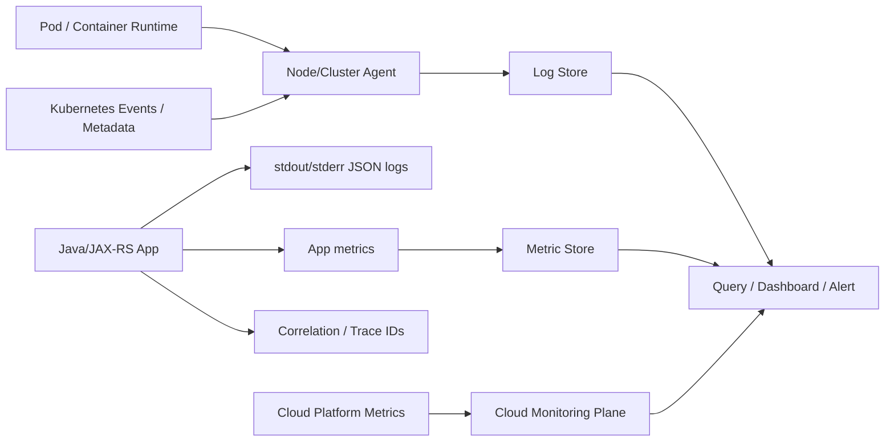
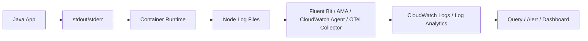

# Part 036 — Monitoring and Logs: CloudWatch and Azure Monitor

> Goal: build a practical mental model for cloud-native monitoring and logging. A senior backend engineer should know where telemetry comes from, where it flows, how to query it, how alerts are designed, why telemetry goes missing, how cost grows, and how to debug production incidents safely.

This part covers:

- **AWS CloudWatch:** metrics, logs, alarms, dashboards, Logs Insights, Container Insights.
- **Azure Monitor:** metrics, logs, Log Analytics workspace, KQL, alerts, Container Insights.
- **Application telemetry:** structured logs, metrics, correlation IDs, trace IDs, error categories, dependency timings.
- **Kubernetes telemetry:** container logs, pod metadata, node metrics, cluster events, workload health.
- **Production concerns:** retention, cost, missing logs, noisy alerts, high-cardinality metrics, privacy, and incident triage.

Distributed tracing is covered more deeply in Part 037. This part focuses on monitoring and logs.

---

## 1. Core Mental Model

Monitoring answers:

> Is the system healthy, and how do we know?

Logging answers:

> What happened in this process at this point in time?

Metrics answer:

> How is the system behaving over time?

Alerts answer:

> Which signals require human or automated action now?

Dashboards answer:

> Can an engineer quickly understand current and historical system behavior?

A production observability system is a **data pipeline**:



If one stage is broken, the production team may see no logs even though the application is emitting logs correctly.

---

## 2. Signals: Metrics, Logs, Traces, Events, Audit

| Signal | Best For | Not Best For |
|---|---|---|
| Metrics | Health, trends, alerting, SLOs | Detailed request narrative |
| Logs | Debug details, error context, business event breadcrumbs | High-volume numeric time-series |
| Traces | Cross-service request path | Bulk forensic search |
| Events | Kubernetes/cloud lifecycle changes | Application-level debugging alone |
| Audit logs | Who changed what and when | Application performance diagnosis |

A serious production system needs all of them, but not all of them belong in the same tool or retention tier.

---

## 3. AWS CloudWatch Mental Model

AWS CloudWatch is the central AWS-native monitoring surface for many AWS resources and applications.

Important concepts:

- **Namespace:** logical grouping of metrics, for example AWS service namespace or custom application namespace.
- **Metric:** numeric time-series value.
- **Dimension:** key/value metadata that splits a metric by resource, operation, or context.
- **Log group:** logical collection of logs.
- **Log stream:** stream within a log group, often one container/pod/task/instance stream.
- **Metric filter:** derive metrics from logs.
- **Logs Insights:** query engine for CloudWatch Logs.
- **Alarm:** evaluates metric or expression and changes state.
- **Dashboard:** visual view of metrics/logs.
- **Container Insights:** collects/aggregates metrics and logs from containerized workloads including EKS.
- **Embedded Metric Format:** application logs can embed metric data in structured JSON for CloudWatch to extract.

### CloudWatch for EKS

For EKS workloads, CloudWatch may receive:

- Container stdout/stderr logs.
- Node metrics.
- Pod metrics.
- Cluster metrics.
- Control plane logs if enabled.
- AWS Load Balancer logs if configured elsewhere and queried via storage/log pipelines.
- Application custom metrics.
- AWS service metrics such as RDS, ElastiCache, MSK, S3, NAT Gateway, ALB/NLB.

Do not assume all of these are enabled. Control plane logs and Container Insights often require explicit configuration and cost review.

---

## 4. Azure Monitor Mental Model

Azure Monitor is Azure's observability platform for metrics, logs, alerts, and insights.

Important concepts:

- **Azure Monitor Metrics:** time-series metrics for Azure resources and custom metrics.
- **Azure Monitor Logs:** log data stored/queryable through Log Analytics workspace.
- **Log Analytics workspace:** central workspace where logs are collected and queried using KQL.
- **KQL:** Kusto Query Language used for log analytics.
- **Diagnostic settings:** route platform logs/metrics from Azure resources to destinations such as Log Analytics.
- **Alerts:** rules that evaluate metrics, logs, or activity and trigger actions.
- **Action group:** notification/automation target for alerts.
- **Container Insights:** monitors AKS/containerized workloads.
- **Managed Prometheus / Azure Monitor workspace:** often used for Kubernetes metrics depending on platform design.
- **Application Insights:** application performance monitoring surface, often relevant to Java services but covered more deeply with tracing in Part 037.

### Azure Monitor for AKS

For AKS workloads, Azure Monitor may receive:

- Container logs.
- Pod/container/node inventory.
- Node and cluster metrics.
- Kubernetes events.
- Prometheus metrics if configured.
- Application logs.
- Azure resource metrics.
- Diagnostic logs from Application Gateway, Azure Load Balancer, Azure PostgreSQL, Azure Redis, Key Vault, and other resources.

Again: verify what is enabled. Many production blind spots come from assuming a workspace contains data it never receives.

---

## 5. Application Logging Standard for Java/JAX-RS

For enterprise backend systems, logs should be structured and machine-queryable.

Minimum log fields:

```json
{
  "timestamp": "2026-07-11T10:15:30.123Z",
  "level": "INFO",
  "service": "quote-service",
  "env": "prod",
  "version": "1.42.0",
  "traceId": "...",
  "spanId": "...",
  "correlationId": "...",
  "tenantId": "...",
  "requestId": "...",
  "operation": "CreateQuote",
  "httpMethod": "POST",
  "pathTemplate": "/quotes",
  "statusCode": 201,
  "durationMs": 123,
  "outcome": "success"
}
```

For errors:

```json
{
  "timestamp": "2026-07-11T10:15:30.123Z",
  "level": "ERROR",
  "service": "quote-service",
  "env": "prod",
  "traceId": "...",
  "correlationId": "...",
  "operation": "CreateQuote",
  "errorType": "DEPENDENCY_TIMEOUT",
  "dependency": "redis",
  "exceptionClass": "io.lettuce.core.RedisCommandTimeoutException",
  "message": "Redis command timed out",
  "retryable": true,
  "durationMs": 250,
  "safeDiagnosticCode": "REDIS_TIMEOUT"
}
```

### Do not log

- Passwords.
- API keys.
- OAuth tokens.
- Session IDs.
- Raw Authorization headers.
- Full request payloads containing PII.
- Payment data.
- Secrets from Key Vault / Secrets Manager.
- Presigned URL/SAS token query strings.
- Internal certificate material.

---

## 6. Logging Level Discipline

| Level | Use For | Avoid |
|---|---|---|
| ERROR | Failed operation requiring investigation or caller-visible failure | Expected validation failure |
| WARN | Degraded but handled condition | Normal business branching |
| INFO | Lifecycle, business-relevant event, request summary | High-volume loop logs |
| DEBUG | Local/dev diagnostic detail | Enabled permanently in prod without sampling |
| TRACE | Rare deep debugging | Production default |

A production system should be debuggable mostly from INFO/WARN/ERROR plus metrics/traces.

If DEBUG is required for every incident, the normal telemetry is insufficient.

---

## 7. Correlation and Causation

Every incoming request should have a stable correlation context.

Typical headers:

- `traceparent` for W3C trace context.
- `tracestate` where used.
- `X-Correlation-ID` if internal standard requires it.
- `X-Request-ID` if gateway/ingress injects it.

For Kafka/RabbitMQ:

- Propagate trace/correlation metadata in message headers.
- Include causation ID for event chains.
- Avoid relying only on payload fields.

For cloud SDK calls:

- Log dependency name.
- Log operation name.
- Log latency.
- Log error category.
- Include correlation ID in application logs around SDK calls.

---

## 8. Essential Application Metrics

Minimum metrics for a Java/JAX-RS backend:

| Metric | Dimensions | Why |
|---|---|---|
| HTTP request count | route, method, status, outcome | Traffic and error rate |
| HTTP latency histogram | route, method, status | p50/p95/p99 SLO |
| Dependency latency | dependency, operation, outcome | Detect slow Redis/DB/broker/cloud SDK |
| Dependency error count | dependency, errorType | Root-cause direction |
| JVM heap usage | service, pod | Memory leak/GC pressure |
| JVM GC pause | service, pod | Latency spikes |
| Thread pool active/queued | pool name | Saturation |
| DB connection pool usage | datasource | DB bottleneck |
| Redis connection pool usage | client | Cache bottleneck |
| Kafka/RabbitMQ publish/consume lag | topic/queue | Messaging health |
| Business operation count | operation, tenant if safe | Business health |

### High-cardinality warning

Do not use unbounded fields as metric dimensions:

- user ID.
- quote ID.
- order ID.
- request ID.
- raw URL with IDs.
- exception message.
- arbitrary customer-provided value.

High-cardinality metrics can become expensive and unusable.

---

## 9. AWS CloudWatch Logs Insights Examples

Find recent errors for one service:

```sql
fields @timestamp, level, service, correlationId, errorType, message
| filter service = "quote-service"
| filter level in ["ERROR", "WARN"]
| sort @timestamp desc
| limit 100
```

Find Redis timeouts:

```sql
fields @timestamp, service, correlationId, dependency, errorType, durationMs, message
| filter dependency = "redis"
| filter errorType like /TIMEOUT/
| stats count() as timeouts, pct(durationMs, 95) as p95 by bin(5m), service
```

Find slow HTTP routes:

```sql
fields @timestamp, service, pathTemplate, method, statusCode, durationMs
| filter service = "quote-service"
| stats count() as requests, pct(durationMs, 95) as p95, pct(durationMs, 99) as p99 by pathTemplate, method
| sort p99 desc
```

---

## 10. Azure Log Analytics / KQL Examples

Find recent application errors:

```kusto
ContainerLogV2
| where TimeGenerated > ago(1h)
| where LogMessage has "ERROR"
| project TimeGenerated, PodName, ContainerName, LogMessage
| order by TimeGenerated desc
| take 100
```

Find logs by correlation ID:

```kusto
ContainerLogV2
| where TimeGenerated > ago(24h)
| where LogMessage has "<correlation-id>"
| project TimeGenerated, NamespaceName, PodName, ContainerName, LogMessage
| order by TimeGenerated asc
```

Find pod restart indicators:

```kusto
KubePodInventory
| where TimeGenerated > ago(6h)
| summarize arg_max(TimeGenerated, *) by PodUid
| project TimeGenerated, Namespace, Name, ContainerRestartCount, PodStatus
| order by ContainerRestartCount desc
```

Actual table names vary by agent, workspace configuration, and Azure Monitor setup. Verify internally.

---

## 11. Kubernetes Logging Path

In Kubernetes, the usual pattern is:



Failure at any step can cause missing logs.

Common reasons:

- App writes logs to a file not collected by the agent.
- JSON logs are malformed.
- Agent DaemonSet is not running on some nodes.
- Namespace is excluded.
- Log group/workspace is wrong.
- IAM/RBAC permission issue.
- Log ingestion throttling.
- Retention expired.
- Query time range is wrong.
- Clock skew.
- Container restarted and old logs rotated.

---

## 12. Platform Logs vs Application Logs

Application logs tell you what the service code did.

Platform logs tell you what the infrastructure did.

Examples:

| Component | Useful Logs/Metrics |
|---|---|
| ALB/Application Gateway | access logs, health probe logs, 4xx/5xx, target latency |
| API Gateway/APIM | request logs, policy errors, auth failures, throttling |
| EKS/AKS | container logs, node health, pod restarts, control plane logs |
| PostgreSQL | connections, slow queries, replication, failover |
| Redis | evictions, CPU, memory, connections, failover |
| Kafka/RabbitMQ | broker health, consumer lag, publish errors |
| Key Vault/Secrets Manager | access failures, throttling, audit |
| NAT/Firewall | denied flows, SNAT exhaustion, egress volume |
| DNS | resolver logs if enabled, query failures, CoreDNS logs |

Incident triage should combine application and platform views.

---

## 13. Alert Design

Good alerts are actionable.

Bad alerts are merely interesting.

### Alert types

| Type | Example | Use |
|---|---|---|
| Symptom alert | API p95 latency above SLO | User-impact detection |
| Cause alert | Redis CPU high | Supporting diagnosis |
| Saturation alert | DB pool > 90% for 10m | Prevent outage |
| Availability alert | Pod crash loop | Workload health |
| Error budget alert | Burn rate too high | SLO governance |
| Security alert | public exposure or access denied spike | Security response |
| Cost alert | log ingestion spike | FinOps control |

### Senior alerting rule

Page humans for symptoms and urgent saturation.

Route cause alerts to dashboards/tickets unless they predict imminent user impact.

---

## 14. Dashboard Design

A production dashboard should answer:

1. Is there customer impact?
2. Which service is affected?
3. Which dependency is unhealthy?
4. Did this start after a deployment/change?
5. Is it one region/AZ/cluster/tenant or global?
6. Are errors increasing?
7. Is latency increasing?
8. Are resources saturated?
9. Are logs/traces available for examples?
10. What runbook should be followed?

### Recommended dashboard panels

- Request rate.
- Error rate.
- Latency p50/p95/p99.
- Top failing routes.
- Dependency latency and errors.
- JVM heap/GC/thread pools.
- Kubernetes pod restarts.
- CPU/memory by workload.
- Database connection pool and slow queries.
- Redis latency/evictions/connections.
- Broker lag/publish errors.
- Load balancer 4xx/5xx/target health.
- Recent deployments.
- Alert status.

---

## 15. Retention Strategy

Not all telemetry needs the same retention.

Example retention model:

| Telemetry | Suggested Treatment |
|---|---|
| High-volume debug logs | Short retention or disabled in prod |
| Application INFO/WARN/ERROR | Medium retention based on incident/RCA needs |
| Security/audit logs | Longer retention based on compliance |
| Metrics | Longer aggregated retention if useful for trend/capacity |
| Trace samples | Retention based on volume and debugging value |
| Business event logs | Governed by privacy/data-retention policy |

Verify internal regulatory/compliance requirements before setting retention.

---

## 16. Cost Awareness

Observability can become expensive.

Cost drivers:

- Log ingestion volume.
- Log retention duration.
- High-cardinality metrics.
- Custom metrics count.
- Container Insights / agent collection level.
- Verbose DEBUG logs in production.
- Repeated stack traces.
- Large payload logging.
- Cross-region log shipping.
- Query volume.
- Duplicate collection through multiple agents.

### Cost-safe logging practices

- Use structured summary logs.
- Avoid logging full payloads.
- Sample high-volume success logs when appropriate.
- Keep ERROR logs meaningful.
- Do not log repeated stack traces in tight loops.
- Control third-party library log levels.
- Set retention intentionally.
- Track ingestion by service/team/environment.

---

## 17. Privacy and Compliance

Logs are data.

They may contain sensitive information even when no one intended it.

Review:

- PII in request/response logs.
- Tokens in headers.
- SAS/presigned URLs.
- Customer identifiers.
- Stack traces exposing internal implementation.
- Error messages exposing policy/resource names.
- Retention policy.
- Access control to log workspace/log groups.
- Export/sharing of logs.
- Audit trail for log access if required.

A secure system treats logs as sensitive production data.

---

## 18. Common Failure Modes

| Failure Mode | Symptom | Likely Cause | Debug Move |
|---|---|---|---|
| Missing logs | No logs for pod/service | agent issue, wrong namespace, wrong workspace/log group, app logs to file | Check pod stdout and agent health |
| Ingestion delay | Logs appear late | ingestion throttling, backend delay, agent buffer | Compare pod time vs ingestion time |
| Wrong correlation | Cannot trace request | missing propagation, overwritten header | Inspect gateway and app filters |
| Log parsing broken | JSON fields absent | invalid JSON/multiline logs | Check raw log line |
| Alert noise | Too many pages | alert on cause/no threshold tuning | Review actionability and duration |
| No alert during incident | Missed detection | wrong metric, threshold too high, missing data handling | Review incident timeline |
| Metric cardinality explosion | Cost spike/query slow | IDs used as dimensions | Inspect metric dimensions |
| Retention gap | Old incident data gone | short retention | Check retention policy |
| PII leakage | Sensitive data in logs | payload/header logging | Redact and rotate exposed credentials if needed |
| Dashboard misleading | Green dashboard during outage | missing symptom metrics | Add user-impact/SLO panels |

---

## 19. Production Incident Triage Flow

When an incident starts:

1. **Confirm customer impact**
   - Error rate.
   - Latency.
   - Availability.
   - Business operation failure.

2. **Scope blast radius**
   - One route.
   - One service.
   - One namespace.
   - One cluster.
   - One region.
   - One tenant/customer.
   - One dependency.

3. **Check recent changes**
   - Deployment.
   - Config change.
   - secret/cert rotation.
   - DNS/network change.
   - cloud service maintenance.
   - scaling event.

4. **Check dependency health**
   - PostgreSQL.
   - Redis.
   - Kafka/RabbitMQ.
   - Key Vault/Secrets Manager.
   - Object storage.
   - API Gateway/APIM.
   - Load balancer/ingress.

5. **Find representative failed requests**
   - Correlation ID.
   - Trace ID.
   - Pod name.
   - Error type.
   - Dependency latency.

6. **Mitigate safely**
   - Rollback.
   - Disable feature flag.
   - Scale if saturation is clear.
   - Shed load if necessary.
   - Fail over only if runbook exists.

7. **Preserve evidence**
   - Timeline.
   - Dashboard screenshots/links.
   - Query results.
   - deployment IDs.
   - incident notes.

---

## 20. Internal Verification Checklist

Verify with platform/SRE/backend/security teams:

- AWS CloudWatch or Azure Monitor usage per environment.
- Log groups / Log Analytics workspaces.
- Which clusters send logs.
- Which namespaces are included/excluded.
- Agent used: CloudWatch Agent, Fluent Bit, Azure Monitor Agent, OpenTelemetry Collector, or another collector.
- Container Insights enabled or disabled.
- EKS control plane logs enabled or disabled.
- AKS control plane/resource logs diagnostic settings.
- Application log format standard.
- Correlation ID standard.
- Trace propagation standard.
- Metric naming convention.
- Alert ownership.
- Action groups / notification channels.
- On-call routing.
- Dashboard links.
- Retention policy.
- Log access RBAC/IAM.
- PII redaction policy.
- Cost allocation tags.
- Log ingestion budget.
- Last incident where telemetry was insufficient.
- Required compliance evidence.

---

## 21. PR Review Checklist

For any PR touching logging, metrics, alerts, dashboards, or telemetry agents:

- Does it preserve structured JSON logs?
- Does it include correlation ID and trace ID?
- Does it avoid PII/secrets?
- Are error logs actionable?
- Are metrics bounded in cardinality?
- Are route labels templated, not raw URLs?
- Are dependency calls timed?
- Are timeouts and errors classified?
- Are dashboards updated?
- Are alerts actionable?
- Is retention/cost considered?
- Does the change work in EKS/AKS/on-prem/hybrid?
- Does it support incident triage?
- Is there a runbook link?

---

## 22. Senior Engineer Summary

Monitoring and logs are not decoration. They are part of production correctness.

A senior backend engineer should be able to answer:

1. What telemetry proves the service is healthy?
2. What telemetry proves the customer is impacted?
3. Can we follow one request across gateway, service, dependency, and broker?
4. Are logs queryable by correlation ID?
5. Are alerts actionable and owned?
6. Are metrics low-cardinality and cost-controlled?
7. Are logs safe from PII/secrets?
8. Can we debug an incident without changing production first?

If not, the service is not production-observable yet.

---

## References for Further Internal Alignment

- AWS Documentation: Amazon CloudWatch metrics, logs, alarms, dashboards, and Logs Insights.
- AWS Documentation: CloudWatch Container Insights for EKS and containerized workloads.
- Microsoft Learn: Azure Monitor overview, metrics, logs, alerts, Log Analytics workspace, and KQL.
- Microsoft Learn: Kubernetes monitoring with Azure Monitor and Container Insights.
- Internal platform/SRE observability standards and runbooks.
