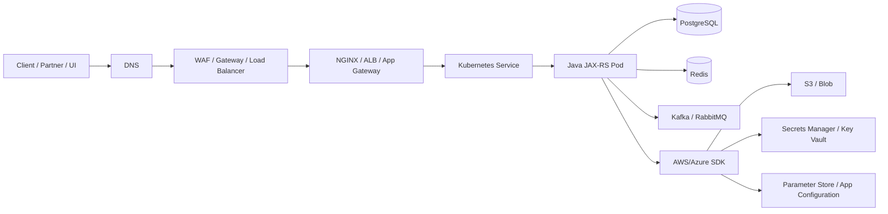
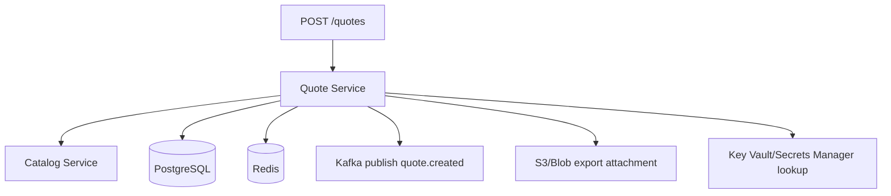
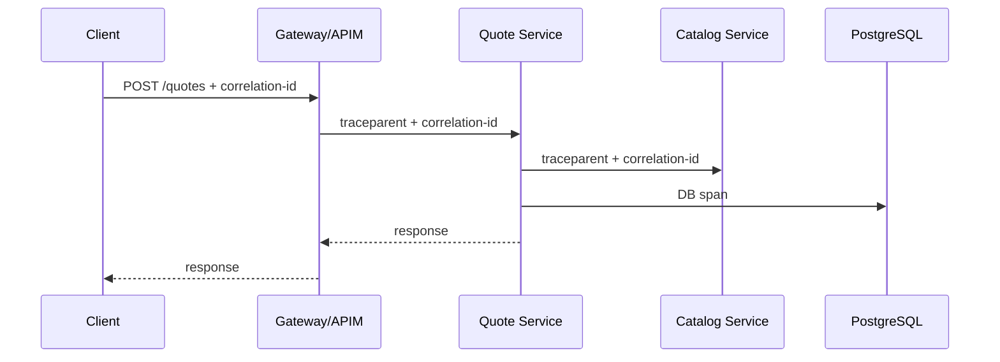
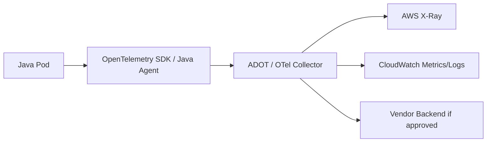
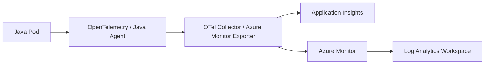

# Part 037 — Distributed Tracing and Application Observability

> Target pembaca: Senior Java/JAX-RS backend engineer yang perlu men-debug request lintas microservice, Kubernetes, broker, database, cloud SDK, managed service, dan private connectivity.

## 1. Konsep inti

Distributed tracing adalah teknik observability untuk mengikuti satu operasi bisnis atau technical request ketika request itu melewati banyak komponen: API gateway, ingress, service Java/JAX-RS, database, Kafka/RabbitMQ, Redis, cloud SDK, dan service lain.

Tracing bukan pengganti log dan metric.

Tracing menjawab pertanyaan seperti:

- request ini melewati service apa saja?
- latency terbesar ada di layer mana?
- call downstream mana yang gagal?
- apakah retry terjadi?
- apakah Kafka publish terjadi setelah HTTP request?
- apakah cloud SDK call ke S3/Blob/Secret Manager/Key Vault timeout?
- apakah error terjadi di service kita, dependency, network, identity, atau cloud platform?

Model observability yang matang biasanya memakai tiga sinyal utama:

| Signal | Menjawab | Contoh |
|---|---|---|
| Logs | Apa yang terjadi secara detail? | error stack trace, request validation failure, SQL exception |
| Metrics | Seberapa sering dan seberapa parah? | p95 latency, error rate, queue lag, retry count |
| Traces | Di mana dalam request path masalah terjadi? | span API gateway -> service A -> PostgreSQL -> Kafka |

OpenTelemetry menjadi standar de facto untuk instrumentation vendor-neutral. AWS dapat menerima trace melalui AWS X-Ray atau pipeline berbasis ADOT. Azure dapat menerima trace melalui Application Insights atau Azure Monitor OpenTelemetry pipeline.

## 2. Istilah penting

| Istilah | Makna praktis |
|---|---|
| Trace | Representasi satu perjalanan request atau workflow end-to-end. |
| Span | Satu unit kerja dalam trace, misalnya HTTP handler, SQL query, Kafka publish, atau S3 upload. |
| Trace ID | ID global yang mengikat seluruh span dalam satu trace. |
| Span ID | ID satu span tertentu. |
| Parent span | Span yang memanggil atau menyebabkan span lain. |
| Root span | Span pertama dalam trace, biasanya entry point request. |
| Correlation ID | ID aplikasi/bisnis untuk menghubungkan log, trace, dan request. Bisa sama atau berbeda dari trace ID. |
| Causation ID | ID event atau command yang menyebabkan event lain. Penting untuk async messaging. |
| Baggage | Metadata kontekstual yang ikut dipropagasikan. Harus dibatasi karena risiko leakage dan high cardinality. |
| Propagator | Mekanisme membawa context tracing via HTTP header atau message header. |
| Sampling | Keputusan menyimpan sebagian trace agar biaya dan volume tetap terkendali. |

## 3. Mental model trace untuk Java/JAX-RS service

Service Java/JAX-RS di Kubernetes biasanya berada di tengah banyak layer:



Trace yang baik tidak hanya memperlihatkan HTTP handler. Trace yang baik memperlihatkan dependency graph runtime:



Tanpa trace, engineer sering hanya melihat "request lambat". Dengan trace, engineer bisa melihat request lambat karena:

- DNS lookup lambat,
- connection pool exhausted,
- PostgreSQL query lambat,
- Kafka publish blocking,
- Redis timeout,
- SDK retry ke object storage,
- secret/config call terjadi di hot path,
- thread pool saturated,
- private endpoint routing bermasalah,
- downstream service returning 503,
- retry policy memperparah latency.

## 4. Apa yang harus di-instrument

Minimal instrumentation untuk service Java/JAX-RS production:

| Area | Yang perlu ditangkap |
|---|---|
| HTTP inbound | method, route template, status, latency, trace ID, correlation ID |
| HTTP outbound | target service, status, timeout, retry, latency |
| JAX-RS resource | route handler span, business operation name |
| PostgreSQL | query category, latency, error, pool wait time; hindari raw SQL penuh jika mengandung data sensitif |
| Kafka/RabbitMQ | publish/consume span, topic/queue, partition/routing key, lag context, message ID |
| Redis | command category, latency, timeout, pool issue; hindari key penuh bila mengandung PII |
| AWS/Azure SDK | service name, operation, region, endpoint, retry count, throttling, timeout |
| Kubernetes | pod, namespace, deployment, container, node, cluster |
| Config/secret | retrieval latency, cache hit/miss, error; jangan log value |
| Business operation | quote creation, order submission, catalog validation, approval workflow |

### Jangan instrument secara naif

Instrumentation buruk bisa menjadi risiko produksi:

- terlalu banyak span untuk operasi kecil,
- menyimpan payload request/response,
- menyimpan PII di attributes,
- high-cardinality label seperti user ID, quote ID, order ID sebagai metric dimension,
- sampling terlalu rendah sehingga incident tidak terlihat,
- sampling terlalu tinggi sehingga biaya membengkak,
- trace context tidak dipropagasikan ke async message,
- trace ID tidak dicetak di log,
- correlation ID tidak konsisten antar service.

## 5. Trace propagation melalui HTTP

Untuk HTTP, propagasi biasanya melalui header standar W3C Trace Context:

```text
traceparent: 00-<trace-id>-<span-id>-<flags>
tracestate: vendor-specific-state
```

Prinsip production:

- ingress/gateway tidak boleh membuang tracing headers tanpa alasan;
- service harus melanjutkan trace context yang diterima;
- outbound HTTP client harus mengirim trace context ke downstream;
- log harus menyertakan trace ID dan correlation ID;
- reverse proxy harus menjaga header penting selama aman;
- header internal tidak boleh dipakai sebagai authorization tanpa validasi.

Contoh flow:



## 6. Trace propagation melalui Kafka dan RabbitMQ

Async messaging lebih sulit daripada HTTP karena workflow tidak selalu punya immediate response.

Untuk Kafka/RabbitMQ:

- trace context harus dimasukkan ke message headers;
- consumer harus mengekstrak trace context dari headers;
- producer span dan consumer span harus memiliki hubungan sebab-akibat;
- correlation ID dan causation ID harus menjadi bagian dari message metadata;
- retry, dead-letter, reprocessing, dan outbox pattern harus terlihat.

Contoh metadata message:

```text
traceparent: 00-4bf92f3577b34da6a3ce929d0e0e4736-00f067aa0ba902b7-01
x-correlation-id: corr-20260711-quote-81f2
x-causation-id: cmd-submit-quote-9b21
x-message-id: evt-quote-created-44ae
```

Untuk event-driven system, jangan menganggap trace sama dengan transaksi sinkron.

Satu HTTP request bisa menghasilkan event yang diproses jauh setelah response dikirim. Dalam kasus seperti ini, trace perlu menggambarkan hubungan causality, bukan hanya parent-child blocking call.

## 7. Trace propagation melalui cloud SDK

AWS SDK dan Azure SDK sering muncul sebagai span dependency:

- `S3.PutObject`
- `S3.GetObject`
- `SecretsManager.GetSecretValue`
- `SSM.GetParameter`
- `KMS.Decrypt`
- `BlobClient.Upload`
- `SecretClient.GetSecret`
- `ConfigurationClient.GetConfigurationSetting`

Hal yang perlu terlihat:

- service cloud yang dipanggil,
- operation name,
- region,
- endpoint host,
- status/error code,
- latency,
- retry count,
- throttling,
- timeout,
- credential resolution error,
- private endpoint DNS result jika tersedia dari log/network diagnostic.

Cloud SDK call yang tampak kecil bisa menjadi akar masalah besar bila terjadi di hot path.

Contoh buruk:

```text
POST /orders
  -> read secret from Key Vault on every request
  -> read feature flag from App Configuration on every request
  -> upload attachment to Blob with default timeout
  -> retry 3x without business timeout budget
```

Contoh lebih aman:

```text
POST /orders
  -> use cached secret/config
  -> bounded timeout for object upload
  -> retry with jitter only for safe operation
  -> expose dependency metric and trace span
```

## 8. AWS implementation awareness

Di AWS, tracing bisa melibatkan beberapa opsi:

- OpenTelemetry SDK atau Java agent,
- AWS Distro for OpenTelemetry Collector,
- AWS X-Ray backend,
- CloudWatch metrics/logs correlation,
- EKS add-on atau sidecar/daemonset collector jika digunakan,
- AWS SDK instrumentation,
- X-Ray trace ID compatibility jika memakai X-Ray pipeline.

Mental model AWS:



AWS-specific review points:

- Apakah instrumentation memakai OpenTelemetry atau X-Ray SDK lama?
- Apakah X-Ray SDK/Daemon dependency masih relevan atau perlu migrasi ke OpenTelemetry?
- Apakah collector berjalan sebagai DaemonSet, sidecar, gateway, atau managed integration?
- Apakah collector punya IAM permission minimal?
- Apakah trace export menggunakan private networking atau public endpoint?
- Apakah trace sampling dikontrol centrally?
- Apakah trace attribute tidak mengandung PII?
- Apakah CloudWatch log menyertakan trace ID?

## 9. Azure implementation awareness

Di Azure, tracing umumnya terhubung ke:

- Azure Monitor Application Insights,
- Azure Monitor OpenTelemetry distro,
- Azure Monitor workspace atau Log Analytics,
- AKS monitoring integration,
- Java agent untuk Application Insights,
- OpenTelemetry exporter/collector.

Mental model Azure:



Azure-specific review points:

- Apakah menggunakan Application Insights Java agent atau OpenTelemetry SDK?
- Apakah instrumentation key/connection string disimpan aman?
- Apakah ingestion endpoint reachable dari private cluster?
- Apakah telemetry melewati proxy/firewall?
- Apakah sampling dikonfigurasi?
- Apakah dependency telemetry untuk HTTP, JDBC, messaging, dan Azure SDK aktif?
- Apakah role name/instance name sesuai service dan environment?
- Apakah telemetry dipisah per environment atau bercampur?

## 10. Java/JAX-RS implementation concerns

Untuk Java/JAX-RS, instrumentation bisa dilakukan dengan:

- OpenTelemetry Java agent,
- manual instrumentation menggunakan OpenTelemetry API,
- framework integration dari runtime yang dipakai,
- servlet filter atau JAX-RS filter,
- HTTP client interceptor,
- Kafka/RabbitMQ producer/consumer interceptor,
- JDBC instrumentation,
- SDK-specific instrumentation.

### Filter untuk correlation ID

Di JAX-RS, biasanya perlu filter untuk:

- menerima correlation ID dari request,
- membuat correlation ID jika belum ada,
- memasukkannya ke logging MDC,
- menambahkannya ke response header,
- memastikan outbound call membawa correlation ID.

Contoh konseptual:

```java
@Provider
public class CorrelationIdFilter implements ContainerRequestFilter, ContainerResponseFilter {
    public void filter(ContainerRequestContext requestContext) {
        String correlationId = requestContext.getHeaderString("X-Correlation-ID");
        if (correlationId == null || correlationId.isBlank()) {
            correlationId = UUID.randomUUID().toString();
        }
        MDC.put("correlationId", correlationId);
        requestContext.setProperty("correlationId", correlationId);
    }

    public void filter(ContainerRequestContext requestContext, ContainerResponseContext responseContext) {
        Object correlationId = requestContext.getProperty("correlationId");
        if (correlationId != null) {
            responseContext.getHeaders().putSingle("X-Correlation-ID", correlationId.toString());
        }
        MDC.remove("correlationId");
    }
}
```

Catatan production:

- validasi panjang correlation ID;
- jangan percaya correlation ID sebagai identity;
- jangan log header sensitif;
- jangan menaruh PII di trace attributes;
- gunakan route template, bukan path literal berisi ID.

## 11. Attribute dan cardinality discipline

Trace attributes harus membantu debugging, bukan menjadi data lake liar.

### Aman dan berguna

```text
service.name=quote-service
deployment.environment=prod
cloud.provider=aws
cloud.region=ap-southeast-1
k8s.namespace.name=quote-order-prod
http.route=/quotes/{quoteId}/submit
http.method=POST
http.status_code=202
messaging.system=kafka
messaging.destination.name=quote-events
db.system=postgresql
```

### Berisiko tinggi

```text
customer.email=...
customer.name=...
quote.full_payload=...
order.address=...
authorization.header=...
session.token=...
raw.sql.with.literal.values=...
```

### High cardinality risk

High cardinality berarti nilai attribute sangat banyak dan unik. Ini bisa merusak query performance dan menaikkan biaya.

Contoh berbahaya sebagai metric dimension:

- `userId`,
- `quoteId`,
- `orderId`,
- `sessionId`,
- `jwtSub`,
- `fullUrl`,
- `exceptionMessage` yang mengandung nilai dinamis.

Untuk trace, ID bisnis kadang berguna, tetapi harus tunduk pada privacy dan cost policy. Biasanya lebih aman menyimpan ID bisnis di log yang access-controlled, bukan sebagai indexed metric dimension.

## 12. Sampling strategy

Sampling mengontrol trace mana yang disimpan.

| Strategy | Kapan dipakai | Risiko |
|---|---|---|
| Always on | Debug sementara, lower environment, critical short window | Biaya tinggi, noise besar |
| Fixed ratio | Normal production baseline | Bisa melewatkan rare failure |
| Tail sampling | Simpan trace berdasarkan outcome, misalnya error/latency tinggi | Butuh collector/backend lebih matang |
| Route-based sampling | Endpoint penting disampling lebih tinggi | Salah konfigurasi bisa bias |
| Error-biased sampling | Simpan semua error trace | Error rendah tapi latency tinggi bisa terlewat |

Rule of thumb:

- simpan semua error trace jika cost memungkinkan;
- simpan trace latency tinggi;
- sampling lebih tinggi untuk endpoint critical;
- sampling lebih rendah untuk high-volume health check;
- jangan sampling health check seperti traffic bisnis;
- dokumentasikan sampling agar engineer tidak salah menyimpulkan data.

## 13. Failure modes

| Symptom | Kemungkinan penyebab | Cara deteksi |
|---|---|---|
| Trace terputus antar service | header traceparent dibuang gateway/ingress/client | cek headers di ingress, HTTP client interceptor, service logs |
| Log tidak bisa dikaitkan dengan trace | trace ID tidak masuk MDC/log pattern | cek logback/log4j pattern dan instrumentation |
| Kafka consumer trace tidak terhubung | trace context tidak masuk message headers | inspect message headers dan consumer instrumentation |
| Trace volume membengkak | sampling terlalu tinggi atau health check ikut disimpan | cek ingestion volume per route/service |
| Trace attribute mengandung PII | instrumentation menyimpan payload/header sensitif | audit attribute schema dan sample trace |
| Dependency latency tidak terlihat | HTTP/JDBC/SDK instrumentation belum aktif | cek span list dan instrumentation coverage |
| Cloud SDK timeout tidak terlihat | SDK call tidak dibungkus span/manual instrumentation | tambahkan SDK dependency spans dan metrics |
| Trace exporter gagal | collector unreachable, IAM/RBAC salah, endpoint blocked | cek collector logs, network path, identity permission |
| Application melambat setelah instrumentation | overhead agent/exporter tinggi | cek CPU/memory, exporter backpressure, sampling |
| Data antar environment tercampur | service.name/environment/resource attributes salah | cek resource attributes dan backend routing |

## 14. Debugging playbook

### 14.1 Request lambat

Urutan debug:

1. Cari trace berdasarkan correlation ID atau trace ID.
2. Lihat critical path, bukan hanya total span count.
3. Identifikasi span dengan latency terbesar.
4. Bedakan latency service sendiri vs downstream.
5. Cek retry count dan timeout.
6. Korelasikan dengan metrics p95/p99.
7. Cek log error pada trace ID yang sama.
8. Cek apakah ada deployment/config change sebelum latency naik.

### 14.2 502/503/504 dari gateway atau ingress

Cek:

- trace sampai service atau berhenti di gateway?
- gateway punya trace span?
- ingress meneruskan trace header?
- backend target healthy?
- service response timeout lebih lama dari gateway timeout?
- apakah pod menerima request?
- apakah application thread pool penuh?
- apakah downstream dependency menyebabkan request menggantung?

### 14.3 Message hilang atau double process

Cek:

- producer span ada?
- message ID ada?
- causation ID ada?
- consumer span ada?
- consumer group lag?
- retry/DLQ span?
- idempotency key?
- apakah trace sampling menyembunyikan consumer trace?

### 14.4 Cloud SDK timeout

Cek:

- span operation cloud service mana yang lambat?
- endpoint public atau private?
- region benar?
- retry berapa kali?
- error throttling atau network timeout?
- credential refresh terjadi di request path?
- DNS resolution ke private endpoint benar?
- NAT/firewall/proxy ikut jalur?

## 15. Observability design untuk quote/order system

Untuk domain CPQ/quote/order, trace sebaiknya memodelkan operasi bisnis besar:

- quote draft creation,
- catalog validation,
- pricing calculation,
- approval workflow,
- quote submission,
- order creation,
- document generation,
- event publication,
- status synchronization.

Contoh trace naming:

```text
QuoteResource.submitQuote
QuoteApplicationService.validateAndSubmit
CatalogClient.getProductConfiguration
PricingClient.calculatePrice
PostgreSQL.updateQuoteStatus
KafkaProducer.publishQuoteSubmitted
BlobStorage.uploadQuotePdf
```

Jangan menamai semua span dengan nama teknis generik seperti `execute`, `call`, `process`, atau `handle`. Nama span harus membantu membaca dependency graph.

## 16. Correctness concerns

Tracing tidak boleh mengubah correctness aplikasi.

Hal yang harus dijaga:

- instrumentation failure tidak boleh menggagalkan business request;
- exporter backpressure tidak boleh menahan request thread;
- manual span harus selalu ditutup;
- async context tidak boleh bocor antar request;
- MDC harus dibersihkan setelah request;
- retry akibat telemetry export harus dibatasi;
- sampling tidak boleh digunakan sebagai sumber truth untuk audit bisnis;
- trace bukan transactional log.

## 17. Security, privacy, and compliance concerns

Tracing sering tanpa sadar menangkap data sensitif.

Jangan simpan:

- token,
- password,
- secret value,
- authorization header,
- cookie,
- PII,
- full request body,
- full response body,
- raw SQL dengan literal sensitif,
- object storage signed URL penuh,
- SAS token,
- presigned URL query string.

Perlu diverifikasi:

- siapa yang bisa melihat trace,
- retention trace,
- masking/scrubbing policy,
- export ke vendor eksternal,
- data residency,
- environment separation,
- apakah trace menjadi compliance evidence atau hanya diagnostic signal.

## 18. Performance and cost concerns

Tracing punya overhead.

Sumber biaya dan overhead:

- span volume,
- attribute cardinality,
- log-trace correlation indexing,
- collector CPU/memory,
- network egress telemetry,
- backend ingestion,
- retention,
- query volume,
- always-on debug sampling.

Production guardrails:

- sampling policy eksplisit;
- health check route dikecualikan atau disampling rendah;
- payload tidak disimpan;
- attribute allowlist;
- exporter queue dibatasi;
- collector resources dimonitor;
- dashboard ingestion cost tersedia.

## 19. PR review checklist

Saat mereview PR yang menyentuh observability/tracing, tanyakan:

- Apakah trace context dipropagasikan inbound dan outbound?
- Apakah correlation ID masuk log?
- Apakah route menggunakan template, bukan full dynamic path?
- Apakah Kafka/RabbitMQ headers membawa trace context?
- Apakah cloud SDK dependency terlihat sebagai span/metric?
- Apakah timeout/retry/circuit breaker terlihat?
- Apakah ada PII/secret/token di attributes?
- Apakah sampling dipahami dan terdokumentasi?
- Apakah lower environment dan production memakai resource attributes berbeda?
- Apakah collector/exporter failure tidak mematikan service?
- Apakah dashboard membantu incident triage?
- Apakah alert berbasis symptom, bukan hanya telemetry pipeline health?

## 20. Internal verification checklist

Verifikasi di CSG/team/platform/SRE/security:

- Apakah standar tracing menggunakan OpenTelemetry?
- Apakah AWS memakai X-Ray, CloudWatch, ADOT, atau vendor lain?
- Apakah Azure memakai Application Insights, Azure Monitor OpenTelemetry, Log Analytics, atau vendor lain?
- Apakah ada standard `service.name`, `deployment.environment`, `cloud.region`, `k8s.namespace.name`?
- Apakah trace ID masuk structured logs?
- Apakah correlation ID header standard sudah ditentukan?
- Apakah Kafka/RabbitMQ trace propagation sudah distandardkan?
- Apakah cloud SDK instrumentation aktif?
- Apakah JDBC/PostgreSQL instrumentation aktif?
- Apakah Redis instrumentation aktif?
- Apakah sampling policy per environment tersedia?
- Apakah PII/secret scrubbing policy tersedia?
- Apakah telemetry endpoint private/public/proxy?
- Apakah collector berjalan sebagai sidecar, DaemonSet, gateway, atau managed add-on?
- Apakah dashboard incident utama sudah ada?
- Apakah incident notes lama menunjukkan gap observability?
- Apakah trace data boleh digunakan sebagai compliance evidence atau hanya debugging aid?

## 21. Production readiness checklist

Sebuah service Java/JAX-RS dianggap siap dari sisi tracing bila:

- inbound HTTP span tersedia;
- outbound HTTP span tersedia;
- PostgreSQL dependency span tersedia;
- Kafka/RabbitMQ publish/consume span tersedia jika digunakan;
- Redis span tersedia jika digunakan;
- AWS/Azure SDK dependency terlihat;
- trace ID dan correlation ID muncul di log;
- sensitive data tidak muncul di trace;
- sampling policy jelas;
- telemetry failure tidak mengganggu request path;
- collector/exporter dimonitor;
- dashboard mendukung debugging request lambat, error, timeout, dan dependency issue;
- runbook menjelaskan cara mencari trace dari incident alert.

## 22. Ringkasan mental model

Tracing yang matang bukan soal memasang agent lalu selesai.

Tracing yang matang berarti:

- setiap request punya identity teknis yang bisa diikuti;
- setiap dependency penting terlihat;
- async causality tidak hilang;
- telemetry aman dari PII/secret leakage;
- sampling tidak menyesatkan analisis;
- log, metric, dan trace saling menguatkan;
- engineer bisa bergerak dari alert ke root cause dengan cepat.

Untuk senior backend engineer, kemampuan terpenting bukan hanya membaca trace, tetapi memahami kapan trace tidak lengkap, bias, salah, terlalu mahal, atau membocorkan data.

## References

- OpenTelemetry Java instrumentation: https://opentelemetry.io/docs/languages/java/instrumentation/
- OpenTelemetry context propagation: https://opentelemetry.io/docs/concepts/context-propagation/
- AWS Distro for OpenTelemetry Java and X-Ray: https://docs.aws.amazon.com/xray/latest/devguide/xray-java-opentel-sdk.html
- AWS X-Ray instrumentation guidance: https://docs.aws.amazon.com/xray/latest/devguide/xray-instrumenting-your-app.html
- Azure Monitor Application Insights for Java: https://learn.microsoft.com/en-us/azure/azure-monitor/app/java-standalone-config
- Azure Monitor OpenTelemetry configuration: https://learn.microsoft.com/en-us/azure/azure-monitor/app/opentelemetry-configuration
