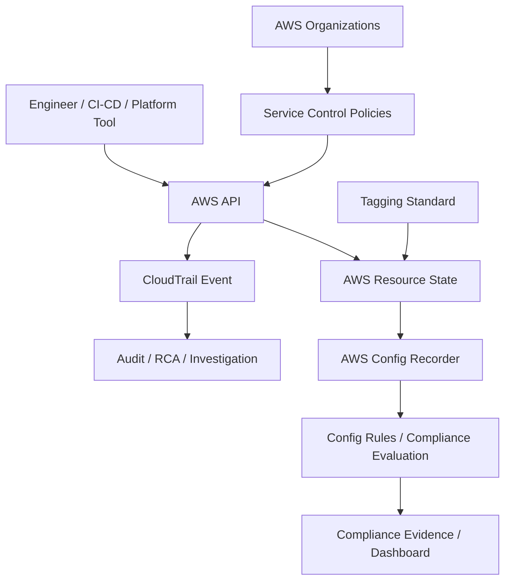
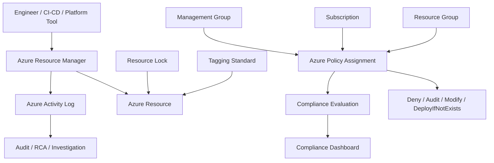

# Part 038 — Audit, Governance, and Cloud Policy

> Target pembaca: Senior Java/JAX-RS backend engineer yang perlu memahami bagaimana perubahan cloud dikontrol, diaudit, dibuktikan, dan dicegah agar tidak menjadi incident/security finding.

## 1. Konsep inti

Cloud governance adalah mekanisme untuk memastikan resource cloud dibuat, diubah, digunakan, dan dihapus sesuai standar organisasi.

Audit adalah kemampuan menjawab:

- siapa melakukan apa?
- kapan perubahan terjadi?
- dari mana perubahan dilakukan?
- resource apa yang terdampak?
- apakah perubahan sesuai policy?
- apakah perubahan menyebabkan incident?
- apakah kita bisa membuktikan compliance?

Cloud policy adalah guardrail yang mengatur apa yang boleh dan tidak boleh dilakukan di cloud.

Untuk backend engineer, governance bukan sekadar urusan platform/security team. Banyak PR backend dapat menyentuh governance secara tidak langsung:

- menambah IAM permission untuk service account;
- membuat bucket/container baru;
- membuka security group/NSG;
- menambah public ingress;
- mengubah private endpoint;
- menambah secret/config;
- mengubah Terraform module;
- menambah log dengan data sensitif;
- mengubah retention;
- membuat cross-account/cross-subscription access.

## 2. Mengapa governance ada

Tanpa governance, cloud cepat berubah menjadi sistem yang sulit dikontrol:

- resource dibuat manual di console;
- public IP muncul tanpa review;
- IAM permission melebar;
- environment dev bisa menyentuh prod;
- tag cost hilang;
- log retention tidak konsisten;
- secret disimpan di tempat salah;
- encryption tidak aktif;
- backup tidak ada;
- audit evidence tidak lengkap;
- incident sulit direkonstruksi.

Governance yang baik tidak harus memperlambat delivery. Governance yang baik memberi guardrail agar delivery tidak menghasilkan risiko tersembunyi.

## 3. Control plane vs data plane audit

Penting membedakan control plane dan data plane.

| Plane | Contoh aktivitas | Dampak audit |
|---|---|---|
| Control plane | create VPC, update IAM policy, delete Key Vault, modify load balancer, change route table | Perubahan konfigurasi cloud. Biasanya masuk CloudTrail/Activity Log. |
| Data plane | read object from S3/Blob, query database, publish Kafka message, get secret value | Aktivitas terhadap data. Audit bergantung service dan konfigurasi logging. |

Banyak engineer hanya melihat control plane audit. Padahal privacy/compliance sering membutuhkan data plane audit juga.

Contoh:

- Membuat bucket adalah control plane.
- Membaca object dari bucket adalah data plane.
- Membuat Key Vault adalah control plane.
- Membaca secret adalah data plane.
- Membuat role assignment adalah control plane.
- Menggunakan token untuk mengakses service adalah data plane/runtime behavior.

## 4. AWS governance mental model

Komponen AWS yang sering relevan:

| Area | AWS component | Fungsi |
|---|---|---|
| Organization boundary | AWS Organizations | Struktur account, OU, policy pusat |
| Permission guardrail | Service Control Policy | Batas maksimum permission untuk account/OUs |
| Audit event | AWS CloudTrail | Rekam API activity user, role, service |
| Resource state | AWS Config | Melihat konfigurasi resource dan perubahan state dari waktu ke waktu |
| Compliance rule | AWS Config Rules | Evaluasi resource terhadap rule tertentu |
| Tagging | AWS resource tags | Ownership, environment, cost allocation, compliance metadata |
| Preventive control | IAM, SCP, permission boundary | Mencegah aksi tidak valid |
| Detective control | CloudTrail, Config, Security Hub jika digunakan | Mendeteksi pelanggaran atau drift |

AWS governance flow:



## 5. Azure governance mental model

Komponen Azure yang sering relevan:

| Area | Azure component | Fungsi |
|---|---|---|
| Tenant identity | Microsoft Entra ID | Identity provider dan principal |
| Management hierarchy | Management Group | Struktur governance di atas subscription |
| Subscription boundary | Azure Subscription | Boundary billing, quota, access, resource management |
| Resource grouping | Resource Group | Lifecycle dan ownership grouping |
| Permission model | Azure RBAC | Role assignment pada scope tertentu |
| Audit event | Azure Activity Log | Control plane events untuk subscription resources |
| Policy | Azure Policy | Enforce standard dan compliance at-scale |
| Policy grouping | Initiative | Kumpulan policy untuk tujuan tertentu |
| Protection | Resource Lock | Mencegah delete/modify accidental |
| Tagging | Azure tags | Ownership, environment, cost, compliance metadata |

Azure governance flow:



## 6. AWS CloudTrail

CloudTrail membantu audit, governance, dan compliance dengan merekam actions yang dilakukan oleh user, role, AWS service, SDK, CLI, atau console.

Hal yang perlu dipahami backend engineer:

- CloudTrail dapat menunjukkan siapa mengubah IAM policy, security group, route table, load balancer, KMS key, secret, bucket policy, dan resource lain.
- CloudTrail berguna saat incident terjadi setelah perubahan cloud.
- CloudTrail event tidak otomatis berarti perubahan dilakukan lewat console; CI/CD, Terraform, SDK, dan automation juga muncul sebagai principal/API caller.
- CloudTrail harus tersedia lintas account/region sesuai policy organisasi.
- Event retention dan export ke S3/CloudWatch/SIEM perlu diverifikasi.

Contoh pertanyaan saat debugging:

```text
Siapa yang mengubah security group sebelum service mulai timeout?
Apakah route table berubah sebelum private endpoint unreachable?
Apakah role policy berubah sebelum AccessDenied muncul?
Apakah secret deleted/rotated sebelum service gagal start?
Apakah ALB listener rule berubah sebelum 404/503 muncul?
```

CloudTrail bukan replacement untuk application audit log. CloudTrail menjawab perubahan cloud API, bukan semua business action dalam aplikasi.

## 7. AWS Config

AWS Config memberikan detail konfigurasi resource, hubungan antar resource, dan perubahan konfigurasi dari waktu ke waktu.

Gunanya:

- melihat state resource historis;
- mendeteksi drift;
- mengevaluasi compliance rule;
- membuktikan resource encrypted, tagged, private, atau sesuai baseline;
- membantu RCA saat konfigurasi berubah.

Contoh Config rule yang relevan:

- S3 bucket public access blocked;
- EBS volume encrypted;
- security group tidak membuka `0.0.0.0/0` untuk port sensitif;
- CloudTrail enabled;
- required tags exist;
- RDS backup enabled;
- IAM password policy configured.

Untuk backend engineer, AWS Config penting saat PR/IaC membuat resource baru. Resource yang tidak comply bisa diblokir, ditandai non-compliant, atau diremediasi tergantung policy internal.

## 8. AWS Service Control Policies

Service Control Policy atau SCP adalah guardrail di AWS Organizations yang menentukan maximum available permissions untuk account atau OU.

Poin penting:

- SCP tidak memberikan permission.
- SCP membatasi permission maksimum.
- IAM policy masih diperlukan untuk memberikan permission actual.
- Jika SCP deny suatu action, role admin sekalipun di account tersebut tidak bisa melakukan action itu.
- SCP sering digunakan untuk mencegah region tertentu, public exposure, disabling audit logs, deleting security resources, atau penggunaan service yang tidak disetujui.

Contoh dampak ke backend/platform work:

```text
Terraform plan ingin membuat resource di region yang tidak diizinkan -> gagal.
CI/CD role punya IAM Allow, tetapi SCP Deny -> AccessDenied.
Engineer mencoba disable CloudTrail -> diblokir SCP.
Workload butuh service baru -> harus minta policy exception atau update landing zone.
```

Debugging AccessDenied di AWS harus mempertimbangkan:

- identity policy,
- resource policy,
- permission boundary,
- session policy,
- SCP,
- VPC endpoint policy,
- KMS key policy,
- explicit deny.

## 9. Azure Activity Log

Azure Activity Log mencatat control plane events di Azure subscription, seperti create/update/delete resource, role assignment, policy assignment, dan administrative events.

Gunanya:

- RCA perubahan resource;
- audit siapa mengubah konfigurasi;
- mendeteksi manual change;
- investigasi deletion/modification;
- export ke Log Analytics/Event Hub/Storage untuk retensi dan SIEM.

Contoh pertanyaan saat debugging:

```text
Siapa mengubah NSG rule sebelum pod-to-database gagal?
Apakah Private Endpoint dihapus atau berubah?
Apakah role assignment managed identity dihapus?
Apakah Application Gateway rule berubah?
Apakah Key Vault access policy/RBAC berubah?
Apakah AKS node pool di-scale down manual?
```

Activity Log terutama control plane. Untuk data plane, perlu diagnostic settings/service-specific logs.

## 10. Azure Policy

Azure Policy digunakan untuk enforce organizational standards dan assess compliance at scale.

Azure Policy dapat:

- audit resource yang tidak comply;
- deny create/update resource yang tidak sesuai;
- modify resource, misalnya menambahkan tag;
- deployIfNotExists, misalnya menambahkan diagnostic setting;
- mengelompokkan beberapa policy dalam initiative;
- mengevaluasi compliance pada management group, subscription, resource group, atau resource scope.

Contoh policy yang umum:

- deny public IP untuk resource tertentu;
- require tag `owner`, `environment`, `costCenter`;
- require diagnostic settings;
- require private endpoint;
- require encryption;
- restrict allowed regions;
- restrict allowed SKUs;
- enforce AKS security baseline;
- prevent insecure TLS version.

Dampak ke backend engineer:

- Terraform apply bisa gagal karena policy deny;
- resource berhasil dibuat tetapi ditandai non-compliant;
- policy modify bisa menambah tag otomatis;
- deployIfNotExists bisa membuat resource pendukung;
- policy evaluation delay bisa membuat compliance dashboard tidak real-time.

## 11. Resource locks

Azure Resource Lock dapat mencegah delete atau modify pada subscription, resource group, atau resource.

Tipe umum:

| Lock | Efek |
|---|---|
| CanNotDelete | Resource bisa dibaca/diubah, tetapi tidak bisa dihapus. |
| ReadOnly | Resource tidak bisa diubah atau dihapus. |

Resource lock berguna untuk resource kritikal seperti:

- production resource group,
- Log Analytics workspace,
- Key Vault,
- DNS zone,
- networking hub,
- private DNS zone,
- critical storage account,
- monitoring resource.

Risiko:

- deployment gagal karena lock;
- emergency fix tertahan;
- lock dipasang di scope terlalu luas;
- runbook tidak menjelaskan siapa boleh melepas lock.

## 12. Tagging policy

Tagging terlihat sederhana, tetapi sangat penting untuk governance.

Tag umum:

```yaml
owner: quote-order-team
application: quote-order
environment: prod
costCenter: csg-xxx
businessUnit: bss
confidentiality: internal
managedBy: terraform
repository: quote-order-iac
dataClassification: confidential
```

Gunanya:

- cost allocation,
- ownership,
- incident routing,
- compliance grouping,
- lifecycle management,
- automation targeting,
- reporting.

Failure mode tagging:

- resource tidak punya owner;
- cost tidak bisa dialokasikan;
- cleanup script salah target;
- policy deny karena tag wajib hilang;
- tag environment salah sehingga dashboard tercampur;
- tag `managedBy` salah sehingga resource manual dianggap IaC-managed atau sebaliknya.

## 13. Change traceability

Untuk production system, perubahan cloud harus bisa ditelusuri dari:

```text
Business/technical reason
  -> ADR / ticket / story
  -> PR IaC / app config / Helm values
  -> CI/CD run
  -> Cloud API call
  -> CloudTrail / Activity Log event
  -> Resource state
  -> Monitoring signal
  -> Incident/RCA if failure occurs
```

Traceability yang buruk membuat RCA menjadi spekulatif.

Minimum evidence chain:

- ticket/story ID,
- PR link,
- approver,
- pipeline run ID,
- Terraform plan output,
- apply timestamp,
- cloud audit event,
- resource diff,
- smoke test result,
- rollback plan.

## 14. Policy-as-code

Policy-as-code berarti governance rule disimpan, direview, dites, dan dipromosikan seperti code.

Contoh:

- Terraform modules dengan guardrail;
- OPA/Rego policy untuk Kubernetes/IaC;
- Checkov/tfsec/Trivy scanning;
- Azure Policy definitions as code;
- AWS Config custom rule;
- SCP JSON managed in repo;
- CI validation untuk required tags/security rules;
- GitOps policy enforcement.

Manfaat:

- reviewable,
- versioned,
- auditable,
- repeatable,
- bisa diuji di sandbox,
- mengurangi manual exception.

Risiko:

- policy terlalu ketat memblokir delivery;
- policy terlalu longgar hanya menjadi checklist palsu;
- exception tidak punya expiry;
- policy change langsung ke prod tanpa staged rollout;
- engineer tidak tahu policy mana yang memblokir apply.

## 15. Drift detection

Drift terjadi ketika actual cloud state berbeda dari desired state.

Sumber drift:

- manual console change;
- hotfix saat incident;
- automation di luar pipeline;
- cloud provider default berubah;
- policy modify effect;
- Terraform state tidak sinkron;
- resource di-import sebagian;
- GitOps sync disabled.

Dampak drift:

- next apply menghancurkan perubahan manual;
- security posture tidak sesuai baseline;
- dashboard tidak sesuai realitas;
- incident sulit direkonstruksi;
- environment tidak konsisten.

Deteksi drift:

- Terraform plan berkala;
- AWS Config configuration history;
- Azure Policy compliance;
- cloud audit logs;
- GitOps drift detection;
- Kubernetes diff;
- resource inventory comparison.

## 16. Governance impact ke Java/JAX-RS backend

Backend engineer perlu peduli governance karena aplikasi sering bergantung pada resource cloud:

| Perubahan governance | Dampak ke aplikasi |
|---|---|
| IAM/RBAC role dipersempit | SDK call mendapat AccessDenied |
| Key Vault/Secrets Manager policy berubah | aplikasi gagal start atau secret refresh gagal |
| Private endpoint policy berubah | dependency unreachable |
| DNS zone berubah | service resolving ke IP salah |
| Storage policy berubah | upload/download gagal |
| KMS key disabled | data tidak bisa decrypt |
| Log retention berubah | RCA kehilangan evidence |
| WAF/policy berubah | API request legitimate diblokir |
| Region/SKU policy berubah | pipeline gagal deploy |
| Tag policy berubah | Terraform apply denied |

Application readiness harus memasukkan governance failure mode, bukan hanya business logic failure.

## 17. Governance impact ke PostgreSQL, Kafka, RabbitMQ, Redis, Camunda, NGINX

| Komponen | Governance concern |
|---|---|
| PostgreSQL | private access, backup policy, PITR, encryption, maintenance window, parameter drift, audit logging |
| Kafka/MSK/Event Hubs | private connectivity, auth, encryption, retention, broker upgrade, topic governance |
| RabbitMQ/Amazon MQ | management access, TLS, credential rotation, queue retention, HA policy |
| Redis | private access, AUTH/ACL, eviction policy, encryption, backup, failover config |
| Camunda | database access, worker identity, process audit data retention, secret/config access |
| NGINX/Ingress | TLS policy, allowed ciphers, WAF integration, access logs, public/private exposure |

Governance review harus melihat dependency graph, bukan resource secara terpisah.

## 18. Kubernetes governance touchpoints

Di EKS/AKS, governance bersinggungan dengan:

- cluster creation policy,
- public/private endpoint,
- node pool SKU/instance type,
- image registry policy,
- admission control,
- pod security baseline,
- namespace ownership,
- service account permissions,
- workload identity,
- network policy,
- ingress annotation,
- secret integration,
- logging/monitoring add-ons,
- upgrade policy.

Contoh production issue:

```text
Policy baru mewajibkan private cluster endpoint.
CI/CD runner lama berada di network yang tidak bisa reach private endpoint.
Deployment mulai gagal walaupun manifest aplikasi tidak berubah.
```

Governance change harus diuji terhadap deployment path dan operational path.

## 19. Failure modes

| Symptom | Kemungkinan akar masalah | Cara cek |
|---|---|---|
| Terraform apply AccessDenied | SCP, Azure Policy deny, RBAC scope salah, permission boundary | CloudTrail/Activity Log, policy assignment, IAM/RBAC evaluation |
| Resource tidak bisa dibuat di region tertentu | allowed region policy | SCP/Azure Policy, landing zone docs |
| Public IP creation gagal | deny public IP policy | policy compliance event |
| Service tiba-tiba AccessDenied | IAM/RBAC/Key Vault policy berubah | CloudTrail/Activity Log sebelum waktu incident |
| Resource hilang | manual delete, pipeline destroy, policy remediation | audit log, pipeline run, Config/resource history |
| Cost tidak teralokasi | missing/wrong tag | tag compliance dashboard |
| Logs tidak tersedia untuk RCA | diagnostic setting tidak aktif, retention terlalu pendek | logging config, policy compliance |
| CI/CD gagal setelah governance update | policy baru belum dikomunikasikan | change record, policy assignment history |
| Manual emergency change hilang | Terraform/GitOps reconcile | IaC state, GitOps sync event |
| Compliance dashboard merah | policy drift, resource baru tidak mengikuti module | Azure Policy/AWS Config findings |

## 20. Production debugging playbook

### 20.1 AccessDenied setelah deployment

1. Ambil exact error message.
2. Identifikasi principal runtime: IAM role, service account, managed identity, service principal.
3. Cek apakah error control plane atau data plane.
4. Cek CloudTrail/Activity Log untuk policy/role assignment changes.
5. Cek SCP/Azure Policy/permission boundary.
6. Cek resource policy: bucket, key, secret, endpoint, queue.
7. Cek KMS/Key Vault permission.
8. Cek apakah credential cache masih memakai token lama.
9. Cek apakah deployment mengubah namespace/service account/client ID.
10. Rollback hanya setelah memahami apakah rollback resource atau identity yang dibutuhkan.

### 20.2 Resource drift terdeteksi

1. Bandingkan desired state di repo dengan actual state.
2. Identifikasi actor dari audit log.
3. Tentukan apakah drift adalah emergency hotfix, manual mistake, atau automation.
4. Putuskan: import drift ke IaC, revert actual state, atau update desired state.
5. Buat RCA jika drift menyebabkan incident.
6. Tambahkan policy/guardrail jika drift bisa dicegah.

### 20.3 Policy deny saat deploy

1. Baca deny message secara lengkap.
2. Identifikasi policy assignment scope.
3. Cek apakah resource melanggar region, SKU, tag, public exposure, diagnostic, encryption, atau naming rule.
4. Jangan langsung minta exception sebelum memahami alasan policy.
5. Jika exception valid, minta exception dengan expiry dan risk acceptance.
6. Update module agar comply untuk deployment berikutnya.

## 21. Security and compliance evidence

Evidence yang biasanya dibutuhkan:

- CloudTrail/Activity Log event;
- Terraform plan/apply log;
- PR approval;
- policy compliance report;
- AWS Config resource timeline;
- Azure Policy compliance state;
- encryption setting screenshot/export;
- backup setting;
- diagnostic setting;
- IAM/RBAC assignment;
- secret rotation record;
- incident RCA;
- access review result.

Evidence harus:

- timestamped,
- tied to resource ID,
- tied to actor/principal,
- retained sesuai policy,
- exportable untuk audit,
- tidak bergantung pada ingatan engineer.

## 22. Cost governance

Governance juga menyentuh cost:

- required cost tags;
- budget alert;
- allowed SKU/instance type;
- log retention limit;
- NAT/data transfer monitoring;
- idle resource cleanup;
- reserved capacity governance;
- cross-region replication approval;
- environment TTL untuk sandbox;
- chargeback/showback.

Cost issue sering bukan bug aplikasi, tetapi governance gap.

Contoh:

```text
Service menambah debug log verbose.
Log ingestion naik 10x.
Tidak ada policy/alert untuk log volume.
Biaya observability melonjak.
```

## 23. PR review checklist

Saat mereview PR/IaC/ADR yang menyentuh cloud governance, tanyakan:

- Apakah resource dibuat lewat IaC, bukan manual?
- Apakah tags wajib lengkap?
- Apakah resource berada di region yang disetujui?
- Apakah public exposure benar-benar diperlukan?
- Apakah private endpoint/DNS sesuai standard?
- Apakah IAM/RBAC least privilege?
- Apakah ada SCP/Azure Policy yang akan memblokir?
- Apakah CloudTrail/Activity Log/diagnostic logs cukup untuk audit?
- Apakah AWS Config/Azure Policy compliance akan hijau?
- Apakah resource lock diperlukan?
- Apakah encryption dan key management sesuai baseline?
- Apakah backup/retention sesuai requirement?
- Apakah cost allocation jelas?
- Apakah rollback aman dari lock/policy?
- Apakah exception punya expiry dan owner?

## 24. Internal verification checklist

Verifikasi ke platform/SRE/security/backend team:

- AWS Organizations structure dan OU layout.
- Azure Management Group hierarchy.
- Account/subscription mapping per environment.
- CloudTrail setup: region coverage, retention, destination.
- Azure Activity Log export destination dan retention.
- AWS Config enabled atau tidak, rule apa saja yang aktif.
- Azure Policy assignments dan initiatives yang berlaku.
- SCP yang berlaku untuk account/OUs.
- Required tags dan enforcement mechanism.
- Naming convention.
- Resource lock policy.
- Manual change policy.
- Break-glass process.
- Exception process dan expiry requirement.
- Policy-as-code repository.
- Terraform/IaC repository.
- Drift detection cadence.
- Compliance dashboard.
- Audit evidence location.
- Incident notes terkait governance/policy failure.

## 25. Production readiness checklist

Sebuah cloud-backed Java/JAX-RS service dianggap siap dari sisi governance bila:

- semua cloud resource dikelola IaC;
- required tags lengkap;
- identity least privilege;
- public exposure direview;
- private endpoint/DNS sesuai standard;
- audit logs aktif;
- diagnostic logs aktif untuk resource kritikal;
- encryption dan key policy sesuai baseline;
- backup/retention jelas;
- policy compliance dicek sebelum production;
- drift detection tersedia;
- manual change process jelas;
- exception terdokumentasi dan punya expiry;
- rollback tidak diblokir oleh lock/policy yang tidak dipahami;
- evidence dapat ditemukan saat audit/RCA.

## 26. Senior engineer mental model

Jangan melihat governance sebagai penghalang. Lihat governance sebagai bagian dari production correctness.

Di sistem enterprise, correctness bukan hanya:

```text
API menghasilkan response benar.
```

Correctness juga berarti:

```text
Resource dibuat di boundary yang benar.
Identity punya permission yang benar.
Network tidak terbuka tanpa alasan.
Secret tidak bocor.
Audit trail tersedia.
Cost bisa dialokasikan.
Compliance bisa dibuktikan.
Incident bisa direkonstruksi.
Perubahan bisa di-rollback.
```

Senior backend engineer yang kuat di cloud tidak harus menjadi cloud admin, tetapi harus mampu membaca efek governance terhadap aplikasi, deployment, incident, cost, dan compliance.

## References

- AWS CloudTrail overview: https://docs.aws.amazon.com/awscloudtrail/latest/userguide/cloudtrail-user-guide.html
- AWS CloudTrail security best practices: https://docs.aws.amazon.com/awscloudtrail/latest/userguide/best-practices-security.html
- AWS Config overview: https://docs.aws.amazon.com/config/latest/developerguide/WhatIsConfig.html
- AWS Config managed rules: https://docs.aws.amazon.com/config/latest/developerguide/evaluate-config_use-managed-rules.html
- AWS Organizations Service Control Policies: https://docs.aws.amazon.com/organizations/latest/userguide/orgs_manage_policies_scps.html
- Azure Activity Log: https://learn.microsoft.com/en-us/azure/azure-monitor/platform/activity-log
- Azure Policy overview: https://learn.microsoft.com/en-us/azure/governance/policy/overview
- Azure Policy definition structure: https://learn.microsoft.com/en-us/azure/governance/policy/concepts/definition-structure-basics
- Azure resource locks: https://learn.microsoft.com/en-us/azure/azure-resource-manager/management/lock-resources
