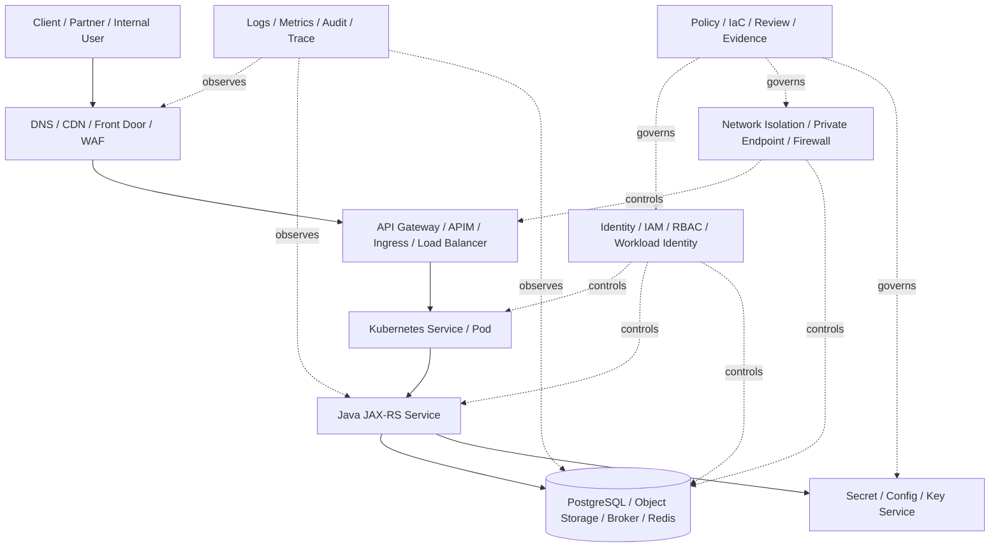

# Part 039 — Cloud Security Baseline

> Target pembaca: Senior Java/JAX-RS backend engineer yang perlu memahami baseline security AWS/Azure agar dapat mereview PR, membaca architecture decision, dan ikut triage production/security incident tanpa mengarang detail internal platform.

## 1. Konsep inti

Cloud security baseline adalah kumpulan minimum control yang harus benar sebelum workload dianggap layak production.

Baseline bukan satu service tunggal. Baseline adalah kombinasi dari:

- identity dan access control;
- network isolation;
- private connectivity;
- encryption;
- secret and key management;
- logging dan audit;
- vulnerability management;
- runtime hardening;
- exposure control;
- incident response readiness;
- compliance evidence.

Untuk Java/JAX-RS backend, security baseline menentukan apakah service boleh:

- menerima traffic dari internet atau hanya private network;
- mengakses PostgreSQL, Kafka, RabbitMQ, Redis, Camunda, object storage, secret manager, dan config service;
- membaca secret atau key;
- membuat signed URL/SAS/presigned URL;
- menulis log yang mengandung request metadata;
- melakukan outbound call ke service cloud atau on-prem;
- berjalan di EKS/AKS dengan workload identity.

Security baseline adalah pagar minimum. Ia tidak menggantikan threat modelling, penetration test, atau security architecture review untuk perubahan besar.

## 2. Kenapa baseline security ada

Tanpa baseline, cloud system gagal bukan karena satu bug besar, tetapi karena akumulasi celah kecil:

- role service terlalu luas;
- security group/NSG membuka port terlalu banyak;
- bucket/container dapat diakses publik;
- private endpoint tidak dipakai, traffic keluar via NAT/internet;
- secret disimpan di environment variable tanpa rotation;
- key policy terlalu permisif;
- log mengandung token atau PII;
- WAF ada tetapi tidak di-attach ke entry point yang benar;
- vulnerability scan ada tetapi finding tidak ditindaklanjuti;
- audit log tidak dikirim ke centralized retention;
- incident responder tidak punya akses saat production incident.

Baseline memaksa sistem punya default aman sebelum optimasi dilakukan.

## 3. Security baseline sebagai layered control

Security yang baik tidak bergantung pada satu lapisan.



Baseline harus dicek di semua layer. Jika satu layer gagal, layer lain harus tetap membatasi blast radius.

Contoh:

- Jika endpoint public tidak sengaja terbuka, WAF dan auth masih harus menahan akses.
- Jika pod compromised, IAM/RBAC harus membatasi data yang dapat diakses.
- Jika secret bocor, rotation dan audit harus membuat dampak terbatas dan terdeteksi.
- Jika outbound egress terbuka, firewall/proxy/private endpoint policy harus mencegah data exfiltration.

## 4. Minimum control map

| Area | Pertanyaan baseline | Failure jika salah |
|---|---|---|
| Identity | Apakah workload hanya punya permission yang dibutuhkan? | AccessDenied saat kurang; data breach saat terlalu luas. |
| Network | Apakah service hanya reachable dari source yang valid? | Public exposure, lateral movement, bypass gateway. |
| Private connectivity | Apakah dependency private benar-benar private? | Traffic keluar via internet/NAT, exposure, egress cost. |
| Encryption | Apakah data encrypted in transit dan at rest? | Data leakage, compliance failure. |
| Secret | Apakah secret punya lifecycle, rotation, dan audit? | Secret reuse, leaked credential, outage saat rotation. |
| Logging/audit | Apakah control plane dan runtime event bisa dilacak? | RCA gagal, compliance evidence hilang. |
| Vulnerability | Apakah image/dependency/config finding ditangani? | Known CVE masuk production. |
| Edge protection | Apakah public API punya WAF/rate limit jika diperlukan? | HTTP flood, exploit traffic, bot abuse. |
| Runtime | Apakah pod/container hardened? | Privilege escalation, filesystem abuse. |
| Incident response | Apakah ada runbook dan akses saat incident? | Triage lambat, recovery tidak terkendali. |

## 5. AWS-specific baseline

AWS baseline biasanya melibatkan beberapa control berikut.

### 5.1 IAM least privilege

Untuk service Java/JAX-RS di EKS, hindari static access key. Preferensi production biasanya:

- IAM Role for Service Account atau EKS Pod Identity jika platform menggunakannya;
- IAM policy scoped ke resource spesifik;
- IAM condition jika perlu membatasi source, tag, VPC endpoint, encryption context, atau request attribute;
- CloudTrail untuk audit;
- IAM Access Analyzer untuk menemukan policy yang terlalu terbuka.

Anti-pattern:

```json
{
  "Effect": "Allow",
  "Action": "*",
  "Resource": "*"
}
```

Yang harus dicari saat PR review:

- permission wildcard;
- resource wildcard;
- policy gabungan terlalu besar;
- trust policy bisa diasumsikan oleh principal yang tidak tepat;
- cross-account access tanpa alasan jelas;
- permission untuk delete/put policy/create user/create access key;
- data-plane permission seperti `s3:GetObject`, `secretsmanager:GetSecretValue`, `kms:Decrypt` terlalu luas.

### 5.2 Network isolation

AWS network baseline biasanya melibatkan:

- VPC segmentation;
- public/private subnet;
- route table yang jelas;
- Security Group sebagai stateful firewall;
- NACL sebagai subnet-level stateless control jika dipakai;
- VPC Endpoint/PrivateLink untuk private service access;
- VPC Flow Logs untuk investigasi;
- ingress path yang terkendali melalui ALB/NLB/API Gateway/CloudFront/WAF.

PR yang membuka Security Group harus menjawab:

- source CIDR/principal dari mana?
- port apa?
- protocol apa?
- kenapa bukan security group reference?
- apakah rule temporary atau permanen?
- apakah public internet benar-benar diperlukan?
- apakah rule berlaku ke prod?

### 5.3 Data and secret protection

AWS data protection baseline biasanya mencakup:

- S3 bucket block public access;
- bucket policy least privilege;
- SSE-S3 atau SSE-KMS sesuai requirement;
- Secrets Manager atau SSM Parameter Store SecureString;
- KMS key policy yang tidak terlalu luas;
- secret rotation jika credential mendukung;
- CloudTrail data events jika diperlukan untuk object access audit;
- logging redaction di aplikasi.

Untuk Java service, jangan log:

- Authorization header;
- cookie/session token;
- presigned URL penuh;
- secret value;
- database password;
- private key;
- payload PII tanpa masking.

### 5.4 Detection and response

AWS detection baseline dapat mencakup:

- CloudTrail;
- CloudWatch Logs/Metrics/Alarms;
- AWS Config;
- GuardDuty jika digunakan;
- Security Hub jika digunakan;
- Inspector untuk vulnerability scanning jika digunakan;
- WAF logs jika public edge dilindungi WAF.

Yang penting untuk backend engineer: tahu di mana mencari evidence saat incident, bukan menghafal semua service security.

## 6. Azure-specific baseline

Azure baseline biasanya melibatkan beberapa control berikut.

### 6.1 Entra ID and Azure RBAC

Untuk service Java/JAX-RS di AKS, hindari client secret statis bila workload identity/managed identity tersedia.

Baseline identity:

- Microsoft Entra ID sebagai identity provider;
- Azure RBAC role assignment scoped ke resource group/resource yang benar;
- managed identity atau workload identity untuk runtime;
- app registration/service principal hanya jika dibutuhkan;
- least privilege built-in role atau custom role;
- Activity Log untuk control plane audit;
- PIM jika privileged access dikelola secara just-in-time.

PR review untuk Azure RBAC harus menanyakan:

- role apa yang diberikan?
- di scope mana?
- principal mana?
- apakah role terlalu luas seperti Owner/Contributor?
- apakah data-plane access terpisah dari management-plane access?
- apakah assignment punya expiry atau approval jika privileged?

### 6.2 Network isolation

Azure network baseline biasanya mencakup:

- VNet/subnet segmentation;
- NSG rule;
- UDR jika traffic harus melewati firewall;
- Azure Firewall atau enterprise firewall jika digunakan;
- Private Endpoint/Private Link untuk private service access;
- Private DNS Zone untuk endpoint resolution;
- Network Watcher untuk diagnostic;
- Application Gateway/Azure Front Door/APIM/WAF untuk public entry point jika digunakan.

Anti-pattern:

- membuka `0.0.0.0/0` ke admin port;
- mengandalkan public endpoint managed service padahal private endpoint tersedia;
- lupa link Private DNS Zone ke VNet AKS;
- UDR mengarahkan traffic ke firewall tetapi firewall belum allowlist;
- NSG rule lebih luas daripada kebutuhan service.

### 6.3 Data, key, and secret protection

Azure baseline biasanya mencakup:

- Azure Key Vault untuk secret/certificate/key;
- Azure RBAC atau Key Vault access policy sesuai standard internal;
- private endpoint untuk Key Vault jika required;
- customer-managed key jika compliance membutuhkan;
- diagnostic logs untuk Key Vault access;
- storage account public access review;
- SAS token policy yang ketat;
- Defender for Cloud jika digunakan;
- Azure Policy untuk enforcement.

Untuk Java/Azure SDK, perhatikan bahwa `DefaultAzureCredential` bisa mengambil credential dari berbagai source. Di production, credential source harus deterministic dan sesuai workload identity/managed identity yang ditetapkan.

## 7. Pengaruh ke Java/JAX-RS backend

Security baseline memengaruhi desain aplikasi, bukan hanya infra.

### 7.1 Authentication dan authorization

Aplikasi harus jelas membedakan:

- user authentication;
- service-to-service authentication;
- authorization di API layer;
- authorization di domain layer;
- cloud resource authorization melalui IAM/RBAC.

Jangan menganggap jika request melewati API Gateway/WAF maka aplikasi boleh tidak melakukan authorization. Edge control bukan pengganti domain authorization.

### 7.2 Error handling

Security error harus observable tetapi tidak membocorkan detail.

Contoh mapping yang lebih aman:

| Internal failure | External response | Log internal |
|---|---|---|
| AccessDenied cloud SDK | 503/500 tergantung use case | principal, action, resource alias, request id |
| Secret missing | 503 startup/runtime dependency failure | secret name alias, version, provider request id |
| Auth token invalid | 401 | reason code, issuer/audience mismatch, no token value |
| Authz denied | 403 | subject id, role/scope summary, resource id |
| WAF blocked | 403 from edge | WAF rule id/log, not app log only |

### 7.3 Logging discipline

Structured logs harus mendukung debugging tanpa membocorkan data:

```json
{
  "event": "cloud_dependency_access_denied",
  "dependency": "object-storage",
  "operation": "PutObject",
  "resourceAlias": "quote-export-bucket",
  "principalAlias": "quote-order-service-account",
  "requestId": "...",
  "correlationId": "..."
}
```

Jangan log value dari secret, token, presigned URL penuh, SAS token, atau payload sensitif.

### 7.4 Startup dependency

Security baseline memengaruhi startup:

- secret fetch gagal karena RBAC salah;
- KMS decrypt gagal karena key policy salah;
- config service private endpoint tidak resolvable;
- cert tidak tersedia;
- container image pull gagal karena registry auth/private endpoint;
- service account annotation salah.

Aplikasi harus membedakan dependency fatal vs optional dan memberi log yang action-oriented.

## 8. Pengaruh ke PostgreSQL, Kafka, RabbitMQ, Redis, Camunda, dan NGINX

| Component | Security baseline concern |
|---|---|
| PostgreSQL | private access, TLS, credential rotation, least privilege DB user, backup encryption, audit logging. |
| Kafka | broker auth, TLS, ACL, topic-level permission, private networking, client cert/secret rotation. |
| RabbitMQ | user/vhost permission, TLS, management UI exposure, credential rotation, queue policy. |
| Redis | private endpoint/subnet, AUTH/ACL, TLS jika tersedia, eviction visibility, no public access. |
| Camunda | process variable sensitivity, task authorization, worker identity, audit/history retention, operator access. |
| NGINX/Ingress | TLS termination, allowed hosts, header trust, request size, rate limit, WAF integration, log redaction. |

Security baseline harus mencakup both platform identity dan application/domain identity.

Contoh: IAM role boleh membaca bucket, tetapi aplikasi tetap harus memastikan user boleh mengunduh dokumen quote tersebut.

## 9. Pengaruh ke EKS/AKS

Baseline Kubernetes untuk EKS/AKS biasanya mencakup:

- namespace separation;
- RBAC least privilege;
- workload identity;
- NetworkPolicy jika supported dan required;
- secret provider CSI/external secret pattern;
- image scanning dan admission policy jika digunakan;
- pod security standard;
- no privileged container kecuali explicit exception;
- read-only root filesystem jika feasible;
- resource limits untuk blast radius;
- audit log dan container logs;
- restricted access ke kubeconfig/cluster admin;
- node pool isolation untuk sensitive workload jika required.

EKS/AKS security issue sering terlihat sebagai app issue:

- pod `CrashLoopBackOff` karena secret mount gagal;
- `403 AccessDenied` karena service account annotation salah;
- timeout ke database karena NSG/Security Group berubah;
- image pull failure karena registry auth/private endpoint;
- WAF 403 tidak muncul di app log karena request tidak pernah sampai pod.

## 10. Common failure modes

| Symptom | Kemungkinan akar masalah | Area |
|---|---|---|
| Cloud SDK AccessDenied | IAM/RBAC role terlalu sempit, salah principal, salah scope/resource | Identity |
| Service tiba-tiba bisa akses resource prod | Wildcard permission, wrong account/subscription boundary | Identity/governance |
| Pod tidak bisa resolve private endpoint | Private DNS zone/hosted zone tidak linked | Network/DNS |
| Pod timeout ke managed DB | SG/NSG/route/firewall/private endpoint issue | Network |
| Secret rotation menyebabkan outage | App tidak reload, cache stale, old credential revoked terlalu cepat | Secret lifecycle |
| KMS decrypt gagal | Key policy/RBAC, disabled key, wrong region, wrong identity | Key management |
| WAF 403 spike | Rule false positive atau traffic attack | Edge security |
| Vulnerability scan finding ignored | No ownership/SLA for finding remediation | Vulnerability management |
| Audit evidence hilang | Log retention/export tidak aktif | Audit/compliance |
| Public endpoint ditemukan | Misconfigured load balancer, storage public access, missing policy | Exposure |

## 11. Production-safe debugging path

Saat security-related incident terjadi, jangan langsung melonggarkan permission atau membuka firewall.

Gunakan urutan ini:

1. Identifikasi symptom dari aplikasi: status code, error code, timeout, startup failure, image pull failure.
2. Cari correlation ID atau cloud provider request ID.
3. Pastikan request mencapai layer yang mana: edge, gateway, ingress, pod, SDK, managed service.
4. Verifikasi runtime identity: Kubernetes ServiceAccount, IAM role, managed identity, principal ID.
5. Verifikasi permission: action, resource, condition, scope.
6. Verifikasi network path: DNS, route, SG/NSG, firewall, private endpoint.
7. Verifikasi secret/key/config dependency.
8. Cek audit log: CloudTrail, Activity Log, Key Vault logs, WAF logs, platform logs.
9. Bandingkan perubahan terbaru: PR, Terraform plan, GitOps sync, manual console change.
10. Terapkan fix terkecil dengan rollback plan.

Debug command yang sering berguna:

```bash
# Kubernetes identity/config context
kubectl get sa -n <namespace> <service-account> -o yaml
kubectl describe pod -n <namespace> <pod>
kubectl logs -n <namespace> <pod> --previous

# DNS/network from debug pod
kubectl run -it --rm debug --image=busybox -- sh
nslookup <private-endpoint-fqdn>
wget -S --spider https://<endpoint>

# EKS IRSA clue
kubectl exec -n <namespace> <pod> -- env | grep AWS_

# AKS workload identity clue
kubectl exec -n <namespace> <pod> -- env | grep AZURE_
```

Pastikan command production mengikuti policy internal akses/debugging.

## 12. Correctness concerns

Security baseline juga bagian dari correctness.

Sebuah fitur tidak correct jika:

- bisa mengakses tenant/customer lain;
- menggunakan credential yang salah;
- menghasilkan presigned URL/SAS terlalu lama;
- menulis PII ke log;
- menyimpan file di bucket/container yang salah;
- tidak bisa diaudit;
- bypass authorization domain;
- berhasil hanya karena permission terlalu luas.

Correctness untuk cloud-backed backend berarti:

```text
Operation succeeds only for the right identity,
on the right resource,
through the right network path,
with the right data protection,
with observable and auditable evidence.
```

## 13. Performance and cost concerns

Security control punya trade-off.

| Control | Performance/cost concern |
|---|---|
| Private endpoint | Biaya endpoint, DNS complexity, per-region deployment. |
| WAF | Latency kecil, WCU/rule cost, false positive handling. |
| Logging/audit | Log ingestion dan retention cost. |
| Encryption with CMK | KMS/Key Vault request cost, throttling, permission dependency. |
| Secret fetch at runtime | Latency dan dependency availability; butuh caching. |
| Vulnerability scanning | Pipeline time, image promotion delay. |
| Firewall/proxy egress | Additional hop latency, TLS inspection risk. |

Security baseline tidak berarti semua control dinyalakan tanpa konteks. Baseline harus sesuai risk, compliance, dan workload criticality.

## 14. PR review checklist

Gunakan checklist ini saat PR menyentuh cloud security:

- Apakah permission baru benar-benar minimal?
- Apakah resource ARN/scope spesifik, bukan wildcard?
- Apakah trust policy/federated credential hanya untuk workload yang benar?
- Apakah public exposure bertambah?
- Apakah SG/NSG rule terlalu luas?
- Apakah private endpoint/DNS/routing berubah?
- Apakah secret baru disimpan di secret manager, bukan repo/config plain text?
- Apakah secret rotation/reload dipikirkan?
- Apakah key policy/RBAC berubah?
- Apakah object storage policy mencegah public access?
- Apakah log baru mengandung token, secret, PII, atau payload sensitif?
- Apakah WAF/rate limit/edge protection terdampak?
- Apakah vulnerability finding punya owner dan SLA?
- Apakah alert/dashboard berubah?
- Apakah Terraform/GitOps plan menunjukkan resource destroy/recreate berisiko?
- Apakah rollback plan aman dari sisi credential, key, dan network?

## 15. Internal verification checklist

Verifikasi ke platform/SRE/security/backend team:

- Security baseline resmi untuk AWS/Azure.
- Account/subscription boundary untuk dev/test/prod.
- Required IAM/RBAC pattern untuk workload.
- EKS IRSA/EKS Pod Identity atau AKS Workload Identity standard.
- Security Group/NSG standard.
- Public exposure approval process.
- Private endpoint requirement per managed service.
- DNS/private DNS ownership.
- Secret manager dan key manager yang digunakan.
- Secret rotation policy.
- Certificate management policy.
- WAF/DDoS baseline untuk public API.
- Vulnerability scanning tool dan SLA remediation.
- Image signing/admission policy jika ada.
- Centralized logging/audit retention.
- CloudTrail/Activity Log export destination.
- Incident response runbook.
- Break-glass process.
- Compliance evidence repository.

## 16. Production readiness checklist

Service Java/JAX-RS layak production dari sisi security baseline jika:

- runtime identity tidak memakai static long-lived credential;
- IAM/RBAC least privilege dan resource-scoped;
- network exposure jelas dan direview;
- private connectivity digunakan untuk dependency sensitif sesuai policy;
- secret disimpan di secret manager dan punya lifecycle;
- key/certificate ownership jelas;
- object storage tidak public kecuali explicit approved design;
- logs tidak berisi secret/token/PII mentah;
- audit trail aktif untuk perubahan penting;
- vulnerability scanning terjadi sebelum deploy;
- WAF/rate limit/DDoS control tersedia untuk public entry point jika required;
- dashboard dan alert punya owner;
- incident runbook mencakup identity, DNS, network, secret, certificate, WAF, dan rollback;
- semua exception terdokumentasi dengan owner dan expiry.

## 17. Senior engineer mental model

Security baseline bukan checklist kosmetik. Ia adalah dependency untuk production correctness.

Pertanyaan senior engineer bukan hanya:

```text
Apakah fitur jalan?
```

Tetapi:

```text
Apakah fitur hanya bisa dijalankan oleh identity yang tepat?
Apakah resource hanya reachable dari path yang tepat?
Apakah data terlindungi saat transit dan at rest?
Apakah secret/key dapat dirotasi tanpa outage?
Apakah failure bisa dideteksi dan di-debug?
Apakah evidence tersedia untuk audit/RCA?
Apakah cost dan latency control masih masuk akal?
```

Security baseline yang baik membuat sistem lebih mudah dioperasikan, bukan lebih sulit.

## References

- AWS IAM least privilege: https://docs.aws.amazon.com/IAM/latest/UserGuide/getting-started-reduce-permissions.html
- AWS security, identity, and governance services: https://docs.aws.amazon.com/decision-guides/latest/security-on-aws-how-to-choose/choosing-aws-security-services.html
- AWS WAF overview: https://docs.aws.amazon.com/waf/latest/developerguide/what-is-aws-waf.html
- AWS Shield overview: https://docs.aws.amazon.com/waf/latest/developerguide/ddos-overview.html
- AWS Shield Standard overview: https://docs.aws.amazon.com/waf/latest/developerguide/ddos-standard-summary.html
- Azure network security best practices: https://learn.microsoft.com/en-us/azure/security/fundamentals/network-best-practices
- Azure network security overview: https://learn.microsoft.com/en-us/azure/security/fundamentals/network-overview
- Azure DDoS Protection overview: https://learn.microsoft.com/en-us/azure/ddos-protection/ddos-protection-overview
- Azure DDoS Protection features: https://learn.microsoft.com/en-us/azure/ddos-protection/ddos-protection-features
