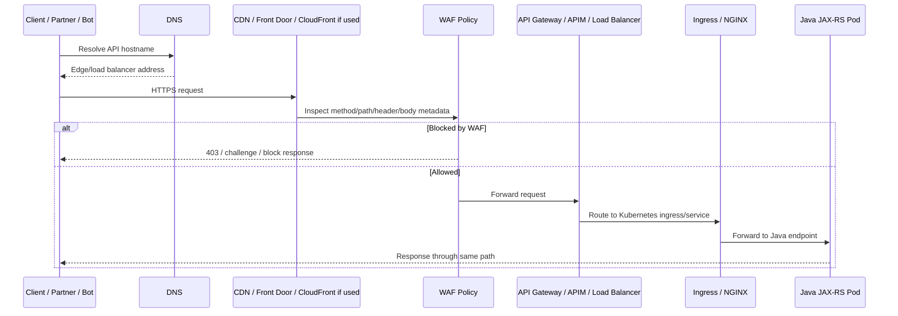

# Part 040 — WAF, Edge Security, and DDoS Protection

> Target pembaca: Senior Java/JAX-RS backend engineer yang perlu memahami bagaimana edge security melindungi public/private API tanpa menganggap WAF sebagai pengganti application authorization atau secure coding.

## 1. Konsep inti

WAF atau Web Application Firewall adalah control di depan aplikasi yang memeriksa HTTP/HTTPS request dan memutuskan apakah request boleh diteruskan, diblokir, dihitung, di-log, atau diberi challenge/captcha jika fitur tersedia.

Edge security mencakup:

- managed rule;
- custom rule;
- rate-based rule;
- bot protection;
- IP allowlist/denylist;
- geo restriction;
- header inspection;
- path restriction;
- request size restriction;
- DDoS mitigation;
- WAF logging;
- false positive management.

DDoS protection adalah control untuk menahan traffic besar atau abnormal yang bertujuan membuat service tidak tersedia. DDoS bisa terjadi di layer network, transport, atau application layer.

WAF membantu untuk layer HTTP/application. Ia tidak menyelesaikan semua jenis DDoS sendiri.

## 2. WAF bukan pengganti aplikasi yang aman

WAF penting, tetapi jangan salah tempatkan tanggung jawab.

WAF dapat membantu:

- memblokir pola exploit umum;
- membatasi request rate;
- membatasi path sensitif;
- memblokir source tertentu;
- memberi visibility atas traffic abnormal;
- mengurangi noise sebelum request sampai ke pod.

WAF tidak menggantikan:

- authentication;
- authorization domain;
- input validation di aplikasi;
- output encoding;
- object-level permission;
- secure session management;
- secret management;
- patching dependency;
- proper timeout/retry/backpressure;
- incident response.

Untuk Java/JAX-RS backend, pola sehat adalah:

```text
WAF blocks obviously bad or abusive traffic.
Gateway/identity layer authenticates and applies coarse policy.
Application enforces domain authorization and invariants.
Service dependencies enforce least privilege and private access.
```

## 3. Edge request lifecycle



Important: jika WAF memblokir request, aplikasi tidak akan punya log request tersebut. Debugging harus pindah ke WAF/edge logs.

## 4. AWS WAF mental model

AWS WAF umumnya bekerja dengan Web ACL yang di-associate ke resource seperti:

- Amazon CloudFront distribution;
- Application Load Balancer;
- Amazon API Gateway REST API;
- AWS AppSync;
- Amazon Cognito user pool jika relevan;
- AWS App Runner atau verified access integration jika digunakan.

Konsep penting:

| AWS WAF concept | Makna |
|---|---|
| Web ACL | Kumpulan rule yang dievaluasi terhadap request. |
| Rule | Satu logika match/action. |
| Rule group | Kumpulan rule reusable. |
| Managed rule group | Rule yang dikelola AWS/vendor. |
| Custom rule | Rule yang dibuat organisasi/team. |
| Rate-based rule | Rule yang menghitung request rate berdasarkan aggregation key. |
| WCU | Web ACL capacity unit, kapasitas rule evaluation. |
| Label | Metadata internal dari rule yang bisa dipakai rule berikutnya. |
| Action | Allow, block, count, captcha/challenge jika digunakan. |
| Logging | Log request sample/match untuk investigasi. |

### 4.1 Managed rule

Managed rule membantu memblokir pola umum seperti:

- SQL injection pattern;
- cross-site scripting pattern;
- bad input pattern;
- known bad IP reputation jika rule dipakai;
- admin path probing;
- bot-related request jika bot control digunakan.

Managed rule bukan silver bullet. Ia bisa menimbulkan false positive terhadap request valid, terutama jika API menerima payload besar, encoded payload, JSON fleksibel, query kompleks, atau file upload metadata.

### 4.2 Custom rule

Custom rule cocok untuk policy spesifik organisasi:

- hanya allow path tertentu;
- block method tidak dipakai;
- block request tanpa header tertentu;
- block admin path dari internet;
- block country/region tertentu jika policy mengizinkan;
- allowlist partner IP;
- enforce Host header;
- block suspicious User-Agent;
- count dulu sebelum block.

Custom rule harus diperlakukan seperti code: reviewed, tested, versioned, observable, dan rollbackable.

### 4.3 Rate-based rule

Rate-based rule berguna untuk:

- HTTP flood sederhana;
- misconfigured client yang retry terlalu agresif;
- brute force endpoint;
- scraping;
- endpoint yang mahal secara compute/database.

Tapi rate limit di WAF biasanya kasar. Ia tidak selalu paham tenant, user, contract, quota, atau domain-specific entitlement.

Untuk API enterprise, sering perlu kombinasi:

- WAF rate limit untuk edge protection;
- API Gateway/APIM quota untuk consumer/subscription;
- application-level rate limit untuk tenant/domain semantics;
- Redis/token bucket jika perlu distributed fine-grained rate limit.

## 5. AWS DDoS protection awareness

AWS Shield Standard tersedia otomatis untuk pelanggan AWS dan melindungi terhadap serangan network/transport layer umum. Untuk requirement lebih tinggi, AWS Shield Advanced dapat digunakan dengan fitur tambahan dan integrasi WAF tertentu.

Untuk backend engineer, yang perlu dipahami:

- DDoS protection tidak membuat aplikasi kebal terhadap slow backend, connection pool habis, atau expensive query;
- layer 7 flood tetap bisa menyebabkan beban besar jika request lolos ke aplikasi;
- rate-based rule dan capacity planning tetap penting;
- CloudFront/edge caching dapat membantu hanya jika response cacheable;
- API mutating seperti quote/order submit biasanya tidak aman untuk caching agresif;
- circuit breaker dan backpressure tetap diperlukan di aplikasi.

## 6. Azure WAF mental model

Azure Web Application Firewall dapat digunakan dengan beberapa edge/load balancing service, terutama:

- Azure Application Gateway WAF;
- Azure Front Door WAF;
- Azure CDN WAF jika digunakan dalam platform tertentu.

Konsep penting:

| Azure WAF concept | Makna |
|---|---|
| WAF policy | Policy yang berisi managed/custom rule dan setting. |
| Managed rules | Rule set yang dikelola Microsoft/OWASP CRS. |
| Custom rules | Rule berdasarkan match condition organisasi. |
| Rate limit rule | Rule untuk membatasi request rate. |
| Exclusion | Pengecualian agar rule tidak memeriksa field tertentu. |
| Detection mode | Mendeteksi dan log tanpa block. |
| Prevention mode | Memblokir request yang match. |
| Diagnostic logs | Log untuk investigasi WAF. |

Azure WAF policy harus dipahami dalam konteks entry point yang dipakai:

- Application Gateway dekat dengan regional VNet/AKS ingress pattern;
- Azure Front Door berada di edge/global entry point;
- APIM dapat memiliki policy API management sendiri selain WAF.

### 6.1 Managed rule

Managed rule set memberikan baseline protection terhadap class vulnerability umum. Namun payload API enterprise sering tidak sama dengan website biasa.

Contoh potensi false positive:

- field quote/order description berisi karakter dianggap injection;
- encoded JSON atau XML payload;
- file upload metadata;
- query parameter dengan syntax tertentu;
- callback URL field yang dianggap SSRF-like;
- long header dari identity provider;
- large request body.

Karena itu WAF rollout sebaiknya melalui count/detection mode dulu sebelum prevention/block penuh untuk endpoint sensitif.

### 6.2 Custom rule

Custom rule di Azure WAF dapat dipakai untuk:

- block/allow source IP;
- restrict path;
- restrict method;
- enforce header;
- rate limit traffic;
- apply geo rule;
- protect admin endpoint;
- isolate partner traffic.

Rule harus punya owner dan alasan bisnis. Rule tanpa owner menjadi technical debt di incident.

## 7. Azure DDoS protection awareness

Azure DDoS Protection menyediakan mitigasi tambahan untuk resource yang dilindungi. Azure juga memberi network security guidance yang merekomendasikan kombinasi DDoS Protection dan WAF untuk web workloads.

Yang perlu dipahami backend engineer:

- DDoS protection melindungi availability, bukan authorization;
- WAF melindungi HTTP surface, bukan database query cost di belakang API;
- rate limiting harus dikombinasikan dengan app backpressure;
- observability harus bisa membedakan attack, flash crowd, partner retry bug, dan deployment regression;
- traffic spike bisa tetap membuat downstream PostgreSQL/Kafka/Redis penuh jika API tidak punya guardrail.

## 8. Rule evaluation strategy

Desain WAF rule harus mengikuti prinsip:

1. Protect first entry point yang benar.
2. Gunakan managed rule sebagai baseline.
3. Tambahkan custom rule untuk exposure yang spesifik.
4. Jalankan count/detection mode untuk rule baru jika risiko false positive tinggi.
5. Log dan ukur impact.
6. Baru pindah ke block/prevention jika evidence cukup.
7. Dokumentasikan exception.
8. Review rule secara berkala.

Rule yang tidak diobservasi sama seperti kode yang tidak dites.

## 9. Path and method restriction

Untuk API Java/JAX-RS, tidak semua method/path harus reachable dari internet.

Contoh policy edge:

| Path | Edge policy |
|---|---|
| `/api/public/*` | Public, WAF managed rules, rate limit. |
| `/api/internal/*` | Private only, block internet. |
| `/actuator/*` | Block from public, allow internal monitoring only if approved. |
| `/admin/*` | Private/VPN/zero-trust only. |
| `/callback/*` | Allow known partner pattern, strict logging. |
| `/upload/*` | Body size policy, malware scanning flow if required, rate limit. |

WAF path restriction harus konsisten dengan API Gateway/APIM/Ingress route dan aplikasi. Jika tidak, request bisa diblokir di layer yang salah atau justru lolos via alternate path.

## 10. Header inspection and trust boundary

Header adalah area rawan.

Jangan membangun authorization hanya dari header yang bisa dikirim client, kecuali header tersebut ditulis oleh trusted gateway dan header spoofing sudah dicegah.

Header yang perlu direview:

- `Host`;
- `X-Forwarded-For`;
- `X-Forwarded-Proto`;
- `Forwarded`;
- `X-Real-IP`;
- identity propagation header;
- correlation ID;
- tenant/customer header;
- API key header;
- Authorization header;
- content type;
- user agent.

WAF dapat inspect header, tetapi aplikasi tetap harus memahami trust boundary.

Anti-pattern:

```text
Client sends X-User-Role: admin.
Ingress forwards it.
Application trusts it.
```

Pattern yang lebih aman:

```text
Gateway validates token.
Gateway strips spoofable identity headers.
Gateway writes signed/controlled identity context.
Application validates source/trust boundary and enforces domain authorization.
```

## 11. IP allowlist and geo restriction

IP allowlist berguna untuk:

- partner integration;
- admin endpoint;
- corporate-only endpoint;
- temporary incident mitigation.

Risiko IP allowlist:

- partner IP berubah;
- NAT/proxy menyembunyikan source asli;
- allowlist terlalu luas;
- IPv6 lupa direview;
- emergency rule tidak pernah dihapus;
- source IP tidak preserved karena load balancer/proxy chain;
- false sense of security.

Geo restriction dapat membantu policy tertentu, tetapi tidak boleh dianggap security kuat karena traffic dapat melalui proxy/VPN.

## 12. Bot protection awareness

Bot protection berguna untuk public endpoint yang rentan scraping, credential stuffing, enumeration, atau abuse.

Namun untuk enterprise API, banyak traffic otomatis justru valid:

- partner system;
- integration test;
- monitoring probe;
- CI/CD smoke test;
- synthetic check;
- customer automation;
- internal batch job.

Karena itu bot control harus hati-hati agar tidak memblokir client valid.

## 13. WAF false positive management

False positive adalah request valid yang diblokir WAF.

False positive sering terjadi pada:

- payload JSON/XML kompleks;
- quote/order notes yang mengandung karakter khusus;
- search query dengan operator;
- base64/encoded data;
- file upload metadata;
- callback URL;
- long JWT/header;
- multipart request;
- non-browser API clients.

Proses handling false positive:

1. Ambil WAF log.
2. Identifikasi rule id/rule group.
3. Identifikasi endpoint, method, client, request sample aman.
4. Validasi apakah request memang legitimate.
5. Buat exclusion/scope-down rule sekecil mungkin.
6. Test di environment non-prod jika memungkinkan.
7. Rollout dengan monitoring.
8. Dokumentasikan alasan dan expiry jika temporary.

Jangan menonaktifkan seluruh managed rule group hanya karena satu false positive.

## 14. Interaction with API Gateway, APIM, Ingress, and NGINX

WAF hanya satu layer. Public API path bisa melewati:

```text
DNS → CDN/Front Door/CloudFront → WAF → API Gateway/APIM → Load Balancer → NGINX Ingress → Service → Pod
```

Setiap layer bisa punya policy:

| Layer | Policy umum |
|---|---|
| WAF | Bad traffic, exploit pattern, rate limit kasar. |
| API Gateway/APIM | Auth, subscription, quota, versioning, transformation. |
| Load balancer | TLS, routing, health check. |
| NGINX ingress | Path routing, body size, timeout, header handling. |
| Java app | Domain auth, validation, idempotency, business invariants. |

Masalah umum:

- timeout mismatch;
- body size mismatch;
- WAF allow tetapi ingress block;
- WAF block tetapi app team mencari log di pod;
- API Gateway rate limit dan WAF rate limit konflik;
- source IP hilang sehingga allowlist salah;
- WAF attached ke ALB lama, bukan entry point aktif.

## 15. Impact to Java/JAX-RS backend

WAF memengaruhi aplikasi dalam beberapa cara.

### 15.1 HTTP semantics

WAF dapat memblokir method tertentu. Pastikan API method sesuai:

- `GET` aman dan tidak mengubah state;
- `POST` untuk create/action;
- `PUT/PATCH` untuk update;
- `DELETE` jika benar-benar diekspos;
- `OPTIONS` untuk CORS jika frontend perlu.

Jika WAF memblokir `OPTIONS`, browser CORS preflight gagal sebelum request sampai aplikasi.

### 15.2 Payload shape

WAF inspect body sampai batas tertentu bergantung provider/config. Payload besar/file upload bisa perlu policy khusus.

Untuk upload flow, pertimbangkan:

- direct-to-object-storage dengan presigned URL/SAS;
- scanning flow;
- body size limit di WAF, gateway, ingress, dan app;
- timeout upload;
- retry/idempotency;
- log redaction.

### 15.3 Error response

WAF block biasanya menghasilkan response dari edge, bukan dari aplikasi. Application metrics bisa terlihat normal meskipun user mendapat 403 dari WAF.

Dashboard harus membedakan:

- edge 403;
- gateway 401/403;
- app 401/403;
- app 429;
- WAF 429/rate block;
- load balancer 5xx;
- app 5xx.

## 16. Impact to PostgreSQL, Kafka, RabbitMQ, Redis, Camunda, and NGINX

| Component | Edge security concern |
|---|---|
| PostgreSQL | WAF tidak melindungi query internal; API harus mencegah expensive query dan injection. |
| Kafka | WAF tidak melindungi broker; HTTP endpoint yang publish event harus rate-limited/idempotent. |
| RabbitMQ | Management UI tidak boleh public; API producer harus punya backpressure. |
| Redis | WAF tidak mencegah cache stampede; rate limit harus didukung app/cache design. |
| Camunda | Public API yang memulai process harus protected dari replay/spam; worker traffic biasanya private. |
| NGINX | Ingress policy harus konsisten dengan WAF: body size, timeout, headers, source IP. |

WAF hanya melindungi HTTP entry point. Service internal dan async flow tetap perlu security sendiri.

## 17. Common failure modes

| Symptom | Kemungkinan akar masalah | Debug source |
|---|---|---|
| User mendapat 403, pod tidak punya log | WAF block | WAF logs |
| Spike 429 | Rate-based rule, APIM quota, app rate limit, or bot traffic | WAF/gateway/app metrics |
| Upload gagal | Body size limit di WAF/gateway/ingress/app tidak konsisten | Edge + ingress logs |
| CORS preflight gagal | OPTIONS/header diblokir WAF/gateway | Browser + WAF/gateway logs |
| Partner integration gagal | IP allowlist/source IP preservation berubah | WAF/load balancer logs |
| Admin endpoint reachable public | Missing WAF/path restriction/API route policy | DNS/edge/gateway config |
| WAF cost spike | Rule/WCU/request volume/logging volume tinggi | Cost + WAF metrics |
| App DB overload meski WAF aktif | Valid traffic terlalu berat atau rate limit terlalu longgar | App/DB metrics |
| False positive setelah managed rule update | Rule behavior berubah atau payload baru | WAF sampled requests/logs |

## 18. Production-safe debugging playbook

Saat ada dugaan WAF/edge issue:

1. Tentukan apakah request mencapai aplikasi.
2. Bandingkan client-visible status dengan app logs.
3. Cek WAF log berdasarkan timestamp, URI, source IP, correlation header jika ada.
4. Identifikasi rule id/rule group/action.
5. Cek apakah rule mode `count/detection` atau `block/prevention`.
6. Cek recent changes: WAF policy, managed rule version, API route, ingress, DNS, load balancer.
7. Jika false positive, scope down exception; jangan disable semua rule.
8. Jika attack, naikkan mitigation: rate limit, block source/pattern, protect expensive path, coordinate with security/SRE.
9. Monitor side effect: 4xx, 5xx, latency, DB load, broker lag, CPU, memory, cost.
10. Dokumentasikan timeline untuk RCA.

Useful test commands:

```bash
# Show response headers and status path from client side
curl -vk https://api.example.com/path

# Test method and headers
curl -vk -X OPTIONS https://api.example.com/path \
  -H 'Origin: https://frontend.example.com' \
  -H 'Access-Control-Request-Method: POST'

# Compare through internal route if allowed by policy
curl -vk https://internal-api.example.local/path

# Generate correlation header for tracing edge-to-app
curl -vk https://api.example.com/path \
  -H 'X-Correlation-ID: manual-debug-<ticket-id>'
```

Gunakan hanya endpoint dan traffic yang diizinkan oleh policy internal.

## 19. Rate limiting design for enterprise APIs

Rate limiting harus sesuai level semantik.

| Level | Cocok untuk | Tidak cocok untuk |
|---|---|---|
| WAF | Attack/misconfigured client, per-IP coarse limit | Tenant quota detail, domain entitlement |
| API Gateway/APIM | Consumer/subscription quota, API product plan | Deep domain rule |
| Application | Per-tenant/user/business operation | Large-scale edge attack alone |
| Redis/distributed limiter | Fine-grained distributed quota | Replacing WAF entirely |

Untuk Quote & Order style systems, rate limit perlu mempertimbangkan:

- tenant/customer;
- operation type;
- idempotency;
- downstream cost;
- partner contract;
- retry behavior;
- business criticality.

## 20. Cost and performance concerns

WAF/edge security dapat berdampak pada:

- rule evaluation capacity/cost;
- request volume billing;
- WAF log ingestion cost;
- managed rule subscription cost;
- bot control cost jika digunakan;
- Shield Advanced atau Azure DDoS Protection cost jika digunakan;
- latency edge evaluation;
- false positive operational cost;
- additional alert noise.

Jangan aktifkan logging verbose tanpa retention dan cost owner. Namun jangan matikan logging sampai debugging mustahil.

## 21. Privacy and compliance concerns

WAF logs dapat berisi data sensitif:

- URI dengan query parameter;
- header;
- source IP;
- user agent;
- sampled request metadata;
- sometimes request body snippets depending configuration/provider.

Review:

- apakah token ada di query string;
- apakah PII masuk URL;
- apakah WAF logs dikirim ke workspace/log group dengan retention benar;
- siapa yang bisa membaca logs;
- apakah masking/redaction tersedia;
- apakah log export memenuhi compliance.

API design harus menghindari secret/token/PII di URL karena URL sering masuk edge/access logs.

## 22. PR review checklist

Gunakan checklist ini saat PR menyentuh WAF/edge:

- Entry point mana yang dilindungi WAF?
- Apakah WAF attached ke resource aktif, bukan resource lama?
- Managed rule group apa yang aktif?
- Rule baru mode count/detection dulu atau langsung block?
- Apakah rule punya owner dan alasan?
- Apakah path/method/header restriction konsisten dengan API contract?
- Apakah rate limit sesuai traffic normal, peak, dan partner behavior?
- Apakah source IP preservation dipahami untuk allowlist?
- Apakah CORS preflight terdampak?
- Apakah file upload/body size terdampak?
- Apakah false positive handling disiapkan?
- Apakah WAF logs aktif dan bisa dicari saat incident?
- Apakah log berisiko mengandung PII/token?
- Apakah rollback policy jelas?
- Apakah change sudah dikomunikasikan ke SRE/security/backend owner?

## 23. Internal verification checklist

Verifikasi ke platform/SRE/security/backend team:

- Public API entry point aktual: CloudFront, ALB, API Gateway, Front Door, Application Gateway, APIM, NGINX ingress.
- WAF provider yang digunakan.
- WAF policy/Web ACL yang aktif per environment.
- Managed rule group/rule set yang dipakai.
- Custom rule standard.
- Rate limit standard.
- Bot protection status.
- DDoS protection tier/status.
- IP allowlist/denylist ownership.
- Geo restriction policy.
- Header/path restriction standard.
- WAF log destination.
- Log retention dan access control.
- False positive escalation path.
- Emergency mitigation process.
- WAF change approval process.
- Runbook untuk WAF block, HTTP flood, dan DDoS-like traffic.
- Incident notes terkait WAF/edge false positive atau attack.

## 24. Production readiness checklist

Public/private API dianggap siap dari sisi WAF/edge jika:

- entry point jelas dan tidak ada alternate public bypass;
- WAF/edge policy sesuai risk endpoint;
- managed rule baseline aktif jika required;
- custom rule hanya sekecil kebutuhan;
- rate limit sesuai traffic profile;
- CORS, upload, callback, dan partner traffic sudah diuji;
- source IP handling jelas;
- WAF logs tersedia dan searchable;
- false positive process jelas;
- emergency block/allow process jelas;
- WAF policy dikelola IaC/GitOps jika platform standard demikian;
- change punya rollback plan;
- dashboard membedakan WAF/gateway/ingress/app errors;
- privacy review terhadap WAF logs dilakukan.

## 25. Senior engineer mental model

WAF adalah pressure valve dan inspection layer di depan aplikasi. Ia berguna untuk mengurangi traffic buruk, tetapi tidak boleh menjadi alasan aplikasi lemah.

Senior engineer harus bertanya:

```text
Apakah request buruk diblokir sebelum mencapai app?
Apakah request valid tidak diblokir secara tidak sengaja?
Apakah rule bisa dijelaskan dan dirollback?
Apakah logs cukup untuk membedakan attack vs false positive?
Apakah rate limit melindungi backend dependency, bukan hanya edge?
Apakah security policy konsisten dari WAF sampai domain authorization?
```

WAF yang baik bukan WAF yang paling agresif. WAF yang baik adalah WAF yang melindungi sistem, observable, dapat dioperasikan, dan tidak merusak kontrak API valid.

## References

- AWS WAF overview: https://docs.aws.amazon.com/waf/latest/developerguide/what-is-aws-waf.html
- AWS Managed Rules for AWS WAF: https://docs.aws.amazon.com/waf/latest/developerguide/aws-managed-rule-groups.html
- AWS WAF rate-based rules: https://docs.aws.amazon.com/waf/latest/developerguide/waf-rule-statement-type-rate-based.html
- AWS WAF request rate limiting: https://docs.aws.amazon.com/waf/latest/developerguide/waf-rule-statement-type-rate-based-request-limiting.html
- AWS WAF Bot Control managed rule group: https://docs.aws.amazon.com/waf/latest/developerguide/aws-managed-rule-groups-bot.html
- AWS Shield overview: https://docs.aws.amazon.com/waf/latest/developerguide/ddos-overview.html
- AWS Shield Standard overview: https://docs.aws.amazon.com/waf/latest/developerguide/ddos-standard-summary.html
- AWS Shield Advanced overview: https://docs.aws.amazon.com/waf/latest/developerguide/ddos-advanced-summary.html
- Azure WAF application DDoS protection: https://learn.microsoft.com/en-us/azure/web-application-firewall/shared/application-ddos-protection
- Azure WAF rate limiting for Front Door: https://learn.microsoft.com/en-us/azure/web-application-firewall/afds/waf-front-door-rate-limit
- Azure WAF rate limiting for Application Gateway: https://learn.microsoft.com/en-us/azure/web-application-firewall/ag/rate-limiting-overview
- Azure DDoS Protection overview: https://learn.microsoft.com/en-us/azure/ddos-protection/ddos-protection-overview
- Azure DDoS Protection features: https://learn.microsoft.com/en-us/azure/ddos-protection/ddos-protection-features
