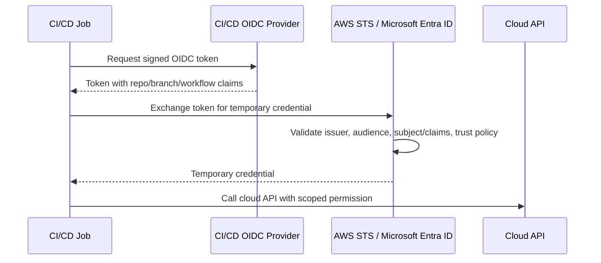
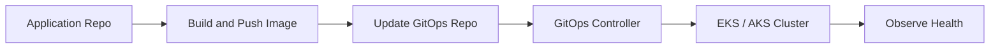

# Part 041 — CI/CD and Cloud Deployment

> Target pembaca: Senior Java/JAX-RS backend engineer yang perlu memahami deployment pipeline cloud sebagai control system, bukan sekadar proses build dan deploy.

## 1. Konsep inti

CI/CD di cloud adalah rangkaian kontrol untuk mengubah source code, image, konfigurasi, dan infrastructure definition menjadi perubahan production yang aman, repeatable, auditable, dan bisa di-rollback.

Untuk enterprise Java/JAX-RS systems, pipeline biasanya menyentuh beberapa layer:

- source code repository;
- build runner;
- dependency resolver;
- unit/integration/security test;
- container image build;
- image registry seperti ECR atau ACR;
- IaC engine seperti Terraform, CloudFormation, Bicep, atau ARM template;
- package/deployment tool seperti Helm atau Kustomize;
- GitOps controller seperti Argo CD atau Flux jika digunakan;
- EKS/AKS cluster;
- cloud identity/RBAC/IAM;
- cloud networking, secret, config, database, broker, observability, dan rollback path.

Pipeline bukan hanya automation. Pipeline adalah tempat privilege berkumpul. Ia bisa membuat, mengubah, atau menghancurkan production resources. Karena itu pipeline harus diperlakukan sebagai privileged workload.

## 2. Kenapa CI/CD cloud berbeda dari deploy biasa

Deploy tradisional sering berarti:

```text
copy artifact -> restart process -> verify service
```

Deploy cloud-native sering berarti:

```text
commit -> build -> scan -> push image -> promote artifact -> update IaC/config -> sync cluster -> change load balancer/secret/identity/network -> observe -> rollback if needed
```

Perbedaannya:

- deployment menyentuh banyak control plane;
- credential pipeline lebih sensitif daripada credential developer biasa;
- rollback aplikasi belum tentu rollback infrastructure;
- image tag bisa berubah walau nama tag sama;
- Kubernetes rollout success belum tentu business flow sehat;
- IaC apply bisa mengubah route table, identity, private endpoint, secret, DNS, atau load balancer;
- GitOps reconciliation bisa mengembalikan manual hotfix jika tidak dicatat di Git;
- environment promotion harus menjaga separation dev/test/prod.

Senior engineer harus melihat pipeline sebagai state transition system.

```text
Source state + config state + infra state + runtime state
  -> pipeline transition
  -> deployed state
  -> observed state
  -> rollback or promote state
```

## 3. Deployment lifecycle end-to-end

Lifecycle sehat biasanya seperti ini:

```mermaid
flowchart LR
  A[Code Commit] --> B[Build Java Artifact]
  B --> C[Unit / Contract / Security Tests]
  C --> D[Build Container Image]
  D --> E[Scan and Sign Image if required]
  E --> F[Push to ECR / ACR]
  F --> G[Promote Image by Digest]
  G --> H[Update Helm Values / Kustomize / GitOps Desired State]
  H --> I[Deploy to Dev / Test]
  I --> J[Smoke and Integration Tests]
  J --> K[Approval Gate]
  K --> L[Deploy to Prod]
  L --> M[Observe Metrics Logs Traces]
  M --> N{Healthy?}
  N -->|Yes| O[Mark Release Stable]
  N -->|No| P[Rollback / Roll Forward / Mitigate]
```



Yang harus dijaga:

- artifact immutable;
- environment promotion jelas;
- credential tidak static;
- approval tidak bypassable;
- smoke test meaningful;
- rollback sudah diuji;
- observability cukup untuk memutuskan sehat/tidak.

## 4. Build pipeline untuk Java/JAX-RS service

Java/JAX-RS service biasanya punya beberapa artifact boundary:

- source code;
- Maven/Gradle dependencies;
- compiled jar/war;
- container image;
- Helm chart atau deployment manifest;
- runtime config;
- secret references;
- database migration script jika ada;
- API contract/OpenAPI jika digunakan.

Pipeline harus memisahkan:

```text
Build once.
Promote the same artifact.
Do not rebuild differently per environment.
```

Anti-pattern:

```text
main branch -> build image for dev
release branch -> rebuild image for staging
manual job -> rebuild image for prod
```

Masalahnya: image prod belum tentu sama dengan image yang diuji.

Pattern lebih sehat:

```text
commit abc123 -> image digest sha256:...
sha256 promoted dev -> test -> prod
environment difference only in config, secret reference, scaling, routing, policy
```

## 5. Image push, tag, digest, dan promotion

Image tag nyaman untuk manusia, tetapi tag bisa mutable jika registry policy tidak melarang overwrite.

Gunakan mental model:

```text
tag = label
 digest = identity
```

Untuk production review, tanyakan:

- apakah deployment menggunakan tag mutable seperti `latest`?
- apakah image digest dicatat di release evidence?
- apakah image yang diuji sama dengan image yang dipromosikan?
- apakah vulnerability scan dilakukan sebelum promotion?
- apakah image signing/attestation required?
- apakah registry outage punya fallback plan?

Contoh manifest yang lebih deterministic:

```yaml
image:
  repository: example.com/quote-order-service
  tag: "2026.07.11-abc123"
  digest: "sha256:..."
```

Lebih kuat lagi jika deployment tool mendukung digest pinning secara eksplisit.

## 6. Environment promotion

Environment promotion bukan copy-paste deployment.

Yang dipromosikan:

- image digest;
- chart version;
- schema migration version;
- config version;
- feature flag state;
- release note;
- test evidence;
- approval metadata.

Yang berbeda antar environment:

- replica count;
- resource request/limit;
- host/domain;
- private endpoint target;
- IAM/RBAC role;
- secret reference;
- database/broker endpoint;
- observability workspace;
- autoscaling threshold;
- policy guardrail.

Anti-pattern:

```text
prod values file is manually edited during release window
```

Pattern lebih aman:

```text
promotion PR changes only the promoted artifact version/digest
platform-specific values are stable and reviewed separately
```

## 7. Approval gate

Approval gate bukan formalitas. Ia adalah control untuk mencegah transition berisiko masuk production tanpa evidence.

Approval minimal harus menjawab:

- apa yang berubah?
- service mana terdampak?
- dependency mana terdampak?
- apakah ada database migration?
- apakah ada perubahan IAM/RBAC?
- apakah ada perubahan network/DNS/load balancer?
- apakah ada perubahan secret/config?
- apakah smoke test lulus?
- apakah rollback path jelas?
- siapa yang on-call saat deployment?

Approval yang hanya berbunyi “LGTM” tanpa evidence tidak cukup untuk sistem mission-critical.

## 8. Cloud credential in CI/CD

Pipeline sering membutuhkan cloud access untuk:

- push image ke ECR/ACR;
- read secret/config untuk deployment;
- run Terraform plan/apply;
- deploy Helm chart;
- update GitOps repo;
- query cluster state;
- run smoke test terhadap private endpoint;
- publish dashboard/release evidence.

Credential pipeline harus:

- scoped per environment;
- short-lived;
- auditable;
- least privilege;
- bound to repository/workflow/branch/environment;
- tidak reusable di luar pipeline;
- tidak disimpan sebagai long-lived static access key jika federation tersedia.

## 9. OIDC federation from CI/CD

OIDC federation memungkinkan pipeline mendapat temporary credential dari cloud provider tanpa menyimpan static cloud key di CI/CD secret store.

Lifecycle umumnya:



In AWS, pattern umum adalah IAM OIDC provider + IAM role trust policy + STS. Di Azure, pattern umum adalah Microsoft Entra workload identity federation dengan federated credential pada application/service principal atau managed identity.

Yang harus direview:

- issuer;
- audience;
- subject/claim filter;
- repository restriction;
- branch/tag/environment restriction;
- role assignment scope;
- session duration;
- audit log;
- permission policy.

Trust policy yang terlalu luas membuat semua job dari repo/org tertentu bisa deploy production.

## 10. Secretless deployment

Secretless deployment bukan berarti tidak ada secret. Artinya pipeline tidak menyimpan long-lived cloud secret untuk melakukan deployment.

Pattern lebih sehat:

```text
CI/CD job identity -> cloud federation -> temporary credential -> cloud action
```

Untuk runtime application:

```text
Kubernetes service account -> workload identity -> secret/config/cloud service access
```

Jangan campur:

- CI/CD identity untuk deploy;
- application runtime identity untuk call cloud service;
- developer human identity untuk break-glass/debug;
- platform automation identity untuk reconciliation.

Setiap identity harus punya permission boundary sendiri.

## 11. Terraform plan/apply dalam pipeline

Terraform dalam pipeline harus diperlakukan sebagai high-risk stage karena bisa mengubah cloud control plane.

Lifecycle sehat:

```text
validate -> fmt -> static analysis -> plan -> review plan -> approve -> apply -> publish evidence
```

Untuk production:

- `plan` harus tersimpan sebagai artifact;
- reviewer harus melihat create/update/delete/replace;
- destructive change harus jelas;
- provider version harus pinned;
- module version harus pinned;
- state backend harus remote dan locked;
- secrets tidak boleh bocor di output/log;
- apply harus terjadi dari controlled runner;
- manual console change harus dianggap drift.

Anti-pattern:

```text
terraform apply -auto-approve from developer laptop against prod
```

## 12. Helm deployment

Helm sering menjadi bridge antara CI/CD dan Kubernetes.

Hal yang perlu dipahami:

- chart adalah package template;
- values menentukan environment-specific config;
- release punya revision history;
- rollback bisa ke revision sebelumnya;
- hooks bisa menjalankan job tambahan;
- template bisa menghasilkan resource berbahaya jika values salah;
- Helm success bukan bukti aplikasi sehat.

Review Helm deployment:

- chart version;
- values diff;
- rendered manifest;
- image digest;
- resource request/limit;
- probe;
- Service/Ingress change;
- secret reference;
- migration hook;
- rollback behavior.

Jangan hanya review `values.yaml`. Review hasil rendered manifest untuk resource kritikal.

## 13. GitOps sync

Dalam GitOps, pipeline tidak selalu deploy langsung ke cluster. Pipeline bisa hanya mengubah desired state di Git, lalu controller seperti Argo CD atau Flux melakukan reconciliation.



Keuntungan:

- cluster state declarative;
- manual change terdeteksi sebagai drift;
- audit trail via Git;
- rollback bisa lewat Git revert;
- environment promotion bisa lewat PR.

Risiko:

- GitOps repo menjadi production control plane;
- controller permission terlalu luas;
- manual hotfix di cluster bisa direvert;
- sync wave salah bisa merusak dependency order;
- health check salah bisa menganggap release sehat padahal traffic gagal.

## 14. Smoke test dan release verification

Smoke test harus memverifikasi path yang relevan, bukan hanya pod running.

Minimal untuk Java/JAX-RS service:

- `/health/live` untuk process liveness;
- `/health/ready` untuk dependency readiness;
- endpoint API utama dengan auth valid;
- database connectivity jika service bergantung pada DB;
- broker connectivity jika service consume/publish;
- object storage/config/secret access jika critical;
- DNS/ingress path aktual;
- metrics/log emission;
- trace/correlation propagation.

Bad smoke test:

```text
kubectl rollout status deployment/foo
```

Better smoke test:

```text
call production ingress private/public route with representative auth and assert expected business-safe response
```

## 15. Rollback dan roll forward

Rollback harus dipilih berdasarkan jenis failure.

Rollback cocok jika:

- deployment app menyebabkan error;
- config change bisa dikembalikan;
- schema masih backward-compatible;
- old image masih tersedia;
- traffic routing bisa dikembalikan.

Roll forward mungkin lebih aman jika:

- database migration tidak backward-compatible;
- data sudah berubah;
- old image tidak compatible dengan current config;
- rollback memperbesar customer impact;
- emergency patch kecil lebih cepat dan aman.

Checklist rollback:

- image digest lama tersedia;
- Helm revision ada;
- config/secret version lama tersedia;
- database migration rollback strategy jelas;
- feature flag bisa dimatikan;
- load balancer/gateway route bisa dikembalikan;
- observability membuktikan recovery.

## 16. Deployment strategies

Common strategies:

| Strategy | Cocok untuk | Risiko |
|---|---|---|
| Rolling update | Stateless service normal | Bad version menyebar gradual |
| Blue/green | Perubahan besar, fast rollback | Double capacity cost, data compatibility |
| Canary | Risk reduction by small traffic | Butuh metrics dan routing control kuat |
| Shadow | Validate behavior tanpa customer impact | Cost dan data privacy concern |
| Feature flag | Functional rollout | Flag debt dan combinatorial states |

Untuk JAX-RS backend, canary tanpa observability granular hanya memberi ilusi aman. Canary harus punya signal:

- error rate per version;
- latency per version;
- business failure rate;
- dependency timeout;
- log anomaly;
- trace comparison;
- rollback threshold.

## 17. Database migration dalam deployment

Database migration adalah salah satu penyebab rollback menjadi sulit.

Pattern aman:

```text
expand -> deploy compatible app -> migrate data if needed -> contract later
```

Contoh:

1. Tambah kolom nullable.
2. Deploy app yang bisa membaca format lama dan baru.
3. Backfill data.
4. Aktifkan fitur.
5. Setelah stabil, hapus field lama di release berikutnya.

Anti-pattern:

```text
rename/drop column in same release as application change
```

Review migration:

- lock risk;
- runtime duration;
- backward compatibility;
- rollback plan;
- data correction plan;
- PITR/backup availability;
- migration job idempotency;
- observability selama migration.

## 18. AWS-specific deployment considerations

Di AWS, pipeline bisa menyentuh:

- IAM role untuk CI/CD;
- OIDC provider untuk CI/CD;
- ECR repository;
- EKS cluster;
- AWS Load Balancer Controller resources;
- Route 53 record;
- Secrets Manager/SSM/AppConfig;
- CloudWatch dashboard/alarms;
- RDS/MSK/ElastiCache connectivity;
- VPC endpoint/PrivateLink;
- Terraform backend di S3 + locking mechanism jika digunakan;
- CloudTrail audit.

Pertanyaan review:

- apakah pipeline role scoped ke account/environment yang benar?
- apakah trust policy membatasi branch/environment?
- apakah deploy prod bisa dilakukan dari pull request untrusted?
- apakah ECR image digest immutable?
- apakah Terraform plan menunjukkan route/IAM/security group replacement?
- apakah CloudTrail bisa menunjukkan actor pipeline?

## 19. Azure-specific deployment considerations

Di Azure, pipeline bisa menyentuh:

- Microsoft Entra app registration/service principal/managed identity;
- federated identity credential;
- Azure RBAC role assignment;
- ACR;
- AKS;
- Azure App Configuration;
- Key Vault;
- Azure Monitor/Log Analytics;
- Private Endpoint/Private DNS Zone;
- Application Gateway/APIM/Front Door;
- Resource Group/subscription deployment;
- Azure Activity Log.

Pertanyaan review:

- apakah role assignment scoped ke resource group/resource, bukan subscription luas tanpa alasan?
- apakah federated credential membatasi repo/branch/environment?
- apakah ACR pull permission untuk AKS benar?
- apakah Key Vault access untuk pipeline dan runtime dipisah?
- apakah deployment identity sama dengan runtime identity?
- apakah Activity Log bisa menunjukkan perubahan production?

## 20. EKS/AKS deployment concerns

Kubernetes-specific review:

- namespace target benar;
- ServiceAccount benar;
- workload identity annotation benar;
- resource request/limit masuk akal;
- readiness/liveness/startup probe benar;
- rolling update strategy benar;
- PodDisruptionBudget tidak memblokir rollout;
- HPA/KEDA tidak konflik dengan rollout;
- NetworkPolicy tidak memutus dependency;
- Ingress/Service tidak berubah public/private exposure secara tidak sengaja;
- secret/config reference valid;
- node selector/toleration/affinity tidak membuat pod pending;
- imagePullPolicy dan registry credential benar.

Deployment “sukses” tetapi pod pending tetap outage.

## 21. Failure modes

Common failure modes:

- build artifact berbeda dari yang diuji;
- mutable tag menyebabkan wrong image deployed;
- CI/CD credential expired atau trust policy mismatch;
- pipeline role terlalu luas lalu salah environment berubah;
- Terraform apply mengganti resource kritikal;
- Helm values salah environment;
- GitOps controller merevert manual incident fix;
- migration membuat table lock;
- smoke test terlalu dangkal;
- rollback gagal karena DB schema incompatible;
- image pull failure dari ECR/ACR;
- private endpoint/DNS berubah saat deploy;
- new pod tidak punya workload identity;
- secret/config baru tidak tersedia;
- log/metric hilang sehingga release health tidak terbaca.

## 22. Debugging deployment failure

Urutan debugging yang aman:

```text
1. Classify failure: build, registry, cloud auth, IaC, Kubernetes, app runtime, traffic path, dependency.
2. Identify last successful stage.
3. Compare intended change vs actual deployed state.
4. Check audit log: CloudTrail / Azure Activity Log / Git history / CI/CD job log.
5. Check cluster events, rollout status, pod events, image pull, probes.
6. Check ingress/load balancer target health.
7. Check application logs, metrics, traces.
8. Decide rollback, roll forward, config revert, or traffic mitigation.
```

Useful commands conceptually:

```bash
kubectl rollout status deployment/<service> -n <ns>
kubectl describe pod <pod> -n <ns>
kubectl get events -n <ns> --sort-by=.lastTimestamp
helm history <release> -n <ns>
helm rollback <release> <revision> -n <ns>
```

Jangan menjalankan manual fix di production tanpa mencatat state yang diubah, terutama jika GitOps/IaC akan mereconcile ulang.

## 23. Correctness concerns

Deployment correctness berarti deployed state sesuai intended state dan business invariant tetap benar.

Concern penting:

- artifact immutability;
- config compatibility;
- database schema compatibility;
- message contract compatibility;
- idempotent migration;
- version skew antar microservices;
- API backward compatibility;
- feature flag state;
- rollout order;
- dependency readiness;
- rollback compatibility.

Untuk Quote/Order system, correctness lebih penting daripada sekadar availability. Service yang “up” tetapi menghitung quote/order state salah adalah failure serius.

## 24. Security concerns

Pipeline security review:

- no long-lived cloud keys;
- OIDC/federation preferred;
- least privilege per environment;
- protected branch/environment;
- no deployment from untrusted fork context;
- secrets masked and not echoed;
- artifacts signed/scanned if required;
- dependency scanning;
- IaC scanning;
- deployment approval for prod;
- audit logs retained;
- runner isolation;
- self-hosted runner hardening;
- SBOM/provenance if required.

Pipeline compromise often equals production compromise.

## 25. Performance and cost concerns

Deployment choices can affect performance and cost:

- blue/green doubles capacity temporarily;
- canary needs parallel version capacity;
- verbose deployment logs increase log cost;
- image build cache misses increase CI time/cost;
- NAT egress during image pull/dependency download can be expensive;
- cross-region image pull increases latency/cost;
- too small rollout batch extends release window;
- too aggressive rollout can overwhelm dependency warmup;
- test environment parity has cost but reduces production risk.

Review release strategy with both reliability and cost lens.

## 26. Observability concerns

A release is not complete until it is observable.

Minimum release signals:

- deployment version label;
- image digest exposed in logs/metrics if possible;
- pod restart count;
- readiness failures;
- HTTP 4xx/5xx;
- latency p50/p95/p99;
- dependency timeout/error;
- JVM heap/thread/gc;
- business metric guardrail;
- trace sample by version;
- alert state;
- rollback event annotation.

Dashboard should answer:

```text
What changed?
When did it change?
Which version receives traffic?
Is customer/business impact increasing?
Can we rollback safely?
```

## 27. PR review checklist

Gunakan checklist ini saat PR menyentuh CI/CD atau deployment:

- Apakah artifact build once, promote many?
- Apakah image digest immutable?
- Apakah registry scan/signing policy dipenuhi?
- Apakah environment promotion jelas?
- Apakah prod approval gate ada?
- Apakah CI/CD credential secretless/OIDC jika tersedia?
- Apakah permission scoped per environment?
- Apakah Terraform plan artifact direview?
- Apakah Helm/Kustomize rendered manifest direview untuk resource kritikal?
- Apakah GitOps sync behavior dipahami?
- Apakah smoke test meaningful?
- Apakah database migration backward-compatible?
- Apakah rollback/roll-forward plan jelas?
- Apakah observability release signal tersedia?
- Apakah logs tidak membocorkan secret/PII?
- Apakah manual changes akan dideteksi sebagai drift?
- Apakah deployment bisa mengubah public exposure, IAM/RBAC, route, DNS, or secret?

## 28. Internal verification checklist

Verifikasi ke platform/SRE/DevOps/security/backend team:

- CI/CD tool yang digunakan.
- Runner model: hosted, self-hosted, private runner, network access.
- Build pipeline untuk Java/JAX-RS service.
- Container registry: ECR, ACR, atau lainnya.
- Image tagging/digest policy.
- Image scanning/signing requirement.
- Artifact promotion model.
- Environment promotion flow.
- Approval gate untuk production.
- Cloud credential model di pipeline.
- OIDC federation setup untuk AWS/Azure jika ada.
- IAM role/service principal/managed identity untuk CI/CD.
- Scope permission per environment.
- Terraform plan/apply stage.
- Helm/Kustomize/GitOps flow.
- GitOps repo dan controller jika ada.
- Smoke test definition.
- Database migration process.
- Rollback runbook.
- Release dashboard.
- Audit evidence location.
- Incident notes terkait failed deployment.

## 29. Production readiness checklist

Deployment flow dianggap production-ready jika:

- artifact immutable dan traceable dari commit ke image digest;
- environment promotion tidak rebuild artifact;
- prod deployment memerlukan approval dan evidence;
- cloud credential short-lived dan scoped;
- IaC changes punya plan review;
- Kubernetes changes punya rendered manifest review;
- secret/config changes punya rollback;
- database migration compatible dan tested;
- smoke test memvalidasi path nyata;
- observability cukup untuk release decision;
- rollback/roll-forward sudah diuji;
- audit trail jelas;
- platform/backend/SRE ownership jelas.

## 30. Senior engineer mental model

CI/CD bukan “jalan otomatis ke production”. CI/CD adalah safety system untuk mengubah production state.

Pertanyaan senior:

```text
Apa state yang akan berubah?
Siapa identity yang melakukan perubahan?
Apakah perubahan itu scoped, auditable, dan reversible?
Apakah artifact yang dipromosikan sama dengan yang diuji?
Apakah failure bisa dideteksi sebelum customer impact besar?
Apakah rollback benar-benar mungkin setelah data berubah?
Apakah pipeline sendiri menjadi attack path ke production?
```

Semakin mature pipeline, semakin sedikit keputusan manual saat incident. Tetapi semakin powerful pipeline, semakin penting guardrail-nya.

## References

- AWS Prescriptive Guidance — Best practices for CI/CD pipelines: https://docs.aws.amazon.com/prescriptive-guidance/latest/strategy-cicd-litmus/cicd-best-practices.html
- AWS Cloud Adoption Framework — CI/CD: https://docs.aws.amazon.com/prescriptive-guidance/latest/aws-caf-platform-perspective/ci-cd.html
- AWS Security Blog — Use IAM roles to connect GitHub Actions to AWS: https://aws.amazon.com/blogs/security/use-iam-roles-to-connect-github-actions-to-actions-in-aws/
- GitHub Docs — Configuring OpenID Connect in AWS: https://docs.github.com/actions/security-for-github-actions/security-hardening-your-deployments/configuring-openid-connect-in-amazon-web-services
- Microsoft Learn — Workload identity federation concepts: https://learn.microsoft.com/en-us/entra/workload-id/workload-identity-federation
- Microsoft Learn — Use Azure Login with OpenID Connect: https://learn.microsoft.com/en-us/azure/developer/github/connect-from-azure-openid-connect
- AWS Prescriptive Guidance — Argo CD GitOps on EKS: https://docs.aws.amazon.com/prescriptive-guidance/latest/eks-gitops-tools/argo-cd.html
- Helm Docs — helm rollback: https://helm.sh/docs/helm/helm_rollback/
