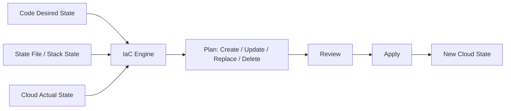

# Part 042 — Infrastructure as Code

> Target pembaca: Senior Java/JAX-RS backend engineer yang perlu mereview perubahan infrastructure tanpa harus menjadi full-time platform engineer.

## 1. Konsep inti

Infrastructure as Code atau IaC adalah praktik mendefinisikan cloud resources sebagai deklarasi yang versioned, reviewable, repeatable, dan dapat diaudit.

IaC mengubah pertanyaan dari:

```text
Siapa yang klik apa di console?
```

menjadi:

```text
Perubahan apa yang dideklarasikan, direview, diterapkan, dan terbukti menghasilkan state apa?
```

IaC dapat mengelola:

- VPC/VNet;
- subnet;
- route table;
- security group/NSG;
- private endpoint;
- DNS zone/record;
- IAM/RBAC;
- EKS/AKS;
- container registry;
- object storage;
- secret/config service;
- load balancer;
- API gateway/APIM;
- monitoring/alert;
- database/broker/Redis;
- policy/resource lock/tagging.

Untuk backend engineer, IaC penting karena banyak production failure aplikasi berakar dari perubahan infrastructure yang terlihat kecil.

## 2. Kenapa IaC ada

Cloud console bagus untuk eksplorasi. IaC bagus untuk production.

Tanpa IaC:

- perubahan sulit direview;
- environment drift tidak terlihat;
- recreation sulit;
- audit lemah;
- naming/tagging tidak konsisten;
- permission berkembang liar;
- rollback tidak jelas;
- knowledge tersimpan di kepala orang.

Dengan IaC:

- perubahan lewat PR;
- environment bisa distandardisasi;
- plan menunjukkan dampak;
- state bisa dilacak;
- drift bisa dideteksi;
- module bisa dipakai ulang;
- compliance evidence lebih kuat.

Namun IaC juga bisa mempercepat kerusakan jika review lemah. IaC memberi repeatability, bukan otomatis correctness.

## 3. Declarative vs imperative mental model

IaC modern umumnya deklaratif:

```text
Saya ingin resource X punya konfigurasi Y.
```

Bukan:

```text
Langkah 1 create X, langkah 2 set Y, langkah 3 attach Z.
```

Engine IaC menghitung perbedaan antara desired state dan known/current state, lalu membuat plan.



Masalah muncul saat:

- state tidak sesuai actual cloud state;
- manual change membuat drift;
- provider behavior berubah;
- module abstraction menyembunyikan resource kritikal;
- plan tidak direview dengan teliti;
- replacement resource berdampak downtime.

## 4. Terraform mental model

Terraform adalah tool multi-cloud IaC yang umum dipakai untuk AWS, Azure, Kubernetes, dan banyak provider lain.

Konsep penting:

- provider: plugin untuk cloud/API tertentu;
- resource: object yang dikelola;
- data source: baca object yang sudah ada;
- module: reusable composition;
- variable: input;
- output: nilai yang diekspos;
- state: mapping resource deklaratif ke real object;
- plan: preview perubahan;
- apply: eksekusi perubahan;
- import: memasukkan existing resource ke state;
- backend: tempat state disimpan;
- lock: mencegah concurrent apply.

Terraform bukan hanya “script cloud”. Terraform adalah stateful reconciliation engine.

## 5. State adalah control point sensitif

Terraform state menyimpan mapping antara kode dan resource cloud. State bisa berisi nilai sensitif tergantung resource/provider.

State harus diperlakukan sebagai sensitive production artifact.

Risiko state:

- disimpan di Git;
- tidak terenkripsi;
- tidak ada access control;
- tidak ada locking;
- berisi secret/output sensitif;
- diakses terlalu banyak user/pipeline;
- remote state digunakan lintas team tanpa boundary;
- state corrupt karena concurrent apply.

Review state backend:

```text
Where is state stored?
Who can read it?
Who can write it?
Is it encrypted?
Is it locked?
Is access audited?
Does it contain secrets?
Is state separated per environment?
```

## 6. Remote backend dan state locking

Production IaC seharusnya menggunakan remote backend, bukan local state di laptop.

Tujuan remote backend:

- shared state untuk pipeline/team;
- access control;
- encryption;
- audit;
- locking;
- backup/versioning;
- recovery.

State locking penting karena dua apply bersamaan bisa merusak state atau membuat perubahan tidak deterministic.

Anti-pattern:

```text
Developer A applies networking change.
Developer B applies IAM change at the same time.
Both use copied local state.
```

Pattern lebih aman:

```text
Central remote state + lock + pipeline-only apply + plan review
```

## 7. Terraform module discipline

Module membuat reuse, tetapi juga menyembunyikan kompleksitas.

Module sehat:

- punya input minimal tapi jelas;
- punya output eksplisit;
- versioned;
- punya README;
- punya examples;
- punya validation;
- tidak membuat resource tak terduga;
- memisahkan network/identity/compute/app concern;
- punya upgrade notes;
- tidak mengandung hardcoded production assumptions.

Module berbahaya:

- membuat IAM admin role diam-diam;
- membuka security group terlalu luas;
- membuat public IP default;
- auto-create DNS public record;
- default `0.0.0.0/0`;
- menyimpan secret sebagai variable/output;
- mengganti resource saat input kecil berubah;
- tidak pinned version.

Senior engineer harus membaca module source, bukan hanya module call.

## 8. Plan, apply, dan replacement risk

Terraform plan perlu dibaca seperti surgical diff.

Perhatikan simbol/jenis perubahan:

```text
+ create
~ update in-place
-/+ replace
- destroy
```

Yang paling berisiko:

- replacement subnet;
- replacement load balancer;
- replacement private endpoint;
- replacement DNS zone/record;
- replacement IAM role used by runtime;
- replacement Kubernetes cluster/node pool;
- replacement database/broker/Redis;
- security group rule widening;
- route table change;
- public exposure change;
- secret/key rotation without app readiness.

Pertanyaan review:

```text
Apakah replacement ini downtime?
Apakah resource punya data?
Apakah DNS/connection string berubah?
Apakah identity ARN/resource ID berubah?
Apakah dependency service sudah siap?
Apakah rollback bisa mengembalikan state?
```

## 9. Drift

Drift adalah kondisi saat actual cloud resource berbeda dari desired state di code/state.

Penyebab:

- manual console hotfix;
- cloud-managed property berubah;
- autoscaling mengubah desired capacity;
- policy/security tool mengubah resource;
- incident response emergency change;
- provider bug/change;
- import resource tidak lengkap;
- partial apply gagal.

Drift tidak selalu buruk. Beberapa drift expected jika cloud/service mengelola field tertentu. Tetapi drift harus diketahui.

Bahaya drift:

- next apply menghapus hotfix;
- plan menjadi besar dan sulit direview;
- compliance evidence salah;
- environment tidak konsisten;
- rollback tidak predictable.

## 10. Import existing resources

Import digunakan saat existing resource ingin dikelola oleh IaC.

Risiko import:

- kode tidak persis match actual resource;
- first plan setelah import ingin mengubah banyak field;
- dependency tidak lengkap;
- tag/naming berbeda;
- provider default berbeda dari actual;
- resource kritikal bisa replace jika mapping salah.

Import checklist:

- resource ID benar;
- kode merepresentasikan actual config;
- first plan menghasilkan no-op atau diff yang dipahami;
- owner resource jelas;
- backup/export config tersedia;
- apply pertama dilakukan hati-hati;
- monitoring disiapkan.

## 11. Destroy protection

Resource tertentu tidak boleh mudah dihancurkan:

- production database;
- object storage bucket/container;
- KMS/key vault key;
- private DNS zone;
- VPC/VNet core;
- EKS/AKS cluster;
- registry production;
- log/audit storage;
- backup vault;
- policy baseline.

Terraform punya lifecycle `prevent_destroy`, tetapi ini bukan silver bullet. Jika resource dihapus dari configuration, protection itu bisa hilang dari plan context. Guardrail tambahan bisa berasal dari:

- CI policy;
- cloud resource lock;
- Azure resource lock;
- IAM/SCP/Azure Policy;
- protected branch;
- manual approval;
- separate state/workspace;
- break-glass-only destroy.

## 12. Secret in state risk

Banyak engineer mengira `sensitive = true` berarti secret tidak masuk state. Ini keliru dalam banyak kasus. Sensitive flag membantu masking output CLI, tetapi state tetap harus dianggap sensitif.

Jangan gunakan Terraform untuk menghasilkan dan menyebarkan secret application sembarangan jika hasilnya masuk state.

Pattern lebih aman:

- secret dibuat di secret manager;
- app hanya menerima reference;
- rotation dilakukan oleh secret system;
- pipeline tidak mencetak secret;
- Terraform state access dibatasi;
- sensitive output diminimalkan.

Review:

```text
Apakah password/token/certificate private key masuk state?
Apakah remote state reader bisa membaca secret?
Apakah output dipakai lintas module/team?
Apakah plan/log menampilkan nilai sensitif?
```

## 13. AWS-specific IaC options

Di AWS, opsi umum:

- Terraform AWS Provider;
- AWS CloudFormation;
- AWS CDK jika digunakan team;
- AWS SAM untuk serverless jika relevan;
- eksctl untuk EKS bootstrap jika relevan;
- Helm/Kubernetes provider untuk cluster resources.

CloudFormation punya konsep stack, change set, drift detection, rollback, dan StackSet. Terraform punya state/provider/module model yang lebih multi-cloud.

Untuk backend engineer, fokus review bukan tool fanboyism. Fokusnya:

- resource apa yang berubah;
- identity mana yang melakukan apply;
- state/stack mana yang authoritative;
- apakah drift diketahui;
- apakah blast radius terbatas;
- apakah rollback realistis.

AWS resources yang perlu ekstra hati-hati:

- IAM role/policy/trust policy;
- VPC route table;
- security group;
- VPC endpoint;
- Route 53 private hosted zone;
- EKS cluster/node group/add-on;
- ALB/NLB target group/listener;
- ECR repository policy;
- S3 bucket policy;
- KMS key policy;
- RDS/MSK/ElastiCache parameter/maintenance setting.

## 14. Azure-specific IaC options

Di Azure, opsi umum:

- Terraform AzureRM Provider;
- Bicep;
- ARM template;
- Azure Verified Modules jika digunakan;
- Helm/Kubernetes provider untuk AKS resources.

Bicep adalah language deklaratif untuk Azure resources yang lebih ringkas daripada ARM JSON dan dikompilasi ke ARM template. ARM template adalah format JSON deklaratif Azure Resource Manager.

Azure resources yang perlu ekstra hati-hati:

- role assignment;
- managed identity;
- federated identity credential;
- VNet/subnet;
- NSG;
- UDR;
- Private Endpoint;
- Private DNS Zone link;
- AKS cluster/node pool;
- Application Gateway/APIM;
- ACR role assignment/private endpoint;
- Key Vault access/RBAC;
- PostgreSQL Flexible Server private access;
- Log Analytics workspace retention/cost.

Azure juga punya resource locks dan Azure Policy yang dapat menjadi guardrail terhadap accidental delete atau non-compliant resource.

## 15. IaC untuk Kubernetes resources

IaC cloud dan Kubernetes manifests sering overlap.

Pilihan umum:

- Terraform membuat cloud primitives dan cluster;
- Helm/Kustomize/GitOps mengelola Kubernetes app resources;
- Terraform hanya mengelola namespace/base RBAC tertentu;
- GitOps controller mengelola runtime desired state.

Anti-pattern:

```text
Terraform, Helm, kubectl manual, and GitOps all manage the same Deployment
```

Ini menyebabkan ownership conflict.

Rule sehat:

```text
One authoritative owner per resource.
```

Jika resource dikelola GitOps, jangan ubah manual kecuali emergency dan segera reconcile ke Git.

## 16. Environment module strategy

Environment separation harus tampak di IaC.

Pattern umum:

```text
modules/
  network/
  eks/
  aks/
  database/
  identity/
  observability/
environments/
  dev/
  test/
  staging/
  prod/
```

Atau:

```text
live/
  aws/dev/
  aws/prod/
  azure/dev/
  azure/prod/
```

Yang penting:

- prod tidak berbagi state dengan dev;
- prod apply tidak bisa dilakukan dari dev pipeline;
- variable environment tidak copy-paste liar;
- module version upgrade bertahap;
- environment difference disengaja, bukan accidental drift.

## 17. IaC and cloud networking

Networking IaC sangat berisiko karena perubahan kecil bisa memutus banyak service.

Review untuk VPC/VNet:

- CIDR tidak overlap;
- subnet tidak direplace;
- route table diff jelas;
- NAT/firewall path tidak berubah diam-diam;
- SG/NSG tidak membuka inbound luas;
- private endpoint DNS tidak rusak;
- NACL/UDR tidak memutus egress;
- cluster subnet punya IP capacity;
- on-prem route tidak terganggu;
- DNS forwarding tetap jalan.

PR networking harus punya diagram/diff explanation, bukan hanya Terraform plan.

## 18. IaC and identity

IAM/RBAC IaC harus direview sebagai security boundary.

Review:

- principal siapa;
- role apa;
- scope mana;
- action apa;
- resource mana;
- condition apa;
- trust relationship apa;
- siapa bisa assume/use identity;
- apakah permission lebih luas dari kebutuhan;
- apakah production role bisa dipakai non-prod pipeline;
- apakah runtime identity dan deployment identity terpisah.

Identity diff kecil bisa menjadi privilege escalation.

## 19. IaC and secrets/config

IaC boleh membuat secret container/resource, tetapi hati-hati dengan secret value.

Lebih aman:

```text
IaC creates Key Vault / Secrets Manager / parameter namespace.
Secret value injected by approved secret process.
Application references secret by name/version/path.
```

Risky:

```hcl
resource "...secret..." {
  value = var.database_password
}
```

Karena value bisa masuk state, plan, logs, atau pipeline variable history.

Config juga perlu versioning dan rollback. IaC config change bisa sama berisikonya dengan code change.

## 20. IaC and observability

Observability resource juga harus IaC-managed:

- log group/workspace;
- retention;
- metrics alert;
- dashboard;
- action group/SNS topic;
- alert routing;
- diagnostic setting;
- audit log export;
- budget alert;
- SLO dashboard.

Anti-pattern:

```text
Service deployed via IaC, but alert created manually in console after incident.
```

Alert manual mudah hilang, tidak konsisten antar environment, dan sulit diaudit.

## 21. Policy-as-code

Policy-as-code menambahkan guardrail otomatis sebelum apply atau saat resource dibuat.

Contoh policy:

- no public storage unless exception;
- no `0.0.0.0/0` inbound for sensitive ports;
- required tags;
- required encryption;
- required private endpoint;
- no unapproved region;
- no production destroy;
- no broad IAM wildcard;
- log retention minimum;
- approved SKU/tier.

Tools bisa berbeda per organisasi: Terraform policy, OPA/Conftest, Checkov, tfsec, Azure Policy, AWS Config, SCP, CI policy, atau internal platform guardrail.

Policy-as-code tidak menggantikan human design review, tetapi mengurangi kesalahan berulang.

## 22. IaC failure modes

Common failure modes:

- wrong workspace/account/subscription;
- stale state;
- state lock stuck;
- provider version drift;
- module upgrade causing replacement;
- variable salah environment;
- `count`/`for_each` key berubah sehingga resource replace;
- manual console drift overwritten;
- secrets leaked in state/log;
- remote state dependency circular;
- route/security rule accidentally widened;
- DNS record replaced;
- private endpoint recreated;
- IAM role name/ARN changed;
- Kubernetes provider points to wrong cluster;
- partial apply leaves system inconsistent.

## 23. Debugging IaC failure

Debugging IaC harus dimulai dengan klasifikasi:

```text
1. Syntax/validation failure.
2. Provider authentication failure.
3. Permission denied.
4. Plan unexpected diff.
5. Apply failed halfway.
6. Cloud API quota/throttling.
7. Dependency ordering failure.
8. Drift conflict.
9. State lock/state corruption.
10. Runtime outage after successful apply.
```

Safe debugging steps:

- stop repeated apply;
- save failed plan/apply logs;
- identify resources already changed;
- inspect state vs actual resource;
- check CloudTrail/Azure Activity Log;
- avoid manual console fix unless incident requires it;
- if manual fix done, capture exact change;
- reconcile code/state after emergency;
- communicate blast radius.

## 24. Correctness concerns

IaC correctness berarti:

- declared resource sesuai intended architecture;
- resource owner jelas;
- state sesuai actual cloud;
- dependency order benar;
- environment separation benar;
- naming/tagging konsisten;
- policy guardrail dipenuhi;
- no hidden public exposure;
- no hidden privilege escalation;
- no accidental destroy/replacement;
- rollback/recovery path diketahui.

Untuk backend system, IaC correctness langsung memengaruhi runtime correctness. Salah DNS/private endpoint/IAM bisa membuat Java service gagal tanpa ada bug di code.

## 25. Security concerns

IaC security review:

- least privilege untuk apply identity;
- state encrypted and access-controlled;
- no secret in state/log/output;
- protected branch untuk prod IaC;
- approval untuk destructive changes;
- provider/module pinned;
- no broad IAM wildcard without reason;
- no public inbound exposure;
- encryption enabled;
- audit logs enabled;
- policy-as-code active;
- runner secure;
- production state separated;
- emergency access audited.

IaC repo adalah sensitive repository. Jangan perlakukan sama seperti sample code repo.

## 26. Performance and cost concerns

IaC PR bisa menaikkan biaya dan mengubah performance:

- NAT gateway count/placement;
- cross-AZ load balancer behavior;
- log retention/ingestion;
- database SKU/instance size;
- broker partition/broker count;
- Redis tier;
- node pool size;
- autoscaling min/max;
- cross-region replication;
- private endpoint count;
- public IP/load balancer count;
- diagnostic setting verbosity.

Cost review harus menjadi bagian dari IaC review, bukan setelah tagihan naik.

## 27. PR review checklist

Gunakan checklist ini saat PR menyentuh IaC:

- Apakah target account/subscription/environment benar?
- Apakah state/backend/workspace benar?
- Apakah provider/module version pinned?
- Apakah plan artifact tersedia?
- Apakah ada create/update/replace/delete?
- Apakah ada destructive/replacement resource kritikal?
- Apakah perubahan network dijelaskan dengan diagram/path?
- Apakah perubahan IAM/RBAC least privilege?
- Apakah public exposure berubah?
- Apakah private endpoint/DNS berubah?
- Apakah secret value masuk state/log/output?
- Apakah resource punya required tags?
- Apakah cost impact dipahami?
- Apakah observability/audit tetap aktif?
- Apakah rollback/recovery jelas?
- Apakah manual drift akan dioverwrite?
- Apakah apply dilakukan oleh controlled pipeline?
- Apakah ada approval gate production?

## 28. Internal verification checklist

Verifikasi ke platform/SRE/DevOps/security/backend team:

- IaC tool utama: Terraform, CloudFormation, Bicep, ARM, CDK, atau kombinasi.
- Repo IaC authoritative.
- Module registry/internal module.
- Environment folder/workspace layout.
- Remote backend lokasi.
- State locking mechanism.
- State access control.
- State encryption/versioning.
- Secret-in-state policy.
- Provider version policy.
- Module version policy.
- Plan/apply pipeline.
- Manual console change policy.
- Drift detection process.
- Import process.
- Destroy approval process.
- Policy-as-code tools.
- CloudTrail/Azure Activity Log audit path.
- Resource lock/SCP/Azure Policy guardrails.
- Incident notes terkait IaC apply failure.

## 29. Production readiness checklist

IaC workflow dianggap production-ready jika:

- semua production resource kritikal punya owner jelas;
- prod state remote, encrypted, locked, access-controlled;
- plan direview sebelum apply;
- apply dilakukan dari controlled pipeline;
- destructive changes butuh approval kuat;
- module/provider version pinned;
- environment separation jelas;
- secret tidak bocor ke state/log;
- policy-as-code berjalan;
- drift detection punya cadence;
- rollback/recovery process jelas;
- audit evidence tersedia;
- emergency manual change bisa direconcile kembali ke code.

## 30. Senior engineer mental model

IaC adalah cara membuat cloud architecture bisa dibaca, direview, dan dioperasikan. Tetapi IaC juga bisa membuat kesalahan kecil menjadi perubahan besar yang cepat dan konsisten di seluruh environment.

Pertanyaan senior:

```text
Resource apa yang authoritative di file ini?
State mana yang mengikat file ini ke cloud nyata?
Apa yang akan dibuat, diubah, diganti, atau dihancurkan?
Apakah perubahan ini memengaruhi traffic, identity, secret, data, atau audit?
Apakah plan sesuai niat architecture?
Apakah rollback benar-benar mungkin?
Apakah manual drift akan dikoreksi atau justru menghapus hotfix?
```

IaC yang baik bukan hanya “semua didefinisikan sebagai kode”. IaC yang baik adalah infrastructure change yang bisa dijelaskan, dibatasi blast radius-nya, dibuktikan, dan dipulihkan.

## References

- Terraform — What is Terraform: https://developer.hashicorp.com/terraform
- Terraform — State: https://developer.hashicorp.com/terraform/language/state
- Terraform — State Storage and Locking: https://developer.hashicorp.com/terraform/language/state/backends
- Terraform — State Locking: https://developer.hashicorp.com/terraform/language/state/locking
- Terraform — Manage sensitive data: https://developer.hashicorp.com/terraform/language/manage-sensitive-data
- Terraform — Lifecycle meta-argument `prevent_destroy`: https://developer.hashicorp.com/terraform/language/meta-arguments/lifecycle
- AWS CloudFormation — Drift detection: https://docs.aws.amazon.com/AWSCloudFormation/latest/UserGuide/using-cfn-stack-drift.html
- AWS CloudFormation — Drift-aware change sets: https://docs.aws.amazon.com/AWSCloudFormation/latest/UserGuide/drift-aware-change-sets.html
- Microsoft Learn — What is Bicep: https://learn.microsoft.com/en-us/azure/azure-resource-manager/bicep/overview
- Microsoft Learn — ARM templates overview: https://learn.microsoft.com/en-us/azure/azure-resource-manager/templates/overview
- Microsoft Learn — Azure Resource Manager overview: https://learn.microsoft.com/en-us/azure/azure-resource-manager/management/overview
