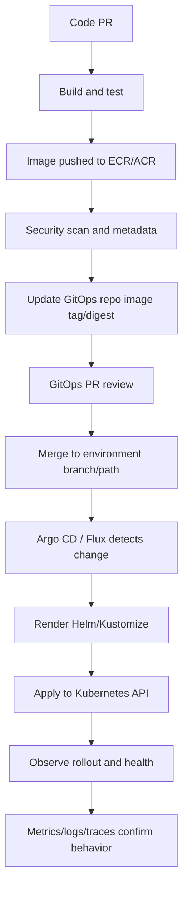

# Part 043 — GitOps with Cloud and Kubernetes

> Target pembaca: Senior Java/JAX-RS backend engineer yang perlu memahami bagaimana perubahan aplikasi, Kubernetes manifest, Helm values, secret/config reference, ingress, workload identity, dan cloud integration dipromosikan ke environment secara aman.

## 1. Konsep inti

GitOps adalah model operasi di mana **desired state** sistem disimpan di Git, lalu controller di cluster melakukan reconciliation agar live state mendekati desired state tersebut.

Untuk backend engineer, GitOps bukan sekadar cara deploy otomatis. GitOps adalah control loop produksi.

```text
Git desired state
  -> GitOps controller detects change
  -> renders manifests
  -> validates dependencies
  -> applies to Kubernetes API
  -> observes health
  -> reports sync/drift
```

Yang perlu dipahami:

- Git adalah sumber perubahan yang direview;
- controller adalah actor yang menerapkan perubahan;
- Kubernetes API menyimpan live state;
- cloud resources tidak selalu dikelola GitOps langsung;
- cloud identity, DNS, load balancer, secret, registry, dan network tetap menjadi dependency deployment;
- rollback harus dipikirkan sebagai **state restoration**, bukan hanya `kubectl apply` versi lama.

Dalam konteks Java/JAX-RS service, GitOps biasanya mengatur:

- `Deployment`;
- `Service`;
- `Ingress` atau Gateway resource;
- `ConfigMap`;
- secret reference, bukan secret plaintext;
- `ServiceAccount`;
- RBAC;
- HPA;
- PDB;
- NetworkPolicy;
- Helm release atau rendered manifest;
- image tag/digest;
- environment-specific configuration.

## 2. Kenapa GitOps ada

Tanpa GitOps, deployment sering bergantung pada pipeline imperative:

```text
CI/CD pipeline -> kubectl apply -> cluster
```

Masalahnya:

- pipeline harus punya direct cluster credential;
- perubahan manual sulit dilacak;
- state production bisa berbeda dari repository;
- rollback tidak selalu identik dengan perubahan Git;
- debugging menjadi “siapa terakhir apply apa?”;
- environment promotion rawan tidak konsisten;
- cluster recovery sulit karena desired state tersebar.

Dengan GitOps:

- perubahan deployment lewat PR;
- audit trail mengikuti commit history;
- controller mendeteksi drift;
- cluster credential bisa dibatasi ke controller;
- CI cukup update image/digest atau manifest repo;
- environment bisa dipromosikan secara deklaratif;
- rollback bisa dilakukan dengan Git revert atau revision rollback yang dipahami.

Mental model penting:

```text
CI builds artifact.
GitOps deploys desired state.
```

CI/CD masih ada, tetapi perannya berubah:

- build;
- test;
- scan;
- push image;
- update deployment repo;
- request approval;
- bukan selalu actor yang langsung menulis ke Kubernetes API production.

## 3. GitOps bukan pengganti IaC sepenuhnya

GitOps kuat untuk Kubernetes workload lifecycle. IaC kuat untuk cloud resource lifecycle.

Biasanya:

| Area | Cocok dikelola Terraform/IaC | Cocok dikelola GitOps |
|---|---:|---:|
| VPC/VNet | Ya | Tidak umum |
| Subnet/route table | Ya | Tidak |
| EKS/AKS cluster | Ya | Tidak langsung |
| IAM/RBAC cloud | Ya | Sebagian |
| Kubernetes RBAC | Bisa | Ya |
| Namespace | Bisa | Ya |
| Deployment/Service/Ingress | Tidak ideal | Ya |
| HPA/PDB/NetworkPolicy | Bisa | Ya |
| External secret reference | Bisa | Ya |
| Cloud secret value | Ya, hati-hati | Tidak plaintext |
| Database instance | Ya | Tidak |
| Application release | Tidak | Ya |

Senior engineer harus menghindari dua ekstrem:

1. Semua cloud resource dipaksa masuk GitOps Kubernetes.
2. Semua manifest Kubernetes dipaksa masuk Terraform.

Batas yang sehat:

```text
Terraform/IaC creates platform substrate.
GitOps reconciles application/platform add-on desired state.
```

## 4. Lifecycle GitOps

Lifecycle production GitOps biasanya seperti ini:



Ada dua lifecycle yang harus dibedakan.

### 4.1 Artifact lifecycle

Artifact lifecycle menjawab:

```text
Kode versi apa menjadi image apa?
```

Biasanya melibatkan:

- commit SHA;
- Maven artifact;
- container image;
- image digest;
- SBOM;
- vulnerability scan;
- signature jika digunakan;
- promotion metadata.

### 4.2 Deployment lifecycle

Deployment lifecycle menjawab:

```text
Image/config versi apa berjalan di environment apa?
```

Biasanya melibatkan:

- GitOps repo;
- environment overlay;
- Helm values;
- Kustomize patch;
- approval;
- sync;
- rollout;
- health;
- rollback.

Kesalahan umum adalah mencampur keduanya. Build berhasil bukan berarti deployment aman. Deployment sync bukan berarti application behavior benar.

## 5. GitOps repository pattern

Tidak ada satu struktur repo yang selalu benar. Yang penting adalah boundary jelas.

### 5.1 App repo + GitOps repo terpisah

```text
app-repo/
  src/
  pom.xml
  Dockerfile
  helm/              optional

gitops-repo/
  environments/
    dev/
    test/
    prod/
```

Kelebihan:

- separation antara source code dan deployment state;
- production change bisa punya approval berbeda;
- platform team bisa mengontrol deployment repo;
- audit deployment lebih bersih.

Trade-off:

- perlu automation untuk update image/tag;
- developer perlu memahami dua repo;
- drift antara chart di app repo dan values di GitOps repo harus dikontrol.

### 5.2 Monorepo deployment state

```text
platform-gitops/
  clusters/
    eks-prod-a/
    aks-prod-a/
  apps/
    quote-service/
    order-service/
  platform-addons/
    ingress/
    external-secrets/
    monitoring/
```

Kelebihan:

- visibility lintas aplikasi;
- dependency antar aplikasi/platform add-on lebih mudah dibaca;
- cocok untuk platform team.

Trade-off:

- blast radius PR lebih besar;
- permission review harus ketat;
- ownership folder harus jelas.

### 5.3 Environment branch vs environment directory

Environment branch:

```text
main
staging
production
```

Environment directory:

```text
environments/dev
environments/staging
environments/prod
```

Environment directory sering lebih mudah direview karena perubahan environment terlihat dalam satu branch. Environment branch bisa berguna jika ada policy approval per branch.

Checklist keputusan:

- siapa owner repo?;
- bagaimana production approval?;
- bagaimana promotion dev -> test -> prod?;
- apakah audit butuh branch protection khusus?;
- apakah cluster multi-region/multi-cloud?;
- apakah app team boleh mengubah ingress/RBAC/secret reference sendiri?

## 6. Argo CD mental model

Argo CD adalah Kubernetes controller untuk continuous delivery deklaratif.

Komponen yang perlu dipahami backend engineer:

- `Application`: mendefinisikan source repo, destination cluster/namespace, dan sync policy;
- sync status: desired state vs live state;
- health status: apakah resource sehat menurut health check;
- automated sync: controller otomatis apply jika out-of-sync;
- manual sync: operator men-trigger sync;
- sync waves/phases: ordering resource;
- hooks: job atau resource khusus dalam fase deployment;
- prune: menghapus resource live yang tidak lagi ada di desired state;
- self-heal: mengembalikan manual drift.

Mental model:

```text
Argo CD compares Git target state with Kubernetes live state.
OutOfSync means state differs.
Healthy means resource condition is acceptable.
Synced does not always mean application is logically correct.
```

Production risk utama:

- automated prune menghapus resource yang masih dibutuhkan;
- sync order salah sehingga CRD belum ada saat CR dibuat;
- health check custom tidak akurat;
- automated self-heal menimpa emergency manual patch;
- wrong cluster/namespace destination;
- Helm values salah untuk production.

## 7. Flux mental model

Flux juga melakukan reconciliation GitOps, tetapi modelnya tersusun dari toolkit controller.

Konsep penting:

- `GitRepository` atau source object;
- `Kustomization` untuk fetch/build/apply manifest;
- `HelmRepository`, `HelmChart`, `HelmRelease` untuk Helm;
- interval reconciliation;
- dependency antar Kustomization;
- suspend/resume reconciliation;
- health checks;
- drift reconciliation.

Mental model:

```text
Flux source controller fetches source.
Kustomize/Helm controller reconciles declared workloads.
Each object has its own reconciliation interval and status.
```

Production risk utama:

- interval terlalu lama untuk incident rollback;
- dependency graph antar Kustomization tidak jelas;
- HelmRelease failure tersembunyi di status object;
- manual hotfix ditimpa reconciliation;
- secret decryption/provider integration rusak;
- source repo authentication expired.

## 8. Helm values dan release correctness

Helm memudahkan packaging, tetapi values bisa menjadi sumber failure besar.

Untuk Java/JAX-RS service, values biasanya mencakup:

```yaml
image:
  repository: example/quote-service
  tag: "1.24.3"
  digest: "sha256:..."

replicaCount: 3

resources:
  requests:
    cpu: 500m
    memory: 1Gi
  limits:
    memory: 2Gi

env:
  JAVA_TOOL_OPTIONS: "-XX:MaxRAMPercentage=75"

serviceAccount:
  annotations:
    eks.amazonaws.com/role-arn: arn:aws:iam::...
```

Hal yang harus direview:

- image tag mutable atau digest immutable?;
- values production berbeda apa dari staging?;
- secret value tidak tersimpan plaintext?;
- resource request cukup untuk JVM?;
- readiness probe sesuai endpoint yang benar?;
- liveness probe tidak membunuh pod saat dependency lambat?;
- ingress hostname dan TLS secret benar?;
- service account annotation sesuai role/identity?;
- HPA metric cocok dengan workload?;
- PDB mencegah semua pod turun saat upgrade node?

## 9. Kustomize overlay

Kustomize umum dipakai untuk environment-specific patch.

Contoh struktur:

```text
apps/quote-service/
  base/
    deployment.yaml
    service.yaml
    kustomization.yaml
  overlays/
    dev/
      kustomization.yaml
      patch-env.yaml
    prod/
      kustomization.yaml
      patch-replicas.yaml
      patch-resources.yaml
```

Gunakan overlay untuk:

- replica count;
- resource requests/limits;
- environment label;
- ingress host;
- external secret reference;
- service account annotation;
- HPA threshold;
- NetworkPolicy.

Jangan gunakan overlay untuk menyembunyikan perbedaan architecture besar tanpa dokumentasi. Jika production memakai private endpoint dan dev memakai public endpoint, itu bukan sekadar patch kecil; itu perbedaan operational behavior.

## 10. Environment promotion

Environment promotion bukan copy-paste manifest.

Model yang sehat:

```text
same artifact, different environment configuration
```

Artifact yang sama harus dipromosikan:

- dev -> test -> staging -> prod;
- dengan digest yang sama;
- dengan config environment-specific yang direview;
- dengan approval sesuai risiko;
- dengan smoke test dan rollback plan.

Anti-pattern:

```text
build ulang image untuk production dari branch berbeda tanpa traceability
```

Risiko:

- code yang diuji bukan code yang dideploy;
- vulnerability scan tidak merepresentasikan production image;
- RCA sulit;
- rollback tidak pasti.

## 11. Sync wave dan dependency ordering

Beberapa resource harus diterapkan berurutan.

Contoh dependency:

```text
Namespace -> RBAC -> ServiceAccount -> Secret reference -> Deployment -> Service -> Ingress
```

Untuk platform add-on:

```text
CRD -> Controller -> Custom Resource -> Application workload
```

Jika order salah:

- custom resource gagal karena CRD belum ada;
- pod gagal start karena ServiceAccount belum ada;
- ExternalSecret belum membuat Kubernetes Secret;
- Ingress controller belum siap;
- cert belum diterbitkan;
- admission webhook belum tersedia.

Senior engineer harus bertanya:

- resource mana yang punya dependency keras?;
- resource mana yang hanya dependency observability?;
- apakah sync wave/hook digunakan?;
- apakah hook idempotent?;
- apakah job hook aman dijalankan ulang?;
- apakah failure hook bisa membuat sync macet?

## 12. Health check GitOps vs application health

GitOps health check berbeda dari application SLO.

GitOps healthy berarti resource Kubernetes tampak sehat. Application healthy berarti service memenuhi behavior yang diharapkan.

Contoh gap:

| GitOps status | Application reality |
|---|---|
| Deployment available | endpoint utama error 500 |
| Service exists | selector salah sehingga no endpoints |
| Ingress synced | DNS belum resolve |
| Pod ready | dependency PostgreSQL down |
| HelmRelease deployed | config business salah |

Karena itu setelah sync perlu:

- smoke test;
- synthetic check;
- application metrics;
- error rate monitoring;
- trace sampling;
- log query;
- business-level guardrail jika relevan.

## 13. Drift detection

Drift adalah perbedaan antara desired state di Git dan live state di cluster.

Penyebab drift:

- manual `kubectl edit`;
- emergency patch;
- controller lain mengubah field;
- defaulting/mutating webhook;
- HPA mengubah replicas;
- cloud load balancer controller menambah annotation/status;
- cert-manager mengelola certificate status;
- external secret controller mengelola secret;
- operator mengelola child resources.

Tidak semua drift buruk. Yang buruk adalah drift yang tidak dipahami.

Field yang memang dikelola controller lain harus di-ignore dengan hati-hati. Jangan ignore field luas seperti seluruh `spec`, karena itu membutakan review.

## 14. Manual change risk

Manual change di production kadang diperlukan saat incident, tetapi harus diperlakukan sebagai exception.

Risiko manual change:

- ditimpa oleh GitOps self-heal;
- tidak ada audit PR;
- tidak masuk rollback model;
- membuat cluster berbeda dari repo;
- RCA bias karena Git tidak menunjukkan perubahan;
- environment lain tidak menerima fix yang sama.

Policy yang sehat:

```text
Manual change allowed only for incident mitigation.
Every manual change must be backported to Git or reverted.
```

Checklist setelah emergency patch:

- catat command yang dijalankan;
- capture diff live vs Git;
- buat PR untuk menyelaraskan desired state;
- putuskan patch dipertahankan atau rollback;
- update runbook jika patch mengungkap blind spot.

## 15. Rollback strategy

Rollback GitOps bukan satu mekanisme tunggal.

Pilihan rollback:

1. Git revert commit deployment.
2. Revert image tag/digest ke versi sebelumnya.
3. Helm rollback jika Helm release history digunakan.
4. Argo CD rollback ke previous application revision.
5. Flux reconcile ke commit/tag sebelumnya.
6. Manual patch sementara saat incident.

Urutan yang disarankan:

```text
Prefer Git revert for auditability.
Use controller rollback only if time-critical and documented.
Avoid manual kubectl rollback unless emergency.
```

Hal yang sering dilupakan:

- rollback aplikasi tidak rollback database migration;
- rollback image tidak rollback config external;
- rollback Deployment tidak rollback cloud load balancer config;
- rollback ke versi lama bisa gagal jika secret sudah dirotasi;
- rollback bisa memperkenalkan incompatibility dengan Kafka event schema;
- rollback bisa gagal jika old image sudah dihapus dari registry.

## 16. Secret integration

GitOps repo tidak boleh menyimpan secret plaintext.

Pattern umum:

- External Secrets Operator membaca AWS Secrets Manager/Azure Key Vault;
- Secrets Store CSI Driver mount secret dari provider;
- sealed secret atau encrypted secret jika organisasi mengizinkan;
- reference ke secret name, bukan secret value;
- workload identity untuk akses secret manager;
- audit log di secret manager.

Contoh desired state yang lebih aman:

```yaml
apiVersion: external-secrets.io/v1beta1
kind: ExternalSecret
metadata:
  name: quote-service-db
spec:
  refreshInterval: 1h
  secretStoreRef:
    name: platform-secret-store
    kind: ClusterSecretStore
  target:
    name: quote-service-db
  data:
    - secretKey: password
      remoteRef:
        key: /prod/quote-service/db/password
```

Yang perlu direview:

- secret value tidak masuk Git;
- remote secret path benar untuk environment;
- refresh interval sesuai rotation;
- pod restart/reload strategy jelas;
- service account punya permission minimal;
- audit log secret access aktif;
- secret tidak tercetak di Argo/Flux diff/log.

## 17. AWS/EKS implementation awareness

Di AWS/EKS, GitOps biasanya berinteraksi dengan:

- ECR untuk image pull;
- IRSA atau EKS Pod Identity untuk controller/workload identity;
- AWS Load Balancer Controller untuk ALB/NLB;
- ExternalDNS jika digunakan untuk Route 53;
- cert-manager jika digunakan untuk certificate;
- External Secrets Operator atau Secrets Store CSI Driver untuk Secrets Manager/SSM;
- CloudWatch/ADOT/Prometheus untuk observability;
- Terraform untuk VPC, EKS, IAM, endpoint, registry, DNS zone.

Backend engineer perlu mengecek:

- apakah Argo/Flux controller berjalan di cluster yang sama?;
- apakah controller punya permission cluster-admin atau scoped?;
- apakah production namespace protected?;
- apakah GitOps controller dapat mengubah ServiceAccount/IAM annotation?;
- apakah Ingress annotation bisa membuat ALB publik tanpa review?;
- apakah image dari ECR dipin by digest?;
- apakah private ECR endpoint digunakan jika cluster private?;
- apakah Route 53 record dikelola GitOps atau IaC?;
- apakah AWS Load Balancer Controller punya IAM permission minimal?

## 18. Azure/AKS implementation awareness

Di Azure/AKS, GitOps biasanya berinteraksi dengan:

- Azure Container Registry untuk image pull;
- AKS managed identity/workload identity;
- Application Gateway Ingress Controller jika digunakan;
- Azure Load Balancer service integration;
- ExternalDNS jika digunakan untuk Azure DNS;
- Azure Key Vault Provider for Secrets Store CSI Driver;
- External Secrets Operator jika digunakan;
- Azure Monitor/Container Insights;
- Terraform/Bicep untuk VNet, AKS, managed identity, private endpoint, ACR, DNS zone.

Backend engineer perlu mengecek:

- apakah AKS punya ACR integration?;
- apakah workload identity aktif?;
- apakah controller identity punya permission terlalu luas?;
- apakah private cluster membutuhkan network path khusus untuk controller?;
- apakah Application Gateway/AGIC dikelola oleh platform atau app team?;
- apakah Private DNS Zone binding dikelola IaC?;
- apakah Key Vault secret reference environment-specific?;
- apakah NSG/UDR dapat membuat sync berhasil tetapi traffic gagal?

## 19. GitOps dan Java/JAX-RS service

Untuk Java/JAX-RS service, GitOps PR biasanya terlihat seperti perubahan YAML. Dampaknya bisa sangat runtime.

Contoh perubahan kecil dengan dampak besar:

| Perubahan GitOps | Dampak Java/JAX-RS |
|---|---|
| memory limit turun | JVM OOMKilled atau GC pressure |
| readiness path salah | pod tidak menerima traffic |
| liveness terlalu agresif | restart loop saat dependency lambat |
| env var timeout berubah | thread pool habis atau request latency naik |
| image tag latest | rollback tidak deterministik |
| service account berubah | SDK AccessDenied |
| secret path berubah | startup gagal |
| ingress timeout berubah | request upload/download gagal |
| HPA min replica turun | cold capacity insufficient |
| PDB dihapus | rolling upgrade menyebabkan outage |

Senior engineer harus membaca YAML sebagai runtime behavior, bukan sekadar deployment metadata.

## 20. GitOps untuk microservices dependency

Dalam sistem CPQ/order management, service jarang berdiri sendiri.

Dependency bisa berupa:

- PostgreSQL;
- Kafka;
- RabbitMQ;
- Redis;
- Camunda;
- object storage;
- API internal;
- API external;
- identity provider;
- config/secret service.

GitOps harus memastikan deployment tidak merusak dependency contract.

Contoh:

- producer event schema berubah, consumer belum siap;
- service endpoint berubah, downstream config belum dipromosikan;
- migration butuh backward compatibility;
- cache key format berubah;
- Camunda worker name/topic berubah;
- API gateway route berubah tetapi ingress service belum siap.

Pattern aman:

```text
Backward-compatible first.
Deploy dependency-aware.
Observe before cleanup.
Remove old path last.
```

## 21. Observability untuk GitOps

GitOps controller sendiri harus observable.

Signal penting:

- application sync status;
- application health status;
- reconciliation error;
- source repo authentication error;
- Helm render error;
- Kustomize build error;
- Kubernetes apply error;
- webhook/admission failure;
- drift count;
- sync duration;
- failed hook job;
- controller pod health;
- controller API latency;
- Git rate limit atau network error.

Application signal setelah sync:

- rollout status;
- pod restart count;
- readiness failure;
- HTTP 5xx;
- p95/p99 latency;
- JVM memory/GC;
- thread pool saturation;
- database connection pool;
- SDK error count;
- business transaction failure.

## 22. Security concern

GitOps memperkuat security jika boundary benar. GitOps memperbesar risiko jika repo/controller terlalu powerful.

Hal yang perlu dijaga:

- branch protection;
- required review;
- CODEOWNERS;
- signed commit jika digunakan;
- least privilege controller;
- namespace-scoped permissions jika memungkinkan;
- separation platform add-on vs application workload;
- secret redaction;
- no plaintext secret;
- production approval;
- audit log Git + Kubernetes + cloud;
- image digest pinning;
- admission policy untuk mencegah privileged workload;
- policy untuk public ingress creation.

Red flag:

```text
Any developer can merge a production GitOps PR that creates public ingress, privileged pod, wildcard RBAC, or secret exfiltration path.
```

## 23. Performance dan cost concern

GitOps juga bisa menyebabkan cost/performance issue.

Contoh:

- HPA min replica dinaikkan tanpa cost review;
- resource requests terlalu tinggi sehingga node scale out;
- logging sidecar menambah ingestion cost;
- ALB/NLB baru dibuat per service tanpa kebutuhan;
- namespace baru membuat duplicate monitoring stack;
- sync loop gagal terus dan membebani API server;
- Helm chart membuat PVC besar;
- debug flag meningkatkan log volume;
- high-cardinality metric label ditambahkan lewat config.

Review cost tidak boleh hanya di Terraform PR. GitOps PR juga bisa menaikkan biaya production.

## 24. Failure modes

### 24.1 Controller tidak bisa membaca Git

Gejala:

- sync tidak berjalan;
- source repo connection failed;
- auth error;
- stale revision.

Kemungkinan penyebab:

- deploy key/token expired;
- network egress blocked;
- proxy/NO_PROXY salah;
- Git provider outage;
- TLS trust issue;
- repo URL berubah.

Debug:

```bash
kubectl -n argocd get pods
kubectl -n argocd logs deploy/argocd-repo-server
kubectl -n flux-system get gitrepositories
kubectl -n flux-system describe gitrepository <name>
```

### 24.2 Render gagal

Gejala:

- Helm template error;
- Kustomize build error;
- missing values;
- invalid YAML.

Debug:

```bash
helm template ./chart -f values-prod.yaml
kubectl kustomize overlays/prod
```

### 24.3 Apply gagal

Gejala:

- forbidden;
- CRD not found;
- admission webhook denied;
- immutable field error;
- namespace missing.

Debug:

```bash
kubectl auth can-i create deployments -n <namespace> --as <controller-sa>
kubectl get events -n <namespace> --sort-by=.lastTimestamp
kubectl describe application <app> -n argocd
```

### 24.4 Sync sukses tetapi service down

Gejala:

- Argo/Flux synced;
- pods restart;
- readiness gagal;
- 502/503;
- Java logs error.

Debug:

```bash
kubectl rollout status deployment/<app> -n <namespace>
kubectl get pods -n <namespace>
kubectl describe pod <pod> -n <namespace>
kubectl logs <pod> -n <namespace> --previous
kubectl get endpointslice -n <namespace>
```

### 24.5 Drift berulang

Gejala:

- out-of-sync muncul lagi setelah sync;
- field tertentu selalu berubah.

Kemungkinan penyebab:

- controller lain mutating field;
- HPA mengubah replicas;
- admission webhook defaulting;
- status field ikut dibandingkan;
- Helm chart render nondeterministic.

Debug:

```bash
kubectl diff -f rendered.yaml
kubectl get <resource> -o yaml
```

## 25. Production-safe debugging steps

Saat deployment production bermasalah:

1. Jangan langsung disable GitOps self-heal kecuali tahu dampaknya.
2. Ambil current revision di GitOps controller.
3. Ambil diff desired vs live.
4. Cek event Kubernetes.
5. Cek rollout status.
6. Cek pod logs dan previous logs.
7. Cek readiness/liveness failures.
8. Cek ingress/load balancer target health.
9. Cek secret/config availability.
10. Cek image pull dan registry access.
11. Putuskan rollback via Git revert atau controller rollback.
12. Catat semua manual action.

Jangan melakukan `kubectl delete` resource production tanpa memahami owner reference dan controller reconciliation.

## 26. PR review checklist

Gunakan checklist ini saat mereview GitOps PR.

### 26.1 Artifact dan image

- Apakah image tag immutable?
- Apakah digest digunakan?
- Apakah image sudah discan?
- Apakah old image masih tersedia untuk rollback?
- Apakah registry private access valid?

### 26.2 Runtime config

- Apakah config environment-specific benar?
- Apakah secret hanya direferensikan, bukan disimpan plaintext?
- Apakah timeout/retry config masuk akal?
- Apakah config change backward-compatible?

### 26.3 Kubernetes workload

- Apakah resource request/limit cocok untuk JVM?
- Apakah readiness/liveness/startup probe benar?
- Apakah HPA/PDB ada?
- Apakah rolling update strategy aman?
- Apakah pod labels/selectors konsisten?

### 26.4 Networking

- Apakah Service port/targetPort benar?
- Apakah Ingress/Gateway route benar?
- Apakah hostname/DNS sesuai environment?
- Apakah public/private exposure disengaja?
- Apakah NetworkPolicy tidak memutus dependency?

### 26.5 Identity/security

- Apakah ServiceAccount benar?
- Apakah IAM role/managed identity sesuai least privilege?
- Apakah RBAC tidak wildcard?
- Apakah pod security context aman?
- Apakah secret access scoped?

### 26.6 Observability

- Apakah log format tetap kompatibel?
- Apakah metrics/tracing tetap aktif?
- Apakah dashboard/alert perlu update?
- Apakah correlation header tidak hilang?

### 26.7 Rollback

- Apakah rollback cukup dengan Git revert?
- Apakah ada database migration irreversible?
- Apakah secret rotation membuat rollback gagal?
- Apakah old config masih kompatibel?
- Apakah smoke test tersedia?

## 27. Internal verification checklist

Verifikasi hal berikut di internal CSG/team, jangan diasumsikan.

### GitOps platform

- Tool yang digunakan: Argo CD, Flux, atau lainnya.
- Cluster mana yang menjalankan GitOps controller.
- Controller namespace.
- Controller permission model.
- Cluster-scoped vs namespace-scoped access.
- Automated sync policy.
- Prune/self-heal policy.
- Sync wave/hook convention.
- Drift ignore convention.

### Repository dan promotion

- GitOps repo utama.
- App repo vs deployment repo boundary.
- Branch/directory strategy per environment.
- CODEOWNERS.
- Required approvals.
- Production change window.
- Emergency change process.
- Promotion mechanism dev/test/staging/prod.
- Image tag/digest update automation.

### EKS/AKS integration

- ECR/ACR integration.
- Private registry endpoint.
- Ingress controller ownership.
- ALB/NLB/Application Gateway integration.
- DNS automation.
- Certificate manager.
- External secret/CSI driver.
- Workload identity setup.
- NetworkPolicy enforcement.

### Observability dan runbook

- GitOps dashboard.
- Alert untuk sync failure.
- Alert untuk app unhealthy after sync.
- Rollback runbook.
- Incident notes terkait deployment.
- Known failure pattern.
- Escalation path ke platform/SRE/security.

## 28. Senior engineer mental model

GitOps PR bukan hanya deployment PR.

GitOps PR dapat mengubah:

- runtime identity;
- network exposure;
- traffic path;
- secret source;
- JVM behavior;
- resource capacity;
- autoscaling behavior;
- failure isolation;
- observability;
- cost;
- rollback ability.

Karena itu review GitOps harus memakai pertanyaan:

```text
Jika PR ini merged dan controller reconcile otomatis, apa yang berubah di runtime production path?
```

Bukan hanya:

```text
YAML-nya valid atau tidak?
```

## 29. Ringkasan

GitOps memberi discipline untuk menjalankan Kubernetes production system:

- desired state versioned;
- change auditable;
- drift visible;
- deployment repeatable;
- rollback lebih terstruktur;
- CI/CD credential exposure bisa dikurangi.

Tetapi GitOps juga memperbesar risiko jika:

- controller terlalu powerful;
- repo permission lemah;
- secret plaintext masuk Git;
- sync/prune/self-heal tidak dipahami;
- Helm/Kustomize overlay tidak direview sebagai runtime behavior;
- observability setelah sync tidak ada.

Untuk senior backend engineer, skill pentingnya adalah mampu membaca GitOps change sebagai perubahan production behavior aplikasi Java/JAX-RS di atas Kubernetes, AWS/Azure networking, identity, secret, registry, observability, dan cost boundary.

## 30. Referensi resmi

- Argo CD documentation: https://argo-cd.readthedocs.io/en/stable/
- Argo CD automated sync: https://argo-cd.readthedocs.io/en/latest/user-guide/auto_sync/
- Argo CD sync phases and waves: https://argo-cd.readthedocs.io/en/stable/user-guide/sync-waves/
- Flux concepts: https://fluxcd.io/flux/concepts/
- Flux Kustomization: https://fluxcd.io/flux/components/kustomize/kustomizations/
- Helm rollback command: https://helm.sh/docs/helm/helm_rollback/
- Kustomize reference: https://kubectl.docs.kubernetes.io/references/kustomize/
- External Secrets Operator: https://external-secrets.io/latest/
- Secrets Store CSI Driver: https://secrets-store-csi-driver.sigs.k8s.io/
