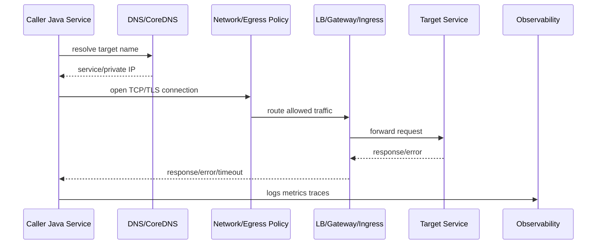

# Part 044 — Service-to-Service Communication

> Target pembaca: Senior Java/JAX-RS backend engineer yang perlu mendesain, mereview, dan men-debug komunikasi antar service di Kubernetes, AWS, Azure, on-prem, dan hybrid deployment.

## 1. Konsep inti

Service-to-service communication adalah cara satu workload memanggil workload atau dependency lain secara aman, reliable, observable, dan bounded.

Dalam enterprise system, komunikasi service bukan sekadar:

```text
service A calls service B
```

Yang sebenarnya terjadi:

```text
caller code
  -> HTTP/gRPC/messaging client
  -> DNS
  -> egress policy
  -> service identity
  -> load balancer / ingress / gateway / private endpoint
  -> target service
  -> authn/authz
  -> timeout/retry/circuit breaker
  -> logs/metrics/traces
```

Untuk Java/JAX-RS service, call antar service memengaruhi:

- thread pool;
- connection pool;
- request timeout;
- transaction boundary;
- retry behavior;
- idempotency;
- error mapping;
- observability;
- security context;
- downstream blast radius.

## 2. Kenapa konsep ini ada

Microservices memecah domain dan ownership, tetapi memperkenalkan distributed failure.

Dalam monolith:

```text
method call is local
```

Dalam microservices:

```text
method call becomes network call
```

Network call punya failure mode:

- DNS gagal;
- route salah;
- firewall deny;
- certificate invalid;
- token expired;
- target unhealthy;
- load balancer 502/503/504;
- connection refused;
- connection reset;
- timeout;
- partial success;
- duplicate request karena retry;
- rate limit;
- cross-region latency;
- service dependency overload.

Karena itu service communication harus didesain sebagai **failure boundary**, bukan hanya integration detail.

## 3. Communication pattern utama

### 3.1 Synchronous HTTP call

Contoh:

```text
quote-service -> catalog-service
order-service -> account-service
```

Kelebihan:

- request/response jelas;
- cocok untuk query real-time;
- mudah dipahami developer;
- integrasi JAX-RS natural.

Risiko:

- caller ikut lambat saat target lambat;
- retry bisa memperbesar beban;
- cascading failure;
- distributed transaction temptation;
- timeout chain sering salah.

### 3.2 Asynchronous messaging

Contoh:

```text
quote-service -> Kafka topic -> order-service
order-service -> RabbitMQ queue -> worker
```

Kelebihan:

- decoupling waktu;
- resilience terhadap target down sementara;
- cocok untuk event dan command async;
- consumer bisa scale terpisah.

Risiko:

- eventual consistency;
- duplicate message;
- ordering issue;
- poison message;
- replay risk;
- schema compatibility;
- observability lebih sulit.

### 3.3 Shared data anti-pattern

Contoh buruk:

```text
service A reads service B database table directly
```

Risiko:

- ownership boundary hilang;
- migration sulit;
- coupling schema;
- security boundary bocor;
- transaction semantics membingungkan;
- incident satu service menjadi incident lintas service.

## 4. Lifecycle synchronous service call

Lifecycle call HTTP antar service:



Setiap step harus bisa diobservasi atau minimal bisa diuji.

Pertanyaan production:

- nama DNS apa yang dipanggil?;
- resolve ke IP apa dari pod?;
- route lewat mana?;
- apakah traffic private?;
- apakah TLS terminate di mana?;
- identity apa yang digunakan?;
- timeout siapa yang paling pendek?;
- retry siapa yang aktif?;
- apakah request id/correlation id terbawa?;
- apakah target melihat caller identity?

## 5. Internal DNS

Internal DNS adalah pondasi service discovery.

Di Kubernetes, service biasanya dipanggil via DNS:

```text
http://catalog-service.catalog.svc.cluster.local:8080
```

Atau short name jika namespace sama:

```text
http://catalog-service:8080
```

Untuk private cloud dependency:

```text
postgres.prod.internal.example.com
vault.privatelink.vaultcore.azure.net
bucket.s3.<region>.amazonaws.com via VPC endpoint DNS
```

Risk:

- DNS name resolve ke public IP padahal harus private;
- split-horizon DNS salah;
- CoreDNS overload;
- Private DNS Zone/hosted zone tidak linked ke VNet/VPC;
- TTL terlalu lama saat failover;
- search domain membuat request ke nama salah;
- DNS caching di JVM/client tidak sesuai kebutuhan.

Debug dasar dari pod:

```bash
kubectl exec -n <namespace> <pod> -- nslookup catalog-service
kubectl exec -n <namespace> <pod> -- nslookup catalog-service.catalog.svc.cluster.local
kubectl exec -n <namespace> <pod> -- nslookup <private-endpoint-hostname>
```

Jangan hanya test DNS dari laptop. Test dari pod yang sama dengan workload.

## 6. Kubernetes Service sebagai stable endpoint

Kubernetes `Service` memberi stable virtual endpoint untuk pod yang berubah.

Service mengabstraksi:

- pod replica;
- pod IP dinamis;
- readiness state;
- endpoint selection;
- load distribution internal.

Yang harus direview:

```yaml
apiVersion: v1
kind: Service
metadata:
  name: catalog-service
spec:
  selector:
    app: catalog-service
  ports:
    - name: http
      port: 8080
      targetPort: 8080
```

Common failure:

- selector tidak match pod label;
- `targetPort` salah;
- pod belum Ready sehingga tidak masuk endpoint;
- service name berubah tanpa update caller;
- namespace salah;
- NetworkPolicy memblokir traffic;
- kube-proxy/CNI issue.

Debug:

```bash
kubectl get svc -n <namespace>
kubectl get endpointslice -n <namespace> -l kubernetes.io/service-name=<service>
kubectl describe svc <service> -n <namespace>
kubectl get pods -n <namespace> --show-labels
```

## 7. Load balancer, ingress, dan API gateway

Tidak semua service-to-service call harus lewat path yang sama.

### 7.1 Direct Kubernetes Service

Cocok untuk:

- service dalam namespace/cluster yang sama;
- internal low-latency call;
- tidak butuh edge policy khusus.

Risiko:

- melewati central auth/rate limit jika itu diwajibkan;
- sulit cross-cluster;
- tidak cocok untuk consumer external.

### 7.2 Internal ingress/load balancer

Cocok untuk:

- cross-namespace dengan policy ingress;
- cross-cluster internal;
- layanan yang perlu stable internal hostname;
- TLS termination terpusat.

Risiko:

- tambahan hop;
- health check harus benar;
- timeout chain makin panjang;
- source IP mungkin berubah;
- misconfiguration bisa membuat exposure public.

### 7.3 API Gateway/APIM

Cocok untuk:

- API yang dikonsumsi banyak client;
- central auth/rate limit;
- subscription key/usage plan;
- transformation/versioning;
- private API lintas network.

Risiko:

- overhead latency;
- policy error menjadi runtime error;
- gateway timeout berbeda dari app timeout;
- auth policy bisa drift dari app requirement;
- developer menganggap gateway menggantikan service authorization.

## 8. Private endpoint dan PrivateLink

Private endpoint dipakai ketika service dependency harus diakses lewat private network, bukan public internet.

Contoh:

- pod EKS ke S3 via Gateway/Interface Endpoint;
- pod EKS ke private API via PrivateLink;
- pod AKS ke Azure Key Vault via Private Endpoint;
- on-prem client ke private endpoint via ExpressRoute/VPN;
- service ke managed PostgreSQL private address.

Checklist private access:

- DNS resolve ke private IP?;
- route table/UDR benar?;
- Security Group/NSG allow?;
- firewall allow?;
- identity permission benar?;
- TLS certificate hostname tetap valid?;
- SDK endpoint config tidak memaksa public endpoint?;
- observability membedakan private vs public path?

Debug:

```bash
kubectl exec -n <ns> <pod> -- nslookup <service-host>
kubectl exec -n <ns> <pod> -- curl -v https://<service-host>/health
kubectl exec -n <ns> <pod> -- nc -vz <host> <port>
```

Untuk cloud-managed service, jangan menyimpulkan “private” hanya karena workload berada di private subnet. Lihat DNS resolution dan route aktual.

## 9. Service identity

Service identity menjawab:

```text
Service ini berjalan sebagai siapa?
```

Bentuknya bisa:

- Kubernetes ServiceAccount;
- AWS IAM role via IRSA/EKS Pod Identity;
- Azure workload identity/managed identity;
- service principal;
- SPIFFE identity jika service mesh digunakan;
- client certificate identity;
- JWT subject/audience/claim.

Service identity harus dibedakan dari user identity.

Contoh:

```text
User identity: jane.doe@company.com
Service identity: quote-service-prod
```

Saat quote-service memanggil order-service, target perlu tahu:

- ini request dari service apa?;
- apakah service itu boleh memanggil endpoint ini?;
- apakah request membawa user context?;
- apakah user context boleh dipercaya?;
- apakah service identity dan user identity dicatat di audit log?

## 10. mTLS

mTLS memberi mutual authentication di layer TLS: client memverifikasi server, server memverifikasi client.

mTLS berguna untuk:

- service identity berbasis certificate;
- zero-trust internal network;
- mencegah service spoofing;
- encrypted traffic antar service;
- policy berbasis workload identity.

mTLS bisa diimplementasikan lewat:

- service mesh;
- gateway;
- application-level TLS client certificate;
- platform sidecar/proxy;
- internal PKI.

Trade-off:

- certificate lifecycle kompleks;
- debugging TLS lebih sulit;
- sidecar menambah latency/resource;
- identity mapping harus jelas;
- cross-cluster/cross-cloud trust domain sulit;
- certificate rotation bisa menyebabkan outage.

Failure mode:

- `SSLHandshakeException`;
- unknown CA;
- certificate expired;
- SAN mismatch;
- client cert missing;
- trust domain mismatch;
- mesh policy strict tetapi workload belum sidecar-enabled.

## 11. JWT dan service authorization

JWT sering dipakai untuk membawa identity/claims.

Dalam service-to-service communication, JWT bisa merepresentasikan:

- end-user delegated identity;
- service identity;
- internal authorization context;
- tenant/customer context;
- request scope.

Yang harus hati-hati:

- target harus memverifikasi signature;
- `audience` harus benar;
- expiry harus pendek tapi tidak terlalu agresif;
- issuer harus trusted;
- claim tidak boleh dipercaya hanya karena header ada;
- token forwarding harus mengikuti policy privacy;
- service token dan user token jangan dicampur sembarangan.

Pattern umum:

```text
mTLS authenticates workload.
JWT carries user/service authorization context.
AuthorizationPolicy or app code enforces allowed action.
```

Anti-pattern:

```text
Caller sends X-User-Id header and target trusts it without authentication boundary.
```

## 12. Header propagation

Header propagation penting untuk observability dan correctness.

Header umum:

- `traceparent`;
- `tracestate`;
- `x-request-id`;
- `x-correlation-id`;
- `x-causation-id`;
- `authorization` jika policy mengizinkan;
- tenant/customer header jika ada;
- idempotency key;
- locale/timezone jika relevan;
- original client IP headers jika lewat proxy.

Risiko:

- correlation ID hilang di hop tertentu;
- authorization header diforward ke service yang tidak boleh menerimanya;
- tenant header bisa dipalsukan;
- idempotency key tidak diteruskan ke downstream command;
- trace cardinality terlalu tinggi;
- PII masuk logs.

Untuk Java/JAX-RS, propagation biasanya dilakukan via:

- server request filter;
- client request filter;
- OpenTelemetry instrumentation;
- MicroProfile Rest Client filter;
- custom HTTP client interceptor.

## 13. Timeout chain

Timeout harus didesain end-to-end.

Contoh chain:

```text
client timeout: 30s
API gateway timeout: 29s
ingress timeout: 25s
caller service outbound timeout: 2s
target service server timeout: 5s
database query timeout: 1s
```

Prinsip:

- caller timeout harus lebih pendek dari upstream timeout;
- downstream timeout harus cukup kecil untuk menjaga thread pool;
- retry total duration harus masuk request budget;
- jangan ada infinite timeout;
- timeout harus berbeda untuk connect, read, write, acquire connection;
- streaming endpoint butuh treatment khusus.

Anti-pattern:

```text
HTTP client default timeout tidak dikonfigurasi.
```

Dampak:

- thread pool habis;
- connection pool penuh;
- request menumpuk;
- GC pressure;
- autoscaling terlambat;
- retry storm.

## 14. Retry, backoff, dan idempotency

Retry hanya aman jika operasi idempotent atau punya idempotency key.

Retry cocok untuk:

- transient network error;
- connection reset;
- selected 502/503/504;
- throttling dengan backoff;
- leader failover singkat.

Retry berbahaya untuk:

- create order tanpa idempotency key;
- payment-like operation;
- command yang memicu event;
- long-running workflow trigger;
- endpoint yang sudah melakukan partial side effect.

Prinsip:

```text
Retry must be bounded, jittered, observable, and idempotency-aware.
```

Checklist:

- max attempts;
- total timeout budget;
- exponential backoff;
- jitter;
- retryable error classification;
- idempotency key;
- duplicate handling;
- metric retry count;
- log final failure only with context;
- no synchronized retry storm.

## 15. Circuit breaker dan bulkhead

Circuit breaker mencegah caller terus memanggil dependency yang sedang gagal.

State umum:

```text
closed -> open -> half-open -> closed/open
```

Bulkhead membatasi resource yang dipakai untuk dependency tertentu.

Contoh:

- thread pool terpisah untuk external pricing API;
- connection pool terpisah untuk catalog-service;
- semaphore limit untuk slow dependency;
- queue kecil untuk dependency non-critical.

Tanpa bulkhead, satu dependency lambat bisa menghabiskan seluruh worker thread JAX-RS.

Trade-off:

- circuit breaker terlalu agresif menyebabkan false outage;
- terlalu longgar tidak melindungi caller;
- fallback bisa menyembunyikan data correctness issue;
- half-open probe harus hati-hati.

## 16. Egress policy

Egress policy menjawab:

```text
Service ini boleh keluar ke mana?
```

Layer yang bisa mengontrol egress:

- Kubernetes NetworkPolicy;
- CNI policy;
- service mesh egress policy;
- proxy;
- firewall;
- NAT Gateway;
- Azure Firewall;
- SG/NSG;
- DNS allowlist;
- private endpoint/VPC endpoint.

Risk:

- service bisa call internet tanpa kontrol;
- egress via NAT mahal;
- TLS inspection memecah SDK/certificate validation;
- NO_PROXY salah sehingga private endpoint lewat proxy;
- allowlist domain tidak cukup karena dependency resolve dinamis;
- NetworkPolicy tidak enforced karena CNI tidak mendukung/enabled.

Senior engineer harus tahu egress path aktual, bukan hanya konfigurasi aplikasi.

## 17. AWS-specific implementation awareness

Di AWS/EKS, service communication bisa melalui:

- Kubernetes Service DNS;
- ALB Ingress;
- NLB Service;
- API Gateway private/public integration;
- VPC Endpoint;
- PrivateLink;
- Route 53 private hosted zone;
- Security Group;
- NACL;
- Transit Gateway;
- NAT Gateway;
- IRSA/EKS Pod Identity;
- Secrets Manager/SSM access;
- RDS/MSK/ElastiCache private endpoint/subnet.

Review AWS-specific:

- Apakah DNS resolve ke private IP?;
- Apakah Security Group caller dan target allow traffic?;
- Apakah target group health check benar?;
- Apakah NLB/ALB idle timeout sesuai?;
- Apakah cross-zone traffic disengaja?;
- Apakah private hosted zone associated ke VPC?;
- Apakah VPC endpoint policy membatasi akses?;
- Apakah SDK call memakai region/endpoint yang benar?;
- Apakah IAM role runtime punya permission minimal?;
- Apakah NAT cost akibat call internal yang seharusnya private?

## 18. Azure-specific implementation awareness

Di Azure/AKS, service communication bisa melalui:

- Kubernetes Service DNS;
- Azure Load Balancer;
- Application Gateway/AGIC;
- Azure API Management;
- Private Endpoint;
- Private Link;
- Private DNS Zone;
- NSG;
- UDR;
- Azure Firewall;
- NAT Gateway;
- VNet peering;
- ExpressRoute/VPN;
- workload identity/managed identity;
- Azure Database/Key Vault/Storage private access.

Review Azure-specific:

- Apakah Private DNS Zone linked ke VNet?;
- Apakah NSG allow subnet-to-subnet traffic?;
- Apakah UDR mengirim traffic ke firewall?;
- Apakah firewall allow FQDN/port?;
- Apakah Application Gateway backend health healthy?;
- Apakah APIM private/public mode sesuai?;
- Apakah managed identity punya RBAC scope yang benar?;
- Apakah Private Endpoint network policy setting sesuai kebutuhan?;
- Apakah outbound lewat NAT Gateway atau firewall?;
- Apakah Log Analytics menangkap request/error yang dibutuhkan?

## 19. Java/JAX-RS implementation concern

Service communication di Java harus dikonfigurasi eksplisit.

Area yang harus direview:

- HTTP client implementation;
- connection pool size;
- connect timeout;
- read/response timeout;
- write timeout;
- connection acquisition timeout;
- retry policy;
- circuit breaker;
- bulkhead;
- TLS truststore;
- client certificate jika mTLS;
- proxy/NO_PROXY;
- DNS caching;
- request/response logging redaction;
- OpenTelemetry instrumentation;
- error mapping ke JAX-RS response.

Contoh timeout budget mental model:

```text
JAX-RS request budget: 3s
  catalog call: 400ms timeout, 1 retry max
  pricing call: 700ms timeout, no retry for non-idempotent command
  DB query: 500ms statement timeout
  remaining budget: app logic + serialization + response
```

Jangan membiarkan outbound HTTP client memakai default yang tidak diketahui.

## 20. PostgreSQL/Kafka/RabbitMQ/Redis/Camunda impact

Service communication tidak hanya HTTP.

### PostgreSQL

- connection pool adalah komunikasi service ke database;
- timeout dan transaction boundary harus selaras;
- retry SQL command bisa merusak correctness jika side effect sudah terjadi;
- failover menimbulkan connection reset;
- private DNS/endpoint memengaruhi database reachability.

### Kafka

- producer acks, retry, idempotent producer, ordering, dan schema compatibility adalah service communication concern;
- trace/correlation context harus dipropagasi di headers;
- consumer lag adalah sinyal komunikasi async bermasalah.

### RabbitMQ

- publisher confirm, consumer ack/nack, DLQ, prefetch, dan retry queue adalah reliability boundary;
- reconnect storm bisa terjadi saat broker failover.

### Redis

- cache timeout pendek harus melindungi service;
- Redis outage tidak boleh selalu menjatuhkan core API jika cache non-critical;
- connection pool saturation perlu metric.

### Camunda

- worker polling/activation adalah service communication;
- external task/job worker harus idempotent;
- retry Camunda dan retry HTTP client tidak boleh saling menggandakan secara liar.

## 21. Cross-region call

Cross-region call harus dianggap mahal dan rapuh.

Risiko:

- latency tinggi;
- data transfer cost;
- regional outage coupling;
- DNS failover delay;
- consistency issue;
- token/identity audience mismatch;
- private connectivity complexity;
- trace sulit diikuti.

Prinsip:

```text
Prefer local dependency within region.
Cross-region calls should be explicit architecture decisions.
```

Jika cross-region dibutuhkan:

- define SLO khusus;
- define timeout lebih konservatif;
- define retry policy hati-hati;
- instrument dependency latency;
- verify failover behavior;
- review data residency/privacy;
- review cost.

## 22. Cross-cloud call

Cross-cloud call AWS-to-Azure atau Azure-to-AWS lebih kompleks dari cross-region single cloud.

Tambahan concern:

- identity model berbeda;
- DNS forwarding/hybrid resolver;
- private connectivity antar cloud;
- TLS trust;
- firewall owner berbeda;
- observability stack berbeda;
- audit log tersebar;
- cost dan latency sulit diprediksi;
- incident escalation lintas platform.

Cross-cloud call harus punya ADR. Jangan muncul sebagai hardcoded URL di config tanpa architecture review.

## 23. Correctness concern

Distributed service calls bisa merusak correctness.

Contoh:

- retry create order membuat order duplikat;
- caller timeout tetapi target berhasil memproses;
- compensation tidak dijalankan;
- cache update berhasil tetapi DB gagal;
- event publish berhasil tetapi HTTP response gagal;
- user context hilang sehingga authorization salah;
- partial workflow state di Camunda;
- cross-service read menghasilkan stale data.

Pattern mitigasi:

- idempotency key;
- outbox pattern;
- saga/compensation;
- reconciliation job;
- versioned API contract;
- event schema compatibility;
- monotonic state transition;
- audit trail.

## 24. Observability concern

Setiap service call penting harus punya signal.

Minimum:

- dependency name;
- endpoint/operation;
- status code/error class;
- latency histogram;
- timeout count;
- retry count;
- circuit breaker state;
- request id/correlation id;
- trace span;
- caller service;
- target service;
- environment/region.

Log harus membantu debugging tetapi tidak membocorkan:

- token;
- secret;
- password;
- authorization header;
- PII;
- full payload sensitif;
- signed URL/SAS/presigned URL.

## 25. Failure modes dan diagnosis

### 25.1 DNS resolving wrong IP

Gejala:

- call ke private service timeout;
- certificate hostname mismatch;
- traffic keluar via NAT;
- public IP terlihat di log/firewall.

Debug:

```bash
kubectl exec -n <ns> <pod> -- nslookup <host>
kubectl exec -n <ns> <pod> -- dig <host>
```

### 25.2 Access denied

Gejala:

- AWS `AccessDeniedException`;
- Azure `AuthorizationFailed`;
- 403 dari API internal.

Debug:

- identifikasi runtime identity pod;
- cek IAM/RBAC role assignment;
- cek token audience;
- cek target resource policy;
- cek audit log CloudTrail/Activity Log;
- cek service authorization policy.

### 25.3 TLS handshake failure

Gejala:

- `SSLHandshakeException`;
- unknown CA;
- certificate expired;
- SAN mismatch;
- mTLS client certificate rejected.

Debug:

```bash
kubectl exec -n <ns> <pod> -- openssl s_client -connect <host>:443 -servername <host>
```

Cek:

- truststore;
- certificate chain;
- hostname;
- mTLS policy;
- internal CA;
- proxy/TLS inspection.

### 25.4 Timeout

Gejala:

- caller 504;
- thread pool penuh;
- p99 latency spike;
- retry count naik.

Debug:

- lihat latency target;
- lihat network path;
- lihat connection pool;
- lihat DNS latency;
- lihat load balancer target health;
- lihat dependency metrics;
- lihat retry storm.

### 25.5 Retry storm

Gejala:

- error rate naik setelah dependency degrade;
- request volume ke target lebih tinggi dari normal;
- CPU/connection count target naik;
- caller latency naik.

Mitigasi:

- circuit breaker;
- reduce retries;
- add jitter;
- rate limit;
- shed load;
- disable non-critical features;
- scale target hanya jika bottleneck capacity, bukan correctness.

### 25.6 Load balancer 502/503/504

Gejala:

- gateway/ingress error;
- target unhealthy;
- no endpoints;
- upstream timeout.

Debug:

```bash
kubectl get ingress -n <ns>
kubectl describe ingress <name> -n <ns>
kubectl get endpointslice -n <ns>
kubectl get pods -n <ns>
```

Cloud-specific:

- AWS target group health;
- Azure Application Gateway backend health;
- ALB/NLB logs;
- APIM/gateway logs;
- ingress controller logs.

## 26. Production-safe debugging sequence

Saat service A tidak bisa call service B:

1. Pastikan URL/host/port yang dipakai runtime.
2. Resolve DNS dari pod caller.
3. Test TCP connectivity dari pod caller.
4. Test TLS handshake dari pod caller.
5. Cek NetworkPolicy/SG/NSG/firewall.
6. Cek load balancer/backend health.
7. Cek target pod readiness/endpoints.
8. Cek auth token/service identity.
9. Cek target authorization policy.
10. Cek timeout/retry/circuit breaker metric.
11. Cek logs target dengan correlation ID.
12. Cek trace end-to-end.
13. Baru ubah config setelah root cause cukup jelas.

Jangan langsung menaikkan timeout. Timeout yang lebih besar bisa menyembunyikan bottleneck dan menghabiskan thread pool.

## 27. PR review checklist

### 27.1 Endpoint dan DNS

- Hostname benar untuk environment?
- DNS private/public sesuai intent?
- Namespace/service name benar?
- TTL/failover implication dipahami?
- Private DNS zone/hosted zone linked?

### 27.2 Network path

- Path lewat Service, Ingress, Gateway, Private Endpoint, atau LB?
- NetworkPolicy allow?
- SG/NSG allow?
- Firewall allow?
- NAT/egress cost dipahami?
- Cross-region/cross-cloud explicit?

### 27.3 Identity/security

- Runtime identity jelas?
- mTLS/JWT requirement jelas?
- Token audience benar?
- Authorization dilakukan di target?
- Header sensitif tidak diforward sembarangan?
- Audit log mencatat caller?

### 27.4 Reliability

- Timeout eksplisit?
- Retry bounded?
- Backoff dan jitter?
- Idempotency key untuk command?
- Circuit breaker?
- Bulkhead?
- Fallback aman secara correctness?

### 27.5 Observability

- Metrics per dependency?
- Trace span ada?
- Correlation ID propagated?
- Error class cukup jelas?
- Logs redacted?
- Dashboard/alert diperbarui?

### 27.6 Cost/performance

- Connection pool sizing?
- Cross-AZ/cross-region traffic?
- NAT Gateway data processing cost?
- Gateway/LB extra hop needed?
- High-cardinality metric risk?
- Latency budget sesuai SLO?

## 28. Internal verification checklist

Verifikasi hal berikut di internal CSG/team, jangan diasumsikan.

### Service discovery dan endpoint

- Standard internal DNS naming.
- Kubernetes namespace convention.
- Service naming convention.
- Private API naming.
- Public vs private endpoint policy.
- DNS resolver path.
- Split-horizon DNS setup.

### Network dan private connectivity

- EKS/AKS network policy enforcement.
- VPC/VNet routing.
- SG/NSG baseline.
- Firewall path.
- NAT/proxy/NO_PROXY standard.
- Private Endpoint/VPC Endpoint usage.
- Cross-cloud/hybrid connectivity.
- On-prem routing/DNS forwarding.

### Identity dan authorization

- ServiceAccount standard.
- Workload identity standard.
- IAM/RBAC ownership.
- mTLS/service mesh usage.
- JWT issuer/audience policy.
- Service-to-service authorization model.
- Tenant/customer context handling.
- Audit log requirement.

### Java/backend implementation

- Standard HTTP client library.
- Default timeout policy.
- Retry/circuit breaker library.
- Correlation ID propagation standard.
- OpenTelemetry instrumentation.
- Error response mapping.
- Idempotency key policy.
- Dependency config ownership.

### Operations

- Dashboard per dependency.
- Alert on dependency error/latency.
- Runbook for DNS issue.
- Runbook for private endpoint issue.
- Runbook for 502/503/504.
- Runbook for AccessDenied/AuthorizationFailed.
- Known incidents.
- Escalation path to platform/SRE/security.

## 29. Senior engineer mental model

Service communication harus direview sebagai contract lintas layer:

```text
API contract
+ network contract
+ identity contract
+ timeout contract
+ retry/idempotency contract
+ observability contract
+ operational ownership contract
```

Jika salah satu contract tidak jelas, production risk naik.

Pertanyaan utama:

```text
Saat target lambat, down, unreachable, unauthorized, atau mengembalikan partial failure, apa yang terjadi pada caller dan customer flow?
```

Bukan hanya:

```text
URL-nya sudah benar?
```

## 30. Ringkasan

Service-to-service communication adalah salah satu sumber terbesar complexity di cloud-native enterprise systems.

Untuk Java/JAX-RS backend, komunikasi service harus punya:

- DNS dan endpoint yang benar;
- network path yang private dan terkontrol jika diperlukan;
- identity dan authorization yang eksplisit;
- mTLS/JWT policy yang jelas jika digunakan;
- timeout, retry, circuit breaker, dan bulkhead yang bounded;
- idempotency untuk command;
- observability end-to-end;
- egress policy dan cost awareness;
- runbook debugging production.

Senior engineer harus mampu membaca satu outbound call sebagai dampak lintas AWS/Azure networking, Kubernetes, identity, private connectivity, Java runtime, database/broker/cache/workflow dependency, observability, security, cost, dan resilience.

## 31. Referensi resmi

- Kubernetes Service: https://kubernetes.io/docs/concepts/services-networking/service/
- Kubernetes DNS for Services and Pods: https://kubernetes.io/docs/concepts/services-networking/dns-pod-service/
- Kubernetes Network Policies: https://kubernetes.io/docs/concepts/services-networking/network-policies/
- AWS PrivateLink: https://docs.aws.amazon.com/vpc/latest/privatelink/what-is-privatelink.html
- Azure Private Link: https://learn.microsoft.com/en-us/azure/private-link/private-link-overview
- Istio mutual TLS authentication: https://istio.io/latest/docs/concepts/security/#mutual-tls-authentication
- Istio RequestAuthentication: https://istio.io/latest/docs/reference/config/security/request_authentication/
- Istio JWT authorization task: https://istio.io/latest/docs/tasks/security/authorization/authz-jwt/
- OpenTelemetry context propagation: https://opentelemetry.io/docs/concepts/context-propagation/
