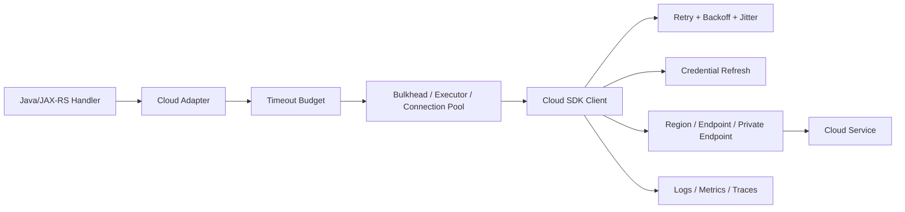
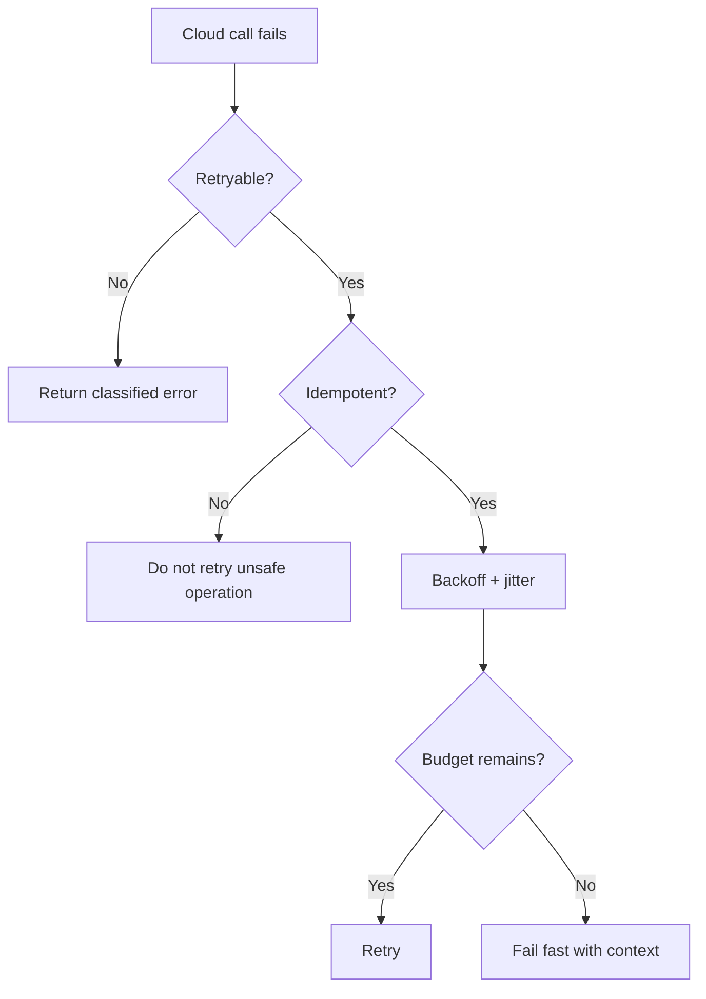
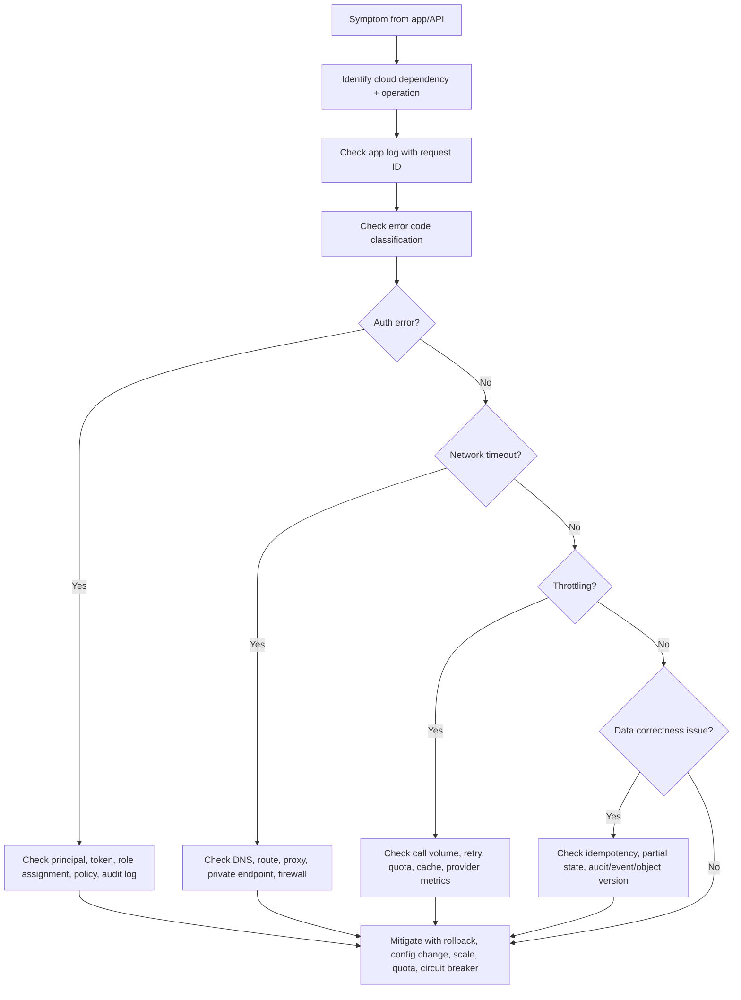

# Part 045 — Cloud SDK Reliability Patterns

> Target pembaca: Senior Java/JAX-RS backend engineer yang sudah memahami AWS SDK for Java dan Azure SDK for Java, lalu ingin memastikan integrasi cloud service tidak menjadi sumber latency spike, retry storm, cost spike, thread starvation, duplicate operation, atau production incident.

Part ini bukan tutorial memakai satu SDK tertentu. Fokusnya adalah **reliability discipline** saat Java service memanggil cloud API.

Cloud SDK terlihat seperti library biasa:

```java
client.putObject(...)
client.getSecret(...)
client.getBlobClient(...).upload(...)
```

Tetapi secara production, SDK adalah remote dependency layer:

```text
Java code
  -> SDK client
  -> credential provider
  -> request signer / token provider
  -> HTTP client
  -> retry strategy
  -> endpoint resolver
  -> DNS
  -> egress path
  -> private endpoint / public endpoint
  -> cloud service control plane or data plane
```

Kalau pola reliability-nya salah, bug tidak selalu muncul sebagai error SDK. Gejalanya bisa berupa:

- API JAX-RS timeout;
- request stuck;
- pod CPU naik karena retry loop;
- thread pool habis;
- connection pool habis;
- startup lambat karena secret/config retrieval;
- duplicate object/event/resource creation;
- cost naik karena repeated calls;
- downstream cloud service terkena throttling;
- incident sulit di-debug karena request ID tidak dicatat.

---

## 1. Konsep inti

Cloud SDK reliability adalah kemampuan aplikasi untuk memanggil cloud service secara:

- **bounded**: setiap call punya timeout dan resource limit;
- **safe**: retry tidak merusak correctness;
- **observable**: request dapat ditelusuri sampai cloud-side request ID;
- **least-surprise**: credential, region, endpoint, dan retry behavior eksplisit;
- **cost-aware**: retry, polling, listing, logging, dan data transfer tidak membengkak;
- **failure-aware**: partial failure, throttling, DNS failure, endpoint failure, dan auth failure ditangani berbeda.

Mental model sederhananya:



Prinsip utamanya: **SDK call adalah remote call, bukan local method call**.

---

## 2. Kenapa konsep ini ada

Cloud provider mengoperasikan service multi-tenant dalam skala besar. Karena itu cloud API bisa mengalami:

- throttling;
- transient 5xx;
- network timeout;
- DNS delay;
- private endpoint misconfiguration;
- credential expiration;
- regional endpoint degradation;
- eventual consistency;
- pagination limit;
- service quota limit;
- maintenance event;
- slow control plane;
- cross-zone or cross-region latency.

SDK biasanya membantu dengan retry dan credential refresh. Tetapi default SDK bukan pengganti desain reliability aplikasi.

Contoh masalah:

```text
JAX-RS request timeout budget = 2 seconds
SDK client default retries = can exceed request budget
Cloud service throttles = SDK retries
App thread blocked = request queue grows
More requests enter = more SDK calls
More retries happen = dependency overloaded
Incident becomes retry storm
```

Retry tanpa budget bisa memperburuk outage.

---

## 3. Control plane vs data plane SDK call

Tidak semua cloud API punya karakter yang sama.

### 3.1 Control plane call

Control plane call mengubah atau membaca resource management state.

Contoh:

- create bucket/container;
- create secret;
- update IAM/RBAC configuration;
- describe cluster;
- list infrastructure resources;
- create topic/queue;
- change Key Vault policy;
- update App Configuration setting.

Karakteristik:

- lebih lambat;
- lebih sering terkena throttling;
- sering eventually consistent;
- tidak cocok dipanggil per user request;
- failure-nya biasanya operational, bukan business-as-usual.

**Rule:** control plane call sebaiknya tidak berada di hot path Java/JAX-RS request.

### 3.2 Data plane call

Data plane call mengakses data runtime.

Contoh:

- upload object ke S3/Blob;
- download object;
- read secret;
- decrypt data;
- publish message;
- read config;
- query cache;
- call managed service endpoint.

Karakteristik:

- bisa berada di request path;
- butuh timeout ketat;
- butuh retry terbatas;
- butuh observability detail;
- bisa berkontribusi langsung ke latency user.

**Rule:** data plane call boleh berada di hot path, tetapi harus bounded dan measured.

---

## 4. Timeout: batas paling penting

Timeout adalah kontrak bahwa aplikasi tidak akan menunggu dependency selamanya.

Layer timeout yang perlu dipahami:

```text
client HTTP timeout
  <= SDK call timeout
    <= adapter timeout
      <= service internal timeout
        <= JAX-RS endpoint timeout
          <= ingress / load balancer timeout
            <= API gateway timeout
```

Jika timeout chain tidak konsisten, symptom menjadi membingungkan:

- SDK masih retry saat API gateway sudah give up;
- aplikasi menulis response terlalu lambat;
- load balancer memberi 504;
- caller retry lagi;
- downstream menerima duplicate request.

### 4.1 Timeout type yang harus dibedakan

| Timeout | Arti | Failure yang ditangani |
|---|---|---|
| Connect timeout | Batas waktu membuat TCP connection | DNS/routing/firewall/private endpoint issue |
| TLS handshake timeout | Batas waktu negosiasi TLS | certificate, proxy, TLS inspection |
| Read/socket timeout | Batas waktu menunggu response data | slow service, network stall |
| Per-attempt timeout | Batas waktu satu percobaan request | single slow attempt |
| Total API call timeout | Batas waktu total semua attempt termasuk retry | request budget protection |
| Application deadline | Batas waktu bisnis untuk use case | user-facing SLA/SLO |

### 4.2 Production rule

Untuk Java/JAX-RS endpoint:

```text
SDK total timeout must be less than remaining request budget.
```

Contoh budget:

```text
API Gateway timeout: 30s
Ingress timeout: 25s
JAX-RS request budget: 10s
Business operation budget: 5s
Cloud SDK total timeout: 1.5s
One attempt timeout: 500ms
Max attempts: 2-3
```

Angka di atas bukan aturan universal. Yang penting adalah chain-nya eksplisit.

---

## 5. Retry: berguna, tetapi berbahaya

Retry membantu saat failure bersifat transient.

Retry cocok untuk:

- HTTP 408;
- HTTP 429;
- HTTP 500/502/503/504 tertentu;
- connection reset;
- temporary DNS/network hiccup;
- throttling yang didesain untuk backoff.

Retry tidak cocok untuk:

- invalid credential;
- AccessDenied/AuthorizationFailed;
- wrong region;
- invalid request;
- object not found yang memang benar;
- schema/business validation failure;
- duplicate non-idempotent command;
- quota hard limit tanpa recovery cepat.

### 5.1 Retry must be bounded

Retry harus punya:

- max attempts;
- per-attempt timeout;
- total timeout;
- exponential backoff;
- jitter;
- retryable error classification;
- idempotency guard.

Tanpa itu, retry menjadi amplifier.



---

## 6. Backoff and jitter

Backoff mengurangi tekanan ke dependency yang sedang bermasalah.

Jitter mencegah semua client retry pada waktu yang sama.

Tanpa jitter:

```text
1000 pods fail at T0
1000 pods retry at T1
1000 pods retry at T2
1000 pods retry at T3
```

Dengan jitter:

```text
1000 pods fail at T0
retries spread across time window
cloud service has chance to recover
```

### 6.1 Anti-pattern

```text
retry every 100ms forever
```

Ini buruk karena:

- memperparah throttling;
- menaikkan CPU/network;
- menghabiskan connection pool;
- menaikkan log volume;
- memperbesar cost;
- membuat incident lebih panjang.

### 6.2 Production expectation

Retry policy harus berbeda untuk:

- read operation;
- write operation;
- idempotent write;
- non-idempotent command;
- startup config/secret retrieval;
- background job;
- user-facing request;
- async worker;
- batch migration.

---

## 7. Throttling and rate limit

Cloud service bisa menolak request karena rate terlalu tinggi.

Symptom umum:

- AWS `ThrottlingException`;
- AWS `TooManyRequestsException`;
- Azure HTTP 429;
- Azure `RequestRateTooLarge`;
- object storage 503 SlowDown;
- Key Vault throttling;
- App Configuration throttling;
- control plane rate limit.

### 7.1 Throttling bukan selalu incident provider

Throttling sering berarti aplikasi:

- terlalu sering polling;
- tidak cache config/secret;
- melakukan list operation di hot path;
- tidak memakai pagination dengan benar;
- parallelism terlalu tinggi;
- tidak punya client-side rate limiter;
- retry terlalu agresif;
- startup semua pod serentak mengambil secret/config.

### 7.2 Pattern yang benar

Gunakan kombinasi:

- cache;
- bounded retry;
- jittered startup;
- token bucket/client-side rate limiter;
- queue untuk background work;
- bulkhead per dependency;
- pagination streaming;
- circuit breaker saat dependency degraded;
- metric `throttle_count` per cloud dependency.

---

## 8. Circuit breaker

Circuit breaker mencegah aplikasi terus memanggil dependency yang jelas sedang gagal.

State umum:

```text
CLOSED -> normal call
OPEN -> fail fast / fallback
HALF_OPEN -> limited probe
```

### 8.1 Kapan circuit breaker berguna

Cocok untuk:

- object storage dependency;
- config service read;
- secret manager read;
- external/internal HTTP API;
- cloud API yang sering throttling;
- private endpoint dependency;
- service-to-service call.

Tidak cocok sebagai pengganti:

- timeout;
- retry budget;
- correct IAM/RBAC;
- network fix;
- quota management.

### 8.2 Fallback harus jujur

Fallback yang aman:

- use cached config;
- serve stale-but-acceptable data;
- enqueue work for later;
- return controlled 503;
- degrade optional feature.

Fallback yang berbahaya:

- pretend success;
- skip authorization;
- write incomplete state;
- silently drop business event;
- use hardcoded secret;
- bypass encryption.

---

## 9. Bulkhead

Bulkhead membatasi blast radius satu dependency.

Tanpa bulkhead:

```text
S3 slow
  -> all request threads blocked
  -> catalog API also slows
  -> health check fails
  -> pod restarted
  -> incident expands
```

Dengan bulkhead:

```text
S3 adapter has separate pool/limit
  -> file feature degrades
  -> rest of service remains responsive
```

### 9.1 Bulkhead layer

- HTTP connection pool per SDK client;
- executor/thread pool per async client;
- semaphore per adapter;
- queue length limit;
- max concurrent upload/download;
- max parallel list/page calls;
- rate limiter per dependency.

### 9.2 Java/JAX-RS concern

Di blocking JAX-RS stack, setiap SDK call bisa menahan request thread.

Pastikan:

- request thread tidak menunggu cloud call tanpa timeout;
- async SDK tidak memakai unbounded executor;
- file upload/download tidak memakan heap besar;
- worker pool punya queue limit;
- rejection path jelas.

---

## 10. Pagination

Cloud API sering membatasi response dan mengembalikan page token/continuation token.

Anti-pattern:

```text
list all objects/secrets/resources on every request
```

Risiko:

- latency tinggi;
- memory pressure;
- throttling;
- partial result;
- cost tinggi;
- inconsistent view saat data berubah antar page.

### 10.1 Production rule

Untuk pagination:

- jangan list resource besar di hot path;
- batasi page size;
- stream/process per page;
- checkpoint untuk batch job;
- catat continuation token progress;
- handle duplicate/changed item;
- ukur `pages_read`, `items_read`, `duration`, `throttle_count`;
- gunakan query/index/prefix/filter kalau tersedia.

---

## 11. Partial failure

Cloud operation bisa sukses sebagian.

Contoh:

- multipart upload sebagian part berhasil;
- batch delete sebagian gagal;
- event publish sebagian sukses;
- blob copy dimulai async tetapi belum selesai;
- config update berhasil tetapi cache belum refresh;
- secret rotation membuat versi baru tetapi aplikasi masih pakai versi lama;
- IAM/RBAC update berhasil tetapi propagation belum selesai.

### 11.1 Cara berpikir

Jangan bertanya hanya:

```text
Did it succeed?
```

Tanyakan:

```text
Which part succeeded?
Which state is durable?
Can retry create duplicate effect?
Is cleanup required?
Can reader observe half-written state?
Is there an idempotency key?
```

---

## 12. Idempotency

Idempotency adalah kemampuan operasi diulang tanpa mengubah hasil akhir secara salah.

### 12.1 Idempotent by nature

Contoh relatif aman:

- read object;
- read secret;
- get config;
- list resource;
- put object dengan key deterministik dan checksum expectation;
- upsert dengan version constraint.

### 12.2 Not safely idempotent by default

Contoh berbahaya:

- create order;
- publish business event tanpa dedup key;
- create object dengan random key;
- generate presigned URL lalu commit state berkali-kali;
- charge/bill/customer-impacting operation;
- create external resource tanpa client token.

### 12.3 Pattern

Gunakan:

- idempotency key;
- deterministic object key;
- conditional write;
- ETag/checksum validation;
- optimistic locking;
- unique constraint;
- outbox pattern;
- deduplication key di consumer;
- operation status table;
- client token jika cloud API mendukung.

---

## 13. Request signing and token validation

AWS SDK biasanya menandatangani request dengan SigV4. Azure SDK biasanya memakai bearer token dari Azure Identity untuk banyak layanan.

Failure mode:

- clock skew;
- expired token;
- wrong credential source;
- wrong region;
- wrong endpoint;
- missing permission;
- token audience mismatch;
- private endpoint DNS mengarah ke endpoint yang tidak sesuai;
- proxy mengubah request;
- TLS inspection memecah trust.

### 13.1 Debugging signal

Cari:

- AWS request ID;
- Azure request ID/correlation ID;
- HTTP status;
- service-specific error code;
- credential provider yang terpilih;
- resolved endpoint;
- region;
- principal/workload identity;
- token audience;
- CloudTrail/Activity Log event.

---

## 14. Credential refresh

Static credential adalah risk besar. Production workload sebaiknya memakai temporary credential atau workload identity.

Tetapi temporary credential punya failure mode:

- token projection rusak;
- STS/identity endpoint tidak reachable;
- managed identity endpoint tidak reachable;
- credential cache stale;
- pod clock skew;
- service account annotation salah;
- federated credential mismatch;
- environment variable override salah;
- local dev credential tidak sama dengan production credential.

### 14.1 Production rule

Jangan hanya cek:

```text
credential exists
```

Cek juga:

```text
which credential source was used?
which principal is represented?
what is token expiry?
can SDK refresh before expiry?
is identity endpoint reachable from pod?
what audit event appears cloud-side?
```

---

## 15. Regional endpoint failure

Cloud service biasanya dipanggil melalui regional endpoint.

Failure mode:

- salah region;
- region tidak dikonfigurasi;
- private endpoint hanya ada di region tertentu;
- DNS resolve ke public endpoint;
- cross-region call menambah latency/cost;
- regional outage;
- service tidak tersedia di region yang dipilih;
- compliance melarang data keluar region.

### 15.1 Multi-region warning

Jangan otomatis fail over SDK ke region lain tanpa desain data.

Pertanyaan wajib:

- apakah data direplikasi ke region lain?
- apakah object key/config/secret sama?
- apakah KMS/key tersedia?
- apakah identity permission ada?
- apakah private endpoint tersedia?
- apakah DNS failover ada?
- apakah write ke region sekunder aman?
- apakah consistency model diterima?

---

## 16. Endpoint override and private endpoint behavior

Endpoint override sering dipakai untuk:

- local testing;
- emulator;
- private endpoint;
- VPC endpoint;
- custom DNS;
- sovereign cloud;
- proxy/gateway layer.

Risiko:

- request ditandatangani untuk region/service yang salah;
- TLS hostname mismatch;
- SDK masih memakai public endpoint;
- DNS split-horizon tidak berlaku di pod;
- NO_PROXY tidak mencakup private endpoint;
- integration test lolos tetapi production endpoint berbeda;
- emulator behavior tidak sama dengan cloud behavior.

### 16.1 Review rule

Setiap endpoint override harus punya alasan tertulis:

```text
Why override endpoint?
For which environment?
Is TLS verified?
Is signing region correct?
Is private DNS configured?
How is this tested from inside pod?
```

---

## 17. AWS-specific reliability concerns

Untuk AWS SDK for Java:

- pahami default credential provider chain;
- pastikan IRSA/Pod Identity tidak kalah oleh environment variable static credential;
- set region secara eksplisit untuk production;
- review retry mode: standard/adaptive jika digunakan;
- gunakan request override untuk timeout jika perlu;
- catat `x-amz-request-id` atau service request ID;
- bedakan `AccessDenied`, `ThrottlingException`, `RequestTimeout`, `SlowDown`, `NoSuchKey`, `ExpiredToken`;
- hindari `List*` operation besar di hot path;
- pastikan S3 multipart upload punya cleanup untuk abandoned upload;
- pastikan KMS/Secrets Manager/SSM call tidak dipanggil per request tanpa cache.

### 17.1 AWS failure examples

| Symptom | Kemungkinan akar masalah |
|---|---|
| `Unable to load credentials` | IRSA annotation salah, token file hilang, env var override salah |
| `AccessDenied` | permission policy kurang, trust policy salah, resource policy deny, SCP deny |
| `SignatureDoesNotMatch` | wrong region, clock skew, endpoint override salah, proxy mengubah request |
| `ThrottlingException` | retry agresif, polling, quota rendah, burst startup |
| S3 `SlowDown` | request rate tinggi, retry tanpa jitter, hot prefix/workload pattern |
| `NoSuchBucket` di private env | wrong region, wrong account, DNS/endpoint salah |
| timeout hanya dari pod | egress route, security group, VPC endpoint, DNS, proxy |

---

## 18. Azure-specific reliability concerns

Untuk Azure SDK for Java:

- pahami `DefaultAzureCredential` chain;
- pastikan production tidak memakai credential local dev secara tidak sengaja;
- set endpoint service secara eksplisit;
- pahami Azure Core HTTP pipeline;
- review retry policy dan timeout;
- catat request ID/correlation ID;
- bedakan `AuthorizationFailed`, `AuthenticationFailed`, `CredentialUnavailableException`, HTTP 429, HTTP 503;
- pastikan managed identity/workload identity benar;
- review private endpoint DNS;
- cache Key Vault/App Configuration call;
- hindari list besar pada hot path.

### 18.1 Azure failure examples

| Symptom | Kemungkinan akar masalah |
|---|---|
| `CredentialUnavailableException` | managed identity/workload identity tidak tersedia dari pod |
| `AuthorizationFailed` | role assignment salah scope, propagation belum selesai, wrong principal |
| HTTP 403 dari Storage | RBAC/policy/SAS salah, firewall/private endpoint, wrong account |
| HTTP 429 dari Key Vault | secret diambil terlalu sering, startup burst, tidak ada cache |
| DNS ke public IP | Private DNS Zone tidak linked ke VNet atau CoreDNS forwarding salah |
| timeout dari AKS | UDR/firewall/NAT/private endpoint/NSG issue |
| TLS hostname mismatch | endpoint override atau private DNS salah |

---

## 19. Observability untuk SDK call

Cloud SDK call harus terlihat sebagai dependency span atau metric.

Minimal metric:

- dependency name;
- operation name;
- status;
- error code;
- latency histogram;
- retry count;
- throttling count;
- timeout count;
- request size/response size jika relevan;
- region;
- endpoint type: public/private;
- cache hit/miss untuk secret/config;
- pagination pages/items;
- circuit breaker state.

Minimal log saat error:

```json
{
  "event": "cloud_sdk_call_failed",
  "provider": "aws|azure",
  "service": "s3|blob|secrets|keyvault|ssm|appconfig|kms",
  "operation": "GetObject|PutObject|GetSecret|GetConfigurationSetting",
  "statusCode": 429,
  "cloudErrorCode": "ThrottlingException",
  "requestId": "...",
  "region": "...",
  "endpointType": "private",
  "attempt": 2,
  "maxAttempts": 3,
  "durationMs": 842,
  "correlationId": "..."
}
```

Jangan log:

- secret value;
- full SAS token;
- presigned URL lengkap;
- authorization header;
- credential chain sensitive detail;
- object content yang mengandung PII.

---

## 20. Trace propagation

SDK call sebaiknya muncul sebagai span dependency.

```text
HTTP inbound span
  -> service logic span
    -> cloud sdk span: S3 PutObject
    -> database span
    -> messaging publish span
```

Benefit:

- tahu dependency mana yang lambat;
- tahu retry menambah latency berapa;
- tahu error terjadi sebelum atau sesudah cloud service;
- bisa korelasi dengan CloudWatch/Azure Monitor;
- bisa melihat fan-out call yang terlalu banyak.

Jika SDK instrumentation tidak otomatis tersedia, gunakan wrapper adapter untuk mencatat span manual.

---

## 21. Adapter pattern untuk cloud SDK

Jangan sebar SDK call di banyak service class.

Lebih baik:

```text
JAX-RS Resource
  -> Application Service
    -> Domain Service
      -> CloudStoragePort
        -> S3StorageAdapter / BlobStorageAdapter
```

Keuntungan:

- timeout/retry policy terpusat;
- error mapping konsisten;
- observability konsisten;
- testing lebih mudah;
- cloud portability lebih realistis;
- credential/endpoint config tidak bocor ke domain logic;
- idempotency dan checksum bisa enforced.

---

## 22. Error classification

Jangan semua SDK exception menjadi HTTP 500.

Contoh mapping internal:

| SDK failure | Internal classification | External response |
|---|---|---|
| Access denied karena app config salah | Misconfiguration | 500/503 + alert |
| User tidak boleh akses object | Authorization/business rule | 403 |
| Object tidak ditemukan | Not found | 404 jika aman |
| Cloud throttling | Dependency overloaded | 503/429 sesuai API contract |
| SDK timeout | Dependency timeout | 504/503 |
| Invalid request dari bug aplikasi | Defect | 500 + alert |
| Credential unavailable | Platform/runtime issue | 503 + alert |
| Network unreachable | Platform/network issue | 503 + alert |

Pemisahan ini penting untuk alerting dan RCA.

---

## 23. Startup behavior

Banyak service mengambil secret/config saat startup.

Risiko:

```text
deployment rollout starts 100 pods
all pods call Key Vault/Secrets Manager/AppConfig at once
provider throttles
pods fail readiness
deployment stalls
rollback also calls same dependency
incident expands
```

Pattern yang lebih aman:

- init dengan timeout;
- jitter startup;
- cache mounted secret bila sesuai;
- fail fast untuk mandatory config;
- allow stale cache untuk non-critical config;
- readiness tidak sukses sebelum dependency minimum valid;
- liveness tidak membunuh pod hanya karena dependency remote sementara lambat;
- staggered rollout;
- PodDisruptionBudget;
- monitor startup dependency latency.

---

## 24. Background worker behavior

Worker sering memanggil cloud SDK lebih intensif daripada API.

Contoh:

- export job;
- bulk upload;
- nightly reconciliation;
- migration;
- blob/object copy;
- event replay;
- document archive;
- config sync.

Worker harus punya:

- concurrency limit;
- retry with dead-letter/failure table;
- checkpoint;
- idempotency;
- backpressure;
- quota awareness;
- kill/resume safe design;
- per-tenant/customer fairness;
- cost guardrail.

---

## 25. Cost concern

SDK reliability berdampak langsung ke cost.

Cost leak umum:

- retry storm;
- list operation besar;
- log setiap retry attempt terlalu detail;
- high-cardinality metric per object key/customer;
- cross-region endpoint salah;
- traffic keluar NAT padahal bisa private endpoint;
- multipart upload abandoned;
- polling terlalu sering;
- no cache untuk secret/config;
- repeated object download karena cache miss;
- async worker parallelism terlalu tinggi.

Review PR harus bertanya:

```text
How many cloud API calls per user request?
How many calls per batch item?
What happens at peak traffic?
What happens during throttling?
Is the call cached?
Is this call through NAT or private endpoint?
Is retry multiplying cost?
```

---

## 26. Correctness concern

Reliability pattern tidak boleh merusak correctness.

Contoh bahaya:

- retry create operation tanpa idempotency key;
- retry publish event tanpa dedup key;
- fallback mengembalikan config lama padahal flag keamanan harus off;
- partial upload dianggap berhasil;
- timeout terjadi tetapi cloud operation sebenarnya sukses;
- caller retry dan membuat duplicate business state;
- eventual consistency dianggap strong consistency;
- SDK exception disembunyikan sehingga audit trail hilang.

Correctness rule:

```text
Before retrying or falling back, understand whether the operation may have taken effect.
```

---

## 27. Production-safe debugging flow

Saat SDK call gagal:



Jangan langsung menaikkan timeout/retry tanpa tahu root cause. Itu sering hanya menunda failure dan memperbesar impact.

---

## 28. PR review checklist

Gunakan checklist ini saat ada PR yang menambah/mengubah integrasi AWS/Azure SDK.

### 28.1 Runtime behavior

- Apakah SDK client dibuat singleton/reused, bukan dibuat per request?
- Apakah timeout eksplisit?
- Apakah retry policy eksplisit atau default-nya diterima dengan sadar?
- Apakah total call budget lebih kecil dari JAX-RS request budget?
- Apakah HTTP connection pool dibatasi?
- Apakah async executor dibatasi?
- Apakah operation di hot path benar-benar perlu?

### 28.2 Correctness

- Apakah write operation idempotent?
- Apakah ada idempotency key/client token?
- Apakah retry bisa membuat duplicate business effect?
- Apakah partial failure ditangani?
- Apakah pagination lengkap dan bounded?
- Apakah checksum/ETag/version dipakai jika relevan?

### 28.3 Security and identity

- Apakah credential source production jelas?
- Apakah static credential dihindari?
- Apakah least privilege?
- Apakah endpoint private/public jelas?
- Apakah secret/token tidak masuk log?
- Apakah audit log bisa mengidentifikasi principal?

### 28.4 Observability

- Apakah log error memuat cloud request ID?
- Apakah metric per dependency ada?
- Apakah retry/throttling/timeout dihitung?
- Apakah trace span dependency muncul?
- Apakah high-cardinality label dihindari?

### 28.5 Cost and performance

- Berapa call per request/job item?
- Apakah ada caching?
- Apakah list operation besar dihindari?
- Apakah traffic lewat NAT atau private endpoint?
- Apakah retry bisa menaikkan cost saat incident?
- Apakah batch/concurrency dibatasi?

---

## 29. Internal verification checklist

Verifikasi ke internal CSG/team/platform sebelum menganggap desain sudah benar.

### 29.1 SDK standard

- AWS SDK version yang disetujui.
- Azure SDK version yang disetujui.
- HTTP client standard.
- Timeout baseline per dependency.
- Retry baseline per dependency.
- Logging/metric/tracing standard.
- Approved wrapper/adapter library jika ada.

### 29.2 Identity and endpoint

- Runtime identity untuk pod/service.
- IRSA/Workload Identity mapping.
- Role/RBAC permission.
- Credential provider chain expectation.
- Region expectation.
- Private endpoint/VPC endpoint usage.
- DNS behavior dari dalam pod.
- Proxy/NO_PROXY policy.

### 29.3 Reliability and operations

- Circuit breaker library/pattern.
- Bulkhead/concurrency limit standard.
- Cache strategy untuk secret/config.
- Throttling dashboard.
- Quota dashboard.
- Incident notes terkait SDK timeout/throttling.
- Runbook untuk AccessDenied/AuthorizationFailed.
- Runbook untuk private endpoint timeout.
- Rollback strategy jika SDK integration rusak.

### 29.4 Security and compliance

- Secret logging prevention.
- PII/object metadata logging rule.
- Audit evidence location.
- Compliance constraint untuk region/data residency.
- KMS/Key Vault dependency expectation.
- Approved encryption policy.

---

## 30. Common anti-patterns

| Anti-pattern | Kenapa berbahaya | Pengganti |
|---|---|---|
| SDK client dibuat per request | overhead, connection churn | singleton/reused client |
| Timeout tidak eksplisit | request bisa menggantung | per-attempt + total timeout |
| Retry semua exception | duplicate, retry storm | retry only transient + idempotent |
| Secret/config dibaca per request | throttling, latency | cache + reload strategy |
| List semua object/resource | cost dan latency | prefix/filter/page/checkpoint |
| Static credential di env | leakage, rotation sulit | workload identity/temp credential |
| Endpoint override tanpa dokumentasi | wrong DNS/TLS/signing | explicit environment config + test |
| Log full URL/token | secret leakage | redact sensitive fields |
| Fallback pretend success | correctness rusak | controlled degradation |
| Raise timeout saat incident tanpa RCA | memperpanjang failure | classify root cause first |

---

## 31. Senior engineer mental model

Saat melihat SDK integration, jangan bertanya hanya:

```text
Does the code compile and call the service?
```

Tanyakan:

```text
What is the timeout budget?
What is retryable?
Is the operation idempotent?
What credential is used in production?
What endpoint is called from inside pod?
What happens during throttling?
What happens if the cloud call succeeds but response is lost?
Can we see request ID in logs?
Can we correlate it with cloud audit/platform logs?
What is the cost at peak and during incident?
What is the rollback plan?
```

Itulah perbedaan antara memakai SDK dan mengoperasikan SDK sebagai dependency production.

---

## 32. Ringkasan part

Cloud SDK reliability menentukan apakah integrasi AWS/Azure menjadi komponen stabil atau sumber incident.

Hal yang wajib dikuasai:

- timeout chain;
- retry dengan backoff dan jitter;
- throttling handling;
- circuit breaker;
- bulkhead;
- pagination;
- partial failure;
- idempotency;
- request signing/token validation;
- credential refresh;
- regional/private endpoint behavior;
- observability;
- cost and correctness review.

Rule akhir:

```text
Treat every cloud SDK call as a bounded, observable, security-sensitive, cost-bearing remote dependency.
```

---

## 33. Referensi resmi

- AWS SDK for Java 2.x — Retry strategy: https://docs.aws.amazon.com/sdk-for-java/latest/developer-guide/retry-strategy.html
- AWS SDKs and Tools — Retry behavior: https://docs.aws.amazon.com/sdkref/latest/guide/feature-retry-behavior.html
- AWS SDK for Java 2.x — Credentials provider chain: https://docs.aws.amazon.com/sdk-for-java/latest/developer-guide/credentials-chain.html
- AWS EC2 API idempotency: https://docs.aws.amazon.com/ec2/latest/devguide/ec2-api-idempotency.html
- Azure Core shared library for Java: https://learn.microsoft.com/en-us/java/api/overview/azure/core-readme
- Azure SDK fundamentals — HTTP pipeline and retries: https://learn.microsoft.com/en-us/azure/developer/python/sdk/fundamentals/http-pipeline-retries
