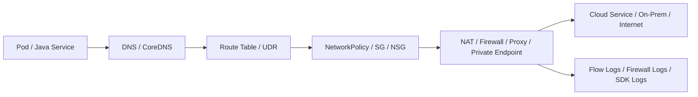
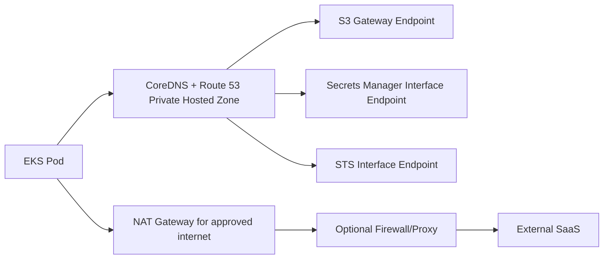
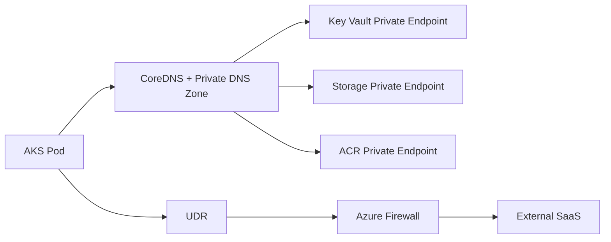

# Part 046 — Private Egress and Outbound Control

> Target pembaca: Senior Java/JAX-RS backend engineer yang perlu memahami bagaimana pod, node, VM, atau service backend keluar menuju dependency eksternal/cloud secara aman, privat, observable, dan cost-aware.

Banyak engineer memahami ingress lebih dulu:

```text
client -> DNS -> load balancer -> ingress -> service -> pod
```

Tetapi di production, **egress** sering lebih berbahaya:

```text
pod -> DNS -> route table/UDR -> firewall/proxy/NAT/private endpoint -> cloud service / internet / on-prem
```

Kalau egress salah, symptom-nya bisa terlihat sebagai:

- SDK timeout;
- DNS resolve ke IP salah;
- `AccessDenied` karena endpoint policy;
- TLS handshake failure;
- registry pull failure;
- secret/config retrieval failure;
- Kafka/RabbitMQ/PostgreSQL connection timeout;
- NAT Gateway cost spike;
- blocked outbound dependency;
- traffic keluar public internet padahal seharusnya private;
- compliance/data exfiltration finding.

Part ini membahas egress sebagai **security boundary, reliability boundary, cost boundary, dan debugging boundary**.

---

## 1. Konsep inti

Egress adalah traffic keluar dari workload ke dependency lain.

Dalam konteks Java/JAX-RS di Kubernetes:

```text
JAX-RS service pod
  -> cloud SDK call
  -> DNS resolution
  -> pod/node network
  -> route table / UDR
  -> NAT / firewall / proxy / private endpoint
  -> target service
```

Target egress bisa berupa:

- object storage: S3/Blob;
- secret/config service: Secrets Manager, Parameter Store, Key Vault, App Configuration;
- container registry: ECR/ACR;
- managed database: RDS/PostgreSQL Flexible Server;
- managed broker: MSK, Amazon MQ, Event Hubs;
- Redis managed service;
- on-prem service;
- external SaaS;
- identity endpoint;
- telemetry endpoint;
- package/image repository.

Core question:

```text
When this pod calls that dependency, exactly which network path does the packet take?
```

---

## 2. Kenapa egress control ada

Tanpa egress control, workload bisa:

- mengakses internet bebas;
- exfiltrate data;
- melewati inspection/security policy;
- menggunakan public endpoint walaupun private endpoint tersedia;
- menghabiskan biaya NAT/data transfer;
- sulit diaudit;
- sulit di-debug;
- tergantung pada DNS/proxy tidak resmi;
- gagal saat corporate firewall berubah;
- berbeda perilaku antara dev/staging/prod.

Egress control memastikan outbound traffic:

- hanya ke tujuan yang diizinkan;
- memakai jalur private jika diperlukan;
- melewati firewall/proxy jika mandated;
- tercatat di flow log/firewall log/proxy log;
- tidak membuat biaya tak terlihat;
- bisa diprediksi saat incident.

---

## 3. Egress path mental model

Gunakan model bertahap:



Debugging harus mengikuti urutan ini. Jangan langsung menyalahkan SDK sebelum membuktikan DNS, route, firewall, identity, dan endpoint.

---

## 4. Public egress vs private egress

### 4.1 Public egress

Workload keluar ke public endpoint melalui NAT/public IP/firewall.

Contoh:

```text
private subnet pod -> NAT Gateway -> public AWS/Azure service endpoint
```

Kelebihan:

- sederhana;
- banyak service langsung kompatibel;
- tidak perlu private endpoint per service;
- cocok untuk external SaaS.

Risiko:

- data path melewati public internet routing fabric;
- butuh NAT/firewall cost;
- allowlist berbasis IP bisa rapuh;
- compliance mungkin menolak;
- observability harus dari NAT/firewall/proxy;
- public endpoint exposure bisa salah dipahami sebagai private.

### 4.2 Private egress

Workload mengakses service melalui private endpoint/VPC endpoint/private link/internal route.

Contoh:

```text
pod -> private DNS -> VPC endpoint / Azure Private Endpoint -> cloud service
```

Kelebihan:

- tidak perlu public internet path;
- lebih baik untuk compliance;
- akses bisa dibatasi per VPC/VNet/subnet/endpoint;
- mengurangi beberapa jenis data exfiltration risk;
- cocok untuk database, secret, storage, registry, internal API.

Risiko:

- DNS lebih kompleks;
- endpoint policy/RBAC bisa membingungkan;
- cost endpoint tetap ada;
- limit endpoint bisa tercapai;
- troubleshooting lebih sulit;
- hybrid/on-prem routing perlu desain matang.

---

## 5. AWS egress building blocks

### 5.1 NAT Gateway

AWS NAT Gateway umum dipakai agar resource di private subnet bisa melakukan outbound internet tanpa menerima inbound internet langsung.

Typical path:

```text
private subnet pod/node
  -> route table 0.0.0.0/0
  -> NAT Gateway in public subnet
  -> Internet Gateway
  -> public endpoint
```

Concern:

- NAT Gateway per AZ untuk resilience;
- cross-AZ NAT path menambah cost dan failure coupling;
- NAT Gateway punya throughput/connection behavior;
- semua traffic public egress bisa terkonsentrasi;
- sulit tahu service mana boros tanpa flow log/cost allocation;
- NAT bukan security policy penuh; firewall/SG/endpoint policy tetap diperlukan.

### 5.2 VPC Endpoint

VPC Endpoint memungkinkan akses privat ke service tertentu.

Jenis umum:

- **Gateway endpoint**: terutama S3 dan DynamoDB; route-table based.
- **Interface endpoint**: ENI dengan private IP, memakai AWS PrivateLink.

Typical path untuk S3 gateway endpoint:

```text
pod/node -> route table -> S3 gateway endpoint -> S3
```

Typical path untuk interface endpoint:

```text
pod -> private DNS -> endpoint ENI private IP -> AWS service
```

Concern:

- endpoint policy;
- security group pada interface endpoint;
- private DNS enabled/disabled;
- subnet endpoint placement;
- cross-AZ access;
- on-prem access limitation tergantung endpoint type;
- cost per endpoint/hour/data processing untuk interface endpoint.

### 5.3 AWS Network Firewall / proxy / security appliances

Beberapa enterprise mengarahkan egress melalui firewall/proxy.

Pattern:

```text
private subnet -> route table -> firewall endpoint/appliance -> NAT/internet/private link
```

Concern:

- asymmetric routing;
- TLS inspection;
- DNS allowlist;
- domain-based filtering;
- proxy auth;
- NO_PROXY untuk metadata/private endpoints;
- latency;
- logging volume;
- ownership antara platform/security/application team.

---

## 6. Azure egress building blocks

### 6.1 Azure NAT Gateway

Azure NAT Gateway menyediakan outbound connectivity untuk subnet.

Typical path:

```text
AKS node/pod subnet
  -> subnet associated NAT Gateway
  -> public endpoint
```

Concern:

- outbound IP stability;
- SNAT port exhaustion;
- subnet association;
- AKS outbound type;
- route interaction dengan UDR;
- firewall/security inspection requirement;
- cost dan data processed.

### 6.2 AKS outbound type

AKS bisa memakai outbound type seperti:

- load balancer;
- managed NAT Gateway;
- user-assigned NAT Gateway;
- user-defined routing.

Ini menentukan bagaimana traffic keluar dari cluster.

Implication:

- `loadBalancer` lebih default/simple;
- `managedNATGateway` memberi NAT managed untuk cluster;
- `userAssignedNATGateway` memberi kontrol lebih eksplisit;
- `userDefinedRouting` biasanya dipakai saat traffic harus lewat firewall/NVA.

### 6.3 Azure Firewall / NVA / UDR

Enterprise Azure sering memakai UDR untuk memaksa egress melewati Azure Firewall atau network virtual appliance.

Typical path:

```text
AKS subnet -> UDR 0.0.0.0/0 -> Azure Firewall -> internet/private target
```

Concern:

- UDR salah bisa memutus AKS control plane/dependency;
- firewall FQDN rule butuh DNS behavior yang konsisten;
- SNAT behavior;
- private endpoint route specificity;
- service tag usage;
- logging cost;
- TLS inspection risk.

### 6.4 Azure Private Endpoint

Azure Private Endpoint membuat private IP di VNet untuk mengakses Azure PaaS service.

Typical path:

```text
pod -> private DNS zone -> private endpoint IP -> Azure service
```

Concern:

- Private DNS Zone link ke VNet;
- DNS forwarding dari AKS/CoreDNS;
- NSG/UDR behavior;
- public network access disabled/enabled;
- approval workflow untuk private endpoint;
- per-service subresource;
- cross-subscription/resource group ownership.

---

## 7. Kubernetes egress layer

Kubernetes menambah layer sendiri:

```text
pod network namespace
  -> CNI
  -> node network
  -> cloud route
  -> NAT/firewall/private endpoint
```

Egress behavior berbeda antara:

- EKS VPC CNI: pod bisa mendapat IP dari VPC subnet;
- AKS Azure CNI: pod bisa mendapat IP dari VNet subnet;
- overlay mode: pod IP tidak selalu routable langsung di VNet/VPC;
- service mesh: outbound bisa lewat sidecar;
- NetworkPolicy: bisa membatasi pod-to-destination;
- egress gateway: bisa memusatkan outbound service mesh.

### 7.1 NetworkPolicy limitation

NetworkPolicy biasanya mengontrol pod-level traffic, tetapi:

- tidak selalu aktif tergantung CNI;
- tidak menggantikan cloud firewall;
- DNS egress harus diizinkan;
- FQDN-based policy tidak selalu native;
- private endpoint IP bisa berubah jika direcreate;
- traffic node-level seperti image pull tidak selalu terkena policy pod.

---

## 8. DNS and egress

Egress sangat bergantung pada DNS.

Contoh:

```text
myvault.vault.azure.net
```

Bisa resolve ke:

- public IP;
- private endpoint IP;
- wrong private zone;
- stale DNS record;
- blocked DNS response;
- split-horizon result berbeda antara laptop dan pod.

### 8.1 Debugging DNS egress

Dari dalam pod:

```bash
nslookup <service-hostname>
dig <service-hostname>
getent hosts <service-hostname>
curl -v https://<service-hostname>
```

Yang dicari:

- IP public atau private?
- TTL berapa?
- CNAME chain apa?
- resolver mana yang dipakai?
- CoreDNS forwarding ke mana?
- Private DNS Zone/Hosted Zone linked ke network yang benar?
- Apakah proxy mengubah resolution path?

---

## 9. Proxy and NO_PROXY

Enterprise environment sering memakai outbound proxy.

Environment variable umum:

```text
HTTP_PROXY
HTTPS_PROXY
NO_PROXY
```

Problem yang sering terjadi:

- SDK tidak membaca proxy env karena client custom;
- Java truststore tidak percaya proxy TLS certificate;
- proxy memblokir domain cloud;
- private endpoint ikut lewat proxy padahal harus langsung;
- metadata/identity endpoint ikut lewat proxy dan credential gagal;
- `NO_PROXY` tidak mencakup service internal, cluster domain, private endpoint, metadata IP;
- lowercase/uppercase env var berbeda perilaku antar library.

### 9.1 NO_PROXY review

Pastikan `NO_PROXY` mempertimbangkan:

- Kubernetes service domain: `.svc`, `.cluster.local`;
- localhost dan pod-local sidecar;
- metadata/identity endpoint;
- private endpoint domain/IP;
- database/broker internal hostname;
- corporate internal domain;
- VPC/VNet CIDR jika pattern internal memakai IP direct;
- cloud-specific metadata IP jika relevan.

Jangan copy-paste `NO_PROXY=*` tanpa approval security. Itu membypass proxy sepenuhnya.

---

## 10. TLS inspection risk

Firewall/proxy bisa melakukan TLS inspection.

Dampak ke Java service:

- TLS handshake gagal;
- certificate chain tidak dipercaya JVM truststore;
- hostname verification gagal;
- request signing bisa rusak jika proxy mengubah request;
- mTLS service-to-service bisa putus;
- SDK error terlihat seperti generic SSL exception;
- compliance/security exception dibutuhkan untuk beberapa endpoint.

### 10.1 Production rule

Untuk cloud SDK endpoint:

```text
Do not assume TLS inspection is safe for signed/cloud SDK requests.
```

Verifikasi:

- apakah inspection diwajibkan?
- apakah endpoint cloud dikecualikan?
- apakah JVM truststore memuat corporate CA?
- apakah request signing tetap valid?
- apakah private endpoint harus bypass proxy?
- apakah audit/security menyetujui bypass?

---

## 11. Domain allowlist and service tags

Outbound control sering memakai allowlist.

Model allowlist:

- IP allowlist;
- CIDR allowlist;
- FQDN/domain allowlist;
- cloud service tag;
- private endpoint only;
- endpoint policy;
- proxy category rule.

Trade-off:

| Model | Kelebihan | Risiko |
|---|---|---|
| IP allowlist | eksplisit | cloud IP berubah, maintenance tinggi |
| FQDN allowlist | lebih natural untuk cloud/SaaS | DNS/proxy coupling |
| Service tag | mudah untuk Azure/AWS-managed range tertentu | terlalu luas jika salah pakai |
| Private endpoint | kuat untuk private access | DNS/endpoint complexity |
| Endpoint policy | fine-grained AWS endpoint access | policy debugging kompleks |

---

## 12. Egress and identity

Network allow bukan authorization.

Walaupun pod bisa reach endpoint, request tetap harus diotorisasi.

Layer access:

```text
network reachability
  + DNS correctness
  + TLS trust
  + cloud identity
  + service permission
  + resource policy
  + data-level authorization
```

Contoh AWS:

```text
pod reaches S3 endpoint
but IAM role lacks s3:GetObject
or bucket policy denies source VPC endpoint
```

Contoh Azure:

```text
pod reaches Storage private endpoint
but managed identity lacks Storage Blob Data Contributor
or storage firewall rejects source
```

Debugging harus membedakan:

- connection timeout;
- TLS failure;
- HTTP 403;
- service-specific authorization error;
- endpoint policy deny;
- identity/RBAC deny.

---

## 13. Egress and cloud SDK

Cloud SDK membutuhkan lebih dari target service endpoint.

SDK bisa perlu akses ke:

- identity/token endpoint;
- STS endpoint;
- metadata endpoint;
- regional service endpoint;
- KMS/Key Vault endpoint;
- storage endpoint;
- telemetry endpoint;
- CRL/OCSP endpoint untuk certificate validation jika environment memakainya.

Jika egress terlalu ketat, symptom bisa muncul sebagai credential failure.

### 13.1 AWS SDK through restricted egress

Periksa:

- STS endpoint reachable jika AssumeRole/IRSA;
- regional endpoint atau global endpoint policy;
- VPC endpoint untuk STS jika dipakai;
- S3 gateway/interface endpoint;
- KMS endpoint jika S3 SSE-KMS;
- Secrets Manager/SSM endpoint;
- ECR API dan ECR Docker endpoint untuk image pull;
- CloudWatch Logs endpoint jika log shipping private.

### 13.2 Azure SDK through restricted egress

Periksa:

- Entra token endpoint jika workload identity/service principal;
- managed identity endpoint jika managed identity;
- Key Vault endpoint;
- Storage Blob endpoint;
- App Configuration endpoint;
- Azure Monitor ingestion endpoint;
- ACR endpoint;
- Private DNS Zone untuk private endpoints;
- Azure Firewall FQDN rules jika user-defined routing.

---

## 14. Egress cost

Egress bukan hanya security issue. Ini juga cost issue.

Cost source umum:

- NAT Gateway hourly + data processing;
- Azure NAT Gateway;
- cross-AZ traffic;
- cross-region traffic;
- firewall data processing;
- proxy/logging appliance;
- PrivateLink/interface endpoint hourly + data processing;
- Azure Private Endpoint;
- log ingestion dari firewall/flow logs;
- object storage data transfer;
- repeated downloads karena cache miss;
- retry storm melalui NAT.

### 14.1 Cost smell

- pod sering download object besar dari region lain;
- service menggunakan public endpoint padahal private endpoint tersedia;
- traffic antar AZ lewat NAT/firewall karena route salah;
- logs firewall terlalu verbose;
- retry storm melewati NAT;
- batch job paralel tanpa throttle;
- registry pull sering karena image cache tidak efektif;
- cross-cloud transfer untuk data besar.

---

## 15. Observability untuk egress

Minimal signal:

- pod/app logs dengan dependency target;
- SDK error code;
- DNS resolved IP;
- request latency;
- retry count;
- NAT Gateway metrics;
- firewall logs;
- proxy logs;
- VPC Flow Logs / NSG Flow Logs jika tersedia;
- private endpoint connection state;
- cloud service access logs;
- cost by data transfer/NAT/firewall.

### 15.1 Logging correlation

Saat timeout:

```text
application log correlationId
  -> SDK target hostname
  -> resolved IP
  -> pod node/subnet
  -> route table/UDR
  -> firewall/NAT log
  -> target service log
```

Kalau satu layer tidak observable, debugging akan bergantung pada tebakan.

---

## 16. Common failure modes

| Symptom | Kemungkinan akar masalah |
|---|---|
| SDK timeout | DNS salah, route salah, firewall deny, private endpoint down, proxy issue |
| HTTP 403 | IAM/RBAC/resource policy/firewall service-level deny |
| TLS handshake failure | corporate CA missing, TLS inspection, hostname mismatch |
| DNS resolve public IP | private zone tidak linked, CoreDNS forwarding salah |
| Works from laptop, fails from pod | split DNS, subnet route, pod identity, firewall, proxy |
| Works in dev, fails in prod | prod egress lebih ketat, private endpoint missing, role berbeda |
| Registry pull failure | ECR/ACR private endpoint, DNS, image pull identity, firewall |
| Secret retrieval failure | Key Vault/Secrets Manager endpoint, identity endpoint, RBAC/IAM |
| High NAT cost | public endpoint usage, retry storm, cross-AZ NAT, large downloads |
| Random connection failures | SNAT port exhaustion, connection reuse issue, firewall idle timeout |

---

## 17. Production-safe debugging playbook

Saat pod tidak bisa call dependency:

### 17.1 Identify target

Tentukan:

```text
service name
hostname
port
protocol
expected endpoint type: public/private
expected identity
expected region
expected route
```

### 17.2 Test DNS from pod

```bash
nslookup target.example.com
getent hosts target.example.com
```

Cek apakah IP sesuai private/public expectation.

### 17.3 Test TCP/TLS

```bash
curl -vk https://target.example.com
```

Atau gunakan tool minimal yang disetujui internal. Jangan deploy debug image sembarangan di production tanpa prosedur.

### 17.4 Check policy layers

- NetworkPolicy;
- Security Group/NSG;
- NACL jika AWS;
- route table/UDR;
- firewall rule;
- proxy rule;
- endpoint policy;
- cloud IAM/RBAC;
- resource policy;
- service firewall.

### 17.5 Check logs

- app log;
- SDK error;
- CoreDNS log jika tersedia;
- VPC Flow Logs/NSG Flow Logs;
- NAT metrics;
- firewall/proxy log;
- cloud service audit/access log;
- CloudTrail/Azure Activity Log untuk auth/config changes.

---

## 18. EKS-specific egress concerns

Untuk EKS:

- pod IP berasal dari VPC jika memakai VPC CNI default;
- subnet route table menentukan jalan keluar;
- NAT Gateway biasanya dipasang per AZ;
- VPC endpoints dapat menghindari NAT untuk AWS services tertentu;
- security group for pods bisa mengubah source security posture;
- NetworkPolicy butuh support dari CNI/config;
- IRSA perlu reach STS atau endpoint yang sesuai;
- image pull dari ECR bisa butuh ECR API, ECR Docker, dan S3 endpoint;
- S3 Gateway Endpoint bisa mengubah route behavior;
- endpoint policy bisa menyebabkan deny walaupun network reachable.

### 18.1 EKS egress review questions

- Apakah private subnet route `0.0.0.0/0` menuju NAT Gateway per AZ?
- Apakah VPC endpoint tersedia untuk S3, STS, ECR, Secrets Manager, SSM, CloudWatch jika required?
- Apakah private DNS enabled untuk interface endpoint?
- Apakah endpoint security group mengizinkan source?
- Apakah pod perlu keluar ke internet atau semua dependency private?
- Apakah cross-AZ NAT terjadi?
- Apakah VPC Flow Logs aktif?

---

## 19. AKS-specific egress concerns

Untuk AKS:

- outbound type menentukan egress default;
- Azure CNI/overlay memengaruhi source IP dan route;
- subnet bisa memakai NAT Gateway;
- UDR bisa memaksa traffic lewat Azure Firewall/NVA;
- private cluster punya kebutuhan DNS/control plane berbeda;
- Private Endpoint butuh Private DNS Zone link;
- managed identity/workload identity bisa butuh akses token endpoint;
- ACR pull bisa gagal karena firewall/private endpoint/DNS/RBAC;
- NSG/UDR bisa memblokir dependency AKS jika terlalu ketat.

### 19.1 AKS egress review questions

- AKS outbound type apa yang dipakai?
- Apakah subnet memakai NAT Gateway atau UDR ke firewall?
- Apakah Azure Firewall rule berbasis FQDN/service tag sudah benar?
- Apakah Private DNS Zone linked ke VNet AKS?
- Apakah pod resolve private endpoint IP?
- Apakah NSG mengizinkan traffic yang diperlukan?
- Apakah ACR, Key Vault, Storage, App Configuration private endpoints tersedia jika public access disabled?
- Apakah Azure Monitor ingestion path tersedia?

---

## 20. Service mesh and egress gateway

Jika service mesh digunakan, egress bisa diarahkan melalui sidecar atau egress gateway.

Pattern:

```text
pod app container -> sidecar proxy -> egress gateway -> firewall/private endpoint/target
```

Benefit:

- mTLS outbound;
- policy centralized;
- telemetry per service;
- egress allowlist;
- traffic shaping;
- retry/circuit breaker di mesh.

Risiko:

- double retry antara SDK dan mesh;
- timeout chain lebih kompleks;
- sidecar resource overhead;
- DNS capture behavior;
- mTLS/TLS origination conflict;
- debugging perlu mesh-level tools;
- proxy bisa memutus SDK request signing jika salah konfigurasi.

Rule:

```text
Do not configure retries both in SDK and mesh blindly.
```

---

## 21. Egress policy by dependency type

### 21.1 Object storage

- Prefer private endpoint/VPC endpoint jika compliance membutuhkan.
- Pastikan DNS resolve ke private IP/path.
- Perhatikan large transfer dan retry cost.
- Gunakan presigned URL/SAS secara hati-hati.
- Jangan log URL lengkap.

### 21.2 Secret/config service

- Hindari call per request.
- Gunakan cache dan reload strategy.
- Pastikan identity endpoint reachable.
- Pastikan private endpoint DNS benar.
- Alert pada throttling.

### 21.3 Registry

- Image pull terjadi di node/kubelet path, bukan hanya pod path.
- Verifikasi ECR/ACR auth.
- Verifikasi private endpoint dan DNS.
- Siapkan runbook registry outage.

### 21.4 Database/broker/cache

- Biasanya harus private.
- Perhatikan DNS, route, SG/NSG, firewall, TLS, auth.
- Connection pool harus bounded.
- Idle timeout firewall bisa memutus connection.

### 21.5 External SaaS

- Biasanya public egress via proxy/firewall.
- Butuh domain allowlist.
- Butuh timeout/retry/circuit breaker.
- Perhatikan data privacy dan DPA/compliance.

---

## 22. Egress PR review checklist

### 22.1 Network path

- Dari pod mana traffic berasal?
- Target hostname apa?
- Target IP private atau public?
- Route table/UDR mana yang dipakai?
- Lewat NAT, firewall, proxy, private endpoint, atau direct peering?
- Apakah path sama di dev/test/prod?

### 22.2 Security

- Apakah tujuan outbound memang diizinkan?
- Apakah least egress diterapkan?
- Apakah public endpoint disabled jika private endpoint mandatory?
- Apakah NetworkPolicy/SG/NSG/firewall rule cukup sempit?
- Apakah token/secret tidak lewat proxy yang tidak disetujui?
- Apakah TLS inspection disetujui untuk endpoint tersebut?

### 22.3 Identity

- Identity apa yang dipakai?
- Apakah token endpoint reachable?
- Apakah IAM/RBAC role assignment benar?
- Apakah endpoint policy/resource policy membatasi source?
- Apakah audit log bisa mengaitkan request ke workload?

### 22.4 Reliability

- Apakah timeout dan retry sesuai?
- Apakah proxy/firewall idle timeout diketahui?
- Apakah DNS TTL sesuai?
- Apakah failover path ada?
- Apakah dependency optional atau mandatory?
- Apakah fallback aman?

### 22.5 Cost

- Apakah traffic lewat NAT berbiaya tinggi?
- Apakah cross-AZ/cross-region transfer terjadi?
- Apakah private endpoint/interface endpoint cost diterima?
- Apakah log firewall/flow log retention masuk akal?
- Apakah retry bisa melipatgandakan traffic?

---

## 23. Internal verification checklist

### 23.1 Cloud/network

- AWS VPC route table.
- Azure VNet UDR.
- Public/private subnet mapping.
- NAT Gateway/Azure NAT Gateway placement.
- Firewall/NVA path.
- Proxy requirement.
- VPC endpoints.
- Azure Private Endpoints.
- Private DNS Hosted Zone/Private DNS Zone.
- DNS resolver forwarding.
- VPC Flow Logs/NSG Flow Logs.

### 23.2 Kubernetes

- EKS/AKS CNI mode.
- Pod CIDR/subnet mapping.
- NetworkPolicy engine.
- Egress gateway jika ada.
- CoreDNS config.
- Node image pull path.
- Namespace-level egress policy.
- Debug pod approval process.

### 23.3 Application/runtime

- SDK endpoint config.
- Proxy env vars.
- NO_PROXY.
- JVM truststore/corporate CA.
- Timeout/retry config.
- Connection pool.
- Circuit breaker.
- Dependency map.
- Service call inventory.

### 23.4 Security/compliance

- Allowed outbound destinations.
- Public endpoint exception list.
- Data exfiltration controls.
- TLS inspection policy.
- Audit logging.
- Firewall/proxy ownership.
- DLP requirement.
- Privacy/compliance approval.

### 23.5 Cost/operations

- NAT Gateway cost dashboard.
- Firewall data processing cost.
- Private endpoint cost.
- Cross-AZ/cross-region transfer.
- Flow log retention cost.
- Egress incident history.
- Runbook for blocked egress.
- Escalation path to platform/security/network team.

---

## 24. Anti-patterns

| Anti-pattern | Kenapa berbahaya | Pengganti |
|---|---|---|
| Allow all outbound internet | exfiltration risk, audit lemah | explicit egress allowlist/private endpoint |
| Menganggap private subnet berarti tidak bisa internet | private subnet bisa keluar via NAT | inspect route table/NAT path |
| Public endpoint dipakai untuk secret/storage prod | compliance/security risk | private endpoint/VPC endpoint jika required |
| NO_PROXY asal copy | bypass proxy atau memutus private endpoint | environment-specific NO_PROXY review |
| DNS dicek dari laptop saja | split-horizon berbeda | cek dari pod/node |
| Firewall rule terlalu luas | weak control | least egress + service-specific rule |
| Tidak ada flow/firewall logs | debugging gelap | enable required telemetry |
| Retry agresif lewat NAT | cost spike dan overload | bounded retry + backoff + jitter |
| TLS inspection tanpa test Java truststore | SSL failure production | CA/truststore validation |
| Route prod beda dari staging tanpa dokumentasi | surprise incident | environment parity map |

---

## 25. Production architecture examples

### 25.1 AWS private-heavy backend



Review focus:

- S3 traffic tidak lewat NAT;
- Secrets Manager private endpoint DNS benar;
- STS reachable untuk IRSA;
- external SaaS lewat firewall/proxy;
- NAT cost dimonitor.

### 25.2 Azure private-heavy backend



Review focus:

- Private DNS Zone linked ke VNet AKS;
- Key Vault/Storage/ACR public access policy jelas;
- AKS outbound type diketahui;
- Azure Firewall rule cukup;
- managed identity token path valid.

---

## 26. Senior engineer mental model

Saat ada perubahan egress, jangan hanya bertanya:

```text
Can the pod reach the endpoint?
```

Tanyakan:

```text
Should the pod be allowed to reach it?
Is the path public or private?
Which DNS answer does the pod see?
Which route table/UDR applies?
Does it pass NAT, firewall, proxy, or private endpoint?
What identity authorizes the call?
Can we observe allow/deny at each layer?
What is the failure mode if DNS/firewall/private endpoint changes?
What is the cost at peak and during retry storm?
Does this satisfy compliance and data exfiltration controls?
```

Egress is not “just outbound networking”. It is one of the main places where cloud architecture, security, reliability, and cost intersect.

---

## 27. Ringkasan part

Private egress dan outbound control menentukan apakah service backend dapat memanggil dependency dengan aman, reliable, privat, observable, dan cost-aware.

Hal yang wajib dikuasai:

- NAT Gateway dan Azure NAT Gateway;
- firewall/proxy/NO_PROXY;
- VPC Endpoint dan Azure Private Endpoint;
- DNS private/public behavior;
- Kubernetes egress dan NetworkPolicy;
- SDK behavior through proxy/private endpoint;
- TLS inspection risk;
- outbound allowlist;
- cost dari NAT/firewall/private endpoint/data transfer;
- debugging path dari pod sampai target.

Rule akhir:

```text
For every outbound dependency, know the hostname, DNS answer, route, policy, identity, endpoint type, observability signal, and cost path.
```

---

## 28. Referensi resmi

- AWS VPC NAT Gateway: https://docs.aws.amazon.com/vpc/latest/userguide/vpc-nat-gateway.html
- AWS Gateway endpoints: https://docs.aws.amazon.com/vpc/latest/privatelink/gateway-endpoints.html
- AWS Gateway endpoint for S3: https://docs.aws.amazon.com/vpc/latest/privatelink/vpc-endpoints-s3.html
- AWS PrivateLink concepts: https://docs.aws.amazon.com/vpc/latest/privatelink/what-is-privatelink.html
- Azure AKS outbound types: https://learn.microsoft.com/en-us/azure/aks/egress-outboundtype
- Azure NAT Gateway for AKS: https://learn.microsoft.com/en-us/azure/aks/nat-gateway
- Azure Private Endpoint DNS integration: https://learn.microsoft.com/en-us/azure/private-link/private-endpoint-dns
- Kubernetes NetworkPolicy: https://kubernetes.io/docs/concepts/services-networking/network-policies/
