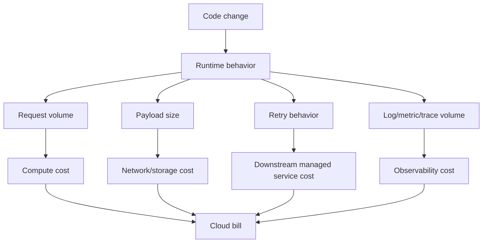

# Part 047 — Cloud Cost Fundamentals

> Target pembaca: Senior Java/JAX-RS backend engineer yang perlu memahami biaya cloud sebagai konsekuensi langsung dari desain arsitektur, pola traffic, observability, reliability pattern, dan operational discipline.

Biaya cloud bukan sekadar urusan finance.

Untuk backend engineer, biaya cloud adalah sinyal bahwa sistem memiliki karakteristik tertentu:

- compute terlalu besar atau terlalu banyak idle;
- request terlalu chatty antar service;
- traffic melewati NAT padahal bisa private endpoint;
- log terlalu verbose atau high-cardinality;
- metric terlalu banyak label;
- database/broker/cache overprovisioned;
- cross-AZ/cross-region traffic tidak disadari;
- file/object tidak punya lifecycle policy;
- load balancer, disk, snapshot, IP, atau registry image tertinggal setelah deployment berubah;
- retry storm menggandakan request ke cloud service;
- environment non-prod tidak punya shutdown/scale-down policy.

Part ini tidak bertujuan menggantikan FinOps atau pricing calculator. Tujuannya adalah membangun **cost reasoning** agar engineer mampu mereview PR, ADR, deployment, dan incident dari sisi biaya.

---

## 1. Konsep inti

Biaya cloud muncul dari kombinasi:

```text
cost = usage volume
     x unit price
     x topology
     x retention
     x redundancy
     x operational waste
     x failure amplification
```

Dalam production backend system, unit biaya biasanya muncul dari:

- compute runtime;
- memory allocation;
- disk/storage allocation;
- object storage request dan storage class;
- data transfer;
- NAT gateway processing;
- load balancer hours dan capacity unit;
- log ingestion dan retention;
- metric cardinality;
- managed database instance/storage/IO/backup;
- managed broker throughput/storage/partition/broker count;
- Redis node size/replica/cluster mode;
- cross-AZ traffic;
- cross-region replication;
- public internet egress;
- idle resource;
- orphaned resource.

Mental model penting:

> Di cloud, topology adalah biaya. Jalur network, region, AZ, endpoint, retention, dan observability decision ikut menentukan invoice.

---

## 2. Cloud cost bukan hanya resource size

Kesalahan umum backend engineer adalah menganggap cost hanya berarti ukuran VM atau jumlah pod.

Padahal, dua deployment dengan jumlah pod sama bisa memiliki cost sangat berbeda.

Contoh:

```text
Deployment A:
  pod -> VPC endpoint/private endpoint -> object storage
  log INFO normal
  request batch
  lifecycle policy aktif

Deployment B:
  pod -> NAT gateway -> public object storage endpoint
  log DEBUG aktif
  request satu file dipecah menjadi banyak call kecil
  object tidak pernah expire
```

Keduanya mungkin menjalankan kode Java yang sama, tetapi cost profile-nya berbeda.

Cost harus dibaca sebagai hasil dari:

- architecture shape;
- runtime behavior;
- dependency behavior;
- operational policy;
- failure behavior.

---

## 3. Cost driver utama untuk Java/JAX-RS backend

Aplikasi Java/JAX-RS biasanya memengaruhi biaya cloud lewat beberapa jalur.

### 3.1 Compute

Cost compute dipengaruhi oleh:

- jumlah pod;
- CPU request/limit;
- memory request/limit;
- node size;
- node count;
- autoscaling policy;
- runtime idle time;
- JVM heap sizing;
- GC behavior;
- startup time;
- batch job duration;
- thread pool saturation;
- overprovisioned non-prod environment.

Untuk Kubernetes, biaya tidak dihitung per class Java atau endpoint JAX-RS. Biaya muncul dari node/pod infrastructure yang harus disediakan untuk menjalankan workload tersebut.

### 3.2 Storage

Storage cost dipengaruhi oleh:

- database volume;
- persistent volume;
- object storage size;
- storage tier/class;
- snapshot;
- backup retention;
- archive retention;
- log retention;
- registry image retention;
- orphaned disk.

### 3.3 Network

Network cost dipengaruhi oleh:

- public internet egress;
- cross-AZ traffic;
- cross-region traffic;
- NAT gateway processing;
- private endpoint/interface endpoint processing;
- load balancer traffic;
- chatty service-to-service call;
- large payload transfer;
- repeated retry.

### 3.4 Observability

Observability cost dipengaruhi oleh:

- log ingestion volume;
- log retention;
- metric cardinality;
- trace sampling rate;
- span volume;
- dashboard query frequency;
- debug logging;
- duplicate telemetry pipeline;
- high-cardinality labels such as user ID, request ID, quote ID, order ID, tenant ID, or full URL.

### 3.5 Managed service

Managed services memiliki cost driver sendiri:

- database instance class/node size;
- broker count;
- partition count;
- storage retention;
- backup retention;
- throughput unit/capacity unit;
- cache node size;
- replica count;
- HA/Multi-AZ option;
- private endpoint;
- monitoring/log export.

---

## 4. AWS-specific cost reasoning

Di AWS, backend engineer harus memperhatikan beberapa cost driver yang sering tidak terlihat di kode.

### 4.1 EKS and compute

EKS workload cost biasanya berasal dari:

- EC2 worker node;
- managed node group;
- Karpenter provisioned node;
- Fargate profile jika digunakan;
- EBS volume untuk node/workload;
- load balancer yang dibuat oleh Service/Ingress;
- CloudWatch Container Insights;
- NAT Gateway untuk pod egress;
- data transfer antar AZ;
- image pull dari ECR.

Hal yang harus direview:

- Apakah CPU/memory request realistis?
- Apakah pod idle tetapi request besar?
- Apakah HPA target terlalu konservatif?
- Apakah node pool terlalu besar untuk workload?
- Apakah workload non-prod berjalan 24/7 tanpa alasan?
- Apakah pod egress ke AWS service masih lewat NAT Gateway?
- Apakah setiap namespace/team membuat load balancer sendiri?

### 4.2 NAT Gateway

NAT Gateway sering menjadi cost surprise.

Pola berbahaya:

```text
pod -> private subnet route table -> NAT Gateway -> public AWS service endpoint
```

Untuk beberapa AWS service, VPC endpoint dapat mengurangi ketergantungan pada public path dan NAT path. Namun endpoint juga punya biaya sendiri. Review harus membandingkan:

- volume traffic;
- endpoint type;
- AZ placement;
- operational simplicity;
- security requirement;
- private connectivity requirement.

### 4.3 Data transfer

AWS data transfer dipengaruhi source, destination, dan volume traffic.

Area yang sering mahal:

- cross-AZ service call;
- cross-region replication;
- internet egress;
- load balancer cross-zone behavior;
- NAT path;
- chatty microservice call;
- large object transfer;
- broker replication;
- database replica traffic;
- observability export.

### 4.4 CloudWatch

CloudWatch cost dapat meningkat karena:

- log ingestion tinggi;
- retention terlalu panjang;
- high-cardinality metric;
- custom metric berlebihan;
- Container Insights volume tinggi;
- verbose application logs;
- duplicate log shipping.

Backend engineer harus mereview log statement seperti mereview code path mahal.

```java
// Dangerous in production if payload is large or contains PII
log.info("quoteCalculationResponse={}", response);
```

Masalahnya bukan hanya biaya. Ini juga privacy, compliance, dan incident triage noise.

### 4.5 Managed AWS services

Cost driver umum:

| Service | Cost driver yang perlu direview |
|---|---|
| RDS PostgreSQL | instance class, storage, IOPS, backup, read replica, Multi-AZ, monitoring |
| Aurora PostgreSQL-compatible | capacity model, storage IO, replica, backup, cross-region replication |
| MSK | broker count, instance type, storage, partition count, data transfer, monitoring |
| Amazon MQ RabbitMQ | broker instance, deployment mode, storage, transfer, monitoring |
| ElastiCache Redis/Valkey | node type, shard count, replica count, backup, data transfer |
| S3 | storage class, request rate, lifecycle, replication, retrieval, data transfer |
| ECR | image storage, scan, replication, pull-through cache, retention |

---

## 5. Azure-specific cost reasoning

Di Azure, backend engineer harus membaca cost dari subscription/resource group/topology dan service-specific billing dimension.

### 5.1 AKS and compute

AKS workload cost biasanya berasal dari:

- VM scale set node pool;
- system node pool;
- user node pool;
- Azure Disk/Azure Files;
- Azure Load Balancer;
- Application Gateway jika digunakan;
- Azure Monitor Container Insights;
- Log Analytics ingestion/retention;
- Azure NAT Gateway untuk egress;
- private endpoint;
- ACR image storage/replication.

Hal yang harus direview:

- Apakah node pool dipisahkan berdasarkan workload yang benar?
- Apakah non-prod node pool bisa scale down?
- Apakah pod request terlalu tinggi?
- Apakah log dikirim ke workspace yang benar?
- Apakah Application Gateway dipakai untuk semua kasus padahal tidak semua butuh Layer 7/WAF?
- Apakah egress ke Azure service masih lewat NAT/public path padahal Private Endpoint tersedia?

### 5.2 Azure NAT Gateway and outbound

Azure NAT Gateway mempermudah outbound static IP dan scalable SNAT, tetapi tetap menjadi cost driver.

Pola yang perlu dipertanyakan:

```text
AKS pod -> UDR/default route -> NAT Gateway/firewall -> public service endpoint
```

Untuk service tertentu, Private Endpoint dapat mengubah jalur menjadi private path.

Review harus memastikan:

- outbound route memang sengaja;
- SNAT port exhaustion tidak terjadi;
- NAT cost sesuai volume traffic;
- Private Endpoint digunakan untuk service sensitif;
- firewall/proxy inspection tidak menambah latency berlebihan.

### 5.3 Azure Monitor and Log Analytics

Azure Monitor/Log Analytics cost dapat meningkat karena:

- log ingestion volume;
- retention;
- high-cardinality custom log;
- Container Insights;
- verbose application logs;
- diagnostic settings dari banyak resource;
- query-heavy dashboard;
- duplicate workspace routing.

Backend engineer perlu tahu workspace mana yang menerima log aplikasi dan bagaimana retention ditentukan.

### 5.4 Managed Azure services

| Service | Cost driver yang perlu direview |
|---|---|
| Azure Database for PostgreSQL Flexible Server | compute tier, storage, backup retention, HA, replica, IOPS, private access |
| Azure Event Hubs | throughput/capacity unit, partition count, retention, capture, networking |
| Azure Cache for Redis / Azure Managed Redis | SKU, memory size, clustering, replica, persistence, private endpoint |
| Azure Blob Storage | tier, transaction count, lifecycle, replication, data retrieval, data transfer |
| Azure Container Registry | SKU, storage, geo-replication, private endpoint, retention |
| Application Gateway | capacity, WAF, rule complexity, traffic volume |
| Azure Monitor | ingestion, retention, alerting, query, workspace design |

---

## 6. Cost and Kubernetes requests/limits

Kubernetes cost discipline dimulai dari request/limit.

```yaml
resources:
  requests:
    cpu: "500m"
    memory: "1Gi"
  limits:
    cpu: "1"
    memory: "2Gi"
```

Request menentukan scheduling. Jika request terlalu tinggi, cluster perlu node lebih besar/banyak. Jika request terlalu rendah, workload bisa mengalami throttling atau eviction.

Cost review harus melihat:

- actual CPU usage vs request;
- actual memory usage vs request;
- p95/p99 usage;
- GC pattern;
- traffic peak;
- autoscaling target;
- node bin-packing;
- overcommit policy;
- namespace quota;
- non-prod request profile.

### Anti-pattern

```text
Semua service Java diberi request 2 CPU / 4Gi memory karena aman.
```

Dampak:

- node count membengkak;
- autoscaler sulit scale down;
- non-prod mahal;
- kapasitas tampak penuh padahal runtime idle;
- engineer tidak belajar karakteristik workload.

---

## 7. Cost impact dari Java runtime

Java service memiliki cost pattern khas.

### 7.1 Heap terlalu besar

Heap besar bisa mengurangi OOM risk, tetapi menaikkan memory request dan node size.

Pertanyaan review:

- Apakah heap size berdasarkan load test?
- Apakah container memory limit selaras dengan `-Xmx`?
- Apakah ada native memory allowance?
- Apakah GC pause dipantau?
- Apakah memory leak membuat autoscaling tidak efektif?

### 7.2 Thread pool terlalu besar

Thread pool besar dapat menaikkan memory, context switching, dan downstream pressure.

```text
incoming HTTP request
  -> servlet/container thread
  -> worker executor
  -> DB pool
  -> SDK HTTP pool
  -> broker producer/consumer
```

Jika setiap layer dikonfigurasi besar tanpa backpressure, cost bisa naik karena retry, saturation, dan overprovisioning.

### 7.3 Payload terlalu besar

Payload besar menaikkan:

- network transfer;
- serialization CPU;
- memory pressure;
- log risk;
- object storage request duration;
- API gateway/load balancer processing;
- trace/log size.

---

## 8. Cost impact per dependency

### 8.1 PostgreSQL

Cost driver:

- connection count;
- query efficiency;
- index bloat;
- storage growth;
- backup retention;
- replica;
- HA;
- monitoring;
- connection pool/proxy.

Cost anti-pattern:

```text
Scale database vertically because application has inefficient query and no connection pool discipline.
```

### 8.2 Kafka/RabbitMQ

Cost driver:

- broker count;
- partition/queue count;
- retention;
- replication factor;
- message size;
- consumer lag;
- dead-letter accumulation;
- cross-AZ replication;
- monitoring/logging.

Cost anti-pattern:

```text
Set retention long because nobody owns cleanup semantics.
```

### 8.3 Redis

Cost driver:

- node memory size;
- cluster mode;
- replica count;
- persistence;
- eviction policy;
- key cardinality;
- TTL discipline;
- hot key handling.

Cost anti-pattern:

```text
Use Redis as unbounded storage because it is fast.
```

### 8.4 Camunda/workflow engine

Cost driver:

- process instance volume;
- history retention;
- job executor load;
- incident backlog;
- database growth;
- polling frequency;
- external task worker behavior;
- observability volume.

Cost anti-pattern:

```text
Keep full workflow history forever without archival/retention policy.
```

### 8.5 NGINX/Ingress

Cost driver:

- request volume;
- TLS termination;
- access log volume;
- upstream timeout/retry behavior;
- buffering;
- large request/response body;
- number of load balancers behind ingress.

Cost anti-pattern:

```text
Enable verbose access logs with full headers and high-volume health checks.
```

---

## 9. Cost anomaly failure modes

Cost anomaly sering merupakan symptom dari technical failure.

| Symptom | Kemungkinan akar masalah |
|---|---|
| NAT Gateway cost naik tajam | Pod egress ke cloud service lewat public endpoint, retry storm, large transfer |
| Log cost naik | DEBUG aktif, payload logging, exception loop, high-volume health check logs |
| Database cost naik | Inefficient query, missing index, connection pool misconfigured, vertical scaling workaround |
| Broker cost naik | Retention terlalu panjang, consumer lag, message size besar, DLQ tidak dibersihkan |
| Redis cost naik | TTL tidak ada, key explosion, cache digunakan sebagai source of truth |
| Load balancer cost naik | Orphaned ingress/service, terlalu banyak LB per namespace/team |
| Object storage cost naik | Lifecycle tidak ada, duplicate object, archive/retrieval pattern salah |
| Cross-AZ cost naik | Service placement tidak diperhatikan, load balancer cross-zone, database/broker traffic lintas AZ |
| Cross-region cost naik | Replication tidak dibatasi, DR pipeline terlalu agresif, observability export lintas region |

---

## 10. Mermaid mental model



Cost review berarti membaca panah dari code/design ke cloud bill.

---

## 11. Cost debugging workflow

Ketika cost naik, jangan langsung cari “service paling mahal” saja. Cari **flow** yang berubah.

### Step 1 — Identifikasi dimensi

Tanyakan:

- Cost naik di account/subscription mana?
- Environment mana?
- Resource group/tag mana?
- Service apa?
- Region mana?
- Sejak kapan?
- Apakah ada deployment, incident, load test, migration, atau config change?

### Step 2 — Hubungkan ke telemetry

Cari korelasi dengan:

- request rate;
- error rate;
- retry count;
- timeout count;
- log ingestion;
- trace volume;
- NAT bytes;
- data transfer;
- object storage request count;
- database CPU/IO/storage;
- broker throughput/lag;
- Redis memory/key count.

### Step 3 — Baca topology

Periksa:

- jalur egress;
- private endpoint/VPC endpoint;
- AZ placement;
- cross-region call;
- load balancer count;
- orphaned resource;
- retention setting;
- autoscaling behavior.

### Step 4 — Klasifikasikan

```text
cost anomaly type:
  usage growth
  architecture inefficiency
  misconfiguration
  failure amplification
  orphaned resource
  observability noise
  retention leak
  capacity overprovisioning
```

### Step 5 — Buat action aman

Action harus punya owner, risiko, dan rollback.

Contoh:

- turunkan log level;
- aktifkan lifecycle policy;
- pindahkan traffic ke private endpoint;
- tune retry policy;
- resize node pool;
- hapus orphaned load balancer;
- ubah retention;
- perbaiki query;
- batasi metric label;
- scale down non-prod.

---

## 12. Cost review untuk PR/ADR

Gunakan pertanyaan ini saat review perubahan.

### 12.1 Compute

- Apakah perubahan ini menambah pod, worker, scheduler, atau background job?
- Apakah request/limit punya dasar load test?
- Apakah HPA/Cluster Autoscaler/Karpenter/AKS autoscaler akan bereaksi dengan benar?
- Apakah non-prod butuh kapasitas sama dengan prod?
- Apakah job bisa dijalankan batch/off-peak?

### 12.2 Network

- Apakah service call baru menambah cross-AZ/cross-region traffic?
- Apakah call ke cloud service lewat private endpoint atau NAT/public path?
- Apakah payload besar?
- Apakah retry bisa menggandakan traffic?
- Apakah ada CDN/cache/object storage direct access option?

### 12.3 Storage

- Apakah object/database/log punya retention?
- Apakah storage class/tier sesuai access pattern?
- Apakah backup/snapshot punya lifecycle?
- Apakah file duplicate bisa terjadi?
- Apakah archive retrieval cost dipahami?

### 12.4 Observability

- Apakah log statement baru berpotensi high-volume?
- Apakah log mengandung payload besar atau PII?
- Apakah metric label high-cardinality?
- Apakah trace sampling realistis?
- Apakah alert/dashboard query mahal?

### 12.5 Managed service

- Apakah perubahan meningkatkan DB query volume?
- Apakah message retention berubah?
- Apakah Redis key TTL jelas?
- Apakah private endpoint tambahan diperlukan?
- Apakah monitoring/log export tambahan punya cost?

---

## 13. Internal verification checklist

Gunakan checklist ini di CSG/team, tanpa mengasumsikan detail internal.

### Account/subscription and ownership

- AWS account/Azure subscription untuk aplikasi Quote & Order.
- Resource group/account mapping per environment.
- Tagging standard.
- Cost allocation tag yang mandatory.
- Owner setiap resource group/namespace.
- Cost dashboard resmi.
- Budget alert dan anomaly alert.

### Compute

- EKS/AKS node pool cost.
- Pod request/limit standard.
- HPA/VPA usage.
- Cluster Autoscaler/Karpenter/AKS autoscaler config.
- Non-prod scale-down policy.
- Idle workload report.

### Network

- NAT Gateway/Azure NAT Gateway usage.
- VPC endpoint/private endpoint list.
- Cross-AZ traffic metric/report.
- Cross-region traffic metric/report.
- Internet egress report.
- Firewall/proxy egress report.

### Storage

- S3 bucket/Blob container lifecycle policy.
- Backup retention.
- Snapshot retention.
- Orphaned disk/PV report.
- ECR/ACR image retention.
- Archive strategy.

### Observability

- CloudWatch/Log Analytics ingestion volume.
- Retention policy per log category.
- Debug logging governance.
- Metric cardinality guardrail.
- Trace sampling strategy.
- PII log review.

### Managed service

- RDS/Azure PostgreSQL sizing.
- Kafka/RabbitMQ broker sizing.
- Redis sizing.
- Camunda database growth/history retention.
- Load balancer count.
- API Gateway/APIM tier/capacity.

### Process

- PR cost review checklist.
- ADR cost impact section.
- Platform/SRE/FinOps review process.
- Cost incident escalation path.
- Monthly cost review cadence.

---

## 14. Senior engineer heuristics

### Heuristic 1 — Cost follows traffic shape

If traffic shape changes, cost changes.

Examples:

- synchronous call becomes fan-out;
- payload grows;
- polling interval gets shorter;
- retry count increases;
- retention increases;
- log detail increases.

### Heuristic 2 — Private is not automatically cheaper

Private endpoint can reduce public/NAT path and improve security posture, but it can also add endpoint, DNS, and operational cost. Validate traffic volume and security requirement.

### Heuristic 3 — Observability without sampling is a cost multiplier

Logs, metrics, and traces are production tools. Without control, they become data exhaust.

### Heuristic 4 — Non-prod cost is usually governance debt

Dev/test/staging often leak cost through always-on clusters, large DBs, long retention, orphaned resources, and copied production sizing.

### Heuristic 5 — Retry storm is both reliability failure and cost failure

A retry storm increases:

- request count;
- compute usage;
- data transfer;
- managed service throttling;
- logs;
- traces;
- downstream saturation.

---

## 15. Production readiness checklist

Before approving cloud/backend changes, verify:

- [ ] cost driver is identified;
- [ ] expected traffic volume is known;
- [ ] payload size is bounded;
- [ ] timeout/retry policy is bounded;
- [ ] private/public egress path is intentional;
- [ ] cross-AZ/cross-region traffic is understood;
- [ ] log level is production-safe;
- [ ] metric labels avoid high cardinality;
- [ ] trace sampling is defined;
- [ ] object/log/backup retention is defined;
- [ ] Kubernetes request/limit is justified;
- [ ] managed service capacity is justified;
- [ ] non-prod scaling policy exists;
- [ ] tags are complete;
- [ ] cost dashboard/alert exists;
- [ ] rollback plan exists.

---

## 16. Common mistakes

### Mistake 1 — Treating cloud bill as finance-only signal

Cloud bill often reveals technical behavior.

### Mistake 2 — Ignoring data transfer

Network topology is part of cost design.

### Mistake 3 — Keeping logs forever

Retention must reflect operational, audit, and compliance needs, not default inertia.

### Mistake 4 — Overprovisioning Java services because memory is scary

Memory sizing should be measured, not guessed.

### Mistake 5 — Forgetting orphaned resources

Ingress, load balancer, disk, snapshot, public IP, private endpoint, and registry image can survive after app changes.

### Mistake 6 — Optimizing cost by removing observability blindly

Reducing logs/metrics/traces without incident impact analysis can make production harder to operate.

---

## 17. How this applies to CSG Quote & Order context

Untuk sistem CPQ/quote/order enterprise, cost review harus memperhatikan:

- quote calculation burst traffic;
- order submission peak;
- batch export/import;
- document/binary storage;
- workflow history growth;
- Kafka/RabbitMQ event retention;
- Redis cache key TTL;
- PostgreSQL query/storage growth;
- observability volume during incident;
- customer/tenant isolation;
- hybrid/on-prem traffic;
- DR replication;
- audit/compliance retention.

Jangan mengasumsikan CSG memakai service tertentu tanpa verifikasi. Gunakan part ini untuk bertanya:

- Service mana yang paling mahal?
- Flow mana yang menyebabkan biaya itu?
- Apakah cost tersebut intentional?
- Apakah ada reliability/security reason?
- Apakah ada trade-off yang lebih baik?

---

## 18. Ringkasan

Cloud cost untuk backend engineer adalah kombinasi dari:

- compute;
- storage;
- data transfer;
- NAT/private endpoint;
- load balancer;
- logs/metrics/traces;
- database/broker/cache;
- cross-AZ/cross-region topology;
- overprovisioning;
- idle/orphaned resources;
- failure amplification.

Senior engineer tidak harus menjadi pricing specialist, tetapi harus mampu melihat bahwa keputusan desain kecil bisa menjadi cost multiplier besar.

Cost-aware architecture bukan berarti selalu memilih yang paling murah. Artinya memilih desain yang biayanya **disengaja, terukur, dapat dijelaskan, dan sebanding dengan reliability/security/performance benefit**.

---

## 19. Referensi resmi untuk dipelajari lebih lanjut

- AWS Well-Architected Framework — Cost Optimization Pillar.
- AWS Well-Architected — Plan for data transfer.
- AWS Well-Architected — Implement services to reduce data transfer costs.
- AWS VPC pricing and NAT Gateway pricing pages.
- AWS CloudWatch pricing and Container Insights documentation.
- Microsoft Azure Well-Architected Framework — Cost Optimization.
- Microsoft Azure Well-Architected — Cost model and flow cost optimization.
- Azure Monitor and Log Analytics cost optimization guidance.
- Azure NAT Gateway pricing and AKS outbound documentation.
