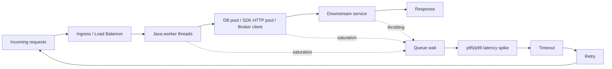

# Part 048 — Performance and Capacity Planning

> Target pembaca: Senior Java/JAX-RS backend engineer yang perlu merencanakan kapasitas cloud production secara realistis, bukan hanya menaikkan CPU/memory saat sistem melambat.

Performance bukan hanya “response time cepat”.

Capacity planning bukan hanya “berapa pod yang dibutuhkan”.

Dalam sistem enterprise Java/JAX-RS di Kubernetes, performance adalah hasil interaksi:

```text
client traffic
  -> DNS/load balancer/ingress
  -> Java request handling
  -> thread pool / event loop
  -> DB pool
  -> broker producer/consumer
  -> Redis
  -> cloud SDK
  -> network path
  -> managed service capacity
  -> observability overhead
```

Jika salah satu layer jenuh, symptom bisa muncul di layer lain.

Contoh:

- database pool penuh terlihat sebagai HTTP timeout;
- DNS lambat terlihat sebagai SDK timeout;
- Kafka consumer lag terlihat sebagai order processing delay;
- Redis hot key terlihat sebagai p99 latency spike;
- NAT/SNAT exhaustion terlihat sebagai random connection timeout;
- CPU throttling di pod terlihat sebagai semua dependency tampak lambat;
- log volume tinggi terlihat sebagai application latency spike.

Part ini membangun mental model performance dan capacity planning untuk cloud-native backend system.

---

## 1. Konsep inti

Performance adalah kemampuan sistem memenuhi latency dan throughput target di bawah kondisi workload tertentu.

Capacity adalah jumlah resource yang tersedia untuk menahan workload tersebut tanpa melewati batas saturasi.

```text
performance = latency + throughput + error rate + saturation + consistency of behavior
capacity    = available resource before saturation under expected and peak load
```

Empat sinyal inti:

| Sinyal | Makna |
|---|---|
| Latency | Berapa lama request selesai |
| Throughput | Berapa banyak unit kerja per waktu |
| Saturation | Seberapa dekat resource ke batas |
| Error rate | Berapa banyak request gagal atau timeout |

Untuk production, rata-rata tidak cukup. Perhatikan:

- p50;
- p90;
- p95;
- p99;
- max;
- timeout rate;
- queue wait;
- retry count;
- downstream latency;
- tail latency saat peak.

---

## 2. Queueing mental model

Sebagian besar performance incident adalah masalah queueing.

```text
arrival rate > service rate => queue grows => latency rises => timeout => retry => more load
```

Mermaid view:



Retry can turn capacity problem into cascade failure.

---

## 3. Latency budget

A senior engineer should allocate latency budget per layer.

Example for a 1-second p95 API target:

| Layer | Budget example |
|---|---:|
| DNS/load balancer/ingress | 50 ms |
| Java request handling | 100 ms |
| PostgreSQL query | 300 ms |
| Redis/cache | 30 ms |
| Kafka/RabbitMQ publish | 100 ms |
| Cloud SDK call | 200 ms |
| Serialization/logging/overhead | 70 ms |
| Buffer | 150 ms |

This is not a universal target. The point is discipline:

> If every dependency says “my timeout is 30 seconds”, the end-to-end system has no latency design.

---

## 4. Throughput model

Throughput must be tied to business operation, not only HTTP RPS.

For Quote & Order style systems, throughput units might be:

- quote create per second;
- quote price calculation per minute;
- order submit per minute;
- order state transition per minute;
- catalog lookup per second;
- document generation per minute;
- workflow job execution per minute;
- Kafka event produced/consumed per second;
- RabbitMQ message processed per second;
- batch import/export records per minute.

HTTP RPS alone can mislead because one request can fan out into many backend operations.

Example:

```text
1 quote submit request
  -> 8 PostgreSQL queries
  -> 3 Redis calls
  -> 2 Kafka events
  -> 1 object storage write
  -> 1 workflow transition
  -> 30 log lines
```

A capacity model should count the downstream multiplier.

---

## 5. Java/JAX-RS performance model

A Java/JAX-RS service typically has these capacity boundaries.

### 5.1 Request handling threads

Classic servlet/JAX-RS stacks often use thread-per-request.

Capacity depends on:

- max request threads;
- blocking IO duration;
- DB pool size;
- SDK HTTP pool size;
- downstream latency;
- CPU per request;
- memory per request;
- GC behavior.

If threads block waiting for database or cloud SDK, adding more request threads may increase memory and queueing without increasing true throughput.

### 5.2 Connection pools

Critical pools:

- PostgreSQL pool;
- Redis connection pool;
- HTTP client pool;
- AWS SDK HTTP client pool;
- Azure SDK HTTP pipeline/client pool;
- Kafka producer buffer;
- RabbitMQ channel/connection pool;
- Camunda/job executor pool.

Pool size must reflect downstream capacity.

Anti-pattern:

```text
Increase DB pool from 20 to 200 because API is slow.
```

If database can only handle 40 effective concurrent queries, this worsens contention.

### 5.3 JVM memory and GC

Capacity depends on:

- heap size;
- native memory;
- direct buffer;
- metaspace;
- thread stack;
- GC algorithm;
- allocation rate;
- large payload handling;
- object churn;
- container memory limit.

For Kubernetes:

```text
container memory limit > JVM heap + native memory + direct buffer + thread stack + margin
```

Otherwise, the pod may be OOMKilled even if heap does not appear full.

### 5.4 CPU throttling

CPU throttling can create latency spikes without obvious high CPU usage.

Watch:

- container CPU usage;
- CPU throttling metric;
- p99 latency;
- GC pause;
- request queue length;
- thread pool queue;
- HPA scale event.

---

## 6. AWS-specific performance and capacity reasoning

### 6.1 Region and AZ placement

AWS region/AZ placement affects:

- latency;
- data transfer;
- HA;
- dependency proximity;
- DR strategy;
- regulatory boundary.

Questions:

- Are EKS nodes, RDS, Redis, broker, and object storage in expected region?
- Is traffic crossing AZ unnecessarily?
- Is cross-zone load balancing required?
- Are clients/on-prem systems far from region?
- Is Direct Connect/VPN path adding latency?

### 6.2 EKS node capacity

Review:

- node instance type;
- CPU/memory allocatable;
- daemonset overhead;
- pod density;
- ENI/IP limit;
- subnet IP capacity;
- requests vs actual usage;
- Cluster Autoscaler/Karpenter behavior;
- Spot node risk;
- image pull time;
- node startup time.

Capacity issue examples:

| Symptom | Possible EKS capacity cause |
|---|---|
| Pod pending | insufficient CPU/memory, IP exhaustion, taint/toleration mismatch |
| Random connection timeout | SNAT/NAT issue, security group, DNS, downstream saturation |
| p99 spike after scale-out | cold node, image pull delay, cache warmup |
| ALB target unhealthy | readiness probe, security group, target type, pod startup |
| Autoscaler not scaling | wrong HPA metric, resource request missing, quota/node group limit |

### 6.3 AWS managed services

| Dependency | Capacity signal |
|---|---|
| RDS PostgreSQL | CPU, connections, active sessions, IOPS, lock wait, slow query, storage, replica lag |
| Aurora PostgreSQL-compatible | ACU/capacity, CPU, IO, buffer cache, replica lag, failover behavior |
| MSK | broker CPU, disk, partition skew, produce/fetch latency, consumer lag |
| Amazon MQ RabbitMQ | queue depth, memory alarm, disk alarm, channel count, connection count |
| ElastiCache Redis/Valkey | CPU, memory, evictions, replication lag, hot key, connections |
| S3 | request rate, latency, throttling, multipart upload behavior, prefix/key pattern |
| CloudWatch | ingestion delay, metric resolution, log volume, query latency |

---

## 7. Azure-specific performance and capacity reasoning

### 7.1 Region and zone placement

Azure region/availability zone placement affects:

- latency to users/on-prem;
- zone-redundant service behavior;
- data transfer;
- HA;
- private endpoint placement;
- policy/compliance boundary.

Questions:

- Are AKS, PostgreSQL, Redis, Event Hubs, Key Vault, and Storage in expected region?
- Is zone redundancy required?
- Are private endpoints in the right VNet/subnet?
- Is traffic crossing hub/firewall unnecessarily?
- Is ExpressRoute path adding latency?

### 7.2 AKS node pool capacity

Review:

- system node pool vs user node pool;
- VM SKU;
- max pods per node;
- Azure CNI/IP planning;
- subnet IP capacity;
- daemonset overhead;
- requests vs usage;
- Cluster Autoscaler;
- node image upgrade behavior;
- Spot node pool usage;
- private cluster DNS path.

Capacity issue examples:

| Symptom | Possible AKS capacity cause |
|---|---|
| Pod pending | insufficient node capacity, IP exhaustion, node pool max size |
| Pod cannot reach service | NSG/UDR/firewall/private DNS/private endpoint issue |
| Latency spike | CPU throttling, node saturation, firewall path, downstream saturation |
| Image pull slow/failing | ACR auth/private endpoint/DNS/network issue |
| Autoscaler not scaling | missing request, max node limit, quota, metric issue |

### 7.3 Azure managed services

| Dependency | Capacity signal |
|---|---|
| Azure Database for PostgreSQL Flexible Server | CPU, memory, connections, IOPS, storage, locks, slow query, replica lag |
| Azure Event Hubs | throughput/capacity unit, incoming/outgoing requests, throttled requests, consumer lag |
| Azure Cache for Redis / Managed Redis | server load, memory, evictions, connected clients, operations/sec, latency |
| Azure Blob Storage | request latency, throttling, transaction count, bandwidth, private endpoint path |
| Azure Monitor/Log Analytics | ingestion volume, ingestion latency, query latency, retention, workspace throttling |
| Application Gateway | capacity unit, healthy host count, backend response status, WAF processing |

---

## 8. Kubernetes capacity planning

Kubernetes capacity planning is not “add more replicas”.

It includes:

- node capacity;
- pod requests/limits;
- HPA/VPA;
- cluster autoscaler;
- pod startup time;
- image pull time;
- readiness/liveness/startup probes;
- PodDisruptionBudget;
- rolling update strategy;
- namespace quota;
- priority class;
- daemonset overhead;
- network/IP capacity;
- storage capacity.

### 8.1 Requests and limits

Requests affect scheduling. Limits affect runtime constraints.

Review:

- Is request based on measured p95 usage?
- Is limit too tight causing throttling/OOM?
- Is memory request inflated due to oversized heap?
- Does HPA use CPU, memory, queue length, or custom metric?
- Are batch jobs isolated from API pods?

### 8.2 HPA and autoscaling delay

Autoscaling is not instant.

Time components:

```text
metric collection delay
+ HPA decision interval
+ node provisioning delay
+ image pull
+ pod startup
+ readiness delay
+ cache warmup
```

If traffic spike is sudden, capacity must include buffer.

### 8.3 Probes

Bad probes create false capacity loss.

Anti-pattern:

```text
liveness probe checks database dependency
```

If database is slow, Kubernetes restarts healthy application pods and worsens the incident.

Better distinction:

- startup probe: app startup complete;
- readiness probe: can receive traffic;
- liveness probe: process is stuck and must be restarted.

---

## 9. Database capacity

For PostgreSQL, capacity is not only CPU.

Watch:

- active connections;
- connection pool wait;
- slow queries;
- lock wait;
- deadlocks;
- transaction duration;
- index usage;
- table/index bloat;
- IOPS;
- checkpoint behavior;
- replication lag;
- autovacuum health;
- storage growth.

Java service symptoms:

- request p99 rises;
- DB pool exhausted;
- timeout from application side;
- retries increase;
- thread pool saturated;
- Kafka/RabbitMQ consumer slows down;
- Camunda jobs pile up.

Capacity rule:

> Application concurrency must be aligned with database concurrency. More application threads do not create more database capacity.

---

## 10. Broker capacity

### 10.1 Kafka/MSK/Event Hubs

Watch:

- produce latency;
- fetch latency;
- consumer lag;
- partition skew;
- broker CPU;
- broker disk;
- network throughput;
- replication lag;
- throttling;
- message size;
- retention.

Throughput depends on partitioning strategy.

Bad partition key can create hot partition even when total cluster capacity looks fine.

### 10.2 RabbitMQ/Amazon MQ

Watch:

- queue depth;
- unacked messages;
- consumer count;
- channel count;
- connection count;
- memory alarm;
- disk alarm;
- publish confirm latency;
- redelivery loop;
- DLQ growth.

Capacity issue often comes from consumer behavior, not broker size only.

---

## 11. Redis capacity

Redis performance depends on memory, key pattern, hot keys, command complexity, and network.

Watch:

- used memory;
- memory fragmentation;
- evictions;
- expired keys;
- connected clients;
- ops/sec;
- latency;
- slowlog;
- replication lag;
- hot key;
- cluster slot distribution.

Anti-patterns:

- no TTL;
- large value stored as one key;
- unbounded key cardinality;
- Redis used as durable source of truth;
- cache stampede during miss;
- synchronous Redis call in hot path without timeout.

---

## 12. Cloud SDK capacity

AWS SDK and Azure SDK calls consume:

- HTTP connection pool;
- worker threads;
- CPU for signing/serialization;
- TLS handshake;
- DNS lookup;
- retry budget;
- downstream quota;
- network bandwidth.

Review:

- SDK timeout;
- retry count;
- backoff/jitter;
- max concurrency;
- connection pool;
- async vs sync client;
- pagination;
- throttling handling;
- endpoint/region config;
- credential refresh latency.

Bad SDK config can hide capacity issue until peak traffic.

---

## 13. Load testing strategy

Load test should answer a specific question.

Weak question:

```text
Can the system handle load?
```

Better questions:

- What is p95 latency at expected peak traffic?
- What happens at 2x expected traffic?
- Which dependency saturates first?
- Does autoscaling catch up before timeout?
- Does retry storm appear after throttling?
- Does database pool saturate before CPU?
- Does Kafka lag recover after spike?
- Does Redis eviction start under peak?
- Does NAT/firewall/SNAT become bottleneck?
- How much does log volume grow during load?

### Load test stages

```text
baseline -> ramp-up -> steady peak -> spike -> soak -> dependency degradation -> recovery
```

### Minimum data to collect

- request rate;
- p50/p95/p99 latency;
- error rate;
- timeout rate;
- CPU/memory;
- GC pause;
- thread pool queue;
- DB pool wait;
- DB metrics;
- broker lag;
- Redis latency/eviction;
- SDK retry/throttling;
- ingress/load balancer metrics;
- network bytes;
- log/trace volume;
- autoscaling events.

---

## 14. Capacity planning worksheet

Use this worksheet for a service.

```text
Service name:
Critical endpoint/flow:
Expected normal load:
Expected peak load:
Burst duration:
Latency target p95/p99:
Error budget:
Downstream calls per request:
DB queries per request:
Broker messages per request:
Redis calls per request:
Cloud SDK calls per request:
Payload size:
Current replicas:
Current CPU/memory request:
Current node pool:
Autoscaling metric:
Known bottleneck:
Rollback/degradation plan:
```

For each dependency:

```text
Dependency:
Capacity metric:
Current utilization:
Peak utilization:
Saturation threshold:
Quota/limit:
Scaling mechanism:
Scaling time:
Failure behavior:
Owner:
```

---

## 15. Performance failure modes

| Failure mode | Symptom | Detection |
|---|---|---|
| CPU throttling | p99 latency spike, low apparent CPU | container throttling metric |
| DB pool exhaustion | request timeout, thread blocked | pool wait time, active connections |
| Slow query | endpoint p95 spike | slow query log, DB CPU/IO |
| Lock contention | intermittent timeout | lock wait, transaction age |
| Broker lag | delayed processing | consumer lag, queue depth |
| Redis hot key | random latency spike | Redis latency, hot key analysis |
| SNAT exhaustion | connection timeout | NAT/firewall metrics, connection errors |
| DNS latency/error | SDK timeout | DNS metrics, pod nslookup/dig |
| Retry storm | downstream overload | retry metric, request amplification |
| Autoscaling lag | spike causes timeout before scale | HPA/node events, pod startup timeline |
| Log overload | CPU/IO/network overhead | log ingestion, app CPU, exporter queue |
| Quota hit | throttling/errors | service quota metrics, cloud API errors |

---

## 16. Debugging workflow

### Step 1 — Define the symptom precisely

Avoid vague “slow”. Ask:

- Which endpoint/flow?
- p50, p95, or p99?
- Since when?
- Which environment/region?
- All tenants or specific tenants?
- Read path or write path?
- Synchronous API or async processing?

### Step 2 — Locate saturation

Check:

- ingress/load balancer;
- pod CPU/memory/throttling;
- JVM GC;
- request thread pool;
- DB pool;
- SDK HTTP pool;
- database;
- broker;
- Redis;
- network/NAT/firewall;
- log/trace exporter;
- cloud service quota.

### Step 3 — Check recent changes

- deployment;
- config change;
- scaling change;
- node upgrade;
- DB parameter change;
- network route change;
- WAF/gateway rule;
- secret/certificate rotation;
- traffic campaign;
- batch job;
- incident in dependency.

### Step 4 — Confirm whether it is demand or supply

```text
Demand increased:
  request rate, payload size, fan-out, batch volume, tenant activity

Supply decreased:
  pod/node capacity, DB capacity, broker capacity, Redis capacity, network path, quota

Efficiency decreased:
  slow query, bad cache, serialization overhead, logging, retry, code regression
```

### Step 5 — Apply bounded mitigation

Possible mitigations:

- scale replicas;
- scale node pool;
- reduce traffic via rate limit;
- disable non-critical feature;
- reduce log level;
- tune timeout/retry;
- add circuit breaker;
- rollback deployment;
- increase DB/broker/cache capacity;
- drain hot tenant/job;
- pause batch;
- route to degraded mode.

Every mitigation should have rollback and observation criteria.

---

## 17. PR review checklist

### Application layer

- [ ] Is latency target defined?
- [ ] Is endpoint sync or async by design?
- [ ] Are downstream calls bounded?
- [ ] Are timeout and retry values explicit?
- [ ] Is payload size bounded?
- [ ] Are large files streamed, not buffered?
- [ ] Is logging production-safe?
- [ ] Is metric cardinality controlled?

### Java runtime

- [ ] JVM heap aligns with container memory.
- [ ] CPU request/limit is justified.
- [ ] Thread pool is bounded.
- [ ] DB pool is bounded.
- [ ] SDK HTTP pool is bounded.
- [ ] Backpressure exists.
- [ ] GC metrics are observable.

### Kubernetes

- [ ] Requests/limits are based on measurement.
- [ ] HPA metric matches bottleneck.
- [ ] Autoscaling delay is understood.
- [ ] Node pool has capacity.
- [ ] Subnet/IP capacity is enough.
- [ ] Probes are correct.
- [ ] PDB does not block safe operations.

### Managed services

- [ ] PostgreSQL capacity is understood.
- [ ] Broker capacity and partition/queue design are understood.
- [ ] Redis memory/TTL/eviction are understood.
- [ ] Object storage request pattern is understood.
- [ ] Cloud SDK quotas/throttling are handled.

### Cloud topology

- [ ] Region/AZ placement is intentional.
- [ ] Cross-AZ/cross-region traffic is understood.
- [ ] NAT/firewall/private endpoint path is known.
- [ ] DNS path is known.
- [ ] Load balancer/ingress health check is correct.

---

## 18. Internal verification checklist

Gunakan checklist ini di CSG/team, tanpa mengasumsikan detail internal.

### Demand model

- Peak traffic per critical flow.
- Business event calendar that changes load.
- Tenant/customer load distribution.
- Batch/import/export schedule.
- Quote/order workflow volume.
- Async event volume.

### Application runtime

- JVM version and GC config.
- Container CPU/memory request/limit.
- Heap setting.
- Thread pool config.
- DB pool config.
- HTTP client/SDK pool config.
- Timeout/retry standard.

### Kubernetes

- EKS/AKS node pool size.
- Autoscaler config.
- HPA metrics.
- Pod startup time.
- Image pull time.
- Subnet/IP utilization.
- PDB.
- Resource quota.

### Network

- Ingress/load balancer metrics.
- NAT Gateway/Azure NAT Gateway metrics.
- Firewall/proxy metrics.
- Private endpoint path.
- DNS latency/errors.
- Cross-AZ/cross-region traffic.

### Dependencies

- PostgreSQL CPU/IO/connections/locks/slow query.
- Kafka/RabbitMQ lag/queue depth/broker saturation.
- Redis memory/evictions/latency/hot key.
- Camunda job executor backlog/history growth.
- Object storage latency/throttling.
- Cloud SDK throttling/error metrics.

### Observability

- Dashboard for p95/p99 latency.
- Dashboard for saturation.
- Dashboard for queue/pool wait.
- Distributed tracing coverage.
- Log sampling/retention.
- Alert thresholds.
- Load test report history.

---

## 19. Capacity planning maturity model

### Level 1 — Reactive

- Scale up after incident.
- No known bottleneck.
- No load test.
- No p95/p99 dashboard.

### Level 2 — Measured

- Basic metrics exist.
- CPU/memory visible.
- DB metrics visible.
- Some load test exists.

### Level 3 — Flow-based

- Critical business flows have capacity model.
- Downstream multiplier is known.
- HPA and pool sizes are intentional.
- Dependency saturation is monitored.

### Level 4 — Failure-aware

- Degradation tested.
- Retry storm risk modeled.
- Quota/limit monitored.
- Autoscaling lag understood.
- Load test includes dependency degradation.

### Level 5 — Principal-level

- Capacity model informs ADR/PR review.
- Cost/performance trade-off is explicit.
- DR and multi-region capacity are tested.
- Business growth scenarios are modeled.
- Platform/backend/SRE share the same mental model.

---

## 20. How this applies to CSG Quote & Order context

Untuk CPQ, quote management, order management, dan quote-to-cash system, capacity planning harus berbasis flow:

- quote creation;
- quote calculation;
- catalog lookup;
- pricing rule evaluation;
- order submission;
- workflow transition;
- event publishing;
- document generation;
- batch import/export;
- integration with external/on-prem systems.

Pertanyaan yang harus diajukan:

- Flow mana yang paling critical secara customer impact?
- Flow mana yang paling berat secara database?
- Flow mana yang paling berat secara broker?
- Flow mana yang bergantung pada cloud SDK?
- Flow mana yang paling sensitif terhadap latency?
- Flow mana yang bisa degrade gracefully?
- Flow mana yang harus synchronous?
- Flow mana yang bisa async?
- Apa kapasitas peak saat customer besar melakukan operasi massal?

---

## 21. Ringkasan

Performance dan capacity planning untuk cloud backend bukan sekadar menaikkan replica.

Senior engineer harus mampu membaca:

- latency budget;
- throughput per business flow;
- downstream multiplier;
- queueing;
- saturation;
- Kubernetes node/pod capacity;
- JVM/thread/connection pool;
- database/broker/cache capacity;
- cloud SDK behavior;
- network path;
- autoscaling delay;
- quota/limit;
- observability overhead;
- cost/performance trade-off.

Target akhirnya adalah sistem yang mampu menjawab:

```text
Pada load X, bottleneck pertama adalah Y.
Jika Y degrade, sistem akan melakukan Z.
Jika traffic naik 2x, kapasitas tambahan yang dibutuhkan adalah N.
Jika autoscaling terlambat, mitigasi aman adalah M.
```

Tanpa jawaban seperti itu, kapasitas production masih berbasis harapan.

---

## 22. Referensi resmi untuk dipelajari lebih lanjut

- AWS Well-Architected Framework — Performance Efficiency Pillar.
- AWS Well-Architected — Networking and content delivery performance guidance.
- AWS EKS autoscaling and node capacity documentation.
- AWS RDS, MSK, ElastiCache, CloudWatch performance metrics documentation.
- Microsoft Azure Well-Architected Framework — Performance Efficiency.
- Microsoft Azure Well-Architected — Capacity planning.
- Microsoft Azure Well-Architected — Monitoring workload performance.
- Microsoft AKS scaling, node pool, Azure Monitor, and networking documentation.
