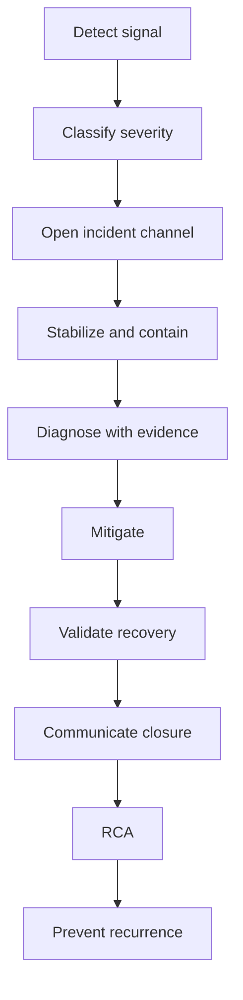

# Part 054 — Incident Response in AWS and Azure

> Target pembaca: Senior Java/JAX-RS backend engineer yang perlu ikut triage incident cloud production secara terstruktur, aman, evidence-driven, dan tidak membuat kondisi lebih buruk.

Incident response bukan aktivitas heroik.

Incident response adalah sistem kerja untuk:

```text
detect
classify
contain
mitigate
recover
communicate
learn
prevent recurrence
```

Dalam sistem cloud enterprise, incident sering menyentuh banyak boundary:

```text
application
Kubernetes
cloud networking
identity
secret/config
database
broker
cache
load balancer
DNS
CI/CD
IaC
observability
security
provider regional service health
```

Senior backend engineer tidak harus menjadi platform engineer, tetapi harus mampu membaca gejala, menghubungkan evidence, dan menghindari perubahan sembarangan di production.

---

## 1. Konsep inti

Incident adalah gangguan yang membutuhkan respons terkoordinasi.

Gangguan bisa berupa:

```text
availability degradation
latency spike
data correctness issue
security exposure
deployment failure
partial dependency outage
customer-specific impact
audit/compliance risk
```

Incident cloud tidak selalu berarti provider outage.

Lebih sering, incident terjadi karena interaksi buruk antara:

```text
recent change
cloud control plane
identity permission
network route
DNS record
certificate lifecycle
autoscaling
retry behavior
quota
observability gap
```

---

## 2. Tujuan incident response

Tujuan utama saat incident bukan langsung mencari root cause sempurna.

Urutannya:

```text
1. protect customer impact
2. stop blast radius growth
3. restore service safely
4. preserve evidence
5. understand root cause
6. prevent recurrence
```

Anti-pattern:

```text
edit production manually without evidence
restart everything
increase all timeouts
disable security control
open public endpoint temporarily
ignore audit trail
run destructive Terraform apply
```

---

## 3. Severity model

Severity harus ditentukan dari customer/business impact, bukan dari seberapa menarik teknisnya.

Contoh model:

```text
SEV1:
  major production outage, broad customer impact, quote/order flow unavailable,
  data integrity/security risk, no workaround.

SEV2:
  significant degradation, partial customer impact, workaround limited,
  important integration or region affected.

SEV3:
  limited impact, single tenant/customer/environment, workaround available.

SEV4:
  minor issue, warning, non-prod, no immediate customer impact.
```

Untuk Quote & Order style system, impact harus dilihat dari business flow:

```text
can users create quote?
can quote be priced?
can approval workflow continue?
can order be submitted?
can downstream provisioning/billing receive events?
can customer documents be uploaded/downloaded?
```

---

## 4. Incident roles

Minimal roles:

```text
incident commander
  coordinates response, owns timeline and decisions

technical lead
  drives diagnosis and mitigation

communications lead
  updates stakeholders/customer-facing channel

scribe
  records timeline, evidence, decisions

subject matter experts
  backend, platform, SRE, security, database, network, cloud provider
```

Dalam tim kecil, satu orang bisa memegang lebih dari satu role, tetapi role tetap harus eksplisit.

---

## 5. Incident lifecycle



Jangan melompat dari detect langsung ke random fix.

---

## 6. First 10 minutes mental model

Dalam 10 menit pertama, cari jawaban:

```text
What is broken?
Who is impacted?
When did it start?
What changed recently?
Which layer is failing?
Is impact growing?
Is there a safe rollback?
Do we need escalation?
```

Evidence awal:

```text
error rate
latency
traffic volume
recent deployment
cloud activity log
Kubernetes events
ingress/load balancer logs
DNS resolution
dependency health
provider health status
```

---

## 7. Change correlation

Pertanyaan paling penting:

```text
What changed?
```

Jenis change:

```text
application release
Helm values change
GitOps sync
Terraform apply
IAM/RBAC update
route table update
DNS change
certificate rotation
secret rotation
config change
node pool upgrade
EKS/AKS add-on upgrade
database maintenance
broker upgrade
cloud provider maintenance
```

Tidak semua incident disebabkan oleh change, tetapi change correlation mempersempit search space.

---

## 8. AWS incident evidence sources

Untuk AWS, evidence umum:

```text
CloudWatch metrics
CloudWatch logs
Container Insights
ALB/NLB metrics and access logs
Target group health
Route 53 resolver/query logs if available
VPC Flow Logs
CloudTrail
AWS Config if enabled
EKS events and controller logs
RDS/MSK/ElastiCache metrics
AWS Health Dashboard / AWS Health API
Service Quotas dashboard
```

Gunakan evidence sesuai layer.

Jika symptom 503 dari ALB, jangan mulai dari database tuning. Mulai dari target health, ingress, pod readiness, service endpoints, dan recent deploy.

---

## 9. Azure incident evidence sources

Untuk Azure, evidence umum:

```text
Azure Monitor metrics
Log Analytics workspace
Container Insights
Application Gateway / Load Balancer diagnostics
Application Insights if used
Azure Activity Log
Azure Resource Health
Azure Service Health
Network Watcher
NSG flow logs if enabled
AKS events and controller logs
Azure PostgreSQL metrics
Event Hubs / Redis metrics
Key Vault diagnostics
Quota/subscription usage
```

Azure incidents sering membutuhkan korelasi antara Activity Log, Resource Health, AKS events, dan application telemetry.

---

## 10. Provider outage vs internal incident

Jangan langsung menyalahkan AWS/Azure.

Gunakan rule:

```text
provider outage suspected only after local evidence is checked
```

Local checks:

```text
recent change?
single service or broad services?
single region/AZ or multiple?
single customer/tenant or global?
cloud status page shows issue?
resource health indicates degraded?
other teams affected?
```

Provider outage mitigation biasanya terbatas pada:

```text
failover
traffic shift
degradation mode
disable noncritical dependency
communicate impact
wait for provider recovery
preserve evidence
```

---

## 11. Region/AZ issue

Region/AZ issue bisa tampak seperti:

```text
node provisioning fails
pods concentrated in bad zone
load balancer targets unhealthy in one AZ
database failover occurs
cross-zone latency spikes
storage attach fails
private endpoint unreachable from one subnet
```

Debugging:

```text
break down metrics by zone
check target health by zone
check node readiness by zone
check volume attach errors
check subnet route/NSG/SG per zone
check provider health
```

Mitigation:

```text
shift traffic away from bad zone
cordon/drain affected nodes if safe
scale in healthy zones
failover managed database if required
avoid forcing all traffic through one AZ
```

---

## 12. IAM/RBAC incident

Identity incident symptoms:

```text
AccessDenied
Unauthorized
AuthorizationFailed
Forbidden
STS AssumeRole failure
ManagedIdentityCredential unavailable
DefaultAzureCredential selects wrong credential
token audience mismatch
role assignment missing
```

Common causes:

```text
trust policy changed
role assignment removed
service account annotation changed
federated credential mismatch
namespace/service account renamed
CI/CD principal rotated
conditional access/policy impact
permission boundary/SCP/management policy denies action
```

Safe debugging:

```text
identify runtime principal
check exact action/resource denied
check audit log
check recent IAM/RBAC change
compare working vs failing environment
avoid adding wildcard permission
restore previous least-privilege policy if known
```

---

## 13. Secret incident

Secret incident symptoms:

```text
application startup fails
database login fails
broker auth fails
cloud SDK credential fails
pods crashloop after secret rotation
some pods work, some fail
```

Common causes:

```text
secret rotated but app cache stale
new secret version not synced to Kubernetes
Key Vault/Secrets Manager permission changed
CSI driver mount failure
external secret controller lag
wrong environment secret
secret format changed
```

Mitigation:

```text
pause rollout
identify affected secret version
validate access from workload identity
restart only affected pods if reload unsupported
rollback secret version if safe
confirm no secret leaked in logs
```

---

## 14. Certificate incident

Certificate incident symptoms:

```text
TLS handshake failure
certificate expired
unknown CA
hostname mismatch
mTLS client cert rejected
Java PKIX path building failed
```

Common causes:

```text
public cert expired
internal CA not in JVM truststore
certificate chain incomplete
SNI mismatch
ingress/gateway secret stale
client certificate rotated without server trust update
proxy performs TLS inspection
```

Safe debugging:

```text
inspect certificate chain
check expiry
check SNI/hostname
check Java truststore
check ingress/gateway secret
compare pod vs local resolution
check internal CA distribution
```

Do not bypass TLS verification in application code.

---

## 15. DNS incident

DNS incident symptoms:

```text
service name resolves wrong IP
private endpoint resolves public IP
NXDOMAIN
intermittent resolution
one namespace works, another fails
on-prem resolves differently than pod
```

Common causes:

```text
private hosted zone not associated
Private DNS Zone not linked
CoreDNS issue
split-horizon mismatch
TTL delay after change
DNS forwarding broken
wrong search domain
stale cache
```

Debugging:

```text
resolve from pod
resolve from node
resolve from on-prem client
check authoritative zone
check private zone association/link
check CoreDNS logs
check resolver forwarding
check TTL
```

---

## 16. Load balancer incident

Load balancer symptoms:

```text
502
503
504
target unhealthy
backend pool empty
health probe failed
TLS termination error
source IP issue
```

Common causes:

```text
wrong health check path
readiness changed
security group/NSG blocks probe
pod labels changed
service selector wrong
ingress annotation changed
backend timeout too short
certificate issue
node/pod not reachable
```

Debug order:

```text
client error code
LB listener/rule
target/backend health
health check/probe status
ingress/controller logs
Kubernetes Service endpoints
pod readiness
application logs
network policy/SG/NSG
```

---

## 17. Private endpoint incident

Private endpoint symptoms:

```text
connection timeout
private IP unreachable
DNS resolves public endpoint
TLS hostname mismatch
works from one subnet but not another
on-prem cannot reach endpoint
```

Common causes:

```text
DNS record missing
zone not linked
route table missing
SG/NSG blocks traffic
firewall missing allow rule
endpoint connection pending/rejected
private endpoint in wrong subnet
hybrid DNS forwarding missing
```

Safe debugging:

```text
resolve name
check destination IP
trace route path where possible
check endpoint connection state
check route table
check firewall/SG/NSG logs
check provider-side private endpoint diagnostics
```

---

## 18. Managed database incident

Database incident symptoms:

```text
connection timeout
too many connections
slow queries
storage full
failover event
replica lag
certificate/auth failure
```

Common causes:

```text
connection pool too large
deployment caused connection storm
database maintenance/failover
security rule changed
DNS endpoint changed
parameter change
storage/IOPS cap hit
query plan regression
```

Mitigation:

```text
reduce traffic if needed
cap application concurrency
restart only if connection leak proven
scale database only with owner approval
use read replica carefully
avoid schema changes during incident unless root cause is known
```

---

## 19. Managed broker incident

Kafka/RabbitMQ incident symptoms:

```text
producer timeout
consumer lag
message publish failure
queue growth
broker unavailable
rebalance storm
partition unavailable
```

Common causes:

```text
broker maintenance
network/security rule change
auth/cert rotation
retention/disk pressure
partition hot spot
consumer deployment bug
producer retry storm
throughput quota
```

Response:

```text
protect broker from retry storm
pause noncritical producers
scale consumers if safe
check lag by topic/queue
check broker metrics
validate auth/cert
avoid deleting messages without business approval
```

---

## 20. Redis incident

Redis incident symptoms:

```text
cache timeout
high latency
eviction spike
memory pressure
failover
connection refused
hot key
```

Common causes:

```text
traffic spike
bad cache key cardinality
large values
connection leak
failover event
AUTH/ACL rotation
network path issue
```

Mitigation:

```text
protect database from cache miss storm
reduce cache timeout
use fallback where safe
limit retry
check hot keys
scale/shard only with ownership approval
```

---

## 21. Kubernetes incident

Kubernetes incident symptoms:

```text
pods Pending
CrashLoopBackOff
ImagePullBackOff
readiness failed
node NotReady
HPA not scaling
PVC pending
```

Common causes:

```text
image registry unreachable
secret missing
config broken
node pressure
subnet IP exhaustion
quota exceeded
CSI issue
CNI issue
bad deployment
PDB blocks rollout
```

Debugging:

```text
kubectl get events
kubectl describe pod
controller logs
node condition
CNI/CSI logs
image pull secret
service endpoints
recent GitOps sync
cloud activity logs
```

---

## 22. Rollback decision

Rollback is not always safe.

Rollback is safe when:

```text
change is recent and isolated
previous version is known good
schema/data compatibility is preserved
config/secret rollback is possible
traffic can be shifted back
no irreversible external operation occurred
```

Rollback is unsafe when:

```text
database migration is irreversible
event schema changed incompatibly
external system already consumed new state
secret rotation invalidated old credential
cloud resource replacement changed endpoint identity
```

Senior engineer must ask: rollback of what?

```text
application version
config
secret
DNS
IAM/RBAC
Terraform resource
Helm values
GitOps commit
node version
database failover
```

---

## 23. Containment patterns

Containment means stopping impact growth.

Patterns:

```text
pause rollout
scale down faulty worker
disable noncritical feature flag
reduce concurrency
increase queue buffering if safe
circuit break failing dependency
shift traffic away from bad region/AZ
block abusive traffic at WAF/gateway
restore previous IAM policy
revert DNS record
```

Containment should be reversible and observable.

---

## 24. Communication discipline

Good incident update includes:

```text
current impact
affected users/regions/environments
current hypothesis
mitigation in progress
next update time
known workaround
risk/unknowns
```

Bad update:

```text
We are checking.
```

Better update:

```text
Quote creation is failing for production traffic routed through region X since 10:12 UTC.
Current evidence shows ALB targets unhealthy after deployment Y.
We paused rollout and are validating rollback to image digest Z.
Next update in 15 minutes or sooner if mitigation completes.
```

---

## 25. Evidence preservation

During incident, preserve:

```text
exact timestamps
deployment versions
Git commit / image digest
Terraform plan/apply output
GitOps sync event
cloud activity logs
CloudTrail / Activity Log event IDs
Kubernetes events
logs around first failure
metrics screenshots/query links
provider health status
commands executed
mitigation decisions
```

RCA without evidence becomes storytelling.

---

## 26. Production-safe debugging rules

Rules:

```text
prefer read-only commands first
avoid destructive kubectl delete without reason
avoid manual cloud console edits unless documented
avoid widening IAM/NSG/security group casually
avoid disabling WAF/audit/logging without security sign-off
avoid restarting all pods blindly
avoid running Terraform apply during uncertain state
write down commands and timestamps
```

If emergency manual change is required, create follow-up IaC/GitOps reconciliation immediately after recovery.

---

## 27. AWS-specific response pattern

For AWS issue, typical sequence:

```text
1. Check customer/application metrics.
2. Check recent deploy/GitOps/IaC change.
3. Check CloudWatch logs and metrics.
4. Check ALB/NLB target health if traffic issue.
5. Check EKS events/controller logs if Kubernetes issue.
6. Check CloudTrail for recent control-plane changes.
7. Check VPC Flow Logs for network deny/path issue.
8. Check IAM AccessDenied details and STS caller identity.
9. Check AWS Health for regional/service event.
10. Mitigate using rollback/traffic shift/circuit breaker/quota path.
```

Common AWS error signals:

```text
AccessDenied
ThrottlingException
RequestLimitExceeded
Target.ResponseCodeMismatch
Target.Timeout
InsufficientFreeAddressesInSubnet
ResourceLimitExceeded
InvalidIdentityToken
```

---

## 28. Azure-specific response pattern

For Azure issue, typical sequence:

```text
1. Check application metrics and logs.
2. Check recent deployment/GitOps/IaC change.
3. Check Azure Monitor / Log Analytics.
4. Check Application Gateway/Load Balancer diagnostics.
5. Check AKS events and node/pod status.
6. Check Azure Activity Log for recent changes.
7. Check Resource Health and Service Health.
8. Check NSG/UDR/private endpoint/DNS path.
9. Check managed identity/RBAC role assignment.
10. Mitigate using rollback/traffic shift/circuit breaker/quota path.
```

Common Azure error signals:

```text
AuthorizationFailed
Forbidden
ManagedIdentityCredential authentication unavailable
DNS resolution to public IP
BackendHealth unhealthy
OperationNotAllowed
TooManyRequests
SubnetIsFull
PrivateEndpointConnectionPending
```

---

## 29. Incident runbook structure

A good runbook contains:

```text
symptom
impact
owner
dashboard links
first checks
safe commands
decision tree
mitigation options
rollback steps
validation steps
escalation path
communication template
post-incident evidence checklist
```

Bad runbook:

```text
Restart the service.
```

Good runbook:

```text
If ALB returns 503 and target group has zero healthy targets:
1. Check last deployment time.
2. Check pod readiness events.
3. Check Service endpoints.
4. Check health check path and security group rules.
5. If caused by latest deployment and previous image is compatible, rollback Helm release.
6. Validate target health and API synthetic check.
```

---

## 30. RCA structure

RCA should answer:

```text
what happened?
who/what was impacted?
when did it start and end?
how was it detected?
what changed?
what was the technical root cause?
why did detection/guardrail not prevent it?
what mitigated it?
what made recovery slower?
what permanent actions will prevent recurrence?
```

Avoid blame language.

Use system language:

```text
The deployment process allowed X without validating Y.
The alert fired only after customer impact because metric Z was missing.
The rollback was delayed because image digest was not recorded in the incident channel.
```

---

## 31. RCA action quality

Weak action:

```text
Be more careful next time.
```

Strong action:

```text
Add CI preflight that verifies private endpoint DNS resolves to RFC1918 address from an AKS debug pod before production rollout.
Owner: platform team.
Due: 2026-07-30.
Validation: failing test blocks deployment.
```

Good actions are:

```text
specific
owned
dated
verifiable
automatable where possible
linked to detected failure mode
```

---

## 32. Incident anti-patterns

Avoid:

```text
restart-driven debugging
console-driven permanent changes
wildcard IAM emergency fix
public endpoint emergency bypass
silent secret rollback
unbounded retry increase
turning off alerts because noisy
changing multiple layers at once
failing to record exact timeline
closing incident without validation
```

Each anti-pattern either destroys evidence, creates security risk, or hides recurrence.

---

## 33. Java/JAX-RS incident readiness

Application should expose enough signal:

```text
health endpoint distinguishes liveness/readiness
dependency health is explicit
error logs include correlation ID
cloud SDK errors are classified
HTTP client timeout is visible
retry count is metered
thread pool saturation is metered
connection pool stats are emitted
build version/image digest is visible
feature flag/config version is visible
```

Without this, incident response becomes guessing.

---

## 34. Internal verification checklist

Verifikasi ke platform/SRE/security/backend team:

- [ ] Apa severity model yang digunakan?
- [ ] Siapa incident commander untuk production incident?
- [ ] Channel apa yang dipakai untuk incident?
- [ ] Apakah ada runbook untuk AWS/Azure networking, DNS, identity, EKS/AKS, database, broker, Redis, secret, certificate?
- [ ] Dashboard utama untuk Quote & Order apa saja?
- [ ] Apakah AWS Health / Azure Service Health dimonitor?
- [ ] Apakah CloudTrail / Azure Activity Log mudah dicari saat incident?
- [ ] Apakah VPC Flow Logs / NSG Flow Logs tersedia?
- [ ] Apakah load balancer access logs aktif?
- [ ] Apakah target/backend health dashboard tersedia?
- [ ] Apakah EKS/AKS events dan controller logs dikirim ke log platform?
- [ ] Apakah rollback aplikasi terdokumentasi?
- [ ] Apakah rollback config/secret terdokumentasi?
- [ ] Apakah Terraform/GitOps manual drift policy jelas?
- [ ] Apakah RCA template tersedia?
- [ ] Apakah post-incident action dilacak sampai selesai?
- [ ] Incident cloud apa yang pernah terjadi dalam 6–12 bulan terakhir?
- [ ] Apa incident paling mahal/berdampak dan pelajarannya?

---

## 35. Senior engineer mental model

Saat incident, senior engineer harus menahan dorongan untuk langsung memperbaiki.

Mulai dari evidence.

```text
Symptom is not root cause.
Error code is not impact.
Rollback is not always safe.
Provider outage is not default assumption.
Manual fix is technical debt unless reconciled.
Recovery without learning is delayed recurrence.
```

Pertanyaan yang harus terus diajukan:

```text
What changed?
What is the blast radius?
What evidence supports the hypothesis?
What mitigation is safest?
How do we know recovery succeeded?
What guardrail failed?
```

---

## 36. Ringkasan

Incident response di AWS/Azure bukan sekadar membaca cloud status page.

Production incident harus dilihat sebagai interaksi antara:

```text
application behavior
Kubernetes state
cloud networking
identity
DNS
secret/config
load balancer
managed services
quota
observability
recent change
operational process
```

Untuk senior Java/JAX-RS backend engineer, kontribusi paling penting adalah:

```text
classify impact clearly
connect evidence across layers
avoid unsafe mitigation
protect correctness and security
make rollback decisions carefully
preserve timeline/evidence
turn incident into stronger guardrail
```

Cloud incident yang baik bukan incident yang tidak pernah terjadi.

Cloud incident yang baik adalah incident yang cepat dideteksi, aman dimitigasi, jelas dikomunikasikan, dan menghasilkan sistem yang lebih sulit rusak dengan cara yang sama.
