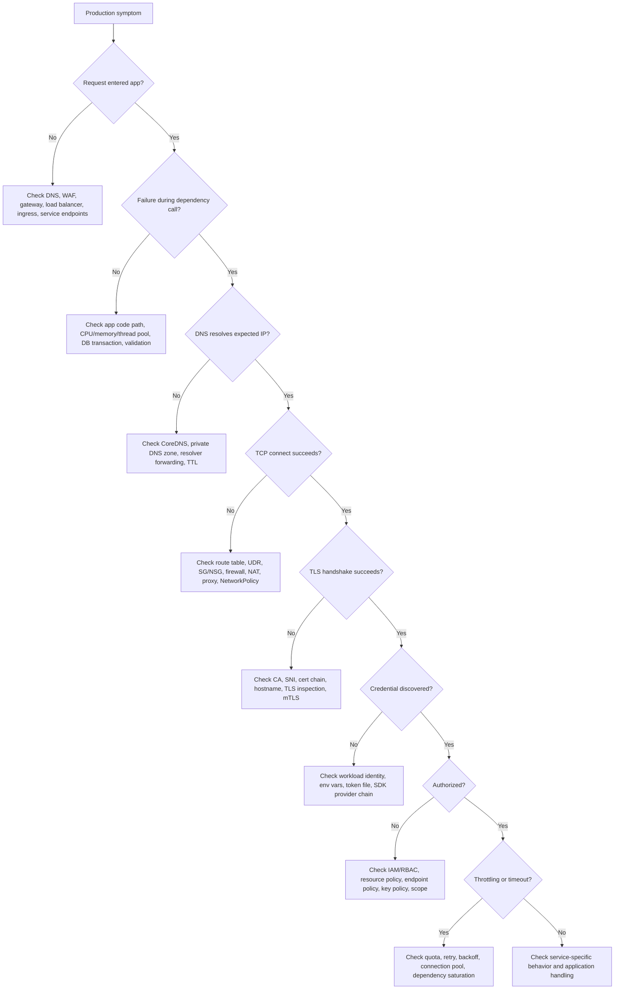

# Part 055 — Troubleshooting Playbook

> Fokus part ini: membangun playbook debugging production-safe untuk aplikasi Java/JAX-RS di EKS/AKS/hybrid yang gagal mengakses AWS/Azure service, private endpoint, object storage, registry, secret/config service, load balancer, atau observability pipeline.

Part ini bukan kumpulan command acak. Ini adalah cara berpikir ketika production symptom terlihat seperti error aplikasi, padahal akar masalahnya bisa berada di identity, DNS, private routing, firewall, SDK timeout, throttling, load balancer health check, registry auth, atau log ingestion.

Dalam sistem enterprise seperti CPQ, quote management, order management, quote-to-cash, telco BSS/OSS, dan catalog-driven architecture, debugging cloud harus memenuhi tiga syarat:

1. **Cepat menemukan boundary failure**: application, pod, node, Kubernetes service, ingress, load balancer, DNS, identity, private endpoint, managed service, cloud control plane, atau on-prem network.
2. **Production-safe**: tidak langsung mengubah SG/NSG, IAM/RBAC, route table, DNS zone, atau secret di production tanpa bukti dan rollback.
3. **Auditable**: setiap observasi, perubahan, mitigasi, dan RCA harus bisa ditelusuri.

---

## 1. Core Mental Model

Troubleshooting cloud backend harus dimulai dari pertanyaan:

```text
Symptom terlihat di mana?
↓
Request gagal sebelum masuk aplikasi, di dalam aplikasi, atau saat aplikasi memanggil dependency?
↓
Failure terjadi pada identity, network, DNS, TLS, protocol, timeout, quota, dependency health, atau code path?
↓
Apakah failure global, regional, environment-specific, namespace-specific, service-specific, pod-specific, node-specific, atau request-specific?
```

Jangan mulai dari asumsi “bug Java”. Banyak incident cloud terlihat seperti stack trace Java, padahal penyebabnya adalah:

- pod tidak punya credential runtime yang benar;
- DNS private endpoint resolve ke public IP;
- route table tidak mengarah ke firewall/NAT/private endpoint;
- security group/NSG menolak traffic;
- load balancer target unhealthy;
- SDK retry policy memperparah overload;
- secret rotation membuat credential lama invalid;
- registry private endpoint/DNS salah sehingga image pull gagal;
- observability pipeline drop log sehingga tim salah membaca kondisi.

---

## 2. Production-Safe Debugging Rules

### 2.1 Jangan langsung mengubah konfigurasi cloud

Hindari tindakan cepat seperti:

- membuka `0.0.0.0/0` di security group/NSG;
- men-disable WAF rule tanpa evidence;
- mengganti route table production;
- mengubah private DNS zone;
- mengganti IAM/RBAC role assignment;
- melakukan restart massal pod;
- scaling dependency tanpa tahu bottleneck;
- rotate secret saat root cause belum jelas;
- menghapus finalizer, service, ingress, atau endpoint secara manual.

Tindakan di atas bisa mengubah symptom, menghapus evidence, memperbesar blast radius, atau membuat RCA tidak dapat dipercaya.

### 2.2 Gunakan urutan observasi → isolasi → mitigasi → perbaikan permanen

```text
Observe
  Kumpulkan symptom, waktu mulai, scope, error message, metric, log, trace.

Isolate
  Tentukan layer failure: application, identity, DNS, network, TLS, service quota, dependency.

Mitigate
  Pulihkan dampak customer dengan perubahan paling kecil dan reversible.

Correct
  Perbaiki root cause melalui PR/IaC/GitOps/runbook yang bisa direview.

Evidence
  Simpan log, query, dashboard screenshot jika diperbolehkan internal, timeline, keputusan, dan perubahan.
```

### 2.3 Debug dari dalam path runtime yang sama

Debugging dari laptop engineer sering menyesatkan. Untuk workload Kubernetes, validasi dari:

- pod aplikasi yang terdampak;
- debug pod di namespace yang sama;
- node yang sama bila ada dugaan node-level issue;
- VNet/VPC yang sama;
- ServiceAccount yang sama atau minimal role yang sama;
- network path yang sama: private endpoint, firewall, NAT, proxy, DNS resolver.

Jika call dari laptop berhasil tetapi pod gagal, masalah kemungkinan ada pada workload identity, DNS internal, egress, NetworkPolicy, proxy, service mesh, atau private routing.

---

## 3. Universal Triage Frame

Gunakan frame ini untuk hampir semua incident cloud:

```text
1. What changed?
   Deploy aplikasi, Helm values, Terraform, route, DNS, cert, secret, IAM/RBAC, node upgrade, cloud service maintenance?

2. What is the blast radius?
   Semua customer, satu tenant, satu region, satu namespace, satu service, satu endpoint, satu node pool?

3. What layer is failing?
   DNS, TCP connect, TLS handshake, HTTP status, authN, authZ, service quota, SDK timeout, app exception?

4. Is the dependency reachable?
   Resolve DNS, connect TCP, validate TLS, authenticate, authorize, execute minimal read/list/head call.

5. Is retry helping or hurting?
   Retry storm sering mengubah partial outage menjadi full outage.

6. What evidence exists?
   App logs, platform logs, load balancer logs, CloudTrail/Activity Log, metrics, traces, Kubernetes events.
```

---

## 4. Fast Symptom-to-Layer Mapping

| Symptom | Likely Layer | First Checks |
|---|---|---|
| `UnknownHostException` | DNS | CoreDNS, private DNS zone, resolver forwarding, search domain, endpoint record |
| `Connection timed out` | Routing/firewall/egress | Route table/UDR, SG/NSG, firewall, NAT, proxy, private endpoint |
| `Connection refused` | Target listener/service | Target port, service endpoint, pod readiness, database/broker listener |
| `SSLHandshakeException` | TLS/cert/trust | CA bundle, SNI, cert chain, hostname, TLS inspection |
| AWS `AccessDenied` | IAM/resource policy | Role identity, trust policy, permission policy, condition, resource policy |
| Azure `AuthorizationFailed` | RBAC/scope | Principal, role assignment, scope, propagation delay, managed identity |
| `ExpiredToken` | Credential lifecycle | SDK credential provider, token projection, clock skew, STS/AAD token refresh |
| HTTP 401 | Authentication | JWT, token audience, issuer, APIM/API Gateway auth policy |
| HTTP 403 | Authorization/policy/WAF | IAM/RBAC, API policy, WAF, bucket/container policy, ACL |
| HTTP 429 | Quota/throttling | SDK retry, quota, API rate, service limits, noisy neighbor |
| HTTP 502 | Gateway/upstream protocol | Ingress, LB target, TLS mismatch, upstream reset |
| HTTP 503 | Capacity/unhealthy target | Readiness, autoscaling, dependency saturation, target group health |
| HTTP 504 | Timeout chain | LB timeout, ingress timeout, app timeout, dependency timeout |
| `ImagePullBackOff` | Registry/DNS/auth/network | ECR/ACR auth, private endpoint DNS, node role, pull secret |
| Missing logs | Observability pipeline | Agent, log driver, workspace/log group, IAM/RBAC, retention, sampling |

---

## 5. Playbook: Pod Cannot Call AWS/Azure Service

### 5.1 Typical examples

- Java service cannot call S3/Blob Storage.
- Service cannot retrieve secret from Secrets Manager/Key Vault.
- Pod cannot call RDS/PostgreSQL, MSK, RabbitMQ, Redis, or API Gateway/APIM private endpoint.
- SDK call hangs until timeout.

### 5.2 First split: name resolution, connection, TLS, auth, authorization, or API behavior

From the pod or same namespace debug pod:

```bash
# DNS
nslookup <service-hostname>
dig <service-hostname>

# TCP reachability
nc -vz <host> <port>

# HTTPS basic check
curl -vk https://<host>/

# Route and network view if tools exist
ip route
cat /etc/resolv.conf
env | grep -E 'HTTP_PROXY|HTTPS_PROXY|NO_PROXY|AWS_|AZURE_'
```

Interpretation:

- DNS fails → check CoreDNS, private hosted zone/private DNS zone, resolver forwarding, private endpoint record.
- DNS resolves public IP but expected private → check private DNS zone association/link and endpoint DNS configuration.
- TCP timeout → check route table/UDR, firewall, SG/NSG, NetworkPolicy, NAT/proxy, private endpoint network path.
- TLS fails → check certificate chain, SNI, custom CA, proxy TLS inspection, hostname mismatch.
- Auth fails → check credential provider chain/workload identity.
- Authorization fails → check IAM/RBAC/resource policy/scope.
- API call succeeds but slow → check SDK timeout/retry, service throttling, quota, dependency saturation.

### 5.3 AWS-specific checks

For AWS SDK calls from EKS:

```bash
# Check pod identity hints
env | grep -E 'AWS_ROLE_ARN|AWS_WEB_IDENTITY_TOKEN_FILE|AWS_REGION|AWS_DEFAULT_REGION'
ls -l $AWS_WEB_IDENTITY_TOKEN_FILE 2>/dev/null || true

# If AWS CLI is available in a debug image
aws sts get-caller-identity
aws configure list
```

Check:

- Is the pod using the expected Kubernetes ServiceAccount?
- Does the ServiceAccount have the expected IRSA annotation?
- Does the IAM role trust the EKS OIDC provider and correct subject?
- Does the permission policy allow the exact action and resource?
- Does the resource policy restrict source VPC endpoint, VPC, principal, organization, or encryption key?
- Is the request hitting a private VPC endpoint or public AWS endpoint via NAT?
- Does VPC endpoint policy allow the action?
- Does security group allow traffic to interface endpoint ENI?
- Does private hosted zone or private DNS for the endpoint resolve correctly?

### 5.4 Azure-specific checks

For Azure SDK calls from AKS:

```bash
# Check workload identity hints
env | grep -E 'AZURE_|MSI_|IDENTITY|CLIENT_ID|TENANT_ID|FEDERATED_TOKEN_FILE'
cat /var/run/secrets/azure/tokens/azure-identity-token 2>/dev/null | head -c 20 || true

# If Azure CLI is available in controlled debug image
az account show
az ad signed-in-user show
```

For production AKS, avoid assuming Azure CLI identity equals pod identity. Azure SDK runtime identity may use `DefaultAzureCredential`, managed identity, workload identity token, or environment variables depending on configuration.

Check:

- Is AKS OIDC issuer enabled?
- Is workload identity enabled?
- Does the ServiceAccount have the expected client ID annotation?
- Does federated identity credential match issuer, subject, and audience?
- Does the managed identity/service principal have role assignment at the correct scope?
- Has RBAC propagation completed?
- Does the resource use firewall/private endpoint restrictions?
- Is the relevant Private DNS Zone linked to AKS VNet?
- Does UDR/NSG/firewall allow the path?

---

## 6. Playbook: Credential Not Found

### 6.1 Java symptom examples

AWS SDK:

```text
Unable to load credentials from any of the providers in the chain
SdkClientException: Unable to load credentials
```

Azure SDK:

```text
DefaultAzureCredential failed to retrieve a token from the included credentials
ManagedIdentityCredential authentication unavailable
WorkloadIdentityCredential authentication unavailable
```

### 6.2 Meaning

Credential not found means the SDK could not discover usable authentication material. It is different from `AccessDenied` or `AuthorizationFailed`, where a credential exists but lacks permission.

### 6.3 Debugging path

Check in this order:

1. Is the app running in the expected environment?
2. Is the expected SDK credential provider enabled?
3. Are required env vars present?
4. Is token file mounted?
5. Is ServiceAccount correct?
6. Is workload identity/IRSA configured?
7. Is the SDK version new enough to support the identity mechanism?
8. Is there accidental local-dev credential precedence?
9. Is proxy/firewall blocking metadata or token endpoint?
10. Is clock skew causing token validation failure?

### 6.4 Production correction

Do not fix by adding static access keys or client secrets to Kubernetes Secret unless explicitly approved by security. Preferred correction:

- AWS: IRSA or EKS Pod Identity, depending on platform standard.
- Azure: Microsoft Entra Workload ID or managed identity pattern approved for AKS.
- CI/CD: OIDC federation instead of long-lived cloud keys.

---

## 7. Playbook: Access Denied / Authorization Failed

### 7.1 Distinguish authentication from authorization

```text
Credential not found → authentication discovery problem.
Invalid/expired token → authentication lifecycle problem.
AccessDenied/AuthorizationFailed → authorization or policy problem.
```

### 7.2 AWS AccessDenied checklist

Ask:

- What principal made the call? Confirm with `sts:GetCallerIdentity`.
- What action was called? Example: `s3:GetObject`, `kms:Decrypt`, `secretsmanager:GetSecretValue`.
- What resource ARN was targeted?
- Is there an explicit deny?
- Is there a permissions boundary?
- Is there a Service Control Policy?
- Is there a session policy?
- Is there a resource-based policy?
- Is there a VPC endpoint policy?
- Is there a KMS key policy condition?
- Is the IAM condition dependent on tag, source VPC endpoint, source IP, principal ARN, organization ID, or TLS?

Use CloudTrail to confirm principal, action, resource, source IP, user agent, and error code.

### 7.3 Azure AuthorizationFailed checklist

Ask:

- What principal object ID made the call?
- Is it app registration, service principal, managed identity, user-assigned managed identity, or workload identity?
- What operation failed? Example: `Microsoft.KeyVault/vaults/secrets/read` or storage data-plane operation.
- Is role assigned at correct scope: management group, subscription, resource group, resource?
- Is it management-plane RBAC or data-plane permission?
- Is there Azure Policy deny?
- Is resource firewall/private endpoint blocking even though RBAC allows?
- Has role assignment propagation completed?
- Is tenant/subscription correct?

Use Azure Activity Log for management-plane failures and service-specific diagnostic logs for data-plane failures.

### 7.4 Common pitfall

IAM/RBAC permission can be correct while network path is blocked. Network can be correct while resource policy denies. Treat identity and network as separate gates:

```text
Credential discovered
  → token/session valid
    → network reachable
      → resource policy allows source
        → permission allows action
          → service-specific constraints pass
```

---

## 8. Playbook: Token Expired or Credential Refresh Failure

### 8.1 Symptoms

- `ExpiredToken`
- `InvalidIdentityToken`
- `AADSTS... token expired`
- intermittent failures after pod runs for several hours
- works after pod restart, then fails again

### 8.2 Likely causes

- SDK not refreshing credentials because client was configured incorrectly.
- Token projection not mounted or rotated correctly.
- Old SDK version with incomplete workload identity support.
- Clock skew on node/container.
- STS/AAD token endpoint unreachable due to firewall/proxy.
- App creates clients per request and exhausts resources.
- App caches raw token manually beyond expiry.

### 8.3 Debugging

Check:

- SDK version.
- Credential provider class actually used.
- Token file mount and modification time.
- Node clock sync.
- Proxy variables.
- Error timestamp pattern.
- Whether restart temporarily fixes the issue.
- Whether multiple pods fail at same time, suggesting token service/network dependency.

### 8.4 Correct design

- Let official SDK manage token refresh.
- Avoid manually caching cloud tokens.
- Reuse SDK clients safely.
- Configure bounded timeouts and retries.
- Monitor auth errors separately from service errors.

---

## 9. Playbook: Private Endpoint Unreachable

### 9.1 What private endpoint failure looks like

- DNS resolves public IP instead of private IP.
- TCP timeout to service endpoint.
- Connection reaches endpoint but gets 403 due to resource policy/firewall.
- Works inside cloud VNet/VPC but fails from on-prem.
- Works from one namespace/node pool but not another.

### 9.2 AWS checks

For AWS VPC Endpoint / PrivateLink:

- Is endpoint type correct: gateway endpoint or interface endpoint?
- Is private DNS enabled for supported AWS service endpoint?
- Is route table associated for gateway endpoint?
- Is interface endpoint ENI in reachable subnet?
- Does endpoint security group allow inbound from workload SG/node SG/pod SG?
- Does workload route to endpoint ENI, not public internet?
- Does endpoint policy allow action/resource/principal?
- Does resource policy require specific `aws:SourceVpce`?
- Are VPC DNS attributes enabled?
- Are Route 53 Resolver rules correct for hybrid?

### 9.3 Azure checks

For Azure Private Endpoint / Private Link:

- Is private endpoint approved?
- Is network interface healthy?
- Is Private DNS Zone created with correct zone name?
- Is Private DNS Zone linked to AKS VNet/VNet where workload runs?
- Is custom DNS forwarding to Azure resolver or Private Resolver correct?
- Does NSG/UDR/firewall allow path?
- Does service firewall disable public access or allow private endpoint?
- Does on-prem DNS resolve private endpoint name correctly?
- Does VNet peering allow forwarded traffic if required?

### 9.4 Debugging commands

```bash
nslookup <service-fqdn>
dig <service-fqdn>
nc -vz <service-fqdn> 443
curl -vk https://<service-fqdn>/
```

Compare results from:

- local laptop;
- pod;
- node;
- another namespace;
- another environment;
- on-prem host;
- cloud VM in same subnet.

The comparison often reveals the broken association: DNS zone link, route table, firewall, endpoint policy, or identity.

---

## 10. Playbook: DNS Resolving Wrong IP

### 10.1 Typical wrong DNS patterns

- Private endpoint expected, but FQDN resolves public IP.
- Service resolves to old load balancer after migration.
- Split-horizon DNS gives different answers from pod and on-prem.
- CoreDNS forwards to resolver that cannot resolve private zone.
- Cached DNS record persists after failover.

### 10.2 Kubernetes checks

```bash
cat /etc/resolv.conf
nslookup kubernetes.default.svc.cluster.local
nslookup <service-name>.<namespace>.svc.cluster.local
nslookup <cloud-service-fqdn>
```

Check CoreDNS:

```bash
kubectl -n kube-system get pods -l k8s-app=kube-dns
kubectl -n kube-system logs deploy/coredns
kubectl -n kube-system get configmap coredns -o yaml
```

### 10.3 Cloud DNS checks

AWS:

- Route 53 private hosted zone association.
- Route 53 Resolver inbound/outbound endpoints.
- Resolver forwarding rules.
- VPC DNS support and DNS hostnames.
- Alias/CNAME to load balancer.
- Private DNS setting for VPC endpoint.

Azure:

- Private DNS Zone links.
- Private endpoint DNS zone group.
- Azure DNS Private Resolver.
- Custom DNS server forwarding.
- VNet peering DNS assumptions.
- Private AKS DNS zone behavior.

### 10.4 Debugging rule

Always record:

```text
query name
resolver used
answer IP
TTL
time of query
source network
source pod/node/host
```

Without source context, DNS evidence is incomplete.

---

## 11. Playbook: TLS Handshake Failure

### 11.1 Symptoms

- Java `SSLHandshakeException`
- `PKIX path building failed`
- `certificate_unknown`
- hostname verification failure
- `NET::ERR_CERT_COMMON_NAME_INVALID`
- works with `curl -k` but fails normally

### 11.2 Likely causes

- Missing internal CA in JVM truststore.
- Certificate chain incomplete.
- Hostname/SAN mismatch.
- SNI mismatch through load balancer/gateway.
- TLS termination point changed.
- TLS inspection proxy inserts untrusted certificate.
- Old protocol/cipher mismatch.
- mTLS client certificate expired or wrong.

### 11.3 Debug commands

```bash
openssl s_client -connect <host>:443 -servername <host> -showcerts
curl -v https://<host>/
java -Djavax.net.debug=ssl,handshake ...
```

### 11.4 Java-specific concerns

For Java/JAX-RS services:

- JVM truststore may differ from OS truststore.
- Container base image update may change CA bundle.
- Custom HTTP client may override TLS settings.
- TLS handshake timeout may be hidden as generic SDK timeout.
- mTLS client cert reload may require app reload if not implemented.

### 11.5 Corrective action

- Fix certificate chain and SAN, not hostname verification.
- Add approved internal CA via base image or mounted truststore.
- Ensure ingress/gateway/LB uses correct certificate and SNI routing.
- Monitor certificate expiry.
- Document TLS termination chain.

---

## 12. Playbook: API Throttling and 429

### 12.1 Symptoms

- AWS `ThrottlingException`, `TooManyRequestsException`, `RequestLimitExceeded`.
- Azure HTTP 429 or ARM throttling.
- Latency spikes followed by retry storm.
- Background workers overwhelm storage/config/secret APIs.
- Logs show repeated retry attempts.

### 12.2 Key distinction

```text
Throttling is not always capacity shortage.
It may be API control-plane protection, service quota, per-account limit, per-region limit, per-resource limit, per-principal rate, or hot partition/key behavior.
```

### 12.3 Debugging

Check:

- Is the call control plane or data plane?
- Which API/action is throttled?
- Is one pod or all pods affected?
- Did autoscaling increase caller count?
- Did cache expire globally at same time?
- Is retry policy exponential with jitter?
- Is there a circuit breaker?
- Is pagination implemented correctly?
- Are background jobs synchronized?
- Are metrics available per dependency/action?

### 12.4 Corrective patterns

- Use bounded retries with jitter.
- Add client-side rate limit.
- Cache stable config/secret metadata safely.
- Avoid per-request secret/config retrieval.
- Stagger background refresh.
- Use bulk/list APIs cautiously.
- Request quota increase only after fixing call pattern.

---

## 13. Playbook: SDK Timeout

### 13.1 Timeout taxonomy

Timeout is not one thing:

- DNS lookup timeout;
- TCP connect timeout;
- TLS handshake timeout;
- connection acquisition timeout;
- socket/read timeout;
- API call timeout;
- retry total timeout;
- load balancer idle timeout;
- ingress/proxy timeout;
- database/broker client timeout.

### 13.2 Java SDK concerns

For AWS SDK and Azure SDK:

- Reuse SDK clients; do not create clients per request.
- Configure connection pool size for concurrency.
- Use explicit timeout, not infinite default assumptions.
- Bound retry attempts and total call duration.
- Emit metrics for attempts, latency, throttling, and failures.
- Preserve correlation ID around SDK calls.

### 13.3 Debugging

Ask:

- Which timeout fired?
- How long did request take before failure?
- Did retries happen?
- Did downstream receive the request?
- Did load balancer close idle connection?
- Is there SNAT/NAT/connection exhaustion?
- Is thread pool exhausted?
- Is DNS slow?
- Is TLS handshake slow?

### 13.4 Correct rule

A JAX-RS request timeout must be less than upstream gateway timeout, and each dependency timeout must fit inside the service-level deadline.

```text
Client timeout
  > API gateway timeout
    > ingress/load balancer timeout
      > service request deadline
        > dependency timeout + retry budget
```

If dependency timeout exceeds the request deadline, the system accumulates zombie work.

---

## 14. Playbook: S3/Blob Upload Failure

### 14.1 Symptoms

- upload works for small files but fails for large files;
- heap spike or `OutOfMemoryError`;
- multipart upload incomplete;
- presigned URL/SAS expired;
- 403 on upload/download;
- corrupt or partial object;
- client retries duplicate uploads.

### 14.2 Debugging checklist

- Is upload direct-to-service or direct-to-storage?
- Is request streamed or buffered?
- Is `Content-Length` known?
- Is multipart upload used for large files?
- Are failed multipart uploads cleaned up?
- Is object key deterministic or unique?
- Is idempotency implemented?
- Is metadata stored atomically with domain record?
- Is presigned URL/SAS TTL long enough but not excessive?
- Does bucket/container policy allow the operation?
- Is KMS/Key Vault key permission available?
- Is private endpoint DNS correct?

### 14.3 Java/JAX-RS design rule

Never load large uploads fully into heap. Use streaming, temp file with bounded size, or direct-to-object-storage design. For regulated systems, document where binary content exists at every lifecycle step:

```text
client → gateway/ingress → Java service → temp storage → object storage → metadata DB → downstream consumer
```

---

## 15. Playbook: Secret Retrieval Failure

### 15.1 Symptoms

- startup failure because secret cannot be fetched;
- runtime failure after rotation;
- pod has stale secret;
- `AccessDenied`, `Forbidden`, `KeyVaultForbidden`, `ResourceNotFound`;
- CSI mount fails;
- external secret controller stale or degraded.

### 15.2 Debugging split

```text
Secret missing?
  name/path/version wrong.

Identity denied?
  IAM/RBAC/key vault policy wrong.

Network unreachable?
  private endpoint/DNS/firewall issue.

Rotation mismatch?
  app still uses old secret or connection pool not refreshed.

Mount/controller issue?
  CSI/external secret controller failing.
```

### 15.3 Checks

- Secret path/name/version.
- Workload identity used by pod/controller.
- Secret manager audit log.
- KMS/Key Vault key permission.
- Private endpoint DNS.
- CSI driver logs.
- External secret sync status.
- App reload behavior.
- Connection pool refresh behavior.

### 15.4 Corrective design

- Keep bootstrap secrets minimal.
- Use workload identity for secret manager access.
- Cache secrets with clear TTL when appropriate.
- Design rotation with dual-validity window.
- Monitor secret fetch errors separately.
- Avoid logging secret value, token, SAS, or presigned URL.

---

## 16. Playbook: Config Retrieval Failure

### 16.1 Symptoms

- feature flag missing;
- app starts with wrong environment config;
- sudden behavior change without deploy;
- config reload causes inconsistent behavior across pods;
- config service throttling;
- fallback default unsafe.

### 16.2 Debugging checklist

- Which config source is active?
- Is environment/label correct?
- Which version/revision is loaded?
- Is config cached?
- What is cache TTL?
- Is runtime reload enabled?
- Is rollback possible?
- Was there a config change near incident start?
- Is config treated as secret accidentally?
- Are pods split across old/new config?

### 16.3 Corrective design

- Version config changes.
- Use safe defaults.
- Avoid critical behavior controlled by unreviewed runtime config.
- Emit config version/hash at startup.
- Trace feature flag state in logs safely.
- Require approval for production config that changes customer-visible behavior.

---

## 17. Playbook: Load Balancer 502/503/504

### 17.1 Decode status by layer

| Status | Typical Meaning | First Checks |
|---|---|---|
| 502 | Bad gateway / upstream protocol failure | target reset, TLS mismatch, invalid response, ingress upstream error |
| 503 | No healthy backend / overloaded / unavailable | target health, readiness, service endpoints, capacity |
| 504 | Gateway timeout | timeout chain, slow dependency, thread exhaustion, network stall |

### 17.2 AWS ALB/NLB checks

- Target group health.
- Health check path, port, protocol.
- Security group between LB and target.
- Ingress annotation target type: `ip` vs `instance`.
- Pod readiness vs target health.
- Listener rule routing.
- TLS certificate/SNI.
- ALB access logs.
- Target response time metrics.
- Idle timeout.

AWS load balancer troubleshooting guidance emphasizes checking target health, connectivity, custom domain routing, TLS name mismatch, elevated processing time, and generated HTTP errors.

### 17.3 Azure checks

- Azure Load Balancer health probe.
- Application Gateway backend health.
- Listener/routing rule.
- Backend pool membership.
- NSG/UDR path.
- AGIC reconciliation.
- TLS certificate and probe host header.
- WAF block logs.
- AKS service endpoints.
- Source IP preservation expectations.

### 17.4 Kubernetes checks

```bash
kubectl get ingress -A
kubectl describe ingress <name> -n <namespace>
kubectl get svc -n <namespace>
kubectl get endpointslice -n <namespace>
kubectl get pods -n <namespace> -o wide
kubectl describe pod <pod> -n <namespace>
kubectl logs <pod> -n <namespace>
```

### 17.5 Application checks

- Does readiness endpoint check only local readiness, not all dependencies?
- Is liveness too aggressive?
- Does app return 200 on health path expected by LB?
- Is app listening on correct port/interface?
- Is graceful shutdown configured?
- Are dependency timeouts shorter than LB timeout?

---

## 18. Playbook: Registry Pull Failure

### 18.1 Symptoms

- `ImagePullBackOff`
- `ErrImagePull`
- unauthorized from ECR/ACR
- DNS failure resolving registry
- timeout pulling layers
- works in dev but not prod
- private cluster cannot pull image

### 18.2 AWS ECR checks

- Node role or pod/node credential can pull from ECR.
- ECR repository policy allows pull.
- Image tag/digest exists.
- Region is correct.
- ECR API and DKR VPC endpoints exist if private/no-NAT cluster.
- S3 gateway endpoint exists for image layer downloads if required by architecture.
- Endpoint security group and DNS are correct.
- Pull-through cache or replication is not stale.

### 18.3 Azure ACR checks

- AKS attached to ACR or kubelet identity has `AcrPull`.
- Image tag/digest exists.
- ACR firewall/public access setting.
- Private endpoint and `privatelink.azurecr.io` DNS zone link.
- VNet peering when ACR private endpoint is in different VNet.
- AKS outbound path if public access selected.
- Pull secret if non-native auth is used.

Microsoft AKS troubleshooting guidance for ACR image pull failures explicitly calls out private DNS zone VNet links and network rules when registry public access is restricted.

### 18.4 Production prevention

- Pin immutable digest for release.
- Promote images across environments explicitly.
- Keep rollback images retained.
- Monitor registry availability and pull failures.
- Avoid deleting recent production images via retention policy.

---

## 19. Playbook: CloudWatch/Azure Monitor Missing Logs

### 19.1 Symptoms

- app logs visible in pod but not in CloudWatch/Azure Monitor;
- logs delayed;
- trace exists but logs missing;
- Kubernetes events visible but app logs absent;
- logs disappeared after node upgrade;
- cost controls changed retention/sampling.

### 19.2 AWS checks

- CloudWatch agent/Fluent Bit/Container Insights health.
- IAM permission to put logs/metrics.
- Log group exists.
- Retention policy.
- Namespace/container filter.
- Node disk pressure causing log loss.
- Multiline parsing issue.
- Log volume throttling.
- Region/account mismatch.

### 19.3 Azure checks

- Azure Monitor agent / Container Insights status.
- Data collection rule.
- Log Analytics workspace link.
- Workspace ingestion quota/retention.
- AKS monitoring addon.
- Namespace/container filtering.
- Node disk pressure.
- Diagnostic settings.
- Querying wrong workspace.

### 19.4 Application logging checks

- Is output written to stdout/stderr?
- Is log level changed by runtime config?
- Is structured JSON valid?
- Is correlation ID present?
- Are sensitive values redacted?
- Is high-cardinality field exploding cost?

---

## 20. Debugging with Evidence

A production incident timeline should include:

```text
T0  First customer-visible symptom.
T1  Alert fired.
T2  Initial hypothesis.
T3  Evidence collected.
T4  Layer isolated.
T5  Mitigation applied.
T6  Customer impact reduced.
T7  Root cause confirmed.
T8  Permanent fix PR/IaC/GitOps change.
T9  Monitoring/backstop added.
```

For each hypothesis, capture:

- command/query used;
- source context;
- timestamp;
- observed result;
- interpretation;
- decision made.

This prevents the team from arguing from memory during RCA.

---

## 21. Mermaid: Troubleshooting Decision Flow



---

## 22. PR Review Checklist

Before merging a change that touches cloud integration or production troubleshooting surface, ask:

- Does the app expose enough metrics to isolate DNS/connect/TLS/auth/authorization/timeout?
- Are SDK timeout and retry configured explicitly?
- Is workload identity used instead of static credentials?
- Are dependency errors classified and logged safely?
- Are logs structured with correlation ID?
- Are sensitive values redacted?
- Are load balancer health checks aligned with readiness?
- Is rollback possible without cloud console manual changes?
- Does the change require route, SG/NSG, private DNS, endpoint, IAM/RBAC, or key policy updates?
- Are those changes represented in IaC/GitOps?
- Is there a dashboard or alert for the new dependency?
- Is there a runbook entry for failure modes?

---

## 23. Internal Verification Checklist

Use this checklist with platform/SRE/security/backend team. Do not infer these details.

### Access and tooling

- Which production access model is allowed for debugging?
- Who can run `kubectl exec` or create debug pods?
- Are debug images approved?
- Are packet captures allowed?
- Is cloud console access read-only or break-glass?
- Where are incident logs and command evidence stored?

### Kubernetes runtime

- EKS/AKS cluster names and environments.
- Namespace ownership.
- ServiceAccount per workload.
- Workload identity pattern.
- NetworkPolicy implementation.
- Ingress controller and annotations.
- Service mesh presence if any.
- Approved debug commands.

### Cloud identity

- AWS IAM roles used by pods.
- Azure managed identity/service principal/workload identity used by pods.
- CloudTrail/Activity Log query path.
- Permission boundary/SCP/Azure Policy impacts.
- Role assignment propagation expectations.

### Networking

- VPC/VNet/subnet map.
- Route table/UDR map.
- SG/NSG rule ownership.
- NAT Gateway/Azure NAT Gateway usage.
- Firewall/proxy path.
- Private endpoint inventory.
- DNS resolver and forwarding design.
- On-prem connectivity path.

### Dependency

- PostgreSQL connectivity path.
- Kafka/RabbitMQ connectivity path.
- Redis connectivity path.
- S3/Blob private access path.
- Secrets/config service path.
- ECR/ACR access path.
- API Gateway/APIM path.

### Observability

- Primary dashboard.
- Log query workspace/log group.
- Trace backend.
- Alert rules.
- Retention policy.
- Known blind spots.
- Cost guardrails.

### Incident process

- Severity model.
- Escalation contacts.
- Customer impact template.
- Rollback owner.
- RCA template.
- Post-incident action tracker.

---

## 24. Senior Engineer Takeaways

The senior move is not memorizing every cloud command. The senior move is isolating failure boundary quickly and safely:

```text
DNS → routing → firewall → TLS → credential → authorization → service quota → dependency health → application behavior
```

For Java/JAX-RS systems in EKS/AKS, most cloud integration incidents become understandable once you force the system into these layers:

- Which identity is the pod actually using?
- Which IP does the pod actually resolve?
- Which path does the packet actually take?
- Which policy actually denies or allows?
- Which timeout actually fires?
- Which retry actually amplifies load?
- Which telemetry actually proves the hypothesis?

A good troubleshooting playbook does not make production debugging risk-free. It makes it disciplined, reversible, and evidence-driven.

---

## 25. References

- AWS Elastic Load Balancing — Troubleshoot your Application Load Balancers: https://docs.aws.amazon.com/elasticloadbalancing/latest/application/load-balancer-troubleshooting.html
- AWS CloudFront — HTTP 502 Bad Gateway: https://docs.aws.amazon.com/AmazonCloudFront/latest/DeveloperGuide/http-502-bad-gateway.html
- AWS CloudFront — HTTP 503 Service Unavailable: https://docs.aws.amazon.com/AmazonCloudFront/latest/DeveloperGuide/http-503-service-unavailable.html
- AWS IAM — Security best practices: https://docs.aws.amazon.com/IAM/latest/UserGuide/best-practices.html
- Microsoft Learn — Basic troubleshooting of outbound connections from an AKS cluster: https://learn.microsoft.com/en-us/troubleshoot/azure/azure-kubernetes/connectivity/basic-troubleshooting-outbound-connections
- Microsoft Learn — Troubleshoot AKS image pull errors from Azure Container Registry: https://learn.microsoft.com/en-us/troubleshoot/azure/azure-kubernetes/connectivity/cannot-pull-image-from-acr-to-aks-cluster
- Microsoft Learn — 429 Too Many Requests errors on AKS: https://learn.microsoft.com/en-us/troubleshoot/azure/azure-kubernetes/create-upgrade-delete/429-too-many-requests-errors
- Microsoft Learn — Monitor Azure Kubernetes Service: https://learn.microsoft.com/en-us/azure/aks/monitor-aks
