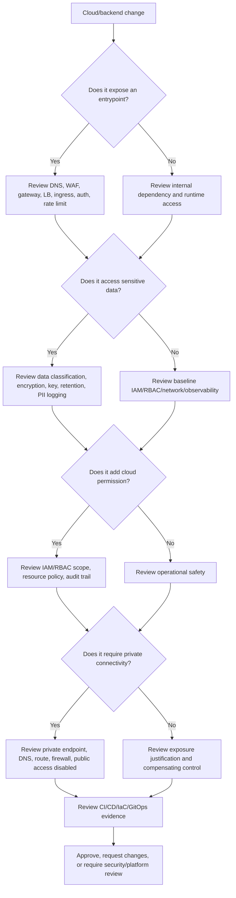

# Part 056 — Security, Privacy, and Compliance Review

> Fokus part ini: cara melakukan review security, privacy, dan compliance untuk aplikasi Java/JAX-RS enterprise yang berjalan di AWS/Azure, EKS/AKS, on-prem, atau hybrid. Targetnya bukan menjadi security auditor penuh, tetapi mampu mereview perubahan cloud/backend dengan disiplin senior engineer.

Dalam sistem CPQ, quote management, order management, quote-to-cash, telco BSS/OSS, dan enterprise integration, security review tidak boleh berhenti pada “service tidak public”. Review harus menjawab:

- siapa bisa mengakses apa;
- dari jaringan mana akses boleh terjadi;
- data apa yang disimpan/dikirim/dilog;
- key dan secret dikelola bagaimana;
- perubahan bisa diaudit atau tidak;
- bukti compliance tersedia atau tidak;
- failure mode security bisa dideteksi atau tidak.

Security, privacy, dan compliance bukan tiga pekerjaan terpisah. Dalam cloud production system, ketiganya bertemu di resource policy, IAM/RBAC, private networking, encryption, logging, data retention, object storage, key management, dan incident evidence.

---

## 1. Core Mental Model

Security review harus melihat sistem dari beberapa boundary:

```text
Identity boundary
  siapa principal-nya, role-nya, scope-nya, temporary credential-nya.

Network boundary
  dari subnet/VPC/VNet mana traffic boleh masuk/keluar.

Data boundary
  data apa yang diproses, disimpan, direplikasi, dan dilog.

Cryptographic boundary
  key/certificate mana yang melindungi data dan siapa bisa decrypt.

Operational boundary
  siapa bisa deploy, rollback, debug, view logs, rotate secret, change policy.

Audit boundary
  apakah perubahan dan akses bisa dibuktikan setelah kejadian.
```

Review yang hanya melihat satu boundary akan melewatkan risiko lintas layer. Contoh:

- IAM least privilege benar, tetapi bucket/container public.
- Private endpoint benar, tetapi DNS salah sehingga traffic keluar public.
- Secret manager aman, tetapi value tercetak di log.
- Encryption aktif, tetapi key policy terlalu luas.
- WAF aktif, tetapi backend ALB/Application Gateway bisa diakses langsung.
- Log lengkap, tetapi PII tidak direduksi.
- RBAC benar, tetapi CI/CD memiliki long-lived admin credential.

---

## 2. Review Scope

Security/privacy/compliance review minimum harus mencakup:

1. **IAM/RBAC review**
2. **Network exposure review**
3. **Public IP and internet path review**
4. **Private endpoint and private DNS review**
5. **Secret lifecycle review**
6. **Encryption and key management review**
7. **Audit log and change traceability review**
8. **Data retention review**
9. **PII in logs review**
10. **Object storage policy review**
11. **Kubernetes/EKS/AKS runtime security review**
12. **CI/CD and IaC permission review**
13. **Compliance evidence review**

---

## 3. IAM/RBAC Review

### 3.1 What to review

For every application workload, identify:

```text
workload → runtime identity → permission policy/role assignment → target resource → allowed actions → conditions/scope → audit source
```

### 3.2 AWS IAM review

Check:

- Workload uses IAM role, not long-lived access key.
- EKS workload uses approved IRSA/EKS Pod Identity pattern.
- Trust policy restricts correct OIDC provider, namespace, and ServiceAccount.
- Permission policy grants only required actions.
- Resource ARN is specific where possible.
- Conditions restrict source VPC endpoint, principal, encryption context, tags, or org where relevant.
- No wildcard `Action: *` or `Resource: *` without documented reason.
- No static AWS keys stored in Kubernetes Secret, environment variable, CI variable, or application config.
- KMS key policy does not bypass least privilege.
- CloudTrail captures access and denial evidence.

### 3.3 Azure RBAC review

Check:

- Workload uses managed identity or Microsoft Entra Workload ID where possible.
- Service principal client secrets are avoided or tightly governed.
- Role assignment is at the narrowest practical scope.
- Data-plane roles are distinguished from management-plane roles.
- AKS kubelet identity, cluster identity, and workload identity are not confused.
- Federated credential matches issuer, subject, and audience.
- Privileged roles are time-bound where PIM is used.
- Azure Activity Log and service diagnostic logs can prove access/change.

### 3.4 Java/JAX-RS impact

Application code must not assume credentials are static. Java services should:

- use SDK credential provider chain intentionally;
- expose safe diagnostics for current credential source without printing tokens;
- handle authorization failure separately from network failure;
- avoid fallback to local developer credential in production image;
- avoid embedding cloud secret in config files;
- classify auth errors in metrics.

### 3.5 IAM/RBAC failure modes

- Wrong ServiceAccount annotation.
- Role trust policy too broad.
- Role assignment at subscription/account level instead of resource group/resource.
- Explicit deny through SCP/Azure Policy.
- Resource policy denies even though IAM/RBAC allows.
- Token audience mismatch.
- Role assignment propagation delay.
- CI/CD role can mutate production without approval.

---

## 4. Network Exposure Review

### 4.1 What to review

For every externally reachable component:

```text
DNS name → edge/CDN/front door → WAF → API gateway/APIM → load balancer → ingress → service → pod
```

For every internal dependency:

```text
pod/service → DNS → route → firewall/SG/NSG → private endpoint/service endpoint → managed service
```

### 4.2 AWS checks

- Which resources have public IP?
- Which ALB/NLB are internet-facing?
- Are security groups scoped to expected source SG/CIDR?
- Are NACLs aligned with route path?
- Are private subnets actually private?
- Does traffic to S3/Secrets/KMS/etc. use VPC endpoint where required?
- Are VPC endpoint policies restrictive?
- Are Route 53 private hosted zones associated only with intended VPCs?
- Is direct ALB access restricted if CloudFront/API Gateway/WAF is expected entry?
- Are VPC Flow Logs enabled for sensitive network paths?

### 4.3 Azure checks

- Which resources have public IP?
- Is AKS API server private or public?
- Are Application Gateway/Azure Load Balancer frontends public or private?
- Are NSG rules minimal?
- Do UDRs force required firewall inspection?
- Are Private Endpoints used for storage, registry, Key Vault, database, or other sensitive services?
- Are Private DNS Zones linked to intended VNets only?
- Is public network access disabled where private access is required?
- Are diagnostic logs enabled for network/security components?

### 4.4 Network exposure failure modes

- Private endpoint exists but public access still allowed.
- Public load balancer exposes internal-only API.
- Public DNS record points to private-only or deprecated entrypoint.
- SG/NSG allows broad CIDR due to temporary incident fix.
- WAF protects edge but backend is reachable directly.
- On-prem route bypasses expected firewall inspection.
- Private DNS zone linked to wrong VNet/VPC.

---

## 5. Public IP Review

A public IP is not automatically a vulnerability, but it is always a review item.

### 5.1 Required questions

- Why does this resource need public reachability?
- Is it customer-facing, partner-facing, corporate-only, or admin-only?
- Is it protected by WAF/API gateway/APIM?
- Is authentication required before reaching sensitive operation?
- Is rate limiting configured?
- Is source allowlist needed?
- Is TLS policy current?
- Are access logs enabled?
- Is direct backend access blocked?
- Is ownership documented?

### 5.2 Red flags

- Public IP on database, cache, broker, secret service, registry, or admin UI.
- `0.0.0.0/0` ingress for management port.
- Temporary public exposure not tracked.
- Public endpoint active even though private endpoint is deployed.
- Public object storage access without explicit approved use case.

---

## 6. Private Endpoint Review

### 6.1 What good looks like

A secure private endpoint design requires all of these, not just endpoint creation:

```text
private endpoint exists
  + DNS resolves to private IP from workload network
  + route reaches endpoint
  + firewall/SG/NSG allows only intended source
  + resource policy/firewall denies unwanted public access
  + logs prove access path
  + ownership/runbook exists
```

### 6.2 AWS review

- Is it Gateway Endpoint or Interface Endpoint?
- Is private DNS enabled where applicable?
- Is route table associated for Gateway Endpoint?
- Is endpoint security group scoped?
- Is endpoint policy restrictive?
- Does resource policy require `aws:SourceVpce` where appropriate?
- Are VPC Flow Logs and service logs available?

### 6.3 Azure review

- Is Private Endpoint approved?
- Is Private DNS Zone linked correctly?
- Is public network access disabled or restricted where required?
- Does NSG/UDR/firewall allow only intended traffic?
- Does service diagnostic log show private access?
- Is on-prem DNS forwarding configured if hybrid access is required?

### 6.4 Privacy/compliance angle

Private endpoint helps reduce public exposure, but it is not a data classification control by itself. You still need:

- identity authorization;
- object/resource policy;
- encryption;
- audit log;
- retention policy;
- data minimization;
- access review.

---

## 7. Secret Review

### 7.1 What to review

- Secret source: AWS Secrets Manager, SSM SecureString, Azure Key Vault, Kubernetes Secret, external secret, CSI mount.
- Secret owner.
- Secret consumer.
- Runtime identity allowed to read.
- Rotation policy.
- Cache/reload behavior.
- Audit log.
- Leakage prevention.
- Emergency revocation process.

### 7.2 Red flags

- Secret committed to Git.
- Secret in Helm values without encryption.
- Secret in Terraform state.
- Secret printed in logs or exception messages.
- Long-lived cloud access key.
- Shared secret across environments.
- No rotation owner.
- Application requires restart but rotation runbook assumes hot reload.
- Secret mounted into pods that do not need it.

### 7.3 Java/JAX-RS concerns

- Do not log request headers that may contain credentials.
- Do not log presigned URL/SAS token in full.
- Redact Authorization, Cookie, Set-Cookie, X-Api-Key, SAS query params, access tokens, refresh tokens.
- Avoid exposing secret-derived details in health endpoints.
- Ensure exception mapper does not return credential detail to API clients.

---

## 8. Encryption Review

### 8.1 Encryption in transit

Review:

- TLS from client to edge.
- TLS from edge to gateway/load balancer if applicable.
- TLS from ingress to pod if required.
- TLS to database/broker/cache/object storage.
- mTLS for service-to-service if required.
- Certificate source and renewal.
- TLS policy/cipher standard.
- Internal CA trust distribution.

### 8.2 Encryption at rest

Review:

- Object storage encryption.
- Database encryption.
- Disk/PV encryption.
- Secret store encryption.
- Log storage encryption.
- Backup/snapshot encryption.
- Cross-region replica encryption.

### 8.3 AWS key review

- AWS KMS key type: AWS-managed, customer-managed, external/HSM if applicable.
- Key policy.
- Grants.
- Rotation.
- CloudTrail for key usage.
- KMS permission for workload and managed services.
- Encryption context where used.

### 8.4 Azure key review

- Azure Key Vault key or managed HSM if required.
- RBAC/access policy model.
- Key rotation.
- Soft delete and purge protection.
- Diagnostic logs.
- Customer-managed key linkage to storage/database/service.
- Network restrictions on Key Vault.

### 8.5 Failure mode

Encryption controls can become availability dependencies. If key access fails, the application may be unable to read secrets, decrypt data, mount volumes, access storage, or start. Review must include both security and operational recovery.

---

## 9. Key Management Review

### 9.1 Required questions

- Who owns the key?
- Who can administer the key?
- Who can use the key for encrypt/decrypt?
- Is administration separated from usage?
- Is key rotation enabled or scheduled?
- Is old data still decryptable after rotation?
- What happens if key is disabled/deleted?
- Is purge protection enabled where required?
- Is key usage logged?
- Is key access included in DR runbook?

### 9.2 Common mistake

Teams often review whether encryption is enabled but not who can decrypt. Compliance evidence usually requires proving both:

```text
data is encrypted
AND
key access is controlled and auditable
```

---

## 10. Audit Log Review

### 10.1 What audit logs must answer

- Who changed this resource?
- When did it change?
- What was changed?
- From where was the change made?
- Which identity was used?
- Was it automated CI/CD, human console, break-glass, or managed service?
- Was the action allowed or denied?
- Can we prove no unauthorized access occurred?

### 10.2 AWS audit sources

- CloudTrail management events.
- CloudTrail data events for sensitive resources where required.
- AWS Config for resource configuration history.
- S3 server access logs or CloudTrail data events for object access where required.
- VPC Flow Logs for network evidence.
- EKS audit/control plane logs if enabled.
- Load balancer access logs.
- CloudWatch logs/metrics.

AWS CloudTrail guidance emphasizes that log integrity, completeness, availability, centralized storage, strict access controls, and segregation of duties are critical for forensic and audit use cases.

### 10.3 Azure audit sources

- Azure Activity Log.
- Resource diagnostic logs.
- Microsoft Entra sign-in/audit logs where applicable.
- Azure Policy compliance state.
- Log Analytics workspace.
- AKS control plane/resource logs.
- Application Gateway/WAF logs.
- Storage access logs/diagnostic logs.
- Key Vault diagnostic logs.

### 10.4 Audit failure modes

- Logs not enabled before incident.
- Logs retained too briefly.
- Logs stored in same account/subscription that compromised identity can modify.
- No data-plane logs for sensitive access.
- Application logs contain PII but are retained too long.
- Dashboard query uses wrong account/subscription/workspace.

---

## 11. Data Retention Review

### 11.1 Retention surfaces

Review retention for:

- application database records;
- object storage documents/files/exports;
- logs;
- traces;
- metrics;
- audit logs;
- backups;
- snapshots;
- broker messages;
- dead-letter queues;
- cache data;
- temporary files;
- CI/CD artifacts.

### 11.2 Required questions

- What data class is this?
- How long must it be retained?
- When must it be deleted or archived?
- Who can access archived data?
- Is retention enforced by lifecycle policy or manual process?
- Does backup retention exceed application retention policy?
- Do logs contain fields that should not be retained?
- Is deletion propagated to replicas/backups where required by policy?

### 11.3 Enterprise pitfall

Deletion from the primary application table does not automatically delete:

- object storage copies;
- exports;
- logs;
- traces;
- messages;
- backups;
- downstream replicas;
- analytics datasets;
- debug dumps.

For compliance-sensitive systems, data lifecycle must be end-to-end.

---

## 12. PII in Logs Review

### 12.1 Why this matters

Logs are often broader-access than primary databases. They may be copied to observability tools, retained longer, exported to SIEM, indexed, searched, and viewed by operations staff. Logging PII can silently expand the privacy boundary.

### 12.2 Review fields

Check whether logs include:

- customer name;
- email;
- phone number;
- address;
- account ID;
- subscription/customer identifier;
- quote/order payload;
- contract data;
- payment detail;
- authentication token;
- cookie/session ID;
- presigned URL/SAS token;
- secret/config values;
- raw exception containing request body.

### 12.3 Safe logging rule

Log enough to debug, not enough to reconstruct sensitive business data.

Preferred:

```text
correlation_id
request_id
tenant_id hash or approved opaque ID
order_id/quote_id if allowed by internal policy
status
error_class
dependency
latency
retry_count
sanitized cause
```

Avoid:

```text
raw request body
raw response body
Authorization header
Cookie
SAS/presigned URL
secret value
full customer profile
large domain payload dump
```

### 12.4 Java/JAX-RS controls

- Request/response logging filter must redact headers and query params.
- Exception mapper must avoid returning internal stack trace to clients.
- Structured logging encoder should support field-level redaction.
- Correlation ID should be propagated without adding sensitive context.
- Sampling must not bypass redaction.
- Debug log level must not be enabled globally in production without time-bound approval.

---

## 13. Object Storage Policy Review

### 13.1 AWS S3 review

Check:

- S3 Block Public Access at account and bucket level where required.
- Bucket policy principal and conditions.
- ACL usage disabled/controlled where applicable.
- VPC endpoint condition for private-only access if required.
- Server-side encryption and KMS key policy.
- Versioning and lifecycle policy.
- Object lock/legal hold if required.
- Access logs/CloudTrail data events.
- Presigned URL generation policy.
- Cross-account access.
- Replication and destination permissions.

AWS S3 Block Public Access is designed to help manage public access at account, bucket, access point, and object levels, and it can override policies/permissions that would otherwise allow public access.

### 13.2 Azure Blob review

Check:

- Public access disabled unless explicitly required.
- Storage account firewall/private endpoint.
- Azure RBAC/data-plane access.
- Shared Key access policy if relevant.
- SAS issuance policy and TTL.
- Container access level.
- Encryption and customer-managed key if required.
- Lifecycle management.
- Versioning/soft delete.
- Diagnostic logs.
- Immutable storage/legal hold if required.

### 13.3 Presigned URL / SAS review

Ask:

- Who can generate temporary links?
- What operations are allowed: read, write, list, delete?
- What is TTL?
- Is link bound to object path only?
- Is content type/length constrained for upload?
- Is generated link logged? If yes, is token redacted?
- Is revocation possible?
- Does link bypass application authorization after generation?

---

## 14. Kubernetes Runtime Security Review

### 14.1 Workload review

- Runs as non-root where possible.
- Read-only root filesystem where practical.
- Resource requests/limits set.
- No privileged container unless explicitly approved.
- No hostPath unless justified.
- No hostNetwork unless justified.
- ServiceAccount least privilege.
- NetworkPolicy applied where platform supports it.
- Secrets mounted only where needed.
- Image pinned by digest for release.
- Image vulnerability scanning integrated.
- Readiness/liveness do not expose sensitive data.

### 14.2 EKS-specific review

- IRSA/EKS Pod Identity standard.
- Security groups for pods if used.
- EKS control plane logs if required.
- Node IAM role not overly privileged.
- Add-ons maintained.
- Private cluster endpoint decision documented.
- ECR access private path if required.

### 14.3 AKS-specific review

- Workload Identity standard.
- Managed identity scope.
- Azure Policy for AKS if used.
- Defender for Containers if used internally.
- Private cluster decision documented.
- ACR pull permission minimal.
- Key Vault CSI usage controlled.
- Diagnostic logs enabled.

---

## 15. CI/CD and IaC Security Review

### 15.1 CI/CD credentials

Review:

- OIDC federation instead of long-lived cloud keys.
- Separate deploy roles per environment.
- Production deploy requires approval.
- CI role cannot mutate unrelated resources.
- Secrets not printed in pipeline logs.
- Artifacts and images are immutable.
- Rollback process is tested.
- Emergency manual deploy path is documented.

### 15.2 IaC review

Review:

- Terraform state storage access.
- Secret in state risk.
- Remote backend encryption.
- State locking.
- Plan review.
- Destroy protection.
- Drift detection.
- Module ownership.
- Policy-as-code checks.
- Separation between platform and app-owned modules.

### 15.3 Red flags

- Production admin credential in CI variable.
- Same role deploys dev/test/prod.
- Terraform plan not reviewed.
- Manual console changes not reconciled.
- Secrets passed as plain variables.
- IaC module creates public resources by default.

---

## 16. Compliance Evidence Review

Security control is only useful for compliance if it can be proven.

### 16.1 Evidence examples

| Control | Evidence |
|---|---|
| Least privilege | IAM/RBAC policy, role assignment, access review |
| Private access | VPC endpoint/private endpoint config, DNS resolution, firewall rule |
| Encryption at rest | service encryption config, KMS/Key Vault key config |
| Encryption in transit | TLS policy, certificate chain, endpoint config |
| Secret rotation | rotation config, audit log, runbook, last rotation evidence |
| Audit logging | CloudTrail/Activity Log/diagnostic setting, retention config |
| Data retention | lifecycle policy, DB retention job, backup retention |
| PII protection | log redaction tests, field inventory, query samples |
| Change control | PR, approval, Terraform plan, GitOps sync, deployment record |
| Incident response | incident timeline, RCA, post-incident actions |

### 16.2 Evidence quality

Good evidence is:

- current;
- scoped to correct environment;
- reproducible;
- linked to source of truth;
- reviewed by owner;
- retained according to policy;
- understandable without tribal knowledge.

Bad evidence:

- screenshot without timestamp/context;
- stale architecture diagram;
- console state that differs from IaC;
- “platform team said so” without record;
- generic policy not tied to actual resource;
- dashboard without query definition.

---

## 17. Privacy Review for Backend Engineers

### 17.1 Data classification

Before reviewing cloud controls, classify the data handled by the service:

- public;
- internal;
- confidential;
- customer-sensitive;
- regulated;
- personal data/PII;
- credentials/secrets;
- financial/commercial data;
- operational telemetry.

### 17.2 Data flow mapping

For each API or async process:

```text
source → API/gateway → Java/JAX-RS service → DB/object storage/broker/cache → logs/traces/metrics → downstream systems → backup/archive
```

Ask:

- Where does data enter?
- Where is it stored?
- Where is it copied?
- Where is it logged?
- Where does it leave the boundary?
- Is it encrypted?
- Who can access it?
- How long is it retained?
- How is deletion handled?

### 17.3 Common privacy failure modes

- Request payload logged by debug middleware.
- PII included in trace attributes.
- Export files stored without lifecycle policy.
- Presigned URL/SAS token leaked via log or ticket.
- DLQ stores sensitive message indefinitely.
- Support/debug dump contains production customer data.
- Test environment uses production-like data without masking.

---

## 18. Security Review by Change Type

### 18.1 New API endpoint

Review:

- authentication;
- authorization;
- rate limit;
- input validation;
- sensitive response fields;
- log redaction;
- WAF/API gateway policy;
- audit event;
- tenant isolation;
- timeout and dependency controls.

### 18.2 New cloud dependency

Review:

- private connectivity;
- runtime identity;
- permission scope;
- SDK timeout/retry;
- encryption;
- audit log;
- data classification;
- cost and quota;
- runbook;
- DR behavior.

### 18.3 New object storage usage

Review:

- bucket/container policy;
- public access;
- encryption;
- lifecycle;
- presigned URL/SAS;
- metadata sensitivity;
- event notification;
- malware scanning if required;
- retention/deletion;
- audit.

### 18.4 New secret/config integration

Review:

- secret vs config separation;
- runtime identity;
- access scope;
- rotation;
- reload;
- cache;
- audit;
- fallback behavior;
- leakage prevention.

### 18.5 New Kubernetes deployment

Review:

- namespace;
- ServiceAccount;
- image source;
- digest pinning;
- network policy;
- probes;
- resource limits;
- secret mounts;
- ingress exposure;
- log/trace redaction.

---

## 19. Mermaid: Security Review Flow



---

## 20. PR Review Checklist

Use this checklist before approving PR/ADR that touches cloud, identity, data, or production exposure.

### Identity

- [ ] Runtime identity is explicit.
- [ ] No static cloud keys or client secrets unless formally approved.
- [ ] IAM/RBAC scope is minimal.
- [ ] Resource policy does not bypass least privilege.
- [ ] CI/CD role is environment-scoped.
- [ ] Audit trail exists for access and changes.

### Network

- [ ] Public exposure is justified.
- [ ] Private endpoint is used where required.
- [ ] DNS path is documented.
- [ ] SG/NSG/firewall rules are minimal.
- [ ] Direct backend bypass is blocked.
- [ ] Egress path is controlled.

### Data

- [ ] Data classification is known.
- [ ] Sensitive fields are not logged.
- [ ] Object storage policy is reviewed.
- [ ] Retention/lifecycle policy exists.
- [ ] Backup/archive impact is considered.
- [ ] Cross-region/cross-cloud data movement is reviewed.

### Secrets and keys

- [ ] Secret source is approved.
- [ ] Rotation behavior is understood.
- [ ] Secret reload/cache behavior is safe.
- [ ] Encryption at rest/in transit is verified.
- [ ] Key access is least privilege.
- [ ] Certificate renewal is covered.

### Observability and audit

- [ ] Logs/metrics/traces are sufficient for incident triage.
- [ ] Logs are redacted.
- [ ] Audit log source is known.
- [ ] Retention is appropriate.
- [ ] Alerting covers security-relevant failure modes.

### Compliance evidence

- [ ] Change is represented in IaC/GitOps where applicable.
- [ ] Approval trail exists.
- [ ] Security exception is documented if any.
- [ ] Runbook is updated.
- [ ] Evidence can be retrieved later.

---

## 21. Internal Verification Checklist

Use this checklist with CSG/platform/SRE/security/backend team. Do not infer internal details.

### Governance and ownership

- Who owns security review for cloud changes?
- Which changes require platform/security approval?
- Is there a formal exception process?
- Where are security standards documented?
- Which compliance frameworks apply to this product/customer/environment?

### Identity

- AWS account and role model.
- Azure subscription and RBAC model.
- Entra ID tenant and app registration standard.
- Workload identity standard for EKS/AKS.
- Human access process.
- Break-glass process.
- Access review cadence.

### Networking

- Approved public entrypoints.
- Private endpoint inventory.
- VPC/VNet/subnet classification.
- SG/NSG ownership.
- Firewall/proxy path.
- DNS/private DNS ownership.
- Hybrid/on-prem access path.

### Data

- Data classification policy.
- PII definition used internally.
- Logging redaction standard.
- Data retention policy.
- Backup retention policy.
- Export/archive policy.
- Test data masking policy.

### Secrets and keys

- Secret manager standard.
- Key management standard.
- Rotation cadence.
- Certificate management owner.
- Emergency revocation process.
- KMS/Key Vault audit dashboard.

### Object storage

- S3/Blob naming and ownership.
- Public access policy.
- Presigned URL/SAS standard.
- Lifecycle policy.
- Encryption policy.
- Access logging.
- Malware scanning requirement if any.

### Observability and audit

- CloudTrail/Activity Log location.
- Log Analytics/CloudWatch workspace/log group.
- SIEM integration.
- Audit retention.
- Dashboard access control.
- PII-in-logs detection.

### CI/CD and IaC

- CI/CD credential model.
- OIDC federation usage.
- Terraform state location.
- GitOps repo ownership.
- Production approval process.
- Drift detection process.
- Manual console change policy.

### Incident and compliance evidence

- Incident evidence location.
- RCA template.
- Compliance evidence repository.
- Security exception register.
- Customer audit support process.

---

## 22. Senior Engineer Takeaways

Security, privacy, and compliance review is not about saying “no” to every change. It is about making risk explicit, bounded, observable, and auditable.

For senior backend engineers, the key questions are:

```text
Which identity is used?
Which network path is allowed?
Which data is touched?
Which key protects it?
Which logs prove it?
Which controls prevent accidental exposure?
Which runbook recovers it?
Which evidence survives audit?
```

A production-ready cloud design is not just functional. It is least-privilege, privately reachable where appropriate, encrypted, observable, auditable, reversible, and aligned with data lifecycle obligations.

---

## 23. References

- AWS IAM — Security best practices: https://docs.aws.amazon.com/IAM/latest/UserGuide/best-practices.html
- AWS S3 — Blocking public access: https://docs.aws.amazon.com/AmazonS3/latest/userguide/access-control-block-public-access.html
- AWS S3 — Security best practices: https://docs.aws.amazon.com/AmazonS3/latest/userguide/security-best-practices.html
- AWS CloudTrail — Security best practices: https://docs.aws.amazon.com/awscloudtrail/latest/userguide/best-practices-security.html
- AWS CloudTrail — Data protection: https://docs.aws.amazon.com/awscloudtrail/latest/userguide/data-protection.html
- AWS Security Hub — Foundational Security Best Practices: https://docs.aws.amazon.com/securityhub/latest/userguide/fsbp-standard.html
- Microsoft Learn — Introduction to Azure security: https://learn.microsoft.com/en-us/azure/security/fundamentals/overview
- Microsoft Learn — Azure identity management and access control best practices: https://learn.microsoft.com/en-us/azure/security/fundamentals/identity-management-best-practices
- Microsoft Learn — Microsoft cloud security benchmark — Data protection: https://learn.microsoft.com/en-us/security/benchmark/azure/mcsb-data-protection
- Microsoft Learn — Azure data encryption at rest: https://learn.microsoft.com/en-us/azure/security/fundamentals/encryption-atrest
