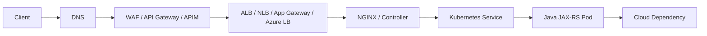

# Part 057 — PR Review and Architecture Decision Checklist

> Goal: setelah menyelesaikan part ini, Anda punya checklist praktis untuk membaca PR, ADR, design doc, Terraform change, Helm values change, Kubernetes manifest, SDK integration, network change, identity change, secret/config change, dan production readiness review yang menyentuh AWS/Azure.

Part ini bukan daftar pertanyaan administratif. Ini adalah **review framework** untuk mencegah perubahan cloud/platform/application menjadi production incident.

Dalam enterprise Java/JAX-RS system, banyak incident tidak berasal dari bug business logic murni. Akar masalah sering berada di batas antar-layer:

- DNS record benar, tetapi private DNS zone tidak ter-link ke VPC/VNet yang menjalankan workload.
- IAM/RBAC tampak benar di console, tetapi runtime pod memakai service account/managed identity yang berbeda.
- Load balancer healthy di satu AZ, tetapi subnet atau route table membuat sebagian traffic blackhole.
- SDK retry default memperbesar incident dependency menjadi thread pool exhaustion.
- Secret rotation sukses di secret manager, tetapi aplikasi tidak reload atau connection pool masih memakai credential lama.
- Terraform plan terlihat kecil, tetapi replacement resource mengubah endpoint, IP, target group, certificate, atau security boundary.
- Observability tersedia, tetapi tidak ada correlation ID dari gateway sampai pod sampai broker.

PR review senior harus membaca perubahan sebagai **perubahan sistem**, bukan hanya perubahan file.

---

## 1. Core Mental Model

Setiap perubahan cloud harus direview melalui lima pertanyaan inti:

1. **Boundary apa yang berubah?**
   - Account/subscription?
   - VPC/VNet?
   - Subnet?
   - Security group/NSG?
   - IAM role/RBAC assignment?
   - Kubernetes namespace/service account?
   - Public/private exposure?

2. **Traffic path apa yang berubah?**
   - Client → DNS → WAF/gateway → load balancer → ingress → service → pod?
   - Pod → cloud service?
   - Pod → database/broker/cache?
   - Cloud → on-prem?
   - On-prem → private endpoint?

3. **Identity path apa yang berubah?**
   - Human operator identity?
   - CI/CD identity?
   - Kubernetes workload identity?
   - Cloud SDK runtime credential?
   - Cross-account/cross-subscription access?

4. **Failure mode apa yang baru muncul?**
   - Access denied?
   - DNS wrong answer?
   - Private endpoint unreachable?
   - Health check unhealthy?
   - SDK timeout?
   - Retry storm?
   - Quota limit?
   - Cost spike?
   - Data leakage?

5. **Evidence apa yang tersedia saat incident?**
   - Metrics?
   - Logs?
   - Traces?
   - Audit log?
   - Flow logs?
   - Deployment history?
   - Terraform plan?
   - Rollback path?

Review yang kuat tidak hanya bertanya “apakah config benar?”. Review yang kuat bertanya “saat config ini salah, bagaimana kita tahu dan bagaimana kita pulih?”.

---

## 2. Scope of Changes That Require Cloud Architecture Review

Tidak semua PR butuh review arsitektur mendalam. Tetapi PR berikut wajib dinaikkan level review-nya:

### 2.1 Network-impacting change

Contoh:

- VPC/VNet/subnet/route table/UDR berubah.
- Security group/NSG/firewall rule berubah.
- NAT Gateway/proxy/firewall path berubah.
- Private endpoint/VPC endpoint berubah.
- DNS zone/record/resolver/forwarder berubah.
- Ingress/load balancer/API gateway berubah.

Risiko utama:

- Public exposure tidak sengaja.
- Private dependency tidak reachable.
- Cross-AZ/cross-region data transfer meningkat.
- DNS split-horizon memberikan IP yang salah.
- Pod egress keluar via NAT padahal seharusnya private endpoint.

### 2.2 Identity-impacting change

Contoh:

- IAM role policy/trust policy berubah.
- Azure role assignment berubah.
- Service principal/managed identity berubah.
- Kubernetes service account annotation berubah.
- IRSA/Azure Workload Identity berubah.
- CI/CD OIDC federation berubah.
- Key Vault/Secrets Manager policy berubah.

Risiko utama:

- Runtime workload tidak bisa access dependency.
- Privilege terlalu luas.
- Trust relationship salah audience/issuer/subject.
- Human/CI/CD identity punya akses production terlalu besar.
- Audit evidence tidak bisa menjelaskan siapa melakukan apa.

### 2.3 Data-impacting change

Contoh:

- Object storage bucket/container policy berubah.
- Database private access/backup/replica/parameter berubah.
- Kafka/RabbitMQ/Redis config berubah.
- Encryption key berubah.
- Retention lifecycle berubah.
- Signed URL/SAS/presigned URL behavior berubah.

Risiko utama:

- Data exposure.
- Data loss.
- Restore gagal.
- Consumer lag meningkat.
- Cache consistency rusak.
- Expiring link terlalu panjang atau terlalu pendek.

### 2.4 Runtime-impacting change

Contoh:

- Kubernetes deployment values berubah.
- Resource request/limit berubah.
- HPA/KEDA/autoscaling berubah.
- JVM memory setting berubah.
- SDK timeout/retry berubah.
- Thread pool/connection pool berubah.
- Health check path berubah.

Risiko utama:

- Pod OOMKilled.
- Readiness probe flap.
- Retry storm.
- Connection pool exhaustion.
- Tail latency naik.
- Autoscaling terlambat.

### 2.5 Operational-impacting change

Contoh:

- Alert rule berubah.
- Log retention berubah.
- Dashboard berubah.
- Deployment pipeline berubah.
- Terraform backend/state berubah.
- GitOps sync policy berubah.
- Rollback policy berubah.

Risiko utama:

- Incident tidak terdeteksi.
- Evidence hilang.
- Rollback sulit.
- Manual drift tidak terlihat.
- Production deploy sulit diaudit.

---

## 3. Review Algorithm

Gunakan alur ini saat membaca PR/ADR.

### Step 1 — Classify the change

Tandai area yang tersentuh:

```text
[ ] Networking
[ ] DNS
[ ] Load balancing / ingress / API gateway
[ ] Private connectivity
[ ] IAM / RBAC / workload identity
[ ] Secret / config / key / certificate
[ ] Object storage / database / broker / cache
[ ] Kubernetes runtime
[ ] SDK integration
[ ] Observability
[ ] CI/CD / IaC / GitOps
[ ] Cost / capacity
[ ] Security / privacy / compliance
[ ] Backup / DR / resilience
[ ] Hybrid / on-prem
```

Jika lebih dari tiga area tersentuh, treat sebagai architecture review, bukan normal PR review.

### Step 2 — Draw the before/after path

Minimal gambarkan:



Untuk PR kecil, diagram bisa berupa comment singkat. Untuk ADR, diagram harus eksplisit.

### Step 3 — Identify the runtime identity

Jangan cukup melihat policy. Tanyakan:

- Workload mana yang memakai permission ini?
- Pod memakai service account apa?
- Di AWS, service account tersebut map ke IAM role mana?
- Di Azure, workload identity atau managed identity mana yang dipakai?
- Credential provider chain akan memilih credential dari mana?
- CI/CD identity terpisah dari runtime identity atau tidak?

### Step 4 — Confirm private/public boundary

Tanyakan:

- Apakah endpoint ini public atau private?
- Apakah DNS resolve ke private IP?
- Apakah route table/UDR mengarah ke private path?
- Apakah NAT/proxy dipakai secara sengaja?
- Apakah service bisa diakses dari subnet/namespace yang tidak seharusnya?

### Step 5 — Check failure mode and rollback

Untuk setiap perubahan, minta jawaban atas tiga hal:

```text
Failure mode:
Detection:
Rollback / mitigation:
```

Contoh:

```text
Failure mode: pod cannot read secret after Key Vault access policy change.
Detection: 5xx spike, startup failure, Key Vault 403, app logs secret-load failure.
Rollback: revert role assignment or redeploy previous identity binding.
```

### Step 6 — Check evidence

PR production-ready harus meninggalkan evidence:

- Terraform plan.
- Kubernetes diff.
- Policy diff.
- Test result.
- Smoke test.
- Dashboard/alert link.
- Rollback plan.
- Owner/approver.
- Known residual risk.

---

## 4. Cloud Networking Review Checklist

### 4.1 General questions

- CIDR berubah atau bertambah?
- Ada risiko overlap dengan on-prem, peer VPC/VNet, atau customer network?
- Subnet baru public atau private?
- Route table/UDR mengubah default route?
- NAT Gateway/firewall/proxy path berubah?
- Security group/NSG rule makin luas?
- Public IP baru dibuat?
- Private endpoint/VPC endpoint ditambahkan atau dihapus?
- Flow logs/Network Watcher diagnostic tersedia?

### 4.2 AWS-specific review

Periksa:

- VPC CIDR.
- Subnet public/private.
- Route table association.
- Internet Gateway route.
- NAT Gateway route.
- Security Group inbound/outbound.
- NACL inbound/outbound.
- VPC endpoint policy.
- Interface endpoint security group.
- Gateway endpoint route.
- Transit Gateway route table.
- Route 53 private hosted zone association.
- VPC Flow Logs.

Red flags:

- `0.0.0.0/0` inbound tanpa justifikasi kuat.
- NACL terlalu kompleks tanpa runbook.
- Interface endpoint dibuat tanpa private DNS.
- NAT Gateway menjadi satu-satunya egress untuk dependency besar.
- Route table berubah tetapi tidak ada impact analysis.

### 4.3 Azure-specific review

Periksa:

- VNet address space.
- Subnet delegation.
- Route table/UDR.
- NSG inbound/outbound.
- Application Security Group jika digunakan.
- Azure Firewall route.
- NAT Gateway association.
- Private Endpoint NIC.
- Private DNS Zone link.
- VNet peering.
- Virtual WAN route.
- Network Watcher flow logs/connection troubleshoot.

Red flags:

- NSG allow terlalu luas.
- UDR mengarahkan traffic ke firewall tanpa rule readiness.
- Private Endpoint dibuat tanpa DNS zone group.
- Private DNS Zone tidak ter-link ke VNet AKS.
- Public network access masih enabled tanpa justifikasi.

### 4.4 Java/JAX-RS impact

Perubahan networking dapat muncul sebagai:

- `ConnectTimeoutException`.
- `UnknownHostException`.
- TLS handshake failure.
- Database connection acquisition timeout.
- Kafka metadata fetch timeout.
- Redis connection refused.
- S3/Blob SDK timeout.
- Slow startup karena config/secret retrieval blocked.

Review harus memastikan aplikasi membedakan error network, DNS, TLS, auth, dan throttling di logs/metrics.

---

## 5. DNS Review Checklist

### 5.1 General DNS checks

- Record baru public atau private?
- FQDN berubah?
- TTL sesuai dengan failover behavior?
- CNAME chain terlalu panjang?
- Split-horizon DNS dipakai?
- DNS resolver path jelas?
- Kubernetes CoreDNS bisa resolve domain?
- On-prem resolver bisa resolve private endpoint?
- Private endpoint DNS record otomatis atau manual?

### 5.2 AWS checks

- Route 53 hosted zone type: public/private.
- Private hosted zone association ke VPC yang benar.
- Route 53 Resolver inbound/outbound endpoint.
- Resolver forwarding rule.
- Alias record ke ALB/NLB/API Gateway jika relevan.
- Health check/failover record jika digunakan.
- VPC DNS hostnames/resolution enabled.

### 5.3 Azure checks

- Azure DNS zone atau Private DNS Zone.
- Private DNS Zone link ke VNet.
- Private Endpoint DNS zone group.
- Azure Private Resolver jika digunakan.
- Conditional forwarding dari on-prem.
- Record auto-created vs manual.

### 5.4 DNS failure modes

- Pod resolve public IP padahal harus private IP.
- On-prem resolve private name ke NXDOMAIN.
- DNS cache masih menyimpan endpoint lama.
- CoreDNS overload.
- Private hosted zone tidak associated.
- Private DNS Zone tidak linked.
- CNAME mengarah ke endpoint yang sudah dihapus.

### 5.5 PR review question

Tanyakan:

> Dari pod production, FQDN ini resolve ke IP apa, lewat resolver mana, dan apakah IP tersebut sesuai dengan expected traffic path?

---

## 6. Load Balancer, Ingress, and API Gateway Review Checklist

### 6.1 General checks

- Entry point public atau private?
- Layer 4, Layer 7, atau API management?
- TLS termination di mana?
- Health check path benar?
- Timeout per layer konsisten?
- Header propagation aman?
- Source IP preservation dibutuhkan atau tidak?
- Access log enabled?
- WAF policy ada?
- Backend target registration benar?

### 6.2 AWS checks

- ALB vs NLB selection benar.
- Listener port/protocol.
- Listener rule priority.
- Target group target type: instance atau IP.
- Health check path/port/protocol.
- Cross-zone load balancing.
- ACM certificate.
- AWS Load Balancer Controller annotation.
- Security Group LB dan target.
- ALB/NLB access log.
- API Gateway private/public mode.
- Usage plan/throttling/auth jika API Gateway digunakan.

### 6.3 Azure checks

- Azure Load Balancer vs Application Gateway vs APIM.
- Public/private frontend.
- Backend pool.
- Health probe.
- Listener.
- Routing rule.
- TLS certificate.
- WAF policy.
- AGIC integration jika AKS.
- Diagnostic settings.
- APIM subscription/rate limit/JWT validation.

### 6.4 Failure modes

- 502: backend connection/protocol mismatch.
- 503: no healthy target.
- 504: timeout chain salah.
- TLS error: certificate/SNI mismatch.
- Sticky session menyebabkan uneven load.
- Health check path tidak merepresentasikan readiness.
- Gateway timeout lebih pendek dari app timeout.

### 6.5 PR review question

> Jika request ini gagal 502/503/504, layer mana yang pertama memberi evidence dan dashboard/log mana yang menunjukkan penyebabnya?

---

## 7. Private Endpoint and Private Connectivity Review Checklist

### 7.1 General checks

- Dependency diakses via private endpoint atau public endpoint?
- DNS resolve ke private IP?
- Route menuju private endpoint tersedia?
- Security group/NSG/firewall allow dari source workload?
- Public network access disabled jika required?
- Endpoint policy membatasi resource yang boleh diakses?
- On-prem path tested?
- Cost/latency impact dipahami?

### 7.2 AWS checks

- Interface Endpoint untuk service yang benar.
- Gateway Endpoint untuk S3/DynamoDB jika relevan.
- Endpoint policy least privilege.
- Security Group pada interface endpoint.
- Private DNS enabled.
- Route table association untuk gateway endpoint.
- PrivateLink service/consumer account jika cross-account.

### 7.3 Azure checks

- Private Endpoint resource target benar.
- Private Endpoint NIC subnet benar.
- Private DNS Zone group configured.
- Private DNS Zone linked ke VNet workload.
- Public network access setting.
- NSG/Firewall rule.
- Private Link approval state.

### 7.4 Failure modes

- Endpoint ada, tetapi DNS masih public.
- DNS private benar, tetapi route/firewall block.
- Workload identity benar, tetapi endpoint policy deny.
- On-prem DNS tidak resolve private endpoint.
- Cross-region private endpoint expectation salah.
- Private endpoint dibuat di VNet yang tidak reachable dari AKS/EKS.

### 7.5 PR review question

> Bukti apa yang menunjukkan traffic dari pod ke dependency benar-benar lewat private path, bukan lewat internet/NAT?

---

## 8. IAM, RBAC, and Workload Identity Review Checklist

### 8.1 General checks

- Principal runtime jelas?
- Permission least privilege?
- Trust relationship benar?
- Scope minimal?
- Human identity dan workload identity dipisah?
- CI/CD identity dan runtime identity dipisah?
- Temporary credential digunakan?
- Static secret dihindari?
- Audit log bisa menunjukkan actor?

### 8.2 AWS checks

- IAM role name.
- Trust policy principal/condition.
- IRSA service account subject.
- Permission policy action/resource.
- Condition key.
- Permission boundary jika digunakan.
- Resource-based policy.
- Cross-account access.
- CloudTrail event.
- Access Analyzer finding.

Red flags:

- `Action: "*"` atau `Resource: "*"` tanpa boundary.
- Trust policy terlalu luas.
- IAM user digunakan untuk workload runtime.
- Static access key di Kubernetes Secret.
- Role dipakai lintas environment.

### 8.3 Azure checks

- Managed identity atau service principal.
- Role assignment scope.
- Built-in role vs custom role.
- Federated identity credential subject/issuer/audience.
- AKS workload identity annotation.
- Key Vault access model.
- Activity Log.
- PIM jika privileged access.

Red flags:

- Contributor di subscription untuk workload.
- Role assignment di scope terlalu tinggi.
- Service principal secret long-lived.
- Managed identity shared terlalu luas.
- Federated credential subject wildcard tidak terkendali.

### 8.4 Java/JAX-RS impact

SDK credential chain harus predictable. Review harus menjawab:

- Di local dev, credential dari mana?
- Di CI/CD, credential dari mana?
- Di EKS/AKS, credential dari mana?
- Saat credential expired, SDK refresh otomatis atau aplikasi gagal?
- Error AccessDenied dipetakan sebagai dependency failure, bukan 500 generik tanpa context?

### 8.5 PR review question

> Principal runtime yang sebenarnya apa, permission minimum apa yang dibutuhkan, dan audit event mana yang membuktikan access tersebut?

---

## 9. Secret, Config, Key, and Certificate Review Checklist

### 9.1 Config checks

- Config bukan secret.
- Config source jelas.
- Environment label benar.
- Config versioned.
- Runtime reload behavior aman.
- Cache TTL masuk akal.
- Safe default tersedia.
- Rollback config tersedia.
- Drift detection ada.

### 9.2 Secret checks

- Secret manager digunakan.
- Secret tidak ada di repo, image, env dump, atau log.
- Access policy least privilege.
- Rotation policy jelas.
- Application reload behavior jelas.
- Secret cache TTL aman.
- Kubernetes Secret/CSI/external secret behavior dipahami.
- Audit log tersedia.

### 9.3 Key/certificate checks

- CMK/customer-managed key required atau tidak.
- Key policy/RBAC benar.
- Key rotation behavior dipahami.
- Certificate issuer jelas.
- Certificate renewal otomatis atau runbook.
- TLS termination chain jelas.
- Expiry alert ada.

### 9.4 Failure modes

- Secret rotated, app masih memakai old connection.
- Key disabled, object/database tidak bisa decrypt.
- Certificate expired, TLS handshake gagal.
- Config reload merusak runtime tanpa deployment.
- Secret mounted as file berubah, tetapi app tidak re-read.

### 9.5 PR review question

> Jika secret/key/certificate/config ini berubah tengah hari di production, aplikasi mendeteksi, reload, fail safe, atau mati?

---

## 10. Object Storage Review Checklist

### 10.1 General checks

- Bucket/container private by default?
- Access policy least privilege?
- Encryption enabled?
- Versioning diperlukan?
- Lifecycle policy sesuai retention?
- Presigned URL/SAS TTL aman?
- Upload/download streaming?
- Metadata tidak berisi PII berlebihan?
- Event notification reliable?
- Restore/archive behavior dipahami?

### 10.2 AWS checks

- S3 Block Public Access.
- Bucket policy.
- IAM role permission.
- KMS key.
- VPC endpoint policy.
- Lifecycle rule.
- Versioning.
- Multipart upload cleanup.
- Server access log/CloudTrail data events jika required.

### 10.3 Azure checks

- Storage account public access setting.
- Container access level.
- Azure RBAC/SAS policy.
- Private Endpoint.
- Encryption/key setting.
- Lifecycle management.
- Blob versioning/soft delete.
- Diagnostic settings.

### 10.4 Java/JAX-RS impact

- Jangan buffer file besar di heap.
- Gunakan streaming upload/download.
- Validasi `Content-Type` dan `Content-Length`.
- Gunakan bounded timeout.
- Implementasikan cleanup untuk multipart/temporary file.
- Jangan log object key yang mengandung PII/customer data.

### 10.5 PR review question

> Apakah file path ini aman dari public exposure, memory pressure, broken upload, stale link, dan retention/compliance violation?

---

## 11. SDK Integration Review Checklist

### 11.1 General checks

- SDK version jelas.
- Credential provider chain predictable.
- Region/endpoint explicit.
- Private endpoint behavior tested.
- Timeout configured.
- Retry configured.
- Backoff/jitter digunakan.
- Pagination handled.
- Throttling handled.
- Error classification jelas.
- Metrics/logging ada.
- Thread pool tidak unbounded.

### 11.2 AWS SDK checks

- Region provider.
- Credential provider chain.
- STS/AssumeRole jika ada.
- Endpoint override jika private/local.
- HTTP client config.
- Retry strategy.
- S3 multipart handling jika relevan.

### 11.3 Azure SDK checks

- `DefaultAzureCredential` behavior dipahami.
- Managed identity client ID jika user-assigned.
- Endpoint configured.
- HTTP pipeline.
- Retry policy.
- Timeout policy.
- Diagnostic logging.

### 11.4 Failure modes

- SDK mencoba credential local/dev yang salah.
- Region mismatch.
- Private endpoint DNS salah.
- Retry memperburuk throttling.
- Pagination hanya mengambil page pertama.
- Async client memakai executor tidak terkendali.
- Error cloud dipetakan ke HTTP 500 tanpa classification.

### 11.5 PR review question

> Dalam kondisi dependency lambat/throttled/down, apakah SDK call ini bounded, observable, idempotent, dan tidak memakan seluruh worker thread?

---

## 12. Observability Review Checklist

### 12.1 Signals

Minimal harus ada:

- Request rate.
- Error rate.
- Latency percentiles.
- Saturation.
- Dependency latency.
- Dependency error.
- Retry count.
- Throttling count.
- Queue lag.
- Connection pool usage.
- JVM memory/GC.
- Pod restart/OOMKilled.

### 12.2 Logs

Periksa:

- Structured logs.
- Correlation ID.
- Tenant/customer identifier sesuai privacy policy.
- Error code classification.
- No secret/PII leakage.
- Log volume acceptable.
- Retention sesuai requirement.

### 12.3 Traces

Periksa propagation:

- HTTP ingress.
- Service-to-service call.
- Kafka/RabbitMQ publish/consume.
- Database call.
- Redis call.
- Cloud SDK call.

### 12.4 Alerts

Periksa:

- Alert actionable.
- Threshold berbasis SLO jika bisa.
- Alert memiliki owner.
- Alert punya runbook.
- Noise level diketahui.
- No alert for unimportant symptom without action.

### 12.5 PR review question

> Saat perubahan ini gagal di production, sinyal pertama apa yang akan berbunyi dan siapa yang menerima alert-nya?

---

## 13. Cost Review Checklist

### 13.1 Cost drivers

Periksa apakah PR menambah atau mengubah:

- NAT Gateway.
- Load balancer.
- Cross-AZ traffic.
- Cross-region traffic.
- Log ingestion.
- Metrics cardinality.
- Object storage lifecycle.
- Database/broker/Redis tier.
- Node pool size.
- Autoscaling threshold.
- Private endpoint count.
- Data transfer path.

### 13.2 Kubernetes-specific cost

- Request/limit terlalu tinggi?
- HPA threshold realistis?
- Idle replicas banyak?
- Spot node digunakan untuk workload yang tepat?
- Pod anti-affinity menyebabkan overprovisioning?
- Log volume per pod terkendali?

### 13.3 PR review question

> Cost driver baru apa yang muncul, apakah ada tag/cost allocation, dan bagaimana kita tahu jika cost melonjak setelah deploy?

---

## 14. Resilience and DR Review Checklist

### 14.1 Resilience checks

- Multi-AZ dependency?
- Single point of failure?
- Retry bounded?
- Circuit breaker?
- Timeout chain?
- Graceful degradation?
- Idempotency?
- Backpressure?
- Dependency isolation?
- Quota monitoring?

### 14.2 DR checks

- Backup exists?
- Restore tested?
- RPO/RTO known?
- DNS cutover plan?
- Dependency startup order?
- Data consistency concern?
- Failback plan?
- DR evidence available?

### 14.3 PR review question

> Apakah perubahan ini memperbaiki atau memperburuk blast radius, RPO, RTO, dan graceful degradation?

---

## 15. Security, Privacy, and Compliance Review Checklist

### 15.1 Security checks

- Least privilege.
- No public exposure without approval.
- Private endpoint where required.
- Encryption in transit.
- Encryption at rest.
- Secret rotation.
- Audit logs.
- WAF/rate limit if public.
- Vulnerability scanning.
- Image digest/signing if required.

### 15.2 Privacy checks

- No PII in logs.
- No PII in object metadata unless approved.
- Data retention aligned.
- Data residency considered.
- Access path auditable.
- Export/download links expire.

### 15.3 Compliance checks

- Evidence available.
- Change approval captured.
- Audit trail enabled.
- Policy-as-code not bypassed.
- Resource tags complete.
- Ownership clear.

### 15.4 PR review question

> Jika auditor asks “who accessed what data through which identity and network path?”, can we answer from logs and policy evidence?

---

## 16. CI/CD, IaC, and GitOps Review Checklist

### 16.1 CI/CD checks

- Build reproducible?
- Image pushed to correct registry?
- Image tag/digest strategy correct?
- Promotion path explicit?
- Approval required for production?
- CI/CD cloud identity federated, not static key?
- Secretless deployment?
- Smoke test exists?
- Rollback command known?

### 16.2 Terraform/IaC checks

- Terraform plan attached.
- Replacement resources identified.
- State backend correct.
- Locking enabled.
- Secret not written to state.
- Module version pinned.
- Drift considered.
- `destroy` risk guarded.
- Import/migration plan if taking over existing resource.

### 16.3 GitOps checks

- Desired state correct.
- Sync wave/order correct.
- Health check meaningful.
- Manual drift not expected.
- Secret integration correct.
- Rollback via Git revert possible.
- Argo/Flux sync behavior understood.

### 16.4 PR review question

> Apakah perubahan ini bisa dipromosikan, diobservasi, dan di-rollback tanpa manual console surgery?

---

## 17. ADR Review Template

Gunakan template ini untuk keputusan cloud yang signifikan.

```md
# ADR: <decision title>

## Status
Proposed | Accepted | Superseded | Deprecated

## Context
What problem are we solving?
What production constraint exists?
What cloud/platform boundary is involved?

## Decision
What are we choosing?
What AWS/Azure/Kubernetes resources are involved?

## Options Considered
1. Option A
2. Option B
3. Option C

## Decision Drivers
- Security
- Networking
- Identity
- Reliability
- Operability
- Cost
- Compliance
- Team ownership

## Consequences
Positive:
Negative:
Operational burden:
Failure modes introduced:

## Runtime Path
Client path:
Pod-to-dependency path:
Identity path:
DNS path:

## Rollout Plan
Dev/test:
Staging:
Production:
Rollback:

## Observability
Metrics:
Logs:
Traces:
Alerts:
Dashboards:

## Security and Compliance
IAM/RBAC:
Network exposure:
Secrets/keys:
Audit evidence:
Data handling:

## Internal Verification Checklist
- <item>
```

---

## 18. PR Comment Patterns

### 18.1 When IAM is too broad

```md
This policy appears broader than the runtime need. Can we narrow:

- actions to the exact service operations used by the Java service,
- resources to the target bucket/secret/queue/topic/database scope,
- conditions to the expected account/subscription/environment where possible?

Also please include the runtime principal evidence: Kubernetes ServiceAccount → IAM role / managed identity → policy assignment.
```

### 18.2 When DNS/private endpoint is unclear

```md
Can you add evidence for the DNS/private path?

Expected answer:
- FQDN used by the application
- resolution result from inside the pod
- private IP expected
- private hosted zone / Private DNS Zone association
- endpoint/subnet/security group or NSG involved
- fallback behavior if DNS returns public endpoint
```

### 18.3 When SDK timeout/retry is missing

```md
This SDK integration needs explicit timeout/retry behavior before production.

Please include:
- connection timeout
- request/read timeout
- retry max attempts
- backoff/jitter strategy
- throttling handling
- metrics/logging for dependency failures
- idempotency behavior for write operations
```

### 18.4 When observability is missing

```md
This changes a production dependency path but does not add enough observability.

Please include the metric/log/trace evidence we will use for:
- success rate
- latency percentiles
- dependency error class
- throttling
- retry count
- timeout count
- correlation ID from ingress to backend
```

### 18.5 When rollback is vague

```md
Rollback needs to be executable, not just “revert PR”.

Please clarify:
- whether resource replacement occurs
- whether endpoint/DNS/certificate changes are involved
- whether data migration is reversible
- whether old and new versions can run in parallel
- exact rollback order
- expected validation after rollback
```

---

## 19. Red Flags That Should Block Production Merge

Block or escalate if any of these are present:

- Public exposure added without security review.
- IAM/RBAC wildcard permission without boundary.
- Static cloud credentials added to repo, image, or Kubernetes Secret.
- Private endpoint added without DNS validation.
- Route table/UDR changed without traffic path analysis.
- Security group/NSG opens broad inbound range.
- SDK call added without timeout.
- Retry added without max attempts/backoff/jitter.
- Object storage policy allows public access without explicit approval.
- Secret rotation enabled without application reload plan.
- Terraform plan includes resource replacement not acknowledged by author.
- GitOps auto-sync enabled for risky change without rollout/rollback plan.
- Log retention reduced without compliance sign-off.
- High-cardinality metric label added without cost review.
- Health check path changed without readiness semantics.
- No smoke test for critical dependency path.
- No owner for alert/runbook.

---

## 20. Definition of Production-Ready Cloud Change

A production-ready cloud change has these properties:

```text
[ ] Desired behavior is clear.
[ ] Before/after architecture is clear.
[ ] Runtime identity is clear.
[ ] Network path is clear.
[ ] DNS behavior is clear.
[ ] Public/private exposure is clear.
[ ] Failure modes are listed.
[ ] Detection signal exists.
[ ] Rollback/mitigation is executable.
[ ] Security/privacy impact reviewed.
[ ] Cost/capacity impact reviewed.
[ ] IaC/GitOps diff is reviewable.
[ ] Internal owner is clear.
[ ] Evidence is attached.
```

---

## 21. Internal Verification Checklist

Use this checklist inside CSG/team context. Do not assume any answer; verify with platform/SRE/security/backend team.

### Cloud account/subscription

- Which AWS account or Azure subscription owns this resource?
- Which environment does it represent?
- Is this shared services, network, app, sandbox, or production boundary?
- Who owns break-glass access?

### Network

- Current VPC/VNet diagram.
- Subnet map.
- Route table/UDR.
- Security Group/NSG.
- Firewall/NAT/proxy path.
- Public/private exposure inventory.
- Flow logs/Network Watcher availability.

### DNS

- Public/private hosted zone.
- Private DNS Zone / Route 53 private hosted zone link.
- Hybrid forwarding rule.
- CoreDNS config.
- Private endpoint DNS records.

### Kubernetes

- EKS/AKS cluster name.
- Namespace.
- ServiceAccount.
- Workload identity mapping.
- Ingress controller.
- Service type.
- Deployment values.
- HPA/PDB/resource limits.

### Identity

- IAM role / managed identity / service principal.
- Trust policy / federated identity credential.
- Permission policy / role assignment.
- Scope.
- Audit log source.

### Secrets/config

- Secret manager.
- Key Vault/Secrets Manager access policy.
- Config source.
- Rotation policy.
- Reload behavior.
- CSI/external secret usage.

### Observability

- Dashboard.
- Alert.
- Log query.
- Trace view.
- Correlation ID standard.
- Retention period.
- Incident examples.

### CI/CD/IaC/GitOps

- Pipeline.
- Cloud credential model.
- Terraform repo/module/state.
- Helm chart.
- GitOps repo.
- Approval process.
- Rollback process.

### Production operations

- Runbook.
- On-call owner.
- Escalation path.
- Incident notes.
- RCA action items.
- DR test evidence.

---

## 22. How to Use This Part in Daily Work

Use this part in four modes:

1. **PR review mode**
   - Scan changed files.
   - Classify affected boundaries.
   - Ask targeted blocking questions.

2. **ADR review mode**
   - Evaluate options and trade-offs.
   - Force explicit consequences.
   - Confirm operational ownership.

3. **Incident prevention mode**
   - Identify failure modes before deploy.
   - Add detection and rollback.
   - Reduce blast radius.

4. **Onboarding mode**
   - Use checklist to discover internal platform architecture.
   - Compare expected vs actual system behavior.
   - Build mental map of production.

---

## 23. Senior Engineer Questions to Ask

Ask these questions often:

- What boundary changes?
- What becomes public or private?
- Which identity is used at runtime?
- What DNS answer does the pod actually see?
- What happens when the dependency is slow, throttled, or down?
- Is the retry bounded?
- Is the operation idempotent?
- Can we observe the failure before users report it?
- Can we rollback without manual console edits?
- What cost driver changes?
- What audit evidence remains?
- What is the blast radius?
- What internal team owns this after merge?

---

## 24. Reference Anchors

Use vendor docs as anchors, not as a substitute for internal verification:

- AWS Well-Architected Framework: <https://docs.aws.amazon.com/wellarchitected/latest/framework/welcome.html>
- AWS Operational Excellence Pillar: <https://docs.aws.amazon.com/wellarchitected/latest/operational-excellence-pillar/welcome.html>
- AWS IAM best practices: <https://docs.aws.amazon.com/IAM/latest/UserGuide/best-practices.html>
- AWS PrivateLink: <https://docs.aws.amazon.com/vpc/latest/privatelink/what-is-privatelink.html>
- AWS Elastic Load Balancing: <https://docs.aws.amazon.com/elasticloadbalancing/>
- AWS EKS IRSA: <https://docs.aws.amazon.com/eks/latest/userguide/iam-roles-for-service-accounts.html>
- Azure Well-Architected Framework: <https://learn.microsoft.com/en-us/azure/well-architected/>
- Azure RBAC: <https://learn.microsoft.com/en-us/azure/role-based-access-control/overview>
- Azure Private Link: <https://learn.microsoft.com/en-us/azure/private-link/private-link-overview>
- Azure AKS Workload Identity: <https://learn.microsoft.com/en-us/azure/aks/workload-identity-overview>
- Kubernetes Services: <https://kubernetes.io/docs/concepts/services-networking/service/>

---

## 25. Key Takeaways

- PR review cloud tidak boleh hanya membaca syntax Terraform/YAML/Java.
- Review harus membaca boundary, traffic path, identity path, failure mode, evidence, cost, dan rollback.
- Perubahan kecil di DNS, IAM, private endpoint, route table, SDK retry, health check, atau secret rotation bisa menjadi incident besar.
- Checklist terbaik adalah checklist yang mengikat perubahan ke runtime behavior dan production evidence.
- Untuk konteks CSG/team, semua detail internal cloud harus diverifikasi; jangan mengarang account, subscription, VPC/VNet, identity, private endpoint, dashboard, pipeline, atau runbook.
